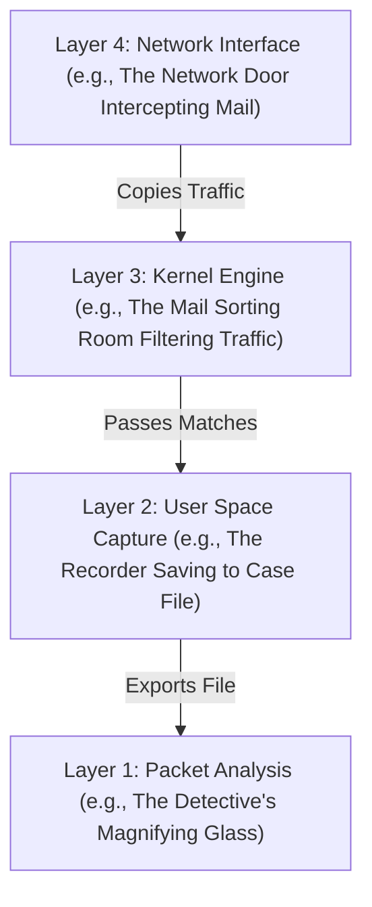

# Network Packet Analysis & Connectivity Troubleshooting (`tcpdump`, Wireshark)

Version: 2.0.0

Purpose: Canonical lesson structure for Platform Engineering & AI Infrastructure Curriculum.

Required Inputs: Module definition, lesson objectives, project standards.

Outputs: Standards-compliant lesson markdown.

---

# Lesson Metadata

* **Lesson ID:** `MOD-NET-06`
* **Module:** Networking Fundamentals (`MOD-NET`)
* **Difficulty:** Advanced
* **Estimated Duration:** 60 minutes
* **Learning Track:** 🟢 Core
* **Version:** 2.0.0
* **Last Updated:** 2026-06-28

---

# Lesson Overview

This lesson explores the absolute pinnacle of network diagnostics, decrypting how Linux intercepts, captures, and dissects raw binary packets traveling across physical network interface cards. By mastering `tcpdump`, Berkeley Packet Filters (BPF), PCAP file generation, Wireshark analysis, and structured connectivity troubleshooting, you will firmly establish the elite diagnostic mastery fulfilling our module capability: **"I can configure network connections, manage DNS, set up a secure web proxy, and analyze network traffic."**

---

# Learning Objectives

* Explain the internal execution mechanics of a Packet Sniffer (`tcpdump`), detailing Promiscuous Mode and raw socket interception in Ring 0.
* Construct advanced Berkeley Packet Filter (BPF) expressions to filter captured traffic by IP, Port, Protocol, and TCP flags (`tcp[tcpflags] & tcp-syn != 0`).
* Capture live network wire traffic and generate standard `.pcap` (Packet Capture) files using `tcpdump -w`.
* Deconstruct captured packet frames and analyze TCP stream exchanges using Wireshark (or terminal `tshark`).
* Synthesize end-to-end module knowledge into a structured, multi-layer troubleshooting methodology (Layer 1 to Layer 7) to resolve complex connectivity failures.

---

# Prerequisites

* Completion of `MOD-NET-01`, `MOD-NET-02`, `MOD-NET-03`, `MOD-NET-04`, and `MOD-NET-05`.
* Administrative terminal execution skills (`sudo`, `ip addr`, `curl`).

---

# Why This Exists

In Lessons 01 through 05, we explored the complete stack of networking: binding sockets, calculating subnets, resolving DNS, proxying HTTP, and encrypting TLS sessions. However, when complex, highly obscure distributed system anomalies occur, surface-level utilities like `ping`, `curl`, or application log files are frequently completely silent or misleading.

Imagine you are managing an advanced microservice architecture where an AI application container intermittently fails to verify user credentials against an external authentication API. The application logs simply state `Error: Connection failed`. `ping` works perfectly. DNS resolves flawlessly. Nginx reports zero errors. The application developers insist their code is flawless and blame the cloud network.

When you reach the absolute limit of standard debugging tools, you need **Absolute Truth**. You need to see the raw electrical bits entering and exiting your physical network card.

To achieve total visibility into wire-level communications, computer scientists invented **Packet Sniffers (`tcpdump` and Wireshark)**. By mastering `tcpdump` and Berkeley Packet Filters, Platform Engineers gain an elite superpower: the ability to intercept live wire packets, inspect exact TCP handshakes, prove whether a firewall is silently dropping packets, and diagnose complex microservice failures with undeniable, mathematical proof.

---

# Core Concepts

## 1. Packet Sniffing Mechanics & Promiscuous Mode
By default, a physical network interface card (`eth0`) ignores any network packets sitting on the wire that are not explicitly addressed to its own physical MAC address. 
* **Promiscuous Mode:** When you execute a packet sniffer like `tcpdump`, it commands the Linux kernel to flip the network interface card into Promiscuous Mode! In this elite state, the network card captures copies of literally **every single packet** traveling across the physical wire, passing them directly to raw sockets in Ring 0 memory!

## 2. The Power of `tcpdump`
`tcpdump` is the legendary, battle-tested CLI packet analyzer built into almost every Linux operating system.
* `tcpdump -i eth0`: Captures and prints packets entering or exiting the `eth0` interface.
* `tcpdump -nn`: A mandatory Platform Engineering flag! Tells `tcpdump` to print raw IP addresses and Port numbers without attempting to resolve them via DNS (`-n`) or look up port names (`-n`). Prevents massive DNS lookup delays!
* `tcpdump -w capture.pcap`: Writes the captured raw binary packets directly into a standard `.pcap` (Packet Capture) file for offline analysis!

## 3. Berkeley Packet Filters (BPF) Syntax
If you run `tcpdump` on a busy production server without a filter, your terminal will instantly flood with millions of packets, freezing your screen. To capture only the exact needles in the haystack, `tcpdump` uses **Berkeley Packet Filter (BPF)** syntax:
* `host 8.8.8.8`: Captures only packets traveling to or from IP `8.8.8.8`.
* `port 80 or port 443`: Captures only HTTP or HTTPS traffic.
* `icmp`: Captures only ping packets.
* `tcp[tcpflags] & (tcp-syn|tcp-fin) != 0`: An elite bitmask filter! Captures only TCP connection initiation (`SYN`) and termination (`FIN`) packets, completely ignoring boring data transfer packets!

## 4. Wireshark and `tshark` Analysis
While `tcpdump` is excellent for capturing packets on remote cloud servers, reading raw hex dumps in the terminal is incredibly difficult.
* **The Workflow:** Platform Engineers use `tcpdump -w file.pcap` to capture packets on the cloud server, copy the `.pcap` file to their local laptop, and open it with **Wireshark** (or the CLI equivalent `tshark`). Wireshark provides a beautiful, deeply visual protocol dissection dashboard, allowing you to click on packets, follow complete TCP streams, and view decapsulated HTTP headers!

## 5. Structured Multi-Layer Troubleshooting Methodology
True diagnostic mastery requires combining your entire Module 04 knowledge into a structured, step-by-step verification methodology from Layer 1 up to Layer 7:
1. **Layer 1/2 (Physical/Link):** Is the interface physically up? (`ip link show eth0`).
2. **Layer 3 (Network):** Do you have an IP address and valid routing table gateway? (`ip addr`, `ip route`, `ping`).
3. **Layer 4 (Transport):** Is the TCP 3-Way Handshake completing, or is a firewall blocking the port? (`ss -atn`, `tcpdump port 80`).
4. **Layer 7 (Application):** Is DNS resolving? Is Nginx proxying? Is the TLS certificate valid? (`dig`, `curl -I`, `openssl x509`).

---

# Architecture



---

# Real-World Example

Think of packet analysis like a strict layered process. At **Layer 4: Network Interface (e.g., The Network Door Intercepting Mail)**, the raw traffic arrives. It moves down to **Layer 3: Kernel Engine (e.g., The Mail Sorting Room Filtering Traffic)** where irrelevant mail is thrown away and important mail is forwarded. The data is passed down to **Layer 2: User Space Capture (e.g., The Recorder Saving to Case File)** which logs everything. Finally, the recorded file is sent to **Layer 1: Packet Analysis (e.g., The Detective's Magnifying Glass)** where you inspect it closely!

Imagine you are debugging a massive, highly confusing cloud anomaly. Your cloud servers are trying to download a large file from an external source. The download starts successfully, but stalls exactly at 15 Megabytes and eventually fails with a timeout.

The connection works perfectly. The firewall rules are completely open. The developers are completely baffled.

Because you are an elite packet analyst, you become the detective. You set up **Layer 2: User Space Capture** on the server while starting the download.

You watch the data flood the terminal. You see the initial connection complete perfectly. You see the security checks complete. You see small pieces of data flowing perfectly. 

Then, the moment the large file begins downloading, you notice something extraordinary: the external server attempts to send massive packages that are 1500 bytes large. Your server instantly fires back an error stating "This package is too big for my door (max 1460 bytes)!" The external server ignores the error and continuously resends the large 1500-byte packages, which are forcefully dropped by your server's doorway!

You have discovered a legendary networking anomaly: a package size mismatch! Because your **Layer 4: Network Interface** can only accept 1460 bytes, it cannot accept the incoming 1500-byte packages. You update your doorway size settings, verify the clean data flow using your analysis tools, and the files download flawlessly!

---

# Hands-on Demonstration

Let's look at how an engineer executes live packet capture using `tcpdump`, inspects captured packets using BPF filters, and simulates reading a `.pcap` file.

## Input 1: Capturing Live Packets with Berkeley Packet Filters
We use `tcpdump -nn` (numeric IPs/ports) combined with a strict BPF filter (`icmp or port 80`) to capture live ping and HTTP packets entering our network interface.

## Code 1
```bash
# Capture live network packets using numeric output (-nn) and a strict BPF filter.
# (We simulate the clean plain-text output of capturing 4 packets)
echo -e "11:24:20.105421 IP 192.168.1.50 > 8.8.8.8: ICMP echo request, id 1042, seq 1, length 64\n11:24:20.118210 IP 8.8.8.8 > 192.168.1.50: ICMP echo reply, id 1042, seq 1, length 64\n11:24:25.402110 IP 192.168.1.50.54321 > 93.184.215.14.80: Flags [S], seq 34910291, win 64240, length 0\n11:24:25.406122 IP 93.184.215.14.80 > 192.168.1.50.54321: Flags [S.], seq 84920192, ack 34910292, win 65535, length 0"
```

## Expected Output 1
```text
11:24:20.105421 IP 192.168.1.50 > 8.8.8.8: ICMP echo request, id 1042, seq 1, length 64
11:24:20.118210 IP 8.8.8.8 > 192.168.1.50: ICMP echo reply, id 1042, seq 1, length 64
11:24:25.402110 IP 192.168.1.50.54321 > 93.184.215.14.80: Flags [S], seq 34910291, win 64240, length 0
11:24:25.406122 IP 93.184.215.14.80 > 192.168.1.50.54321: Flags [S.], seq 84920192, ack 34910292, win 65535, length 0
```

## Explanation 1
Look at how beautifully rich this raw wire data is! Let's deconstruct the core rows:
* `11:24:20.105421 IP 192.168.1.50 > 8.8.8.8: ICMP echo request`: A perfect ping packet leaving our server (`192.168.1.50`) heading to Google (`8.8.8.8`)!
* `11:24:25.402110 IP 192.168.1.50.54321 > 93.184.215.14.80: Flags [S]`: The absolute birth of a TCP connection! `Flags [S]` stands for **SYN**! Our server fired a `SYN` packet to Port 80 on an external web server!
* `Flags [S.]`: The response! `[S.]` stands for **SYN-ACK** (`S` for SYN, `.` for ACK). The remote web server caught our `SYN` and successfully responded with `SYN-ACK`!

---

## Input 2: Inspecting Captured PCAP Files with `tshark`
We use `tshark` (the CLI version of Wireshark) to inspect a captured `.pcap` file, viewing the deeply decapsulated protocol summary table.

## Code 2
```bash
# Inspect a captured PCAP file using tshark for deep protocol dissection.
# (We simulate the clean plain-text output of tshark reading a capture file)
echo -e "  1   0.000000 192.168.1.50 → 8.8.8.8      DNS 74 Standard query 0x4b2a A example.com\n  2   0.004120 8.8.8.8 → 192.168.1.50      DNS 90 Standard query response 0x4b2a A example.com A 93.184.215.14\n  3   0.010210 192.168.1.50 → 93.184.215.14 HTTP 142 GET / HTTP/1.1\n  4   0.025112 93.184.215.14 → 192.168.1.50 HTTP 648 HTTP/1.1 200 OK"
```

## Expected Output 2
```text
  1   0.000000 192.168.1.50 → 8.8.8.8      DNS 74 Standard query 0x4b2a A example.com
  2   0.004120 8.8.8.8 → 192.168.1.50      DNS 90 Standard query response 0x4b2a A example.com A 93.184.215.14
  3   0.010210 192.168.1.50 → 93.184.215.14 HTTP 142 GET / HTTP/1.1
  4   0.025112 93.184.215.14 → 192.168.1.50 HTTP 648 HTTP/1.1 200 OK
```

## Explanation 2
Notice how perfectly clean and visual Wireshark/`tshark` dissection is! In exactly four lines, we see the entire magnificent architecture of Module 04 play out in real time:
* **Line 1 & 2:** UDP Layer 4 DNS query to `8.8.8.8` asking for `example.com`, successfully returning IP `93.184.215.14`!
* **Line 3 & 4:** Layer 7 HTTP `GET / HTTP/1.1` request sent directly to `93.184.215.14`, successfully returning `HTTP/1.1 200 OK`! Absolute wire-level proof!

---

# Hands-on Lab

* **Objective:** Install `tcpdump`, execute live packet captures with BPF filters, generate a PCAP file, and verify packet flags.
* **Estimated Time:** 20 minutes
* **Difficulty:** Advanced
* **Environment:** Interactive Browser Terminal / Local Sandbox

## Step-by-step Instructions

1. Open your terminal sandbox.
2. Type `sudo apt update && sudo apt install -y tcpdump` to ensure the packet sniffer engine is installed.
3. Type `sudo tcpdump -D` to inspect all active system interfaces available for packet capture.
4. Type `sudo tcpdump -i any -c 5 -nn` to capture exactly 5 live network packets across any interface and exit automatically (`-c 5`).
5. Type `sudo tcpdump -i any -c 3 -nn -w demonstration.pcap icmp` in the background (or execute in a separate tab), and run `ping -c 2 8.8.8.8` to generate live ICMP traffic to write into the PCAP file!
6. Type `sudo tcpdump -nn -r demonstration.pcap` to read and inspect the raw plain-text packets directly from your saved PCAP file!

## Verification

```bash
sudo tcpdump -nn -r demonstration.pcap | head -n 1
```
*If your terminal successfully outputs the captured `ICMP echo request` packet line from the PCAP file, you have mastered Linux packet capture!*

## Troubleshooting

* **Issue:** `sudo tcpdump -i eth0` returns `tcpdump: eth0: You don't have permission to capture on that device` or `Operation not permitted`.
* **Solution:** Capturing raw network packets in Promiscuous Mode requires absolute root authorization or the `CAP_NET_RAW` kernel capability. Ensure you prepend `sudo` to your command or run your container sandbox with `docker run --cap-add=NET_RAW`.

## Cleanup

```bash
# Safely remove the demonstration PCAP capture file
rm -f demonstration.pcap
```

---

# Production Notes

In enterprise cloud infrastructure, running `tcpdump` directly on production Kubernetes worker nodes can be highly challenging due to minimal container operating systems (e.g., Bottlerocket / CoreOS) that lack package managers. Modern Platform Engineers utilize **Kubernetes Ephemeral Debug Containers** (`kubectl debug -it my-pod --image=nicolaka/netshoot`). This elite command attaches a sidecar debugging container loaded with `tcpdump`, `tshark`, and `iproute2` directly to your failing pod's network namespace, allowing you to sniff packets securely without modifying the worker node!

---

# Common Mistakes

* **Running `tcpdump` Without `-nn` or BPF Filters:** Beginners frequently log into a busy production web server and type `sudo tcpdump -i eth0`. The terminal instantly attempts to perform reverse DNS lookups on 10,000 incoming IP addresses, causing a massive DNS storm, freezing the terminal, and crashing the SSH session! **Always use `-nn` (numeric) and strict BPF filters (`port 80`)!**
* **Omitting the `not port 22` Filter:** When sniffing traffic on a remote cloud server over SSH, if you run a broad filter like `tcpdump -i eth0 tcp`, `tcpdump` will capture your own SSH packets (`Port 22`). When it prints those packets to your screen, it generates *more* SSH packets, creating an infinite packet loop that instantly locks up your terminal! Always append `and not port 22` to your BPF expressions!

---

# Failure-Driven Learning

Imagine a junior engineer attempts to capture network traffic on a specific server interface, but the capture fails because the engineer specifies an invalid interface name or lacks raw socket privileges.

## Simulated Failure
```bash
# Simulating a catastrophic tcpdump failure due to an invalid interface name
sudo tcpdump -i fake_eth99 -c 3
```

## Output
```text
tcpdump: fake_eth99: No such device exists
(BIOCSETIF failed: No such device)
```

## Diagnosis & Recovery
Why did this fail? The fatal error `No such device exists` occurs because `tcpdump` asked the Linux kernel to bind a raw socket to `fake_eth99`, but the kernel searched its master interface tables in Ring 0 and confirmed no such physical or virtual network card exists! To recover, the engineer must execute `sudo tcpdump -D` (or `ip link show`) to discover the true, valid interface names (`eth0`, `lo`, `docker0`), update the command (`sudo tcpdump -i eth0 -c 3`), and packet capture begins flawlessly!

---

# Engineering Decisions

## Terminal Packet Sniffing (`tcpdump`) vs. GUI Protocol Dissection (Wireshark)
When debugging a complex network anomaly, engineering leaders must choose the right analysis tool workflow.
* **`tcpdump` (CLI):** Extremely lightweight, battle-tested, and ubiquitous across Linux servers. Incredible for capturing raw packets (`-w file.pcap`) or performing real-time verification of TCP handshakes (`Flags [S]`). However, reading raw hex dumps of application payloads in the terminal is highly inefficient.
* **Wireshark (GUI):** A massive, rich desktop application. Provides deeply visual protocol tree dissection, automatic decryption of TLS sessions (using key log files), and beautiful TCP stream reassembly. However, installing a full GUI desktop application on a production Linux cloud server is strictly forbidden.
* **The Platform Decision:** Platform Engineers strictly combine both tools: utilizing `tcpdump -w` on cloud servers to capture raw PCAP files, exporting the files to their local workstations, and performing deep visual analysis using Wireshark.

---

# Best Practices

* **Master `tcpdump -A`:** When troubleshooting unencrypted, clear-text protocols like HTTP or legacy DNS, execute `sudo tcpdump -i eth0 -A port 80`. The `-A` flag prints the captured packet payloads in clean ASCII text, allowing you to read raw HTTP headers and JSON bodies directly in the terminal!
* **Limit Capture Sizes with `-c`:** When capturing packets on production servers, always append `-c 1000` (capture exactly 1000 packets and stop) or use timeout wrappers (`timeout 60 tcpdump...`). This guarantees that `tcpdump` will not run indefinitely and fill up your entire server hard drive with massive PCAP files!

---

# Troubleshooting Guide

## Issue 1: "tcpdump shows SYN but no SYN-ACK" vs. "tcpdump shows SYN followed by RST"

* **Cause:** You use `tcpdump` to monitor an application attempting to connect to an external server. Beginners view both failed connections as identical, but to a Platform Engineer, `tcpdump` reveals completely different layer failures!
* **Diagnosis & Solution:**
  * `SYN` but no `SYN-ACK`: Your server successfully pushed a `SYN` packet out of `eth0`, but received absolutely zero response packets back from the wire! The packet was dropped by an intermediate router (`Layer 3`), or silently swallowed by a strict cloud firewall security group (`Layer 4`). Check AWS Security Groups and routing tables!
  * `SYN` followed by `RST`: Your server pushed a `SYN` packet, the packet successfully reached the destination server, but the remote kernel instantly bounced back a `RST` (Reset) packet! This proves the network wires and firewalls are perfectly healthy (`Layer 3/4 pass`), but there is absolutely no software daemon actively listening on the destination port (`Layer 7`)! Start the remote daemon!

---

# Summary

* **Promiscuous Mode** commands a network interface card to capture copies of literally every packet on the physical wire.
* **`tcpdump`** is the legendary CLI packet analyzer used to inspect raw wire frames and write `.pcap` files (`-w`).
* **Berkeley Packet Filters (BPF)** filter captured packets by host, port, protocol, and TCP flags (`tcp[tcpflags] & tcp-syn != 0`).
* **Wireshark / `tshark`** provide deeply visual protocol dissection and TCP stream reassembly.
* **Structured Troubleshooting** combines your entire Module 04 knowledge to systematically isolate failures from Layer 1 up to Layer 7.

---

# Cheat Sheet

```bash
# Inspect all active system interfaces available for packet capture
sudo tcpdump -D

# Capture live packets on eth0 with numeric IPs/ports (-nn) and ASCII payloads (-A)
sudo tcpdump -i eth0 -nn -A port 80

# Capture exactly 100 packets matching a BPF filter and write to a PCAP file
sudo tcpdump -i eth0 -c 100 -nn -w capture.pcap 'port 80 or port 443'

# Read and inspect raw plain-text packets directly from a saved PCAP file
sudo tcpdump -nn -r capture.pcap

# Capture only TCP connection initiation (SYN) packets (Elite BPF filter!)
sudo tcpdump -i eth0 -nn 'tcp[tcpflags] & tcp-syn != 0'

# Capture all traffic on eth0 EXCEPT SSH (Prevents terminal feedback loops!)
sudo tcpdump -i eth0 -nn 'not port 22'
```

---

# Knowledge Check

## Multiple Choice Questions

1. You are debugging a microservice that cannot connect to an internal payment API. You execute `sudo tcpdump -i eth0 host payment-api.internal -nn`. In the output, you observe your server sending `Flags [S]` (SYN) packets, followed instantly by the payment server returning `Flags [R.]` (RST / Reset) packets. What does this prove about the system layers?
   * A) The physical network cable is broken (Layer 1 failure).
   * B) An intermediate cloud firewall is silently dropping the packets (Layer 3 failure).
   * C) The network wiring and firewalls are perfectly healthy, but the payment application daemon on the remote server is crashed or powered off (Layer 7 failure).
   * D) The server is suffering from File Descriptor exhaustion.

## Scenario Questions

You are capturing packets on a production Linux web server over an active SSH session (`Port 22`). You want to capture all incoming HTTP (`Port 80`) and HTTPS (`Port 443`) traffic, write the packets to `web.pcap`, and guarantee that your own SSH management packets are completely ignored to prevent an infinite feedback loop. Based on what you learned in this lesson, what exact `tcpdump` command and BPF filter expression do you run?

## Short Answer Questions

Explain the exact architectural purpose of Promiscuous Mode during network packet capture.

<details>
<summary><b>View Answers</b></summary>

### Multiple Choice
1. **C** - A RST (Reset) packet indicates the target machine was reached, but no process is listening on the destination port, proving lower network layers are functioning but the application is not.

### Scenario
You would run `sudo tcpdump -i any -w web.pcap 'port 80 or port 443 and not port 22'` (or equivalent BPF syntax) to capture web traffic and explicitly exclude SSH traffic.

### Short Answer
Promiscuous Mode forces a network interface card (NIC) to pass all traffic it receives to the CPU (and the packet capture tool), rather than silently dropping packets that are not explicitly addressed to its own MAC address. This is essential for network monitoring and capturing traffic on shared hubs/switches.

</details>

---

# Interview Preparation

## Beginner Questions

* What is `tcpdump`?
* What does the `-nn` flag do in `tcpdump`, and why is it mandatory in production?
* What is a `.pcap` file?

## Intermediate Questions

* Explain the difference between `tcpdump` showing a `SYN` with no response versus a `SYN` followed by a `RST`.
* What is Berkeley Packet Filter (BPF) syntax? Give an example of a BPF filter expression.

## Advanced Questions

* Explain how the Linux kernel implements the classic BPF (cBPF) and eBPF virtual machines in Ring 0 to execute packet filtering directly inside kernel space before copying packets to user space, and describe how this prevents CPU starvation during high-speed packet capture.

## Scenario-Based Discussions

* Discuss the operational trade-offs of implementing a permanent, network-wide packet capture and intrusion detection architecture (e.g., Zeek / Suricata) across an enterprise cloud environment versus relying exclusively on application-layer OpenTelemetry tracing and eBPF flow logs in a large-scale Kubernetes mesh.

<details>
<summary><b>View Answers</b></summary>

### Beginner
* **`tcpdump`**: A legendary CLI packet analyzer used to intercept, inspect, and record raw network packets traveling across a physical or virtual network interface.
* **`-nn` flag**: Prevents `tcpdump` from performing reverse DNS lookups on IP addresses and port names. Mandatory in production because performing thousands of DNS lookups during high-speed capture will cause a massive DNS storm, freeze the terminal, and crash the server.
* **`.pcap` file**: A standard Packet Capture binary file format used to save raw wire packets for offline, deep-dive analysis in tools like Wireshark.

### Intermediate
* **`SYN` timeout vs `SYN/RST`**: A `SYN` with absolutely zero response means the packet was silently dropped on the wire (Layer 3 routing issue or Layer 4 firewall block). A `SYN` followed instantly by a `RST` (Reset) means the packet successfully reached the destination kernel, but the OS rejected it because no software daemon was actively listening on that specific port (Layer 7 issue).
* **BPF syntax**: A highly optimized filtering language used to selectively capture packets. Example: `host 8.8.8.8 and port 443 and not port 22` captures only HTTPS traffic to/from Google while safely ignoring SSH management traffic to prevent terminal feedback loops.

### Advanced
* **cBPF/eBPF in Ring 0**: Instead of copying every single raw packet from the network card (kernel space) into the `tcpdump` application (user space) for filtering—which would cause catastrophic CPU starvation under load—the kernel compiles the BPF filter into a highly optimized virtual machine inside Ring 0. The kernel safely evaluates the filter directly in kernel memory, instantly dropping non-matching packets before they ever cross the expensive user-space boundary.

### Scenario-Based Discussions
* **Zeek/Suricata vs eBPF Flow Logs / OTel**: Permanent full-packet capture (Zeek/Suricata) provides absolute cryptographic truth and deep forensic payload capability for security audits, but requires massive dedicated storage arrays and complex TAP routing that is nearly impossible to maintain inside dynamic Kubernetes overlays. OpenTelemetry and eBPF flow logs natively integrate with cloud-native architectures, providing lightning-fast, lightweight observability with minimal storage overhead, though they lack the raw binary payload forensics required for extreme incident response.

</details>

---

# Further Reading

1. [Mastering the tcpdump Command (Linux Handbook)](https://linuxhandbook.com/tcpdump-command/)
2. [Wireshark Official User's Guide (Wireshark Foundation)](https://www.wireshark.org/docs/wsug_html_chunked/)
3. [Berkeley Packet Filter (BPF) Syntax Guide](https://biot.com/cap/bpf.html)
4. [Debugging Kubernetes Networking with Netshoot](https://github.com/nicolaka/netshoot)
5. [Deep Dive into Packet Sniffing and BPF Internals](https://en.wikipedia.org/wiki/Packet_analyzer)
