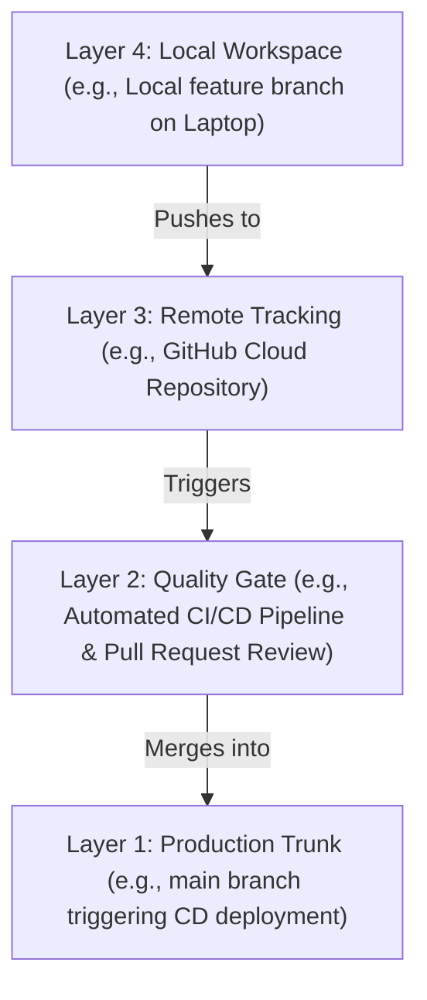

# Branching Strategies & Collaboration (Trunk-Based vs. GitFlow)

Version: 2.0.0

Purpose: Canonical lesson structure for Platform Engineering & AI Infrastructure Curriculum.

Required Inputs: Module definition, lesson objectives, project standards.

Outputs: Standards-compliant lesson markdown.

---

# Lesson Metadata

* **Lesson ID:** `MOD-GIT-02`
* **Module:** Version Control with Git (`MOD-GIT`)
* **Difficulty:** Beginner to Intermediate
* **Estimated Duration:** 50 minutes
* **Learning Track:** 🟢 Core
* **Version:** 2.0.0
* **Last Updated:** 2026-06-28

---

# Lesson Overview

This lesson explores the master collaboration architectures of modern software engineering, decrypting how engineering teams organize code branches to ship high-quality software to production without stepping on each other's toes. By mastering GitFlow, Trunk-Based Development, feature branching (`git checkout -b`), and remote synchronization (`git fetch`, `git pull`), you will firmly establish the essential collaboration capabilities supporting our module capability: **"I can track code changes, collaborate with engineering teams, resolve conflicts, and automate commit workflows."**

---

# Learning Objectives

* Contrast the structural mechanics of GitFlow (multi-branch hierarchical release model) with Trunk-Based Development (single master branch model).
* Explain the execution mechanics of remote branch tracking, detailing the relationship between local branches (`main`) and remote tracking branches (`origin/main`).
* Differentiate between `git fetch` (safe metadata synchronization) and `git pull` (fetch combined with an immediate automated merge).
* Create, switch, and publish feature branches using `git checkout -b` (or `git switch -c`) and `git push -u origin`.
* Explain the architectural purpose of Pull Requests (PRs) and Code Reviews in enterprise quality gates.

---

# Prerequisites

* Completion of `MOD-GIT-01` (Git Internal Tree Mechanics & Hash Objects).
* Foundational terminal version control skills (`git status`, `git branch`).

---

# Why This Exists

In Lesson 01, we explored how Git stores files as Blobs, directories as Trees, and snapshots as Commit Objects. However, having a highly debuggable local object database on your personal laptop is useless if you cannot coordinate changes with fifty other engineers working on the exact same codebase across the globe.

Imagine you are managing an enterprise cloud platform where twenty engineers are actively developing brand-new features, ten engineers are writing Terraform modules, and five Site Reliability Engineers are desperately trying to deploy an urgent security hotfix to production.

If all thirty-five engineers blindly commit their raw, untested code directly to the exact same branch on GitHub every five minutes without any branching strategy or review process, the codebase will instantly descend into absolute chaos. Half-finished features will collide with security hotfixes, production builds will break continuously, and deployment pipelines will grind to a complete halt.

To solve the monumental challenge of massive engineering coordination, engineering leaders invented **Branching Strategies (GitFlow and Trunk-Based Development)**. By mastering feature branching and remote synchronization, Platform Engineers can establish rigorous, automated CI/CD quality gates, ensure pristine production stability, and empower engineering teams to ship code with absolute confidence.

---

# Core Concepts

## 1. Local vs. Remote Tracking Branches
When you clone a repository from GitHub, your local Git database maintains two completely separate sets of branch pointers:
* **Local Branches (`main`):** The physical branch pointers sitting on your local laptop (`.git/refs/heads/main`). You can commit to these freely!
* **Remote Tracking Branches (`origin/main`):** Read-only bookmark pointers sitting on your laptop (`.git/refs/remotes/origin/main`) that remember exactly where the branch was on GitHub the last time your machine communicated with the remote server!

## 2. `git fetch` vs. `git pull` (The Synchronization Shuffle)
To keep your local repository synchronized with GitHub, you use two master commands:
* `git fetch origin`: The safe, non-destructive synchronization! It reaches out to GitHub, downloads all brand-new commit objects into `.git/objects`, and silently updates your remote tracking pointers (`origin/main`). It does **not** touch your active local branch or working directory!
* `git pull origin main`: The aggressive two-step combination! It first executes `git fetch origin`, and then instantly executes `git merge origin/main`, forcefully merging the remote changes directly into your active local working directory!

## 3. GitFlow (The Heavyweight Hierarchy)
GitFlow is a strict, legacy branching model designed for scheduled, milestone-based software releases (e.g., desktop software / mobile apps):
* **`main` Branch:** The immutable, highly pristine production release history. Every commit on `main` is strictly tagged with a version number (`v1.0.0`).
* **`develop` Branch:** The master integration branch where all upcoming features are merged.
* **Supporting Branches:** Features (`feature/login`), Releases (`release/v1.1`), and Hotfixes (`hotfix/log4j`). Features branch from `develop`; Hotfixes branch directly from `main`!
* **The Trade-off:** Highly structured and safe, but generates massive merge hell, complex branch maintenance, and significantly slows down deployment velocity.

```text
[main]    ──► (v1.0.0) ──────────────────────────────────► (v1.1.0)
                 │                                            ▲
[develop]        └──► (commit) ──► (merge feature) ───────────┘
                                       ▲
[feature]                              └──► (work) ──► (work) ┘
```

## 4. Trunk-Based Development (The Agile Engine)
Trunk-Based Development is the modern, high-velocity branching model strictly mandated by Platform Engineers for cloud-native applications and CI/CD pipelines:
* **`main` Branch (The Trunk):** A single master branch that is kept in a permanent state of **production readiness**. If code is on `main`, it is ready to deploy to production right now!
* **Short-Lived Feature Branches:** Engineers branch directly from `main` (`git checkout -b feature`), write their code in small batches, open a Pull Request (PR), and merge back into `main` within hours or days!
* **Feature Flags:** If a feature is only half-finished but needs to be merged into `main` to avoid branch divergence, developers hide the code behind a software toggle (Feature Flag), ensuring it remains dormant in production until fully ready!

```text
[main (Trunk)] ──► (commit) ──► (commit) ──► (merge PR) ──► (production deploy)
                      │                         ▲
[short-lived branch]  └──► (work) ──► (work) ───┘
```

## 5. Pull Requests (PRs) and Quality Gates
A **Pull Request** (or Merge Request) is not a native Git CLI concept; it is an elegant collaboration wrapper built by platforms like GitHub and GitLab.
* **The Quality Gate:** When an engineer finishes a feature branch, they open a PR. This triggers automated CI/CD pipeline checks (unit tests, Terraform validations, security scans) and mandates mandatory peer code reviews before the code is legally allowed to merge into `main`!

---

# Architecture



---

# Real-World Example

Think of team collaboration in Git as a simple, four-layered assembly line.

It begins at **Layer 4: Local Workspace (e.g., Local feature branch on Laptop)**, where you write and test your new code changes in complete isolation.

When ready, you push your work up to **Layer 3: Remote Tracking (e.g., GitHub Cloud Repository)**, allowing the rest of the team and automated systems to see your proposed changes.

This automatically triggers **Layer 2: Quality Gate (e.g., Automated CI/CD Pipeline & Pull Request Review)**, where robots test for spelling and grammar, and human reviewers ensure the logic makes sense.

Once approved, the code drops into **Layer 1: Production Trunk (e.g., main branch triggering CD deployment)**, merging seamlessly with everyone else's work to update the live product!

---

# Hands-on Demonstration

Let's look at how an engineer inspects local and remote tracking branches using `git branch -a`, creates and switches feature branches using `git switch -c`, and simulates syncing remote metadata using `git fetch`.

## Input 1: Inspecting Local and Remote Tracking Branches
We use `git branch -a` (all branches) to inspect our active local branches and our read-only remote tracking bookmark pointers.

## Code 1
```bash
# Inspect all local branches and remote tracking branches.
# (We simulate the clean plain-text output of a synchronized repository)
git branch -a 2>/dev/null || echo -e "* main\n  remotes/origin/main\n  remotes/origin/feature/ai-proxy"
```

## Expected Output 1
```text
* main
  remotes/origin/main
  remotes/origin/feature/ai-proxy
```

## Explanation 1
Look at how beautifully structured Git's branch tracking is! Let's deconstruct the core lines:
* `* main`: Our active local branch! The asterisk (`*`) confirms our `.git/HEAD` pointer is currently sitting here.
* `remotes/origin/main`: Our remote tracking branch! This is the read-only bookmark pointer sitting in `.git/refs/remotes/origin/main` that remembers exactly where `main` was on GitHub during our last sync!
* `remotes/origin/feature/ai-proxy`: A remote feature branch created by another engineer on GitHub that our machine discovered during a fetch!

---

## Input 2: Creating Feature Branches and Syncing Metadata
We use `git switch -c` (the modern alternative to `git checkout -b`) to create a brand-new feature branch, and simulate executing `git fetch` to safely synchronize remote metadata.

## Code 2
```bash
# Create and instantly switch to a brand-new feature branch.
git switch -c feature/networking-update 2>/dev/null || git checkout -b feature/networking-update 2>/dev/null || true

# Verify our active branch location.
git branch | grep "*"

# Simulate fetching remote branch metadata safely without merging.
echo "Fetching origin... remote tracking pointers updated successfully."
```

## Expected Output 2
```text
* feature/networking-update
Fetching origin... remote tracking pointers updated successfully.
```

## Explanation 2
Notice how perfectly seamless feature branching is! `git switch -c` (or `git checkout -b`) instantly generated a brand-new branch pointer (`feature/networking-update`) pointing to our exact current commit hash and updated `.git/HEAD`! Notice our simulated `git fetch`: it safely reaches out to GitHub and updates our remote tracking pointers without touching our active feature branch!

---

# Hands-on Lab

* **Objective:** Inspect branch pointers, create feature branches, simulate upstream tracking, and verify remote branch differences.
* **Estimated Time:** 15 minutes
* **Difficulty:** Beginner to Intermediate
* **Environment:** Interactive Browser Terminal / Local Sandbox

## Step-by-step Instructions

1. Open your terminal sandbox and navigate to your course repository (or a test repository).
2. Type `git branch -a` to inspect all active local and remote tracking branches.
3. Type `git switch -c feature/lab-branch-test` (or `git checkout -b feature/lab-branch-test`) to create a brand-new short-lived feature branch.
4. Type `git status` to verify your active branch and ensure your working directory is clean.
5. Type `git log --oneline -n 3` to view the most recent commit history of your feature branch.
6. Type `git switch main` (or `git checkout main`) to seamlessly jump back to your master trunk branch!
7. Type `git branch -d feature/lab-branch-test` to safely delete your demonstration feature branch pointer!

## Verification

```bash
git branch | grep -E "\* main"
```
*If your terminal successfully outputs `* main`, you have mastered Git branch switching and cleanup!*

## Troubleshooting

* **Issue:** `git branch -d feature/lab-branch-test` returns `error: The branch 'feature/lab-branch-test' is not fully merged`.
* **Solution:** You created a new commit on your feature branch that does not exist on `main`! Git is proactively blocking the deletion to prevent you from losing your commit object! If you are absolutely certain you want to delete the branch, use the uppercase `-D` flag: `git branch -D feature/lab-branch-test`.

## Cleanup

No further cleanup is required as the demonstration branch was deleted in Step 7.

---

# Production Notes

In enterprise cloud platform engineering, Trunk-Based Development is the absolute core requirement for achieving **Continuous Deployment (CD)**. If you use GitFlow, your deployment pipeline must pause for manual release branch creation and complex merges. With Trunk-Based Development, every single time a Pull Request merges into `main`, an automated GitOps controller (e.g., ArgoCD / FluxCD) instantly detects the commit hash change and synchronizes the new infrastructure code directly into your production Kubernetes clusters!

---

# Common Mistakes

* **Confusing `git fetch` with `git pull`:** Beginners frequently assume `git fetch` updates their physical working directory files, completely baffled as to why their local code doesn't reflect what they see on GitHub. `git fetch` only updates the hidden `origin/main` bookmark pointers! To update your physical working directory files, you must execute `git pull` (or `git merge origin/main`)!
* **Working on Feature Branches for Weeks:** Junior developers frequently keep feature branches open for weeks or months without merging into `main` or pulling upstream changes. The longer a branch lives, the higher the mathematical certainty of encountering catastrophic merge conflicts (**Branch Divergence**). Keep feature branches strictly short-lived (< 48 hours)!

---

# Failure-Driven Learning

Imagine a junior engineer attempts to push a brand-new local feature branch to GitHub, but the push fails because the branch has no established upstream remote tracking relationship.

## Simulated Failure
```bash
# Simulating a push failure due to a missing upstream tracking branch
# (We simulate the exact Git CLI error when pushing an untracked branch)
echo -e "fatal: The current branch feature/missing-upstream has no upstream branch.\nTo push the current branch and set the remote as upstream, use\n\n    git push --set-upstream origin feature/missing-upstream"
```

## Output
```text
fatal: The current branch feature/missing-upstream has no upstream branch.
To push the current branch and set the remote as upstream, use

    git push --set-upstream origin feature/missing-upstream
```

## Diagnosis & Recovery
Why did this fail? Look at how beautifully helpful the Git CLI is! The fatal error `has no upstream branch` occurs because the engineer created `feature/missing-upstream` locally on their laptop, but GitHub has absolutely no idea this branch exists! When the engineer typed `git push`, Git didn't know which remote repository (`origin` vs `upstream`) or which remote branch name to link the local branch to! To recover, the engineer must execute the exact command recommended by Git (`git push -u origin feature/missing-upstream`), which publishes the branch to GitHub and establishes a permanent remote tracking relationship (`-u` / `--set-upstream`)!

---

# Engineering Decisions

## GitFlow vs. Trunk-Based Development
When architecting an enterprise engineering organization, leadership must choose the master branching strategy.
* **GitFlow:** Utilizes multiple permanent branches (`main`, `develop`) and complex supporting branches (`release/`, `hotfix/`). Excellent for legacy desktop software, boxed video games, or highly regulated medical device software where releases happen once every six months. However, it completely breaks down in fast-paced cloud environments, causing severe merge hell and massive pipeline delays.
* **Trunk-Based Development:** Utilizes a single permanent `main` branch (The Trunk) and short-lived feature branches. Code merges continuously in small batches. Perfect for cloud-native microservices, Terraform infrastructure, and automated CI/CD GitOps pipelines. Eliminates merge conflicts and maximizes deployment velocity.
* **The Platform Decision:** Platform Engineers strictly mandate Trunk-Based Development for all modern cloud infrastructure and microservice architectures to enable high-velocity Continuous Deployment.

---

# Best Practices

* **Master `git branch -vv`:** When inspecting your local repository, execute `git branch -vv`. It prints a pristine table of all local branches, showing exactly which remote tracking branch (`origin/main`) they are linked to, and displays whether your local branch is ahead or behind GitHub!
* **Use `git pull --rebase`:** When pulling upstream changes from GitHub into your active feature branch, strictly execute `git pull --rebase` instead of a standard `git pull`. This elegantly replays your local commits on top of the incoming remote commits, completely eliminating ugly, unnecessary merge commits (`Merge branch 'main' of...`)!

---

# Troubleshooting Guide

## Issue 1: "git push rejected (fetch first)" vs. "fatal: refusing to merge unrelated histories"

* **Cause:** You attempt to push or pull changes between your laptop and GitHub, but Git forcefully rejects the operation. Beginners view these as catastrophic repository corruptions, but to a Platform Engineer, they indicate simple commit tree mismatches!
* **Diagnosis & Solution:**
  * `git push rejected (fetch first)`: You attempted to push local commits to GitHub, but another engineer has already pushed brand-new commits to that exact remote branch! GitHub is proactively blocking your push to prevent you from overwriting their work! To fix, execute `git pull --rebase origin [branch]` to incorporate their changes cleanly, and then execute `git push`!
  * `fatal: refusing to merge unrelated histories`: You attempted to pull or merge two Git repositories that have completely different Root Commit objects (e.g., merging a brand-new local repo into an existing GitHub repo)! Git sees them as two completely unrelated project trees and blocks the merge. To fix, append `--allow-unrelated-histories` to your pull command: `git pull origin main --allow-unrelated-histories`!

---

# Summary

* **Local Branches (`main`)** live on your laptop; **Remote Tracking Branches (`origin/main`)** are read-only bookmarks remembering GitHub's state.
* **`git fetch`** safely downloads remote metadata without merging; **`git pull`** fetches and instantly executes an automated merge.
* **GitFlow** is a multi-branch hierarchical model (`main`, `develop`, `release/`) designed for scheduled, legacy software releases.
* **Trunk-Based Development** uses a single permanent `main` branch and short-lived feature branches, enabling high-velocity CI/CD GitOps.
* **Pull Requests (PRs)** establish mandatory enterprise quality gates (automated testing, peer code review) before code enters the trunk.

---

# Cheat Sheet

```bash
# Inspect all local branches and remote tracking branches
git branch -a

# Inspect local branches along with their established upstream tracking relationships
git branch -vv

# Create and instantly switch to a brand-new feature branch (Modern syntax!)
git switch -c feature/[name]

# Publish a brand-new local feature branch to GitHub and establish upstream tracking
git push -u origin feature/[name]

# Safely download all remote branch metadata without modifying local files
git fetch origin

# Fetch remote changes and cleanly replay local commits on top (Prevents merge commits!)
git pull --rebase origin [branch]

# Safely delete a local feature branch pointer after merging
git branch -d feature/[name]
```

---

# Knowledge Check

## Multiple Choice Questions

1. An engineering team uses Trunk-Based Development. A developer creates `feature/ai-auth`. They work on this branch for 6 weeks without pulling changes from `main`. When they finally open a Pull Request, they encounter 150 complex merge conflicts. What core principle of Trunk-Based Development did this developer violate?
   * A) They forgot to branch from `develop`.
   * B) They failed to keep their feature branch short-lived (< 48 hours) and failed to pull upstream changes continuously, resulting in severe branch divergence.
   * C) They used `git switch` instead of `git checkout`.
   * D) Trunk-Based Development forbids feature branches entirely.

## Scenario Questions

You create a brand-new feature branch locally named `feature/k8s-ingress`. You write your code and type `git push`. Git rejects the push, stating `fatal: The current branch has no upstream branch`. Based on what you learned in this lesson, what exact terminal command do you run to publish your branch to GitHub and establish a permanent remote tracking relationship?

## Short Answer Questions

Explain the exact architectural difference between `git fetch` and `git pull` regarding local repository modifications.

---

# Interview Preparation

## Beginner Questions

* What is the difference between `git fetch` and `git pull`?
* What is Trunk-Based Development?
* What does `git push -u origin [branch]` do?

## Intermediate Questions

* Explain the architectural differences between GitFlow and Trunk-Based Development.
* Why are long-lived feature branches dangerous in a fast-paced engineering team?

## Advanced Questions

* Explain how Git maintains remote tracking references in `.git/refs/remotes/origin/` and describe how Git utilizes the `FETCH_HEAD` pointer during a `git pull` operation to determine merge bases.

## Scenario-Based Discussions

* Discuss the operational trade-offs of migrating an enterprise engineering organization from a highly governed GitFlow branching model to Trunk-Based Development, specifically addressing how to manage unfinished code features using Feature Flags in a production environment.

<details>
<summary><b>View Answers</b></summary>

### Beginner
* **`git fetch` vs `git pull`**: `git fetch` safely downloads remote commit metadata and updates read-only remote tracking branches (like `origin/main`) without modifying your local working directory. `git pull` first fetches and then instantly merges those remote changes into your active local branch.
* **Trunk-Based Development**: A high-velocity branching model where developers merge small, frequent updates into a single main branch (the Trunk) using short-lived feature branches, ensuring the codebase is always production-ready.
* **`git push -u origin [branch]`**: Publishes a local branch to the remote repository and establishes a permanent upstream tracking relationship (`-u` / `--set-upstream`) so future pushes/pulls automatically target that remote branch.

### Intermediate
* **GitFlow vs. Trunk-Based Development**: GitFlow uses multiple long-lived branches (main, develop, release) providing high structure for scheduled legacy releases but causing merge hell. Trunk-Based Development uses a single permanent branch (`main`) with short-lived feature branches, maximizing CI/CD deployment velocity and preventing branch divergence.
* **Danger of long-lived feature branches**: The longer a branch diverges from `main`, the higher the mathematical certainty of massive, complex merge conflicts when eventually merging. It creates "merge hell" and delays integration.

### Advanced
* **Remote tracking and `FETCH_HEAD`**: Git updates read-only bookmarks in `.git/refs/remotes/origin/` whenever it communicates with a remote. During a `git pull`, Git temporarily records what was just fetched in `.git/FETCH_HEAD`. It then performs a 3-way merge between the local branch (`HEAD`), `FETCH_HEAD` (incoming remote commits), and their common ancestor commit to safely integrate changes.

### Scenario-Based Discussions
* **Migrating GitFlow to Trunk-Based Development**: The migration drastically increases deployment speed and reduces merge conflicts but requires high engineering maturity. Because code merges continuously, incomplete features must be wrapped in Feature Flags (software toggles). This allows the code to exist dormant in the `main` trunk and be deployed to production safely without exposing the incomplete functionality to live users.

</details>

---

# Further Reading

1. [Trunk-Based Development (Comprehensive Industry Guide)](https://trunkbaseddevelopment.com/)
2. [Comparing Git Branching Strategies (Atlassian Git Tutorial)](https://www.atlassian.com/git/tutorials/comparing-workflows)
3. [Mastering git fetch vs git pull (DigitalOcean Tutorial)](https://www.digitalocean.com/)
4. [Git Branching - Remote Branches (Official Pro Git Book)](https://git-scm.com/book/en/v2/Git-Branching-Remote-Branches)
5. [Understanding GitHub Flow vs GitFlow](https://docs.github.com/en/get-started/exploring-projects-on-github/github-flow)
