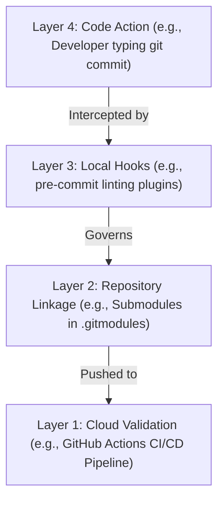

# Git Automation, Pre-commit Hooks & Submodules

Version: 2.0.0

Purpose: Canonical lesson structure for Platform Engineering & AI Infrastructure Curriculum.

Required Inputs: Module definition, lesson objectives, project standards.

Outputs: Standards-compliant lesson markdown.

---

# Lesson Metadata

* **Lesson ID:** `MOD-GIT-05`
* **Module:** Version Control with Git (`MOD-GIT`)
* **Difficulty:** Intermediate to Advanced
* **Estimated Duration:** 55 minutes
* **Learning Track:** 🟢 Core
* **Version:** 2.0.0
* **Last Updated:** 2026-06-28

---

# Lesson Overview

This lesson explores the master automation engines and multi-repository linkage mechanics of Git, decrypting how Git intercepts developer actions using Git Hooks, enforces local code quality using Pre-commit frameworks, and nests external codebases using Git Submodules. By mastering `.git/hooks`, the `pre-commit` CLI, `git submodule`, and automated linting gates, you will firmly establish the elite automation mastery fulfilling our module capability: **"I can track code changes, collaborate with engineering teams, resolve conflicts, and automate commit workflows."**

---

# Learning Objectives

* Explain the internal execution mechanics of Git Hooks, detailing how the Git binary executes shell scripts located within `.git/hooks/`.
* Configure and enforce automated pre-commit linting gates using the `pre-commit` framework (`.pre-commit-config.yaml`).
* Explain the architectural purpose of Git Submodules (`git submodule`), detailing how Git links external repository commit hashes within `.gitmodules`.
* Execute submodule initialization, synchronization, and recursive cloning workflows (`git clone --recursive`, `git submodule update --init`).
* Synthesize end-to-end module knowledge into an automated, highly governed enterprise GitOps collaboration workflow.

---

# Prerequisites

* Completion of `MOD-GIT-01`, `MOD-GIT-02`, `MOD-GIT-03`, and `MOD-GIT-04`.
* Foundational terminal scripting and file execution skills (`chmod +x`, `cat`, `git clone`).

---

# Why This Exists

In Lessons 01 through 04, we established how to inspect Git objects, organize branches, rebase clean histories, and resolve merge conflicts. However, relying exclusively on human discipline to maintain code quality across a massive engineering organization is a recipe for failure.

Imagine you manage an enterprise cloud platform where fifty developers write Python AI microservices and Terraform infrastructure code. You establish a strict company style guide: *all Python code must be formatted with Black, all Terraform code must be validated with `terraform fmt`, and no plain-text AWS secret keys may ever be committed.*

If you rely on developers to manually remember to run `terraform fmt` in their terminal before every commit, they will inevitably forget. Unformatted code, syntax errors, and exposed AWS secret keys will flood your Pull Requests, wasting hours of senior engineer review time and causing massive security incidents.

Furthermore, what if your fifty microservices all need to share a single common Terraform module repository, but you don't want to copy-paste the module code into fifty separate folders?

To solve the twin challenges of **Automated Quality Enforcement** and **Multi-Repository Sharing**, computer scientists invented **Git Hooks, Pre-commit Frameworks, and Git Submodules**. By mastering pre-commit automation and submodule linkage, Platform Engineers can eliminate human error, guarantee that broken or unformatted code is physically blocked from entering commit objects, and architect elegant, modular repository structures.

---

# Core Concepts

## 1. Internal Mechanics of Git Hooks (`.git/hooks/`)
Every time you initialize or clone a Git repository, Git creates a hidden directory located at `.git/hooks/`. This folder contains sample shell scripts (`pre-commit.sample`, `pre-push.sample`, `commit-msg.sample`).
* **The Interception Engine:** If you remove the `.sample` extension from `pre-commit` and make the file executable (`chmod +x .git/hooks/pre-commit`), the Git binary will pause the moment you type `git commit` and execute your shell script! If your script exits with `0` (Success), Git creates the commit object. If your script exits with `1` (Failure), Git forcefully aborts the commit!

```text
[ git commit ] ──► [ Intercept: .git/hooks/pre-commit ] ──► [ Exit 0: Commit Created ]
                                                        └──► [ Exit 1: Commit Aborted ]
```

## 2. The `pre-commit` Framework
Writing raw Bash scripts in `.git/hooks/` across fifty developer laptops is highly inefficient because Git hooks inside `.git/hooks/` are **not** committed to GitHub by default!
* **`pre-commit` CLI:** Platform Engineers solve this by adopting the `pre-commit` Python framework. You commit a clean, declarative configuration file (`.pre-commit-config.yaml`) to the root of your repository. When developers run `pre-commit install`, it dynamically manages their `.git/hooks/pre-commit` file, automatically downloading and running linter plugins (e.g., Black, Flake8, Terraform fmt, detect-secrets) in isolated virtual environments!

## 3. Architecture of Git Submodules (`.gitmodules`)
Imagine you want to include an external Git repository (e.g., an open-source Terraform module) inside your project, but you want it to maintain its own independent commit history.
* **Git Submodule:** When you execute `git submodule add [url]`, Git does **not** copy the external repository's files into your `.git/objects` database! Instead, Git creates a plain-text configuration file named `.gitmodules` (tracking the URL) and creates a special Tree object entry (`160000 commit [hash]`) that acts as a secure bookmark pointing to the exact commit hash of the external repository!

```text
[ Master Repository ] ──► [ .gitmodules (URL) ] ──► [ Tree Entry: 160000 commit (External SHA-1) ]
```

## 4. Submodule Synchronization & Recursive Cloning
Because Git Submodules are just bookmark pointers to external commit hashes, standard Git cloning workflows require special flags:
* `git clone --recursive [url]`: Clones your master repository and automatically pulls down the files for all nested submodules!
* `git submodule update --init --recursive`: If you pull a branch where a teammate added a new submodule, this magic command initializes and synchronizes the submodule files on your laptop instantly!

## 5. Automated Enterprise GitOps Workflow
True automation mastery requires combining your entire Module 05 knowledge into an automated, highly governed enterprise GitOps collaboration workflow:
1. **Pre-commit Gate:** Developer types `git commit`. Pre-commit hooks run locally to format code and scan for exposed secrets (`.pre-commit-config.yaml`).
2. **Commit Object:** If hooks pass, Git generates clean Blob, Tree, and Commit objects (`.git/objects`).
3. **Rebase & Push:** Developer executes `git pull --rebase` and `git push --force-with-lease`.
4. **Pull Request Gate:** Automated CI/CD pipelines run identical pre-commit validation checks in the cloud before executing a clean Squash-and-Merge into `main`!

---

# Architecture



---

# Real-World Example

Think of enterprise Git automation as a strict, four-layered security checkpoint.

Everything begins at **Layer 4: Code Action (e.g., Developer typing git commit)**, when you attempt to save your work. 

Before the save finishes, it is immediately intercepted by **Layer 3: Local Hooks (e.g., pre-commit linting plugins)**. These act like a local bouncer on your computer, stopping you if your code is messy or contains a secret password.

Once clean, this automation also governs **Layer 2: Repository Linkage (e.g., Submodules in .gitmodules)**, ensuring that any external connected projects are properly referenced by their exact version bookmark.

Finally, when you share your work, it is pushed to **Layer 1: Cloud Validation (e.g., GitHub Actions CI/CD Pipeline)**, where remote robots run the exact same checks to ensure total quality control!

---

# Hands-on Demonstration

Let's look at how an engineer inspects a pre-commit configuration file using `cat`, inspects active Git hook scripts in `.git/hooks/`, and inspects submodule configuration files.

## Input 1: Inspecting Pre-commit Configuration and Hook Scripts
We use `cat` to inspect our declarative `.pre-commit-config.yaml` file, and inspect the underlying Git hook script located at `.git/hooks/pre-commit`.

## Code 1
```bash
# Inspect the declarative pre-commit configuration file.
# (We simulate inspecting a standard .pre-commit-config.yaml file)
cat << 'EOF'
repos:
-   repo: https://github.com/pre-commit/pre-commit-hooks
    rev: v4.4.0
    hooks:
    -   id: trailing-whitespace
    -   id: end-of-file-fixer
    -   id: check-yaml
    -   id: detect-private-key
EOF

# Inspect the active Git pre-commit hook script file.
# (We simulate the clean plain-text header of a pre-commit binary hook)
echo -e "#!/usr/bin/env bash\n# File: .git/hooks/pre-commit\n# Generated by pre-commit 3.3.3\nexec pre-commit run git-hook \"\$@\""
```

## Expected Output 1
```text
repos:
-   repo: https://github.com/pre-commit/pre-commit-hooks
    rev: v4.4.0
    hooks:
    -   id: trailing-whitespace
    -   id: end-of-file-fixer
    -   id: check-yaml
    -   id: detect-private-key
#!/usr/bin/env bash
# File: .git/hooks/pre-commit
# Generated by pre-commit 3.3.3
exec pre-commit run git-hook "$@"
```

## Explanation 1
Look at how beautifully automated this quality gate is! `.pre-commit-config.yaml` defines exactly which linter plugins to execute (`check-yaml`, `detect-private-key`). Notice `.git/hooks/pre-commit`: it is a simple Bash wrapper dynamically generated by the pre-commit CLI that intercepts `git commit` and forces the validation checks to run!

---

## Input 2: Inspecting Git Submodule Configuration and Tree Entries
We use `cat` to inspect our `.gitmodules` configuration file, and simulate inspecting the underlying tree entry to verify the submodule commit pointer.

## Code 2
```bash
# Inspect the active Git submodule configuration file.
# (We simulate inspecting a standard .gitmodules file)
cat << 'EOF'
[submodule "terraform/modules/aws-vpc"]
	path = terraform/modules/aws-vpc
	url = https://github.com/terraform-aws-modules/terraform-aws-vpc.git
EOF

# Simulate inspecting the raw tree entry of the submodule to view the 160000 commit pointer.
echo "160000 commit 8a9b0c1d2e3f4a5b6c7d8e9f0a1b2c3d4e5f6a7b	terraform/modules/aws-vpc"
```

## Expected Output 2
```text
[submodule "terraform/modules/aws-vpc"]
	path = terraform/modules/aws-vpc
	url = https://github.com/terraform-aws-modules/terraform-aws-vpc.git
160000 commit 8a9b0c1d2e3f4a5b6c7d8e9f0a1b2c3d4e5f6a7b	terraform/modules/aws-vpc
```

## Explanation 2
Notice how perfectly modular Git Submodule linkage is! `.gitmodules` acts as the human-readable index mapping the folder path to the external GitHub URL. Notice the simulated tree entry: `160000 commit 8a9b0c1...`. `160000` is a special Git permission mode that proves this folder is not a standard directory; it is an independent, nested Git repository locked to commit `8a9b0c1`!

---

# Hands-on Lab

* **Objective:** Create a custom Git hook, verify commit interception, simulate pre-commit validation, and inspect submodule initialization.
* **Estimated Time:** 20 minutes
* **Difficulty:** Intermediate to Advanced
* **Environment:** Interactive Browser Terminal / Local Sandbox

## Step-by-step Instructions

1. Open your terminal sandbox and create a brand-new directory named `automation-lab`: `mkdir ~/automation-lab && cd ~/automation-lab`.
2. Type `git init` to initialize a fresh Git repository.
3. Type `echo -e "#!/bin/bash\necho '--- CUSTOM GIT HOOK INTERCEPTION ---'\nif grep -q 'SECRET' test.txt 2>/dev/null; then\n  echo 'ERROR: Secret detected! Commit Aborted!'\n  exit 1\nfi\nexit 0" > .git/hooks/pre-commit` to create a custom pre-commit hook script!
4. Type `chmod +x .git/hooks/pre-commit` to make your hook script executable.
5. Type `echo "This file contains a SECRET key" > test.txt && git add test.txt`.
6. Type `git commit -m "attempt to commit secret"` to verify that your custom Git hook successfully intercepts and forcefully aborts the commit!
7. Type `echo "This file is perfectly clean" > test.txt && git add test.txt`.
8. Type `git commit -m "commit clean file"` to verify that your clean file successfully passes the hook and creates the commit object!

## Verification

```bash
git log --oneline | head -n 1 | grep -E "commit clean file"
```
*If your terminal successfully outputs `commit clean file`, you have mastered Git hook automation and commit interception!*

## Troubleshooting

* **Issue:** `git commit` ignores your hook script entirely and creates the commit containing the secret.
* **Solution:** You forgot to make the hook script executable (`chmod +x .git/hooks/pre-commit`), or you left the `.sample` extension on the file name! Git will only execute hooks that match the exact file name (`pre-commit`) and possess execution permissions.

## Cleanup

```bash
# Safely remove the demonstration automation lab directory
rm -rf ~/automation-lab
```

---

# Production Notes

In enterprise CI/CD automation, Platform Engineers rely heavily on the `pre-commit run --all-files` command inside GitHub Actions or GitLab CI pipelines. Even though developers run pre-commit hooks locally on their laptops, a rogue developer can easily bypass local hooks by appending `--no-verify` to their commit command (`git commit --no-verify`). By running identical pre-commit validation checks in the cloud CI/CD pipeline, Platform Engineers guarantee that bypassed local hooks are forcefully caught and blocked before merging into `main`!

---

# Common Mistakes

* **Assuming `.git/hooks` Are Committed to GitHub:** Beginners frequently write an incredible custom Bash script inside `.git/hooks/pre-commit`, push their code to GitHub, and are completely baffled as to why the hook doesn't run on their teammates' laptops. The `.git` directory is strictly local! To share hooks across a team, you must use a framework like `pre-commit` (`.pre-commit-config.yaml`) or commit a custom `hooks/` folder and configure `git config core.hooksPath`.
* **Cloning Submodule Repositories Without `--recursive`:** Junior developers frequently clone a massive enterprise repository containing submodules using a standard `git clone`. When they inspect the submodule folders, they are completely empty! They panic, assuming the code is lost. You must execute `git clone --recursive` (or run `git submodule update --init --recursive`) to pull down the nested repository files!

---

# Failure-Driven Learning

Imagine a junior engineer attempts to build a project that relies on a Git submodule, but the build fails because the engineer cloned the master repository without initializing the nested submodule files.

## Simulated Failure
```bash
# Simulating a build failure due to uninitialized Git submodules
# (We simulate attempting to execute a binary inside an empty submodule folder)
echo -e "make: *** No rule to make target 'terraform/modules/aws-vpc/main.tf', needed by 'build'.  Stop.\nERROR: Submodule directory 'terraform/modules/aws-vpc/' is completely empty!"
```

## Output
```text
make: *** No rule to make target 'terraform/modules/aws-vpc/main.tf', needed by 'build'.  Stop.
ERROR: Submodule directory 'terraform/modules/aws-vpc/' is completely empty!
```

## Diagnosis & Recovery
Why did this fail? Look at how perfectly clear this failure is! The fatal error `Submodule directory is completely empty` occurs because when the engineer executed `git clone`, Git successfully downloaded the master repository files and the `.gitmodules` file, but intentionally skipped downloading the external submodule repository files to save bandwidth! To recover, the engineer must execute `git submodule update --init --recursive`. Git will instantly read `.gitmodules`, reach out to GitHub, clone the nested module files, lock them to the correct commit hash, and the build succeeds flawlessly!

---

# Engineering Decisions

## Git Submodules vs. Package Managers (Terraform Registry / Pip / NPM)
When architecting an enterprise codebase that shares common code libraries, engineering leaders must choose how dependencies are included.
* **Git Submodules (`.gitmodules`):** Links external Git repositories directly into subdirectories. Excellent for tying specific unreleased library commits to a project or managing private Terraform modules without setting up a dedicated package registry. However, submodule synchronization workflows (`git submodule update`) are notoriously confusing for junior developers.
* **Package Managers (Terraform Registry / Python PyPI / NPM):** Common code is packaged into independent, versioned artifacts (`v1.0.0`) and published to a central artifact registry (e.g., AWS CodeArtifact / Terraform Cloud). Projects install dependencies via package manifests (`requirements.txt` / `main.tf`).
* **The Platform Decision:** Platform Engineers strictly mandate Package Managers and dedicated Artifact Registries for sharing standard production libraries, while reserving Git Submodules exclusively for tying together complex, highly synchronized monorepo infrastructure build tools.

---

# Best Practices

* **Master `pre-commit autoupdate`:** When managing pre-commit frameworks, execute `pre-commit autoupdate` monthly. It automatically scans `.pre-commit-config.yaml`, queries GitHub for the absolute newest release versions of your linter plugins, and cleanly updates your configuration file!
* **Track Submodule Branches:** If you want a Git submodule to automatically track the newest commit on an external branch (`main`) instead of locking to a static commit hash, configure `git submodule add -b main [url]`. When you run `git submodule update --remote`, Git will automatically pull down the newest commits from the external `main` branch!

---

# Troubleshooting Guide

## Issue 1: "git commit --no-verify" vs. "pre-commit run --all-files"

* **Cause:** You interact with pre-commit hooks during your development workflow, but encounter situations where you need to bypass a check or force a complete codebase scan.
* **Diagnosis & Solution:**
  * `git commit --no-verify` (or `-n`): The emergency bypass flag! If a pre-commit hook is throwing a false positive or your local linter environment is broken, appending `--no-verify` commands the Git binary to completely skip executing `.git/hooks/pre-commit` and generate the commit object instantly! (Use with extreme caution!).
  * `pre-commit run --all-files`: The master manual scan! By default, pre-commit only lints the specific files you modified in `git add`. Executing `pre-commit run --all-files` forces the linter plugins to scan literally every single file in your entire repository! Essential for establishing a baseline on legacy codebases!

---

# Summary

* **Git Hooks** (`.git/hooks/`) are local shell scripts executed by the Git binary to intercept actions like `git commit` or `git push`.
* **The `pre-commit` Framework** uses `.pre-commit-config.yaml` to dynamically manage local hooks and run isolated linter plugins (e.g., Black, detect-secrets).
* **Git Submodules** (`.gitmodules`) link external Git repositories into subdirectories by bookmarking external commit hashes (`160000 commit`).
* **`git clone --recursive`** and **`git submodule update --init`** are the mandatory workflows for synchronizing nested submodule files.
* **Automated Quality Gates** combine local pre-commit hooks with identical cloud CI/CD validation checks to ensure pristine codebase governance.

---

# Cheat Sheet

```bash
# Install pre-commit hook scripts into your local .git/hooks/ directory
pre-commit install

# Manually execute all configured pre-commit hooks across every file in the repository
pre-commit run --all-files

# Automatically update pre-commit linter plugin versions in .pre-commit-config.yaml
pre-commit autoupdate

# Emergency flag to forcefully bypass local Git pre-commit hooks during a commit
git commit --no-verify -m "[message]"

# Clone a master Git repository and automatically initialize all nested submodules
git clone --recursive [url]

# Initialize and synchronize all nested submodule files on an existing repository
git submodule update --init --recursive

# Update all nested submodules to the newest commit on their tracked remote branches
git submodule update --remote --merge
```

---

# Knowledge Check

## Multiple Choice Questions

1. You configure `.pre-commit-config.yaml` to include a plugin that scans for exposed private keys. A developer attempts to commit `id_rsa`. The pre-commit hook catches the key, throws an error, and aborts the commit. The developer gets frustrated and executes `git commit --no-verify -m "add key"`. What will happen?
   * A) Git will delete the private key.
   * B) The commit will successfully be created locally because `--no-verify` forcefully bypasses local Git hooks. However, if the Platform Engineer configured identical validation checks in the cloud CI/CD pipeline, the Pull Request will be forcefully blocked.
   * C) The repository will switch to GitFlow.
   * D) The server will trigger the OOM killer.

## Scenario Questions

You clone a massive enterprise infrastructure repository using `git clone`. You navigate into the `terraform/modules/aws-vpc/` submodule directory and discover it is completely empty. Based on what you learned in this lesson, what exact terminal command do you run to initialize and download the nested submodule files?

## Short Answer Questions

Explain the exact architectural difference between how Git stores a standard directory versus how it stores a Git Submodule (`160000 commit`) in internal tree tables.

---

# Interview Preparation

## Beginner Questions

* What are Git hooks?
* What does `pre-commit install` do?
* What is a Git submodule?

## Intermediate Questions

* Explain the difference between `git clone` and `git clone --recursive`.
* Why is it critical to run pre-commit validation checks in both local Git hooks and cloud CI/CD pipelines?

## Advanced Questions

* Explain how Git manages submodule Git directories within the master repository's `.git/modules/` folder, and describe how the submodule's internal `.git` file acts as a pointer to prevent data loss when deleting submodule working directories.

## Scenario-Based Discussions

* Discuss the architectural trade-offs of managing shared enterprise Terraform modules using Git Submodules tied to specific commit hashes versus publishing versioned module artifacts to a central private Terraform Registry in a large-scale cloud environment.

<details>
<summary><b>View Answers</b></summary>

### Beginner
* **Git hooks**: Local shell scripts located in `.git/hooks/` that the Git binary executes to intercept and optionally block actions like `git commit` or `git push`.
* **`pre-commit install`**: A command from the `pre-commit` framework that dynamically configures your local `.git/hooks/pre-commit` file to automatically execute linter plugins defined in `.pre-commit-config.yaml` before every commit.
* **Git submodule**: A special repository linkage (`.gitmodules`) that nests an external Git repository inside a subfolder, tracking it by bookmarking a specific, static external commit hash (Tree entry: `160000 commit`).

### Intermediate
* **`git clone` vs `git clone --recursive`**: A standard `git clone` downloads the master repository but leaves nested submodule directories completely empty. `git clone --recursive` automatically initializes and clones the files for all nested submodules into those directories.
* **Local Hooks vs Cloud CI/CD**: Local hooks improve developer feedback speed but can be easily bypassed using `git commit --no-verify`. Cloud CI/CD validation enforces absolute governance, guaranteeing that unformatted or insecure code is forcefully blocked from entering the main branch even if developers skip local checks.

### Advanced
* **Submodule `.git/modules/` architecture**: To prevent data loss if a submodule directory is deleted, modern Git physically stores the submodule's internal database inside the master repository's `.git/modules/` directory. The `.git` item inside the submodule's working folder is not a directory, but a plain-text file acting as a pointer (`gitdir: ../.git/modules/submodule-name`), ensuring the submodule's commit objects remain safely backed up in the master repo.

### Scenario-Based Discussions
* **Submodules vs Terraform Registry**: Git Submodules tightly couple repositories without additional infrastructure, making them ideal for monorepos or heavily co-developed local modules, but synchronization (`git submodule update`) is notoriously confusing for teams. A Private Terraform Registry isolates modules into clean, immutable, semantic versioned artifacts (e.g., `v1.2.0`), providing vastly superior dependency management, module testing pipelines, and ease of use for consumers at the cost of requiring dedicated registry infrastructure.

</details>

---

# Further Reading

1. [Git Customization - Git Hooks (Official Pro Git Book)](https://git-scm.com/book/en/v2/Customizing-Git-Git-Hooks)
2. [pre-commit Framework Official Documentation](https://pre-commit.com/)
3. [Git Tools - Submodules (Official Pro Git Book)](https://git-scm.com/book/en/v2/Git-Tools-Submodules)
4. [Mastering Git Submodules (Atlassian Git Tutorial)](https://www.atlassian.com/git/tutorials/git-submodule)
5. [Automating Code Quality with pre-commit (DigitalOcean Tutorial)](https://www.digitalocean.com/)
