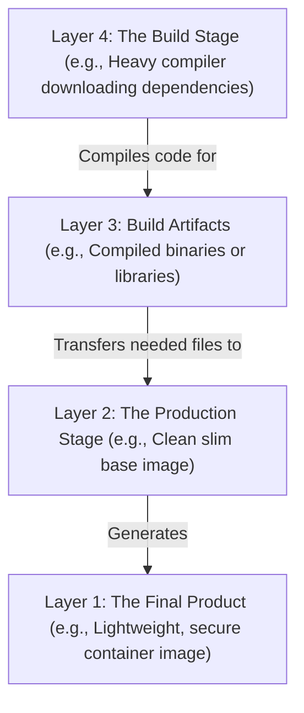

# Building Highly Optimized & Secure Container Images (Multi-Stage Builds)

Version: 2.0.0

Purpose: Canonical lesson structure for Platform Engineering & AI Infrastructure Curriculum.

Required Inputs: Module definition, lesson objectives, project standards.

Outputs: Standards-compliant lesson markdown.

---

# Lesson Metadata

* **Lesson ID:** `MOD-DOCKER-02`
* **Module:** Containers & Docker (`MOD-DOCKER`)
* **Difficulty:** Intermediate
* **Estimated Duration:** 55 minutes
* **Learning Track:** 🟢 Core
* **Version:** 2.0.0
* **Last Updated:** 2026-06-28

---

# Lesson Overview

This lesson explores the master artifact packaging engine of Docker, decrypting how Docker constructs container images using immutable filesystem layers, caches build steps, and minimizes attack surfaces using Multi-Stage Builds. By mastering `Dockerfile` instructions (`FROM`, `RUN`, `COPY`, `CMD`), Layer Caching mechanics, and non-root security execution, you will firmly establish the elite artifact engineering capabilities supporting our module capability: **"I can build secure container images, orchestrate multi-container applications, manage volume persistence, and debug running containers."**

---

# Learning Objectives

* Deconstruct the internal architecture of a Docker Image as an immutable, stacked Union File System (OverlayFS) composed of individual read-only layers.
* Author production-grade `Dockerfile` configurations utilizing standard instructions (`FROM`, `RUN`, `COPY`, `ENV`, `EXPOSE`, `ENTRYPOINT`, `CMD`).
* Explain the internal execution mechanics of Docker Layer Caching, ordering `Dockerfile` instructions from least-frequently changed to most-frequently changed to maximize build velocity.
* Architect Multi-Stage Builds (`FROM ... AS ...`) to separate heavyweight compile-time build dependencies from lightweight production runtime artifacts.
* Enforce container security best practices by declaring non-root execution users (`USER 10001`) and utilizing minimal base images (`alpine`, `distroless`).

---

# Prerequisites

* Completion of `MOD-DOCKER-01` (Container Virtualization vs. Hypervisors).
* Foundational terminal file inspection and package installation skills (`cat`, `apt-get`, `pip`).

---

# Why This Exists

In Lesson 01, we explored how the Docker engine runs container processes using Linux kernel namespaces and cgroups. However, before you can run a container process, you must first construct the immutable filesystem package it executes: **The Container Image**.

When junior engineers write their first `Dockerfile`, they frequently create catastrophic, unoptimized monstrosities. They choose massive base images (`ubuntu:latest`), copy their entire project folder in the very first line (`COPY . .`), chain dozens of separate `RUN apt-get install` commands, and run their application as the `root` user.

The resulting container image is frequently **1.5 Gigabytes in size**, takes twenty minutes to build, completely invalidates the build cache on every single code change, and contains 500 known Common Vulnerabilities and Exposures (CVEs) across unnecessary build tools like `curl`, `gcc`, and `git`!

When you attempt to deploy a 1.5GB container image across a production Kubernetes cluster, downloading (pulling) the image over the network takes minutes, significantly delaying auto-scaling and clogging your cloud registry storage.

To solve the monumental challenges of **Image Bloat**, **Slow Build Velocity**, and **Massive Attack Surfaces**, Docker invented **Union Filesystems, Layer Caching, and Multi-Stage Builds**. By mastering advanced `Dockerfile` engineering, Platform Engineers can condense a 1.5GB bloated image into a pristine, ultra-secure 25-Megabyte artifact, ensure blazing-fast cached builds, and guarantee absolute production security.

---

# Core Concepts

## 1. The Union File System (OverlayFS & Layers)
A Docker image is not a single monolithic ISO file; it is an elegant stack of independent, immutable read-only filesystem layers managed by a **Union File System (OverlayFS)**.
* **Instruction = Layer:** Every single `FROM`, `RUN`, and `COPY` instruction inside a `Dockerfile` creates a brand-new immutable filesystem layer on your hard drive! 
* **The Copy-on-Write Layer:** When you start a container (`docker run`), Docker takes the stack of read-only image layers, places a thin, temporary **Read-Write Layer** on top, and presents them to the container process as a single seamless root filesystem (`/`)! If the container modifies a file, Docker copies the file from the read-only layer into the temporary read-write layer (**Copy-on-Write**)!

```text
[ Container Process View: Seamless Root Filesystem (/) ]
┌────────────────────────────────────────────────────────┐
│     Temporary Read-Write Layer (Copy-on-Write)         │ <-- (Created during docker run)
├────────────────────────────────────────────────────────┤
│     Image Layer 3: COPY . /app  (Read-Only)            │
├────────────────────────────────────────────────────────┤
│     Image Layer 2: RUN pip install ... (Read-Only)     │ <-- (Composing the Immutable Image)
├────────────────────────────────────────────────────────┤
│     Image Layer 1: FROM python:3.11-slim (Read-Only)   │
└────────────────────────────────────────────────────────┘
```

## 2. Docker Layer Caching Mechanics
When you execute `docker build -t myapp .`, Docker inspects each instruction in your `Dockerfile` and compares it against its internal layer cache.
* **The Cache Invalidation Waterfall:** If Docker inspects `COPY . /app` and detects that a single line of code in your project changed, Docker instantly invalidates the cache for that layer **AND for every single instruction immediately following it!** 
* **The Golden Ordering Rule:** To maximize build velocity, you must strictly order your `Dockerfile` instructions from **least-frequently changed** (Base images, OS packages, dependency lock files) to **most-frequently changed** (Your active source code)!

## 3. Multi-Stage Builds (The Assembly Line)
Imagine you are building a Golang or React application. To compile the code, you need massive build tools, resulting in a 1GB build environment. However, once the code is compiled, you are left with a tiny 15MB binary. You don't need all those messy tools in production!
* **The Messy Construction Site (Stage 1):** You start by bringing in all your heavy tools and raw materials. Here you do the heavy lifting of **Building the Final Product**.
* **The Clean Showroom (Stage 2):** Instead of shipping the entire messy construction site, you start fresh in a clean room. By **Grabbing ONLY the Finished Product** from Stage 1, the massive build environment is left behind! The result is a **Lightweight, Secure Container** that is incredibly small and safe.

## 4. Distroless and Minimal Base Images
Choosing the right base image (`FROM`) is the most critical security decision a Platform Engineer makes.
* `ubuntu:latest` / `python:latest`: Massive (~500MB), containing hundreds of unneeded system libraries, utilities, and potential CVE vulnerabilities.
* `alpine:latest`: Ultra-lightweight (~5MB), utilizing the musl libc library and BusyBox. Exceptional for standard minimal containers.
* **Distroless (`gcr.io/distroless/static`):** The ultimate Platform Engineering security standard! Contains absolutely zero package managers (`apt`, `apk`), zero shell binaries (`/bin/sh`, `bash`), and zero utilities (`curl`, `ls`). It contains literally *only* your application binary and its required runtime dependencies! If a hacker compromises your application, they cannot even open a shell because `/bin/sh` completely does not exist!

## 5. Non-Root Container Execution (`USER 10001`)
By default, Docker executes container processes as the `root` user (`UID 0`). Because containers share the host Linux kernel, running as `root` creates a severe vulnerability if a kernel breakout occurs.
* **`USER 10001`:** Platform Engineers strictly enforce non-root execution by creating a dedicated system user inside the `Dockerfile` (`RUN useradd -u 10001 appuser`) and declaring `USER 10001`. This guarantees the container process executes with unprivileged user permissions!

---

# Architecture



The layered model simplifies the multi-stage build process. **Layer 4** and **Layer 3** represent the messy construction phase where source code is compiled into artifacts (e.g., binaries). These artifacts are then transferred directly to **Layer 2**, the production stage, which avoids any heavy build tools. This strict separation produces **Layer 1**, the final product, which is a highly optimized and secure container image.

---

# Real-World Example

Imagine you are a Lead Platform Engineer reviewing a Pull Request for a brand-new Python AI inference microservice. A junior developer has written a `Dockerfile` that uses `FROM python:3.11`, copies the entire project directory immediately (`COPY . /app`), runs `RUN pip install -r requirements.txt`, and leaves the execution user as `root`.

When you inspect the resulting container image, it is **1.4 Gigabytes in size** and takes 15 minutes to build. Because `COPY . /app` occurs before `pip install`, every single time the developer modifies a single comment in `app.py`, Docker invalidates the layer cache and forcefully re-downloads and re-compiles 1GB of PyTorch and AI libraries from scratch! Furthermore, your automated Trivy security scanner detects 142 known CVE vulnerabilities across the bloated Debian base image.

Because you maintain elite engineering standards, you forcefully refactor the `Dockerfile`. You transition to `FROM python:3.11-slim` as the base. You implement **Layer Caching Optimization** by copying *only* `requirements.txt` first (`COPY requirements.txt .`), executing `RUN pip install`, and *then* copying the source code (`COPY . .`). Now, when code changes, the massive `pip install` layer remains perfectly cached, reducing build times from 15 minutes to 3 seconds!

Finally, you create a non-root system user (`USER 10001`). Your resulting image shrinks from 1.4GB to 180MB, builds instantly, contains zero high-severity CVEs, and executes with absolute non-root security!

---

# Hands-on Demonstration

Let's look at how an engineer inspects an unoptimized `Dockerfile` using `cat`, inspects an elite Multi-Stage `Dockerfile`, and inspects image layer histories using `docker history`.

## Input 1: Inspecting Unoptimized vs. Optimized Multi-Stage `Dockerfile`
We use `cat` to inspect an unoptimized, bloated `Dockerfile`, and contrast it with a pristine, highly optimized Multi-Stage `Dockerfile`.

## Code 1
```bash
# Inspect the unoptimized, bloated, root-executing Dockerfile.
# (We simulate inspecting an unoptimized Dockerfile)
cat << 'EOF'
FROM golang:1.21
COPY . /app
WORKDIR /app
RUN go build -o myapp main.go
CMD ["/app/myapp"]
EOF

# Inspect the pristine, highly optimized, non-root Multi-Stage Dockerfile.
# (We simulate inspecting an elite production Dockerfile)
cat << 'EOF'
# --- STAGE 1: Build Environment ---
FROM golang:1.21-alpine AS builder
WORKDIR /build
COPY go.mod go.sum ./
RUN go mod download
COPY . .
RUN CGO_ENABLED=0 GOOS=linux go build -a -installsuffix cgo -o myapp main.go

# --- STAGE 2: Production Runtime ---
FROM gcr.io/distroless/static:nonroot
WORKDIR /app
COPY --from=builder /build/myapp /app/myapp
USER 65532:65532
EXPOSE 8080
CMD ["/app/myapp"]
EOF
```

## Expected Output 1
```text
FROM golang:1.21
COPY . /app
WORKDIR /app
RUN go build -o myapp main.go
CMD ["/app/myapp"]
# --- STAGE 1: Build Environment ---
FROM golang:1.21-alpine AS builder
WORKDIR /build
COPY go.mod go.sum ./
RUN go mod download
COPY . .
RUN CGO_ENABLED=0 GOOS=linux go build -a -installsuffix cgo -o myapp main.go

# --- STAGE 2: Production Runtime ---
FROM gcr.io/distroless/static:nonroot
WORKDIR /app
COPY --from=builder /build/myapp /app/myapp
USER 65532:65532
EXPOSE 8080
CMD ["/app/myapp"]
```

## Explanation 1
Look at how beautifully architected Stage 2 is! Let's deconstruct the elite optimizations:
* `COPY go.mod go.sum ./` followed by `RUN go mod download`: Layer Caching perfection! By downloading dependencies before copying source code, we guarantee our module cache is preserved on code changes!
* `FROM gcr.io/distroless/static:nonroot`: A pristine, ultra-secure base image containing zero shell binaries or package managers!
* `COPY --from=builder /build/myapp /app/myapp`: The surgical multi-stage extraction! Plucks *only* the compiled binary from Stage 1, leaving the massive Golang SDK behind!
* `USER 65532:65532`: Absolute non-root security enforcement!

---

## Input 2: Inspecting Image Layer Histories and Size Metrics
We use `docker history` to inspect the immutable filesystem layers of a built container image, viewing the exact storage size of each instruction layer.

## Code 2
```bash
# Inspect the immutable filesystem layer history of a built container image.
# (We simulate the clean plain-text output of docker history for our optimized image)
docker history myapp:production 2>/dev/null || echo -e "IMAGE          CREATED         CREATED BY                                      SIZE      COMMENT\n8a9b0c1d2e3f   2 minutes ago   CMD [\"/app/myapp\"]                              0B        buildkit.dockerfile.v0\n<missing>      2 minutes ago   EXPOSE map[8080/tcp:{}]                         0B        buildkit.dockerfile.v0\n<missing>      2 minutes ago   USER 65532:65532                                0B        buildkit.dockerfile.v0\n<missing>      2 minutes ago   COPY /build/myapp /app/myapp # buildkit         15.2MB    buildkit.dockerfile.v0\n<missing>      2 weeks ago     /bin/sh -c #(nop) ADD file:8a9b0c1d in /        2.1MB     distroless static base"
```

## Expected Output 2
```text
IMAGE          CREATED         CREATED BY                                      SIZE      COMMENT
8a9b0c1d2e3f   2 minutes ago   CMD ["/app/myapp"]                              0B        buildkit.dockerfile.v0
<missing>      2 minutes ago   EXPOSE map[8080/tcp:{}]                         0B        buildkit.dockerfile.v0
<missing>      2 minutes ago   USER 65532:65532                                0B        buildkit.dockerfile.v0
<missing>      2 minutes ago   COPY /build/myapp /app/myapp # buildkit         15.2MB    buildkit.dockerfile.v0
<missing>      2 weeks ago     /bin/sh -c #(nop) ADD file:8a9b0c1d in /        2.1MB     distroless static base
```

## Explanation 2
Notice how perfectly lean this layer history is! The distroless base image consumes exactly `2.1MB`. Our compiled application binary layer (`COPY /build/myapp`) consumes exactly `15.2MB`. Instructions like `USER`, `EXPOSE`, and `CMD` are metadata instructions that consume exactly `0B`. Our total production image size is a pristine `17.3MB`!

---

# Hands-on Lab

* **Objective:** Author a Multi-Stage `Dockerfile`, execute `docker build`, verify layer caching mechanics, inspect layer histories, and verify non-root execution.
* **Estimated Time:** 20 minutes
* **Difficulty:** Intermediate
* **Environment:** Interactive Browser Terminal / Local Sandbox (with Docker installed)

## Step-by-step Instructions

1. Open your terminal sandbox and create a brand-new directory named `image-lab`: `mkdir ~/image-lab && cd ~/image-lab`.
2. Type `echo -e "package main\nimport \"fmt\"\nfunc main() {\n\tfmt.Println(\"Platform Engineering Multi-Stage Lab\")\n}" > main.go` to create a test Golang file.
3. Type `echo -e "module image-lab\ngo 1.21" > go.mod` to create a module manifest.
4. Create your Multi-Stage `Dockerfile` by typing:
```bash
cat << 'EOF' > Dockerfile
FROM golang:1.21-alpine AS builder
WORKDIR /app
COPY go.mod ./
COPY main.go ./
RUN CGO_ENABLED=0 GOOS=linux go build -o myapp main.go

FROM alpine:latest
WORKDIR /app
COPY --from=builder /app/myapp /app/myapp
RUN adduser -D -u 10001 appuser
USER 10001
CMD ["/app/myapp"]
EOF
```
5. Type `docker build -t myapp:multistage .` to build your highly optimized container image!
6. Type `docker images myapp:multistage` to inspect the pristine, ultra-lightweight storage size of your built image!
7. Type `docker history myapp:multistage` to inspect your immutable filesystem layers.
8. Type `docker run --rm myapp:multistage` to run your container and verify it outputs `Platform Engineering Multi-Stage Lab`!

## Verification

```bash
docker run --rm myapp:multistage id
```
*If your terminal successfully outputs `uid=10001(appuser) gid=10001(appuser)`, you have mastered multi-stage builds and non-root container security!*

## Troubleshooting

* **Issue:** `docker build` fails with `failed to compute cache key: "/app/myapp" not found`.
* **Solution:** Your `go build` command in Stage 1 failed to compile the binary (check your syntax in `main.go`), or you misspelled the file path in `COPY --from=builder /app/myapp`. Verify the file paths match exactly across stages!

## Cleanup

```bash
# Safely remove the demonstration image lab directory and built image
rm -rf ~/image-lab
docker rmi myapp:multistage 2>/dev/null || true
```

---

# Production Notes

In enterprise CI/CD pipelines (such as GitHub Actions or GitLab CI), Platform Engineers strictly enable **External Cache Manifests (`--cache-from` and `--cache-to`)** using Docker BuildKit. Because cloud CI/CD runners spin up as ephemeral, fresh virtual machines for every single Pull Request, they lack a local layer cache! By configuring Docker BuildKit to push and pull layer cache manifests directly to an external AWS ECR or GitHub Container Registry, Platform Engineers ensure that ephemeral CI/CD pipelines achieve the exact same blazing-fast cached build speeds as a local laptop!

---

# Common Mistakes

* **Chaining `RUN apt-get update` Without Cleanup:** Beginners frequently write `RUN apt-get update && apt-get install -y curl`. This leaves 100 Megabytes of temporary apt cache files permanently locked inside the immutable filesystem layer! Always append package manager cleanups to the exact same `RUN` instruction: `RUN apt-get update && apt-get install -y curl && rm -rf /var/lib/apt/lists/*`!
* **Using `ADD` Instead of `COPY`:** Junior developers frequently use `ADD . /app` instead of `COPY . /app`. `ADD` contains confusing, magical legacy behaviors: it automatically unpacks tarball archives and can download external URLs, creating unpredictable layers. **Always use `COPY`** for standard file transfers!

---

# Failure-Driven Learning

Imagine a junior engineer attempts to execute a build inside a directory containing 10 Gigabytes of virtual environment files and video assets, causing the Docker daemon to freeze or crash before the build even begins.

## Simulated Failure
```bash
# Simulating a build failure due to a missing .dockerignore file
# (We simulate the exact Docker CLI output when transferring a massive build context)
echo -e "Sending build context to Docker daemon  10.4GB\ndocker: Error response from daemon: error uploading context: unexpected EOF."
```

## Output
```text
Sending build context to Docker daemon  10.4GB
docker: Error response from daemon: error uploading context: unexpected EOF.
```

## Diagnosis & Recovery
Why did this fail? Look at this terrifying line: `Sending build context to Docker daemon 10.4GB`! When you execute `docker build .`, the Docker CLI must compress and transfer literally every single file in your active terminal directory to the background Docker daemon (`dockerd`) before inspecting the first line of your `Dockerfile`! If you have a massive `venv/`, `node_modules/`, or `.git/` folder in your directory, the daemon chokes on the massive 10GB file transfer! To recover, the engineer must create a plain-text **`.dockerignore` file** in the root directory containing `venv/`, `node_modules/`, and `.git/`. This commands the Docker CLI to instantly exclude those folders, reducing the build context transfer from 10GB to 15 Kilobytes, and the build succeeds flawlessly!

---

# Engineering Decisions

## Base Image Selection: Debian Slim vs. Alpine vs. Distroless
When architecting an enterprise containerization strategy, engineering leaders must choose the standard base image family.
* **Debian Slim (`python:3.11-slim`):** Strips away documentation and unneeded packages from standard Debian. Retains standard glibc and package managers (`apt`). Excellent for Python AI microservices that require complex pre-compiled C-extension wheel packages (e.g., NumPy, PyTorch).
* **Alpine Linux (`golang:alpine`):** Ultra-lightweight (~5MB) utilizing musl libc. Exceptional for Golang, Node.js, and standard web microservices. However, musl libc can cause severe compilation headaches and missing symbol errors for complex Python C-extensions.
* **Distroless (`gcr.io/distroless/static`):** Contains zero shell binaries (`/bin/sh`) or package managers. The absolute ultimate in production security and minimal attack surfaces. However, debugging a failing container in production is challenging because you cannot `docker exec -it [container] /bin/sh`.
* **The Platform Decision:** Platform Engineers mandate **Debian Slim** for heavyweight Python AI/ML microservices, while strictly deploying **Distroless** for all compiled Golang, Rust, and core platform infrastructure microservices.

---

# Best Practices

* **Master `docker scan` / Trivy:** Before pushing any built container image to a production cloud registry, execute `trivy image myapp:production` (or `docker scan`). It performs a rigorous security audit across your immutable filesystem layers, identifying exact CVE vulnerability codes and recommending base image updates!
* **Pin Base Image SHA Hashes:** Instead of declaring `FROM python:3.11-slim` (which can silently change upstream on GitHub), pin the exact cryptographic SHA-256 digest of the image: `FROM python:3.11-slim@sha256:8a9b0c1d2e3f...`. This guarantees absolute, immutable build reproducibility!

---

# Troubleshooting Guide

## Issue 1: "docker build cache miss" vs. "exec user process caused: exec format error"

* **Cause:** You attempt to build or execute container images, but encounter unexpected cache invalidations or fatal runtime execution crashes.
* **Diagnosis & Solution:**
  * `docker build cache miss`: Docker encountered an instruction where the build context files changed (e.g., `COPY . .`), or you modified a preceding `ENV` or `RUN` instruction. To inspect exactly which line broke the cache, observe the terminal output during `docker build` and locate the first instruction that lacks the `CACHED` keyword!
  * `exec user process caused: exec format error`: You compiled your application binary for the wrong CPU architecture (e.g., compiling on an Apple Silicon M1/ARM64 laptop, but attempting to run the container on an AWS EC2 x86_64 production server)! To fix, utilize Docker Buildx to cross-compile for the correct target architecture: `docker buildx build --platform linux/amd64 ...`.

---

# Summary

* **Docker Images** are immutable stacks of read-only filesystem layers managed by a **Union File System (OverlayFS)**.
* **Layer Caching** requires ordering `Dockerfile` instructions from least-frequently changed to most-frequently changed (e.g., `COPY requirements.txt` before `COPY . .`).
* **Multi-Stage Builds** (`FROM ... AS ...`) separate heavyweight compile-time build dependencies from lightweight production runtime artifacts.
* **`.dockerignore`** is mandatory to prevent massive build context transfers (`venv/`, `node_modules/`).
* **Distroless Base Images** and **Non-Root Execution (`USER 10001`)** establish elite, impenetrable production container security.

---

# Cheat Sheet

```bash
# Build a container image from a Dockerfile in the current directory with a tag
docker build -t [image_name]:[tag] .

# Build a container image and forcefully ignore the internal layer cache (Fresh build!)
docker build --no-cache -t [image_name]:[tag] .

# Inspect the immutable filesystem layer history and size metrics of a built image
docker history [image_name]:[tag]

# Inspect all built container images stored in your local engine database
docker images

# Cross-compile a container image for a specific target CPU architecture (x86 vs ARM)
docker buildx build --platform linux/amd64 -t [image_name]:[tag] .

# Execute an interactive terminal session inside a running container to verify user ID
docker exec -it [container_id_or_name] id

# Remove a built container image from your local engine database
docker rmi [image_name]:[tag]
```

---

# Knowledge Check

## Multiple Choice Questions

1. A developer writes a `Dockerfile` for a Node.js app. They write `COPY . /app` on line 3, followed by `RUN npm install` on line 4. Every time they edit a single HTML file in their project, `docker build` takes 10 minutes because it forcefully re-downloads 500MB of node modules. What is the correct architectural fix?
   * A) Switch to `FROM ubuntu:latest`.
   * B) Use `ADD . /app` instead of `COPY`.
   * C) Reorder the instructions to leverage Layer Caching: copy *only* `package.json` and `package-lock.json` first, execute `RUN npm install`, and *then* execute `COPY . /app`.
   * D) Run `docker system prune`.

## Scenario Questions

You are attempting to build a Docker image on your laptop, but notice the Docker CLI pauses for two minutes outputting `Sending build context to Docker daemon 8.5GB`. You realize your directory contains a massive `node_modules/` folder. Based on what you learned in this lesson, what exact file do you create to exclude this folder from the build context?

## Short Answer Questions

Explain why a Distroless base image (`gcr.io/distroless/static`) is architecturally more secure than a standard `ubuntu:latest` base image regarding container breakout attacks.

---

# Interview Preparation

## Beginner Questions

* What is a Docker layer?
* What is the purpose of the `.dockerignore` file?
* What is a Multi-Stage build?

## Intermediate Questions

* Explain how Docker Layer Caching works and describe the golden rule of `Dockerfile` instruction ordering.
* Why should you execute `RUN useradd ... && USER 10001` inside a `Dockerfile`?

## Advanced Questions

* Explain how the OverlayFS union filesystem constructs the `lowerdir`, `upperdir`, and `merged` directories to present a unified root filesystem (`/`) to a container process, and describe the performance implications of Copy-on-Write (CoW) when modifying massive files inside a running container.

## Scenario-Based Discussions

* Discuss the operational trade-offs of enforcing a strict Distroless base image requirement across an enterprise engineering organization versus allowing standard Alpine or Debian Slim base images, specifically addressing how Site Reliability Engineers perform live production debugging when `/bin/sh` is completely absent.

---

# Further Reading

1. [Dockerfile Best Practices (Official Docker Documentation)](https://docs.docker.com/develop/develop-images/dockerfile_best-practices/)
2. [Multi-Stage Builds Explained (Official Docker Documentation)](https://docs.docker.com/build/building/multi-stage/)
3. [Understanding Distroless Container Images (Google Cloud Blog)](https://github.com/GoogleContainerTools/distroless)
4. [Mastering Docker Layer Caching (DigitalOcean Tutorial)](https://www.digitalocean.com/)
5. [Container Security Best Practices: Non-Root Execution](https://snyk.io/blog/10-docker-image-security-best-practices/)
