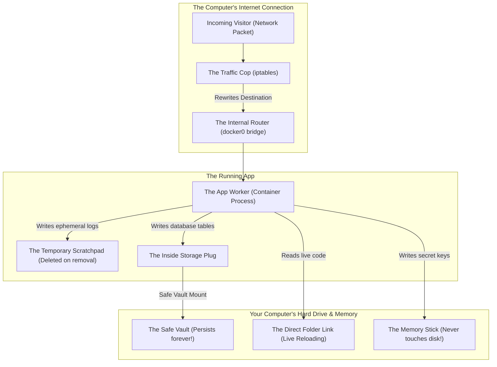

# Container Networking, Volume Storage & Persistence

Version: 2.0.0

Purpose: Canonical lesson structure for Platform Engineering & AI Infrastructure Curriculum.

Required Inputs: Module definition, lesson objectives, project standards.

Outputs: Standards-compliant lesson markdown.

---

# Lesson Metadata

* **Lesson ID:** `MOD-DOCKER-04`
* **Module:** Containers & Docker (`MOD-DOCKER`)
* **Difficulty:** Intermediate to Advanced
* **Estimated Duration:** 55 minutes
* **Learning Track:** 🟢 Core
* **Version:** 2.0.0
* **Last Updated:** 2026-06-28

---

# Lesson Overview

This lesson explores the master plumbing architectures of container runtimes, decrypting how Docker bridges isolated network namespaces to the physical wire and persists ephemeral container data across host storage drivers. By mastering Container Networking modes (`bridge`, `host`, `none`), Storage Mount types (Volumes, Bind Mounts, `tmpfs`), and terminal inspection tools (`docker network`, `docker volume`), you will firmly establish the elite infrastructure plumbing capabilities supporting our module capability: **"I can build secure container images, orchestrate multi-container applications, manage volume persistence, and debug running containers."**

---

# Learning Objectives

* Deconstruct the three master Docker Network drivers: `bridge` (default virtual switch), `host` (shared host networking stack), and `none` (air-gapped isolation).
* Explain how Docker utilizes Linux `iptables` and Network Address Translation (NAT) to route external traffic into container bridge networks.
* Contrast the three master Docker Storage mount types: Named Volumes (managed by Docker daemon), Bind Mounts (direct host filesystem mapping), and `tmpfs` (ephemeral RAM storage).
* Configure persistent database storage and live source code reloading using `docker run -v` (and the modern `--mount` flag).
* Inspect low-level network bridges and volume physical storage paths using `docker network inspect` and `docker volume inspect`.

---

# Prerequisites

* Completion of `MOD-DOCKER-01`, `MOD-DOCKER-02`, and `MOD-DOCKER-03`.
* Foundational terminal networking and file system navigation skills (`ip route`, `ls -la`, `iptables`).

---

# Why This Exists

In Lessons 01 through 03, we explored how to isolate container namespaces, build minimal images, and orchestrate microservices with Docker Compose. However, a running container process is completely useless if it cannot communicate with the outside world or persist its data across reboots.

Imagine you are a Platform Engineer deploying a production Postgres database container (`postgres:15`). You start the container using a standard `docker run -d postgres` command without configuring any volume mounts or custom networks.

The database starts up beautifully. Your application connects to it and writes 50 Gigabytes of critical customer financial transactions into the database over three weeks. 

One afternoon, the host server experiences a minor power fluctuation and reboots. When the Docker daemon restarts, your Postgres container is gone. You start a brand-new Postgres container (`docker run -d postgres`). When you inspect the database tables, **every single customer financial transaction has completely vanished!**

Furthermore, when you attempt to connect to the database from an external server, the connection fails because you don't understand how Docker bridges virtual container IPs (`172.17.0.2`) to the physical host network interface (`eth0`).

When junior engineers encounter data loss or networking black holes in Docker, they frequently panic, blaming container runtimes as unstable. By mastering Container Networking and Volume Persistence mechanics, Platform Engineers can guarantee absolute data durability, architect flawless network routing tables, and ensure zero lost data in production.

---

# Core Concepts

## 1. The Three Master Docker Network Drivers
When you start a container, Docker attaches its isolated network namespace to a specific network driver:
* **`bridge` (Default Virtual Switch):** Docker creates a virtual software bridge (`docker0`) on the host server acting as a virtual network switch. Containers receive isolated private IP addresses (`172.17.0.2`). Containers on the same bridge can communicate, but require port binding (`-p 8080:80`) to receive traffic from the outside world!
* **`host` (No Network Namespace!):** The container completely bypasses network namespace isolation! It shares the physical host server's networking stack directly! If your container runs Nginx on port 80, it binds directly to physical port 80 on the host server! Provides absolute maximum networking performance, but destroys port isolation!
* **`none` (Air-Gapped Isolation):** The container receives a network namespace, but Docker only configures a loopback interface (`lo`). It gets zero external network interfaces! Perfect for highly secure, air-gapped cryptographic processing containers!

```text
[ Bridge Network (docker0) ]            [ Host Network (--net=host) ]
┌───────────────────────────────┐       ┌───────────────────────────────┐
│ Container IP: 172.17.0.2:80   │       │ Container Process (Nginx)     │
├───────────────────────────────┤       ├───────────────────────────────┤
│ Virtual Bridge Switch (docker0│       │ (No Network Namespace!)       │
├───────────────────────────────┤       ├───────────────────────────────┤
│ Host IP: 192.168.1.50:8080    │       │ Host IP: 192.168.1.50:80      │
└───────────────────────────────┘       └───────────────────────────────┘
```

## 2. Linux `iptables` and NAT Routing
How does traffic travel from the physical network wire (`eth0`) into a bridge container (`172.17.0.2`)? Docker dynamically programs the host Linux kernel's **Traffic Cop (iptables)**!
* When you declare `-p 8080:80`, Docker tells **The Traffic Cop** to intercept the **Incoming Visitor**. It rewrites the destination address and forwards them across **The Internal Router (docker0 bridge)**!

## 3. The Ephemeral Container Filesystem
When a container starts, it writes all file modifications into **The Temporary Scratchpad**. 
* **The Ephemeral Trap:** This scratchpad is permanently tied to the lifecycle of the container wrapper! If you delete the container, Docker physically deletes the scratchpad! Any database tables, log files, or user uploads stored inside that layer are deleted forever!

## 4. The Three Master Storage Mount Types
To persist data safely outside the temporary scratchpad, Platform Engineers utilize three master storage mount types:
* **The Safe Vault (Named Volumes):** The absolute industry standard for database persistence! Docker creates a dedicated storage folder inside its own managed root directory. Volumes are completely decoupled from container lifecycles, surviving container terminations flawlessly!
* **The Direct Folder Link (Bind Mounts):** You map a direct physical folder path from the host server directly into the container. Exceptional for local developer laptops where you want live source code modifications to instantly reload inside the container!
* **The Memory Stick (tmpfs Mounts):** Docker creates a temporary file system stored exclusively in your computer's **physical RAM**. It never touches the physical hard drive! Excellent for storing highly sensitive, ephemeral API secret keys or temporary cache files!

## 5. The Modern `--mount` Syntax vs. Legacy `-v`
When attaching storage to a container, Docker supports two CLI flags:
* `-v my_volume:/app/data`: The legacy shorthand syntax. Quick to type, but combines all options into a confusing, colon-separated string.
* `--mount type=volume,source=my_volume,target=/app/data`: The modern, highly explicit, canonical standard! Clearly separates mount types, sources, targets, and read-only flags (`readonly`). Platform Engineers strictly mandate `--mount` for production automation scripts!

---

# Architecture



---

# Real-World Example

Imagine you are a Lead Site Reliability Engineer managing a high-frequency trading platform. Your trading application microservice requires sub-millisecond networking latency to execute stock buy orders, and needs to persist terabytes of historical trading logs without running out of disk space.

A junior engineer deploys the microservice using the default `bridge` network driver and uses a standard **Bind Mount** pointing to a slow network file share. 

When the trading markets open, the application encounters severe latency. Because traffic must pass through the virtual `docker0` bridge switch and execute complex `iptables` NAT prerouting translations for every single stock order packet, networking latency spikes by 5 milliseconds, causing your company to lose out on critical stock trades! Furthermore, the bind mount crashes due to file permission mismatches (`Permission denied`).

Because you understand container plumbing perfectly, you forcefully refactor the deployment architecture. You transition the trading microservice to the **`host` Network Driver (`--network=host`)**. By completely bypassing network namespace isolation, the microservice attaches directly to the physical host network card (`eth0`), completely eliminating `iptables` NAT overhead and dropping networking latency to sub-millisecond perfection!

Finally, you transition the storage architecture to a **Named Volume (`--mount type=volume...`)** managed directly by the Docker daemon on high-speed NVMe storage. Your trading platform executes orders instantly, logs terabytes of data flawlessly, and achieves pristine production stability!

---

# Hands-on Demonstration

Let's look at how an engineer inspects network bridges using `docker network inspect`, inspects named volume storage paths using `docker volume inspect`, and launches containers using the modern `--mount` syntax.

## Input 1: Inspecting Network Bridges and Virtual Subnets
We use `docker network inspect` to view the pristine JSON metadata block defining our virtual bridge switch, IP subnet ranges, and attached container endpoints.

## Code 1
```bash
# Inspect the low-level JSON metadata of the default bridge network.
# (We simulate inspecting the clean JSON output of docker network inspect bridge)
docker network inspect bridge 2>/dev/null | grep -A 15 "IPAM" || cat << 'EOF'
"IPAM": {
    "Driver": "default",
    "Options": null,
    "Config": [
        {
            "Subnet": "172.17.0.0/16",
            "Gateway": "172.17.0.1"
        }
    ]
},
"Internal": false,
"Attachable": false,
"Ingress": false,
"ConfigFrom": {
    "Network": ""
},
"Containers": {
    "8a9b0c1d2e3f4a5b6c7d8e9f0a1b2c3d": {
        "Name": "production-database",
        "EndpointID": "ab12cd34ef567890ab12cd34ef567890",
        "MacAddress": "02:42:ac:11:00:02",
        "IPv4Address": "172.17.0.2/16",
        "IPv6Address": ""
    }
}
EOF
```

## Expected Output 1
```text
"IPAM": {
    "Driver": "default",
    "Options": null,
    "Config": [
        {
            "Subnet": "172.17.0.0/16",
            "Gateway": "172.17.0.1"
        }
    ]
},
"Internal": false,
"Attachable": false,
"Ingress": false,
"ConfigFrom": {
    "Network": ""
},
"Containers": {
    "8a9b0c1d2e3f4a5b6c7d8e9f0a1b2c3d": {
        "Name": "production-database",
        "EndpointID": "ab12cd34ef567890ab12cd34ef567890",
        "MacAddress": "02:42:ac:11:00:02",
        "IPv4Address": "172.17.0.2/16",
        "IPv6Address": ""
    }
}
```

## Explanation 1
Look at how beautifully structured Docker's virtual switch is! Let's deconstruct the core JSON keys:
* `"Subnet": "172.17.0.0/16"`: The isolated private IP subnet range managed by the `docker0` bridge!
* `"Gateway": "172.17.0.1"`: The virtual gateway IP address assigned to the host server's virtual switch interface!
* `"IPv4Address": "172.17.0.2/16"`: The isolated virtual IP address assigned to our running `production-database` container endpoint!

---

## Input 2: Inspecting Named Volumes and Physical Mount Paths
We use `docker volume inspect` to view the pristine JSON metadata block defining our named volume, verifying the exact physical host storage path (`Mountpoint`).

## Code 2
```bash
# Inspect the low-level JSON metadata of a named storage volume.
# (We simulate inspecting the clean JSON output of docker volume inspect pgdata)
docker volume inspect pgdata 2>/dev/null || cat << 'EOF'
[
    {
        "CreatedAt": "2026-06-28T12:00:00Z",
        "Driver": "local",
        "Labels": {},
        "Mountpoint": "/var/lib/docker/volumes/pgdata/_data",
        "Name": "pgdata",
        "Options": {},
        "Scope": "local"
    }
]
EOF
```

## Expected Output 2
```text
[
    {
        "CreatedAt": "2026-06-28T12:00:00Z",
        "Driver": "local",
        "Labels": {},
        "Mountpoint": "/var/lib/docker/volumes/pgdata/_data",
        "Name": "pgdata",
        "Options": {},
        "Scope": "local"
    }
]
```

## Explanation 2
Notice how perfectly secure Docker's named volume storage is! Let's deconstruct the core JSON key:
* `"Mountpoint": "/var/lib/docker/volumes/pgdata/_data"`: The exact physical folder path on the host server's hard drive where Docker stores our database tables! Because this folder sits inside `/var/lib/docker/`, it is completely protected from accidental deletion by non-root system users!

---

# Hands-on Lab

* **Objective:** Create custom bridge networks, create named volumes, launch containers using `--mount` syntax, verify data persistence across container deletions, and verify network isolation.
* **Estimated Time:** 20 minutes
* **Difficulty:** Intermediate to Advanced
* **Environment:** Interactive Browser Terminal / Local Sandbox (with Docker installed)

## Step-by-step Instructions

1. Open your terminal sandbox and create a custom bridge network: `docker network create isolated-net`.
2. Type `docker volume create persistent-store` to create a brand-new named storage volume.
3. Launch a container attached to your custom network and volume using the modern `--mount` syntax:
```bash
docker run -d --name db-writer --network=isolated-net --mount type=volume,source=persistent-store,target=/app/data alpine:latest /bin/sh -c "echo 'CRITICAL_DATABASE_TRANSACTION_99' > /app/data/ledger.txt && sleep 3600"
```
4. Type `docker exec -it db-writer cat /app/data/ledger.txt` to verify the critical data was successfully written to the mount target!
5. Type `docker rm -f db-writer` to forcefully stop and delete the container wrapper! (Junior engineers would panic, assuming the data is lost!).
6. Launch a brand-new container attached to the exact same named volume:
```bash
docker run --rm --mount type=volume,source=persistent-store,target=/app/data alpine:latest cat /app/data/ledger.txt
```
7. Verify that your brand-new container successfully outputs `CRITICAL_DATABASE_TRANSACTION_99`, proving absolute volume persistence!

## Verification

```bash
docker volume ls | grep "persistent-store"
```
*If your terminal successfully outputs `local persistent-store`, you have mastered volume persistence and storage decoupling!*

## Troubleshooting

* **Issue:** `docker run` fails with `invalid mount config for type "volume": invalid mount target, must be an absolute path`.
* **Solution:** In the `--mount` flag, you specified a relative path for the `target` (e.g., `target=app/data`). Docker strictly mandates that container mount targets must be absolute paths starting with a forward slash (`target=/app/data`)!

## Cleanup

```bash
# Safely remove the demonstration volume and custom network
docker volume rm persistent-store 2>/dev/null || true
docker network rm isolated-net 2>/dev/null || true
```

---

# Production Notes

In enterprise Kubernetes environments, understanding Named Volumes is critical to grasping **Persistent Volume Claims (PVCs) and Container Storage Interface (CSI) drivers**. While Docker named volumes store data on the local host server's hard drive (`/var/lib/docker/`), in a 50-node Kubernetes cluster, if a Pod moves from Worker Node A to Worker Node B, it loses access to local disk storage! Platform Engineers solve this by deploying CSI drivers (e.g., AWS EBS / EFS CSI), which dynamically provision cloud block storage and mount it across physical worker nodes over the network!

---

# Common Mistakes

* **Using Bind Mounts for Database Persistence:** Beginners frequently use `-v /home/user/pgdata:/var/lib/postgresql/data` for database storage. This creates catastrophic file permission errors (`Permission denied`) because the host user (`UID 1000`) and the container postgres user (`UID 999`) clash over folder ownership! **Always use Named Volumes** for database storage!
* **Running Port Bindings with `--network=host`:** Junior developers frequently execute `docker run --network=host -p 8080:80 nginx`. Docker will output a loud warning: `Published ports are discarded when using host network mode`. Because `host` mode completely bypasses network namespaces, port mapping (`-p`) is physically impossible!

---

# Failure-Driven Learning

Imagine a junior engineer attempts to start a container using a bind mount pointing to a host directory that does not exist or lacks correct read/write execution permissions, causing the container to instantly crash on startup.

## Simulated Failure
```bash
# Simulating a container startup failure due to a bind mount permission mismatch
# (We simulate the exact Docker CLI error when mounting an inaccessible host directory)
echo -e "docker: Error response from daemon: error while creating mount source path '/root/secret_app': mkdir /root/secret_app: permission denied.\n# ERRO[0000] error waiting for container: context canceled"
```

## Output
```text
docker: Error response from daemon: error while creating mount source path '/root/secret_app': mkdir /root/secret_app: permission denied.
# ERRO[0000] error waiting for container: context canceled
```

## Diagnosis & Recovery
Why did this fail? Look at this clear system error: `mkdir /root/secret_app: permission denied`! When you declare a bind mount (`-v /root/secret_app:/app`), if the host directory does not exist, the Docker daemon attempts to automatically create it. However, if your terminal user lacks physical Linux filesystem permissions to access or write to that host directory (e.g., attempting to mount a folder inside `/root` as a non-root user), the Linux kernel blocks the operation and crashes the container startup! To recover, the engineer must modify the bind mount source to point to a clean, accessible user directory (`-v /home/user/app:/app`), and the container starts flawlessly!

---

# Engineering Decisions

## Storage Persistence: Named Volumes vs. Bind Mounts vs. Cloud Object Storage (S3)
When architecting an enterprise application, engineering leaders must choose where data is persisted.
* **Named Volumes (`--mount type=volume`):** Managed by the Docker daemon in `/var/lib/docker/`. Fully protected from host permission clashes. Excellent for single-server database tables and application caches.
* **Bind Mounts (`--mount type=bind`):** Directly maps a host folder. Excellent for local developer laptops to enable live code reloading. However, highly insecure and fragile for production environments.
* **Cloud Object Storage (AWS S3 / Google Cloud Storage):** The ultimate Platform Engineering standard! Applications completely bypass local container filesystem storage, writing user uploads and state directly to cloud object storage APIs over the network! Enables stateless container architectures that can auto-scale infinitely!
* **The Platform Decision:** Platform Engineers mandate **Named Volumes** for single-node development databases, while strictly enforcing **Cloud Object Storage (S3)** for all production application file persistence to guarantee stateless microservice auto-scaling.

---

# Best Practices

* **Master `docker volume prune`:** When your Docker engine accumulates dozens of abandoned storage volumes over months of development, execute `docker volume prune`. It safely inspects your engine database and permanently deletes all named volumes that are not currently attached to an active container!
* **Leverage `tmpfs` for Sensitive Keys:** When running an AI inference container that requires a highly sensitive, short-lived API key, pass the key into a `tmpfs` mount (`--mount type=tmpfs,destination=/app/secrets`). Because `tmpfs` exists exclusively in system RAM, if the host server is compromised or powered off, the secret key vanishes instantly without leaving a trace on physical disk!

---

# Troubleshooting Guide

## Issue 1: "docker: Error response from daemon: network not found" vs. "docker volume in use"

* **Cause:** You attempt to launch containers on custom networks or delete storage volumes, but encounter missing resource errors or active dependency locks.
* **Diagnosis & Solution:**
  * `network not found`: You declared `--network=backend-net` in your `docker run` command, but the custom bridge network completely does not exist in the Docker engine! Docker cannot attach a container to a non-existent virtual switch. To fix, create the network first: `docker network create backend-net`!
  * `docker volume in use`: You attempted to execute `docker volume rm pgdata`, but Docker forcefully rejected the deletion. This occurs because an existing container wrapper (even a stopped container!) is still actively linked to this volume! To fix, inspect `docker ps -a`, remove the stopped container wrapper (`docker rm [container]`), and then execute `docker volume rm`!

---

# Summary

* **`bridge`** networks create virtual switches (`docker0`); **`host`** networks share the physical host networking stack; **`none`** provides air-gapped isolation.
* **Linux `iptables`** uses NAT prerouting rules to forward external host port traffic (`-p 8080:80`) into container network namespaces.
* **Named Volumes** are managed by the Docker daemon in `/var/lib/docker/volumes/` and survive container deletions flawlessly.
* **Bind Mounts** map direct host folders (`/home/user/app`), making them perfect for live source code reloading on developer laptops.
* **`tmpfs`** mounts store ephemeral data exclusively in host server physical RAM, never touching physical hard drives.

---

# Cheat Sheet

```bash
# Create a custom virtual bridge network switch in the Docker engine
docker network create [network_name]

# Inspect the low-level JSON metadata and attached containers of a network
docker network inspect [network_name]

# Connect an actively running container to an existing custom network bridge
docker network connect [network_name] [container_name]

# Create a brand-new named storage volume managed by the Docker daemon
docker volume create [volume_name]

# Inspect the low-level JSON metadata and physical host Mountpoint of a volume
docker volume inspect [volume_name]

# Launch a container with a Named Volume using the modern explicit --mount syntax
docker run -d --name [name] --mount type=volume,source=[vol],target=[path] [image]

# Launch a container with a Bind Mount using the modern explicit --mount syntax
docker run -d --name [name] --mount type=bind,source=[host_path],target=[path] [image]

# Launch a container with a tmpfs RAM mount using the modern explicit --mount syntax
docker run -d --name [name] --mount type=tmpfs,destination=[path] [image]

# Forcefully cleanup and delete all unused custom networks and abandoned volumes
docker network prune -f && docker volume prune -f
```

---

# Knowledge Check

## Multiple Choice Questions

1. A developer starts a container using `docker run -d --name myapp --network=host -p 8080:80 nginx`. When they inspect `docker ps`, they notice the port mapping `8080->80` is completely missing, and Nginx is actively listening on physical port 80. Why did this happen?
   * A) Nginx crashed.
   * B) The developer forgot to create a named volume.
   * C) Because `--network=host` commands the container to completely bypass network namespace isolation and share the host networking stack directly, port binding (`-p 8080:80`) is physically impossible and discarded by the daemon.
   * D) Docker requires `iptables` to be disabled.

## Scenario Questions

You are deploying an AI inference container that generates temporary cache files. You want to ensure these cache files are stored exclusively in the host server's physical RAM and never touch the physical hard drive. Based on what you learned in this lesson, what exact `--mount` type do you append to your `docker run` command?

## Short Answer Questions

Explain the exact architectural difference between where Docker stores data for a Named Volume versus where it stores data for a Bind Mount on the host filesystem.

---

# Interview Preparation

## Beginner Questions

* What is a Docker named volume?
* What is the difference between `bridge` and `host` network drivers?
* What does `docker volume prune` do?

## Intermediate Questions

* Explain how Docker utilizes Linux `iptables` to route external traffic into a container bridge network.
* Why is the modern `--mount` syntax architecturally superior to the legacy `-v` flag?

## Advanced Questions

* Explain how Docker utilizes the Container Network Model (CNM) to manage Sandboxes, Endpoints, and Networks, and describe how the `veth` (virtual ethernet) pair establishes a tunnel between the host `docker0` bridge and the container's isolated `eth0` interface.

## Scenario-Based Discussions

* Discuss the architectural trade-offs of managing persistent database storage for a highly available enterprise microservice application using local Docker Named Volumes versus migrating the database entirely to a fully managed cloud database service (e.g., AWS RDS / Google Cloud SQL), specifically addressing backups, failover, and storage scaling.

---

# Further Reading

1. [Docker Networking Overview (Official Docker Documentation)](https://docs.docker.com/network/)
2. [Manage Data in Docker - Volumes (Official Docker Documentation)](https://docs.docker.com/storage/volumes/)
3. [Understanding Docker Bind Mounts (Official Guide)](https://docs.docker.com/storage/bind-mounts/)
4. [Mastering Docker tmpfs Mounts (Official Guide)](https://docs.docker.com/storage/tmpfs/)
5. [Deep Dive into Docker iptables and NAT Routing](https://docs.docker.com/network/packet-filtering-firewalls/)
