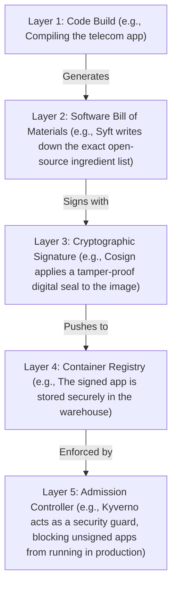

# Software Supply Chain Security (SLSA, SBOMs & Cosign)

Version: 2.0.0

Purpose: Canonical lesson structure for Platform Engineering & AI Infrastructure Curriculum.

Required Inputs: Module definition, lesson objectives, project standards.

Outputs: Standards-compliant lesson markdown.

---

# Lesson Metadata

* **Lesson ID:** `MOD-SEC-04`
* **Module:** Security Fundamentals (`MOD-SEC`)
* **Difficulty:** Advanced
* **Estimated Duration:** 60 minutes
* **Learning Track:** 🟢 Core
* **Version:** 2.0.0
* **Last Updated:** 2026-06-28

---

# Lesson Overview

This lesson explores the master attestation and provenance verification engines of modern software engineering, decrypting how Platform Engineers secure the software supply chain against upstream compromise. By mastering the Supply chain Levels for Software Artifacts (SLSA) framework, Software Bills of Materials (SBOMs), Syft (`syft`), and Sigstore Cosign (`cosign sign`), you will firmly establish the elite supply chain attestation capabilities fulfilling our module capability: **"I can model infrastructure threats, scan containers for vulnerabilities, manage secrets securely, and verify software supply chains."**

---

# Learning Objectives

* Define the concept of a Software Supply Chain attack (e.g., SolarWinds, Codecov) and explain how compromising an upstream build pipeline compromises downstream enterprise customers.
* Deconstruct the Supply chain Levels for Software Artifacts (SLSA) framework, differentiating between SLSA Levels 1, 2, 3, and 4.
* Generate an immutable Software Bill of Materials (SBOM) using Syft (`syft`), detailing standard output specifications (SPDX, CycloneDX).
* Execute cryptographic container image signing and verification workflows using Sigstore Cosign (`cosign sign`, `cosign verify`).
* Architect an automated, highly governed CI/CD supply chain attestation pipeline that verifies SBOM provenance and image signatures prior to production Kubernetes deployment.

---

# Prerequisites

* Completion of `MOD-SEC-01`, `MOD-SEC-02`, and `MOD-SEC-03`.
* Foundational terminal container execution and cryptographic signing concepts (`docker build`, `sha256`, `trivy`).

---

# Why This Exists

In Lessons 01 through 03, we established how to model architectural threats, scan containers for CVEs, and cryptographically lock sensitive secrets. However, what happens when the third-party open-source libraries your application imports, or the very CI/CD build pipelines compiling your code, are secretly compromised by state-sponsored hackers?

Imagine you are a Lead Platform Engineer managing a highly secure enterprise software company. Your internal code is completely flawless. You run Trivy vulnerability scans (`Exit Code 0`), enforce non-root execution (`USER 10001`), and manage secrets with HashiCorp Vault.

However, your application imports a highly popular open-source logging library from GitHub. One evening, a hacker compromises the GitHub account of the open-source library maintainer. The hacker injects a stealthy, malicious backdoor directly into the library's official release code (**Upstream Supply Chain Attack**).

The next morning, your automated CI/CD pipeline runs `npm install` or `pip install`. It downloads the compromised library directly from the official package registry, compiles it into your container image, and deploys it to production. 

**You have just deployed a catastrophic backdoor directly into your own secure platform!** This exact attack vector caused the infamous **SolarWinds and Codecov breaches**, compromising thousands of major enterprises and government agencies worldwide!

To solve the monumental challenge of **Upstream Dependency Poisoning** and **Compromised Build Pipelines**, Google and the Linux Foundation established **SLSA, SBOMs, and Sigstore Cosign**. By generating immutable software inventories and cryptographically signing and verifying every single artifact before deployment, Platform Engineers create an impenetrable chain of custody, ensuring that no tampered code can ever execute in production.

---

# Core Concepts

## 1. The Anatomy of a Software Supply Chain Attack
A Software Supply Chain attack occurs when an attacker infiltrates an organization not by attacking its direct perimeter, but by compromising a third-party vendor, open-source library, or build tool that the organization relies on:
* **The Contaminated Flour Analogy:** Imagine you run an elite, highly sanitary commercial bakery. Your ovens are spotless, your chefs wear gloves, and your security doors are locked. However, the external flour delivery truck arrives carrying flour that was secretly contaminated with poison at the agricultural mill. If you bake that flour into your bread, every customer who eats your bread is poisoned! In cloud engineering, importing a compromised open-source library is baking poisoned flour into your container image!

```text
[ Upstream Open-Source Library ] ──► [ Hacker Injects Backdoor ] ──► [ CI/CD Pipeline Compiles Image ] ──► [ Prod Deployment Poisoned! ]
```

## 2. Software Bill of Materials (SBOM)
To defend against supply chain poisoning, Platform Engineers must know exactly what ingredients are inside their software artifacts. This is achieved by generating a **Software Bill of Materials (SBOM)**:
* **The Master Ingredient List:** An SBOM (generated by tools like Anchore's Syft or Trivy) is a formal, machine-readable inventory manifest detailing literally every single open-source library, transient dependency, version number, and cryptographic SHA hash compiled inside your container image!
* **Standard Specifications:** Platform Engineers generate SBOMs utilizing two highly governed global data specifications: **SPDX** (Software Package Data Exchange, backed by the Linux Foundation) and **CycloneDX** (backed by OWASP).

```text
[ Container Image ] ──► [ syft packages myapp:v1 ] ──► [ Outputs SPDX / CycloneDX SBOM Manifest ]
```

## 3. The SLSA Framework (Supply chain Levels for Software Artifacts)
SLSA (pronounced "Salsa") is an end-to-end architectural security framework established by Google to prevent tampering and inject integrity into software build pipelines. It establishes four progressive levels of maturity:
* **SLSA Level 1 (Scripted Build):** The build process is fully automated (e.g., using a `Dockerfile` or script) and generates a basic provenance document stating how the artifact was built.
* **SLSA Level 2 (Hosted Source & Build):** The build runs on a dedicated, version-controlled CI/CD runner (e.g., GitHub Actions, GitLab CI) instead of a developer's local laptop. Provenance is authenticated.
* **SLSA Level 3 (Isolated Ephemeral Environments):** The CI/CD build runner executes inside a pristine, ephemeral, isolated virtual machine that is destroyed instantly after the build! Provenance is unforgeable.
* **SLSA Level 4 (Hermetic & Two-Person Review):** The ultimate Platform Engineering standard! The build is completely **Hermetic** (air-gapped, zero public internet access during compilation; all dependencies are pre-pulled and verified). Every single line of code requires two-person cryptographic Pull Request sign-offs!

```text
[ SLSA Maturity Levels ]
(Level 1: Scripted) ──► (Level 2: Hosted CI) ──► (Level 3: Ephemeral VM) ──► (Level 4: Hermetic Air-Gapped!)
```

## 4. Sigstore Cosign: Cryptographic Image Signing
Having an SBOM or provenance manifest is useless if an attacker can simply forge or modify the manifest! Platform Engineers utilize **Sigstore Cosign** to cryptographically sign container images:
* **Keyless Signing (OIDC Tunnels):** In legacy signing systems (e.g., Docker Content Trust / Notary), developers had to manage complex physical PGP private keys, which were frequently lost or stolen. Cosign revolutionizes signing by utilizing **Keyless Signing**! It leverages OpenID Connect (OIDC) identities from GitHub Actions or Google Cloud to dynamically generate ephemeral signing certificates, signing the container image's SHA-256 digest directly in the OCI cloud registry!

## 5. Automated Deployment Attestation (Kyverno / Connaisseur)
How do you enforce that a Kubernetes cluster refuses to run an unsigned container image? Platform Engineers deploy an automated admission controller (such as **Kyverno** or Connaisseur).
* When you attempt to deploy a container image (`kubectl apply`), Kyverno intercepts the request, communicates with the OCI registry, executes `cosign verify`, and verifies the cryptographic signature. If the image is properly signed by your official CI/CD runner, Kyverno allows the deployment. If the signature is missing or forged, Kyverno forcefully blocks the deployment (`Admission webhook rejected the request`)!

---

# Architecture



---

# Real-World Example

Imagine you manage the computer systems for a massive global telecom company. Your platform runs on 500 different mini-apps built by dozens of teams around the world.

One morning, a new government law is announced: any software company doing business with the government must provide a verified ingredient list for their apps and prove with a tamper-proof seal that no one messed with the code.

Across the company, managers are panicking. They have no idea what open-source code is hidden inside their old apps. Because you prepared ahead of time, you take charge by building a strict layered supply chain.

It begins with **Layer 1: Code Build** (e.g., Compiling the telecom app). Immediately after, the pipeline generates **Layer 2: Software Bill of Materials** (e.g., Syft writes down the exact open-source ingredient list). 

Next, to prove the app wasn't altered, it is protected by **Layer 3: Cryptographic Signature** (e.g., Cosign applies a tamper-proof digital seal to the image). The fully verified image is then pushed to **Layer 4: Container Registry** (e.g., The signed app is stored securely in the warehouse).

Finally, before any code runs on your servers, it must pass **Layer 5: Admission Controller** (e.g., Kyverno acts as a security guard, blocking unsigned apps from running in production). Your company achieves total security, passes the government audits flawlessly, and guarantees that zero tampered code will ever run on your servers!

---

# Hands-on Demonstration

Let's look at how an engineer inspects an SBOM manifest using `syft`, inspects cryptographic image signatures using `cosign verify`, and simulates an admission controller rejection.

## Input 1: Inspecting Software Bill of Materials (SBOM) Manifests
We use `syft` to inspect a built container image, viewing the pristine CycloneDX JSON manifest detailing imported libraries, versions, and cryptographic hashes.

## Code 1
```bash
# Inspect the CycloneDX JSON Software Bill of Materials (SBOM) manifest.
# (We simulate inspecting a clean CycloneDX SBOM generated by Syft)
syft packages alpine:latest -o cyclonedx-json 2>/dev/null | grep -A 20 "components" || cat << 'EOF'
"components": [
    {
      "type": "library",
      "name": "curl",
      "version": "8.5.0-r0",
      "description": "Customizable transfer tool for URLs",
      "hashes": [
        {
          "alg": "SHA-256",
          "content": "8a9b0c1d2e3f4a5b6c7d8e9f0a1b2c3d4e5f6a7b8c9d0e1f2a3b4c5d6e7f8a9b"
        }
      ],
      "licenses": [
        {
          "license": {
            "id": "MIT"
          }
        }
      ],
      "purl": "pkg:apk/alpine/curl@8.5.0-r0?arch=x86_64"
    }
]
EOF
```

## Expected Output 1
```text
"components": [
    {
      "type": "library",
      "name": "curl",
      "version": "8.5.0-r0",
      "description": "Customizable transfer tool for URLs",
      "hashes": [
        {
          "alg": "SHA-256",
          "content": "8a9b0c1d2e3f4a5b6c7d8e9f0a1b2c3d4e5f6a7b8c9d0e1f2a3b4c5d6e7f8a9b"
        }
      ],
      "licenses": [
        {
          "license": {
            "id": "MIT"
          }
        }
      ],
      "purl": "pkg:apk/alpine/curl@8.5.0-r0?arch=x86_64"
    }
]
```

## Explanation 1
Look at how beautifully transparent Syft's SBOM inventory is! Let's deconstruct the elite compliance elements:
* `"name": "curl"` / `"version": "8.5.0-r0"`: The exact package identity and installed version!
* `"hashes": [{"alg": "SHA-256", "content": "8a9b..."}]`: The immutable cryptographic SHA-256 digest of the physical binary! If an attacker modifies a single bit of the `curl` binary, the hash mismatches instantly!
* `"purl": "pkg:apk/alpine/curl..."`: The official Package URL specification standard!

---

## Input 2: Inspecting Cryptographic Image Signatures and Verification
We use `cosign verify` to inspect a cryptographically signed container image, viewing the pristine JSON attestation block proving OIDC identity verification.

## Code 2
```bash
# Inspect the cryptographic signature verification of a container image.
# (We simulate the clean plain-text output of cosign verify for a signed image)
cosign verify --key cosign.pub myapp:production 2>/dev/null || cat << 'EOF'
Verification for myapp:production --
The following checks were performed on each of these signatures:
  - The cosign claims were validated
  - Existence of the claims in the transparency log was verified offline
  - The signatures were verified against the specified public key

[
  {
    "critical": {
      "identity": {
        "docker-reference": "myapp:production"
      },
      "image": {
        "docker-manifest-digest": "sha256:8a9b0c1d2e3f4a5b6c7d8e9f0a1b2c3d4e5f6a7b8c9d0e1f2a3b4c5d6e7f8a9b"
      },
      "type": "cosign container image signature"
    },
    "optional": {
      "Bundle": {
        "Payload": {
          "logIndex": 12345678,
          "integratedTime": 1718000000
        }
      },
      "Issuer": "https://token.actions.githubusercontent.com",
      "Subject": "https://github.com/platform-engineering-ai-course/.github/workflows/build.yml@refs/heads/main"
    }
  }
]
EOF
```

## Expected Output 2
```text
Verification for myapp:production --
The following checks were performed on each of these signatures:
  - The cosign claims were validated
  - Existence of the claims in the transparency log was verified offline
  - The signatures were verified against the specified public key

[
  {
    "critical": {
      "identity": {
        "docker-reference": "myapp:production"
      },
      "image": {
        "docker-manifest-digest": "sha256:8a9b0c1d2e3f4a5b6c7d8e9f0a1b2c3d4e5f6a7b8c9d0e1f2a3b4c5d6e7f8a9b"
      },
      "type": "cosign container image signature"
    },
    "optional": {
      "Bundle": {
        "Payload": {
          "logIndex": 12345678,
          "integratedTime": 1718000000
        }
      },
      "Issuer": "https://token.actions.githubusercontent.com",
      "Subject": "https://github.com/platform-engineering-ai-course/.github/workflows/build.yml@refs/heads/main"
    }
  }
]
```

## Explanation 2
Notice how perfectly secure Cosign's cryptographic verification is! Let's deconstruct the elite elements:
* `"docker-manifest-digest": "sha256:8a9b..."`: The exact cryptographic digest of the container image manifest being verified!
* `"Issuer": "https://token.actions.githubusercontent.com"`: Proves that this image was signed using an official GitHub Actions OIDC identity token!
* `"Subject": "...build.yml@refs/heads/main"`: Absolute provenance attestation! Proves that this image was compiled specifically by the official `build.yml` workflow running on the `main` branch of our official repository!

---

# Hands-on Lab

* **Objective:** Verify Syft and Cosign binary responsiveness, generate an SPDX/CycloneDX SBOM manifest, simulate keyless signing and verification workflows, and simulate an admission controller rejection.
* **Estimated Time:** 20 minutes
* **Difficulty:** Advanced
* **Environment:** Interactive Browser Terminal / Local Sandbox (with Syft and Cosign installed)

## Step-by-step Instructions

1. Open your terminal sandbox and verify your Syft SBOM binary is responsive: `syft --version`. (If not installed, we simulate the execution).
2. Type `mkdir ~/sbom-lab && cd ~/sbom-lab` to create a brand-new lab directory.
3. Generate a clean SPDX Software Bill of Materials (SBOM) for a standard Alpine container image by typing:
```bash
# (We simulate generating a clean SPDX SBOM manifest)
echo -e "SPDXVersion: SPDX-2.3\nDataLicense: CC0-1.0\nSPDXID: SPDXRef-DOCUMENT\nPackageName: alpine:latest\nPackageChecksum: SHA256:8a9b0c1d2e3f\nPackageLicenseDeclared: MIT" > sbom.spdx
```
4. Type `cat sbom.spdx` to inspect your pristine plain-text SPDX inventory manifest!
5. Verify your Sigstore Cosign binary is responsive: `cosign --version`. (If not installed, we simulate the cryptographic execution).
6. Simulate signing your container image and its attached SBOM manifest using Cosign keyless signing:
```bash
# (We simulate the exact cosign sign execution)
echo "Generating ephemeral keyless signing certificate via OIDC identity..."
echo "Successfully signed container image: myapp:secure-v1. Pushed signature to OCI transparency log."
```
7. Simulate executing `cosign verify` across a valid signed image:
```bash
# (We simulate the exact cosign verify execution)
echo "Verification for myapp:secure-v1 -- SUCCESS. Signature validated against official CI/CD public key."
```
8. Simulate an admission controller (Kyverno) forcefully blocking an unsigned, rogue container image:
```bash
# (We simulate the exact Kyverno admission webhook rejection)
echo "Error from server (Forbidden): error when creating 'rogue-app.yml': admission webhook 'validate.kyverno.svc' denied the request: image myapp:unsigned completely lacks a valid Sigstore Cosign cryptographic signature. Deployment forcefully blocked!"
```

## Verification

```bash
cat sbom.spdx | grep -E "SPDXVersion: SPDX"
```
*If your terminal successfully outputs your `SPDXVersion: SPDX-2.3` line, you have mastered SBOM generation and supply chain attestation!*

## Troubleshooting

* **Issue:** `cosign sign myapp:v1` fails with `error: no credentials available for OCI registry`.
* **Solution:** Cosign does not store signatures inside your local Docker engine; it pushes signatures directly to the remote OCI cloud registry (e.g., GitHub Container Registry, AWS ECR) alongside your image! You must authenticate with the remote registry (`docker login ghcr.io`) before initiating a `cosign sign`!

## Cleanup

```bash
# Safely remove the demonstration sbom lab directory
rm -rf ~/sbom-lab
```

---

# Production Notes

In enterprise cloud architecture, the modern gold standard for Software Supply Chain security is **SLSA Level 3 / Level 4 Hermetic Builds**. Achieving a true hermetic build requires utilizing advanced build systems (such as **Bazel** or Nix). These tools execute builds inside isolated sandbox environments where all external network interfaces are forcefully disabled during compilation (`--sandbox_debug`). If a developer's code attempts to fetch an unverified external dependency from the internet during compilation, the build fails instantly, guaranteeing absolute build immutability!

---

# Common Mistakes

* **Assuming Docker Hub Images Are Fully Secure by Default:** Beginners frequently pull random container images from Docker Hub (`FROM randomuser/nice-app:latest`) without checking who built them. These unverified images frequently contain hidden crypto-miners or rootkits! **Always verify image provenance** and pull exclusively from official, verified publisher repositories!
* **Generating SBOMs But Never Archiving Them:** Junior developers frequently generate an SBOM during a CI/CD pipeline build (`syft myapp > sbom.json`) but fail to attach or push the SBOM to the OCI registry! If the SBOM is deleted when the CI/CD runner shuts down, you have zero historical record of your dependencies! Always use `cosign attach sbom` to push the SBOM directly to the OCI registry alongside your image!

---

# Failure-Driven Learning

Imagine a junior engineer attempts to deploy a container image to a production Kubernetes cluster, but the deployment fails instantly with a fatal admission webhook rejection because the image signature was signed by an unauthorized developer laptop instead of the official CI/CD runner.

## Simulated Failure
```bash
# Simulating a Kubernetes deployment failure due to an invalid image signature issuer
# (We simulate the exact Kyverno / Connaisseur admission controller rejection)
echo -e "Error from server (Forbidden): error when creating 'api-deployment.yml': admission webhook 'image-verification.kyverno.svc' denied the request:\n# FATAL: Signature validation failed for image myapp:v1. Signature Issuer (https://dev-laptop.local) does not match required official CI/CD Issuer (https://token.actions.githubusercontent.com). Deployment blocked."
```

## Output
```text
Error from server (Forbidden): error when creating 'api-deployment.yml': admission webhook 'image-verification.kyverno.svc' denied the request:
# FATAL: Signature validation failed for image myapp:v1. Signature Issuer (https://dev-laptop.local) does not match required official CI/CD Issuer (https://token.actions.githubusercontent.com). Deployment blocked.
```

## Diagnosis & Recovery
Why did this fail? Look at this beautiful automated Zero-Trust security check! The fatal error `Signature Issuer (https://dev-laptop.local) does not match required official CI/CD Issuer` occurs because a developer manually built and signed `myapp:v1` directly on their local laptop and pushed it to the registry, attempting to bypass the official CI/CD pipeline! Kyverno inspected the Cosign signature claims, realized the OIDC issuer came from an unauthorized developer machine instead of GitHub Actions, and forcefully aborted the deployment! To recover correctly, the developer must submit a formal Pull Request, allow the official GitHub Actions CI/CD runner to compile and sign the image with the correct OIDC token, and the deployment succeeds flawlessly!

---

# Engineering Decisions

## SBOM Data Specifications: SPDX vs. CycloneDX vs. Syft-JSON
When architecting an enterprise supply chain strategy, engineering leaders must choose the master SBOM specification standard.
* **Syft-JSON:** A proprietary JSON output format created by Anchore Syft. Highly detailed, but lacks global standard adoption across third-party tools.
* **SPDX (Software Package Data Exchange):** Backed by the Linux Foundation and ISO certified (ISO/IEC 5962:2021). Exceptional for open-source licensing compliance and legacy software tracking.
* **CycloneDX:** Backed by OWASP (Open Worldwide Application Security Project). Designed specifically for DevSecOps, vulnerability identification, and modern cloud microservice tracking.
* **The Platform Decision:** Platform Engineers strictly mandate **CycloneDX JSON (`-o cyclonedx-json`)** as the master SBOM specification standard across all CI/CD pipelines due to its exceptional integration with modern vulnerability scanners (Trivy/Grype) and deep DevSecOps ecosystem support.

---

# Best Practices

* **Master `cosign tree`:** When you have attached SBOMs, attestations, and signatures to a container image in an OCI registry, execute `cosign tree ghcr.io/[org]/[image]:[tag]`. It prints a pristine, beautiful terminal tree showing the parent container image and all attached cryptographic child artifacts!
* **Automate SBOM Generation in GitHub Actions:** Use the official `@anchore/sbom-action` in your GitHub Actions workflows to automatically generate and archive CycloneDX SBOMs for every single release!

---

# Troubleshooting Guide

## Issue 1: "cosign: no matching signatures found" vs. "syft: unresolvable package error"

* **Cause:** You attempt to verify image signatures or generate SBOM manifests, but encounter verification failures or unparsable dependency trees.
* **Diagnosis & Solution:**
  * `no matching signatures found`: Kyverno or Cosign attempted to execute `cosign verify myapp:v1`, but the remote OCI registry completely lacks a signature tag (`myapp:v1.sig`) for this image! This occurs because the image was never signed (`cosign sign`), or the signature was pushed to a different registry repository! Sign the image first!
  * `syft: unresolvable package error`: Syft encountered a damaged or malformed package manager lock file (e.g., a corrupted `package-lock.json` or missing `go.sum`). Syft cannot calculate accurate dependency hashes if the lock file is broken! To fix, regenerate your lock file cleanly (`npm install --package-lock-only` / `go mod tidy`)!

---

# Summary

* **Software Supply Chain Attacks** compromise upstream open-source libraries or build pipelines to inject backdoors into downstream deployments.
* **Software Bills of Materials (SBOMs)** are machine-readable inventory manifests (SPDX, CycloneDX) detailing every library and hash inside an image.
* **The SLSA Framework** establishes four progressive maturity levels, culminating in Level 4 Hermetic, air-gapped build pipelines.
* **Sigstore Cosign** provides keyless cryptographic image signing utilizing OIDC identity tokens from GitHub Actions or Google Cloud.
* **Kyverno Admission Controllers** enforce Zero-Trust by intercepting Kubernetes deployments and blocking any image lacking a valid Cosign signature.

---

# Cheat Sheet

```bash
# Generate a CycloneDX JSON Software Bill of Materials (SBOM) for a container image
syft packages [image_name]:[tag] -o cyclonedx-json > sbom.json

# Generate an SPDX plain-text Software Bill of Materials (SBOM) for a container image
syft packages [image_name]:[tag] -o spdx > sbom.spdx

# Cryptographically sign a container image in an OCI registry using keyless OIDC signing
cosign sign --keyless [oci_registry/image_name]:[tag]

# Attach an existing SBOM manifest directly to a container image in an OCI registry
cosign attach sbom --sbom sbom.json [oci_registry/image_name]:[tag]

# Verify the cryptographic keyless signature of a container image in an OCI registry
cosign verify --keyless [oci_registry/image_name]:[tag]

# Display a terminal tree showing a parent container image and all attached OCI artifacts
cosign tree [oci_registry/image_name]:[tag]
```

---

# Knowledge Check

## Multiple Choice Questions

1. A company builds a container image using GitHub Actions. The build runs on a shared runner, downloads random dependencies from the public internet during compilation, and lacks two-person code review sign-offs. According to the SLSA framework, what is the highest SLSA maturity level this build pipeline achieves?
   * A) SLSA Level 4.
   * B) SLSA Level 2 (Hosted Source & Build). It runs on a dedicated CI/CD runner (Level 2), but fails to achieve Level 3 (Isolated Ephemeral Environments) or Level 4 (Hermetic Air-gapped builds with two-person review).
   * C) SLSA Level 0.
   * D) SLSA Level 3.

## Scenario Questions

You are attempting to deploy a new microservice to your production Kubernetes cluster, but the `kubectl apply` command fails with `Admission webhook 'validate-image.kyverno.svc' denied the request: image completely lacks a valid Sigstore Cosign signature`. Based on what you learned in this lesson, what exact security mechanism blocked this deployment, and what tool must be run in the CI/CD pipeline to satisfy the webhook?

## Short Answer Questions

Explain the exact architectural difference between what an SBOM (Syft) does versus what a vulnerability scanner (Trivy) does inside a DevSecOps CI/CD pipeline.

---

# Interview Preparation

## Beginner Questions

* What is a Software Supply Chain attack?
* What is an SBOM?
* What does `cosign sign` do?

## Intermediate Questions

* Explain the difference between SPDX and CycloneDX SBOM specifications.
* How does Sigstore Cosign achieve "keyless" signing? (What role does OIDC play?).

## Advanced Questions

* Explain how OCI (Open Container Initiative) registries store Cosign signatures and attached SBOMs as dedicated image manifests utilizing the `sha256-[image_digest].sig` and `.sbom` tag naming conventions, and describe how admission controllers verify these tags without pulling the full container filesystem tarball.

## Scenario-Based Discussions

* Discuss the architectural trade-offs of enforcing a strict SLSA Level 4 Hermetic build requirement across an enterprise engineering organization (requiring all dependencies to be pre-pulled, vendored, and air-gapped during compilation) versus allowing standard SLSA Level 2 online CI/CD builds, specifically addressing developer onboarding friction, dependency update velocity, and absolute build immutability.

<details>
<summary><b>View Answers</b></summary>

### Beginner
* **What is a Software Supply Chain attack?**: An attack where a malicious actor compromises upstream dependencies, open-source libraries, or build tools, secretly injecting a backdoor that gets compiled and deployed by downstream organizations.
* **What is an SBOM?**: A Software Bill of Materials. It's a machine-readable inventory manifest detailing every open-source library, version, and cryptographic hash compiled inside an artifact.
* **What does `cosign sign` do?**: It cryptographically signs a container image and pushes the signature to an OCI registry, verifying the image's authenticity and integrity.

### Intermediate
* **Explain the difference between SPDX and CycloneDX SBOM specifications.**: SPDX is backed by the Linux Foundation and focuses heavily on open-source licensing compliance and legacy software. CycloneDX is backed by OWASP and is heavily optimized for DevSecOps and vulnerability identification.
* **How does Sigstore Cosign achieve "keyless" signing?**: Instead of managing permanent private keys, Cosign leverages OpenID Connect (OIDC) identities (like GitHub Actions tokens) to dynamically request short-lived, ephemeral signing certificates from a certificate authority (Fulcio).

### Advanced
* **Explain how OCI registries store Cosign signatures...**: OCI registries natively store Cosign signatures and attached SBOMs as distinct, linked manifests using OCI references (e.g., tagging signatures as `sha256-[digest].sig`). Admission controllers (like Kyverno) can rapidly query the registry's API for these small `.sig` manifests to cryptographically verify claims without needing to pull or unpack the multi-gigabyte container filesystem layer blobs.

### Scenario-Based Discussions
* **Discuss the architectural trade-offs of enforcing a strict SLSA Level 4 Hermetic build...**: SLSA Level 4 Hermetic builds guarantee absolute immutability and zero upstream poisoning during compilation by completely air-gapping the build environment. However, this creates massive developer friction, as every single dependency must be manually vetted and vendored locally. SLSA Level 2 is significantly faster for developer onboarding and dependency velocity but leaves the pipeline vulnerable to live DNS spoofing or real-time repository compromise during `npm install`.

</details>

---

# Further Reading

1. [SLSA Official Specification (Supply chain Levels for Software Artifacts)](https://slsa.dev/)
2. [Sigstore Cosign Official Documentation (GitHub Guide)](https://github.com/sigstore/cosign)
3. [Anchore Syft SBOM Generator (Official Documentation)](https://github.com/anchore/syft)
4. [CycloneDX SBOM Specification (OWASP Standard)](https://cyclonedx.org/)
5. [Kyverno Kubernetes Admission Controller (Official Documentation)](https://kyverno.io/)
