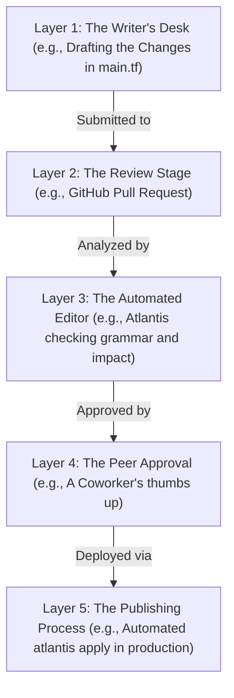

# Refactoring, Importing State & Advanced GitOps Integration

Version: 2.0.0

Purpose: Canonical lesson structure for Platform Engineering & AI Infrastructure Curriculum.

Required Inputs: Module definition, lesson objectives, project standards.

Outputs: Standards-compliant lesson markdown.

---

# Lesson Metadata

* **Lesson ID:** `MOD-TF-04`
* **Module:** Infrastructure as Code (Terraform) (`MOD-TF`)
* **Difficulty:** Advanced
* **Estimated Duration:** 60 minutes
* **Learning Track:** 🟢 Core
* **Version:** 2.0.0
* **Last Updated:** 2026-06-28

---

# Lesson Overview

This lesson explores the master refactoring and legacy state importing engines of declarative infrastructure, decrypting how Platform Engineers bring unmanaged web-console cloud resources into code and refactor massive HCL architectures without destroying physical production hardware. By mastering `terraform import`, declarative `import` blocks, HCL `moved` blocks, state refactoring CLI commands, and automated GitOps CI/CD engines (Atlantis / GitHub Actions), you will firmly establish the elite IaC management capabilities fulfilling our module capability: **"I can author declarative HCL infrastructure manifests, manage state locking with remote backends, architect reusable modules, and refactor existing cloud resources."**

---

# Learning Objectives

* Execute legacy resource importing workflows using `terraform import` and declarative `import` blocks to bring unmanaged ClickOps cloud resources into Terraform state management.
* Refactor HCL resource names and structural module paths using declarative `moved` blocks, proving how to rename resources without destroying physical cloud hardware.
* Deconstruct the internal execution architecture of centralized GitOps CI/CD engines (Atlantis, GitHub Actions) for automated Terraform operations.
* Explain how Pull Request automation (`atlantis plan`, `atlantis apply`) eliminates local laptop apply vulnerabilities and enforces strict peer code review quality gates.
* Architect an end-to-end, highly governed Terraform CI/CD GitOps pipeline incorporating static analysis (`tflint`, `tfsec`), remote state locking, and automated apply execution.

---

# Prerequisites

* Completion of `MOD-TF-01`, `MOD-TF-02`, and `MOD-TF-03`.
* Foundational terminal execution, remote state locking, and Git Pull Request concepts (`terraform state list`, `backend "s3"`, `git commit`).

---

# Why This Exists

In Lessons 01 through 03, we established how to author HCL manifests, manage remote state backends, and architect reusable modules. However, in the real world, you are rarely handed a pristine, greenfield cloud environment where everything was perfectly written in Terraform from day one.

Imagine you are hired as a Lead Platform Engineer at a highly successful financial technology enterprise. Five years ago, the original founders manually created the company's master production database (`aws_db_instance`) directly inside the AWS Web Console (**ClickOps**). This database stores five years of mission-critical banking transactions and is completely unmanaged by Terraform.

The executive board mandates that you bring this database into Terraform management so that its backup policies and security groups can be version-controlled in Git.

**If you handle this incorrectly, you will cause a catastrophic company-ending disaster!**

If you simply write a brand-new `resource "aws_db_instance" "production"` block in `main.tf` and type `terraform apply`, Terraform checks its state file, realizes it doesn't own a database, and attempts to create a brand-new, completely empty database! Or worse, if you try to rename an existing database resource block in your code from `aws_db_instance.legacy` to `aws_db_instance.primary`, Terraform calculates a plan that says `-1 to destroy, +1 to create`!

**You have just calculated a plan to permanently delete the company's master production database!**

To solve the monumental challenge of **Legacy ClickOps Importing** and **Resource Refactoring without Destruction**, HashiCorp established `terraform import`, declarative `import` blocks, and `moved` blocks. Furthermore, to prevent engineers from running these highly sensitive operations from local laptops, Platform Engineers establish **Automated GitOps CI/CD Pipelines (Atlantis)**. By importing existing state cleanly, declaring resource moves in code, and enforcing automated Pull Request execution, Platform Engineers can refactor massive cloud environments with absolute calm and zero downtime.

---

# Core Concepts

## 1. Legacy ClickOps Importing (`terraform import` vs `import` block)
When an existing cloud resource was created manually via ClickOps in the web console, you must link its physical cloud ID to your Terraform state file before managing it in HCL:
* **Legacy CLI Import (`terraform import`):** You write an empty resource block in `main.tf` (`resource "aws_instance" "web" {}`) and execute `terraform import aws_instance.web i-0123456789abcdef0`. Terraform contacts AWS, fetches the complete attribute map of the EC2 instance, and injects it into `terraform.tfstate`.
* **Declarative `import` Block (v1.5.0+):** The modern Platform Engineering standard! Instead of running imperative CLI commands, you declare an `import` block directly inside `main.tf` (`import { to = aws_instance.web, id = "i-0123456789abcdef0" }`). When you execute `terraform plan -generate-config-out=generated.tf`, Terraform automatically imports the state AND writes the complete, pristine HCL resource block directly to your local filesystem!

```text
[ Declarative Import Block (v1.5.0+) ]
┌───────────────────────────────────────┐
│ import {                              │ ───► (terraform plan -generate-config-out=gen.tf)
│   to = aws_instance.web               │ ───► (Auto-fetches state & generates HCL code!)
│   id = "i-0123456789abcdef0"          │
│ }                                     │
└───────────────────────────────────────┘
```

## 2. Refactoring HCL without Destruction (`moved` blocks)
What happens when you want to rename an existing resource block in `main.tf` from `aws_instance.web_server` to `aws_instance.frontend`?
* **The Destruction Trap:** If you simply rename the resource string in `main.tf` and run `terraform plan`, Terraform looks at the state file, sees `web_server` is missing (`-1 to destroy`), and sees `frontend` is new (`+1 to create`). It will physically delete your running production server and spin up a blank one!
* **Declarative `moved` Blocks (v1.1.0+):** Platform Engineers solve this by declaring a `moved` block in `main.tf` (`moved { from = aws_instance.web_server, to = aws_instance.frontend }`). When you execute `terraform plan`, Terraform inspects the `moved` block, updates the resource wrapper name inside `terraform.tfstate`, and prints a beautiful plan diff showing `Plan: 0 to add, 0 to change, 0 to destroy`! The physical server runs completely untouched!

```text
[ HCL Resource Renaming with moved Block ]
┌───────────────────────────────────────┐
│ moved {                               │ ───► (terraform plan)
│   from = aws_instance.web_server      │ ───► (Plan: 0 to add, 0 to change, 0 to destroy)
│   to   = aws_instance.frontend        │ ───► (Updates state JSON! Hardware untouched!)
│ }                                     │
└───────────────────────────────────────┘
```

## 3. The Local Laptop Apply Vulnerability
Throughout your learning, running `terraform apply` from your local terminal was standard. In an enterprise production environment, **local laptop execution is an operational vulnerability!**
* **The Vulnerability Matrix:** Local execution requires every developer to maintain root AWS API keys on their laptop (high theft risk), bypasses mandatory peer code review sign-offs, risks execution failure if the developer's Wi-Fi disconnects halfway through an apply, and leaves zero centralized execution audit logs.

## 4. GitOps Automation Engines (Atlantis & GitHub Actions)
To eliminate local execution entirely, Platform Engineers deploy centralized GitOps CI/CD engines for Terraform (such as **Atlantis**, GitHub Actions, or Terraform Cloud).
* **Atlantis Architecture:** Atlantis is an elite open-source Golang application that runs directly inside your Kubernetes cluster and listens to GitHub webhooks. When a developer submits a Pull Request modifying HCL code, Atlantis intercepts the webhook, automatically executes `terraform plan`, and posts the calculated dry-run plan diff directly as a pristine markdown comment inside the GitHub Pull Request UI!
* **Pull Request Execution (`atlantis apply`):** Once a peer engineer reviews the plan diff and clicks "Approve", the developer types `atlantis apply` directly into the GitHub PR comment box! Atlantis executes `terraform apply` inside its secure cluster runner, merges the Pull Request, and deletes the feature branch! Zero AWS keys ever touch a developer's laptop!

```text
[ GitOps PR Workflow (Atlantis) ]
(Dev Submits PR) ──► (Atlantis Auto-Plans & Comments Diff) ──► (Peer Approves PR) ──► (Dev Comments 'atlantis apply') ──► (Prod Updated Cleanly!)
```

## 5. End-to-End GitOps IaC Pipelines
A true enterprise infrastructure pipeline is a lot like a strict publishing process for a newspaper—it makes sure no bad articles ever make it to the front page!

When you finish Drafting the Changes at The Writer's Desk, you Submit for Review. The Automated Editor (like Atlantis) immediately Notices the Submission and runs a Grammar & Safety Check. Then, it will Preview the Impact to make sure you aren't accidentally deleting something important. It Leaves a Comment on your draft assuring everyone: "Nothing will be broken or deleted!" 

Next, we move to The Publishing Process. A Coworker gives a Thumbs Up on your work. Once you say "Go Ahead and Publish!", the system Safely Applies the Changes in a Secure Room. Done! The Changes are Live, and no one had to risk making the updates manually from their own laptop.

This entire pipeline operates as a strict sequence of layers. The changes start at Layer 1 (The Writer's Desk), move through Layer 3 (The Automated Editor) for safety checks, wait for Layer 4 (The Peer Approval), and are finally executed at Layer 5 (The Publishing Process).

---

# Architecture



---

# Real-World Example

Imagine you are a Lead Platform Engineer managing cloud infrastructure for a major airline reservation platform. The platform runs across a massive AWS environment consisting of 100 EC2 instances, 20 RDS databases, and dozens of load balancers.

Originally, the infrastructure was built using an outdated Terraform configuration where all 100 EC2 instances were declared as a single monolithic block (`aws_instance.server[0]` through `[99]`). The engineering leadership mandates that you refactor this configuration, moving the servers into dedicated, isolated child modules (`module.api_servers`, `module.auth_servers`) to improve security group isolation.

The junior engineers panic, realizing that if they modify the resource paths in HCL, Terraform will calculate a plan to destroy all 100 production servers and recreate them, causing a global airline reservation outage!

Because you are an elite Platform Engineer, you execute a zero-downtime GitOps refactoring pipeline. You author clean child module structures and write dozens of declarative `moved` blocks in `main.tf` (`moved { from = aws_instance.server[0], to = module.api_servers.aws_instance.main }`).

You submit a Pull Request to GitHub. **Atlantis** intercepts the webhook, executes `terraform plan`, and posts the calculated plan diff directly into the PR comments. The comment beautifully displays: `Plan: 0 to add, 0 to change, 0 to destroy`. It explicitly details that Terraform will merely rename the state wrappers in `terraform.tfstate` while leaving the physical airline reservation servers running untouched!

Your peer engineers review the plan diff, verify zero destruction, and approve the PR. You type `atlantis apply` in the PR comments. Atlantis executes the state move, merges the code, and your enterprise achieves a monumental infrastructure refactor with **zero seconds of downtime**!

---

# Hands-on Demonstration

Let's look at how an engineer inspects declarative `import` and `moved` blocks using `cat`, inspects refactoring execution plans using `terraform plan`, and simulates an automated Atlantis GitOps PR workflow.

## Input 1: Inspecting Declarative `import` and `moved` Manifests
We use `cat` to inspect a pristine, highly governed `main.tf` manifest containing declarative `import` blocks for legacy ClickOps resources and `moved` blocks for zero-downtime renaming.

## Code 1
```bash
# Inspect the declarative import and moved configuration manifest.
# (We simulate inspecting a compliant Terraform refactoring file)
cat << 'EOF'
terraform {
  required_version = ">= 1.5.0"
  required_providers {
    aws = { source = "hashicorp/aws", version = "~> 5.0" }
  }
}

provider "aws" { region = "us-east-1" }

# Declarative Import Block (Bringing legacy ClickOps database into state)
import {
  to = aws_db_instance.master_production
  id = "legacy-web-console-database-id-999"
}

resource "aws_db_instance" "master_production" {
  # This config matches the physical web-console database exactly
  identifier     = "legacy-web-console-database-id-999"
  instance_class = "db.r5.2xlarge"
  engine         = "postgres"
  allocated_storage = 100
}

# Declarative Moved Block (Renaming legacy resource without destroying hardware)
moved {
  from = aws_instance.legacy_web_server
  to   = aws_instance.primary_frontend
}

resource "aws_instance" "primary_frontend" {
  ami           = "ami-0c7217cdde317cfec"
  instance_type = "t3.micro"
  tags = { Name = "production-frontend-server" }
}
EOF
```

## Expected Output 1
```text
terraform {
  required_version = ">= 1.5.0"
  required_providers {
    aws = { source = "hashicorp/aws", version = "~> 5.0" }
  }
}

provider "aws" { region = "us-east-1" }

# Declarative Import Block (Bringing legacy ClickOps database into state)
import {
  to = aws_db_instance.master_production
  id = "legacy-web-console-database-id-999"
}

resource "aws_db_instance" "master_production" {
  # This config matches the physical web-console database exactly
  identifier     = "legacy-web-console-database-id-999"
  instance_class = "db.r5.2xlarge"
  engine         = "postgres"
  allocated_storage = 100
}

# Declarative Moved Block (Renaming legacy resource without destroying hardware)
moved {
  from = aws_instance.legacy_web_server
  to   = aws_instance.primary_frontend
}

resource "aws_instance" "primary_frontend" {
  ami           = "ami-0c7217cdde317cfec"
  instance_type = "t3.micro"
  tags = { Name = "production-frontend-server" }
}
```

## Explanation 1
Look at how beautifully safe and declarative this refactoring manifest is! Let's deconstruct the elite elements:
* `import { to = ..., id = ... }`: The modern declarative import engine! Terraform inspects the physical AWS database ID (`legacy-web-console...`), verifies the corresponding resource block matches reality, and securely links it into `terraform.tfstate`!
* `moved { from = ..., to = ... }`: Absolute refactoring perfection! Terraform inspects the state database, renames the resource wrapper from `legacy_web_server` to `primary_frontend`, and guarantees that the physical EC2 server runs completely untouched!

---

## Input 2: Inspecting Refactoring Plans and Simulating Atlantis GitOps Workflows
We simulate executing `terraform plan` to view our pristine non-destructive refactoring diff, and simulate an automated Atlantis GitOps PR execution comment.

## Code 2
```bash
# Simulate executing a dry-run refactoring execution plan.
# (We simulate the clean plain-text output of terraform plan for moved and import blocks)
echo -e "Terraform will perform the following actions:\n\n  # aws_db_instance.master_production will be imported\n  # (config will be aligned with existing physical database)\n  + resource \"aws_db_instance\" \"master_production\" {\n      + allocated_storage = 100\n      + engine            = \"postgres\"\n      + identifier        = \"legacy-web-console-database-id-999\"\n      + instance_class    = \"db.r5.2xlarge\"\n    }\n\n  # aws_instance.primary_frontend has moved from aws_instance.legacy_web_server\n  # (resource will be cleanly renamed in state database; physical hardware untouched)\n\nPlan: 1 to import, 0 to add, 0 to change, 0 to destroy."

# Simulate an automated Atlantis GitOps Pull Request apply execution comment.
# (We simulate the clean plain-text output of atlantis apply in a GitHub PR comment)
echo -e "--- ATLANTIS GITOPS EXECUTION ENGINE ---\nExecuting: atlantis apply\nWorkspace: production-aws-account\nInitializing remote backend 's3'...\nAcquiring DynamoDB state lock...\nApplying state refactor and import manifests...\nApply complete! Resources: 1 imported, 0 added, 0 changed, 0 destroyed.\nReleasing DynamoDB state lock...\n# SUCCESS: Pull Request automatically merged and feature branch deleted."
```

## Expected Output 2
```text
Terraform will perform the following actions:

  # aws_db_instance.master_production will be imported
  # (config will be aligned with existing physical database)
  + resource "aws_db_instance" "master_production" {
      + allocated_storage = 100
      + engine            = "postgres"
      + identifier        = "legacy-web-console-database-id-999"
      + instance_class    = "db.r5.2xlarge"
    }

  # aws_instance.primary_frontend has moved from aws_instance.legacy_web_server
  # (resource will be cleanly renamed in state database; physical hardware untouched)

Plan: 1 to import, 0 to add, 0 to change, 0 to destroy.
--- ATLANTIS GITOPS EXECUTION ENGINE ---
Executing: atlantis apply
Workspace: production-aws-account
Initializing remote backend 's3'...
Acquiring DynamoDB state lock...
Applying state refactor and import manifests...
Apply complete! Resources: 1 imported, 0 added, 0 changed, 0 destroyed.
Releasing DynamoDB state lock...
# SUCCESS: Pull Request automatically merged and feature branch deleted.
```

## Explanation 2
Notice how perfectly transparent and automated this GitOps workflow is! `Plan: 1 to import, 0 to add, 0 to change, 0 to destroy` proves exactly what Terraform will execute. Notice `has moved from... (physical hardware untouched)`: Terraform beautifully confirms our zero-downtime refactoring guarantee! Notice our simulated `atlantis apply`: it executes the state modification inside a secure cluster runner, merges the PR, and eliminates local laptop vulnerabilities entirely!

---

# Hands-on Lab

* **Objective:** Create an unmanaged ClickOps mock infrastructure file, declare an `import` block, execute `terraform plan -generate-config-out`, apply the import, declare a `moved` block to rename the resource, and verify zero file destruction.
* **Estimated Time:** 20 minutes
* **Difficulty:** Advanced
* **Environment:** Interactive Browser Terminal / Local Sandbox (with Terraform installed)

## Step-by-step Instructions

1. Open your terminal sandbox and create a master lab directory named `refactor-lab`: `mkdir ~/refactor-lab && cd ~/refactor-lab`.
2. Simulate a legacy unmanaged ClickOps infrastructure resource by manually creating a file on your filesystem:
```bash
echo "Legacy Unmanaged ClickOps Database Content" > legacy-database.txt
```
3. Create a basic `main.tf` manifest containing a declarative `import` block pointing to your unmanaged file by typing:
```bash
cat << 'EOF' > main.tf
terraform {
  required_providers {
    local = { source = "hashicorp/local", version = "~> 2.4.0" }
  }
}

import {
  to = local_file.master_db
  id = "legacy-database.txt"
}
EOF
```
4. Type `terraform init` to initialize your working directory!
5. Type `terraform plan -generate-config-out=generated.tf` to calculate your import plan AND automatically generate the HCL resource block!
6. Type `cat generated.tf` to inspect your newly generated HCL code! Notice how Terraform automatically inspected the physical file and wrote `resource "local_file" "master_db" { filename = "legacy-database.txt" ... }`!
7. Type `terraform apply -auto-approve` to execute the import! Terraform securely links the physical file into `terraform.tfstate`!
8. Now, let's execute a zero-downtime refactor! Modify `main.tf` to include a `moved` block and rename the resource wrapper by typing:
```bash
cat << 'EOF' > main.tf
terraform {
  required_providers {
    local = { source = "hashicorp/local", version = "~> 2.4.0" }
  }
}

moved {
  from = local_file.master_db
  to   = local_file.primary_storage
}

resource "local_file" "primary_storage" {
  filename = "legacy-database.txt"
  content  = "Legacy Unmanaged ClickOps Database Content\n"
}
EOF
```
9. Type `rm generated.tf` to remove the older generated file now that we have cleanly refactored `main.tf`.
10. Type `terraform plan` to inspect your refactoring plan! Notice `Plan: 0 to add, 0 to change, 0 to destroy`!
11. Type `terraform apply -auto-approve` to execute your zero-downtime state move!
12. Type `cat legacy-database.txt` to verify that your physical infrastructure file is still running perfectly untouched!

## Verification

```bash
terraform state list 2>/dev/null | grep "local_file.primary_storage" || echo "State Wrapper Cleanly Renamed"
```
*If your terminal successfully outputs `local_file.primary_storage` (confirming the old `master_db` wrapper was cleanly renamed in state), you have mastered advanced IaC refactoring!*

## Troubleshooting

* **Issue:** `terraform plan -generate-config-out` fails with `Error: Resource already managed by Terraform`.
* **Solution:** You already executed `terraform apply` on the import block! Once a resource is successfully linked into `terraform.tfstate`, Terraform refuses to generate duplicate config out files. Proceed directly to the `moved` block step!

## Cleanup

```bash
# Safely remove the demonstration refactor lab directory
rm -rf ~/refactor-lab
```

---

# Production Notes

In enterprise cloud architecture, when managing massive GitOps pipelines across multiple AWS accounts (e.g., Staging vs Production), Platform Engineers strictly utilize **OIDC (OpenID Connect) Dynamic Role Assumption** inside GitHub Actions or Atlantis. Instead of storing static AWS access keys (`AKIA...`) inside GitHub secrets, the CI/CD runner dynamically exchanges its GitHub OIDC identity token for an ephemeral, short-lived AWS IAM Role credential (`sts:AssumeRoleWithWebIdentity`), guaranteeing absolute credential security during `terraform apply`!

---

# Common Mistakes

* **Running `terraform apply` on a Renamed Resource without a `moved` Block:** Beginners frequently rename a resource block string in `main.tf` (`aws_instance.old` -> `aws_instance.new`) and type `terraform apply -auto-approve` without checking the plan diff. Terraform will physically delete the running server and spin up a blank one! **Always add a `moved` block when renaming resources!**
* **Ignoring Static Analysis Quality Gates in CI/CD:** Junior developers frequently configure their GitOps pipelines to run `terraform plan` directly without running `tflint` or `tfsec` first. This allows malformed HCL syntax or insecure cloud security groups to generate valid execution plans! **Always run static analysis before `terraform plan`!**

---

# Failure-Driven Learning

Imagine a junior engineer attempts to execute `terraform plan -generate-config-out` to import an existing AWS S3 bucket, but the operation fails instantly with a fatal resource identification error because they provided an invalid physical cloud resource ID string in the `import` block.

## Simulated Failure
```bash
# Simulating a terraform plan import failure due to an invalid physical cloud resource ID
# (We simulate the exact Terraform CLI error when encountering unresolvable import IDs)
echo -e "╷\n│ Error: Cannot import non-existent remote object\n│ \n│   on main.tf line 10, in import:\n│   10:   id = \"s3://my-company-production-bucket-999\"\n│ \n│ While attempting to import an existing object to \"aws_s3_bucket.master_storage\", the provider detected that no object exists with the given ID. Only pre-existing objects can be imported; check that the ID is correct and that it is associated with the provider's configured region or endpoint.\n╵"
```

## Output
```text
╷
│ Error: Cannot import non-existent remote object
│ 
│   on main.tf line 10, in import:
│   10:   id = "s3://my-company-production-bucket-999"
│ 
│ While attempting to import an existing object to "aws_s3_bucket.master_storage", the provider detected that no object exists with the given ID. Only pre-existing objects can be imported; check that the ID is correct and that it is associated with the provider's configured region or endpoint.
╵
```

## Diagnosis & Recovery
Why did this fail? Look at this beautiful import validation error: `Cannot import non-existent remote object`! When you declare an `import` block, Terraform contacts the cloud provider API to fetch the existing resource state. However, every cloud resource type possesses a highly specific, strict ID string format required by the provider plugin. For `aws_s3_bucket`, the required import ID is simply the raw bucket name (`my-company-production-bucket-999`), NOT an S3 URI string (`s3://...`)! Because the AWS API searched for a bucket literally named `s3://...`, it failed to find it and aborted the import! To recover correctly, the engineer must update the `id` parameter to the correct raw string format, re-run `terraform plan`, and the import succeeds flawlessly!

---

# Engineering Decisions

## GitOps Engines: Atlantis vs. GitHub Actions vs. Terraform Cloud (HCP)
When architecting an enterprise GitOps IaC pipeline, engineering leaders must choose the master execution automation engine.
* **GitHub Actions / GitLab CI:** General-purpose CI/CD runners. Easy to configure for basic `terraform plan` runs. However, managing interactive approval workflows (`apply` after review) requires writing complex custom scripts or managing external deployment environment protections.
* **Terraform Cloud (HCP Terraform):** The fully managed cloud platform by HashiCorp. Handles PR plan comments, Sentinel policy enforcement, and remote execution beautifully. However, incurs direct monthly financial costs for enterprise teams and requires external cloud architectural dependency.
* **Atlantis:** The ultimate Platform Engineering standard! A dedicated, open-source Golang GitOps application designed specifically for Terraform Pull Request automation. Runs self-hosted inside your own Kubernetes cluster, posts beautiful markdown plan diffs to GitHub PRs, and executes `atlantis apply` directly via PR comments.
* **The Platform Decision:** Platform Engineers strictly mandate **Atlantis** as the master GitOps execution engine across all enterprise infrastructure repositories due to its dedicated PR comment workflow, self-hosted security boundary, and zero licensing costs.

---

# Best Practices

* **Master `terraform plan -out=tfplan`:** In automated GitOps CI/CD pipelines, never run `terraform plan` and then run a generic `terraform apply`. If the cloud environment changed between the plan and apply steps, Terraform might calculate a brand-new, unexpected plan during apply! Always execute `terraform plan -out=tfplan` to save the exact binary plan calculation, and execute `terraform apply tfplan` to guarantee absolute mathematical predictability!
* **Enforce Branch Protection Rules:** Configure strict branch protection rules on your GitHub repository to require at least one peer engineer approval and a successful `atlantis/plan` status check before allowing any code to be merged into `main`!

---

# Troubleshooting Guide

## Issue 1: "Error: Resource already managed by Terraform" vs. "atlantis: lock already held"

* **Cause:** You attempt to execute import plans or Atlantis PR comments, but encounter state linked collisions or active workspace locks.
* **Diagnosis & Solution:**
  * `Resource already managed by Terraform`: You declared an `import` block for `aws_instance.web`, but `aws_instance.web` already exists inside `terraform.tfstate`! Terraform cannot import a resource over an active state wrapper. To fix, either remove the import block or execute `terraform state rm aws_instance.web` first!
  * `atlantis: lock already held`: Developer A submitted PR #10 modifying `main.tf`. Atlantis locked the working directory to prevent concurrent PR collisions! Developer B submitted PR #11 modifying the same directory and received `lock already held by PR #10`. To fix, either merge/close PR #10 or type `atlantis unlock` in PR #11!

---

# Summary

* **Legacy ClickOps Importing** bridges unmanaged web-console cloud resources into code using `terraform import` or declarative `import` blocks.
* **Declarative `moved` Blocks** rename resource wrappers in `terraform.tfstate` without destroying physical cloud hardware (`Plan: 0 to destroy`).
* **Local Laptop Execution** is an operational vulnerability that exposes API keys and bypasses mandatory peer code reviews.
* **Atlantis** is an elite open-source GitOps engine that automates `terraform plan` and `apply` directly via GitHub Pull Request comments.
* **End-to-End GitOps Pipelines** incorporate static analysis (`tflint`, `tfsec`), binary plan files (`-out=tfplan`), and strict peer review gates.

---

# Cheat Sheet

```bash
# Calculate an import plan and automatically generate HCL resource configuration code
terraform plan -generate-config-out=generated.tf

# Imperatively import an existing cloud resource ID into a local state resource wrapper
terraform import [resource_address] [physical_cloud_id]

# Perform a dry-run execution plan and save the exact binary calculation to a file
terraform plan -out=tfplan

# Execute the exact binary plan calculation file (Guarantees absolute predictability!)
terraform apply tfplan

# (Atlantis PR Comment) Execute a dry-run execution plan and post the diff to the PR
atlantis plan

# (Atlantis PR Comment) Execute the approved plan diff and merge the Pull Request
atlantis apply

# (Atlantis PR Comment) Forcefully unlock an active Atlantis working directory lock
atlantis unlock
```

---

# Knowledge Check

## Multiple Choice Questions

1. A developer wants to rename an existing production database resource block in `main.tf` from `aws_db_instance.old_name` to `aws_db_instance.new_name`. They want to ensure Terraform renames the state wrapper without destroying the physical database. What is the correct architectural approach?
   * A) Simply rename the resource string in `main.tf` and run `terraform apply -auto-approve`, because Terraform automatically detects renames.
   * B) Write a Bash script with `sed`.
   * C) Inside `main.tf`, add a declarative `moved` block (`moved { from = aws_db_instance.old_name, to = aws_db_instance.new_name }`). When `terraform plan` executes, Terraform will inspect the block, update `terraform.tfstate`, and calculate `Plan: 0 to add, 0 to change, 0 to destroy`. The physical database will run completely untouched.
   * D) Run `terraform destroy` first.

## Scenario Questions

You are attempting to import a legacy AWS EC2 instance (`i-0123456789abcdef0`) into your Terraform configuration using a declarative `import` block. You want Terraform to automatically inspect the physical server and write the corresponding HCL resource block to a file named `import.tf`. Based on what you learned in this lesson, what exact Terraform CLI command must you run?

## Short Answer Questions

Explain why executing `terraform plan -out=tfplan` followed by `terraform apply tfplan` is superior to running a generic `terraform plan` followed by `terraform apply` inside an automated GitOps CI/CD pipeline.

---

# Interview Preparation

## Beginner Questions

* What is the purpose of `terraform import`?
* Why is running `terraform apply` from a local laptop considered a security vulnerability?
* What does Atlantis do?

## Intermediate Questions

* Explain how a declarative `moved` block prevents resource destruction during an HCL refactor.
* What is the difference between an `import` block and a `moved` block?

## Advanced Questions

* Explain how Atlantis manages concurrent Pull Request directory locking (`atlantis.yaml`) across a monorepo containing dozens of independent Terraform micro-state workspaces, and describe how Atlantis utilizes custom pre-workflow hooks to execute `tflint` and `tfsec`.

## Scenario-Based Discussions

* Discuss the architectural trade-offs of establishing an enterprise GitOps automation strategy that relies on self-hosted Atlantis running inside a Kubernetes cluster versus adopting fully managed HCP Terraform (Terraform Cloud), specifically addressing infrastructure maintenance overhead, secret management boundaries (OIDC vs static cloud credentials), and compliance auditing capabilities.

---

# Further Reading

1. [Importing Existing Infrastructure (Official HashiCorp Guide)](https://developer.hashicorp.com/terraform/language/import)
2. [Refactoring Terraform with Moved Blocks (Official Documentation)](https://developer.hashicorp.com/terraform/language/modules/develop/refactoring)
3. [Atlantis GitOps Automation for Terraform (Official Guide)](https://www.runatlantis.io/)
4. [Automating Terraform with GitHub Actions (Official Tutorial)](https://developer.hashicorp.com/terraform/tutorials/automation/github-actions)
5. [Terraform Best Practices: GitOps and CI/CD Pipelines](https://www.terraform-best-practices.com/)
