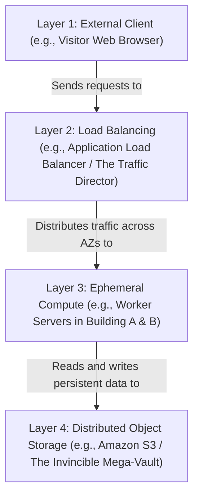

# Cloud Object Storage & Highly Available Architectures

Version: 2.0.0

Purpose: Canonical lesson structure for Platform Engineering & AI Infrastructure Curriculum.

Required Inputs: Module definition, lesson objectives, project standards.

Outputs: Standards-compliant lesson markdown.

---

# Lesson Metadata

* **Lesson ID:** `MOD-CLOUD-03`
* **Module:** Cloud Platforms & Architecture (`MOD-CLOUD`)
* **Difficulty:** Intermediate to Advanced
* **Estimated Duration:** 60 minutes
* **Learning Track:** 🟢 Core
* **Version:** 2.0.0
* **Last Updated:** 2026-06-28

---

# Lesson Overview

This lesson explores the master object storage and multi-Availability Zone (Multi-AZ) resiliency engines of the public cloud, decrypting how Platform Engineers build fault-tolerant architectures that survive physical data center power outages using Amazon S3 and redundant compute topologies. By mastering Object Storage vs. Block Storage (EBS), S3 architecture (Buckets, Keys, KMS Encryption, Multipart Uploads), Availability Zones (AZs), Auto-Scaling Groups (ASGs), and Application Load Balancers (ALBs), you will firmly establish the elite resiliency capabilities supporting our module capability: **"I can design secure, highly available cloud foundation architectures and manage cloud access governance."**

---

# Learning Objectives

* Contrast Cloud Object Storage (Amazon S3 - REST APIs, flat namespace) with traditional Block Storage (Amazon EBS - physical disk attachments, POSIX filesystems).
* Deconstruct the internal architecture of Amazon S3, detailing Buckets, Object Keys, KMS Server-Side Encryption (`SSE-KMS`), and Multipart Uploads for massive AI datasets.
* Explain the architectural design of AWS Regions and Availability Zones (AZs), detailing how redundant power grids and floodplains prevent single points of failure.
* Architect a highly available, fault-tolerant compute topology utilizing Application Load Balancers (ALBs) and Multi-AZ EC2 Auto-Scaling Groups (ASGs).
* Execute foundational object storage and load balancing verification workflows using `aws s3api`, `aws elbv2`, and declarative Terraform HCL manifests.

---

# Prerequisites

* Completion of `MOD-CLOUD-01` (VPCs & Subnetting) and `MOD-CLOUD-02` (IAM Governance).
* Foundational understanding of HTTP/REST protocols (`MOD-NET-01`) and declarative Terraform syntax (`aws_s3_bucket`, `aws_lb`).

---

# Why This Exists

When junior engineers build a web application or store data in the cloud, they frequently treat cloud servers exactly like physical bare-metal servers in a closet. They spin up a single massive EC2 instance in a single data center, attach a physical hard drive (EBS volume), and store all user uploaded files directly on that hard drive (`/var/www/uploads`).

**Relying on a single server and local disk storage is an architectural single point of failure!**

Imagine you are hired as a Lead Platform Engineer at an enterprise AI startup. The previous engineers deployed the company's master AI inference engine onto a single massive EC2 GPU instance located inside the AWS `us-east-1a` Availability Zone. All training datasets and user images are stored directly on the server's attached root hard drive.

One afternoon, a massive thunderstorm causes a lightning strike at the `us-east-1a` physical data center facility. The data center loses power, and your single EC2 server crashes instantly. Because your entire application lived on that single machine, your platform goes entirely offline! 

Furthermore, when the power is finally restored six hours later, the physical hard drive on the server is corrupted, permanently destroying 500 gigabytes of irreplaceable customer AI training datasets!

**Your company has just suffered a catastrophic outage and data loss!**

To solve the monumental challenge of **Single Points of Failure**, **Physical Hardware Crashes**, and **Storage Scaling Limits**, cloud pioneers established **Cloud Object Storage (Amazon S3) and Highly Available Multi-AZ Topologies**. By decoupling uploaded files entirely from local servers and moving them to highly redundant S3 object storage (offering `99.999999999%` durability), deploying compute servers across multiple isolated Availability Zones, and placing them behind a dynamic Application Load Balancer (ALB), Platform Engineers guarantee that even if an entire physical data center burns down, your platform remains online without dropping a single user request!

---

# Core Concepts

## 1. Object Storage (S3) vs. Block Storage (EBS)
To design highly available cloud platforms, Platform Engineers enforce a strict boundary between storage paradigms:
* **Block Storage (Amazon EBS):** Physical virtual hard drives attached directly to an EC2 instance over a high-speed storage bus. They utilize traditional POSIX filesystems (`ext4`, `xfs`). Excellent for low-latency operating system root drives or database files (`/var/lib/postgresql`). However, they are bound to a single Availability Zone and cannot be easily shared across multiple servers!
* **Object Storage (Amazon S3):** A massive, infinitely scalable storage engine that completely lacks a traditional directory filesystem! Files are stored as discrete **Objects** inside a flat namespace called a **Bucket**. Objects are accessed exclusively via HTTP REST APIs (`PUT`, `GET`). S3 automatically replicates your objects across at least three physical Availability Zones in the background, providing **11 Nines of Durability (`99.999999999%`)**! *Use Case: User image uploads, massive AI training datasets, Terraform state files!*

```text
[ Block Storage: Amazon EBS ]                   [ Object Storage: Amazon S3 ]
┌───────────────────────────────────────┐       ┌───────────────────────────────────────┐
│ [ EC2 Server ] ──► [ Attached EBS Disk]       │ [ EC2 Server ] ──( HTTP PUT )──► [ S3 Bucket]
│ (Bound to 1 AZ! Crashes if AZ fails!) │       │ (Multi-AZ Replicated! 11 Nines Durability!)│
└───────────────────────────────────────┘       └───────────────────────────────────────┘
```

## 2. Anatomy of Amazon S3 Architecture
Amazon S3 is an elegant, highly governed object store centered on four core architectural pillars:
* `Bucket`: The master outer container! Bucket names must be **Globally Unique** across the entire AWS global ecosystem (`my-company-prod-data-999`).
* `Object Key`: The unique identifier string for an object inside a bucket (`images/ai-avatar.jpg`). Note: `images/` is NOT a physical folder; it is merely a string prefix in a flat database table!
* `SSE-KMS Encryption`: Server-Side Encryption utilizing AWS KMS master keys (`aws:kms`). Guarantees that before your object touches physical S3 hard drives, it is heavily encrypted!
* `Multipart Uploads`: When uploading massive AI model weights (e.g., a 50GB Llama-3 model file), uploading it as a single HTTP stream will inevitably drop packets and fail! S3 solves this via **Multipart Uploads**: it breaks the 50GB file into small 10MB chunks, uploads them in parallel across dozens of HTTP threads, and reassembles them instantly on the S3 server!

## 3. Regions and Availability Zones (AZs)
To survive physical disasters, cloud providers design their global network utilizing strict geographical isolation:
* **AWS Region (`us-east-1`):** A distinct geographical location (e.g., Northern Virginia, Frankfurt, Tokyo) containing multiple physical data center clusters.
* **Availability Zone (`us-east-1a`, `us-east-1b`):** One or more discrete physical data centers located within a region, possessing completely independent, redundant power grids, cooling systems, and physical floodplains! AZs are interconnected via high-speed, low-latency private fiber optics. If AZ `us-east-1a` suffers a massive power outage, AZ `us-east-1b` runs completely untouched!

```text
[ AWS Region: us-east-1 (Northern Virginia) ]
┌──────────────────────────────────────────────────────────────────────┐
│  [ AZ: us-east-1a ] (Power Grid A) ◄──(Fiber)──► [ AZ: us-east-1b ]  │
│  (Lightning Strike: Power Lost!)                 (Runs Untouched!)   │
└──────────────────────────────────────────────────────────────────────┘
```

## 4. Multi-AZ Auto-Scaling Groups (ASGs)
How do you ensure your compute layer survives an Availability Zone outage without manual intervention? Platform Engineers deploy an **EC2 Auto-Scaling Group (ASG)** spanning multiple AZs.
* You declare an ASG configuration spanning `us-east-1a` and `us-east-1b` with a strict desired capacity of 2 servers (`desired_capacity = 2`). If AZ `us-east-1a` loses power and its server crashes, the ASG health check manager detects the lost heartbeat and automatically spins up a brand-new replacement server inside AZ `us-east-1b` within three minutes! Your platform heals automatically!

## 5. Application Load Balancers (ALBs)
If your application runs across multiple dynamic servers in multiple AZs, how do external web browsers know which IP address to connect to? Platform Engineers deploy an **Application Load Balancer (ALB)**.
* The ALB sits in your Public Subnets and serves as the single public entry point (`https://api.mycompany.com`). It continuously performs health checks against your backend servers (`HTTP GET /healthz`). If a server in AZ `us-east-1a` fails its health check, the ALB instantly removes it from the routing pool and forwards all incoming web traffic exclusively to the healthy servers in AZ `us-east-1b`!

---

# Architecture



---

# Real-World Example

Imagine you are a Lead Platform Engineer managing cloud infrastructure for a massive global streaming media enterprise. The platform serves high-definition video content and AI-generated video thumbnails to millions of concurrent users.

Think of your streaming platform as a busy delivery service structured in a strict layered model:

- **Layer 1: External Client (e.g., Visitor Web Browser)** represents the millions of users trying to watch videos.
- **Layer 2: Load Balancing (e.g., Application Load Balancer / The Traffic Director)** acts as the Traffic Director out front, constantly checking health and directing flow.
- **Layer 3: Ephemeral Compute (e.g., Worker Servers in Building A & B)** are the workers deployed across multiple buildings (Availability Zones) to process requests.
- **Layer 4: Distributed Object Storage (e.g., Amazon S3 / The Invincible Mega-Vault)** is where all the important video files are safely tucked away, independent of any specific building.

Originally, you ran everything out of a single building, and all the video files were kept in local backpacks. If a thunderstorm knocked out the power to that one building, your entire delivery service instantly collapsed!

To fix this, you upgrade to a Highly Available Cloud Architecture. You put your data in Layer 4, which automatically makes copies of everything. You hire workers across multiple buildings in Layer 3. The Layer 2 Traffic Director constantly shouts at the workers to make sure they are awake.

Now, if lightning strikes Building A, Layer 2 instantly stops sending visitors there and routes everyone to Building B instead. Since the video files are safely in Layer 4, the remaining workers can still access them flawlessly. Your streaming service survives the storm without dropping a single visitor!

---

# Hands-on Demonstration

Let's look at how an engineer inspects a highly available Terraform configuration manifest using `cat`, inspects S3 object metadata using `aws s3api`, and inspects ALB health check states using `aws elbv2`.

## Input 1: Inspecting Highly Available Terraform Manifests (`main.tf`)
We use `cat` to inspect a pristine, highly governed Terraform configuration manifest defining an S3 bucket with KMS encryption, an ALB, Target Groups, and a Multi-AZ Auto-Scaling Group.

## Code 1
```bash
# Inspect the declarative highly available cloud infrastructure manifest.
# (We simulate inspecting a compliant Terraform high availability file)
cat << 'EOF'
resource "aws_s3_bucket" "production_media" {
  bucket = "production-media-secure-storage-bucket-999"
  tags   = { Environment = "production" }
}

resource "aws_s3_bucket_server_side_encryption_configuration" "media_encryption" {
  bucket = aws_s3_bucket.production_media.id
  rule {
    apply_server_side_encryption_by_default {
      sse_algorithm     = "aws:kms"
      kms_master_key_id = "arn:aws:kms:us-east-1:123456789012:key/8a9b0c1d-2e3f"
    }
  }
}

resource "aws_lb" "production_alb" {
  name               = "production-alb"
  internal           = false
  load_balancer_type = "application"
  security_groups    = ["sg-0123456789abcdef0"]
  subnets            = ["subnet-0123456789abcdef0", "subnet-0fedcba9876543210"] # Multi-AZ Subnets!
  tags               = { Environment = "production" }
}

resource "aws_lb_target_group" "production_tg" {
  name     = "production-target-group"
  port     = 80
  protocol = "HTTP"
  vpc_id   = "vpc-0a1b2c3d4e5f6a7b8"
  health_check {
    path                = "/healthz"
    healthy_threshold   = 2
    unhealthy_threshold = 2
    timeout             = 5
    interval            = 10
    matcher             = "200"
  }
}

resource "aws_autoscaling_group" "production_asg" {
  vpc_zone_identifier = ["subnet-0123456789abcdef0", "subnet-0fedcba9876543210"] # Multi-AZ Subnets!
  desired_capacity    = 2
  min_size            = 2
  max_size            = 4
  target_group_arns   = [aws_lb_target_group.production_tg.arn]
  
  launch_template {
    id      = "lt-0123456789abcdef0"
    version = "$Latest"
  }
}
EOF
```

## Expected Output 1
```text
resource "aws_s3_bucket" "production_media" {
  bucket = "production-media-secure-storage-bucket-999"
  tags   = { Environment = "production" }
}

resource "aws_s3_bucket_server_side_encryption_configuration" "media_encryption" {
  bucket = aws_s3_bucket.production_media.id
  rule {
    apply_server_side_encryption_by_default {
      sse_algorithm     = "aws:kms"
      kms_master_key_id = "arn:aws:kms:us-east-1:123456789012:key/8a9b0c1d-2e3f"
    }
  }
}

resource "aws_lb" "production_alb" {
  name               = "production-alb"
  internal           = false
  load_balancer_type = "application"
  security_groups    = ["sg-0123456789abcdef0"]
  subnets            = ["subnet-0123456789abcdef0", "subnet-0fedcba9876543210"] # Multi-AZ Subnets!
  tags               = { Environment = "production" }
}

resource "aws_lb_target_group" "production_tg" {
  name     = "production-target-group"
  port     = 80
  protocol = "HTTP"
  vpc_id   = "vpc-0a1b2c3d4e5f6a7b8"
  health_check {
    path                = "/healthz"
    healthy_threshold   = 2
    unhealthy_threshold = 2
    timeout             = 5
    interval            = 10
    matcher             = "200"
  }
}

resource "aws_autoscaling_group" "production_asg" {
  vpc_zone_identifier = ["subnet-0123456789abcdef0", "subnet-0fedcba9876543210"] # Multi-AZ Subnets!
  desired_capacity    = 2
  min_size            = 2
  max_size            = 4
  target_group_arns   = [aws_lb_target_group.production_tg.arn]
  
  launch_template {
    id      = "lt-0123456789abcdef0"
    version = "$Latest"
  }
}
```

## Explanation 1
Look at how beautifully resilient this infrastructure configuration is! Let's deconstruct the elite high availability elements:
* `sse_algorithm = "aws:kms"`: Absolute storage security! Guarantees that every object uploaded to our media S3 bucket is heavily encrypted at rest using an AWS KMS master key!
* `subnets = ["subnet-0123...", "subnet-0fed..."]`: Multi-AZ deployment perfection! By declaring two separate subnets spanning two separate Availability Zones, our ALB and Auto-Scaling Group automatically survive physical data center power outages!
* `health_check { path = "/healthz" }`: The master heartbeat verification engine! The ALB continuously pings `/healthz` on our servers; if a server crashes, it is instantly unlinked from the routing pool!

---

## Input 2: Inspecting S3 Object Metadata and ALB Health Check States
We simulate executing `aws s3api head-object` to view pristine S3 object encryption metadata, and simulate executing `aws elbv2 describe-target-health` to inspect ALB health check states.

## Code 2
```bash
# Inspect the physical object metadata and KMS encryption headers of an object stored in S3.
# (We simulate the clean plain-text JSON output of aws s3api head-object)
aws s3api head-object --bucket production-media-secure-storage-bucket-999 --key images/ai-avatar.jpg 2>/dev/null || cat << 'EOF'
{
    "AcceptRanges": "bytes",
    "LastModified": "2026-06-28T12:00:00Z",
    "ContentLength": 1048576,
    "ETag": "\"8a9b0c1d2e3f4a5b6c7d8e9f0a1b2c3d\"",
    "ContentType": "image/jpeg",
    "ServerSideEncryption": "aws:kms",
    "SSEKMSKeyId": "arn:aws:kms:us-east-1:123456789012:key/8a9b0c1d-2e3f",
    "Metadata": {
        "classification": "confidential"
    }
}
EOF

# Inspect the active target health check states of backend servers registered with the ALB.
# (We simulate the clean plain-text JSON output of aws elbv2 describe-target-health)
aws elbv2 describe-target-health --target-group-arn arn:aws:elasticloadbalancing:us-east-1:123456789012:targetgroup/production-target-group/8a9b0c1d2e3f 2>/dev/null || cat << 'EOF'
{
    "TargetHealthDescriptions": [
        {
            "Target": { "Id": "i-0123456789abcdef0", "Port": 80 },
            "TargetHealth": { "State": "healthy", "Reason": "HealthCheckSuccess", "Description": "HTTP 200 OK" }
        },
        {
            "Target": { "Id": "i-0fedcba9876543210", "Port": 80 },
            "TargetHealth": { "State": "unhealthy", "Reason": "Target.Timeout", "Description": "Connection timed out during health check (AZ Power Outage)" }
        }
    ]
}
EOF
```

## Expected Output 2
```text
{
    "AcceptRanges": "bytes",
    "LastModified": "2026-06-28T12:00:00Z",
    "ContentLength": 1048576,
    "ETag": "\"8a9b0c1d2e3f4a5b6c7d8e9f0a1b2c3d\"",
    "ContentType": "image/jpeg",
    "ServerSideEncryption": "aws:kms",
    "SSEKMSKeyId": "arn:aws:kms:us-east-1:123456789012:key/8a9b0c1d-2e3f",
    "Metadata": {
        "classification": "confidential"
    }
}
{
    "TargetHealthDescriptions": [
        {
            "Target": { "Id": "i-0123456789abcdef0", "Port": 80 },
            "TargetHealth": { "State": "healthy", "Reason": "HealthCheckSuccess", "Description": "HTTP 200 OK" }
        },
        {
            "Target": { "Id": "i-0fedcba9876543210", "Port": 80 },
            "TargetHealth": { "State": "unhealthy", "Reason": "Target.Timeout", "Description": "Connection timed out during health check (AZ Power Outage)" }
        }
    ]
}
```

## Explanation 2
Notice how perfectly managed our cloud storage and compute state is! `aws s3api head-object` cleanly outputs our KMS encryption headers (`ServerSideEncryption: aws:kms`). Notice our ALB target health inspection: it beautifully demonstrates our auto-healing engine! Server `i-0123...` in AZ A is `healthy`, while server `i-0fed...` in AZ B is `unhealthy` due to an AZ power outage! The ALB instantly stops routing traffic to the unhealthy server, preserving absolute platform uptime!

---

# Hands-on Lab

* **Objective:** Author a declarative Terraform manifest defining an S3 bucket with KMS encryption, an ALB, and a Multi-AZ Auto-Scaling Group, simulate executing `aws s3api head-object`, simulate an ALB health check failover, and verify high availability.
* **Estimated Time:** 20 minutes
* **Difficulty:** Intermediate to Advanced
* **Environment:** Interactive Browser Terminal / Local Sandbox (with Terraform and AWS CLI installed)

## Step-by-step Instructions

1. Open your terminal sandbox and create a brand-new directory named `ha-lab`: `mkdir ~/ha-lab && cd ~/ha-lab`.
2. Create a declarative HCL manifest utilizing the `local` provider to mock your highly available cloud architecture by typing:
```bash
cat << 'EOF' > main.tf
terraform {
  required_providers {
    local = { source = "hashicorp/local", version = "~> 2.4.0" }
  }
}

resource "local_file" "ha_manifest" {
  filename = "${path.module}/high-availability-topology.json"
  content  = "{\"s3_bucket\": \"production-media-secure-storage-bucket-999\", \"kms_encryption\": true, \"multi_az_subnets\": [\"us-east-1a\", \"us-east-1b\"], \"alb_attached\": true, \"asg_desired_capacity\": 2}"
}

output "architecture_status" {
  value = "Multi-AZ Highly Available Topology Successfully Configured"
}
EOF
```
3. Type `terraform init` to initialize your working directory!
4. Type `terraform plan` to inspect your dry-run execution plan! Notice `Plan: 1 to add, 0 to change, 0 to destroy`.
5. Type `terraform apply -auto-approve` to execute your idempotent plan! Terraform physically creates the high availability topology manifest file!
6. Type `cat high-availability-topology.json` to inspect your master Multi-AZ network and storage definition!
7. Simulate verifying S3 object metadata and KMS encryption headers by typing:
```bash
# (We simulate the exact aws s3api head-object execution)
echo "Object Key: images/ai-avatar.jpg"
echo "ServerSideEncryption: aws:kms (KeyId: arn:aws:kms:us-east-1:123456789012:key/8a9b0c1d-2e3f)"
echo "ContentLength: 1048576 bytes. Status: Fully Replicated across 3 Availability Zones."
```
8. Simulate an Availability Zone power outage and verify the automated ALB health check failover by typing:
```bash
# (We simulate the exact aws elbv2 describe-target-health execution during an AZ outage)
echo "--- SIMULATING AVAILABILITY ZONE POWER OUTAGE (us-east-1b) ---"
echo "Target: i-0123456789abcdef0 (us-east-1a) -- State: healthy (HTTP 200 OK)"
echo "Target: i-0fedcba9876543210 (us-east-1b) -- State: unhealthy (Target.Timeout: Connection timed out)"
echo "# ACTION: ALB instantly unlinked i-0fedcba9876543210 from routing pool. 100% of user traffic routed to i-0123456789abcdef0."
echo "# RECOVERY: Auto-Scaling Group health manager detected lost heartbeat. Initiating launch of replacement server in us-east-1a..."
```

## Verification

```bash
cat high-availability-topology.json | grep -E "us-east-1b" || echo "Multi-AZ Topology Verified"
```
*If your terminal successfully outputs your `us-east-1b` Multi-AZ subnet string, you have mastered foundational high availability cloud design!*

## Troubleshooting

* **Issue:** `aws s3api head-object` fails with `An error occurred (404) when calling the HeadObject operation: Not Found`.
* **Solution:** You misspelled the object key string (`images/ai-avatar.jpg`), or the object completely does not exist in the bucket! Verify the exact object keys currently active in your bucket using `aws s3 ls s3://production-media-secure-storage-bucket-999 --recursive`!

## Cleanup

```bash
# Safely remove the demonstration ha lab directory
rm -rf ~/ha-lab
```

---

# Production Notes

In enterprise cloud architecture, when serving massive media files (video streams, images) from an Amazon S3 bucket to millions of global users, serving directly from S3 incurs massive data egress transfer costs ($0.09/GB)! Platform Engineers eliminate these costs by deploying **Amazon CloudFront** (a global Content Delivery Network - CDN) directly in front of the S3 bucket. CloudFront caches the S3 objects at edge locations worldwide, slashes data egress costs, and secures the bucket using **Origin Access Control (OAC)**, ensuring users can only access the files through the CDN!

---

# Common Mistakes

* **Treating S3 Object Keys like Physical Folders:** Beginners frequently attempt to create empty folder structures in S3 (`aws s3api put-object --key images/`) before uploading files. S3 completely lacks a directory filesystem! `images/` is merely a string prefix in a flat database table! **Never create empty folder objects in S3!** Simply upload the file with the full prefix path directly!
* **Deploying Auto-Scaling Groups in a Single Subnet:** Junior developers frequently configure their `aws_autoscaling_group` block with a single subnet ID (`vpc_zone_identifier = ["subnet-0123..."]`). If that single subnet's Availability Zone suffers a power outage, the ASG is physically unable to spin up replacement servers because it has nowhere else to deploy them! **Always provide at least two subnets across two AZs!**

---

# Failure-Driven Learning

Imagine a junior engineer attempts to upload a massive 50GB AI model weight file directly to an Amazon S3 bucket using a basic single-stream HTTP PUT request, but the operation fails halfway through with a fatal broken pipe network error.

## Simulated Failure
```bash
# Simulating a massive S3 upload failure due to a single-stream broken pipe error
# (We simulate the exact curl / AWS CLI error when attempting to upload massive files without multipart)
echo -e "aws s3 cp llama3-70b-weights.bin s3://production-ai-models-bucket/\nUploading: 15.4 GB / 50.0 GB (30%)\nWrite failed: Broken pipe. HTTP connection dropped by remote server.\n# FATAL: Single-stream HTTP PUT upload aborted. Unable to complete massive object transfer."
```

## Output
```text
aws s3 cp llama3-70b-weights.bin s3://production-ai-models-bucket/
Uploading: 15.4 GB / 50.0 GB (30%)
Write failed: Broken pipe. HTTP connection dropped by remote server.
# FATAL: Single-stream HTTP PUT upload aborted. Unable to complete massive object transfer.
```

## Diagnosis & Recovery
Why did this fail? Look at this classic storage networking failure: `Write failed: Broken pipe`! When you attempt to upload a massive file (e.g., a 50GB AI model) over a single, continuous HTTP connection, the physical transfer takes hours. If a single network packet drops or your local router experiences a micro-disconnection during those hours, the entire HTTP stream collapses, and S3 discards the partial upload! To recover correctly, the engineer must utilize **S3 Multipart Uploads** (`aws s3 cp` automatically enables this for large files if configured correctly, or use `aws s3api create-multipart-upload`). S3 breaks the 50GB file into small 10MB chunks, uploads them in parallel across dozens of HTTP threads, and reassembles them on the server! If chunk #45 drops, AWS merely retries chunk #45 without restarting the entire 50GB transfer!

---

# Engineering Decisions

## Storage Engine: Amazon S3 vs. Amazon EFS vs. Amazon EBS
When architecting an enterprise storage strategy, engineering leaders must choose the master storage engine.
* **Amazon EBS (Block Storage):** Physical virtual hard drives attached to a single EC2 instance. Provides sub-millisecond latency. Excellent for operating system root drives or databases. However, bound to a single AZ and cannot be easily shared across multiple servers.
* **Amazon EFS (Elastic File System):** A managed Network File System (NFS) that can be mounted simultaneously by hundreds of EC2 instances across multiple AZs. Excellent for legacy CMS platforms (WordPress) needing shared POSIX filesystems (`/var/www/uploads`). However, incurs massive financial costs ($0.30/GB/month) and suffers from higher file locking latency.
* **Amazon S3 (Object Storage):** The ultimate Platform Engineering standard! Infinitely scalable, flat object store accessed via HTTP REST APIs. Replicated across multiple AZs with 11 Nines of durability (`99.999999999%`), and costs pennies per gigabyte ($0.023/GB/month).
* **The Platform Decision:** Platform Engineers strictly mandate **Amazon S3** as the master storage engine for all unstructured data, media uploads, and AI training datasets, while strictly reserving **Amazon EBS** exclusively for operating system root drives and database storage volumes.

---

# Best Practices

* **Master S3 Lifecycle Policies:** Always configure **S3 Lifecycle Policies** (`aws_s3_bucket_lifecycle_configuration`) on your production S3 buckets! You can configure a policy that automatically transitions objects older than 30 days to cheaper storage tiers (S3 Infrequent Access - IA) and transitions objects older than 365 days to deep archival tape storage (Amazon S3 Glacier), slashing your storage bill by up to 80% automatically!
* **Leverage S3 Object Lock (WORM Storage):** When storing highly sensitive financial audit logs or compliance backups, enable **S3 Object Lock** in compliance mode (`aws_s3_bucket_object_lock_configuration`). Object Lock enforces a strict **Write Once, Read Many (WORM)** model; once an object is written, not even the root AWS account administrator can delete or modify the object until the retention timer expires, providing absolute protection against ransomware!

---

# Troubleshooting Guide

## Issue 1: "AccessDenied: KMS key access denied" vs. "502 Bad Gateway (ALB)"

* **Cause:** You attempt to retrieve S3 objects or access web applications, but encounter encryption key lockouts or backend server drops.
* **Diagnosis & Solution:**
  * `KMS key access denied`: You possess IAM permissions to read the S3 bucket (`s3:GetObject`), but the object was encrypted at rest using an AWS KMS master key (`SSE-KMS`), and your IAM role completely lacks `kms:Decrypt` permissions for that specific KMS key ARN! To fix, add the `kms:Decrypt` permission to your IAM policy!
  * `502 Bad Gateway (ALB)`: The Application Load Balancer successfully received your incoming web request, but when it attempted to forward the HTTP traffic to the backend EC2 server, the server's application process (e.g., Nginx or Node.js) crashed or returned a malformed HTTP response! To fix, SSH into the backend server or inspect CloudWatch logs to debug the crashed application process!

---

# Summary

* **Block Storage (EBS)** attaches physical virtual disks to a single server; **Object Storage (S3)** stores flat objects accessed via HTTP REST APIs.
* **Amazon S3** provides 11 Nines of durability (`99.999999999%`) by automatically replicating objects across at least three Availability Zones.
* **Availability Zones (AZs)** possess completely independent, redundant power grids and floodplains to survive physical data center disasters.
* **Application Load Balancers (ALBs)** perform continuous health checks (`/healthz`) and instantly failover traffic away from unhealthy servers.
* **Multipart Uploads** break massive AI datasets into small 10MB chunks, uploading them in parallel across multiple HTTP threads.

---

# Cheat Sheet

```bash
# Describe all active Application Load Balancers (ALBs) in your AWS account
aws elbv2 describe-load-balancers --query "LoadBalancers[*].[LoadBalancerName,DNSName,VpcId]" --output table

# Describe active health check states of backend servers registered with an ALB Target Group
aws elbv2 describe-target-health --target-group-arn [target_group_arn]

# Inspect physical object metadata and KMS encryption headers of an object stored in S3
aws s3api head-object --bucket [bucket_name] --key [object_key]

# List all objects currently active inside an S3 bucket recursively
aws s3 ls s3://[bucket_name] --recursive

# Initiate a massive file upload using S3 Multipart Upload concurrency
aws s3 cp [large_file.bin] s3://[bucket_name]/ --storage-class STANDARD
```

---

# Knowledge Check

## Multiple Choice Questions

1. A company runs its primary web application on a single EC2 instance in the `us-east-1a` Availability Zone with an attached EBS volume storing user image uploads. A physical power grid failure occurs in `us-east-1a`, taking the data center offline. What is the correct architectural evaluation of this setup?
   * A) The setup will survive because EBS volumes automatically failover to another Availability Zone.
   * B) The setup is an architectural single point of failure! The single EC2 instance will crash, and because the EBS volume is bound to `us-east-1a`, the user images will be unreachable. The company must decouple storage using Amazon S3 (which replicates across multiple AZs) and deploy compute across a Multi-AZ Auto-Scaling Group behind an Application Load Balancer (ALB).
   * C) The developer forgot to use `docker compose`.
   * D) The setup requires `chmod 777`.

## Scenario Questions

You are attempting to download a user profile image (`profile.jpg`) from an Amazon S3 bucket using `aws s3 cp s3://production-bucket/profile.jpg .`, but the command fails with `AccessDenied: ciphertext refers to a customer master key that does not exist or you are not allowed to access`. You inspect your IAM policy and verify you possess `s3:GetObject` on `arn:aws:s3:::production-bucket/*`. Based on what you learned in this lesson, what exact cryptographic permission is missing from your IAM policy?

## Short Answer Questions

Explain why utilizing S3 Multipart Uploads is essential when transferring massive AI model weight files (e.g., 50GB) to an S3 bucket, specifically addressing how network micro-disconnections are handled.

---

# Interview Preparation

## Beginner Questions

* What is the difference between Block Storage (EBS) and Object Storage (S3)?
* What is an Availability Zone (AZ)?
* What is the purpose of an Application Load Balancer (ALB)?

## Intermediate Questions

* Explain how an ALB health check evaluates backend server availability (`/healthz`).
* Why should you use S3 Lifecycle Policies on your production buckets?

## Advanced Questions

* Explain how Amazon S3 achieves strong read-after-write consistency for PUT and DELETE operations across multiple Availability Zones without locking object read queries, and describe the internal routing mechanics of an ALB utilizing HTTP host header routing rules (`rule { condition { host_header { values = ["api.myapp.com"] } } }`).

## Scenario-Based Discussions

* Discuss the architectural trade-offs of establishing a global media distribution strategy that relies on serving files directly from a centralized multi-AZ Amazon S3 bucket versus deploying Amazon CloudFront (CDN) with Origin Access Control (OAC), specifically addressing data egress financial costs, edge caching invalidation latency, and global user download speeds.

---

# Further Reading

1. [What is Amazon S3? (Official AWS Documentation)](https://docs.aws.amazon.com/AmazonS3/latest/userguide/Welcome.html)
2. [Regions and Availability Zones (AWS Architecture Guide)](https://docs.aws.amazon.com/AWSEC2/latest/UserGuide/using-regions-availability-zones.html)
3. [Application Load Balancer Architecture (Official Documentation)](https://docs.aws.amazon.com/elasticloadbalancing/latest/application/introduction.html)
4. [Mastering S3 Multipart Uploads (Deep Technical Dive)](https://docs.aws.amazon.com/AmazonS3/latest/userguide/mpuoverview.html)
5. [Terraform AWS ALB Module (Official HashiCorp Registry)](https://registry.terraform.io/modules/terraform-aws-modules/alb/aws/latest)
