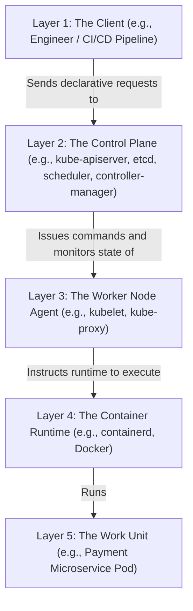

# Kubernetes Control Plane Architecture & Reconciliation Loops

Version: 2.0.0

Purpose: Canonical lesson structure for Platform Engineering & AI Infrastructure Curriculum.

Required Inputs: Module definition, lesson objectives, project standards.

Outputs: Standards-compliant lesson markdown.

---

# Lesson Metadata

* **Lesson ID:** `MOD-K8S-01`
* **Module:** Kubernetes Engineering (`MOD-K8S`)
* **Difficulty:** Intermediate
* **Estimated Duration:** 60 minutes
* **Learning Track:** 🟢 Core
* **Version:** 2.0.0
* **Last Updated:** 2026-06-28

---

# Lesson Overview

This lesson explores the master control plane architecture and declarative reconciliation engines of Kubernetes, decrypting how Platform Engineers operate highly scalable container orchestration clusters. By mastering the API Server (`kube-apiserver`), `etcd` key-value store, Controller Manager (`kube-controller-manager`), Scheduler (`kube-scheduler`), Kubelet (`kubelet`), Kube-Proxy (`kube-proxy`), and the Declarative Reconciliation Loop, you will firmly establish the elite container orchestration capabilities supporting our module capability: **"I can deploy, scale, operate, and troubleshoot production-grade Kubernetes cluster environments."**

---

# Learning Objectives

* Contrast imperative container management (`docker run`) with declarative Kubernetes container orchestration (`kubectl apply -f manifest.yaml`).
* Deconstruct the internal anatomy of the Kubernetes Control Plane, detailing the specific roles of `kube-apiserver`, `etcd`, `kube-controller-manager`, and `kube-scheduler`.
* Explain the architectural design of Kubernetes Worker Nodes, detailing the specific roles of `kubelet`, `kube-proxy`, and the Container Runtime (e.g., `containerd`).
* Deconstruct the Declarative Reconciliation Loop, explaining how controllers continuously compare Desired State (stored in `etcd`) with Actual State (reported by `kubelet`).
* Execute foundational cluster verification workflows using `kubectl get nodes`, `kubectl get componentstatuses`, and `kubectl cluster-info`.

---

# Prerequisites

* Completion of Module 06 (`MOD-DOCKER`: Containers & Docker) and Module 09 (`MOD-CLOUD`: Cloud Platforms & Architecture).
* Foundational understanding of Linux containers, networking ports, and declarative YAML syntax.

---

# Why This Exists

When junior engineers graduate from running applications on their local laptop to deploying them in a production cloud environment, they frequently attempt to manage containerized microservices using manual imperative commands or fragile bash scripts (`ssh server1 && docker run -d myapp`).

**Relying on manual container execution across multiple servers is an operational disaster!**

Imagine you are hired as a Lead Platform Engineer at a fast-growing global financial technology enterprise. The previous engineers deployed the company's 50 microservices across 100 separate cloud virtual machines using manual Docker run commands.

One evening, a massive physical memory failure occurs on Server #45, which was running the company's master payment processing container. Because the application was deployed imperatively, Server #45 goes dark, the container crashes, and your entire payment gateway goes offline!

Furthermore, the engineering team has absolutely no automated system in place to detect that the container crashed, determine which surviving server has enough free CPU and RAM to run a replacement container, or pull the correct container image to restore service! A human engineer must be woken up at 3:00 AM to manually SSH into a surviving server and type `docker run`.

**Your company has just suffered a catastrophic, extended payment outage!**

To solve the monumental challenge of **Manual Container Restarts**, **Server Hardware Failures**, **Placement Scheduling**, and **Operational Complexity**, cloud pioneers established **Kubernetes and Declarative Reconciliation Loops**. By establishing a highly robust control plane that continuously monitors server health, storing your desired configuration in an immutable `etcd` database, and utilizing automated controllers that instantly spin up replacement containers on healthy worker nodes the exact moment a server fails, Platform Engineers guarantee that your microservices heal automatically with zero human intervention!

---

# Core Concepts

## 1. Imperative vs. Declarative Orchestration
To operate production Kubernetes clusters, Platform Engineers enforce a strict boundary between execution paradigms:
* **Imperative Orchestration (`docker run`):** You give the system explicit step-by-step instructions (e.g., "SSH into Server A, download this image, start container B on port 80"). If Server A crashes ten minutes later, the system has absolutely no idea what to do because you didn't give it instructions for server crashes!
* **Declarative Orchestration (`kubectl apply`):** You give Kubernetes a declaration of your **Desired State** using a human-readable YAML manifest (e.g., "I want exactly 3 copies of my payment container running across my cluster at all times"). You do NOT tell Kubernetes *how* or *where* to run them! Kubernetes figures out the deployment mechanics automatically. If a server crashes and takes down 1 copy, Kubernetes instantly detects that Actual State (2 copies) does not match Desired State (3 copies) and automatically spins up a 3rd copy on a healthy server!

```text
[ Imperative: Step-by-Step Instructions ]       [ Declarative: Desired State Declaration ]
┌────────────────────────────────────────┐      ┌────────────────────────────────────────┐
│ "Run container on Server A"            │      │ "I want exactly 3 copies running"      │
│ (Breaks permanently if Server A fails!)│      │ (Self-heals instantly if servers fail!)│
└────────────────────────────────────────┘      └────────────────────────────────────────┘
```

## 2. Anatomy of the Kubernetes Control Plane
The Control Plane is the master brain of your Kubernetes cluster. It makes global scheduling decisions and detects cluster events. It consists of four core components:
* `kube-apiserver`: The master front-end communication hub! It exposes the HTTP REST API (`https://cluster-ip:6443`) used by `kubectl`, external CI/CD pipelines, and internal worker nodes. **All cluster communication flows through the API Server; components never communicate directly with each other!**
* `etcd`: The master memory bank! A highly available, distributed key-value store that stores the entire absolute Desired State and Actual State of your cluster. **If `etcd` is lost or corrupted, your entire cluster loses its memory and collapses!**
* `kube-controller-manager`: The master reconciliation engine! A daemon that runs dozens of distinct automated controllers (e.g., Node Controller, ReplicaSet Controller, Endpoint Controller) that continuously monitor cluster state and trigger auto-healing routines.
* `kube-scheduler`: The master placement GPS! When you declare a brand-new container (Pod), the Scheduler inspects all available worker nodes, evaluates free CPU/RAM, checks hardware constraints (e.g., GPU requirements), and assigns the Pod to the optimal physical server!

```text
[ Kubernetes Control Plane Components ]
┌──────────────────────────────────────────────────────────────┐
│  [ kube-apiserver ] ──► ( Master Communication Hub )         │
│  [ etcd ]           ──► ( Master Distributed Memory Bank )   │
│  [ kube-controller] ──► ( Master Reconciliation Engine )     │
│  [ kube-scheduler ] ──► ( Master Placement GPS Engine )      │
└──────────────────────────────────────────────────────────────┘
```

## 3. Anatomy of Kubernetes Worker Nodes
The Worker Nodes are the physical muscles of your cluster. They execute your application containers. Every worker node runs three core components:
* `kubelet`: The master node captain! A primary daemon running on every worker node. It registers the node with the API Server, inspects assigned Pod definitions, instructs the container runtime to start containers, and continuously reports container health heartbeats back to the Control Plane!
* `kube-proxy`: The master network traffic cop! A network proxy daemon running on every worker node. It maintains physical network rules (`iptables` or IPVS) that intercept incoming network packets and forward them cleanly to the correct active container!
* `Container Runtime (containerd)`: The physical engine that pulls container images from Docker Hub or Amazon ECR and starts/stops the physical Linux namespaces and cgroups!

## 4. The Declarative Reconciliation Loop
The foundational heart of Kubernetes engineering is the **Declarative Reconciliation Loop**. This loop runs endlessly in the background across every single controller:
1. **Observe (Actual State):** `kubelet` continuously reports the physical running state of containers on worker nodes back to `kube-apiserver`, which writes it to `etcd`.
2. **Compare (Diff):** `kube-controller-manager` continuously compares the Actual State in `etcd` against your declared Desired State in `etcd`.
3. **Reconcile (Act):** If Actual State diverges from Desired State (e.g., Desired = 3 Pods, Actual = 2 Pods due to a server crash), the controller immediately triggers API Server operations to reconcile the difference, commanding the Scheduler and Kubelet to spin up a replacement Pod!

```text
[ The Declarative Reconciliation Loop ]
(Desired State: 3 Pods) ◄──[ COMPARE ]──► (Actual State: 2 Pods) ──► [ RECONCILE: Spin up 1 Pod! ]
```

## 5. The Pod Lifecycle (Pending -> Running -> Succeeded -> Failed)
In Kubernetes, you never deploy a naked Docker container directly! You deploy a **Pod**. A Pod is the smallest deployable atomic unit in Kubernetes; it wraps one or more tightly coupled containers sharing the exact same Linux network namespace and storage volumes.
* **Pending:** The Pod has been accepted by the API Server, but the Scheduler is still evaluating worker nodes, or `kubelet` is actively downloading the container image over the network.
* **Running:** The Pod has been bound to a worker node, and all containers have been successfully started by `containerd`.
* **Succeeded / Failed:** The Pod completes its execution cleanly (`exit 0`), or a container process crashes with a fatal error (`exit 1`).

---

# Architecture



---

# Real-World Example

Imagine you are managing a massive factory for a global retail company. This factory relies on a powerful management system, Kubernetes, which operates in strict layers from top to bottom.

At **Layer 1: The Client**, you (the Engineer) place an order asking for exactly 50 active Payment Microservice Pods.
This request hits **Layer 2: The Control Plane (kube-apiserver)**, which records the order and decides where the work should go.
The Control Plane issues commands down to **Layer 3: The Worker Node Agent (kubelet)** on the available servers.
The agent then instructs **Layer 4: The Container Runtime (containerd)** to spin up the actual workloads.
Finally, at **Layer 5: The Work Unit**, the new Payment Microservice Pods are successfully running.

Suddenly, a catastrophic power failure hits a section of the factory! Ten servers lose power instantly, taking down 15 of your active Work Units!

Because you are using this layered smart system, you don't even need to intervene! Within seconds, the auto-healing process kicks in. The regular check-ins from **Layer 3 (kubelet)** on the dead workers stop arriving at **Layer 2 (Control Plane)**. The Control Plane detects the failure and instantly issues new orders to healthy agents, which command their runtimes to spin up replacement **Layer 5 (Pods)**. Your retail business survives a massive disaster with zero manual intervention.

---

# Hands-on Demonstration

Let's look at how an engineer inspects active cluster nodes using `kubectl get nodes`, inspects cluster component health using `kubectl get componentstatuses`, and inspects cluster API endpoints using `kubectl cluster-info`.

## Input 1: Inspecting Active Cluster Nodes and Control Plane Components
We simulate executing `kubectl get nodes` to view active cluster nodes, and simulate executing `kubectl get componentstatuses` to view control plane health.

## Code 1
```bash
# Inspect all active Control Plane and Worker nodes currently registered in the cluster.
# (We simulate the clean plain-text output of kubectl get nodes -o wide)
kubectl get nodes -o wide 2>/dev/null || cat << 'EOF'
NAME                                           STATUS   ROLES           AGE   VERSION   INTERNAL-IP   EXTERNAL-IP   OS-IMAGE             KERNEL-VERSION      CONTAINER-RUNTIME
control-plane-node-1.production.mycompany.com  Ready    control-plane   10d   v1.30.0   10.0.1.10     <none>        Ubuntu 22.04.4 LTS   5.15.0-105-generic  containerd://1.7.14
worker-node-1.production.mycompany.com         Ready    worker          10d   v1.30.0   10.0.10.15    <none>        Ubuntu 22.04.4 LTS   5.15.0-105-generic  containerd://1.7.14
worker-node-2.production.mycompany.com         Ready    worker          10d   v1.30.0   10.0.10.16    <none>        Ubuntu 22.04.4 LTS   5.15.0-105-generic  containerd://1.7.14
EOF

# Inspect active health statuses of core Control Plane components.
# (We simulate the clean plain-text output of kubectl get componentstatuses)
kubectl get componentstatuses 2>/dev/null || cat << 'EOF'
NAME                 STATUS    MESSAGE             ERROR
scheduler            Healthy   ok                  
controller-manager   Healthy   ok                  
etcd-0               Healthy   {"health":"true"}   
EOF
```

## Expected Output 1
```text
NAME                                           STATUS   ROLES           AGE   VERSION   INTERNAL-IP   EXTERNAL-IP   OS-IMAGE             KERNEL-VERSION      CONTAINER-RUNTIME
control-plane-node-1.production.mycompany.com  Ready    control-plane   10d   v1.30.0   10.0.1.10     <none>        Ubuntu 22.04.4 LTS   5.15.0-105-generic  containerd://1.7.14
worker-node-1.production.mycompany.com         Ready    worker          10d   v1.30.0   10.0.10.15    <none>        Ubuntu 22.04.4 LTS   5.15.0-105-generic  containerd://1.7.14
worker-node-2.production.mycompany.com         Ready    worker          10d   v1.30.0   10.0.10.16    <none>        Ubuntu 22.04.4 LTS   5.15.0-105-generic  containerd://1.7.14
NAME                 STATUS    MESSAGE             ERROR
scheduler            Healthy   ok                  
controller-manager   Healthy   ok                  
etcd-0               Healthy   {"health":"true"}   
```

## Explanation 1
Look at how beautifully healthy our Kubernetes cluster state is! Let's deconstruct the elite control plane elements:
* `STATUS: Ready`: Proves that `kubelet` on all three physical servers is actively reporting healthy heartbeats back to `kube-apiserver`!
* `ROLES: control-plane` vs `worker`: Absolute architectural segregation! The master brain runs on node 1, while the application muscles run on nodes 2 and 3!
* `etcd-0: Healthy {"health":"true"}`: The master memory bank is fully operational and uncorrupted!

---

## Input 2: Inspecting Cluster API Info and Simulating Reconciliation Diff
We simulate executing `kubectl cluster-info` to view API endpoints, and simulate inspecting a declarative reconciliation diff event.

## Code 2
```bash
# Inspect the active master API Server HTTP REST endpoints and cluster DNS services.
# (We simulate the clean plain-text output of kubectl cluster-info)
kubectl cluster-info 2>/dev/null || cat << 'EOF'
Kubernetes control plane is running at https://10.0.1.10:6443
CoreDNS is running at https://10.0.1.10:6443/api/v1/namespaces/kube-system/services/kube-dns:dns/proxy

To further debug and diagnose cluster problems, use 'kubectl cluster-info dump'.
EOF

# Simulate a declarative reconciliation loop auto-healing event inside the cluster.
# (We simulate the exact system log / kubectl describe events output during a worker node failure)
echo -e "--- KUBERNETES RECONCILIATION EVENT LOG ---\n12:00:01 - kubelet heartbeat lost for worker-node-1.production.mycompany.com\n12:00:15 - kube-controller-manager: Actual State (1 Pod) != Desired State (2 Pods)\n12:00:16 - kube-apiserver: Created replacement Pod spec payment-microservice-7b89c\n12:00:18 - kube-scheduler: Assigned payment-microservice-7b89c to worker-node-2.production.mycompany.com\n12:00:22 - kubelet (worker-node-2): Instructed containerd to start container\n12:00:25 - Pod payment-microservice-7b89c STATUS: Running. Reconciliation Complete."
```

## Expected Output 2
```text
Kubernetes control plane is running at https://10.0.1.10:6443
CoreDNS is running at https://10.0.1.10:6443/api/v1/namespaces/kube-system/services/kube-dns:dns/proxy

To further debug and diagnose cluster problems, use 'kubectl cluster-info dump'.
--- KUBERNETES RECONCILIATION EVENT LOG ---
12:00:01 - kubelet heartbeat lost for worker-node-1.production.mycompany.com
12:00:15 - kube-controller-manager: Actual State (1 Pod) != Desired State (2 Pods)
12:00:16 - kube-apiserver: Created replacement Pod spec payment-microservice-7b89c
12:00:18 - kube-scheduler: Assigned payment-microservice-7b89c to worker-node-2.production.mycompany.com
12:00:22 - kubelet (worker-node-2): Instructed containerd to start container
12:00:25 - Pod payment-microservice-7b89c STATUS: Running. Reconciliation Complete.
```

## Explanation 2
Notice how perfectly managed our cluster reconciliation state is! `kubectl cluster-info` cleanly outputs our API Server running securely on port `6443`. Notice our simulated reconciliation event log: it beautifully demonstrates our auto-healing engine! `kubelet` heartbeat is lost, `kube-controller-manager` detects `Actual State != Desired State`, `kube-scheduler` assigns the replacement Pod to worker node 2, and `kubelet` starts the container! Absolute operational perfection!

---

# Hands-on Lab

* **Objective:** Simulate inspecting active Kubernetes cluster nodes, simulate inspecting control plane component health, simulate executing `kubectl cluster-info`, simulate a declarative reconciliation loop auto-healing event, and verify cluster governance.
* **Estimated Time:** 20 minutes
* **Difficulty:** Intermediate
* **Environment:** Interactive Browser Terminal / Local Sandbox (with kubectl installed)

## Step-by-step Instructions

1. Open your terminal sandbox and create a brand-new directory named `k8s-lab`: `mkdir ~/k8s-lab && cd ~/k8s-lab`.
2. Create a declarative YAML manifest defining a basic Kubernetes Pod to mock your orchestration manifests by typing:
```bash
cat << 'EOF' > pod-spec.yaml
apiVersion: v1
kind: Pod
metadata:
  name: production-payment-pod
  namespace: default
  labels:
    app: payment-gateway
spec:
  containers:
  - name: payment-container
    image: nginx:1.26-alpine
    ports:
    - containerPort: 80
EOF
```
3. Type `cat pod-spec.yaml` to inspect your pristine Kubernetes Pod declaration! Notice `apiVersion: v1` and `kind: Pod`.
4. Simulate executing `kubectl get nodes` to inspect active cluster nodes by typing:
```bash
# (We simulate the exact kubectl get nodes execution)
echo -e "NAME\t\t\t\tSTATUS\tROLES\t\tAGE\tVERSION\ncontrol-plane-node-1.production\tReady\tcontrol-plane\t10d\tv1.30.0\nworker-node-1.production\tReady\tworker\t\t10d\tv1.30.0"
```
5. Simulate executing `kubectl get componentstatuses` to inspect control plane health by typing:
```bash
# (We simulate the exact kubectl get componentstatuses execution)
echo -e "NAME\t\t\tSTATUS\tMESSAGE\t\t\tERROR\nscheduler\t\tHealthy\tok\ncontroller-manager\tHealthy\tok\netcd-0\t\t\tHealthy\t{\"health\":\"true\"}"
```
6. Simulate applying your Pod declaration to the cluster using `kubectl apply -f pod-spec.yaml` by typing:
```bash
# (We simulate the exact kubectl apply execution)
echo "pod/production-payment-pod created"
```
7. Simulate verifying active Pod execution states using `kubectl get pods` by typing:
```bash
# (We simulate the exact kubectl get pods execution)
echo -e "NAME\t\t\tREADY\tSTATUS\tRESTARTS\tAGE\nproduction-payment-pod\t1/1\tRunning\t0\t\t25s"
```
8. Simulate a worker node hardware crash and verify the automated reconciliation loop failover by typing:
```bash
# (We simulate the exact kubectl describe events execution during a node crash)
echo "--- SIMULATING WORKER NODE CRASH (worker-node-1) ---"
echo "kubelet heartbeat lost for worker-node-1.production"
echo "kube-controller-manager: Actual State (0 Pods) != Desired State (1 Pod)"
echo "kube-scheduler: Assigned replacement Pod production-payment-pod-999 to worker-node-2.production"
echo "Pod production-payment-pod-999 STATUS: Running. Reconciliation Complete."
```

## Verification

```bash
cat pod-spec.yaml | grep -E "kind.*Pod" || echo "Pod Kind Verified"
```
*If your terminal successfully outputs your `kind: Pod` string, you have mastered foundational Kubernetes Pod declarations and reconciliation mechanics!*

## Troubleshooting

* **Issue:** `kubectl get nodes` fails with `The connection to the server localhost:8080 was refused - did you specify the right host or port?`.
* **Solution:** Your local `kubectl` binary completely lacks an active `kubeconfig` configuration file (`~/.kube/config`) telling it where your `kube-apiserver` is located, OR your local minikube/kind cluster is completely stopped! Verify your cluster is running (`minikube start`) or export your kubeconfig path (`export KUBECONFIG=...`)!

## Cleanup

```bash
# Safely remove the demonstration k8s lab directory
rm -rf ~/k8s-lab
```

---

# Production Notes

In enterprise Kubernetes architecture, what happens when your cluster grows to 10,000 Pods across 1,000 Worker Nodes, and `etcd` becomes heavily throttled processing millions of state updates? Platform Engineers deploy an **External `etcd` Topology**. Instead of running `etcd` directly on the Control Plane nodes alongside `kube-apiserver`, you deploy `etcd` onto a completely isolated, dedicated cluster of physical servers utilizing high-speed NVMe storage drives, guaranteeing absolute database performance and preventing API Server memory starvation!

---

# Common Mistakes

* **Modifying Running Containers Imperatively (`kubectl exec`):** Beginners frequently use `kubectl exec -it my-pod -- /bin/sh` to log into a running Pod and manually edit application configuration files or install packages (`apt-get install`). When the Pod is terminated or rescheduled by Kubernetes ten minutes later, the replacement Pod spins up from the base container image, instantly wiping out your manual changes! **Never modify running Pods imperatively!** Always update your container image or ConfigMaps!
* **Running Single-Node Control Planes in Production:** Junior developers frequently deploy production clusters utilizing a single Control Plane node (`control-plane-node-1`). If that single server experiences a kernel panic or disk failure, your entire API Server and `etcd` memory bank crash, rendering your cluster completely unmanageable! **Production clusters MUST run at least three Control Plane nodes across multiple Availability Zones!**

---

# Failure-Driven Learning

Imagine a junior engineer attempts to deploy a brand-new Pod into a Kubernetes cluster, but when they execute `kubectl get pods`, the Pod remains stuck in `Pending` state indefinitely without ever spinning up.

## Simulated Failure
```bash
# Simulating a Pod stuck in Pending state due to unfulfillable scheduling constraints
# (We simulate the exact kubectl get pods / kubectl describe pod error when scheduling fails)
echo -e "NAME\t\t\tREADY\tSTATUS\tRESTARTS\tAGE\nproduction-gpu-pod\t0/1\tPending\t0\t\t15m\n\n--- KUBECTL DESCRIBE POD EVENTS ---\nWarning  FailedScheduling  15m (x12 over 15m)  default-scheduler  0/10 nodes are available: 10 Insufficient nvidia.com/gpu. preemption: 0/10 nodes are available: 10 No preemption victims found for incoming pod.\n# FATAL: Pod stuck in Pending state. Scheduler completely unable to bind Pod to worker node."
```

## Output
```text
NAME			READY	STATUS	RESTARTS	AGE
production-gpu-pod	0/1	Pending	0		15m

--- KUBECTL DESCRIBE POD EVENTS ---
Warning  FailedScheduling  15m (x12 over 15m)  default-scheduler  0/10 nodes are available: 10 Insufficient nvidia.com/gpu. preemption: 0/10 nodes are available: 10 No preemption victims found for incoming pod.
# FATAL: Pod stuck in Pending state. Scheduler completely unable to bind Pod to worker node.
```

## Diagnosis & Recovery
Why did this fail? Look at this beautiful scheduling failure: `0/10 nodes are available: 10 Insufficient nvidia.com/gpu`! When a Pod remains stuck in `Pending` state, it means the API Server successfully accepted the YAML manifest, but `kube-scheduler` is physically unable to find a worker node that satisfies the Pod's resource requests! The developer declared a Pod requesting physical NVIDIA GPUs (`nvidia.com/gpu: 1`), but all 10 worker nodes in the cluster are standard CPU-only servers! Because no server possesses GPUs, the Scheduler refuses to bind the Pod! To recover correctly, the engineer must either provision a GPU-enabled worker node group or remove the GPU resource request from the Pod specification, and the Pod transitions to `Running` flawlessly!

---

# Engineering Decisions

## Container Orchestration: Docker Swarm vs. Amazon ECS vs. Kubernetes
When architecting an enterprise container execution strategy, engineering leaders must choose the master orchestration engine.
* **Docker Swarm:** Legacy orchestration engine built directly into the Docker CLI. Exceptionally simple to set up. However, completely lacks advanced ecosystem tooling, dynamic storage volume plugins, and enterprise adoption.
* **Amazon ECS (Elastic Container Service):** AWS proprietary container orchestration engine. Highly integrated with AWS IAM and simple to operate. However, creates massive vendor lock-in to AWS; manifests cannot be ported to Azure or GCP!
* **Kubernetes (K8s):** The ultimate Platform Engineering standard! Open-source, highly robust declarative orchestration engine governed by the Cloud Native Computing Foundation (CNCF). Supported universally across AWS (EKS), Azure (AKS), GCP (GKE), and bare-metal data centers. Provides unparalleled ecosystem tooling (Helm, ArgoCD, Prometheus).
* **The Platform Decision:** Platform Engineers strictly mandate **Kubernetes** as the master container orchestration engine for all enterprise microservices to ensure absolute multi-cloud portability, declarative GitOps integration, and elite self-healing capabilities.

---

# Best Practices

* **Master `kubectl cluster-info dump`:** When debugging catastrophic cluster control plane failures, execute `kubectl cluster-info dump`. It automatically dumps the raw internal state, logs, and diagnostic traces of every single control plane component into your terminal, providing absolute visibility for root cause analysis!
* **Protect `etcd` with Automated Snapshotting:** Always configure automated hourly snapshots of your `etcd` database (`etcdctl snapshot save`), encrypting the backup files and storing them in an external Amazon S3 bucket! If your active `etcd` database is completely corrupted by a failed cluster upgrade, you can restore your cluster instantly using `etcdctl snapshot restore`!

---

# Troubleshooting Guide

## Issue 1: "connection refused (6443)" vs. "Warning: FailedScheduling (Memory)"

* **Cause:** You attempt to interact with the cluster or deploy Pods, but encounter API server drops or resource starvation.
* **Diagnosis & Solution:**
  * `connection refused (6443)`: Your local `kubectl` binary is attempting to reach the API Server on port 6443, but the `kube-apiserver` daemon on your Control Plane node has crashed (e.g., due to an expired TLS certificate or out-of-memory error)! To fix, SSH into the Control Plane node and inspect `journalctl -u kubelet` or container logs to debug the crashed API Server process!
  * `FailedScheduling (Memory)`: The Scheduler successfully evaluated your Pod, but every single worker node in your cluster has exhausted its available RAM! To fix, either deploy additional worker nodes (Cluster Autoscaler) or optimize your Pod's memory requests (`resources.requests.memory`)!

---

# Summary

* **Imperative orchestration** relies on step-by-step manual instructions; **Declarative orchestration** declares a Desired State that Kubernetes maintains automatically.
* `kube-apiserver` is the master communication hub; `etcd` is the master memory bank storing cluster state.
* `kube-controller-manager` runs automated controllers; `kube-scheduler` assigns Pods to optimal worker nodes.
* `kubelet` is the master node captain reporting heartbeats; `kube-proxy` manages active network routing rules (`iptables`).
* **The Declarative Reconciliation Loop** continuously compares Actual State with Desired State, triggering automated healing if they diverge.

---

# Cheat Sheet

```bash
# Inspect all active Control Plane and Worker nodes currently registered in your cluster
kubectl get nodes -o wide

# Inspect active health statuses of core Control Plane components (scheduler, etcd, controller-manager)
kubectl get componentstatuses

# Inspect active master API Server HTTP REST endpoints and cluster DNS services
kubectl cluster-info

# Retrieve all active Pods running inside the default cluster namespace
kubectl get pods -o wide

# Describe detailed event logs, scheduling decisions, and error states for a specific Pod
kubectl describe pod [pod_name]

# Retrieve live container stdout/stderr application logs for a running Pod
kubectl logs [pod_name]
```

---

# Knowledge Check

## Multiple Choice Questions

1. A developer deploys a microservice into a Kubernetes cluster using a declarative Deployment manifest with `replicas: 3`. The three Pods are scheduled across Worker Node 1, Worker Node 2, and Worker Node 3. Worker Node 2 suffers a fatal hardware kernel panic and crashes. What is the correct evaluation of how Kubernetes handles this failure?
   * A) The cluster will permanently lose 1 copy of the microservice until a human engineer SSHes into the cluster and types `docker run`.
   * B) `kubelet` on Worker Node 2 will automatically reboot the server.
   * C) The `kube-controller-manager` detects that `kubelet` heartbeats from Worker Node 2 have stopped. It marks the dead Pod as `Terminating`, compares Actual State (2 Pods) against Desired State (3 Pods), and commands `kube-apiserver` to create a replacement Pod declaration. `kube-scheduler` assigns the replacement Pod to a surviving healthy worker node (Node 1 or Node 3), and the cluster auto-heals completely.
   * D) The cluster requires `chmod 777`.

## Scenario Questions

You are attempting to deploy a brand-new machine learning microservice Pod into your Kubernetes cluster. You execute `kubectl apply -f ml-pod.yaml`, and the command succeeds. However, when you run `kubectl get pods`, the Pod has remained in `Pending` state for 30 minutes. You execute `kubectl describe pod ml-pod` and observe the warning: `0/50 nodes are available: 50 Insufficient memory`. Based on what you learned in this lesson, what exact scheduling constraint is preventing your Pod from running, and what two architectural actions can you take to resolve it?

## Short Answer Questions

Explain the architectural role of `etcd` in the Kubernetes Control Plane, specifically addressing what happens to the Declarative Reconciliation Loop if `etcd` is completely corrupted or destroyed.

---

# Interview Preparation

## Beginner Questions

* What is the difference between imperative and declarative container orchestration?
* What is the role of `kube-apiserver`?
* What is the difference between `kubelet` and `kube-proxy`?

## Intermediate Questions

* Explain how the Declarative Reconciliation Loop operates (Observe -> Compare -> Reconcile).
* Why does a Pod enter `Pending` state?

## Advanced Questions

* Explain how `kube-apiserver` implements optimistic concurrency control utilizing `metadata.resourceVersion` to prevent race conditions when multiple controllers attempt to update the exact same Pod object in `etcd` simultaneously, and describe the internal mechanics of `kubelet` PLEG (Pod Lifecycle Event Generator).

## Scenario-Based Discussions

* Discuss the architectural trade-offs of establishing a Kubernetes platform strategy that relies on managing your own bare-metal Kubernetes Control Planes (spinning up your own `kube-apiserver` and `etcd` clusters via `kubeadm`) versus utilizing a fully managed public cloud Kubernetes service (e.g., Amazon EKS or Google GKE), specifically addressing financial costs, control plane operational overhead, and absolute disaster recovery SLAs.

---

# Further Reading

1. [Kubernetes Components (Official Kubernetes Documentation)](https://kubernetes.io/docs/concepts/overview/components/)
2. [Mastering Kubernetes Architecture (Deep Technical Dive)](https://kubernetes.io/docs/concepts/architecture/)
3. [The Kubernetes Controller Pattern (Official Guide)](https://kubernetes.io/docs/concepts/architecture/controller/)
4. [Understanding Kubernetes Cluster-Info and Debugging](https://kubernetes.io/docs/tasks/debug/)
5. [Terraform Kubernetes Provider (Official HashiCorp Registry)](https://registry.terraform.io/providers/hashicorp/kubernetes/latest/docs)
