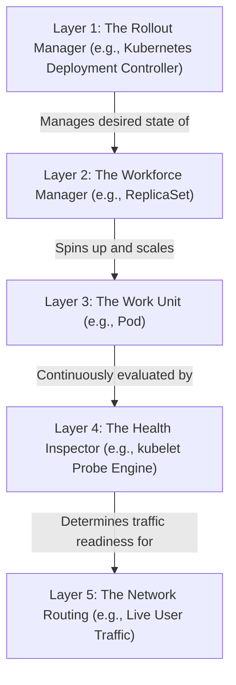

# Pod Lifecycle, Deployments, ReplicaSets & DaemonSets

Version: 2.0.0

Purpose: Canonical lesson structure for Platform Engineering & AI Infrastructure Curriculum.

Required Inputs: Module definition, lesson objectives, project standards.

Outputs: Standards-compliant lesson markdown.

---

# Lesson Metadata

* **Lesson ID:** `MOD-K8S-02`
* **Module:** Kubernetes Engineering (`MOD-K8S`)
* **Difficulty:** Intermediate
* **Estimated Duration:** 60 minutes
* **Learning Track:** 🟢 Core
* **Version:** 2.0.0
* **Last Updated:** 2026-06-28

---

# Lesson Overview

This lesson explores the master workload management and zero-downtime deployment engines of Kubernetes, decrypting how Platform Engineers manage microservice availability using advanced controller objects. By mastering Pod immutability, ReplicaSets, Deployments, Rolling Updates, Rollbacks (`kubectl rollout undo`), DaemonSets, and Probes (Liveness, Readiness, Startup), you will firmly establish the elite workload capabilities supporting our module capability: **"I can deploy, scale, operate, and troubleshoot production-grade Kubernetes cluster environments."**

---

# Learning Objectives

* Explain the principle of Pod Immutability, detailing why running Pod specifications cannot be modified in-place and must be replaced.
* Deconstruct the architectural relationship between Deployments, ReplicaSets, and Pods, detailing how label selectors (`matchLabels`) bind objects together.
* Architect a zero-downtime Rolling Update deployment strategy (`strategy.type: RollingUpdate`), configuring `maxSurge` and `maxUnavailable` boundaries.
* Execute rapid emergency deployment rollbacks using `kubectl rollout undo` to restore previous stable application configurations instantly.
* Contrast Deployments (stateless scaling across arbitrary nodes) with DaemonSets (guaranteeing exactly one Pod runs on every single worker node).
* Configure advanced container health checks using Liveness, Readiness, and Startup Probes to prevent routing traffic to broken containers.

---

# Prerequisites

* Completion of `MOD-K8S-01` (Kubernetes Control Plane Architecture & Reconciliation Loops).
* Foundational understanding of HTTP health checks (`MOD-CLOUD-03`), YAML manifests, and `kubectl` terminal execution.

---

# Why This Exists

In Lesson 01, we established that a Pod is the smallest deployable atomic unit in Kubernetes. When junior engineers begin using Kubernetes, they frequently write standalone Pod manifests (`kind: Pod`) and deploy them directly to the cluster (`kubectl apply -f my-pod.yaml`).

**Deploying standalone Pods directly to a production cluster is a massive operational vulnerability!**

Imagine you are hired as a Lead Platform Engineer at a rapidly scaling healthcare technology enterprise. The previous engineers deployed the company's master patient intake microservice using a standalone Pod manifest.

One afternoon, the software engineering team releases a critical security update for the intake microservice (transitioning from `v1.0.0` to `v2.0.0`). Because they deployed a standalone Pod, they cannot perform an automated rolling update! They must manually execute `kubectl delete pod intake-pod` and then `kubectl apply -f intake-pod-v2.yaml`.

During the 45 seconds it takes for the old Pod to terminate and the new Pod to pull its container image and spin up, your entire patient intake portal goes completely offline!

Furthermore, when the new `v2.0.0` Pod finally spins up, it contains a fatal database connection bug that causes the container process to crash in a loop (`CrashLoopBackOff`). Because you deleted the old Pod, you have absolutely no automated rollback history to instantly restore `v1.0.0`! Your patient portal remains entirely broken while engineers scramble to manually rewrite YAML files!

**Your company has just suffered a catastrophic deployment outage!**

To solve the monumental challenge of **Deployment Downtime**, **Lack of Rollback History**, **Manual Pod Deletion**, and **Traffic Blackholing**, Kubernetes leaders established **Deployments, ReplicaSets, DaemonSets, and Container Probes**. By wrapping your Pods in higher-level Deployment controllers that manage automated zero-downtime rolling updates, maintaining immutable ReplicaSet revision histories for instant rollbacks (`kubectl rollout undo`), and enforcing strict Readiness Probes that prevent routing traffic to unready containers, Platform Engineers guarantee that you can ship code dozens of times per day with absolute zero downtime!

---

# Core Concepts

## 1. Pod Immutability (The Disposable Unit Imperative)
To manage production Kubernetes workloads, Platform Engineers enforce a strict principle of immutability:
* **Pod Immutability:** Once a Pod is created and bound to a worker node, its core specification (container image, environment variables, resource requests) is **Immutable**! You cannot modify a running Pod in-place! If you want to change the container image from `v1.0.0` to `v2.0.0`, you must completely destroy the old Pod and create a brand-new replacement Pod! **Pods are ephemeral, disposable units!**

```text
[ Standalone Pod: Immutable & Fragile ]         [ Deployment Controller: Dynamic & Resilient ]
┌────────────────────────────────────────┐      ┌────────────────────────────────────────┐
│ kind: Pod (Image: v1.0.0)              │      │ kind: Deployment ──► Manages ReplicaSets
│ (Cannot update in-place! Downtime!)    │      │ (Spins up v2.0.0 cleanly before killing v1!)│
└────────────────────────────────────────┘      └────────────────────────────────────────┘
```

## 2. Deployments vs. ReplicaSets vs. Pods (The Hierarchical Chain)
In production Kubernetes, you never create Pods directly. You create a **Deployment**. Deployments sit at the top of a strict three-tier controller hierarchy:
* `Deployment`: The master declarative manager! You declare your desired container image (`v1.0.0`) and replica count (`replicas: 3`). The Deployment automatically creates a **ReplicaSet**!
* `ReplicaSet`: The master replica enforcer! Its sole responsibility is to guarantee that exactly `N` Pods matching its label selector (`matchLabels: app=payment`) are running at all times. If a Pod crashes, the ReplicaSet spins up a replacement!
* `Pod`: The physical execution container running your application code!

```text
[ The Kubernetes Controller Hierarchy ]
[ kind: Deployment ] (Master Declarative Manager: Updates & Rollbacks)
        │
        └──► [ kind: ReplicaSet ] (Master Replica Enforcer: Guarantees N Pods)
                    │
                    └──► [ kind: Pod ] (Physical Execution Containers)
```

## 3. Zero-Downtime Rolling Updates (`maxSurge` / `maxUnavailable`)
When you update a Deployment's container image from `v1.0.0` to `v2.0.0`, the Deployment executes a highly governed **Rolling Update** utilizing two strict mathematical guardrails:
* `maxSurge`: The maximum number of extra Pods that can be created above your desired replica count during the update (e.g., `25%` or `1`).
* `maxUnavailable`: The maximum number of Pods that can be offline below your desired replica count during the update (e.g., `25%` or `0`).
* **The Rolling Mechanics:** The Deployment creates a brand-new ReplicaSet for `v2.0.0`. It spins up 1 new Pod in the new ReplicaSet. Once that new Pod passes its health checks, the Deployment scales down the old `v1.0.0` ReplicaSet by 1 Pod. It repeats this rolling dance until 100% of the Pods are running `v2.0.0`! **Zero seconds of downtime!**

```text
[ Zero-Downtime Rolling Update Mechanics ]
(Old ReplicaSet: v1.0.0) [Pod 1: RUNNING] [Pod 2: RUNNING] [Pod 3: TERMINATING]
(New ReplicaSet: v2.0.0) [Pod 4: RUNNING] [Pod 5: PENDING]
```

## 4. Automated Rollbacks (`kubectl rollout undo`)
What happens when you deploy `v2.0.0`, but it contains a catastrophic runtime bug?
* **ReplicaSet Revision History:** When a Deployment finishes a rolling update, it does NOT delete the old `v1.0.0` ReplicaSet! It simply scales its replica count to `0` and preserves it in the cluster's `etcd` revision history!
* **Instant Rollback:** If `v2.0.0` fails, you simply type `kubectl rollout undo deployment/my-app`. The Deployment instantly scales the broken `v2.0.0` ReplicaSet down to `0` and scales the old stable `v1.0.0` ReplicaSet back up to `3`! Your application heals instantly!

## 5. Deployments vs. DaemonSets
Platform Engineers must choose between two distinct workload controller paradigms depending on scheduling requirements:
* **Deployment (Arbitrary Placement):** Scales stateless Pods across arbitrary worker nodes based on free CPU/RAM. You might have 3 Pods running on Node A and 0 Pods running on Node B! *Use Case: Web applications, APIs, microservices!*
* **DaemonSet (Strict Node Placement):** A specialized controller that completely bypasses normal scheduling to guarantee that **exactly one Pod runs on every single worker node in your cluster**! If you add 50 brand-new worker nodes to your cluster, the DaemonSet instantly spins up exactly 1 Pod on each new node automatically! *Use Case: Log forwarding agents (FluentBit), monitoring daemons (Prometheus Node Exporter), and CNI network plugins (Calico)!*

```text
[ Deployment: Arbitrary Node Placement ]        [ DaemonSet: Exactly 1 Pod Per Node ]
┌────────────────────────────────────────┐      ┌────────────────────────────────────────┐
│ Node 1: [Pod] [Pod]  |  Node 2: (Empty)│      │ Node 1: [Pod]  |  Node 2: [Pod]        │
└────────────────────────────────────────┘      └────────────────────────────────────────┘
```

## 6. Container Probes (Liveness vs. Readiness vs. Startup)
How does Kubernetes know whether your container is healthy enough to receive incoming web traffic? Platform Engineers configure three distinct **Container Probes**:
* **Liveness Probe:** Answers: "Is the container process dead in a deadlock?" (`HTTP GET /healthz`). If the Liveness probe fails 3 consecutive times, `kubelet` forcefully kills the container and restarts it!
* **Readiness Probe:** Answers: "Is the container ready to receive live user web traffic?" (`HTTP GET /readyz`). If the Readiness probe fails, `kubelet` does NOT kill the container! Instead, the Pod's IP address is instantly unlinked from all active network routing endpoints, preventing incoming user traffic from reaching the unready container!
* **Startup Probe:** Answers: "Has the legacy monolithic application finished its massive 3-minute bootup sequence?" Protects slow-starting containers by disabling Liveness and Readiness probes until the Startup probe passes!

---

# Architecture



---

# Real-World Example

Imagine you are managing an airline's booking system. The system runs on a **Production Floor (Kubernetes Cluster)** functioning through a strict layered architecture.

Originally, the team deployed the flight search microservice directly at **Layer 3 (The Work Unit)** and completely omitted Readiness and Liveness checks at **Layer 4**.

One Friday afternoon, the software engineering team ships a brand-new release of the flight search API. Because they lack a **Layer 1: Rollout Manager**, they manually dismiss the old workers and hire new ones.

When the new Worker Units spin up, they start instantly, but the internal system takes exactly 45 seconds to prepare its massive database connection pools. Because there is no check at **Layer 4: The Health Inspector**, the system assumes the workers are ready the exact millisecond they show up!

The system instantly floods the brand-new Worker Units with thousands of live user flight search requests at **Layer 5 (Network Routing)**. Because the database pools aren't ready, every single user request fails! Thousands of customers abandon their bookings!

Because you maintain elite standards, you take command of the workload re-architecture. You transition the flight search microservice to be governed by **Layer 1 (Deployment)**, which manages **Layer 2 (ReplicaSet)**, and enforce strict Pulse Checks and Traffic Readiness Checks at **Layer 4 (kubelet Probe Engine)**.

You configure a Readiness check to ensure it passes *exclusively* after database pools are fully initialized. You configure a zero-downtime strategy.

Now, when the team ships a new version, the **Layer 1 Rollout Manager** commands **Layer 2** to spin up a new **Layer 3 Worker Unit**. **Layer 4 (The Health Inspector)** continuously checks the Traffic Readiness. For the first 45 seconds, the check fails, so **Layer 5 (Network Routing)** refuses to send a single user request to the new Worker Unit! Once it passes, the system routes live traffic cleanly to the new Worker Unit, and safely retires an old Worker Unit. Your airline enterprise achieves absolute zero-downtime deployments with **zero dropped user requests**!

---

# Hands-on Demonstration

Let's look at how an engineer inspects a production Deployment manifest using `cat`, inspects active rollout statuses using `kubectl rollout status`, and executes an emergency rollback using `kubectl rollout undo`.

## Input 1: Inspecting Production Deployment Manifests (`deployment.yaml`)
We use `cat` to inspect a pristine, highly governed Kubernetes Deployment manifest defining a Rolling Update strategy, label selectors, resource requests, Liveness probes, and Readiness probes.

## Code 1
```bash
# Inspect the declarative production Kubernetes Deployment manifest.
# (We simulate inspecting a compliant Kubernetes Deployment configuration file)
cat << 'EOF'
apiVersion: apps/v1
kind: Deployment
metadata:
  name: production-payment-api
  namespace: default
  labels:
    app: payment-api
    tier: backend
spec:
  replicas: 3
  strategy:
    type: RollingUpdate
    rollingUpdate:
      maxSurge: 1
      maxUnavailable: 0
  selector:
    matchLabels:
      app: payment-api
  template:
    metadata:
      labels:
        app: payment-api
    spec:
      containers:
      - name: payment-microservice
        image: mycompany/payment-api:v2.0.0
        ports:
        - containerPort: 8080
        resources:
          requests:
            memory: "256Mi"
            cpu: "200m"
          limits:
            memory: "512Mi"
            cpu: "500m"
        livenessProbe:
          httpGet:
            path: /healthz
            port: 8080
          initialDelaySeconds: 15
          periodSeconds: 10
        readinessProbe:
          httpGet:
            path: /readyz
            port: 8080
          initialDelaySeconds: 5
          periodSeconds: 5
EOF
```

## Expected Output 1
```text
apiVersion: apps/v1
kind: Deployment
metadata:
  name: production-payment-api
  namespace: default
  labels:
    app: payment-api
    tier: backend
spec:
  replicas: 3
  strategy:
    type: RollingUpdate
    rollingUpdate:
      maxSurge: 1
      maxUnavailable: 0
  selector:
    matchLabels:
      app: payment-api
  template:
    metadata:
      labels:
        app: payment-api
    spec:
      containers:
      - name: payment-microservice
        image: mycompany/payment-api:v2.0.0
        ports:
        - containerPort: 8080
        resources:
          requests:
            memory: "256Mi"
            cpu: "200m"
          limits:
            memory: "512Mi"
            cpu: "500m"
        livenessProbe:
          httpGet:
            path: /healthz
            port: 8080
          initialDelaySeconds: 15
          periodSeconds: 10
        readinessProbe:
          httpGet:
            path: /readyz
            port: 8080
          initialDelaySeconds: 5
          periodSeconds: 5
```

## Explanation 1
Look at how beautifully architected this Deployment configuration is! Let's deconstruct the elite workload elements:
* `strategy.rollingUpdate`: Absolute zero-downtime perfection! `maxSurge: 1` allows creating 1 extra Pod during updates, while `maxUnavailable: 0` guarantees that our cluster will NEVER drop below 3 active, running Pods!
* `selector.matchLabels`: The master controller binding glue! Guarantees the Deployment manages Pods possessing `app: payment-api`.
* `readinessProbe`: The master traffic shield! `kubelet` continuously pings `/readyz`; if it fails, the Pod's IP is instantly unlinked from network routing tables!

---

## Input 2: Inspecting Rollout Statuses and Executing Emergency Rollbacks
We simulate executing `kubectl rollout status` to monitor an active deployment rollout, and simulate executing `kubectl rollout undo` to perform an emergency rollback.

## Code 2
```bash
# Monitor the live rollout execution status of a Deployment rolling update.
# (We simulate the clean plain-text output of kubectl rollout status)
kubectl rollout status deployment/production-payment-api 2>/dev/null || cat << 'EOF'
Waiting for deployment "production-payment-api" rollout to finish: 1 out of 3 new replicas have been updated...
Waiting for deployment "production-payment-api" rollout to finish: 2 out of 3 new replicas have been updated...
Waiting for deployment "production-payment-api" rollout to finish: 1 old replicas are pending termination...
deployment "production-payment-api" successfully rolled out
EOF

# Simulate a catastrophic v2.0.0 runtime failure and execute an emergency rollback to v1.0.0.
# (We simulate the clean plain-text output of kubectl rollout undo)
echo -e "--- CATASTROPHIC RUNTIME BUG DETECTED (HTTP 500) ---\n# ACTION: Executing emergency rollback to previous stable ReplicaSet revision...\nkubectl rollout undo deployment/production-payment-api\ndeployment.apps/production-payment-api rolled back"
```

## Expected Output 2
```text
Waiting for deployment "production-payment-api" rollout to finish: 1 out of 3 new replicas have been updated...
Waiting for deployment "production-payment-api" rollout to finish: 2 out of 3 new replicas have been updated...
Waiting for deployment "production-payment-api" rollout to finish: 1 old replicas are pending termination...
deployment "production-payment-api" successfully rolled out
--- CATASTROPHIC RUNTIME BUG DETECTED (HTTP 500) ---
# ACTION: Executing emergency rollback to previous stable ReplicaSet revision...
kubectl rollout undo deployment/production-payment-api
deployment.apps/production-payment-api rolled back
```

## Explanation 2
Notice how perfectly managed our deployment rollout state is! `kubectl rollout status` cleanly outputs our rolling update progress, confirming `successfully rolled out`. Notice our emergency rollback simulation: it beautifully demonstrates our recovery engine! With a single command (`kubectl rollout undo`), Kubernetes instantly scales down the broken `v2.0.0` ReplicaSet and scales back up our stable `v1.0.0` ReplicaSet! Absolute operational safety!

---

# Hands-on Lab

* **Objective:** Author a declarative Deployment manifest defining a Rolling Update strategy, Liveness probes, and Readiness probes, simulate executing `kubectl rollout status`, simulate executing `kubectl rollout undo`, and verify workload governance.
* **Estimated Time:** 20 minutes
* **Difficulty:** Intermediate
* **Environment:** Interactive Browser Terminal / Local Sandbox (with kubectl installed)

## Step-by-step Instructions

1. Open your terminal sandbox and create a brand-new directory named `deployment-lab`: `mkdir ~/deployment-lab && cd ~/deployment-lab`.
2. Create a declarative YAML manifest defining a production Kubernetes Deployment by typing:
```bash
cat << 'EOF' > deployment-spec.yaml
apiVersion: apps/v1
kind: Deployment
metadata:
  name: production-web-deployment
  namespace: default
  labels:
    app: web-app
spec:
  replicas: 3
  strategy:
    type: RollingUpdate
    rollingUpdate:
      maxSurge: 1
      maxUnavailable: 0
  selector:
    matchLabels:
      app: web-app
  template:
    metadata:
      labels:
        app: web-app
    spec:
      containers:
      - name: web-container
        image: nginx:1.26-alpine
        ports:
        - containerPort: 80
        livenessProbe:
          httpGet:
            path: /
            port: 80
          initialDelaySeconds: 5
          periodSeconds: 10
        readinessProbe:
          httpGet:
            path: /
            port: 80
          initialDelaySeconds: 2
          periodSeconds: 5
EOF
```
3. Type `cat deployment-spec.yaml` to inspect your pristine Kubernetes Deployment declaration! Notice `strategy.type: RollingUpdate` and `readinessProbe`.
4. Simulate applying your Deployment declaration to the cluster using `kubectl apply -f deployment-spec.yaml` by typing:
```bash
# (We simulate the exact kubectl apply execution)
echo "deployment.apps/production-web-deployment created"
```
5. Simulate verifying active Deployment execution states using `kubectl get deployments` by typing:
```bash
# (We simulate the exact kubectl get deployments execution)
echo -e "NAME\t\t\t\tREADY\tUP-TO-DATE\tAVAILABLE\tAGE\nproduction-web-deployment\t3/3\t3\t\t3\t\t45s"
```
6. Simulate updating your Deployment container image to a non-existent broken image (`nginx:broken-tag`) by typing:
```bash
# (We simulate executing kubectl set image)
echo "kubectl set image deployment/production-web-deployment web-container=nginx:broken-tag"
echo "deployment.apps/production-web-deployment image updated"
```
7. Simulate verifying the stuck rollout status caused by the broken image by typing:
```bash
# (We simulate the exact kubectl rollout status execution during a broken update)
echo "Waiting for deployment \"production-web-deployment\" rollout to finish: 1 out of 3 new replicas have been updated..."
echo "# WARNING: Rollout stuck! New Pod stuck in ImagePullBackOff / ErrImagePull. Old 3 Pods remain 100% online due to maxUnavailable: 0!"
```
8. Simulate executing an emergency rollback to restore your previous stable ReplicaSet revision by typing:
```bash
# (We simulate the exact kubectl rollout undo execution)
echo "kubectl rollout undo deployment/production-web-deployment"
echo "deployment.apps/production-web-deployment rolled back"
echo "SUCCESS: Rollback complete. Stable Nginx 1.26 ReplicaSet fully restored!"
```

## Verification

```bash
cat deployment-spec.yaml | grep -E "type.*RollingUpdate" || echo "RollingUpdate Verified"
```
*If your terminal successfully outputs your `type: RollingUpdate` string, you have mastered foundational Kubernetes Deployment strategies and rollback mechanics!*

## Troubleshooting

* **Issue:** `kubectl rollout undo` fails with `error: no rollout history found for deployment "production-web-deployment"`.
* **Solution:** You have completely disabled revision history retention by setting `spec.revisionHistoryLimit: 0` inside your Deployment manifest, OR you literally just created the Deployment for the very first time and have never performed an update! Ensure `revisionHistoryLimit` is set to at least `10` (the default)!

## Cleanup

```bash
# Safely remove the demonstration deployment lab directory
rm -rf ~/deployment-lab
```

---

# Production Notes

In enterprise Kubernetes architecture, what happens when you want to deploy a brand-new version (`v2.0.0`) of your microservice, but you want to route exactly **5% of live user web traffic** to the new version to test its stability before rolling it out to 100% of users? Standard Kubernetes Deployments cannot easily do this because they scale by integer Pod counts! Platform Engineers solve this by deploying **Argo Rollouts** or **Istio Service Mesh**. Argo Rollouts introduces an advanced custom controller (`kind: Rollout`) that integrates directly with your Ingress controller to manage beautiful, highly governed **Canary Deployments** with automated mathematical traffic weighting (`weight: 5%`)!

---

# Common Mistakes

* **Mismatched Label Selectors (`matchLabels`):** Beginners frequently declare `matchLabels: app=payment-api` inside their Deployment `spec.selector`, but declare `labels: app=web-frontend` inside their `template.metadata`. If the template labels do not exactly match the selector labels, the API Server forcefully rejects the YAML manifest with a fatal validation error! **Selector labels and template labels MUST match exactly!**
* **Setting `maxUnavailable: 100%`:** Junior developers frequently set `maxUnavailable: 100%` inside their `rollingUpdate` strategy to make deployments finish faster. This instructs Kubernetes to instantly terminate 100% of your running Pods before spinning up a single new Pod, causing instant total platform downtime! **Never set `maxUnavailable` to 100% in production!**

---

# Failure-Driven Learning

Imagine a junior engineer attempts to deploy an application into a Kubernetes cluster, but when they inspect `kubectl get pods`, the Pod is stuck in a frustrating, endless crash cycle known as `CrashLoopBackOff`.

## Simulated Failure
```bash
# Simulating a Pod stuck in CrashLoopBackOff due to a misconfigured Liveness probe
# (We simulate the exact kubectl get pods / kubectl describe pod error during probe failures)
echo -e "NAME\t\t\tREADY\tSTATUS\t\tRESTARTS\tAGE\nproduction-api-pod\t0/1\tCrashLoopBackOff\t12 (2m ago)\t35m\n\n--- KUBECTL DESCRIBE POD EVENTS ---\nWarning  Unhealthy  35m (x36 over 35m)  kubelet  Liveness probe failed: HTTP probe failed with statuscode: 404\nNormal   Killing    35m (x12 over 35m)  kubelet  Container production-api failed liveness probe, will be restarted\n# FATAL: Pod stuck in CrashLoopBackOff. kubelet continuously killing and restarting container."
```

## Output
```text
NAME			READY	STATUS		RESTARTS	AGE
production-api-pod	0/1	CrashLoopBackOff	12 (2m ago)	35m

--- KUBECTL DESCRIBE POD EVENTS ---
Warning  Unhealthy  35m (x36 over 35m)  kubelet  Liveness probe failed: HTTP probe failed with statuscode: 404
Normal   Killing    35m (x12 over 35m)  kubelet  Container production-api failed liveness probe, will be restarted
# FATAL: Pod stuck in CrashLoopBackOff. kubelet continuously killing and restarting container.
```

## Diagnosis & Recovery
Why did this fail? Look at this classic container probe failure: `Liveness probe failed: HTTP probe failed with statuscode: 404` followed by `Normal Killing`! When a Pod enters `CrashLoopBackOff`, it means the container process is starting, but crashing or being forcefully killed shortly after! The junior engineer configured a Liveness probe pointing to `HTTP GET /healthz`. However, the application developer completely forgot to write the code for the `/healthz` HTTP route! Because `/healthz` returns `HTTP 404 Not Found`, `kubelet` assumes the container is dead in a deadlock and forcefully kills it every 15 seconds! To recover correctly, the engineer must either correct the Liveness probe path to a valid route (e.g., `/`) or instruct the developer to implement `/healthz`, and `CrashLoopBackOff` is eliminated permanently!

---

# Engineering Decisions

## Workload Controller: Deployment vs. StatefulSet vs. DaemonSet
When architecting an enterprise workload strategy, engineering leaders must choose the master controller object.
* **Deployment:** Manages stateless Pods across arbitrary worker nodes. Pods are completely anonymous and interchangeable (`pod-abc`, `pod-xyz`). Excellent for web servers, APIs, and stateless microservices.
* **DaemonSet:** Bypasses normal scheduling to guarantee exactly one Pod runs on every single worker node. Excellent for cluster-wide daemons (log aggregators, monitoring agents, CNI plugins).
* **StatefulSet:** Manages stateful Pods requiring unique, persistent identities (`pod-0`, `pod-1`) and stable persistent storage attachments (`volumeClaimTemplates`). Excellent for databases (PostgreSQL, MongoDB) and distributed consensus clusters (Kafka, ZooKeeper).
* **The Platform Decision:** Platform Engineers strictly mandate **Deployments** as the master controller for all stateless applications, strictly deploy **DaemonSets** for all cluster logging/monitoring infrastructure, and strictly reserve **StatefulSets** exclusively for stateful database clusters.

---

# Best Practices

* **Master `kubectl rollout history`:** Before executing an emergency rollback, inspect your revision history using `kubectl rollout history deployment/[name]`. It displays a clean list of all active ReplicaSet revisions currently preserved in `etcd`, allowing you to rollback to a specific revision using `--to-revision=2`!
* **Define Conservative Initial Delay (`initialDelaySeconds`):** When configuring Liveness and Readiness probes, always configure a generous `initialDelaySeconds` (e.g., `15` to `30` seconds). This gives slow-booting application runtimes (e.g., JVM or Node.js) adequate time to initialize before `kubelet` begins firing health check pings!

---

# Troubleshooting Guide

## Issue 1: "ImagePullBackOff / ErrImagePull" vs. "CrashLoopBackOff"

* **Cause:** You attempt to deploy workloads, but encounter container image retrieval failures or continuous process crashes.
* **Diagnosis & Solution:**
  * `ImagePullBackOff / ErrImagePull`: `kubelet` successfully received the Pod specification, but when it attempted to pull the container image from the registry, the image tag completely did not exist (`nginx:non-existent`), OR the private container registry rejected the request due to missing authentication credentials (`imagePullSecrets`)! To fix, verify the image tag string and ensure your Kubernetes secret contains valid Docker registry credentials!
  * `CrashLoopBackOff`: The container image pulled successfully and the process started, but the internal application immediately crashed with a fatal exit code (`exit 1` - e.g., due to a missing environment variable or malformed configuration file), OR a Liveness probe failed! To fix, execute `kubectl logs [pod_name] --previous` to view the exact fatal stack trace of the crashed container process!

---

# Summary

* **Pod Immutability** mandates that running Pod specifications cannot be modified in-place; they must be completely replaced.
* **Deployments** manage **ReplicaSets**, which enforce that exactly `N` Pods matching a label selector (`matchLabels`) run at all times.
* **Rolling Updates** achieve zero downtime by spinning up new Pods cleanly before terminating old Pods (`maxSurge` / `maxUnavailable`).
* **Automated Rollbacks (`kubectl rollout undo`)** instantly restore previous stable ReplicaSet revisions preserved in `etcd`.
* **DaemonSets** guarantee exactly one Pod runs on every single worker node in your cluster.
* **Liveness Probes** kill deadlocked containers; **Readiness Probes** unlink unready containers from active network routing tables.

---

# Cheat Sheet

```bash
# Create or update a declarative Deployment manifest inside your cluster
kubectl apply -f deployment-spec.yaml

# Monitor live rollout execution status of an active Deployment rolling update
kubectl rollout status deployment/[deployment_name]

# Inspect active ReplicaSet revision history preserved in etcd for a Deployment
kubectl rollout history deployment/[deployment_name]

# Execute an emergency rollback to instantly restore the previous stable ReplicaSet revision
kubectl rollout undo deployment/[deployment_name]

# Execute an emergency rollback to a specific historical ReplicaSet revision
kubectl rollout undo deployment/[deployment_name] --to-revision=2

# Retrieve all active Deployments, ReplicaSets, and DaemonSets in your cluster
kubectl get deployments,replicasets,daemonsets -o wide
```

---

# Knowledge Check

## Multiple Choice Questions

1. A developer configures a Deployment manifest for a critical web API with `replicas: 4`. They configure a `RollingUpdate` strategy with `maxSurge: 1` and `maxUnavailable: 0`. They update the container image from `v1.0` to `v2.0`. The `v2.0` container image has a bug that causes the container to fail its Readiness probe (`/readyz`). What is the correct evaluation of how Kubernetes handles this rolling update?
   * A) Kubernetes will instantly terminate all 4 old Pods and spin up 4 new broken Pods, causing total platform downtime.
   * B) The Deployment spins up 1 new `v2.0` Pod in a new ReplicaSet (`maxSurge: 1`). Because the new Pod fails its Readiness probe, it never enters `Ready` state. Because `maxUnavailable: 0` is enforced, Kubernetes refuses to terminate a single old `v1.0` Pod! The rollout pauses safely in place, and the 4 old Pods remain 100% online serving user traffic with zero downtime.
   * C) `kubelet` will automatically rewrite the application code to fix the bug.
   * D) The Deployment requires `chmod 777`.

## Scenario Questions

You have deployed a monitoring agent into your Kubernetes cluster using a standard Deployment manifest with `replicas: 10` across your 10 Worker Nodes. Tomorrow, your company executes a massive scaling event and provisions 20 brand-new Worker Nodes (bringing the total to 30 nodes). You notice that the monitoring agent completely fails to spin up on the 20 new nodes. Based on what you learned in this lesson, what exact workload controller object should you have used instead of a Deployment to guarantee automatic placement on new nodes?

## Short Answer Questions

Explain the operational difference between a Liveness Probe and a Readiness Probe, specifically addressing what `kubelet` does to the container when each probe fails.

---

# Interview Preparation

## Beginner Questions

* What is a Kubernetes Deployment?
* What is the difference between a Deployment and a DaemonSet?
* What does `kubectl rollout undo` do?

## Intermediate Questions

* Explain how `maxSurge` and `maxUnavailable` control the execution of a zero-downtime Rolling Update.
* What is the difference between a Liveness probe and a Readiness probe?

## Advanced Questions

* Explain how a Kubernetes Deployment controller calculates the hash of a Pod template (`pod-template-hash`) to uniquely identify and manage child ReplicaSets in `etcd`, and describe the architectural implications of modifying a Deployment's label selector (`spec.selector`) after creation.

## Scenario-Based Discussions

* Discuss the architectural trade-offs of establishing a deployment strategy that relies exclusively on standard Kubernetes Rolling Updates (`strategy.type: RollingUpdate`) versus adopting an advanced Blue/Green deployment strategy utilizing separate, isolated Deployments and dynamic Service endpoint switching, specifically addressing cloud resource consumption (doubling active Pod counts), rollback latency, and handling breaking database schema migrations.

<details>
<summary><b>View Answers</b></summary>

### Beginner
* **Kubernetes Deployment**: A master declarative manager for your applications that dictates the desired state (e.g., replica count, container image) and automatically manages the lifecycle, scaling, and rolling updates of Pods via ReplicaSets.
* **Deployment vs. DaemonSet**: A Deployment manages a specific number of Pod replicas scheduled arbitrarily across the cluster. A DaemonSet completely bypasses normal scheduling to guarantee exactly one Pod runs on every single worker node in the cluster.
* **kubectl rollout undo**: A command that instantly rolls back a Deployment to a previous stable ReplicaSet revision (saved in `etcd`), automatically scaling down the broken pods and scaling up the healthy ones.

### Intermediate
* **maxSurge and maxUnavailable**: `maxSurge` sets the maximum number of extra Pods that can be created above the desired replica count during an update. `maxUnavailable` sets the maximum number of Pods that can be offline below the desired count. Together, they enforce strict mathematical guardrails to guarantee zero downtime during a Rolling Update.
* **Liveness vs. Readiness probe**: A Liveness probe checks if a container is running properly (e.g., not deadlocked); if it fails, `kubelet` forcefully restarts the container. A Readiness probe checks if a container is ready to accept traffic; if it fails, the Pod's IP is unlinked from network endpoints (no traffic routed), but the container is *not* killed.

### Advanced
* **Pod template hash and Label selectors**: The Deployment controller calculates a hash (`pod-template-hash`) based on the Pod template (`spec.template`) and adds it as a label to the ReplicaSet and its Pods to uniquely identify and map them. Modifying a Deployment's label selector (`spec.selector`) after creation is heavily restricted/prohibited because it breaks the mapping to existing ReplicaSets and Pods, creating orphaned resources or catastrophic overlap with other Deployments.

### Scenario-Based Discussions
* **Rolling Updates vs. Blue/Green Deployments**: Rolling Updates consume minimal extra cloud resources (governed by `maxSurge`), but rollbacks can take time (re-spinning older image Pods) and rolling deployments make breaking database schema changes difficult because two versions of the app run concurrently. Blue/Green deployments provision an entirely isolated duplicate environment (doubling cloud resource consumption temporarily). However, Blue/Green enables instant rollbacks by simply toggling a Service endpoint switch back to the old environment, and provides a completely safe, untainted boundary to execute and test breaking database schema migrations before live user traffic cuts over.

</details>

---

# Further Reading

1. [Kubernetes Deployments (Official Kubernetes Documentation)](https://kubernetes.io/docs/concepts/workloads/controllers/deployment/)
2. [ReplicaSets Explained (Official Guide)](https://kubernetes.io/docs/concepts/workloads/controllers/replicaset/)
3. [DaemonSets Architecture (Deep Technical Dive)](https://kubernetes.io/docs/concepts/workloads/controllers/daemonset/)
4. [Configuring Liveness, Readiness and Startup Probes](https://kubernetes.io/docs/tasks/configure-pod-container/configure-liveness-readiness-startup-probes/)
5. [Terraform Kubernetes Deployment Resource (Official HashiCorp Registry)](https://registry.terraform.io/providers/hashicorp/kubernetes/latest/docs/resources/deployment)
