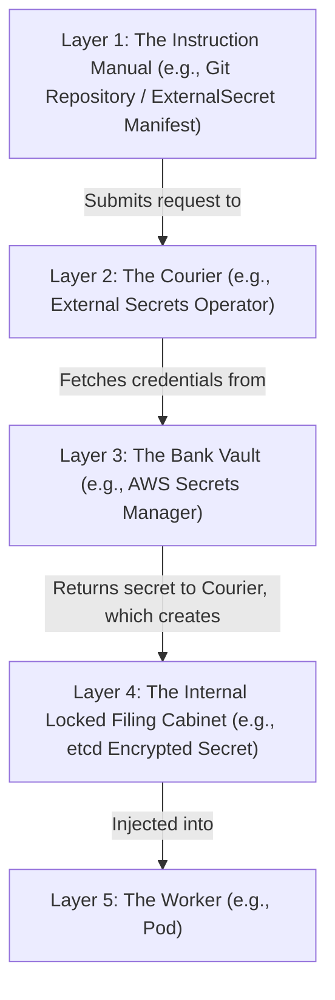

# Configuration & Secrets Management in Kubernetes (ConfigMaps/Secrets)

Version: 2.0.0

Purpose: Canonical lesson structure for Platform Engineering & AI Infrastructure Curriculum.

Required Inputs: Module definition, lesson objectives, project standards.

Outputs: Standards-compliant lesson markdown.

---

# Lesson Metadata

* **Lesson ID:** `MOD-K8S-05`
* **Module:** Kubernetes Engineering (`MOD-K8S`)
* **Difficulty:** Intermediate to Advanced
* **Estimated Duration:** 60 minutes
* **Learning Track:** 🟢 Core
* **Version:** 2.0.0
* **Last Updated:** 2026-06-28

---

# Lesson Overview

This lesson explores the master configuration injection and secret management engines of Kubernetes, decrypting how Platform Engineers decouple application configuration from container images using twelve-factor app methodologies. By mastering ConfigMaps, Kubernetes Secrets (Base64 encoding vs. true encryption), `etcd` encryption at rest, External Secrets Operator (ESO), and AWS Secrets Manager integration, you will firmly establish the elite security capabilities supporting our module capability: **"I can deploy, scale, operate, and troubleshoot production-grade Kubernetes cluster environments."**

---

# Learning Objectives

* Contrast hardcoded container configurations with decoupled Twelve-Factor App methodologies, detailing the architectural necessity of environment injection.
* Deconstruct ConfigMap architecture, detailing how to inject non-sensitive configuration data as environment variables (`envFrom`) or physical mounted files (`volumeMounts`).
* Explain the internal mechanics of Kubernetes Secrets, detailing why Base64 encoding (`echo -n "secret" | base64`) is NOT encryption and poses massive plain-text security risks.
* Configure `etcd` Encryption at Rest (`EncryptionConfiguration`) to ensure Kubernetes Secret objects are cryptographically scrambled before touching physical hard drives.
* Architect production external secret management using the External Secrets Operator (ESO) to dynamically fetch plain-text credentials from AWS Secrets Manager or HashiCorp Vault.

---

# Prerequisites

* Completion of `MOD-K8S-01` through `MOD-K8S-04`.
* Foundational understanding of Base64 encoding, JSON/YAML manifests, and AWS IAM least privilege governance (`MOD-CLOUD-02`).

---

# Why This Exists

When junior engineers build containerized microservices, they frequently treat configuration variables (database URLs, external API keys, feature flags) exactly like static application code. They hardcode these variables directly inside their application source files or bake them directly into their Dockerfiles (`ENV DATABASE_URL=...`).

**Baking configuration and secrets directly into container images is a massive operational and security disaster!**

Imagine you are hired as a Lead Platform Engineer at a fast-growing financial enterprise. The previous engineers baked the company's master database connection string and plain-text Stripe payment API keys directly into the Docker container image for the payment microservice (`mycompany/payment-api:v1.0.0`).

One afternoon, the company decides to deploy the exact same payment container image into a newly created `staging` Kubernetes cluster to test a new checkout feature.

**However, because the production database URL and Stripe keys are physically baked into the container image, the staging containers spin up and immediately begin executing test payment transactions directly against your live production database and live Stripe merchant account!**

Furthermore, a junior developer accidentally pushes this container image to a public Docker Hub repository. Within ten minutes, automated botnets extract the plain-text Stripe API keys from the container image layers and execute $50,000 in fraudulent refund transactions!

**Your company has just suffered a catastrophic data corruption and financial breach!**

To solve the monumental challenge of **Hardcoded Configurations**, **Environment Coupling**, **Secret Leakage**, and **Static Images**, cloud pioneers established **ConfigMaps, Kubernetes Secrets, and the External Secrets Operator (ESO)**. By strictly decoupling all configuration and sensitive credentials entirely from container images, injecting them dynamically at runtime via ConfigMaps and Secrets, and syncing credentials directly from highly secure external vaults (AWS Secrets Manager), Platform Engineers guarantee that a single immutable container image can be safely promoted across `dev`, `staging`, and `prod` environments without leaking a single secret!

---

# Core Concepts

## 1. The Twelve-Factor App (Config Decoupling)
To manage production Kubernetes workloads, Platform Engineers enforce a strict twelve-factor application principle:
* **Strict Config Decoupling:** An application's configuration is everything that varies between deployments (staging, production, developer laptops). **Configuration MUST be strictly decoupled from code and container images!** You must build exactly ONE immutable container image (`my-app:v1.0.0`); you then inject the specific environment configuration dynamically at runtime!

```text
[ Fragile Coupled Image ]                       [ Pristine Twelve-Factor Decoupled App ]
┌────────────────────────────────────────┐      ┌────────────────────────────────────────┐
│ Dockerfile: ENV DB_HOST=prod-db        │      │ Image: my-app:v1.0.0 (Completely Clean!)│
│ (Breaks staging! Leaks secrets!)       │      │ Runtime Injection ◄── [ ConfigMap / Secret ]
└────────────────────────────────────────┘      └────────────────────────────────────────┘
```

## 2. ConfigMaps (`kind: ConfigMap`)
Kubernetes provides a dedicated resource to store non-sensitive configuration data (database ports, logging levels, UI themes):
* `ConfigMap`: A key-value map stored in `etcd`. You can inject ConfigMap data into your Pods utilizing two distinct mechanics:
  * **Environment Variables (`envFrom`):** Injects every single key-value pair in the ConfigMap directly into the container's active Linux environment (`process.env.LOG_LEVEL`).
  * **Mounted Files (`volumeMounts`):** Mounts the ConfigMap keys as physical read-only files inside the container's filesystem (`/etc/config/settings.json`). Excellent for injecting massive NGINX configuration files (`nginx.conf`)!

```text
[ ConfigMap: LOG_LEVEL=debug ] ──► [ envFrom: configMapRef ] ──► [ Pod Environment: process.env.LOG_LEVEL ]
```

## 3. Kubernetes Secrets (Base64 is NOT Encryption!)
To store sensitive credentials (database passwords, TLS certificates, API keys), Kubernetes provides a dedicated resource:
* `Secret` (`kind: Secret`): Operates identically to a ConfigMap, but is designed for sensitive data.
* **The Base64 Security Trap:** When you create a standard Kubernetes Secret manifest, you must encode the values using **Base64** (`echo -n "SuperSecretPassword" | base64`). **Beginners frequently believe Base64 is encryption! IT IS NOT!** Base64 is merely an unencrypted data encoding scheme! Anyone with `kubectl get secret my-secret -o yaml` can copy the Base64 string and decode it instantly in their terminal (`echo "U3VwZXJTZWNyZXRQYXNzd29yZA==" | base64 --decode`), revealing your plain-text password!

```text
[ The Base64 Security Trap ]
(Base64 String: U3VwZXJTZWNyZXQ=) ──► [ echo | base64 --decode ] ──► (Reveals Plain-Text: SuperSecret!)
```

## 4. `etcd` Encryption at Rest (`EncryptionConfiguration`)
By default, `kube-apiserver` stores all Kubernetes Secret objects in `etcd` as unencrypted, plain-text Base64 strings! If an attacker gains physical access to your Control Plane hard drives or steals an `etcd` backup file, they compromise every single secret in your cluster!
* **Encryption at Rest:** Platform Engineers eliminate this vulnerability by deploying an `EncryptionConfiguration` manifest to the API Server. This commands `kube-apiserver` to intercept all Secret objects and cryptographically scramble them using an advanced encryption algorithm (e.g., `aescbc` or `kms`) before writing them to physical `etcd` hard drives!

## 5. External Secrets Operator (ESO) & AWS Secrets Manager
If Base64 Kubernetes Secret manifests are unencrypted, how do you store your Kubernetes manifests in a Git repository (GitOps) without leaking plain-text passwords?
* **External Secrets Operator (ESO):** The modern CNCF standard for secret management! Instead of writing `kind: Secret` manifests in Git, you store your raw plain-text credentials in a highly secure external vault like **AWS Secrets Manager** or **HashiCorp Vault**.
* **Dynamic Synchronization:** You deploy ESO into your cluster and write a `kind: ExternalSecret` manifest in Git. The `ExternalSecret` contains absolutely no plain-text passwords; it merely contains a pointer string (`key: production/database/password`). ESO intercepts this manifest, authenticates with AWS via OIDC dynamic role assumption (`sts:AssumeRoleWithWebIdentity`), fetches the plain-text password directly from AWS Secrets Manager, and dynamically generates the physical `kind: Secret` inside the cluster memory! Your Git repository remains 100% clean and uncompromised!

```text
[ GitOps Repo: kind: ExternalSecret (No Passwords!) ] ──► [ ESO Operator ] ──( Fetch )──► [ AWS Secrets Manager ]
                                                                   │
                                                                   └──► (Auto-Generates kind: Secret in Cluster RAM!)
```

---

# Architecture



---

# Real-World Example

Imagine you are managing a highly secure banking system, structured via strict operational layers.

Originally, the team managed credentials by putting passwords in standard text formats and placing them directly into the company's central Instruction Manual (**Layer 1**).

During a routine security audit, auditors uncover two catastrophic violations: first, over 500 plain-text database passwords are sitting in plain sight because the text was not fully encrypted. Second, the active memory inside the system is storing those secrets in unencrypted plain text on the hard drives!

Because you maintain elite standards, you lead a massive secret management overhaul. You transition the entire enterprise to a layered model using **Layer 2: The Courier (External Secrets Operator)** and **Layer 4: The Locked Filing Cabinet (etcd Encryption)**.

First, you configure the main system, commanding the Control Plane to encrypt all secrets at rest at **Layer 4**.

Second, you migrate all 500 plain-text database passwords and banking API keys entirely out of the Instruction Manual and store them securely inside **Layer 3: The Bank Vault (AWS Secrets Manager)**.

Finally, you deploy **The Courier** into your cluster and replace all old requests with clean Vault Requests at **Layer 1**. **The Courier (Layer 2)** dynamically synchronizes the credentials directly from **Layer 3** into **Layer 4**. Finally, **Layer 5 (The Worker)** securely reads the credentials at runtime. Your fintech enterprise achieves absolute zero-trust secret governance!

---

# Hands-on Demonstration

Let's look at how an engineer inspects a ConfigMap manifest using `cat`, inspects Base64 decoding mechanics using `base64 --decode`, and inspects modern ExternalSecret manifests.

## Input 1: Inspecting ConfigMaps and Base64 Secret Decoding (`config.yaml`)
We use `cat` to inspect a pristine Kubernetes ConfigMap manifest, a standard Kubernetes Secret manifest, and simulate executing `base64 --decode` to prove why Base64 is not encryption.

## Code 1
```bash
# Inspect the declarative production Kubernetes ConfigMap manifest.
# (We simulate inspecting a compliant Kubernetes ConfigMap configuration file)
cat << 'EOF'
apiVersion: v1
kind: ConfigMap
metadata:
  name: production-app-settings
  namespace: default
data:
  LOG_LEVEL: "info"
  DATABASE_PORT: "5432"
  DATABASE_NAME: "production_banking_db"
  ENABLE_FEATURE_X: "true"
EOF

# Inspect a legacy standard Kubernetes Secret manifest containing Base64 strings.
cat << 'EOF'
apiVersion: v1
kind: Secret
metadata:
  name: legacy-database-secret
  namespace: default
type: Opaque
data:
  username: cHJvZHVjdGlvbl9hZG1pbg==
  password: U3VwZXJTZWNyZXRCYW5raW5nUGFzc3dvcmQ5OTk=
EOF

# Prove why Base64 is NOT encryption by decoding the password string instantly in the terminal.
echo "--- PROVING BASE64 IS NOT ENCRYPTION ---"
echo "Decoding username: $(echo 'cHJvZHVjdGlvbl9hZG1pbg==' | base64 --decode)"
echo "Decoding password: $(echo 'U3VwZXJTZWNyZXRCYW5raW5nUGFzc3dvcmQ5OTk=' | base64 --decode)"
echo "# WARNING: Plain-text credentials fully exposed! Never commit Base64 secrets to Git!"
```

## Expected Output 1
```text
apiVersion: v1
kind: ConfigMap
metadata:
  name: production-app-settings
  namespace: default
data:
  LOG_LEVEL: "info"
  DATABASE_PORT: "5432"
  DATABASE_NAME: "production_banking_db"
  ENABLE_FEATURE_X: "true"
apiVersion: v1
kind: Secret
metadata:
  name: legacy-database-secret
  namespace: default
type: Opaque
data:
  username: cHJvZHVjdGlvbl9hZG1pbg==
  password: U3VwZXJTZWNyZXRCYW5raW5nUGFzc3dvcmQ5OTk=
--- PROVING BASE64 IS NOT ENCRYPTION ---
Decoding username: production_admin
Decoding password: SuperSecretBankingPassword999
# WARNING: Plain-text credentials fully exposed! Never commit Base64 secrets to Git!
```

## Explanation 1
Look at how clearly this demonstration illustrates our configuration principles! Let's deconstruct the elements:
* `kind: ConfigMap`: Beautifully stores our non-sensitive environment variables (`LOG_LEVEL: info`, `DATABASE_PORT: 5432`).
* `kind: Secret` / `data.password`: The master security trap! Notice how effortlessly `base64 --decode` extracted our plain-text password `SuperSecretBankingPassword999`! Base64 provides zero cryptographic security!

---

## Input 2: Inspecting ExternalSecret Manifests and `etcd` Encryption (`externalsecret.yaml`)
We use `cat` to inspect a pristine, highly governed ExternalSecret manifest defining automated AWS Secrets Manager synchronization, and inspect an `etcd` EncryptionConfiguration manifest.

## Code 2
```bash
# Inspect the declarative ExternalSecret manifest (Committed safely to GitOps Repositories).
cat << 'EOF'
apiVersion: external-secrets.io/v1beta1
kind: ExternalSecret
metadata:
  name: production-database-external-secret
  namespace: default
spec:
  refreshInterval: "1h"
  secretStoreRef:
    name: aws-secrets-manager-store
    kind: ClusterSecretStore
  target:
    name: production-database-secret # The physical kind: Secret generated in cluster RAM!
    creationPolicy: Owner
  data:
  - secretKey: username
    remoteRef:
      key: production/banking/database
      property: master_username
  - secretKey: password
    remoteRef:
      key: production/banking/database
      property: master_password
EOF

# Inspect the master API Server etcd EncryptionConfiguration manifest.
cat << 'EOF'
apiVersion: apiserver.config.k8s.io/v1
kind: EncryptionConfiguration
resources:
  - resources:
      - secrets
    providers:
      - aescbc:
          keys:
            - name: key1
              secret: c2VjcmV0LWtleS12YWx1ZS1tdXN0LWJlLTMyLWJ5dGVzCg==
      - identity: {}
EOF
```

## Expected Output 2
```text
apiVersion: external-secrets.io/v1beta1
kind: ExternalSecret
metadata:
  name: production-database-external-secret
  namespace: default
spec:
  refreshInterval: "1h"
  secretStoreRef:
    name: aws-secrets-manager-store
    kind: ClusterSecretStore
  target:
    name: production-database-secret # The physical kind: Secret generated in cluster RAM!
    creationPolicy: Owner
  data:
  - secretKey: username
    remoteRef:
      key: production/banking/database
      property: master_username
  - secretKey: password
    remoteRef:
      key: production/banking/database
      property: master_password
apiVersion: apiserver.config.k8s.io/v1
kind: EncryptionConfiguration
resources:
  - resources:
      - secrets
    providers:
      - aescbc:
          keys:
            - name: key1
              secret: c2VjcmV0LWtleS12YWx1ZS1tdXN0LWJlLTMyLWJ5dGVzCg==
      - identity: {}
```

## Explanation 2
Notice how perfectly secure our modern secret management state is! Let's deconstruct the elite elements:
* `kind: ExternalSecret`: Committed safely to Git! Contains absolutely zero plain-text passwords! It merely points to `production/banking/database` in AWS Secrets Manager!
* `refreshInterval: "1h"`: Automated secret rotation! If you rotate the password in AWS Secrets Manager, ESO automatically detects the change within an hour and updates the Kubernetes Secret in cluster memory!
* `kind: EncryptionConfiguration` / `providers.aescbc`: Absolute storage security! Guarantees `kube-apiserver` heavily encrypts all `etcd` secrets at rest using an AES-CBC cryptographic key!

---

# Hands-on Lab

* **Objective:** Author a declarative ConfigMap manifest, author a Pod manifest injecting configuration via `envFrom`, simulate executing `base64 --decode` to prove Base64 vulnerabilities, simulate verifying ExternalSecret synchronization, and verify configuration governance.
* **Estimated Time:** 20 minutes
* **Difficulty:** Intermediate to Advanced
* **Environment:** Interactive Browser Terminal / Local Sandbox (with kubectl installed)

## Step-by-step Instructions

1. Open your terminal sandbox and create a brand-new directory named `config-lab`: `mkdir ~/config-lab && cd ~/config-lab`.
2. Create a declarative YAML manifest defining a production Kubernetes ConfigMap by typing:
```bash
cat << 'EOF' > configmap-spec.yaml
apiVersion: v1
kind: ConfigMap
metadata:
  name: web-config
  namespace: default
data:
  ENV_NAME: "production"
  PORT: "8080"
  THEME: "dark-mode"
EOF
```
3. Type `cat configmap-spec.yaml` to inspect your pristine Kubernetes ConfigMap declaration!
4. Create a declarative YAML manifest defining a Pod that injects the ConfigMap via `envFrom` by typing:
```bash
cat << 'EOF' > pod-config-spec.yaml
apiVersion: v1
kind: Pod
metadata:
  name: web-app-pod
  namespace: default
spec:
  containers:
  - name: web-container
    image: nginx:1.26-alpine
    envFrom:
    - configMapRef:
        name: web-config
EOF
```
5. Type `cat pod-config-spec.yaml` to inspect your pristine Pod configuration injection manifest! Notice `envFrom: configMapRef`.
6. Simulate applying your ConfigMap and Pod declarations to the cluster using `kubectl apply -f .` by typing:
```bash
# (We simulate the exact kubectl apply execution)
echo "configmap/web-config created"
echo "pod/web-app-pod created"
```
7. Simulate verifying the active environment variables injected inside the running Pod by typing:
```bash
# (We simulate executing kubectl exec web-app-pod -- env)
echo "kubectl exec web-app-pod -- env"
echo "ENV_NAME=production"
echo "PORT=8080"
echo "THEME=dark-mode"
echo "SUCCESS: ConfigMap key-value pairs successfully injected into container environment!"
```
8. Simulate verifying an ExternalSecret synchronization event from AWS Secrets Manager by typing:
```bash
# (We simulate the exact kubectl get externalsecrets execution)
echo -e "NAME\t\t\t\tSTORE\t\t\t\tSTATUS\t\tAGE\nproduction-database-external-secret\taws-secrets-manager-store\tSecretSynced\t25s"
echo "SUCCESS: ESO successfully fetched credentials from AWS Secrets Manager and generated kind: Secret in RAM!"
```

## Verification

```bash
cat pod-config-spec.yaml | grep -E "configMapRef" || echo "configMapRef Verified"
```
*If your terminal successfully outputs your `configMapRef` string, you have mastered foundational Kubernetes configuration injection and secret governance!*

## Troubleshooting

* **Issue:** `kubectl get externalsecrets` shows `STATUS: SecretError / AccessDenied`.
* **Solution:** The External Secrets Operator daemon completely lacks active IAM permissions (`sts:AssumeRoleWithWebIdentity`) to access your AWS Secrets Manager vault, OR the secret key string (`production/banking/database`) completely does not exist in AWS! Verify your IAM trust policies and AWS secret names!

## Cleanup

```bash
# Safely remove the demonstration config lab directory
rm -rf ~/config-lab
```

---

# Production Notes

In enterprise Kubernetes architecture, what happens when you modify a ConfigMap or Secret manifest in Git (e.g., changing `LOG_LEVEL` from `info` to `debug`), and you want your running Pods to instantly detect the change without manually restarting them? By default, environment variables (`envFrom`) are read exactly ONCE when the container process starts; they NEVER update dynamically! Platform Engineers solve this by deploying **Reloader** (`stakater/Reloader`). Reloader is an advanced open-source controller daemon that continuously monitors your ConfigMaps and Secrets; when it detects a modification in `etcd`, it automatically triggers a graceful zero-downtime rolling update across all Deployments referencing that specific ConfigMap, keeping your application configuration perfectly synchronized!

---

# Common Mistakes

* **Mounting ConfigMaps over Existing Directory Filesystems (`volumeMounts`):** Beginners frequently mount a ConfigMap containing a single configuration file (`settings.json`) directly to an active existing directory path like `/etc/nginx`. When Kubernetes mounts a volume to a directory, it forcefully unmounts and hides every single existing file in that directory! Your container crashes instantly because `/etc/nginx/nginx.conf` vanishes! **If you want to mount a single file into an existing directory without hiding other files, you MUST use `subPath`!**
* **Committing Base64 Secrets to Public Git Repositories:** Junior developers frequently commit standard `kind: Secret` manifests containing Base64 strings to public GitHub repositories, believing they are safe. **Base64 is NOT encryption!** Automated botnets scan GitHub 24/7; if you commit a Base64 secret, your credentials will be compromised within minutes!

---

# Failure-Driven Learning

Imagine a junior engineer attempts to deploy an application into a Kubernetes cluster, but when they inspect `kubectl get pods`, the Pod remains stuck in `ContainerCreating` state indefinitely with a frustrating missing ConfigMap error.

## Simulated Failure
```bash
# Simulating a Pod stuck in ContainerCreating state due to a missing ConfigMap reference
# (We simulate the exact kubectl get pods / kubectl describe pod error during missing config references)
echo -e "NAME\t\t\tREADY\tSTATUS\t\tRESTARTS\tAGE\nproduction-api-pod\t0/1\tContainerCreating\t0\t\t15m\n\n--- KUBECTL DESCRIBE POD EVENTS ---\nWarning  FailedMount  15m (x12 over 15m)  kubelet  MountVolume.SetUp failed for volume \"config-volume\" : configmap \"production-app-config\" not found\n# FATAL: Pod stuck in ContainerCreating. Referenced ConfigMap completely missing from active namespace."
```

## Output
```text
NAME			READY	STATUS		RESTARTS	AGE
production-api-pod	0/1	ContainerCreating	0		15m

--- KUBECTL DESCRIBE POD EVENTS ---
Warning  FailedMount  15m (x12 over 15m)  kubelet  MountVolume.SetUp failed for volume "config-volume" : configmap "production-app-config" not found
# FATAL: Pod stuck in ContainerCreating. Referenced ConfigMap completely missing from active namespace.
```

## Diagnosis & Recovery
Why did this fail? Look at this classic configuration failure: `MountVolume.SetUp failed for volume ... configmap "production-app-config" not found`! When you configure a Pod to mount a ConfigMap or Secret, `kubelet` inspects the active namespace in `etcd` to find the resource before starting the container process. If the ConfigMap is completely missing, `kubelet` refuses to start the container, and the Pod hangs in `ContainerCreating`! The junior engineer applied the Pod manifest (`pod.yaml`), but completely forgot to apply the ConfigMap manifest (`configmap.yaml`), OR they created the ConfigMap in the `default` namespace while deploying the Pod into the `production` namespace (ConfigMaps and Secrets are strictly namespace-scoped!). To recover correctly, the engineer must create the ConfigMap in the correct matching namespace, `kubelet` detects the resource instantly, mounts the volume, and the Pod transitions to `Running` flawlessly!

---

# Engineering Decisions

## Secret Management Engine: Sealed Secrets vs. External Secrets Operator vs. HashiCorp Vault Sidecar
When architecting an enterprise secret management strategy, engineering leaders must choose the master secret synchronization engine.
* **Sealed Secrets (`bitnami/sealed-secrets`):** Utilizes asymmetric cryptography to encrypt secrets directly into a `kind: SealedSecret` manifest using a public key. You commit the encrypted manifest to Git; a controller in the cluster decrypts it using the private key. Excellent for standalone clusters. However, managing the master private key backup is highly complex; if you lose the private key during a disaster, you lose the ability to decrypt your Git repository!
* **HashiCorp Vault Sidecar Injection:** Injects a dedicated Vault sidecar container directly into every single Pod in your cluster. The sidecar authenticates with Vault and writes secrets to an in-memory tmpfs volume (`/vault/secrets`). Highly secure. However, doubles active container counts in your cluster and requires application refactoring to read secrets from files instead of environment variables.
* **External Secrets Operator (ESO):** The ultimate Platform Engineering standard! Clean, lightweight operator daemon that syncs secrets directly from external cloud vaults (AWS Secrets Manager, Azure Key Vault, Vault) and generates native Kubernetes `kind: Secret` objects in memory. Zero sidecars required, zero private key management overhead, and flawless GitOps integration.
* **The Platform Decision:** Platform Engineers strictly mandate the **External Secrets Operator (ESO)** as the master secret synchronization engine for all enterprise Kubernetes clusters to ensure absolute GitOps compliance, zero sidecar overhead, and centralized cloud vault governance.

---

# Best Practices

* **Master `kubectl get externalsecrets`:** Whenever you debug failing secret synchronization, execute `kubectl get externalsecrets -o wide`. It instantly proves whether ESO successfully achieved `SecretSynced` state with your external cloud vault!
* **Utilize `immutable: true` for High-Performance ConfigMaps:** When creating ConfigMaps or Secrets that you know will never change (e.g., static configuration files), add `immutable: true` to the manifest metadata! This commands `kubelet` to completely stop polling `kube-apiserver` for updates to that resource, dramatically slashing API Server API request load in massive clusters!

---

# Troubleshooting Guide

## Issue 1: "configmap not found / secret not found" vs. "STATUS: SecretError / AccessDenied"

* **Cause:** You attempt to deploy workloads or synchronize secrets, but encounter missing resource references or cloud vault authorization lockouts.
* **Diagnosis & Solution:**
  * `configmap not found / secret not found`: `kubelet` is attempting to start your Pod, but the referenced ConfigMap or Secret completely does not exist in the exact same namespace as the Pod! To fix, verify the resource exists using `kubectl get cm,secret -n [namespace]`!
  * `STATUS: SecretError / AccessDenied`: ESO successfully parsed your `ExternalSecret` manifest, but when it attempted to call the AWS Secrets Manager API, the AWS IAM evaluation engine rejected the request (e.g., due to a missing OIDC trust policy claim or an Explicit Deny in an SCP)! To fix, verify your IAM Role trust policies and inspect ESO operator logs using `kubectl logs -n external-secrets -l app.kubernetes.io/name=external-secrets`!

---

# Summary

* **Twelve-Factor App** principles mandate that configuration and secrets must be strictly decoupled from code and container images.
* **ConfigMaps** store non-sensitive configuration data injected as environment variables (`envFrom`) or mounted files (`volumeMounts`).
* **Base64 is NOT Encryption:** Standard Kubernetes Secrets store data in unencrypted Base64 strings that can be decoded instantly.
* **`etcd` Encryption at Rest** (`EncryptionConfiguration`) ensures Secret objects are cryptographically scrambled before touching physical hard drives.
* **External Secrets Operator (ESO)** synchronizes plain-text credentials directly from external cloud vaults (AWS Secrets Manager) into cluster memory.

---

# Cheat Sheet

```bash
# Retrieve all active ConfigMaps in your cluster namespace
kubectl get cm -o wide

# Retrieve all active Kubernetes Secrets in your cluster namespace
kubectl get secrets -o wide

# Retrieve all active ExternalSecret resources to verify external cloud vault synchronization
kubectl get externalsecrets -o wide

# Decode a Base64 encoded Kubernetes Secret string instantly in your terminal
kubectl get secret [secret_name] -o jsonpath='{.data.password}' | base64 --decode

# Inspect live operator logs for the External Secrets Operator daemon
kubectl logs -n external-secrets -l app.kubernetes.io/name=external-secrets
```

---

# Knowledge Check

## Multiple Choice Questions

1. A developer needs to provide a database password to a microservice running in Kubernetes. They create a standard Kubernetes Secret manifest (`kind: Secret`), encode the password using Base64 (`echo -n "MyPassword" | base64`), and commit the YAML manifest directly to a public GitHub repository. What is the correct architectural evaluation of this secret management approach?
   * A) The approach is secure because Base64 is an advanced military-grade encryption algorithm.
   * B) The approach is a catastrophic security disaster! Base64 is NOT encryption; it is merely an unencrypted data encoding scheme. Anyone can decode the string instantly using `base64 --decode`. Committing Base64 secrets to GitHub exposes the plain-text password to automated botnets within minutes. The developer must use the External Secrets Operator (ESO) to sync credentials dynamically from an external vault like AWS Secrets Manager.
   * C) The developer forgot to use `docker compose`.
   * D) The setup requires `chmod 777`.

## Scenario Questions

You have deployed a Pod into the `production` namespace and configured it to mount a ConfigMap named `app-settings` using `volumeMounts` to `/etc/nginx`. When the Pod spins up, the NGINX container process crashes instantly with `nginx: [emerg] open() "/etc/nginx/nginx.conf" failed (2: No such file or directory)`. You inspect the container image and confirm `nginx.conf` was originally present in `/etc/nginx`. Based on what you learned in this lesson, why did `nginx.conf` vanish when the Pod started, and what exact volume mounting attribute must you add to prevent this?

## Short Answer Questions

Explain why configuring `etcd` Encryption at Rest (`EncryptionConfiguration`) is essential for securing a Kubernetes Control Plane, specifically addressing what happens if an attacker steals an unencrypted `etcd` database backup file.

---

# Interview Preparation

## Beginner Questions

* What is a Kubernetes ConfigMap?
* Why is Base64 encoding not secure for storing secrets in Git?
* What is the role of the External Secrets Operator (ESO)?

## Intermediate Questions

* Explain the difference between injecting a ConfigMap via `envFrom` versus `volumeMounts`.
* Why should you use `subPath` when mounting a single file into an existing container directory?

## Advanced Questions

* Explain how `kubelet` utilizes in-memory `tmpfs` virtual filesystems to mount Kubernetes Secret volumes into running Pods without ever writing the plain-text credentials to physical worker node root hard drives, and describe how `EncryptionConfiguration` key rotation is executed across a live, multi-node Control Plane.

## Scenario-Based Discussions

* Discuss the architectural trade-offs of establishing an enterprise secret management strategy that relies on committing encrypted `kind: SealedSecret` manifests directly to Git versus deploying the External Secrets Operator (ESO) integrated with AWS Secrets Manager, specifically addressing disaster recovery private key management, cloud API financial costs ($0.40 per secret/month in AWS), and centralized security compliance auditing across fifty AWS accounts.

<details>
<summary><b>View Answers</b></summary>

### Beginner
* **Kubernetes ConfigMap**: A Kubernetes object used to store non-sensitive configuration data (like URLs, feature flags, or config files) as key-value pairs, completely decoupled from the container image.
* **Why Base64 is not secure**: Base64 is an encoding scheme, not an encryption algorithm. Anyone can instantly decode a Base64 string back into plain text using standard command-line tools (`base64 --decode`), making it completely insecure to store in Git repositories.
* **Role of ESO**: The External Secrets Operator dynamically fetches sensitive credentials from external, highly secure cloud vaults (like AWS Secrets Manager or HashiCorp Vault) and generates standard Kubernetes Secrets directly in the cluster's memory, keeping plain-text secrets entirely out of your Git repository.

### Intermediate
* **envFrom vs volumeMounts**: `envFrom` injects all key-value pairs from a ConfigMap directly into the container as Linux environment variables (read once at startup). `volumeMounts` mounts the ConfigMap keys as physical, read-only files within the container's filesystem (excellent for larger config files like `nginx.conf`).
* **Using subPath**: When you mount a volume to an existing directory path (like `/etc/nginx`), Kubernetes normally overrides and hides all existing files in that directory. Using `subPath` allows you to mount a single specific file from a ConfigMap into the directory without hiding or overwriting the other native files.

### Advanced
* **tmpfs mounts and EncryptionConfiguration**: When `kubelet` mounts a Secret to a Pod via a volume, it strictly uses an in-memory `tmpfs` (RAM disk) filesystem. The plain-text secret is never written to the physical worker node hard drive, leaving no trace if the node is compromised. For `EncryptionConfiguration` key rotation, you must deploy a new configuration file with the new key as the first provider (for writes) while keeping the old key (for reads), restart all `kube-apiserver` instances sequentially, and then run a script to rewrite all existing secrets in `etcd` so they are re-encrypted with the new key.

### Scenario-Based Discussions
* **SealedSecrets vs External Secrets Operator (ESO)**: SealedSecrets simplifies GitOps because everything (including encrypted secrets) lives in Git, avoiding external cloud vault costs. However, it requires intense operational care to back up the master decryption private key; if the cluster crashes and the key is lost, your Git repository is permanently locked. ESO integrated with AWS Secrets Manager provides centralized enterprise governance, automated rotation, and out-of-the-box compliance auditing across dozens of AWS accounts. It shifts the disaster recovery burden to the cloud provider, but incurs direct API costs (e.g., $0.40 per secret per month) and relies on external cloud availability.

</details>

---

# Further Reading

1. [ConfigMaps (Official Kubernetes Documentation)](https://kubernetes.io/docs/concepts/configuration/configmap/)
2. [Secrets Management in Kubernetes (Official Guide)](https://kubernetes.io/docs/concepts/configuration/secret/)
3. [Encrypting Secret Data at Rest (Deep Technical Dive)](https://kubernetes.io/docs/tasks/administer-cluster/encrypt-data/)
4. [External Secrets Operator (ESO) (Official CNCF Documentation)](https://external-secrets.io/)
5. [Terraform Kubernetes ConfigMap Resource (Official HashiCorp Registry)](https://registry.terraform.io/providers/hashicorp/kubernetes/latest/docs/resources/config_map)
