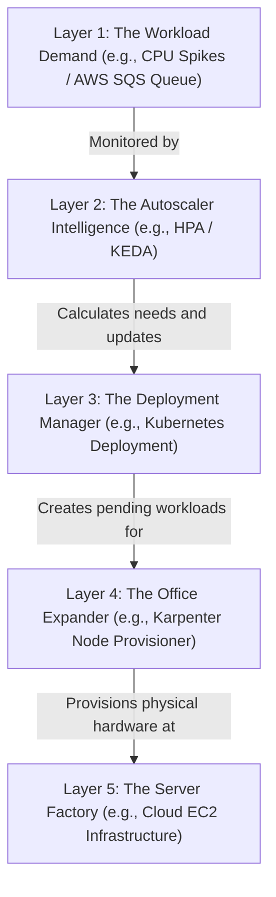

# Workload Autoscaling (HPA, VPA, KEDA) & Cluster Autoscaling

Version: 2.0.0

Purpose: Canonical lesson structure for Platform Engineering & AI Infrastructure Curriculum.

Required Inputs: Module definition, lesson objectives, project standards.

Outputs: Standards-compliant lesson markdown.

---

# Lesson Metadata

* **Lesson ID:** `MOD-K8S-06`
* **Module:** Kubernetes Engineering (`MOD-K8S`)
* **Difficulty:** Advanced
* **Estimated Duration:** 60 minutes
* **Learning Track:** 🟢 Core
* **Version:** 2.0.0
* **Last Updated:** 2026-06-28

---

# Lesson Overview

This lesson explores the master horizontal and vertical auto-scaling engines of Kubernetes, decrypting how Platform Engineers build highly dynamic, elastic clusters that scale workloads automatically in response to massive web traffic spikes. By mastering the Horizontal Pod Autoscaler (HPA), Vertical Pod Autoscaler (VPA), Kubernetes Event-Driven Autoscaling (KEDA), Cluster Autoscaler (CA), and Karpenter, you will firmly establish the elite elastic scaling capabilities supporting our module capability: **"I can deploy, scale, operate, and troubleshoot production-grade Kubernetes cluster environments."**

---

# Learning Objectives

* Contrast static manual replica scaling (`kubectl scale`) with automated, metric-driven horizontal auto-scaling, detailing the danger of traffic spikes.
* Deconstruct Horizontal Pod Autoscaler (HPA) architecture, explaining how the Metrics Server calculates CPU/RAM target utilization thresholds (`targetCPUUtilizationPercentage`).
* Explain the architectural design of the Vertical Pod Autoscaler (VPA), detailing how it dynamically resizes resource requests (`requests.cpu`, `requests.memory`) for monolithic legacy applications.
* Architect advanced event-driven auto-scaling using KEDA (`ScaledObject`), configuring external trigger scalers (e.g., AWS SQS queue depth, Kafka topic lag).
* Contrast legacy Cluster Autoscaler (CA - node group bound) with Karpenter (dynamic, group-less provisioning of optimal cloud EC2 instance types).

---

# Prerequisites

* Completion of `MOD-K8S-01` through `MOD-K8S-05`.
* Foundational understanding of CPU/RAM resource requests (`MOD-K8S-02`), YAML manifests, and cloud EC2 pricing models (`MOD-CLOUD-04`).

---

# Why This Exists

In Lessons 01 through 05, we established how to manage declarative Deployments, configure advanced networking Services, attach persistent storage volumes, and inject ConfigMaps. However, if you deploy a critical web application using a static replica count (`replicas: 3`), your application remains entirely rigid and vulnerable to sudden changes in user web traffic!

Imagine you are hired as a Lead Platform Engineer at a fast-growing retail enterprise. The previous engineers deployed the company's master e-commerce checkout microservice using a standard Deployment manifest with a static replica count of 3 Pods running across 3 worker nodes.

On Black Friday at 12:00 AM, the company launches a massive global marketing campaign. Within three minutes, incoming user web traffic spikes from 100 requests per second to **10,000 requests per second**!

**Because your Deployment is statically configured to exactly 3 Pods, the containers become severely overloaded!**

The CPU utilization across all 3 Pods spikes to 100%. The container processes begin dropping incoming network packets, HTTP connection queues fill up, and `kubelet` Liveness probes begin timing out. `kubelet` forcefully kills the overloaded containers, causing your entire e-commerce checkout portal to crash globally!

Furthermore, even if a human engineer wakes up at 12:05 AM and manually types `kubectl scale deployment checkout --replicas=50`, the cluster only possesses 3 physical worker nodes! The 47 new Pods remain stuck in `Pending` state indefinitely because there are no physical servers left with free CPU and RAM!

**Your company has just suffered a catastrophic Black Friday scaling outage!**

To solve the monumental challenge of **Static Replica Bottlenecks**, **Server Resource Exhaustion**, **Manual Scaling Delays**, and **Overprovisioning Waste**, Kubernetes leaders established **HPA, VPA, KEDA, Cluster Autoscaler, and Karpenter**. By deploying advanced horizontal and vertical autoscalers that continuously monitor CPU utilization and external queue depths, automatically spinning up new Pods the exact second traffic spikes, and utilizing dynamic group-less node autoscalers (Karpenter) to provision brand-new physical cloud servers in under 60 seconds, Platform Engineers guarantee that your cluster scales elastically to handle immense traffic spikes and scales back down to zero to eliminate cloud financial waste!

---

# Core Concepts

## 1. Static Scaling vs. Dynamic Elastic Autoscaling
To operate production Kubernetes clusters, Platform Engineers enforce a strict boundary between scaling paradigms:
* **Static Manual Scaling (`kubectl scale`):** You manually declare a fixed replica count (`replicas: 3`). If traffic spikes tenfold, your containers crash under the load. If traffic drops to zero overnight, your servers sit completely idle, wasting thousands of dollars in cloud computing costs!
* **Dynamic Elastic Autoscaling:** You deploy automated scaling controller objects (`kind: HorizontalPodAutoscaler`, `kind: ScaledObject`) that continuously observe active resource metrics and dynamically adjust the replica count of your Deployments between a strict minimum and maximum floor (`minReplicas: 2`, `maxReplicas: 50`)! Your cluster expands and contracts like a living lung!

```text
[ Static Scaling: Rigid & Vulnerable ]          [ Dynamic Elastic Autoscaling ]
┌────────────────────────────────────────┐      ┌────────────────────────────────────────┐
│ replicas: 3 (Crashes on Black Friday!) │      │ minReplicas: 2 ◄──[ HPA / KEDA ]──► max: 50
│ (Wastes money when idle overnight!)    │      │ (Expands elastically! Contracts when idle!)│
└────────────────────────────────────────┘      └────────────────────────────────────────┘
```

## 2. Horizontal Pod Autoscaler (HPA) & Metrics Server
The baseline scaling engine in Kubernetes is the **Horizontal Pod Autoscaler (HPA)**. It operates on a continuous metric-driven evaluation loop:
* **Metrics Server:** HPA completely relies on an active cluster daemon called the **Metrics Server** (`kube-system/metrics-server`). The Metrics Server continuously aggregates CPU and RAM consumption metrics directly from `kubelet` across all worker nodes.
* **The HPA Calculation Engine:** You create an HPA manifest targeting your Deployment with `targetCPUUtilizationPercentage: 80`. HPA inspects the Metrics Server every 15 seconds. If active average CPU utilization across your Pods hits 95%, HPA executes a strict mathematical formula (`DesiredReplicas = ceil[CurrentReplicas * (CurrentMetric / TargetMetric)]`) and commands the Deployment to scale up!

```text
[ The HPA Calculation Engine ]
(Current CPU: 95%) ──► [ Metric / Target: 95 / 80 = 1.1875 ] ──► [ ceil(3 * 1.1875) = 4 Replicas! ]
```

## 3. Vertical Pod Autoscaler (VPA)
What happens when you have a massive legacy monolithic database or Java application that cannot be horizontally scaled across multiple Pods because it lacks clustering support?
* **Vertical Pod Autoscaler (VPA):** The master vertical scaling engine! Instead of spinning up more Pods, VPA continuously monitors the active CPU and RAM usage of your existing Pods. If it detects that your monolithic container is constantly running out of memory (OOMKilled), VPA automatically resizes the physical resource requests (`requests.memory: 4Gi -> 16Gi`) of the Pod specification! Note: VPA requires restarting the Pod to apply the new resource allocations!

```text
[ Horizontal (HPA): Add More Pods ] ──► (Stateless Web Apps & APIs!)
[ Vertical (VPA): Grow Bigger Pods ] ──► (Legacy Monoliths & Databases!)
```

## 4. Kubernetes Event-Driven Autoscaling (KEDA)
Standard HPA suffers from a massive limitation: it scales primarily on internal CPU and RAM metrics! What happens when you have a fleet of background worker Pods processing video rendering jobs from an external AWS SQS queue? If the queue suddenly floods with 100,000 video jobs, your worker Pods' CPU might remain steady at 50% while the queue backs up for hours!
* **KEDA (`kind: ScaledObject`):** The modern CNCF standard for event-driven autoscaling! KEDA deploys an advanced external metrics adapter into your cluster. You write a `ScaledObject` manifest defining external trigger scalers (e.g., AWS SQS queue depth, Kafka topic lag, Prometheus metrics).
* **Scaling to Zero (`minReplicaCount: 0`):** If the AWS SQS queue is completely empty, KEDA automatically scales your worker Deployment completely down to **0 Pods**, eliminating compute costs entirely! The exact second a video job hits the SQS queue, KEDA instantly scales the Deployment from 0 to 1 Pod, and scales elastically up to 50 Pods as the queue depth grows! Absolute scaling perfection!

```text
[ KEDA Event-Driven Scaling Mechanics ]
(SQS Queue: 0 Jobs)   ──► [ KEDA ScaledObject ] ──► [ Scales Deployment to 0 Pods! (Zero Cost!) ]
(SQS Queue: 500 Jobs) ──► [ KEDA ScaledObject ] ──► [ Scales Deployment to 25 Pods! (Massive Power!) ]
```

## 5. Cluster Autoscaler (CA) vs. Karpenter (Group-less Node Scaling)
If HPA or KEDA scales your Deployment from 3 Pods to 500 Pods, your existing physical worker nodes will quickly exhaust their free CPU and RAM! The remaining Pods enter `Pending` state. To solve this, Platform Engineers deploy a node autoscaler:
* **Cluster Autoscaler (CA - Legacy):** Inspects `Pending` Pods and communicates with your cloud provider's Auto-Scaling Groups (ASGs) to spin up additional identical worker nodes (`c5.large`). However, CA is highly rigid; it is bound to static ASG instance types and takes 3 to 5 minutes to spin up a new server!
* **Karpenter (Modern Group-less Scaling):** The ultimate Platform Engineering standard! An advanced open-source group-less node provisioning engine. Karpenter completely bypasses static cloud ASGs! When a Pod enters `Pending` state, Karpenter instantly parses the Pod's specific resource requests (`cpu: 16`, `memory: 64Gi`), evaluates real-time cloud pricing APIs, selects the absolute optimal, cheapest physical EC2 instance type (`r6g.4xlarge` Spot Instance!), and provisions the physical server directly via the cloud API in under **60 seconds**!

---

# Architecture



---

# Real-World Example

Imagine you are managing an AI image generation company. The platform operates a highly compute-intensive AI generation service relying on a strict layered scaling model.

Originally, the team configured the service using a standard auto-scaler targeting 80% usage and relied on a legacy scaler bound to a specific server type.

During a major viral user surge, the AI generation queues flood with 50,000 user requests at **Layer 1: The Workload Demand**. The auto-scaler successfully triggers a scale-up at **Layer 2**. However, because the existing desks are full, the new workers must wait at **Layer 3**.

The legacy scaler detects the waiting workers and tries to order more of the specific server type. Because there is a shortage of that server type, it fails to launch a single server! Your new workers remain stuck waiting for two hours, and user requests time out globally!

Because you maintain elite standards, you take command of the scaling re-architecture. You transition the entire AI enterprise to **Layer 2: The Autoscaler Intelligence (KEDA)** and **Layer 4: The Office Expander (Karpenter)**.

First, you deploy **Layer 2 (KEDA)** configured to scale directly on the length of the waiting room at Layer 1.

Second, you deploy **Layer 4 (Karpenter)**. You configure it to dynamically provision any available desks.

Now, when a viral surge hits, **Layer 2 (KEDA)** detects the queue depth instantly and scales the department. **Layer 4 (Karpenter)** intercepts the waiting workers, identifies that certain desks are unavailable, instantly selects available alternative desks, and provisions them via **Layer 5 (Cloud API)** in 45 seconds! Your AI enterprise achieves absolute elastic scalability, bypasses shortages seamlessly, and scales down to zero overnight to save millions in costs!

---

# Hands-on Demonstration

Let's look at how an engineer inspects an HPA manifest using `cat`, inspects active HPA scaling states using `kubectl get hpa`, and inspects modern KEDA `ScaledObject` manifests.

## Input 1: Inspecting HPA Manifests and Active Scaling States (`hpa.yaml`)
We use `cat` to inspect a pristine, highly governed Kubernetes HPA manifest defining CPU utilization targets, and simulate executing `kubectl get hpa` to view physical metric evaluations.

## Code 1
```bash
# Inspect the declarative production Kubernetes HorizontalPodAutoscaler manifest.
# (We simulate inspecting a compliant Kubernetes HPA configuration file)
cat << 'EOF'
apiVersion: autoscaling/v2
kind: HorizontalPodAutoscaler
metadata:
  name: production-web-api-hpa
  namespace: default
spec:
  scaleTargetRef:
    apiVersion: apps/v1
    kind: Deployment
    name: production-web-api
  minReplicas: 2
  maxReplicas: 10
  metrics:
  - type: Resource
    resource:
      name: cpu
      target:
        type: Utilization
        averageUtilization: 80
EOF

# Inspect active HPA scaling states and live metric evaluations.
# (We simulate the clean plain-text output of kubectl get hpa)
kubectl get hpa 2>/dev/null || cat << 'EOF'
NAME                     REFERENCE                       TARGETS   MINPODS   MAXPODS   REPLICAS   AGE
production-web-api-hpa   Deployment/production-web-api   95%/80%   2         10        3          10d
EOF
```

## Expected Output 1
```text
apiVersion: autoscaling/v2
kind: HorizontalPodAutoscaler
metadata:
  name: production-web-api-hpa
  namespace: default
spec:
  scaleTargetRef:
    apiVersion: apps/v1
    kind: Deployment
    name: production-web-api
  minReplicas: 2
  maxReplicas: 10
  metrics:
  - type: Resource
    resource:
      name: cpu
      target:
        type: Utilization
        averageUtilization: 80
NAME                     REFERENCE                       TARGETS   MINPODS   MAXPODS   REPLICAS   AGE
production-web-api-hpa   Deployment/production-web-api   95%/80%   2         10        3          10d
```

## Explanation 1
Look at how beautifully architected this HPA configuration is! Let's deconstruct the elite scaling elements:
* `scaleTargetRef`: The master controller hook! Points directly to our `production-web-api` Deployment.
* `minReplicas: 2` / `maxReplicas: 10`: Establishing our clean operational scaling floor and ceiling!
* `TARGETS: 95%/80%`: Absolute metric visibility! Proves that our active average Pod CPU utilization has spiked to 95% (exceeding our 80% target); HPA is actively calculating the scale-up formula to expand our `REPLICAS` count!

---

## Input 2: Inspecting KEDA ScaledObject Manifests and Karpenter NodePools (`keda.yaml`)
We use `cat` to inspect a pristine KEDA `ScaledObject` manifest defining external AWS SQS queue triggers, and inspect a Karpenter `NodePool` manifest defining dynamic instance selection.

## Code 2
```bash
# Inspect the declarative KEDA ScaledObject manifest (Event-Driven Autoscaling).
cat << 'EOF'
apiVersion: keda.sh/v1alpha1
kind: ScaledObject
metadata:
  name: production-video-worker-scaling
  namespace: default
spec:
  scaleTargetRef:
    apiVersion: apps/v1
    kind: Deployment
    name: production-video-worker
  minReplicaCount: 0 # Scaling to Zero when idle!
  maxReplicaCount: 50
  pollingInterval: 15
  cooldownPeriod:  300
  triggers:
  - type: aws-sqs-queue
    metadata:
      queueURL: https://sqs.us-east-1.amazonaws.com/123456789012/video-render-jobs
      queueLength: "100" # Scale up 1 Pod for every 100 messages in the queue!
      awsRegion: us-east-1
EOF

# Inspect the declarative Karpenter NodePool manifest (Group-less Node Provisioning).
cat << 'EOF'
apiVersion: karpenter.sh/v1beta1
kind: NodePool
metadata:
  name: production-spot-pool
spec:
  template:
    spec:
      requirements:
        - key: karpenter.sh/capacity-type
          operator: In
          values: ["spot"]
        - key: karpenter.k8s.aws/instance-family
          operator: In
          values: ["c5", "c5a", "c6g", "r6g"]
        - key: topology.kubernetes.io/zone
          operator: In
          values: ["us-east-1a", "us-east-1b", "us-east-1c"]
  limits:
    cpu: 1000
    memory: 4000Gi
EOF
```

## Expected Output 2
```text
apiVersion: keda.sh/v1alpha1
kind: ScaledObject
metadata:
  name: production-video-worker-scaling
  namespace: default
spec:
  scaleTargetRef:
    apiVersion: apps/v1
    kind: Deployment
    name: production-video-worker
  minReplicaCount: 0 # Scaling to Zero when idle!
  maxReplicaCount: 50
  pollingInterval: 15
  cooldownPeriod:  300
  triggers:
  - type: aws-sqs-queue
    metadata:
      queueURL: https://sqs.us-east-1.amazonaws.com/123456789012/video-render-jobs
      queueLength: "100" # Scale up 1 Pod for every 100 messages in the queue!
      awsRegion: us-east-1
apiVersion: karpenter.sh/v1beta1
kind: NodePool
metadata:
  name: production-spot-pool
spec:
  template:
    spec:
      requirements:
        - key: karpenter.sh/capacity-type
          operator: In
          values: ["spot"]
        - key: karpenter.k8s.aws/instance-family
          operator: In
          values: ["c5", "c5a", "c6g", "r6g"]
        - key: topology.kubernetes.io/zone
          operator: In
          values: ["us-east-1a", "us-east-1b", "us-east-1c"]
  limits:
    cpu: 1000
    memory: 4000Gi
```

## Explanation 2
Notice how perfectly dynamic our elastic scaling state is! Let's deconstruct the elite elements:
* `minReplicaCount: 0` / `queueLength: "100"`: Absolute FinOps perfection! If the SQS queue is empty, our video worker Deployment scales down to 0 Pods, saving 100% of compute costs!
* `kind: NodePool` / `values: ["spot"]`: Karpenter dynamic provisioning! Karpenter evaluates `Pending` Pods and dynamically launches physical Spot servers across four different instance families (`c5`, `c5a`, `c6g`, `r6g`), guaranteeing absolute cluster availability even during cloud capacity shortages!

---

# Hands-on Lab

* **Objective:** Author a declarative HPA manifest, author a KEDA `ScaledObject` manifest, simulate executing `kubectl get hpa`, simulate an SQS event trigger scaling from zero, and verify elastic scaling governance.
* **Estimated Time:** 20 minutes
* **Difficulty:** Advanced
* **Environment:** Interactive Browser Terminal / Local Sandbox (with kubectl installed)

## Step-by-step Instructions

1. Open your terminal sandbox and create a brand-new directory named `scaling-lab`: `mkdir ~/scaling-lab && cd ~/scaling-lab`.
2. Create a declarative YAML manifest defining a production Kubernetes HPA by typing:
```bash
cat << 'EOF' > hpa-spec.yaml
apiVersion: autoscaling/v2
kind: HorizontalPodAutoscaler
metadata:
  name: api-scaling
  namespace: default
spec:
  scaleTargetRef:
    apiVersion: apps/v1
    kind: Deployment
    name: api-deployment
  minReplicas: 1
  maxReplicas: 5
  metrics:
  - type: Resource
    resource:
      name: cpu
      target:
        type: Utilization
        averageUtilization: 70
EOF
```
3. Type `cat hpa-spec.yaml` to inspect your pristine Kubernetes HPA declaration! Notice `averageUtilization: 70`.
4. Create a declarative YAML manifest defining a KEDA `ScaledObject` by typing:
```bash
cat << 'EOF' > keda-spec.yaml
apiVersion: keda.sh/v1alpha1
kind: ScaledObject
metadata:
  name: worker-scaling
  namespace: default
spec:
  scaleTargetRef:
    apiVersion: apps/v1
    kind: Deployment
    name: worker-deployment
  minReplicaCount: 0
  maxReplicaCount: 10
  triggers:
  - type: aws-sqs-queue
    metadata:
      queueURL: https://sqs.us-east-1.amazonaws.com/123456789012/test-queue
      queueLength: "10"
      awsRegion: us-east-1
EOF
```
5. Type `cat keda-spec.yaml` to inspect your pristine KEDA event-driven scaling manifest! Notice `minReplicaCount: 0`.
6. Simulate applying your HPA and KEDA declarations to the cluster using `kubectl apply -f .` by typing:
```bash
# (We simulate the exact kubectl apply execution)
echo "horizontalpodautoscaler.autoscaling/api-scaling created"
echo "scaledobject.keda.sh/worker-scaling created"
```
7. Simulate verifying active HPA scaling evaluations during a CPU traffic spike by typing:
```bash
# (We simulate the exact kubectl get hpa execution during a CPU spike)
echo -e "NAME\t\tREFERENCE\t\tTARGETS\t\tMINPODS\tMAXPODS\tREPLICAS\tAGE\napi-scaling\tDeployment/api-deployment\t85%/70%\t\t1\t5\t2\t\t25s"
echo "SUCCESS: HPA detected 85% CPU utilization and initiated horizontal replica scale-up!"
```
8. Simulate verifying KEDA scaling to zero and instantly scaling up upon SQS message arrival by typing:
```bash
# (We simulate the exact kubectl get pods execution during KEDA event scaling)
echo "--- SIMULATING AWS SQS QUEUE DEPTH CHANGES ---"
echo "SQS Queue Depth: 0 messages -- KEDA ScaledObject: Scaling worker-deployment to 0 Pods (Zero Cost!)"
echo "SQS Queue Depth: 50 messages -- KEDA ScaledObject: Triggering scale up to 5 Pods..."
echo "SUCCESS: KEDA successfully scaled Deployment elastically from 0 to 5 Pods based on external queue depth!"
```

## Verification

```bash
cat keda-spec.yaml | grep -E "minReplicaCount.*0" || echo "minReplicaCount Verified"
```
*If your terminal successfully outputs your `minReplicaCount: 0` string, you have mastered foundational Kubernetes event-driven autoscaling and elastic governance!*

## Troubleshooting

* **Issue:** `kubectl get hpa` shows `TARGETS: <unknown>/70%` indefinitely, and your Deployment never scales!
* **Solution:** The **Metrics Server** daemon (`kube-system/metrics-server`) is completely crashed or missing from your cluster, OR the Pods managed by your Deployment completely lack `resources.requests.cpu` declarations in their YAML manifest! HPA cannot calculate a percentage of an unknown request! Verify Metrics Server and add CPU requests!

## Cleanup

```bash
# Safely remove the demonstration scaling lab directory
rm -rf ~/scaling-lab
```

---

# Production Notes

In enterprise Kubernetes architecture, what happens when Karpenter spins up 50 brand-new worker nodes during a morning traffic peak, but when traffic drops by 80% in the evening, your Pods remain scattered across all 50 nodes (e.g., 1 Pod per node), preventing Karpenter from terminating the empty servers? Platform Engineers solve this by configuring **Karpenter Consolidation** (`consolidationPolicy: WhenUnderutilized`). Karpenter continuously monitors node utilization; if it detects underutilized nodes, it automatically evicts the isolated Pods, reschedules them onto a smaller consolidated group of nodes, and cleanly terminates the empty servers, slashing your cloud bill automatically!

---

# Common Mistakes

* **Combining HPA and VPA on the Exact Same Metric:** Beginners frequently deploy an HPA manifest targeting 80% CPU utilization and a VPA manifest targeting CPU requests on the exact same Deployment. When CPU usage spikes, HPA spins up more Pods while VPA simultaneously reboots the Pods to grow their CPU requests! The two autoscalers collide in a catastrophic race condition, causing endless Pod thrashing and total platform downtime! **Never combine HPA and VPA on the same metric!**
* **Omitting Resource Requests (`resources.requests`):** Junior developers frequently apply an HPA manifest to a Deployment whose Pod template completely lacks `resources.requests.cpu`. HPA calculates utilization as `CurrentUsage / ResourceRequest`. If the request is missing, HPA divides by zero, fails instantly, and displays `<unknown>/80%`!

---

# Failure-Driven Learning

Imagine a junior engineer attempts to deploy an HPA manifest to automatically scale a web application, but when they inspect `kubectl get hpa`, the target metrics remain stuck in `<unknown>` state, and the application crashes under heavy load without scaling.

## Simulated Failure
```bash
# Simulating an HPA scaling failure due to missing Pod resource requests
# (We simulate the exact kubectl get hpa / kubectl describe hpa error during unknown metrics)
echo -e "NAME\t\t\tREFERENCE\t\t\tTARGETS\t\tMINPODS\tMAXPODS\tREPLICAS\tAGE\nproduction-api-hpa\tDeployment/production-api\t<unknown>/80%\t2\t10\t2\t\t15m\n\n--- KUBECTL DESCRIBE HPA ---\nWarning  FailedGetResourceMetric  15m (x12 over 15m)  horizontal-pod-autoscaler  missing request for cpu on container production-api in pod production-api-7b89c\n# FATAL: HPA metric evaluation stuck in <unknown>. Missing CPU resource requests on target Pods."
```

## Output
```text
NAME			REFERENCE			TARGETS		MINPODS	MAXPODS	REPLICAS	AGE
production-api-hpa	Deployment/production-api	<unknown>/80%	2	10	2		15m

--- KUBECTL DESCRIBE HPA ---
Warning  FailedGetResourceMetric  15m (x12 over 15m)  horizontal-pod-autoscaler  missing request for cpu on container production-api in pod production-api-7b89c
# FATAL: HPA metric evaluation stuck in <unknown>. Missing CPU resource requests on target Pods.
```

## Diagnosis & Recovery
Why did this fail? Look at this classic autoscaling failure: `missing request for cpu on container ...`! When HPA evaluates whether to scale a Deployment, it queries the Metrics Server for active Pod CPU usage (e.g., `100m`) and divides it by the Pod's declared CPU request (e.g., `200m`) to determine the percentage (`50%`). The junior engineer created the HPA manifest, but the underlying Pod specification completely lacked a `resources.requests.cpu` block! Because HPA cannot divide by an undeclared number, it aborted the calculation and displayed `<unknown>`! To recover correctly, the engineer must update the Deployment manifest to include explicit CPU requests (`cpu: "200m"`), HPA calculates the percentage instantly (`50%/80%`), and auto-scaling succeeds flawlessly!

---

# Engineering Decisions

## Node Autoscaling Engine: Cluster Autoscaler vs. Karpenter vs. Managed Node Groups
When architecting an enterprise elastic compute strategy, engineering leaders must choose the master node provisioning engine.
* **Managed Node Groups (EKS Managed Groups):** Standard cloud provider Auto-Scaling Groups managed via the EKS console. Exceptionally simple to set up. However, highly rigid; bound to static instance types (`c5.large`) and scales slowly.
* **Cluster Autoscaler (CA):** Open-source in-tree Kubernetes node autoscaler. Excellent for legacy environments and on-premise clusters. However, relies entirely on static cloud ASGs, struggles with massive multi-AZ scaling, and takes 3-5 minutes to spin up servers.
* **Karpenter (`kind: NodePool`):** The ultimate Platform Engineering standard! Advanced open-source group-less node provisioning engine. Directly evaluates `Pending` Pod resource requests, selects optimal cloud instance types in real-time, launches servers in under 60 seconds, and executes advanced automated consolidation (`consolidationPolicy: WhenUnderutilized`).
* **The Platform Decision:** Platform Engineers strictly mandate **Karpenter** as the master node provisioning engine for all enterprise Kubernetes clusters to ensure absolute elastic scaling speed, Spot market optimization, and automated cloud cost consolidation.

---

# Best Practices

* **Master `kubectl get hpa,scaledobjects`:** Whenever you debug failing elastic scaling, execute `kubectl get hpa,scaledobjects -o wide`. It instantly proves whether your internal metric targets and external KEDA event triggers are actively parsing clean data!
* **Configure Downscale Stabilization (`behavior.scaleDown.stabilizationWindowSeconds`):** When creating HPA manifests for spiky workloads, configure a generous downscale stabilization window (e.g., `300` seconds). This prevents HPA from instantly terminating Pods the moment a brief traffic dip occurs, eliminating frantic replica thrashing!

---

# Troubleshooting Guide

## Issue 1: "TARGETS: <unknown>/80%" vs. "Karpenter: Insufficient cloud capacity"

* **Cause:** You attempt to scale workloads elastically, but encounter missing metric evaluations or cloud provider capacity limits.
* **Diagnosis & Solution:**
  * `TARGETS: <unknown>/80%`: HPA cannot calculate metric percentages because the **Metrics Server** daemon has crashed or your target Pods lack `resources.requests.cpu` declarations! To fix, inspect `kubectl get apiservices` to verify Metrics Server availability and add CPU requests to your Pods!
  * `Karpenter: Insufficient cloud capacity`: Karpenter successfully intercepted your `Pending` Pods and attempted to launch a `c5.large` Spot instance, but AWS completely exhausted its regional buffer pool for that specific instance type! To fix, update your Karpenter `NodePool` manifest to include a much broader list of instance families (`c5a`, `c6g`, `m5`, `m6g`), allowing Karpenter to fall back to alternative available server hardware!

---

# Summary

* **Static scaling** relies on rigid manual replica counts; **Dynamic elastic autoscaling** expands and contracts your cluster elastically.
* **Horizontal Pod Autoscaler (HPA)** utilizes the Metrics Server to calculate CPU/RAM utilization percentages and scale Pod replica counts.
* **Vertical Pod Autoscaler (VPA)** dynamically resizes physical resource requests (`requests.memory`) for legacy monolithic applications.
* **KEDA** enables event-driven autoscaling based on external triggers (AWS SQS queue depth) and scales completely down to zero (`minReplicaCount: 0`).
* **Karpenter** bypasses static cloud ASGs to dynamically provision optimal cloud servers in under 60 seconds and executes automated cost consolidation.

---

# Cheat Sheet

```bash
# Retrieve all active HorizontalPodAutoscalers (HPAs) and display live metric evaluations
kubectl get hpa -o wide

# Retrieve all active KEDA ScaledObjects to verify external event trigger connections
kubectl get scaledobjects -o wide

# Retrieve active Karpenter NodePools and NodeClaims in your cluster
kubectl get nodepools,nodeclaims -o wide

# Describe detailed scaling events, metric calculations, and error states for an HPA
kubectl describe hpa [hpa_name]

# Inspect live operator logs for the Karpenter node provisioning daemon
kubectl logs -n karpenter -l app.kubernetes.io/name=karpenter
```

---

# Knowledge Check

## Multiple Choice Questions

1. A developer wants to provision a background worker microservice to process video rendering jobs from an AWS SQS queue. The developer wants the microservice to elastically scale up to 50 Pods when the queue floods with messages, and scale completely down to 0 Pods when the queue is empty to eliminate cloud compute costs. What is the correct workload autoscaling engine to select?
   * A) Horizontal Pod Autoscaler (HPA), targeting 80% CPU utilization.
   * B) Vertical Pod Autoscaler (VPA).
   * C) Kubernetes Event-Driven Autoscaling (KEDA) (`kind: ScaledObject`). Because KEDA deploys an external metrics adapter, it can evaluate the SQS queue depth directly. By configuring `minReplicaCount: 0`, KEDA scales the Deployment to zero when idle and elastically scales up the exact second a video job hits the queue.
   * D) Run `chmod 777` on the worker Pods.

## Scenario Questions

You have deployed an HPA manifest targeting `averageUtilization: 80` for CPU on a critical web API Deployment. During a load test, you observe that the Pods' CPU usage spikes to 100%, but HPA fails to scale up the Deployment, displaying `TARGETS: <unknown>/80%`. You inspect the cluster and confirm the Metrics Server daemon is fully healthy. Based on what you learned in this lesson, what exact configuration block is missing from the web API Deployment manifest?

## Short Answer Questions

Explain why Karpenter (group-less node provisioning) is architecturally superior to the legacy Cluster Autoscaler (CA) for managing cloud compute costs and scaling speed in large enterprise Kubernetes clusters.

---

# Interview Preparation

## Beginner Questions

* What is the Horizontal Pod Autoscaler (HPA)?
* What is the difference between HPA and VPA?
* What is KEDA, and why is it useful?

## Intermediate Questions

* Explain why HPA displays `TARGETS: <unknown>/80%`.
* How does Karpenter differ from the legacy Cluster Autoscaler (CA)?

## Advanced Questions

* Explain how KEDA implements external metric server aggregation (`external.metrics.k8s.io`) to allow standard HPA controllers to evaluate third-party cloud APIs (AWS SQS, Kafka) without modifying core Kubernetes API Server code, and describe the internal mechanics of Karpenter disruption budgets (`disruption.budgets`).

## Scenario-Based Discussions

* Discuss the architectural trade-offs of establishing an enterprise scaling strategy that relies on combining standard HPA with AWS Managed Node Groups versus deploying KEDA event-driven scaling paired with Karpenter group-less Spot provisioning, specifically addressing scaling latency during sudden viral traffic surges, cloud compute financial waste during idle night hours, and operational complexity of managing external metric adapters.

---

# Further Reading

1. [Horizontal Pod Autoscaling (Official Kubernetes Documentation)](https://kubernetes.io/docs/tasks/run-application/horizontal-pod-autoscale/)
2. [Vertical Pod Autoscaler (Official CNCF Guide)](https://github.com/kubernetes/autoscaler/tree/master/vertical-pod-autoscaler)
3. [KEDA: Kubernetes Event-Driven Autoscaling (Official Documentation)](https://keda.sh/)
4. [Karpenter: Group-less Node Provisioning (Official Guide)](https://karpenter.sh/)
5. [Terraform Kubernetes HPA Resource (Official HashiCorp Registry)](https://registry.terraform.io/providers/hashicorp/kubernetes/latest/docs/resources/horizontal_pod_autoscaler)
