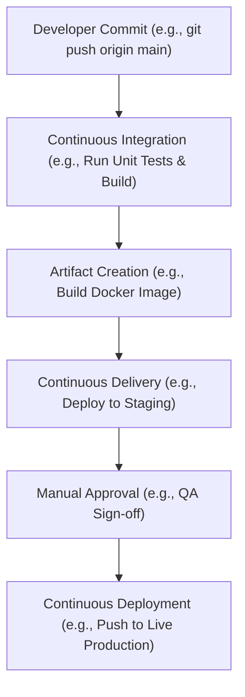

# MOD-CICD-01: Continuous Integration vs. Continuous Delivery Paradigms

# Lesson Overview

This lesson breaks down the foundational concepts of Continuous Integration (CI) and Continuous Delivery/Deployment (CD). We will explore how modern software engineering teams transition from manual, error-prone release processes to highly automated, reliable pipelines that deliver value to users rapidly and safely.

---

# Learning Objectives

* Differentiate between Continuous Integration, Continuous Delivery, and Continuous Deployment.
* Explain the historical context of manual releases and why CI/CD was invented.
* Design a theoretical CI/CD pipeline showing the flow of code from commit to production.
* Articulate the business value of CI/CD, including reduced deployment risk and faster time-to-market.
* Understand the role of automated testing and artifact generation in CI pipelines.

---

# Prerequisites

* Basic understanding of version control systems (Git).
* Familiarity with the software development lifecycle (SDLC).
* Conceptual understanding of application building and packaging.

---

# Why This Exists

Historically, software releases were massive, infrequent events. Development teams would write code for months, package it, and hand it over to operations teams (the "throw it over the wall" anti-pattern). Operations would manually deploy the software during stressful weekend maintenance windows, often resulting in downtime, unpredictable bugs, and high friction between teams. 

CI/CD was invented to solve this exact problem. By automating the integration and deployment processes, teams could release smaller batches of code more frequently. This reduced the blast radius of changes, allowed for immediate feedback, and fundamentally shifted the culture from fearful, massive releases to routine, mundane deployments.

---

# Core Concepts

## Continuous Integration (CI)

Continuous Integration is the practice of merging all developer working copies to a shared mainline (e.g., the `main` branch) several times a day. The key is that every merge triggers an automated build and test sequence. 
* **Goal:** Detect integration errors as quickly as possible.
* **Mechanism:** Automated unit tests, linting, static code analysis, and compilation.

## Continuous Delivery (CD)

Continuous Delivery is an extension of CI. It ensures that the software can be released reliably at any time. It automates the release process up to the staging or pre-production environment, producing a deployable artifact. 
* **Goal:** Make deployments predictable and routine.
* **Mechanism:** Automated packaging, artifact storage (e.g., Docker images), and deployment to staging environments. Requires a manual approval step to push to production.

## Continuous Deployment (CD)

Continuous Deployment takes Delivery one step further by automatically deploying every change that passes all stages of the production pipeline directly to end users, with no manual intervention.
* **Goal:** Maximize velocity and minimize time-to-market.
* **Mechanism:** Robust automated end-to-end testing, progressive delivery (e.g., canary releases), and automated rollbacks.

---

# Architecture



---

# Real-World Example

**Netflix** is famous for its highly evolved CI/CD pipelines. They utilize a system called Spinnaker to manage deployments across thousands of instances. When a Netflix engineer commits code, the CI pipeline automatically runs thousands of tests, builds a machine image (or container), and the CD pipeline deploys it to a subset of users (canary release). If the metrics (like error rates or latency) remain stable, the deployment automatically rolls out to the rest of the fleet. If not, it automatically rolls back, often before the engineer even notices.

---

# Hands-on Demonstration

*This is a conceptual demonstration of a CI/CD flow using a pseudo-pipeline YAML configuration.*

**Input (Developer Commit):**
A developer commits a small change to a Python web application fixing a typo on the homepage.

**Pipeline Definition (`.gitlab-ci.yml` or similar):**
```yaml
stages:
  - test
  - build
  - deploy_staging

unit_tests:
  stage: test
  script:
    - pip install -r requirements.txt
    - pytest ./tests

build_image:
  stage: build
  script:
    - docker build -t myapp:latest .
    - docker push myregistry.com/myapp:latest

deploy_to_staging:
  stage: deploy_staging
  script:
    - kubectl apply -f k8s/staging/deployment.yaml
```

**Expected Output:**
The pipeline UI will show green checkmarks next to `unit_tests`, `build_image`, and `deploy_to_staging`. 

**Explanation:**
The system automatically caught the commit, validated the code through `pytest`, packaged the code into a Docker image, and deployed that exact image to the staging Kubernetes cluster.

---

# Hands-on Lab

* **Objective:** Create a basic local CI script to understand test and build automation.
* **Estimated Time:** 15 minutes
* **Difficulty:** Beginner
* **Environment:** Local terminal with Bash and Python installed.

## Step-by-step Instructions

1. **Create a simple application and test file:**
   Create a file `app.py`:
   ```python
   def add(a, b): return a + b
   ```
   Create a test file `test_app.py`:
   ```python
   from app import add
   def test_add(): assert add(2, 3) == 5
   ```

2. **Create a simple bash-based CI script (`ci.sh`):**
   ```bash
   #!/bin/bash
   set -e # Exit on failure

   echo "Starting CI Pipeline..."
   
   echo "Step 1: Running Linter..."
   # Assuming flake8 is installed (pip install flake8)
   flake8 app.py test_app.py
   
   echo "Step 2: Running Tests..."
   # Assuming pytest is installed (pip install pytest)
   pytest test_app.py
   
   echo "Step 3: Building Artifact..."
   tar -czf app-artifact.tar.gz app.py
   
   echo "CI Pipeline Completed Successfully!"
   ```

3. **Run the pipeline:**
   ```bash
   chmod +x ci.sh
   ./ci.sh
   ```

## Verification

If successful, the terminal will output the success messages, and you will see a new file `app-artifact.tar.gz` in your directory.

## Troubleshooting

* `flake8: command not found` -> Run `pip install flake8`.
* `pytest: command not found` -> Run `pip install pytest`.

## Cleanup

```bash
rm app.py test_app.py ci.sh app-artifact.tar.gz
```

---

# Production Notes

* **Idempotency:** Pipelines should be idempotent. Running the same deployment twice should result in the same system state without errors.
* **Immutable Artifacts:** Build your artifact (e.g., a Docker image) exactly once during CI. Promote that *exact same* artifact through Dev, Staging, and Production. Never rebuild the code for different environments.
* **Configuration Externalization:** Environment-specific configurations (like database passwords) should be injected at runtime (via environment variables or secrets management), not baked into the artifact.

---

# Common Mistakes

* **Building multiple times:** Recompiling code for staging, then recompiling again for production. This introduces the risk that the production build differs from what was tested in staging.
* **Long-running feature branches:** Keeping a branch open for weeks makes integration a nightmare. Practice frequent, small commits to the main branch (Trunk-Based Development).
* **Flaky tests:** Tests that fail randomly erode trust in the CI pipeline, leading developers to ignore red builds.

---

# Failure-Driven Learning

**Scenario:** You change `app.py` to `def add(a, b): return a - b`.

**Execution:** Run `./ci.sh` again.

**Diagnosis:** The pipeline fails at "Step 2: Running Tests..." because `pytest` caught the logic error.

**Learning:** The CI pipeline acted as a safety net, preventing broken code from advancing to the build or deploy stages.

---

# Engineering Decisions

**Continuous Delivery vs. Continuous Deployment:**
Choosing between CD (Delivery) and CD (Deployment) is a major business and engineering decision.
* **Delivery** is safer for highly regulated industries (finance, healthcare) or on-premise software where you need explicit approval or specific release windows.
* **Deployment** requires an immense investment in automated testing (unit, integration, e2e) and observability. If you cannot automatically detect a failure in production within seconds, you should not use Continuous Deployment.

---

# Best Practices

* **Fail Fast:** Put the fastest tests (linting, unit tests) at the beginning of the pipeline so developers get immediate feedback if they broke something simple.
* **Shift Left Security:** Integrate security scanning (SAST/DAST/Container scanning) early in the CI pipeline, not as an afterthought before deployment.
* **Keep the Build Fast:** A slow CI pipeline kills developer productivity. Aim for pipeline times under 10 minutes.

---

# Troubleshooting Guide

## Issue 1: Pipeline is consistently taking 45 minutes to run.

* **Cause:** Inefficient build processes, running unnecessary extensive integration tests on every commit, or lacking build caching.
* **Diagnosis:** Review the pipeline execution logs to find the bottleneck stage.
* **Solution:** Implement caching for dependencies (e.g., `node_modules` or `.m2`), parallelize test suites, and move heavy, long-running end-to-end tests to a nightly build rather than per-commit.

---

# Summary

CI/CD transforms software delivery from a manual, high-stress event into an automated, routine process. Continuous Integration ensures code is constantly tested and merged, Continuous Delivery ensures an artifact is always ready to deploy, and Continuous Deployment automates the final push to end users. Mastering these paradigms is the foundational step for any Platform Engineer.

---

# Cheat Sheet

* **CI:** Continuous Integration (Build + Test on Merge)
* **CD (Delivery):** Continuous Delivery (Automated deployment to Staging, manual to Prod)
* **CD (Deployment):** Continuous Deployment (Fully automated to Prod)
* **Artifact:** The packaged, deployable unit of software (e.g., `.jar`, Docker Image).
* **Trunk-Based Development:** Merging code to the main branch multiple times a day.

---

# Knowledge Check

## Multiple Choice Questions

1. What is the primary purpose of Continuous Integration?
   * A) To automatically deploy code to production.
   * B) To detect integration errors as quickly as possible by automating builds and tests.
   * C) To provision cloud infrastructure using Terraform.
   * D) To replace QA teams entirely.

2. Which practice guarantees that the exact same code tested in staging is deployed to production?
   * A) Rebuilding the code in the production environment.
   * B) Using Immutable Artifacts.
   * C) Writing documentation.
   * D) Using a monolithic architecture.

## Scenario Questions

Your team is building software for a medical device that requires sign-off from a compliance officer before any code goes live. Which paradigm should you adopt?

## Short Answer Questions

What is the difference between Continuous Delivery and Continuous Deployment?

<details>
<summary><b>View Answers</b></summary>

### Multiple Choice
1. **B** - *CI focuses on immediate automated testing upon code merge to catch integration issues early.*
2. **B** - *Immutable Artifacts mean you build once (e.g., a Docker image) and promote that identical image through all environments.*

### Scenario
*Continuous Delivery. Because you require explicit manual approval (sign-off) before going to production, fully automated Continuous Deployment is not appropriate.*

### Short Answer
*Continuous Delivery automates the pipeline up to a pre-production environment but requires manual approval to deploy to production. Continuous Deployment fully automates the deployment to production without any manual intervention.*

</details>

---

# Interview Preparation

## Beginner Questions

* What are the main benefits of CI/CD over manual deployments?

## Intermediate Questions

* How do you handle database schema changes in a CI/CD pipeline?

## Advanced Questions

* Explain the concept of "Shift Left" in the context of CI/CD pipelines.

## Scenario-Based Discussions

* Your CI pipeline takes 2 hours to run, causing developers to avoid committing code. How would you architect a solution to reduce this time?

<details>
<summary><b>View Answers</b></summary>

### Beginner
* **Benefits of CI/CD:** *Reduced risk through smaller, more frequent deployments, faster feedback loops for developers, less manual toil, and faster time-to-market.*

### Intermediate
* **Database Schema Changes:** *Database migrations should be automated and version-controlled (using tools like Flyway or Liquibase). They are typically executed as a step in the CD pipeline just before or during the application deployment, ensuring the schema matches the application's expectations.*

### Advanced
* **Shift Left:** *"Shift Left" refers to moving critical checks—like security scanning, performance testing, and linting—earlier in the development lifecycle (to the "left" of the pipeline diagram). This catches critical issues during the CI phase rather than finding them right before deployment.*

### Scenario-Based Discussions
* **Slow CI Pipeline:** *I would first profile the pipeline to identify bottlenecks. Solutions include: caching dependencies, building only changed modules (incremental builds), parallelizing test execution, moving extensive integration tests to asynchronous nightly runs, and ensuring build runners have sufficient compute resources.*

</details>

---

# Further Reading

1. [Continuous Integration (Martin Fowler)](https://martinfowler.com/articles/continuousIntegration.html)
2. [Continuous Delivery: Reliable Software Releases through Build, Test, and Deployment Automation (Book by Jez Humble and David Farley)](https://continuousdelivery.com/)
3. [The DevOps Handbook (Book by Gene Kim et al.)](https://itrevolution.com/the-devops-handbook/)
