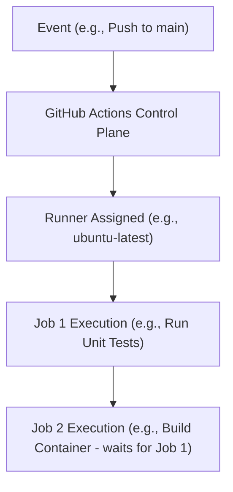

# MOD-CICD-02: Designing Declarative GitHub Actions Workflows & Runners

# Lesson Overview

This lesson dives into the mechanics of GitHub Actions, one of the most popular CI/CD platforms. You will learn how to write declarative YAML workflows, understand the event-driven architecture that triggers them, and manage the underlying compute environments (Runners) that execute your pipeline jobs.

---

# Learning Objectives

* Define and configure declarative GitHub Actions workflows using YAML.
* Differentiate between GitHub-hosted and self-hosted runners.
* Construct multi-job workflows with dependencies and environment variables.
* Utilize GitHub Secrets for secure credential management in pipelines.
* Implement custom actions to encapsulate and reuse pipeline logic.

---

# Prerequisites

* Basic understanding of CI/CD concepts (from MOD-CICD-01).
* Familiarity with YAML syntax.
* A GitHub account and basic Git workflow knowledge.

---

# Why This Exists

Before integrated platforms like GitHub Actions or GitLab CI, teams usually had to host and maintain their own separate CI servers (like Jenkins). This meant writing imperative Groovy scripts, managing plugins, updating Java versions, and dealing with a disconnected system (code lives in GitHub, builds happen in Jenkins). GitHub Actions brought the CI/CD pipeline directly into the code repository. By using declarative YAML, pipelines became version-controlled code, living right alongside the application, utilizing an event-driven model deeply integrated with pull requests, issues, and releases.

---

# Core Concepts

## Workflows, Jobs, and Steps
* **Workflow:** A configurable automated process that runs one or more jobs. Defined by a YAML file in the `.github/workflows/` directory.
* **Job:** A set of *steps* in a workflow that execute on the same runner (compute instance). Jobs run in parallel by default.
* **Step:** An individual task that can run commands (shell scripts) or an *action*.

## Actions
Actions are standalone, reusable units of code that perform complex, repetitive tasks (e.g., checking out code, setting up Node.js, authenticating to AWS). You can use community actions from the GitHub Marketplace or write your own.

## Runners
A Runner is the server that executes your workflows.
* **GitHub-hosted Runners:** VMs provided by GitHub (Ubuntu, Windows, macOS). Clean, ephemeral environments spun up per job.
* **Self-hosted Runners:** Your own VMs or Kubernetes pods that you register with GitHub. Used for accessing private networks, specialized hardware (GPUs), or saving on compute costs.

---

# Architecture



---

# Real-World Example

A Platform Engineering team at a fintech company uses GitHub Actions to enforce security and compliance. They mandate a reusable workflow across all 500 microservice repositories. When a developer creates a Pull Request, the workflow triggers a GitHub-hosted runner to execute unit tests. If tests pass, it triggers a self-hosted runner (residing inside their secure AWS VPC) to perform deep static analysis and container vulnerability scanning. The self-hosted runner is required because the scanning tool requires access to an internal database not exposed to the public internet.

---

# Hands-on Demonstration

*This demonstration shows a basic GitHub Actions workflow file.*

**Input (File Creation):**
Create `.github/workflows/ci.yml` in a repository:

```yaml
name: Python CI

on:
  push:
    branches: [ "main" ]
  pull_request:
    branches: [ "main" ]

jobs:
  build-and-test:
    runs-on: ubuntu-latest

    steps:
    - name: Check out repository
      uses: actions/checkout@v4

    - name: Set up Python
      uses: actions/setup-python@v5
      with:
        python-version: "3.10"

    - name: Install dependencies
      run: |
        python -m pip install --upgrade pip
        pip install pytest

    - name: Run tests
      run: |
        pytest
```

**Expected Output:**
When pushed to GitHub, navigating to the "Actions" tab will show a workflow named "Python CI" running. It will check out the code, install Python 3.10, install dependencies, and run `pytest`.

**Explanation:**
The `on` block defines the triggers. The `runs-on` tells GitHub to provision a fresh Ubuntu VM. The `uses` keyword invokes pre-built actions to handle standard setup tasks, while `run` executes standard shell commands.

---

# Hands-on Lab

* **Objective:** Create an artifact-generating workflow and pass data between jobs.
* **Estimated Time:** 20 minutes
* **Difficulty:** Intermediate
* **Environment:** A GitHub account and a new empty repository.

## Step-by-step Instructions

1. **Create a repository and workflow file:**
   Create `.github/workflows/artifact.yml`.

2. **Define the Workflow:**
   ```yaml
   name: Artifact Demo
   on: [workflow_dispatch] # Allows manual triggering
   
   jobs:
     create_file:
       runs-on: ubuntu-latest
       steps:
         - name: Generate Data
           run: echo "Hello Platform Engineers!" > message.txt
         
         - name: Upload Artifact
           uses: actions/upload-artifact@v4
           with:
             name: my-artifact
             path: message.txt
             
     read_file:
       needs: create_file # Makes this job wait for the previous one
       runs-on: ubuntu-latest
       steps:
         - name: Download Artifact
           uses: actions/download-artifact@v4
           with:
             name: my-artifact
             
         - name: Read Data
           run: cat message.txt
   ```

3. **Run the Workflow:**
   Go to the "Actions" tab in GitHub, select "Artifact Demo", and click "Run workflow".

## Verification

Click on the workflow run. You should see two jobs execute sequentially. The `read_file` job logs should display "Hello Platform Engineers!". Additionally, an artifact named "my-artifact" will be available for download at the bottom of the summary page.

## Troubleshooting

* **File not found in Job 2:** Ensure the `needs` keyword is present. Without it, both jobs run in parallel on different VMs, and `read_file` will try to download an artifact before it's uploaded.

## Cleanup

Delete the workflow file or the repository.

---

# Production Notes

* **Secrets Management:** Never hardcode API keys or passwords in YAML. Use GitHub Secrets (`${{ secrets.AWS_ACCESS_KEY }}`). For enterprise environments, integrate with external secret managers like HashiCorp Vault via OIDC.
* **OIDC Authentication:** Instead of storing long-lived cloud credentials in GitHub, use OpenID Connect (OIDC) to allow GitHub Actions to request short-lived, temporary access tokens from AWS/GCP/Azure.
* **Reusable Workflows:** Don't copy-paste the same YAML across 50 repos. Create a central repository for workflows and use the `workflow_call` trigger to allow other repositories to invoke your standardized pipelines.

---

# Common Mistakes

* **Assuming jobs share a filesystem:** Jobs run on separate VMs by default. If Job A creates a file, Job B cannot see it unless you explicitly upload it as an artifact in Job A and download it in Job B.
* **Using untrusted third-party actions:** Anyone can publish an Action. If you use `uses: random-user/cool-action@v1`, that action runs with access to your source code and secrets. Always audit third-party actions and pin them to a specific commit SHA (not just a tag) for high-security environments.

---

# Failure-Driven Learning

**Scenario:** You remove `needs: create_file` from the `read_file` job in the lab above.

**Execution:** Trigger the workflow manually.

**Diagnosis:** The workflow fails. The `read_file` job starts at the exact same time as `create_file`. The `actions/download-artifact` step fails with an error stating the artifact "my-artifact" could not be found.

**Learning:** Jobs execute concurrently by default to save time. Explicit dependency graphs (`needs`) are required for sequential execution.

---

# Engineering Decisions

**GitHub-Hosted vs. Self-Hosted Runners:**
* Use **GitHub-hosted** for maximum convenience, zero maintenance, and guaranteed clean environments.
* Use **Self-hosted** when you require specific hardware (e.g., massive RAM, GPUs for AI model building), need to interact with internal network resources without exposing them to the internet, or want to avoid GitHub's minute-based billing for extremely long/frequent builds (though you take on the cost and operational burden of managing the VMs).

---

# Best Practices

* **Pin Action Versions:** Use `@v2.1.0` or ideally a commit SHA rather than `@master` to prevent unexpected pipeline breakages when an action author updates their code.
* **Concurrency Control:** Use the `concurrency` key to cancel in-progress runs on a Pull Request if the developer pushes new commits, saving compute minutes.
* **Matrix Builds:** Use the `strategy: matrix` feature to test across multiple OS versions and language versions concurrently without writing redundant YAML.

---

# Troubleshooting Guide

## Issue 1: Pipeline fails with "Resource not accessible by integration" when pushing a git tag.

* **Cause:** The default `GITHUB_TOKEN` provided to the runner lacks the necessary permissions to write to the repository.
* **Diagnosis:** Check the workflow logs at the step attempting to push code or create a release.
* **Solution:** Explicitly declare permissions at the top of the workflow or job:
  ```yaml
  permissions:
    contents: write
  ```

---

# Summary

GitHub Actions provides a powerful, deeply integrated declarative approach to CI/CD. By understanding the event-driven triggers, job execution graphs, and the distinction between the control plane and the runners, Platform Engineers can build secure, scalable, and reusable automation for development teams.

---

# Cheat Sheet

* **Trigger on push:** `on: push`
* **Use a secret:** `${{ secrets.MY_SECRET }}`
* **Require previous job:** `needs: [job_name]`
* **Matrix Strategy:** `strategy: matrix: python-version: ["3.9", "3.10"]`
* **Checkout Code:** `uses: actions/checkout@v4`

---

# Knowledge Check

## Multiple Choice Questions

1. In GitHub Actions, how do you pass a file generated in Job A to Job B?
   * A) You don't need to do anything; jobs share the same filesystem.
   * B) Use the `upload-artifact` action in Job A and `download-artifact` in Job B.
   * C) Commit the file to the repository in Job A and pull it in Job B.
   * D) Pass the file contents via an environment variable.

2. Why might an enterprise choose to use Self-Hosted runners instead of GitHub-Hosted runners?
   * A) Because Self-Hosted runners are always faster.
   * B) Because GitHub-Hosted runners only support Windows.
   * C) To access private internal network resources without exposing them to the internet.
   * D) To avoid writing YAML.

## Scenario Questions

You are testing a Node.js application. You want to run the tests simultaneously on Node 16, 18, and 20, on both Ubuntu and Windows. What GitHub Actions feature should you use to avoid copying and pasting the job six times?

## Short Answer Questions

What is the purpose of the `needs` keyword in a workflow?

<details>
<summary><b>View Answers</b></summary>

### Multiple Choice
1. **B** - *Jobs run on separate VMs. Artifacts are the standard way to persist data between jobs in a workflow run.*
2. **C** - *Self-hosted runners can be deployed inside a private VPC, giving them access to internal databases, APIs, or specialized hardware like GPUs.*

### Scenario
*You should use a Matrix Build (`strategy: matrix`). You can define arrays for `os: [ubuntu-latest, windows-latest]` and `node: [16, 18, 20]`, and GitHub will automatically spawn 6 parallel jobs.*

### Short Answer
*The `needs` keyword defines dependencies between jobs. It ensures that a job will not start until the job(s) listed in its `needs` array have completed successfully, creating a sequential execution graph rather than the default parallel execution.*

</details>

---

# Interview Preparation

## Beginner Questions

* Explain the hierarchy of Workflow, Job, and Step in GitHub Actions.

## Intermediate Questions

* How do you prevent a workflow run on a Pull Request from continuing if the developer pushes new changes to that PR?

## Advanced Questions

* Explain the security implications of using third-party Actions and how to mitigate them.

## Scenario-Based Discussions

* Your team has 50 microservices, all using identical testing and deployment logic. How do you architect your GitHub Actions setup to avoid maintaining 50 separate YAML files?

<details>
<summary><b>View Answers</b></summary>

### Beginner
* **Hierarchy:** *A Workflow is the overarching automated process triggered by an event. It contains one or more Jobs, which run in parallel by default on separate runners. A Job contains one or more Steps, which execute sequentially on the same runner and can be shell commands or predefined Actions.*

### Intermediate
* **Canceling runs:** *Use the `concurrency` key in the workflow YAML. You can group concurrency by the PR branch name and set `cancel-in-progress: true`. This automatically kills older runs when new commits are pushed, saving compute resources.*

### Advanced
* **Third-Party Security:** *Third-party actions run with the permissions of your workflow. A malicious action could steal secrets or modify source code. Mitigation strategies include: strictly limiting the `GITHUB_TOKEN` permissions, using OpenID Connect (OIDC) instead of long-lived secrets, pinning actions to specific commit SHAs (as tags can be moved), and requiring organizational approval for new actions.*

### Scenario-Based Discussions
* **Scale and Reuse:** *I would utilize Reusable Workflows. I would create a central, separate repository to define the standard CI/CD logic. The 50 microservices would then have a very small workflow file that uses the `workflow_call` event to trigger the central workflow, passing in any necessary inputs (like the specific service name or deployment environment). This centralizes maintenance and enforces organizational standards.*

</details>

---

# Further Reading

1. [GitHub Actions Documentation](https://docs.github.com/en/actions)
2. [Security hardening for GitHub Actions](https://docs.github.com/en/actions/security-guides/security-hardening-for-github-actions)
3. [About OpenID Connect in GitHub Actions](https://docs.github.com/en/actions/deployment/security-hardening-your-deployments/about-security-hardening-with-openid-connect)
