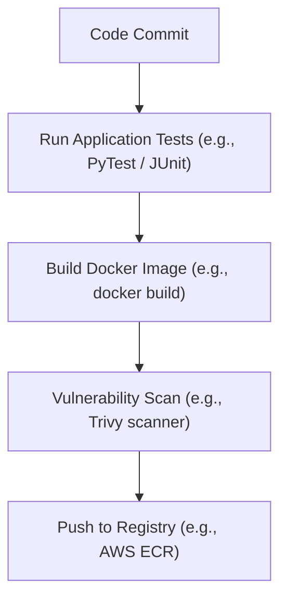

# MOD-CICD-03: Automated Container Build, Test, and Scan Pipelines

# Lesson Overview

This lesson focuses on the core payload of modern CI/CD: the container image. You will learn how to architect pipelines that not only build Docker images automatically upon code commit but also rigorously test the application code and scan the container layers for security vulnerabilities before pushing the final artifact to a registry.

---

# Learning Objectives

* Architect a multi-stage CI pipeline for containerized applications.
* Implement automated testing (unit and integration) prior to image construction.
* Integrate static vulnerability scanning (e.g., Trivy, Grype) into the build process.
* Configure secure, automated pushes to container registries (e.g., Docker Hub, AWS ECR).
* Apply caching strategies to optimize container build times in ephemeral CI environments.

---

# Prerequisites

* Understanding of Docker and containerization principles.
* Familiarity with GitHub Actions or a similar CI tool.
* Knowledge of basic CI/CD paradigms (from MOD-CICD-01).

---

# Why This Exists

In a microservices architecture, the deployable artifact is almost always a container image. Historically, developers might build an image locally and push it directly to a registry—a practice fraught with inconsistency (the "it works on my machine" problem) and security risks. By automating the build, test, and scan process within a CI pipeline, Platform Engineers ensure that every deployed container is built in a clean room, mathematically reproducible, verifiably tested, and audited for known vulnerabilities (CVEs) before it ever reaches a production cluster.

---

# Core Concepts

## The Pipeline Flow
A robust container pipeline typically follows a strict chronological order:
1. **Lint/Test:** Validate the raw source code.
2. **Build:** Construct the container image.
3. **Scan:** Analyze the image for OS and library vulnerabilities.
4. **Push:** Upload the validated image to a central registry.

## Container Vulnerability Scanning
Images are composed of layers, including an underlying OS (like Debian or Alpine) and application dependencies. Scanners analyze these layers against public CVE (Common Vulnerabilities and Exposures) databases. If critical vulnerabilities are found, the pipeline should fail, preventing the image from being pushed.

## Build Caching in CI
Because CI runners are ephemeral (they are destroyed after the job finishes), they do not retain the local Docker layer cache. Building a container from scratch on every commit is slow. CI pipelines must explicitly configure remote caching (saving and restoring layers to/from the registry or CI storage) to maintain developer velocity.

---

# Architecture



---

# Real-World Example

A healthcare startup processes sensitive patient data. Their compliance framework (HIPAA) mandates that no software with known "Critical" vulnerabilities can be deployed. Their Platform Team configures a GitLab CI pipeline that uses **Trivy** to scan every built Docker image. If Trivy detects a CVE with a "Critical" severity in the base image (e.g., a flaw in OpenSSL), Trivy exits with a non-zero status code, breaking the build. The developer must update the `Dockerfile` to use a patched base image before the pipeline will allow the image to be pushed to their private registry.

---

# Hands-on Demonstration

*This conceptual demonstration shows a GitHub Actions workflow that builds and scans a container.*

**Input (Workflow YAML):**
```yaml
name: Build and Scan
on: [push]

jobs:
  build-scan-push:
    runs-on: ubuntu-latest
    steps:
      - name: Checkout
        uses: actions/checkout@v4

      - name: Build an image from Dockerfile
        run: |
          docker build -t my-app:${{ github.sha }} .

      - name: Run Trivy vulnerability scanner
        uses: aquasecurity/trivy-action@master
        with:
          image-ref: 'my-app:${{ github.sha }}'
          format: 'table'
          exit-code: '1'
          ignore-unfixed: true
          vuln-type: 'os,library'
          severity: 'CRITICAL,HIGH'

      - name: Push to Registry (Mock)
        run: echo "Pushing my-app:${{ github.sha }} to registry..."
        # In reality, you would use docker login and docker push here
```

**Expected Output:**
The pipeline will check out the code, build the image, and then Trivy will output a table of vulnerabilities. Because `exit-code: '1'` is set for `CRITICAL,HIGH` severities, if any are found, the step fails, the pipeline halts, and the mock push is never executed.

---

# Hands-on Lab

* **Objective:** Run a container vulnerability scan locally to simulate CI behavior.
* **Estimated Time:** 15 minutes
* **Difficulty:** Beginner
* **Environment:** Local terminal with Docker installed.

## Step-by-step Instructions

1. **Install Trivy (Scanner):**
   * *Mac:* `brew install trivy`
   * *Linux:* (See Aqua Security docs for apt/yum)
   * *Docker Alternative:* If you don't want to install, you can run Trivy via Docker in step 3.

2. **Pull an intentionally vulnerable image:**
   ```bash
   docker pull python:3.4-alpine
   ```

3. **Scan the image:**
   Run Trivy against the old python image:
   ```bash
   trivy image python:3.4-alpine
   ```
   *(If using Docker instead of local install: `docker run --rm -v /var/run/docker.sock:/var/run/docker.sock aquasec/trivy image python:3.4-alpine`)*

## Verification

You will see a massive table output listing dozens of vulnerabilities (CVEs), their severity, and the patched version (if available). 

## Troubleshooting

* **Trivy hangs downloading DB:** Ensure you have outbound internet access so Trivy can fetch the latest CVE database from GitHub.

## Cleanup

```bash
docker rmi python:3.4-alpine
```

---

# Production Notes

* **Image Tagging Strategy:** Never use the `latest` tag in production pipelines. Tag images immutably using the Git commit SHA (e.g., `myapp:a1b2c3d`) or Semantic Versioning (e.g., `myapp:v1.2.0`). This guarantees you know exactly what code is running.
* **Distroless Images:** To dramatically reduce the surface area for vulnerabilities, use "distroless" base images or `scratch`. These images contain only your application and its runtime dependencies, removing shells, package managers, and standard OS utilities.
* **BuildKit & Inline Cache:** Use Docker BuildKit (enabled by default in modern Docker) and utilize the `--cache-from` and `--cache-to` flags with registry caches to speed up CI builds.

---

# Common Mistakes

* **Scanning after pushing:** If you push the image to the registry and *then* scan it, the vulnerable image is already available to be pulled and deployed. Always scan *before* pushing.
* **Ignoring false positives:** Vulnerability scanners are noisy. If you block builds on "Medium" or "Low" vulnerabilities, developers will become frustrated with constantly broken pipelines. Set sensible thresholds (e.g., block only on "Critical" and "High" with a known fix) and establish a triage process for the rest.
* **Baking secrets into the image:** Using `ENV` to set database passwords in a Dockerfile bakes the secret into the image layers. Anyone who can pull the image can read the secret.

---

# Failure-Driven Learning

**Scenario:** A developer adds a massive machine learning library to their application, inflating the Docker build time from 2 minutes to 15 minutes. The CI pipeline times out or heavily delays developer feedback.

**Diagnosis:** The CI runner is downloading and installing a 2GB dependency on every single commit because the Docker layer cache is empty on the fresh CI VM.

**Solution:** Implement Docker layer caching using `actions/cache` in GitHub Actions, or utilize remote registry caching (`--cache-from type=registry,ref=user/app:buildcache`).

**Learning:** Ephemeral CI systems require explicit caching strategies to maintain the fast feedback loops essential for Continuous Integration.

---

# Engineering Decisions

**Where to Run Tests:**
Should you run `pytest`/`npm test` *before* building the Docker image, or *inside* a multi-stage Docker build?
* **Before building:** Often faster, easier to parse test output in the CI UI, but relies on the CI runner having the correct runtime (Python/Node) installed.
* **Inside Docker (Multi-stage):** Guarantees the tests run in the exact same OS/environment as production, making it highly portable, but can complicate extracting test coverage reports. Modern best practice favors using multi-stage builds and running tests within a `test` target stage.

---

# Best Practices

* **Fail the Build on High/Critical CVEs:** Integrate Trivy or Grype and configure them to return a non-zero exit code if actionable, high-severity vulnerabilities are found.
* **Use `.dockerignore`:** Prevent unnecessary files (like `.git`, local `node_modules`, or Markdown documentation) from being sent to the Docker daemon, speeding up builds and reducing image size.
* **Multi-Stage Builds:** Always compile code or install heavy build-tools in a "builder" stage, and copy only the compiled binary or final dependencies into a slim final runtime image.

---

# Troubleshooting Guide

## Issue 1: The CI pipeline reports a critical vulnerability in the base OS, but there is no patched version available yet.

* **Cause:** A Zero-Day vulnerability or a newly discovered CVE that the OS vendor has not yet released a fix for.
* **Diagnosis:** Trivy output shows a critical CVE but the "Fixed Version" column is empty.
* **Solution:** 
  1. Determine if your application is actually vulnerable to the exploit (e.g., does it use the affected component?).
  2. If not, temporarily add the CVE ID to an `.trivyignore` file in the repository to unblock the pipeline, accompanied by a documented security exception ticket.
  3. Revisit and remove the ignore rule once a patch is released.

---

# Summary

A robust container CI pipeline is the gatekeeper of production. By strictly enforcing a Lint -> Test -> Build -> Scan -> Push sequence, Platform Engineers ensure that only verified, secure, and immutably tagged artifacts are made available for deployment, drastically reducing operational risk.

---

# Cheat Sheet

* **Trivy Scan (block on critical):** `trivy image --exit-code 1 --severity CRITICAL my-image:tag`
* **Immutable Tagging:** `docker build -t my-repo/my-app:${GITHUB_SHA} .`
* **BuildKit Enable:** `DOCKER_BUILDKIT=1 docker build ...`

---

# Knowledge Check

## Multiple Choice Questions

1. Why should you scan a container image *before* pushing it to a registry?
   * A) Because the registry will reject it otherwise.
   * B) To prevent a known vulnerable image from ever being available for deployment.
   * C) Because scanning tools cannot access remote registries.
   * D) To reduce the size of the container image.

2. What is the primary problem with using the `latest` tag in a CI/CD pipeline?
   * A) It makes the image size larger.
   * B) It is incompatible with Kubernetes.
   * C) It violates the principle of immutability, making it impossible to know exactly which version of the code is running in production.
   * D) It causes the vulnerability scanner to fail.

## Scenario Questions

Your CI pipeline takes 20 minutes because the `npm install` step inside the Dockerfile runs from scratch on every commit. The CI runner is a fresh VM every time. How do you solve this?

## Short Answer Questions

What is the benefit of using a "distroless" base image?

<details>
<summary><b>View Answers</b></summary>

### Multiple Choice
1. **B** - *If you push first, the artifact is stored in the registry. A deployment tool could potentially pull and deploy it before you realize it's vulnerable.*
2. **C** - *The `latest` tag is a mutable pointer. If production is running `latest`, and you push a new `latest`, rolling back requires knowing which previous SHA was working, which defeats the purpose of tags.*

### Scenario
*You must implement external caching. You can configure Docker Buildx to use a registry cache (`--cache-to=type=registry,ref=myrepo/app:buildcache` and `--cache-from=type=registry,ref=myrepo/app:buildcache`). This pulls cached layers from the registry rather than relying on the missing local machine cache.*

### Short Answer
*Distroless images contain only the application and its runtime dependencies. They lack shells (like `/bin/bash`), package managers, and standard utilities. This drastically reduces the attack surface, making it much harder for an attacker to exploit the container even if they compromise the application.*

</details>

---

# Interview Preparation

## Beginner Questions

* Walk me through the typical stages of a container CI pipeline.

## Intermediate Questions

* How do you securely authenticate your CI pipeline to push images to a cloud registry (like AWS ECR or Google Artifact Registry)?

## Advanced Questions

* Explain how Docker caching works and how you would optimize a multi-stage Docker build in an ephemeral CI environment.

## Scenario-Based Discussions

* Your vulnerability scanner finds 50 "Low" and "Medium" severity CVEs in a standard Node.js base image. Developers are complaining that they can't fix them because they are in the OS layer. How do you design a policy to handle this?

<details>
<summary><b>View Answers</b></summary>

### Beginner
* **Pipeline Stages:** *The pipeline generally starts by pulling the code, running linters and unit tests, building the Docker image, running a static vulnerability scan against the image layers, and finally pushing the image to a container registry using an immutable tag (like the Git commit SHA).*

### Intermediate
* **Secure Authentication:** *The legacy way is to store long-lived IAM user credentials as secrets in the CI platform. The modern, secure approach is to use OpenID Connect (OIDC). The CI provider (e.g., GitHub Actions) acts as an Identity Provider. It generates a short-lived token, which is exchanged with the Cloud Provider (e.g., AWS IAM) for temporary, scoped credentials to push to the registry. This eliminates the risk of leaked static credentials.*

### Advanced
* **Optimizing caching:** *Docker caches based on layers (instructions in the Dockerfile). A change in one layer invalidates the cache for all subsequent layers. I would place less frequently changed instructions (like installing OS packages or downloading language dependencies) high up in the Dockerfile, and frequently changed instructions (like copying the application source code) at the very bottom. For ephemeral CI, I would use Docker BuildKit's remote registry caching to store cache layers externally.*

### Scenario-Based Discussions
* **Handling CVE Noise:** *Blocking pipelines on low/medium CVEs creates alert fatigue. I would implement a policy that only breaks the build for "Critical" and "High" vulnerabilities that have an identifiable fix available (`ignore-unfixed=true`). For the remaining lower-severity OS vulnerabilities, I would shift the team toward using minimal base images (like Alpine or distroless) to reduce the baseline noise, and track remaining CVEs asynchronously in a security dashboard rather than breaking the build.*

</details>

---

# Further Reading

1. [Docker Multi-stage Builds](https://docs.docker.com/build/building/multi-stage/)
2. [Trivy Vulnerability Scanner](https://aquasecurity.github.io/trivy/)
3. [Google Distroless Containers](https://github.com/GoogleContainerTools/distroless)
