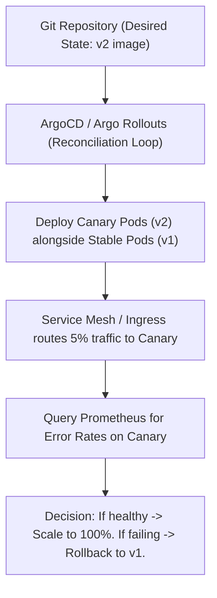

# MOD-CICD-04: Progressive Delivery (Canary, Blue/Green) & Rollback Automation (ArgoCD)

# Lesson Overview

This lesson transitions from Continuous Integration to advanced Continuous Deployment (CD). You will learn how to move beyond basic "recreate" or "rolling update" deployments by implementing Progressive Delivery patterns. We will explore Blue/Green and Canary deployments, and how tools like ArgoCD and Argo Rollouts enable automated, metric-driven rollouts and instantaneous rollbacks in Kubernetes.

---

# Learning Objectives

* Define Progressive Delivery and explain its advantages over traditional deployment methods.
* Differentiate between Blue/Green and Canary deployment strategies.
* Understand the GitOps paradigm and how ArgoCD reconciles cluster state with Git.
* Design a metric-driven Canary release using Argo Rollouts.
* Explain how automated rollbacks minimize Mean Time To Recovery (MTTR).

---

# Prerequisites

* Strong understanding of Kubernetes Deployments and Services (from Module 05/06).
* Familiarity with CI/CD concepts (MOD-CICD-01 to 03).
* Basic understanding of monitoring and metrics (helpful, but not strictly required until Module 12).

---

# Why This Exists

The standard Kubernetes `RollingUpdate` strategy replaces old pods with new ones gradually. However, if the new code contains a critical bug (e.g., it crashes under production load, or has a subtle logic error not caught in CI), real users will experience failure until an engineer notices, manually intervenes, and triggers a rollback. 

Progressive Delivery was invented to automate the safety of deployments. By exposing new versions to a tiny fraction of users (Canary) or a completely separate shadow environment (Blue/Green), and connecting the deployment controller directly to monitoring metrics, systems can now automatically detect failures and roll back *before* a widespread outage occurs, often without human intervention.

---

# Core Concepts

## GitOps (ArgoCD)
GitOps is a paradigm where a Git repository acts as the single source of truth for declarative infrastructure and applications. Instead of a CI pipeline "pushing" commands (`kubectl apply`) to a cluster, an agent running *inside* the cluster (like ArgoCD) constantly monitors the Git repo and "pulls" the desired state, reconciling the cluster to match Git.

## Blue/Green Deployment
Two identical environments exist: Blue (currently live) and Green (idle). The new version is deployed to Green. Once verified (via automated tests or manual QA), traffic is instantaneously switched at the load balancer level from Blue to Green.
* **Pro:** Instant rollback (just flip the switch back to Blue). Zero downtime.
* **Con:** Requires double the infrastructure capacity.

## Canary Deployment
The new version is rolled out to a small subset of users (e.g., 5% of traffic) alongside the existing stable version. The system monitors metrics (error rates, latency). If stable, the traffic percentage is gradually increased (10%, 50%, 100%). If errors spike, traffic is immediately routed back to the stable version.
* **Pro:** Tests in real production with real user traffic; minimizes blast radius.
* **Con:** Complex to orchestrate; requires robust observability.

---

# Architecture



---

# Real-World Example

**Intuit** (creators of TurboTax) utilizes ArgoCD and Argo Rollouts extensively. During tax season, they cannot afford a bad deployment taking down their system. Instead of deploying an update to millions of users at once, an Argo Rollout releases the new version to 1% of traffic. Argo Rollouts automatically queries Datadog/Prometheus to check if the new pods are generating HTTP 500 errors. If the error rate exceeds 1%, Argo Rollouts instantly aborts the deployment, routing all traffic back to the stable version, and pages the developer on Slack. The blast radius is contained to a negligible fraction of users.

---

# Hands-on Demonstration

*This is a conceptual demonstration of an Argo Rollout definition for a Canary release.*

**Input (Argo Rollout YAML):**
```yaml
apiVersion: argoproj.io/v1alpha1
kind: Rollout
metadata:
  name: my-app-rollout
spec:
  replicas: 5
  strategy:
    canary:
      steps:
      - setWeight: 20
      - pause: {duration: 1h} # Wait 1 hour at 20% traffic
      - setWeight: 50
      - pause: {duration: 10m}
      - setWeight: 100
  template:
    # Standard Pod template...
    spec:
      containers:
      - name: my-app
        image: my-app:v2.0
```

**Expected Output:**
When this is applied, Argo Rollouts will route 20% of traffic to the `v2.0` pods. It will literally wait for 1 hour. If an engineer doesn't manually abort it (or if an automated analysis doesn't fail it), it proceeds to 50% for 10 minutes, and finally to 100%.

**Explanation:**
This YAML replaces the standard Kubernetes `Deployment` object. It provides the controller with explicit, declarative steps on how to incrementally expose the new version to users.

---

# Hands-on Lab

* **Objective:** Understand how traffic shifting works in a Blue/Green scenario using standard Kubernetes Services (simulating Progressive Delivery concepts).
* **Estimated Time:** 20 minutes
* **Difficulty:** Intermediate
* **Environment:** A local Kubernetes cluster (Minikube/Kind) and `kubectl`.

## Step-by-step Instructions

1. **Deploy the "Blue" (Stable) Version:**
   Create `blue.yaml`:
   ```yaml
   apiVersion: apps/v1
   kind: Deployment
   metadata: {name: blue-app}
   spec:
     replicas: 2
     selector: {matchLabels: {app: my-app, version: blue}}
     template:
       metadata: {labels: {app: my-app, version: blue}}
       spec:
         containers:
         - name: web
           image: nginx:1.24 # Imagine this is v1
   ```
   `kubectl apply -f blue.yaml`

2. **Create the Production Service:**
   Create `service.yaml`:
   ```yaml
   apiVersion: v1
   kind: Service
   metadata: {name: prod-service}
   spec:
     selector:
       app: my-app
       version: blue # Currently pointing to Blue
     ports:
     - port: 80
   ```
   `kubectl apply -f service.yaml`

3. **Deploy the "Green" (New) Version:**
   Create `green.yaml`:
   ```yaml
   apiVersion: apps/v1
   kind: Deployment
   metadata: {name: green-app}
   spec:
     replicas: 2
     selector: {matchLabels: {app: my-app, version: green}}
     template:
       metadata: {labels: {app: my-app, version: green}}
       spec:
         containers:
         - name: web
           image: nginx:1.25 # Imagine this is v2
   ```
   `kubectl apply -f green.yaml`

4. **Cutover (The Blue/Green Switch):**
   Edit the `service.yaml` and change `version: blue` to `version: green`.
   `kubectl apply -f service.yaml`

## Verification

Run `kubectl get endpoints prod-service`. You will see the IP addresses have instantly shifted to point to the Green deployment pods. 

## Troubleshooting

* If traffic isn't shifting, ensure the labels on the Green pods exactly match the updated selector in the Service.

## Cleanup

```bash
kubectl delete -f blue.yaml -f green.yaml -f service.yaml
```

---

# Production Notes

* **Database Schema Migrations:** Progressive delivery requires backward-compatible database schemas. If v2 requires a dropped column, but v1 is still running (during a Canary or Blue/Green), v1 will crash. Changes must be done in phases (e.g., Phase 1: Add new column, Phase 2: Deploy code using new column, Phase 3: Drop old column).
* **Stateful Applications:** Blue/Green and Canary are much harder for applications that hold local state or cache. Stateless microservices are the ideal candidates for these patterns.

---

# Common Mistakes

* **Manual verification pauses:** Leaving a Canary rollout paused indefinitely waiting for manual QA click-testing defeats the purpose of automation. Rely on automated metrics (AnalysisRuns in Argo) to progress the rollout.
* **Over-complicating early on:** Implementing a full metric-driven canary before having reliable baseline metrics (Prometheus) or a solid standard CI pipeline. Start with Blue/Green or simple paused Rollouts before adding automated metric analysis.

---

# Failure-Driven Learning

**Scenario:** You implement a Canary rollout that automatically progresses based on HTTP 200 (Success) response rates. The new version has a bug where it returns an HTTP 200 OK, but the JSON payload is completely empty.

**Diagnosis:** The Canary succeeds and rolls out to 100%, causing a total production outage. The metric used (HTTP status code) was insufficient to determine true application health.

**Solution:** Implement more robust Application Performance Monitoring (APM) and use complex, business-logic metrics (e.g., successful checkout events, or parsing log streams for exceptions) rather than just relying on generic HTTP status codes.

**Learning:** Automated rollbacks are only as intelligent as the metrics you provide them.

---

# Engineering Decisions

**Push (Traditional CI/CD) vs. Pull (GitOps/ArgoCD):**
* **Push:** The CI server holds cluster credentials and runs `kubectl apply`. This is simpler to set up initially, but poses a security risk (CI server has keys to production) and suffers from configuration drift (if someone manually edits the cluster, CI doesn't know).
* **Pull (GitOps):** The cluster pulls from Git. It requires a controller like ArgoCD. It is highly secure (cluster credentials never leave the cluster), prevents drift (ArgoCD will automatically overwrite manual cluster edits to match Git), and provides an auditable history of all changes.

---

# Best Practices

* **Separate CI and CD Repositories:** Keep your application code (and CI pipeline) in one repository, and your Kubernetes manifests (the GitOps desired state) in a separate repository. The CI pipeline's final step is to update the image tag in the GitOps repository.
* **Automated Rollbacks:** Always configure an automated rollback trigger. If a canary fails, the system should revert to the stable state without waiting for a human to wake up.
* **Declarative Infrastructure:** Everything, including the definition of how to deploy the application, should be written as code and version-controlled.

---

# Troubleshooting Guide

## Issue 1: ArgoCD reports "OutOfSync" but the deployment isn't updating.

* **Cause:** The cluster state was manually modified (e.g., someone ran `kubectl edit`), or the Git repository contains an invalid Kubernetes manifest that the API server is rejecting.
* **Diagnosis:** Click on the specific OutOfSync resource in the ArgoCD UI. Look for "Sync Failed" error messages.
* **Solution:** If someone manually edited the cluster, click "Sync" in ArgoCD to overwrite their manual changes with the Git truth. If the manifest is invalid, fix the YAML in the Git repository and commit the change.

---

# Summary

Progressive Delivery transforms deployments from high-risk events into safe, automated routines. By utilizing GitOps principles with ArgoCD and intelligent routing with Argo Rollouts, Platform Engineers can test new code in production with minimal blast radius, automatically rolling back at the first sign of metric degradation.

---

# Cheat Sheet

* **GitOps:** Git as the single source of truth for declarative infrastructure.
* **Blue/Green:** Deploy new version alongside old, switch traffic instantly via load balancer.
* **Canary:** Slowly bleed traffic to the new version, verifying health along the way.
* **ArgoCD:** A declarative, GitOps continuous delivery tool for Kubernetes.
* **Argo Rollouts:** A Kubernetes controller providing advanced deployment capabilities (Canary, Blue/Green).

---

# Knowledge Check

## Multiple Choice Questions

1. What is the core principle of GitOps?
   * A) Using Git to store Docker images.
   * B) A CI server pushing changes directly to a Kubernetes cluster using admin credentials.
   * C) A Git repository acting as the single source of truth for declarative infrastructure, monitored by a controller inside the cluster.
   * D) Using Git for project management and issue tracking.

2. Which deployment strategy requires 2x the normal infrastructure capacity?
   * A) Rolling Update
   * B) Canary
   * C) Blue/Green
   * D) A/B Testing

## Scenario Questions

You deploy a Canary release that sends 5% of traffic to a new version of your shopping cart service. You configure Argo Rollouts to query Prometheus for the error rate. The error rate spikes to 50% on the Canary pods. What action should the system take?

## Short Answer Questions

Why are backward-compatible database changes critical when using Progressive Delivery?

<details>
<summary><b>View Answers</b></summary>

### Multiple Choice
1. **C** - *GitOps relies on the pull model, where an agent like ArgoCD constantly reconciles the cluster state to match what is defined in Git.*
2. **C** - *Blue/Green requires spinning up a completely separate, fully scaled environment (Green) before switching traffic over from the existing environment (Blue).*

### Scenario
*The system should immediately and automatically abort the rollout, scaling down the Canary pods and routing 100% of traffic back to the stable version to minimize the blast radius of the failure.*

### Short Answer
*Because during a Blue/Green or Canary rollout, both the old version and the new version of the application are running simultaneously and connecting to the same database. If the new version alters the schema in a breaking way (e.g., dropping a table), the old version will crash.*

</details>

---

# Interview Preparation

## Beginner Questions

* What is the difference between a Blue/Green deployment and a Canary deployment?

## Intermediate Questions

* Explain the "Push" versus "Pull" model in Continuous Deployment. Which one does ArgoCD use?

## Advanced Questions

* How do you handle stateful database schema migrations in a zero-downtime Canary deployment scenario?

## Scenario-Based Discussions

* Your team wants to implement automated rollbacks using Argo Rollouts. What specific metrics would you monitor to decide if a Canary deployment is failing, and how do you ensure those metrics are reliable?

<details>
<summary><b>View Answers</b></summary>

### Beginner
* **Blue/Green vs. Canary:** *Blue/Green deploys a full secondary environment and switches 100% of traffic instantly, offering fast rollbacks but requiring more infrastructure. Canary slowly shifts a percentage of traffic (e.g., 5%, then 20%) to the new version, verifying health metrics before proceeding, which minimizes the blast radius of a bad release.*

### Intermediate
* **Push vs. Pull:** *In the Push model (traditional CI), the CI server authenticates to the cluster and executes `kubectl apply`. In the Pull model (GitOps), a controller runs inside the cluster, monitors a Git repository, and pulls changes inward. ArgoCD uses the Pull model. This is more secure (no inbound firewall rules or external credential storage) and prevents configuration drift.*

### Advanced
* **Database Migrations:** *You must decouple schema deployments from code deployments using the "Expand and Contract" pattern. Phase 1: Deploy a backward-compatible schema change (e.g., add a new column, but keep the old one). Phase 2: Deploy the code (via Canary) that writes to both columns but reads from the new one. Phase 3: Deploy code that only uses the new column. Phase 4: A final schema migration drops the old column. This ensures both v1 and v2 application pods function during the rollout.*

### Scenario-Based Discussions
* **Metric-Driven Rollbacks:** *I would not rely solely on basic infrastructure metrics like CPU/Memory. I would monitor the "Four Golden Signals": Latency (response time), Traffic, Errors (HTTP 5xx rates), and Saturation. Specifically, I would configure Argo Rollouts AnalysisRuns to query Prometheus for the HTTP 5xx error rate and the 95th percentile latency of the specific Canary pods. To ensure reliability, we must establish a baseline, ensure the application is emitting custom business metrics (e.g., checkout success rate), and simulate failures in staging to prove the rollback mechanism actually triggers.*

</details>

---

# Further Reading

1. [ArgoCD Official Documentation](https://argo-cd.readthedocs.io/)
2. [Argo Rollouts Documentation](https://argoproj.github.io/argo-rollouts/)
3. [GitOps Principles (OpenGitOps)](https://opengitops.dev/)
4. [Martin Fowler: BlueGreenDeployment](https://martinfowler.com/bliki/BlueGreenDeployment.html)
