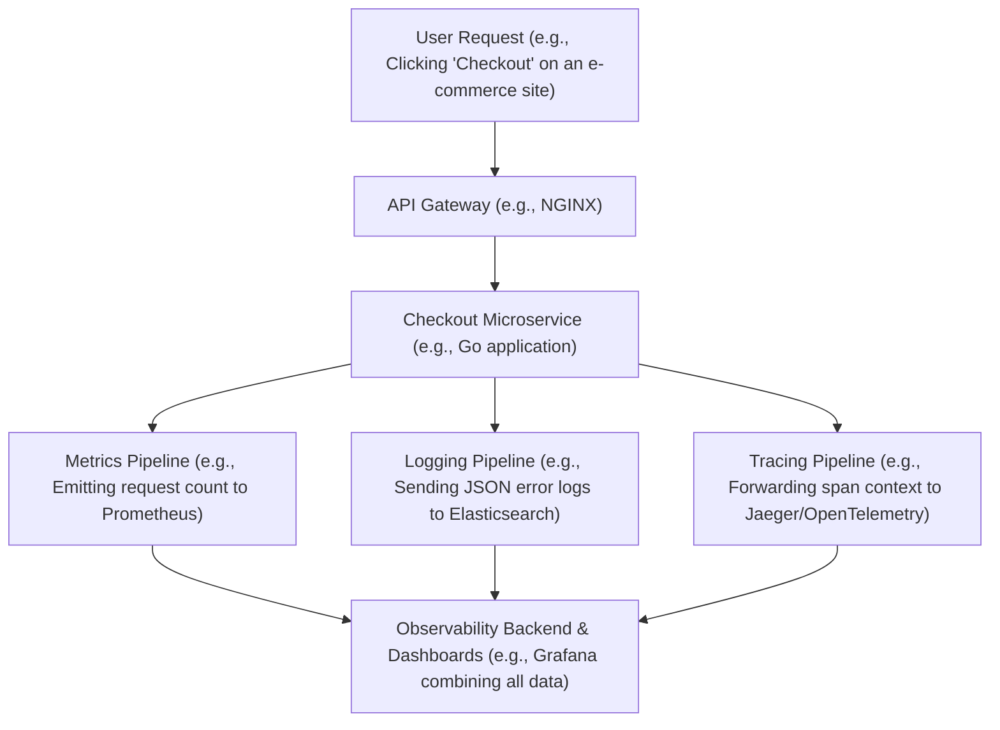

# The Three Pillars of Observability: Metrics, Logs & Traces

Version: 1.0.0

# Lesson Overview

This lesson introduces the foundational concepts of observability in distributed systems, specifically focusing on its three core pillars: metrics, logs, and traces. You will learn why traditional monitoring falls short in modern microservices architectures and how a unified observability strategy enables platform engineers and SREs to proactively understand system health, detect anomalies, and drastically reduce mean time to resolution (MTTR).

---

# Learning Objectives

* Define observability and distinguish it from traditional monitoring.
* Explain the characteristics, use cases, and limitations of metrics, logs, and distributed traces.
* Understand how the three pillars interconnect to provide a holistic view of system state.
* Identify the common tools used in the cloud-native ecosystem for each pillar (e.g., Prometheus, Grafana, OpenTelemetry).

---

# Prerequisites

* Basic understanding of distributed systems and microservices architectures.
* Familiarity with general software engineering concepts like APIs, databases, and network latency.
* Experience with basic command-line interfaces.

---

# Why This Exists

In the era of monolithic applications, "monitoring" was relatively straightforward. You checked CPU usage, disk space, and application uptime. If a request failed, you checked the single application log file. However, as systems evolved into highly distributed microservices running dynamically on orchestrated platforms like Kubernetes, this black-box monitoring broke down. A single user request might traverse dozens of distinct services, queues, and databases before returning a response. When things break in these complex environments, you can't just look at one log file. Observability was born out of the necessity to make these highly complex, distributed, and ephemeral systems transparent and debuggable from the outside, relying on telemetry data emitted from within.

---

# Core Concepts

## Monitoring vs. Observability

*   **Monitoring** tells you *when* a system is broken. It focuses on predefined dashboards and alerts based on known failure modes (e.g., "Alert me if CPU > 90%"). Monitoring answers the question, "Is the system working?"
*   **Observability** allows you to understand *why* a system is broken by letting you ask arbitrary questions about your system's behavior without deploying new code. It is an intrinsic property of the system, derived from its telemetry. Observability answers the question, "Why isn't it working, and what is the root cause?"

## Pillar 1: Metrics

Metrics are numeric representations of data measured over intervals of time. They are highly structured, easily compressible, and optimized for storage and mathematical aggregation. Metrics are excellent for tracking the overall health and behavior of a system at a macro level (e.g., request rate, error rate, latency).

*   **Pros:** Cheap to store, fast to query, ideal for alerting and dashboards.
*   **Cons:** Lack rich context. They tell you there is a spike in errors, but rarely tell you *why* an individual error occurred.

## Pillar 2: Logs

Logs are immutable, timestamped records of discrete events that happened over time within an application or system. They are typically emitted in plain text or structured formats like JSON. Logs provide the granular detail needed to understand specific failures or transactions.

*   **Pros:** Provide deep, detailed context about specific events (e.g., stack traces, user IDs).
*   **Cons:** Expensive to process and store at scale. Searching through massive volumes of unstructured logs can be slow and tedious.

## Pillar 3: Distributed Traces

Traces represent the end-to-end journey of a single request or transaction as it propagates through a distributed system. A trace is composed of multiple "spans," where each span represents a specific operation within a specific service, complete with a start and end time.

*   **Pros:** Essential for debugging latency issues and understanding complex service dependencies. They pinpoint exactly where a bottleneck or failure occurred in a multi-service transaction.
*   **Cons:** Can be complex to instrument correctly across all services. Storing 100% of traces is usually cost-prohibitive, requiring sampling strategies.

## The Synergy of the Pillars

None of the pillars stand alone effectively. A robust observability strategy correlates them:
1.  **Metrics** fire an alert (e.g., "High latency on the checkout API").
2.  **Traces** show exactly which microservice in the checkout flow is causing the delay (e.g., "The inventory database query is slow").
3.  **Logs** provide the specific details of why that query was slow (e.g., "Query timeout: missing index on product_id").

---

# Architecture



---

# Real-World Example

Consider a global ride-sharing company like Uber or Lyft. A single user action—requesting a ride—touches dozens of services: user authentication, location tracking, pricing engines, driver matching, and payment processing. 
If the ride request fails, traditional monitoring might only show an elevated 500 error rate on the API gateway (Metrics). To fix it, SREs use a Distributed Trace ID associated with the failed request to see the entire journey. The trace reveals that the transaction failed specifically at the "driver matching" service (Traces). They then pivot to the specific Logs for the "driver matching" service around that exact timestamp to discover a `Connection refused` error to an underlying Redis cache (Logs). This interconnected workflow reduces MTTR from hours to minutes.

---

# Hands-on Demonstration

Let's visualize the difference between the three data types using pseudo-code and output formats.

**Input (Code execution context):**
An application processes a payment.

**Output - Metric (Prometheus format):**
```text
http_requests_total{method="POST", path="/payment", status="500"} 42
```
*Explanation:* A simple counter indicating 42 failures have occurred. Very space-efficient.

**Output - Log (JSON structured):**
```json
{
  "timestamp": "2023-10-27T10:15:30Z",
  "level": "ERROR",
  "service": "payment-service",
  "trace_id": "1fa049b1a52b4736",
  "message": "Payment processing failed",
  "error_detail": "Stripe API timeout after 5000ms"
}
```
*Explanation:* Rich context about a specific failure event. Notice the `trace_id` which acts as the glue.

**Output - Trace (Span representation):**
```text
Trace ID: 1fa049b1a52b4736
  Span 1: API Gateway (duration: 5050ms)
    Span 2: Payment Service (duration: 5040ms)
      Span 3: External Call to Stripe API (duration: 5005ms) - ERROR
```
*Explanation:* Shows the causal relationship and latency breakdown of the request across multiple boundaries.

---

# Hands-on Lab

* **Objective:** Spin up a local observability stack (Prometheus, Grafana, Jaeger) and a sample application to observe the three pillars in action.
* **Estimated Time:** 30 minutes
* **Difficulty:** Beginner
* **Environment:** A local machine with Docker and Docker Compose installed.

## Step-by-step Instructions

1.  **Create a Docker Compose File:** Create a file named `docker-compose.yml` that will launch our observability backend. (For this lab, we will use a pre-packaged OpenTelemetry demo).
    ```yaml
    # We will use a simplified mock stack for demonstration
    version: '3'
    services:
      prometheus:
        image: prom/prometheus:latest
        ports:
          - "9090:9090"
      jaeger:
        image: jaegertracing/all-in-one:latest
        ports:
          - "16686:16686"
      grafana:
        image: grafana/grafana:latest
        ports:
          - "3000:3000"
    ```
2.  **Start the Stack:** Run `docker-compose up -d`.
3.  **Access the UIs:**
    *   Navigate to `http://localhost:9090` to see the Prometheus (Metrics) interface.
    *   Navigate to `http://localhost:16686` to see the Jaeger (Traces) interface.
    *   Navigate to `http://localhost:3000` to see Grafana (Dashboards).
4.  **Explore the Concepts:** While we haven't connected a live application yet (which we will do in subsequent lessons), take 5 minutes to click around the UIs of Prometheus and Jaeger to familiarize yourself with where metrics and traces live.

## Verification

Run `docker ps` to ensure Prometheus, Jaeger, and Grafana are running on their respective ports.

## Troubleshooting

*   **Port Conflicts:** If `docker-compose up` fails, ensure you don't have other services running locally on ports 9090, 16686, or 3000. Stop competing services or change the exposed ports in the `docker-compose.yml` file.

## Cleanup

Run `docker-compose down` to tear down the environment.

---

# Production Notes

*   **Storage Costs:** The biggest challenge in observability at scale is cost. Logs are particularly expensive. You must implement aggressive log retention policies and often sample traces (e.g., only storing 1% of successful traces, but 100% of error traces).
*   **Structured Logging:** Always enforce structured logging (e.g., JSON) across your organization. Plain text logs are nearly useless in modern log aggregation tools because they cannot be easily parsed or indexed.
*   **Cardinality:** Be extremely careful with metric "cardinality" (the number of unique time series). Using high-cardinality data like `user_id` or `session_id` as a label in Prometheus will quickly crash the database due to a combinatorial explosion of time series.

---

# Common Mistakes

*   **Logging everything:** Emitting verbose `DEBUG` level logs in production by default will inflate storage bills and make it harder to find actual errors in the noise.
*   **Siloed Tools:** Using completely disconnected tools for metrics, logs, and traces. The true power of observability comes from correlation (e.g., clicking a spike on a metric dashboard and instantly seeing the related logs and traces).
*   **Treating Observability as an Afterthought:** Trying to "add" observability to a system after it's in production is painfully difficult. Instrumentation should be part of the standard software development lifecycle (SDLC).

---

# Failure-Driven Learning

Imagine an application suddenly experiences high CPU usage, and the monitoring dashboard goes red.
1.  **Failure:** You check the application logs, but they are full of useless `INFO` messages like "Request received." There are no errors.
2.  **Diagnosis:** You realize you lack metrics on individual endpoint performance and you lack traces to see what the application is actually doing with the CPU.
3.  **Correction:** This failure highlights why logs alone are insufficient. You need to instrument the code to expose CPU profiling metrics and distributed traces to identify if a specific long-running loop or inefficient database query is consuming the resources.

---

# Engineering Decisions

A key architectural decision platform engineers face is whether to build an observability stack in-house using open-source tools (e.g., Prometheus + ELK + Jaeger) or purchase a managed SaaS solution (e.g., Datadog, New Relic, Honeycomb).
*   **Open Source:** High operational overhead to manage and scale the databases, but lower direct software costs. Requires a dedicated team to maintain.
*   **SaaS:** Very expensive at scale (often priced by data volume), but provides out-of-the-box correlation, low operational burden, and faster time-to-value.
The decision usually hinges on the organization's engineering maturity, budget, and data sovereignty requirements.

---

# Best Practices

*   **Contextualize Telemetry:** Inject a shared `trace_id` into all application logs to enable seamless pivoting between a distributed trace and its associated logs.
*   **Standardize Naming:** Use consistent naming conventions for metrics and labels across all microservices (e.g., `http_requests_total` instead of `web_req_count` in one app and `api_hits` in another).
*   **Actionable Alerts:** Only alert on metrics that represent user-facing pain (Symptoms) rather than underlying technical states (Causes). Alerting on "High Error Rate" is better than alerting on "High CPU," as high CPU might not actually be affecting users.

---

# Troubleshooting Guide

## Issue 1: High Latency Spikes in Application

*   **Cause:** A downstream microservice or database is responding slowly.
*   **Diagnosis:**
    1.  Check the **Metrics** dashboard to confirm the latency spike and identify which specific API endpoints are affected.
    2.  Open **Distributed Tracing** and search for traces covering those slow endpoints. Look at the span waterfall to see exactly which downstream component is taking the majority of the time.
    3.  Once the slow component is identified, search its **Logs** during the time window of the trace for errors, timeouts, or garbage collection pauses.
*   **Solution:** Depending on the root cause found in the logs, solutions may include adding database indexes, increasing connection pool sizes, scaling the downstream service, or optimizing application logic.

---

# Summary

Observability is the capacity to understand the internal state of a complex system by analyzing its external outputs. The three pillars—metrics (for macro-level health and alerting), logs (for granular, event-level detail), and distributed traces (for mapping request lifecycles across services)—work synergistically. Mastering these concepts is fundamental for platform engineers tasked with ensuring the reliability and performance of modern cloud-native architectures.

---

# Cheat Sheet

*   **Metric:** A numerical measurement over time (e.g., CPU usage, request rate). Best for alerting.
*   **Log:** A discrete, timestamped event (e.g., "User logged in"). Best for deep debugging.
*   **Trace:** The end-to-end journey of a request across distributed systems. Best for analyzing latency and dependencies.
*   **Cardinality:** The number of unique combinations of metric labels. High cardinality is bad for time-series databases.
*   **Correlation:** Linking metrics, logs, and traces together (usually via a `trace_id`).

---

# Knowledge Check

## Multiple Choice Questions

1. Which observability pillar is most appropriate for determining the overall error rate of an application over the last 24 hours?
   * A) Logs
   * B) Distributed Traces
   * C) Metrics
   * D) Profiling

2. You need to understand exactly which downstream microservice is causing a 5-second delay in your user checkout flow. Which tool is best suited for this?
   * A) A Prometheus metric dashboard
   * B) A distributed trace view (e.g., Jaeger)
   * C) Searching through centralized logs
   * D) SSHing into the server to run `top`

## Scenario Questions

Your team is running out of budget for your centralized logging SaaS provider because microservices are emitting too much data. You need to reduce costs without losing visibility into critical failures. What is the best architectural approach?

## Short Answer Questions

What is the primary difference between traditional "monitoring" and modern "observability"?

<details>
<summary><b>View Answers</b></summary>

### Multiple Choice
1. **[C]** - *Metrics are highly optimized for aggregating numerical data over time, such as calculating error rates.*
2. **[B]** - *Distributed traces provide a visual waterfall of spans, showing exactly how much time was spent in each service boundary during a transaction.*

### Scenario
*The best approach is to shift focus to Metrics for general health and implement strict Log sampling or filtering. You should aggregate common informational events into metrics (counters) and only emit full logs for warnings, errors, or a small statistical sample of successful requests. Traces can also be sampled to reduce volume while maintaining visibility into systemic issues.*

### Short Answer
*Monitoring is prescriptive and tells you when a known problem has occurred (e.g., CPU is high). Observability is exploratory and provides enough context to allow you to debug unknown, novel problems by asking arbitrary questions of your system's data.*

</details>

---

# Interview Preparation

## Beginner Questions

* What are the three pillars of observability?
* Why are plain-text logs harder to manage at scale than structured logs?

## Intermediate Questions

* Explain the concept of metric cardinality and why it matters in systems like Prometheus.
* How do you correlate a specific error log with a distributed trace?

## Advanced Questions

* Design an observability strategy for a multi-region Kubernetes deployment processing financial transactions. How do you balance data retention, cross-region latency for telemetry data, and cost?

## Scenario-Based Discussions

* Your pagers go off because user logins are failing. Your metrics show an elevated error rate, your traces show the failure happens at the auth service, but the auth service logs are completely empty. Walk me through your troubleshooting steps and how you would prevent this lack of visibility in the future.

<details>
<summary><b>View Answers</b></summary>

### Beginner
* **What are the three...:** Metrics, Logs, and Distributed Traces.
* **Why are plain-text logs...:** Plain-text requires complex, fragile regular expressions (regex) to parse and index, whereas structured logs (like JSON) are easily ingested, queried, and filtered by modern logging platforms.

### Intermediate
* **Explain the concept of metric cardinality...:** Cardinality is the number of unique time series generated by metric labels. High cardinality (e.g., tagging a metric with a unique User ID) creates a massive number of series, which will quickly exhaust the memory and storage of time-series databases like Prometheus.
* **How do you correlate...:** By injecting a unique identifier, such as a `trace_id`, into the logging context of the application. When a log is emitted, it includes this ID, allowing observability tools to link the specific log entry to the overarching trace span.

### Advanced
* **Design an observability strategy...:** The strategy must employ edge processing. Telemetry should be collected and buffered locally within each region using an agent like OpenTelemetry Collector. Logs should be heavily filtered and sampled at the edge to reduce egress costs. Aggregated metrics and sampled traces are forwarded to a central observability cluster. High-value financial transaction logs might require separate, compliant, long-term cold storage.

### Scenario-Based Discussions
* **Your pagers go off because user logins...:** First, check the infrastructure (Kubernetes pods) to ensure the auth service is actually running and not crash-looping before it can write logs. Then, check network proxies (Envoy/NGINX) to ensure traffic is reaching the service. To prevent this, I would ensure the auth service implements fallback logging (e.g., to stdout), implement a "dead letter queue" for failed telemetry, and establish synthetic monitoring that continually tests the login flow from the outside in.

</details>

---

# Further Reading

1. [Google SRE Book - Monitoring Distributed Systems](https://sre.google/sre-book/monitoring-distributed-systems/)
2. [OpenTelemetry Documentation](https://opentelemetry.io/docs/)
3. [Prometheus Best Practices](https://prometheus.io/docs/practices/naming/)
