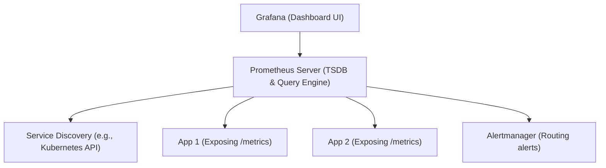

# Time-Series Instrumentation with Prometheus & PromQL

Version: 1.0.0

# Lesson Overview

This lesson dives deep into Prometheus, the industry-standard time-series database for cloud-native monitoring. You will learn the mechanics of time-series data, how Prometheus actively pulls metrics from targets, and how to write PromQL queries to extract actionable insights and calculate critical indicators like error rates and system latency.

---

# Learning Objectives

* Understand the architecture of a time-series database and how it differs from relational databases.
* Explain the Prometheus pull-based metric collection model.
* Instrument a simple application to expose standard Prometheus metrics (Counters, Gauges, Histograms).
* Write intermediate PromQL queries to aggregate data, calculate rates, and identify anomalies.

---

# Prerequisites

* Completion of `MOD-OBS-01: The Three Pillars of Observability`.
* Basic understanding of HTTP and REST APIs.
* Familiarity with containerized applications (Docker).

---

# Why This Exists

Before Prometheus, monitoring systems like Nagios or StatsD often relied on push-based models where applications blasted UDP packets to a central server, or they relied on simple, flat metric structures. As infrastructure became dynamic with Kubernetes—where pods spin up and down constantly—static IP configurations and push models became fragile. Prometheus was built at SoundCloud (heavily inspired by Google's internal Borgmon) specifically to handle dynamic, multi-dimensional metric data in cloud-native environments using a robust pull-model and a powerful query language.

---

# Core Concepts

## Time-Series Data

A time-series database (TSDB) is optimized for measuring change over time. Every data point consists of three things:
1.  **Metric Name & Labels (The Identity):** e.g., `http_requests_total{method="GET", status="200"}`
2.  **Timestamp:** The exact time the measurement was taken.
3.  **Value:** A floating-point number representing the measurement.

## The Pull Model

Unlike push-based systems, Prometheus actively reaches out (scrapes) HTTP endpoints on your applications (typically `/metrics`) at regular intervals (e.g., every 15 seconds) to pull the current state of the metrics.
*   **Advantage:** Prometheus controls the ingestion rate, preventing the monitoring server from being overwhelmed by a flood of metrics during traffic spikes. It also makes it trivial to detect if a target is down—if the scrape fails, the target is offline.

## Metric Types

Prometheus defines four core metric types that applications can expose:
1.  **Counter:** A cumulative metric that only goes up (or resets to zero on restart). Example: Total HTTP requests, total errors.
2.  **Gauge:** A metric that can go up and down arbitrarily. Example: Current memory usage, active connections, temperature.
3.  **Histogram:** Samples observations (like request durations) and counts them in configurable buckets. Essential for calculating percentiles (e.g., 99th percentile latency).
4.  **Summary:** Similar to Histograms but calculates percentiles on the client-side. Less flexible for aggregation than Histograms.

## PromQL (Prometheus Query Language)

PromQL is a functional query language used to select and aggregate time-series data in real-time. It allows you to transform raw metric values into meaningful graphs and alerts (e.g., calculating the per-second rate of HTTP errors over the last 5 minutes).

---

# Architecture



---

# Real-World Example

A streaming service like Netflix uses Prometheus to monitor video playback quality. Millions of client devices report playback errors and buffering events. These are aggregated by regional gateways exposing `/metrics`. Prometheus scrapes these gateways. A PromQL query runs continuously to calculate the global error rate: `rate(video_playback_errors_total[5m])`. If this rate exceeds a defined threshold, Prometheus sends a signal to Alertmanager, which pages the on-call engineer via PagerDuty.

---

# Hands-on Demonstration

Let's look at how to calculate an error rate using PromQL.

**Input (Raw Metric Data):**
Assume an application exposes a counter `http_requests_total`.
At T=0: `http_requests_total{status="500"} 100`
At T=5m: `http_requests_total{status="500"} 130`

**Input (PromQL Query):**
```promql
rate(http_requests_total{status="500"}[5m])
```

**Execution Context:**
The `rate` function calculates the per-second average rate of increase of the time series in the range vector (the last 5 minutes).
Increase = 130 - 100 = 30 errors.
Time window = 5 minutes = 300 seconds.
Rate = 30 / 300 = 0.1.

**Expected Output:**
`0.1` (Meaning: The application is currently generating 0.1 errors per second).

---

# Hands-on Lab

* **Objective:** Instrument a Python application with Prometheus metrics, scrape it, and query the data.
* **Estimated Time:** 30 minutes
* **Difficulty:** Intermediate
* **Environment:** Local machine with Docker, Docker Compose, and Python installed.

## Step-by-step Instructions

1.  **Create the Python Application (`app.py`):**
    ```python
    from flask import Flask
    from prometheus_client import Counter, generate_latest
    import random
    import time

    app = Flask(__name__)
    REQUEST_COUNT = Counter('app_requests_total', 'Total HTTP Requests', ['method', 'endpoint'])

    @app.route('/')
    def hello():
        REQUEST_COUNT.labels(method='GET', endpoint='/').inc()
        time.sleep(random.uniform(0.1, 0.5)) # Simulate work
        return "Hello World!"

    @app.route('/metrics')
    def metrics():
        return generate_latest()

    if __name__ == '__main__':
        app.run(host='0.0.0.0', port=8080)
    ```

2.  **Create `prometheus.yml` configuration:**
    ```yaml
    global:
      scrape_interval: 5s
    scrape_configs:
      - job_name: 'flask_app'
        static_configs:
          - targets: ['app:8080']
    ```

3.  **Create `docker-compose.yml`:**
    ```yaml
    version: '3'
    services:
      app:
        build: .
        ports: ["8080:8080"]
      prometheus:
        image: prom/prometheus:latest
        volumes:
          - ./prometheus.yml:/etc/prometheus/prometheus.yml
        ports: ["9090:9090"]
    ```

4.  **Create a `Dockerfile` for the app:**
    ```dockerfile
    FROM python:3.9-slim
    RUN pip install flask prometheus-client
    COPY app.py .
    CMD ["python", "app.py"]
    ```

5.  **Run the Lab:**
    *   Execute `docker-compose up -d`.
    *   Generate some traffic: Open a terminal and run `curl http://localhost:8080` a few times.
    *   Open Prometheus UI: `http://localhost:9090`.

6.  **Execute PromQL:**
    *   In the Prometheus expression browser, type: `app_requests_total` and execute.
    *   Now, calculate the per-second rate over 1 minute: `rate(app_requests_total[1m])`.

## Verification

You should see a graph in Prometheus showing a value greater than 0 for your `rate` query, reflecting the `curl` commands you executed.

## Cleanup

Run `docker-compose down`.

---

# Production Notes

*   **Scrape Intervals:** A 15-second scrape interval is standard. 1-second scraping produces too much data and load; 1-minute scraping can obscure rapid micro-spikes in traffic.
*   **High Availability:** Prometheus itself is not highly available out-of-the-box in a clustered sense. For production HA, you typically run two identical Prometheus servers scraping the same targets, or use clustered TSDB backends like Thanos, Cortex, or VictoriaMetrics.
*   **Histogram Buckets:** When defining Histograms in code, choose your latency buckets carefully. If you expect your API to respond in 50ms, your buckets should be clustered around 10ms, 50ms, 100ms, 500ms. Having a 10-second bucket for a 50ms API wastes memory.

---

# Common Mistakes

*   **Using `rate()` on a Gauge:** The `rate()` function expects the value to only go up (and handles counter resets). Using it on a Gauge (which goes up and down, like memory) yields garbage data. Use `deriv()` or just plot the raw value for Gauges.
*   **Cardinality Explosions:** Storing user IDs, email addresses, or high-variance UUIDs in a metric label (e.g., `http_requests{user_id="12345"}`) will create millions of time series and crash Prometheus. Labels should have a bounded, small set of possible values (e.g., `method="GET"`, `status="200"`).

---

# Failure-Driven Learning

You deploy a new version of your application, and suddenly Prometheus is consuming 100% of its host's memory and crashes (OOMKill).
1.  **Failure:** The monitoring system itself has gone down.
2.  **Diagnosis:** After restarting Prometheus, you look at its internal metrics (`prometheus_tsdb_head_series`) and see a massive spike. You realize a developer recently added a new label to an existing metric.
3.  **Correction:** You inspect the code and see `REQUEST_COUNT.labels(session_id=user_session)`. This cardinality explosion killed the database. You remove the label from the code, deploy the fix, and restart Prometheus.

---

# Engineering Decisions

When calculating error percentages, you must decide how to handle edge cases.
*   **Naive Approach:** `sum(rate(http_requests_total{status="500"}[5m])) / sum(rate(http_requests_total[5m]))`
*   **The Trap:** What happens during a maintenance window when traffic drops to absolute zero? The denominator becomes 0, resulting in a `NaN` (Not a Number) or infinite value, which can trigger false positive alerts.
*   **Better Architecture:** Always design alerting queries to handle low-traffic scenarios, often by adding artificial traffic (synthetic monitoring) or using recording rules to pre-calculate robust ratios.

---

# Best Practices

*   **Recording Rules:** For complex or frequently used PromQL queries (like aggregating data across hundreds of pods), configure Prometheus "Recording Rules." These evaluate the query in the background and save the result as a new, much faster time series.
*   **Use `rate()` not `irate()` for Alerting:** `irate` calculates the rate based only on the last two data points, making graphs look very spiky and responsive. However, it is too volatile for alerting. Always use `rate` for alerts as it averages out the data over the time window.

---

# Troubleshooting Guide

## Issue 1: Missing Metrics (Prometheus shows no data for a target)

*   **Cause:** The target application is down, the `/metrics` endpoint is unreachable, or the scrape configuration is incorrect.
*   **Diagnosis:**
    1.  Go to the Prometheus UI -> Status -> Targets.
    2.  Locate your application. If its state is "DOWN," check the "Error" column.
    3.  If the error is "Connection refused," the app is down or blocking the port. If it's "HTTP 404," the `/metrics` path is wrong.
*   **Solution:** Verify the application is running, ensure network policies/firewalls allow Prometheus to reach the target port, and correct the `scrape_configs` in `prometheus.yml`.

---

# Summary

Prometheus is the engine of cloud-native observability. By leveraging a pull-based model and highly optimized time-series storage, it allows platform engineers to reliably ingest millions of data points per second. Mastering PromQL—understanding how to safely aggregate data and calculate rates—is a non-negotiable skill for building resilient alerting and monitoring systems.

---

# Cheat Sheet

*   **Counter:** Always goes up. Use `rate()` to analyze.
*   **Gauge:** Goes up and down (e.g., memory). Do not use `rate()`.
*   **Histogram:** Buckets of observations (e.g., latency). Use `histogram_quantile()` to calculate percentiles.
*   **PromQL Rate:** `rate(metric_name[5m])` - Per-second rate of increase over 5 minutes.
*   **PromQL Sum:** `sum(rate(metric_name[5m])) by (label)` - Aggregate rates grouped by a specific label.

---

# Knowledge Check

## Multiple Choice Questions

1. Which Prometheus metric type is most appropriate for tracking the amount of active RAM currently being used by a container?
   * A) Counter
   * B) Gauge
   * C) Histogram
   * D) Summary

2. Why is it dangerous to include a unique `TransactionID` as a label in a Prometheus metric?
   * A) It violates GDPR compliance.
   * B) PromQL cannot query string values.
   * C) It causes a cardinality explosion, leading to excessive memory usage and database crashes.
   * D) The pull model cannot scrape metrics with more than 3 labels.

## Scenario Questions

You have a metric `http_requests_total` tracking API calls. You want to trigger an alert if the error rate exceeds 5% of all traffic over a 10-minute window. Describe the logic (or provide the PromQL) you would use.

## Short Answer Questions

Explain the primary difference between a "push" and a "pull" metric collection model, and state one advantage of the pull model.

<details>
<summary><b>View Answers</b></summary>

### Multiple Choice
1. **[B]** - *A Gauge represents a single numerical value that can arbitrarily go up and down, which is exactly how memory utilization behaves.*
2. **[C]** - *Every unique combination of labels creates a new time series in memory. Millions of unique Transaction IDs will exhaust the Prometheus server's resources.*

### Scenario
*You need to calculate the rate of 5xx errors divided by the rate of all requests. The PromQL would look like this: `sum(rate(http_requests_total{status=~"5.."}[10m])) / sum(rate(http_requests_total[10m])) > 0.05`.*

### Short Answer
*In a push model, the application sends data to the monitoring server. In a pull model, the monitoring server (Prometheus) actively requests data from the application at defined intervals. An advantage of the pull model is that Prometheus controls the ingestion rate, preventing the server from being overwhelmed by a flood of metrics from misconfigured or scaling applications.*

</details>

---

# Interview Preparation

## Beginner Questions

* What is a Time-Series Database (TSDB)?
* What is the difference between a Counter and a Gauge in Prometheus?

## Intermediate Questions

* Explain how the PromQL `rate()` function works and how it handles counter resets (e.g., when an application restarts).
* What is the `/metrics` endpoint used for in a Prometheus-monitored application?

## Advanced Questions

* How do you architect a Prometheus deployment for high availability and long-term storage in a multi-cluster Kubernetes environment?

## Scenario-Based Discussions

* Your Prometheus server is experiencing severe performance degradation and high memory usage. How do you identify the root cause, and what steps would you take to mitigate the issue?

<details>
<summary><b>View Answers</b></summary>

### Beginner
* **What is a Time-Series Database...:** A database specifically designed to store and query data points associated with a specific timestamp, optimized for measuring changes over time.
* **What is the difference...:** A Counter is a cumulative metric that only ever goes up (e.g., total requests). A Gauge can go up or down arbitrarily (e.g., current CPU usage).

### Intermediate
* **Explain how the PromQL rate()...:** `rate()` calculates the per-second average rate of increase of a time series over a specified window. It handles counter resets by detecting if a value drops to zero or a lower number than the previous data point; if so, it assumes a restart occurred and seamlessly continues calculating the rate as if the counter had not reset.
* **What is the /metrics endpoint...:** It is an HTTP endpoint exposed by an application or exporter that outputs the current state of all tracked metrics in a plain-text format that the Prometheus server can scrape and parse.

### Advanced
* **How do you architect a Prometheus deployment...:** I would run a highly available pair of Prometheus servers in each Kubernetes cluster for local scraping and short-term alerting. To handle long-term storage and global query views across clusters, I would deploy a system like Thanos or Cortex, which uses object storage (like AWS S3) for infinite retention and provides a unified query layer over all regional Prometheus instances.

### Scenario-Based Discussions
* **Your Prometheus server is experiencing severe performance...:** The most common cause is a cardinality explosion. I would first query `topk(10, count by (__name__) ({__name__=~".+"}))` to identify which metric names have the most time series. If a specific metric has spiked, I would look at its labels to find the high-cardinality culprit (e.g., a `user_id` label). To mitigate, I would apply metric relabeling configurations in Prometheus to drop the offending label at ingestion time until the application developers can deploy a code fix.

</details>

---

# Further Reading

1. [Prometheus Official Documentation](https://prometheus.io/docs/introduction/overview/)
2. [PromQL Tutorial](https://prometheus.io/docs/prometheus/latest/querying/basics/)
3. [Robust Perception Blog (Prometheus deep dives)](https://www.robustperception.io/blog)
