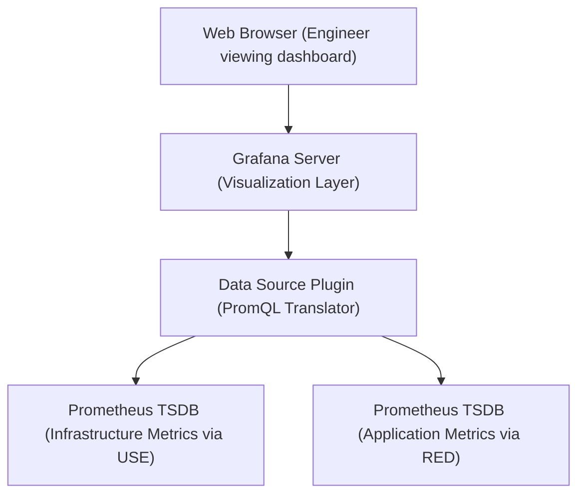

# Designing Mission-Critical Grafana Dashboards

Version: 1.0.0

# Lesson Overview

This lesson focuses on the visualization layer of observability. While Prometheus collects and stores data, Grafana brings it to life. You will learn the principles of effective dashboard design, how to connect Grafana to Prometheus, and how to build "mission-critical" dashboards that prioritize actionable insights over superficial vanity metrics. We will explore the RED and USE methods for structuring operational dashboards.

---

# Learning Objectives

* Understand the role of Grafana within the observability stack.
* Connect Grafana to a Prometheus data source and build panels using PromQL.
* Differentiate between actionable operational dashboards and vanity dashboards.
* Apply the USE (Utilization, Saturation, Errors) method for infrastructure monitoring.
* Apply the RED (Rate, Errors, Duration) method for application service monitoring.

---

# Prerequisites

* Completion of `MOD-OBS-02: Time-Series Instrumentation with Prometheus & PromQL`.
* Basic understanding of web application architecture.

---

# Why This Exists

Raw telemetry data and command-line PromQL queries are powerful for SREs during deep investigations, but they are inaccessible for rapid situational awareness. During a major production incident, engineers need to understand system state in seconds, not minutes. Grafana emerged as the open-source standard for observability visualization because it provides a flexible, unified interface to query, graph, and alert on data from dozens of different backends (Prometheus, Elasticsearch, InfluxDB, etc.) in one place. Effective dashboards translate raw data into human-readable narratives.

---

# Core Concepts

## The Role of Grafana

Grafana is a multi-platform open-source analytics and interactive visualization web application. It does not store data itself; instead, it acts as a "single pane of glass." You configure Data Sources (like Prometheus), and Grafana sends queries to those sources, rendering the results as graphs, gauges, tables, or heatmaps.

## Dashboard Anti-Patterns (Vanity Metrics)

A common mistake is creating "dashboard sprawl"—hundreds of complex, cluttered graphs showing everything an application *could* emit.
*   **Vanity Metric:** "Total registered users" or "Total lines of code executed." These look impressive but don't tell an on-call engineer if the system is currently broken.
*   **Actionable Metric:** "Current checkout failure rate" or "99th percentile API latency." If these spike, someone needs to take action immediately.

## The USE Method (For Infrastructure)

Created by Brendan Gregg, the USE method provides a standard framework for analyzing the performance of any system resource (CPU, Memory, Disk I/O, Network).
For every resource, monitor:
1.  **Utilization:** The average time the resource was busy servicing work (e.g., CPU is 90% utilized).
2.  **Saturation:** The degree to which the resource has extra work queued up that it cannot service (e.g., CPU load average or disk queue length).
3.  **Errors:** The count of error events (e.g., network interface packet drops).

## The RED Method (For Services)

Created by Tom Wilkie, the RED method is the microservices equivalent of the USE method. It defines what to measure for every microservice exposing an API.
For every service, monitor:
1.  **Rate:** The number of requests per second.
2.  **Errors:** The number of failing requests per second.
3.  **Duration:** The amount of time those requests take (latency, usually measured in percentiles like P95 or P99).

---

# Architecture



---

# Real-World Example

Shopify experiences massive, sudden spikes in traffic during "flash sales" (like Black Friday). An SRE looking at a Grafana dashboard during a flash sale isn't looking at generic CPU graphs. They look at a highly curated RED dashboard for the "Checkout Service."
*   **Rate:** Spiking from 1,000 to 50,000 requests/second (Expected).
*   **Duration:** Holding steady at P99 = 200ms (Good).
*   **Errors:** Suddenly spiking from 0 to 500 errors/second (Bad).
The dashboard instantly isolates the problem: The system is scaling, but a specific subset of checkout transactions is failing.

---

# Hands-on Demonstration

Let's look at how RED metrics translate into PromQL queries for Grafana panels.

**Input (Service Objective):**
Monitor the RED metrics for a service named `payment-api`.

**Output (Grafana PromQL Configurations):**

*   **Panel 1: Rate (Requests per second)**
    ```promql
    sum(rate(http_requests_total{job="payment-api"}[1m]))
    ```
    *Visual:* Line graph.

*   **Panel 2: Errors (Failing requests per second)**
    ```promql
    sum(rate(http_requests_total{job="payment-api", status=~"5.."}[1m]))
    ```
    *Visual:* Line graph (colored red).

*   **Panel 3: Duration (99th Percentile Latency in seconds)**
    ```promql
    histogram_quantile(0.99, sum(rate(http_request_duration_seconds_bucket{job="payment-api"}[1m])) by (le))
    ```
    *Visual:* Line graph or Gauge.

---

# Hands-on Lab

* **Objective:** Connect Grafana to Prometheus and build a basic RED dashboard.
* **Estimated Time:** 30 minutes
* **Difficulty:** Intermediate
* **Environment:** A local machine with Docker and Docker Compose installed (reusing the setup from MOD-OBS-02).

## Step-by-step Instructions

1.  **Ensure Stack is Running:** Ensure your Prometheus and sample Python app from the previous lesson are running (`docker-compose up -d`).
2.  **Add Grafana to Compose:** Update your `docker-compose.yml` to include Grafana:
    ```yaml
    # ... (app and prometheus services from previous lesson) ...
      grafana:
        image: grafana/grafana:latest
        ports:
          - "3000:3000"
        depends_on:
          - prometheus
    ```
    Run `docker-compose up -d` to start Grafana.
3.  **Login to Grafana:** Navigate to `http://localhost:3000`. Login with default credentials (`admin` / `admin`). Skip password change for this lab.
4.  **Add Data Source:**
    *   Go to Connections -> Data Sources -> Add data source.
    *   Select Prometheus.
    *   Set the URL to `http://prometheus:9090` (using Docker's internal DNS).
    *   Click "Save & Test". You should see a green success message.
5.  **Create a Dashboard:**
    *   Go to Dashboards -> New Dashboard -> Add Visualization.
    *   Select your Prometheus data source.
    *   **Build the "Rate" Panel:** In the query box, enter `rate(app_requests_total[1m])`. Click "Run Query".
    *   On the right sidebar, change the Title to "Request Rate". Click "Apply".
6.  **Refine (Optional):** Add a second panel to calculate the error rate if your sample app generates errors.

## Verification

You should have a Grafana dashboard successfully rendering a real-time graph of the requests hitting your local Python application.

## Troubleshooting

*   **Grafana cannot connect to Prometheus:** If you get a connection error when adding the data source, ensure the URL is exactly `http://prometheus:9090`. If Grafana is running on your host instead of in Docker Compose, the URL might need to be `http://localhost:9090`.

## Cleanup

Run `docker-compose down`.

---

# Production Notes

*   **Dashboard as Code:** Never manually configure production dashboards via the UI. Use tools like Terraform or Grafana provisioning (placing JSON definitions in specific directories) to manage dashboards as code. This ensures version control, peer review, and disaster recovery.
*   **Template Variables:** Hardcoding service names in queries (e.g., `job="payment-api"`) makes dashboards rigid. Use Grafana template variables (dropdowns at the top of the dashboard) to make a single dashboard dynamically switch between different environments (dev/prod) or clusters.
*   **Refresh Rates:** Setting dashboard auto-refresh rates too low (e.g., every 1 second) across dozens of users will DDoS your Prometheus server. A standard refresh rate is 30s to 60s.

---

# Common Mistakes

*   **The "Eye Chart" Dashboard:** Packing 50 tiny graphs onto a single screen. When an incident occurs, cognitive overload prevents engineers from finding the broken signal. Less is more. Keep dashboards focused on specific personas or services.
*   **Misleading Axes:** Not starting the Y-axis at zero for rate or volume metrics can make a 1% fluctuation look like a catastrophic drop. Always configure axes thoughtfully.
*   **Ignoring Annotations:** Not using Grafana annotations to overlay deployment events on graphs. If a latency spike happens exactly when a new version was deployed, that visual correlation is invaluable.

---

# Failure-Driven Learning

During a deployment, the application's memory usage spikes by 20%, but no alerts fire, and no one notices until the application crashes an hour later.
1.  **Failure:** The dashboard displayed memory *Utilization* but ignored *Saturation* (e.g., swapping or OOM kill events) and lacked appropriate alerting thresholds.
2.  **Diagnosis:** You review the dashboard and realize it was just a vanity graph showing total memory used, without any context of the *maximum* available memory limit of the container.
3.  **Correction:** You update the dashboard using the USE method. You add a graph showing `(memory_used / memory_limit) * 100` to show the percentage of utilization, and add a bright red threshold line at 85% to provide visual context of danger.

---

# Engineering Decisions

When structuring your organization's Grafana folder hierarchy, you must decide between a service-oriented layout vs. an infrastructure-oriented layout.
*   **Service-Oriented:** Folders named "Checkout", "Inventory", "Auth". Dashboards inside contain both application RED metrics and underlying Kubernetes pod USE metrics. (Best for cross-functional product teams).
*   **Infrastructure-Oriented:** Folders named "Kubernetes", "Databases", "Networking". (Often preferred by traditional, siloed Operations teams).
Platform Engineering heavily favors the Service-Oriented approach, empowering developers to own the end-to-end operational state of their specific applications.

---

# Best Practices

*   **Four Golden Signals:** An alternative to RED is Google's Four Golden Signals: Latency, Traffic, Errors, and Saturation. Design high-level dashboards around these four pillars.
*   **Drill-down Links:** Use Grafana's data links to allow engineers to click on a spike in a metric graph and automatically be taken to a logging dashboard (like Kibana or Loki) filtered to that exact time range and service.
*   **Consistent Color Coding:** Enforce consistency. Errors should always be red. Success should always be green. Do not use random color palettes that confuse the user's quick visual processing.

---

# Troubleshooting Guide

## Issue 1: Dashboard Panels are Slow to Load or Time Out

*   **Cause:** The PromQL queries are too complex, scanning too much data, or the Prometheus server is under-provisioned.
*   **Diagnosis:**
    1.  Use Grafana's "Query Inspector" on the slow panel to see exactly how long the query took and how much data it fetched.
    2.  Check the Prometheus server's CPU and memory utilization.
*   **Solution:**
    *   Reduce the time window of the dashboard (e.g., look at the last 1 hour instead of the last 7 days).
    *   Optimize the PromQL query.
    *   Implement Prometheus Recording Rules to pre-calculate the heavy aggregation in the background, so Grafana simply queries the pre-computed fast metric.

---

# Summary

Grafana is the critical translation layer that turns raw time-series data into human-readable narratives. By adhering to structured methodologies like RED (for services) and USE (for infrastructure), and by strictly avoiding vanity metrics, platform engineers can build mission-critical dashboards that drastically reduce cognitive load and Mean Time to Resolution (MTTR) during high-stress production incidents.

---

# Cheat Sheet

*   **RED Method (Services):** Rate (Traffic), Errors, Duration (Latency).
*   **USE Method (Infrastructure):** Utilization (Busy time), Saturation (Queueing), Errors.
*   **Vanity Metric:** Looks good, but unactionable (e.g., Total lifetime hits).
*   **Dashboard as Code:** Storing dashboard JSON in Git and provisioning via CI/CD.

---

# Knowledge Check

## Multiple Choice Questions

1. According to the RED method for monitoring microservices, what does "Duration" represent?
   * A) The uptime of the service container.
   * B) The amount of time the database connection is held open.
   * C) The latency or amount of time it takes to process a request.
   * D) The time window configured in the PromQL query.

2. Why is managing Grafana "Dashboards as Code" considered a best practice?
   * A) It makes Grafana render graphs faster.
   * B) It allows for version control, peer review of changes, and easy disaster recovery.
   * C) It prevents users from viewing dashboards on mobile devices.
   * D) It is a strict requirement for connecting to Prometheus.

## Scenario Questions

You are designing a dashboard for a new database cluster. Following the USE method, what three specific metrics should you prioritize putting at the top of the dashboard? Give concrete examples.

## Short Answer Questions

What is a "vanity metric," and why should it be avoided on an incident-response dashboard?

<details>
<summary><b>View Answers</b></summary>

### Multiple Choice
1. **[C]** - *Duration in the RED method specifically refers to latency, typically measured in percentiles (like the 99th percentile response time) to understand the user experience.*
2. **[B]** - *Managing dashboards as code (JSON files in Git) treats monitoring configuration like software code, bringing the benefits of CI/CD, auditing, and recoverability.*

### Scenario
*Following the USE method for a database: 1) **Utilization:** CPU usage percentage or Disk I/O utilization percentage. 2) **Saturation:** Disk queue length or the number of pending database connections. 3) **Errors:** Disk read/write errors or network packet drops on the database node.*

### Short Answer
*A vanity metric is a data point that looks impressive (e.g., "1 Billion Total Served Requests") but provides no actionable information about the current health of the system. They should be avoided because they clutter the dashboard and distract on-call engineers from finding the actual broken signals during an incident.*

</details>

---

# Interview Preparation

## Beginner Questions

* What is the primary purpose of Grafana?
* What do the acronyms RED and USE stand for in monitoring?

## Intermediate Questions

* How do you prevent a Grafana dashboard from accidentally DDoSing your Prometheus server?
* Explain how you would use Grafana template variables to make a dashboard reusable across different Kubernetes namespaces.

## Advanced Questions

* Describe the concept of "Dashboard as Code." How would you implement this in an enterprise environment using tools like Terraform or GitOps?

## Scenario-Based Discussions

* Your engineering teams are complaining that they have too many dashboards and they don't know which one to look at when an alert fires. How do you solve this organizational observability problem?

<details>
<summary><b>View Answers</b></summary>

### Beginner
* **What is the primary purpose...:** Grafana is a visualization and analytics platform used to query, graph, and alert on data from various data sources like Prometheus, turning raw metrics into readable dashboards.
* **What do the acronyms...:** RED stands for Rate, Errors, Duration (used for services). USE stands for Utilization, Saturation, Errors (used for infrastructure resources).

### Intermediate
* **How do you prevent a Grafana dashboard...:** You ensure dashboard auto-refresh rates are reasonable (e.g., 30s or 60s, never 1s). You use Prometheus Recording Rules for heavy aggregations. You also restrict the time window users can query (e.g., preventing a 1-year data pull on high-cardinality data).
* **Explain how you would use...:** I would create a variable named `$namespace` that queries Prometheus for all available namespaces (e.g., `label_values(kube_pod_info, namespace)`). I would then update all PromQL queries in the dashboard panels to filter by that variable (e.g., `rate(http_requests_total{namespace="$namespace"}[5m])`).

### Advanced
* **Describe the concept of...:** Dashboard as Code means treating dashboard configurations (JSON definitions) as application code. In an enterprise, I would store the JSON in a Git repository. I would use a GitOps tool like ArgoCD, or a CI/CD pipeline running Terraform with the Grafana provider, to automatically sync the dashboards from Git to the Grafana instance. This prevents manual UI edits and ensures auditability.

### Scenario-Based Discussions
* **Your engineering teams are complaining...:** I would implement a strict dashboard hierarchy. Every service gets exactly one "Golden Dashboard" strictly adhering to the RED method. This dashboard is linked directly in the alert notifications. All other experimental or legacy dashboards are moved to a separate "Playground" folder. I would also use dashboard drill-down links, so the Golden Dashboard acts as an entry point, guiding engineers logically to deeper infrastructure dashboards only when needed.

</details>

---

# Further Reading

1. [Grafana Official Documentation](https://grafana.com/docs/)
2. [The USE Method (Brendan Gregg)](https://www.brendangregg.com/usemethod.html)
3. [The RED Method (Weaveworks)](https://www.weave.works/blog/the-red-method-key-metrics-for-microservices-architecture/)
