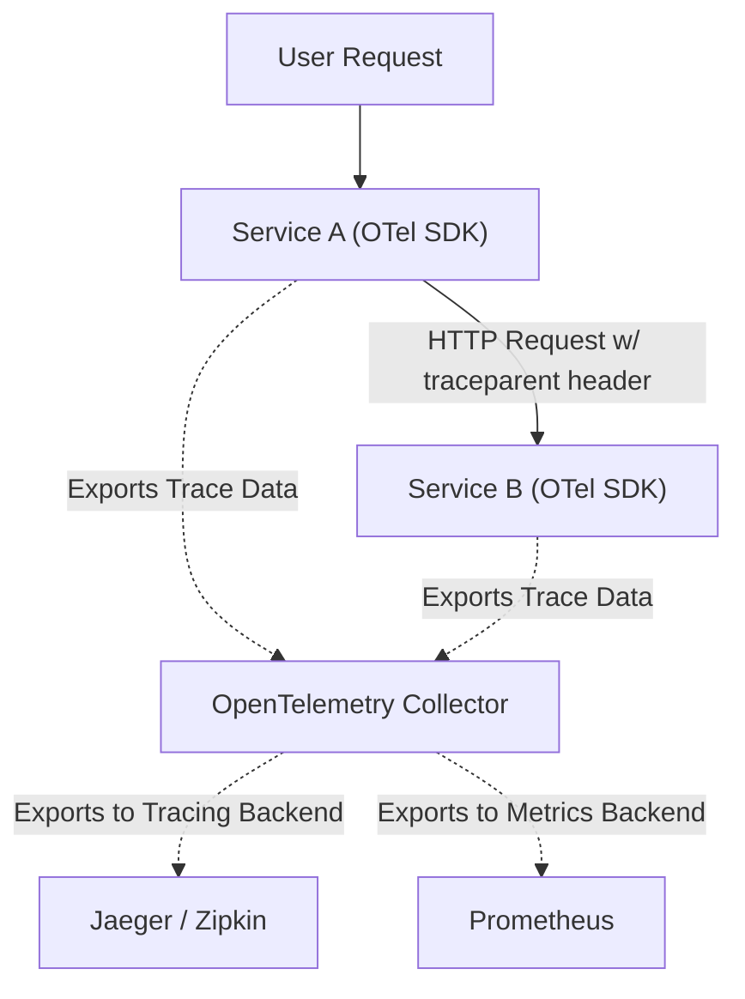

# OpenTelemetry Architecture & Distributed Tracing Fundamentals

Version: 1.0.0

# Lesson Overview

This lesson introduces OpenTelemetry (OTel), the CNCF standard for generating and managing telemetry data (metrics, logs, and traces). We will focus heavily on Distributed Tracing, a critical mechanism for debugging latency and failures across complex microservice architectures. You will learn the anatomy of a trace, context propagation, and how the OpenTelemetry Collector acts as the universal telemetry pipeline.

---

# Learning Objectives

* Define distributed tracing and explain its necessity in microservices.
* Understand the anatomy of a Trace, including Spans, Trace IDs, and Span Context.
* Explain how Context Propagation works across service boundaries (HTTP Headers).
* Describe the architecture of OpenTelemetry, specifically the role of the OTel Collector.
* Understand the difference between instrumentation, collection, and backend storage.

---

# Prerequisites

* Completion of `MOD-OBS-01: The Three Pillars of Observability`.
* Basic understanding of HTTP headers and RESTful API communication.

---

# Why This Exists

Historically, instrumenting applications for observability resulted in vendor lock-in. If you used Jaeger for tracing, you used Jaeger's specific SDKs. If you later wanted to switch to Datadog or New Relic, you had to rewrite all your application code. Furthermore, in a microservices environment where a single user request hits 15 different services, analyzing logs linearly is impossible. OpenTelemetry was created to solve both problems: it provides a single, vendor-neutral standard for instrumenting code, and it standardizes the creation of Distributed Traces, allowing engineers to visualize the exact path and latency of a request as it hops from service to service.

---

# Core Concepts

## The Anatomy of a Trace

A **Trace** represents the complete end-to-end journey of a single request through a distributed system.
A Trace is composed of one or more **Spans**.
*   **Span:** Represents a single logical operation within a trace (e.g., a database query, an HTTP request to another service, or a function execution).
*   **Trace ID:** A globally unique identifier for the entire trace. Every span in the trace shares this ID.
*   **Span ID:** A unique identifier for the specific span.
*   **Parent Span ID:** If a span was triggered by another span, it records the parent's ID, creating a tree-like hierarchy (the "waterfall" view).

## Context Propagation

For distributed tracing to work, the `Trace ID` and `Parent Span ID` must travel with the request as it jumps from Service A to Service B. This is called **Context Propagation**.
In HTTP, this is almost always done by injecting standardized HTTP Headers (like the W3C `traceparent` header) into the outgoing request. Service B extracts this header, adopts the Trace ID, and creates its own Spans as children of Service A's Span.

## OpenTelemetry (OTel) Architecture

OTel is not a backend database (like Prometheus or Jaeger); it is a telemetry *pipeline*.
1.  **OTel SDKs:** Libraries integrated into application code (Java, Python, Go, etc.) to generate traces, metrics, and logs.
2.  **OTel Collector:** A vendor-agnostic proxy that receives telemetry data, processes it (batches, filters, scrubs sensitive data), and exports it to one or multiple backends (e.g., sending metrics to Prometheus, traces to Jaeger, and logs to Elasticsearch simultaneously).

---

# Architecture



---

# Real-World Example

Imagine an e-commerce checkout flow. A user clicks "Buy."
1.  The API Gateway receives the request. The OTel SDK generates a `Trace ID: 123` and a `Span ID: A`.
2.  The Gateway calls the Inventory Service over HTTP. It injects the header: `traceparent: 00-123-A-01`.
3.  The Inventory Service reads the header, keeps `Trace ID: 123`, creates `Span ID: B`, and sets its Parent ID to `A`. It queries a database (`Span ID: C`, Parent `B`).
4.  If the database query takes 5 seconds, an engineer looking at the tracing backend (like Jaeger) will see a visual timeline showing exactly where the 5 seconds were spent, instantly ruling out network lag or gateway issues.

---

# Hands-on Demonstration

Let's visualize W3C Context Propagation.

**Input (Service A outgoing request to Service B):**
Service A is executing a span with Trace ID `4bf92f3577b34da6a3ce929d0e0e4736` and Span ID `00f067aa0ba902b7`.

**Code Execution (HTTP Client inside Service A):**
The OpenTelemetry HTTP client interceptor automatically injects the W3C header before sending the request.

**Expected Output (HTTP Request Headers):**
```http
POST /api/inventory HTTP/1.1
Host: inventory-service:8080
traceparent: 00-4bf92f3577b34da6a3ce929d0e0e4736-00f067aa0ba902b7-01
```
*Explanation:*
* `00` is the version.
* `4bf9...` is the Trace ID.
* `00f0...` is the Parent Span ID (Service A's span).
* `01` means the trace is sampled (recorded).
Service B will parse this string to continue the trace.

---

# Hands-on Lab

* **Objective:** Run an OpenTelemetry Collector and view a trace in Jaeger.
* **Estimated Time:** 20 minutes
* **Difficulty:** Intermediate
* **Environment:** A local machine with Docker.

## Step-by-step Instructions

1.  **Create OTel Collector Config (`otel-collector-config.yaml`):**
    ```yaml
    receivers:
      otlp:
        protocols:
          grpc:
          http:
    exporters:
      jaeger:
        endpoint: "jaeger:14250"
        tls:
          insecure: true
      logging:
        loglevel: debug
    service:
      pipelines:
        traces:
          receivers: [otlp]
          exporters: [logging, jaeger]
    ```

2.  **Create `docker-compose.yml`:**
    ```yaml
    version: '3'
    services:
      jaeger:
        image: jaegertracing/all-in-one:latest
        ports:
          - "16686:16686"
          - "14250:14250"
      otel-collector:
        image: otel/opentelemetry-collector:latest
        command: ["--config=/etc/otel-collector-config.yaml"]
        volumes:
          - ./otel-collector-config.yaml:/etc/otel-collector-config.yaml
        ports:
          - "4317:4317" # OTLP gRPC
          - "4318:4318" # OTLP HTTP
        depends_on:
          - jaeger
    ```

3.  **Run the stack:** `docker-compose up -d`

4.  **Simulate a Trace (using curl and the OTLP HTTP receiver):**
    *In a real scenario, your application's OTel SDK does this.*
    ```bash
    curl -X POST http://localhost:4318/v1/traces \
      -H "Content-Type: application/json" \
      -d '{
        "resourceSpans": [{
          "scopeSpans": [{
            "spans": [{
              "traceId": "5B8EFFF798038103D269B633813FC60C",
              "spanId": "EEE19B7EC3C1B174",
              "name": "manual-test-span",
              "startTimeUnixNano": "1698300000000000000",
              "endTimeUnixNano": "1698300005000000000"
            }]
          }]
        }]
      }'
    ```

5.  **Verify:** Open Jaeger UI at `http://localhost:16686`. Search for traces. You should see `manual-test-span` with a 5-second duration.

## Cleanup

Run `docker-compose down`.

---

# Production Notes

*   **Auto-Instrumentation vs. Manual:** OTel provides "auto-instrumentation" agents (e.g., a Java JAR wrapper) that require zero code changes and automatically trace HTTP frameworks and DB drivers. Manual instrumentation requires writing code to create custom spans. Start with auto, then add manual for specific business logic.
*   **Sampling:** Storing 100% of traces for high-traffic services is cost-prohibitive. Implement "Head-based sampling" (e.g., record 5% of all requests randomly at the gateway) or "Tail-based sampling" (record 100% of errors and slow requests, drop successful fast ones). The OTel Collector handles tail-based sampling effectively.
*   **The Collector pattern:** Always deploy an OTel Collector agent on every Kubernetes node (as a DaemonSet). Applications should send data to `localhost:4317`. The local collector then forwards it to a central cluster of collectors.

---

# Common Mistakes

*   **Breaking the Trace Context:** If a developer spawns a background thread or a Kafka message from an HTTP request but fails to manually pass the OpenTelemetry context object into that new thread/message, the trace breaks. You will see two disconnected traces instead of one continuous journey.
*   **Using Vendor-Specific SDKs:** Writing Jaeger-specific or Datadog-specific code in your application. Always use the standard OpenTelemetry API. The OTel Collector handles the translation to the vendor backend.

---

# Failure-Driven Learning

You configure a distributed tracing pipeline, but when looking at Jaeger, all traces stop at the API Gateway. No backend microservices are showing up in the trace waterfalls.
1.  **Failure:** The trace context is not propagating.
2.  **Diagnosis:** You inspect the network traffic between the API Gateway and the backend services. You notice the `traceparent` HTTP header is missing.
3.  **Correction:** You discover the NGINX proxy between the services is configured to strip unknown HTTP headers for security reasons. You update the NGINX configuration to explicitly allow and forward the `traceparent` and `tracestate` W3C headers. The traces immediately link up.

---

# Engineering Decisions

When deploying the OpenTelemetry Collector, you must decide between two primary architectures:
*   **Agent Deployment (DaemonSet):** A collector runs on every VM/Node. Applications send telemetry to `localhost`. *Trade-off:* Very low latency and reliable, but harder to do global aggregation (like tail-based sampling).
*   **Gateway Deployment (Standalone Cluster):** Applications send telemetry over the network to a central load-balanced cluster of collectors. *Trade-off:* Allows complex global processing and tail-based sampling, but introduces a network hop and a potential single point of failure.
*   **Best Practice:** Use both. An Agent on the node forwards to a central Gateway cluster, which then exports to the database.

---

# Best Practices

*   **Baggage:** OTel supports "Baggage"—arbitrary key/value pairs that propagate alongside the Trace ID (e.g., `customer_tier=premium`). This is incredibly powerful for analyzing tracing data by business segments.
*   **Standardize Attributes:** When adding custom tags (attributes) to spans, follow the OpenTelemetry Semantic Conventions (e.g., use `http.status_code` instead of `response_code`). This ensures dashboards and tools understand the data.

---

# Troubleshooting Guide

## Issue 1: Missing Spans in a Trace

*   **Cause:** Context propagation failure, sampling configuration dropping the trace mid-flight, or a clock synchronization issue (NTP).
*   **Diagnosis:**
    1.  Check the sampling rate on the missing service. Is it set to 1% while the upstream is at 100%?
    2.  Check HTTP headers leaving the upstream service and arriving at the downstream service to verify the `traceparent` exists.
    3.  Check the server clocks. If Service B's clock is 5 minutes behind Service A, Jaeger might render the trace incorrectly or drop it.
*   **Solution:** Align sampling strategies (usually driven by the head/gateway), ensure reverse proxies forward trace headers, and ensure NTP is running on all nodes.

---

# Summary

OpenTelemetry has revolutionized observability by providing a vendor-agnostic standard for generating and routing telemetry data. Distributed tracing, powered by context propagation via HTTP headers, is essential for visualizing the complex interactions and latency bottlenecks within microservice architectures. The OTel Collector acts as the central nervous system, routing this data to appropriate storage backends.

---

# Cheat Sheet

*   **Trace:** The complete end-to-end transaction.
*   **Span:** A single unit of work within a trace.
*   **Context Propagation:** Passing the Trace ID between services (usually via W3C `traceparent` header).
*   **OTel SDK:** Application library for generating data.
*   **OTel Collector:** Proxy for processing and routing data.

---

# Knowledge Check

## Multiple Choice Questions

1. Which of the following is responsible for passing a Trace ID from Service A to Service B over an HTTP connection?
   * A) The OpenTelemetry Collector
   * B) Context Propagation (via HTTP Headers)
   * C) Prometheus Scrape Configurations
   * D) Jaeger UI

2. What is the primary benefit of the OpenTelemetry Collector?
   * A) It stores tracing data indefinitely.
   * B) It is a high-performance time-series database.
   * C) It provides vendor lock-in to CNCF projects.
   * D) It allows you to receive, process, and export telemetry data to multiple different backends without changing application code.

## Scenario Questions

You have a microservice that reads a message from a RabbitMQ queue and saves it to a database. You notice that the HTTP request that published the message and the database save operation appear as two entirely separate traces in Jaeger. How do you fix this so they appear as one continuous trace?

## Short Answer Questions

What is the difference between "Head-based sampling" and "Tail-based sampling" in distributed tracing?

<details>
<summary><b>View Answers</b></summary>

### Multiple Choice
1. **[B]** - *Context Propagation is the mechanism of injecting the trace context (like the W3C traceparent header) into the outbound HTTP request so the downstream service can extract it and join the trace.*
2. **[D]** - *The Collector acts as a vendor-agnostic pipeline. Applications send data to the Collector once, and the Collector can route it to Jaeger, Datadog, Splunk, etc., simultaneously.*

### Scenario
*The trace context must be propagated through the message queue. When publishing the message to RabbitMQ, the OpenTelemetry context (Trace ID) must be injected into the message headers/metadata. When consuming the message, the worker service must extract the Trace ID from the message metadata and use it as the parent for its database span.*

### Short Answer
*Head-based sampling makes the decision to record or drop a trace at the very beginning of the request (e.g., at the API Gateway) usually based on a random percentage. Tail-based sampling makes the decision at the very end of the trace, allowing the system to inspect the full trace and choose to keep it if it contains errors or high latency, even if the overall sampling rate is low.*

</details>

---

# Interview Preparation

## Beginner Questions

* What is the difference between a Trace and a Span?
* What is OpenTelemetry?

## Intermediate Questions

* Explain how W3C Trace Context works in an HTTP request.
* Why is auto-instrumentation often preferred over manual instrumentation as a starting point?

## Advanced Questions

* Explain the architecture of an OpenTelemetry Collector pipeline (Receivers, Processors, Exporters).
* How would you architect a tracing system that handles 100,000 requests per second but ensures 100% of all error traces are captured for debugging?

## Scenario-Based Discussions

* Your team wants to migrate from New Relic to Datadog for tracing. Historically, this meant months of rewriting application code. How does OpenTelemetry change this migration scenario?

<details>
<summary><b>View Answers</b></summary>

### Beginner
* **What is the difference...:** A trace represents the entire lifecycle of a request as it moves through multiple systems. A span is a single, logical block of work within that trace (like a single database query or a single function execution).
* **What is OpenTelemetry...:** An open-source, CNCF-backed framework and standard for generating, collecting, and exporting telemetry data (metrics, logs, traces) in a vendor-agnostic way.

### Intermediate
* **Explain how W3C Trace Context...:** It standardizes how trace information is passed between services. It defines a standard HTTP header `traceparent` which contains the version, Trace ID, Parent Span ID, and sampling flags. When Service A calls Service B, it injects this header.
* **Why is auto-instrumentation...:** Auto-instrumentation (via bytecode manipulation in Java or monkey-patching in Python) requires zero code changes from developers. It instantly provides baseline tracing for HTTP frameworks and database drivers, delivering immediate value without engineering effort.

### Advanced
* **Explain the architecture of an OpenTelemetry Collector...:** The pipeline has three stages. Receivers ingest data in various formats (OTLP, Jaeger, Prometheus). Processors manipulate the data in-flight (batching, adding metadata, sampling, filtering PII). Exporters send the processed data to the final storage backends (Datadog, Jaeger, Elasticsearch).
* **How would you architect a tracing system...:** At 100k RPS, head-based sampling will drop too many errors, and keeping 100% of traces is too expensive. I would use Tail-based sampling. Applications send 100% of traces to a central cluster of OpenTelemetry Collectors. The collectors hold the traces in memory for a short window. A tail-sampling processor evaluates the complete trace; if it sees an HTTP 500 or high latency, it exports it to storage. Otherwise, it drops the trace.

### Scenario-Based Discussions
* **Your team wants to migrate from New Relic...:** If the applications were instrumented using the standard OpenTelemetry SDKs, no application code needs to change. The migration is purely an infrastructure configuration change. I would simply update the OpenTelemetry Collector configuration to change the exporter from `newrelic` to `datadog` (along with the API keys), restart the Collector, and the data immediately flows to the new vendor.

</details>

---

# Further Reading

1. [OpenTelemetry Official Documentation](https://opentelemetry.io/docs/)
2. [W3C Trace Context Specification](https://www.w3.org/TR/trace-context/)
3. [Mastering Distributed Tracing (Book by Yuri Shkuro - Creator of Jaeger)](https://www.packtpub.com/product/mastering-distributed-tracing/9781788628464)
