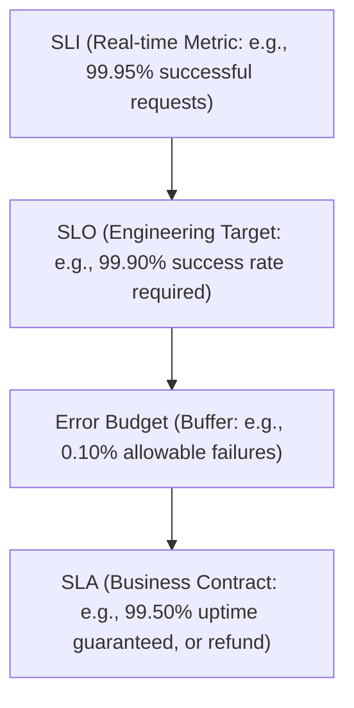

# MOD-SRE-01: SLIs, SLOs, SLAs & Error Budget Calculations

Version: 1.0.0

Purpose: Canonical lesson structure for Platform Engineering & AI Infrastructure Curriculum.

Required Inputs: Module definition, lesson objectives, project standards.

Outputs: Standards-compliant lesson markdown.


# Lesson Overview

This lesson introduces the foundational metrics of Site Reliability Engineering (SRE): Service Level Indicators (SLIs), Service Level Objectives (SLOs), Service Level Agreements (SLAs), and Error Budgets. You will learn how to measure system reliability mathematically, balance feature velocity with stability, and bridge the gap between engineering metrics and business goals.

---

# Learning Objectives

* Define and differentiate between SLIs, SLOs, SLAs, and Error Budgets.
* Select appropriate SLIs for different types of services (e.g., request-driven vs. batch processing).
* Calculate Error Budgets and apply them to decision-making processes.
* Design an SLO that balances customer happiness with engineering reality.

---

# Prerequisites

* Basic understanding of distributed systems and microservices.
* Familiarity with observability concepts (metrics and monitoring).
* Completion of Stage 5 Observability modules (MOD-OBS).

---

# Why This Exists

In traditional IT, the Operations team was incentivized to keep systems stable (meaning no changes), while the Development team was incentivized to ship features rapidly (meaning many changes). This created a fundamental conflict of interest. Google introduced the concept of Site Reliability Engineering (SRE) to resolve this tension. By using data-driven metrics like SLOs and Error Budgets, engineering teams can mathematically determine when it is safe to ship features and when they must halt deployments to focus on reliability.

---

# Core Concepts

## Service Level Indicator (SLI)
An SLI is a carefully chosen, quantitative measure of some aspect of the level of service that is provided. It is the "real-world" measurement of your system's behavior, usually represented as a ratio of "good" events to "total" events.
Common SLIs include:
* **Availability:** The proportion of successful requests (e.g., HTTP 2xx) out of total requests.
* **Latency:** The proportion of requests completed below a specific time threshold (e.g., < 200ms).
* **Throughput:** The data processing rate.

## Service Level Objective (SLO)
An SLO is a target value or range of values for a service level that is measured by an SLI. It represents the "acceptable" level of reliability that keeps customers happy without demanding impossible perfection. 
For example, if your SLI is the percentage of successful HTTP requests, your SLO might be "99.9% of all HTTP requests must return a 2xx status code over a 30-day window."

## Service Level Agreement (SLA)
An SLA is an explicit or implicit contract with your users that includes consequences of meeting (or missing) the SLOs they contain. SLAs are business agreements, often crafted by lawyers and product managers, and involve financial penalties or service credits if violated. SREs care about SLAs only insofar as they dictate the strictness of the SLOs (the SLO should always be stricter than the SLA to provide a buffer).

## Error Budgets
An Error Budget is simply 1 minus the SLO. If your SLO is 99.9% availability, your error budget is 0.1%. It represents the allowable amount of unreliability your service is permitted to have over a given window. This budget is "spent" by expected downtime (deployments, planned maintenance) and unexpected downtime (incidents, bugs). When the error budget is depleted, feature launches are frozen, and the team must focus entirely on reliability.

---

# Architecture



---

# Real-World Example

Netflix operates with strict SLOs to ensure uninterrupted streaming for millions of concurrent users. Instead of aiming for 100% uptime (which is technically impossible and economically ruinous), they might set an SLO of 99.99% for their video playback service. This gives them an error budget of 0.01% (about 4.3 minutes of allowable downtime per month). Netflix uses this error budget to push thousands of updates a day and run Chaos Engineering experiments. If the error budget approaches depletion, automated systems halt deployments, forcing engineers to prioritize stability until the rolling 30-day window recovers.

---

# Hands-on Demonstration

Let's calculate an Error Budget for a web application over a 30-day window.

**Inputs:**
* Total requests in 30 days: 10,000,000
* SLO: 99.9% availability

**Code / Calculation:**
```python
total_requests = 10000000
slo = 0.999
error_budget_percentage = 1.0 - slo

# Calculate allowed failed requests
allowed_failures = total_requests * error_budget_percentage

print(f"Error Budget: {error_budget_percentage * 100:.1f}%")
print(f"Allowed failed requests per month: {int(allowed_failures)}")
```

**Expected Output:**
```
Error Budget: 0.1%
Allowed failed requests per month: 10000
```

**Explanation:**
The team has a budget of 10,000 failed requests for the month. If a bad deployment causes 5,000 failed requests, they have burned 50% of their error budget. If they exceed 10,000 failures, all feature deployments must stop.

---

# Hands-on Lab

* **Objective:** Define and calculate SLIs, SLOs, and Error Budgets using synthetic Prometheus metrics.
* **Estimated Time:** 30 minutes
* **Difficulty:** Beginner
* **Environment:** Local terminal with Docker installed.

## Step-by-step Instructions

1. **Deploy a mock application with Prometheus metrics:**
   Create a `docker-compose.yml` that runs Prometheus and a simple mock web server that randomly fails 0.5% of the time. (For this lab, we will simulate the math via bash).
2. **Calculate Monthly Uptime Allowances:**
   Write a bash script `calculate_budget.sh` to determine downtime allowances based on different "nines" of reliability.
   ```bash
   cat << 'EOF' > calculate_budget.sh
   #!/bin/bash
   # Calculate allowed downtime in minutes per 30-day month
   
   MINUTES_IN_MONTH=$((30 * 24 * 60))
   
   for nines in 99.0 99.9 99.99 99.999; do
       BUDGET=$(echo "scale=4; 100 - $nines" | bc)
       DOWNTIME=$(echo "scale=2; ($BUDGET / 100) * $MINUTES_IN_MONTH" | bc)
       echo "SLO: $nines% -> Error Budget: $BUDGET% -> Allowed Downtime: $DOWNTIME minutes/month"
   done
   EOF
   chmod +x calculate_budget.sh
   ```
3. **Execute the script:**
   Run `./calculate_budget.sh`.

## Verification

The output should display the exact downtime limits:
```
SLO: 99.0% -> Error Budget: 1.0% -> Allowed Downtime: 432.00 minutes/month
SLO: 99.9% -> Error Budget: .1% -> Allowed Downtime: 43.20 minutes/month
SLO: 99.99% -> Error Budget: .01% -> Allowed Downtime: 4.32 minutes/month
SLO: 99.999% -> Error Budget: .001% -> Allowed Downtime: .43 minutes/month
```

## Troubleshooting

* **`bc` command not found:** Ensure `bc` (basic calculator) is installed on your Linux environment (`sudo apt install bc`).

## Cleanup

```bash
rm calculate_budget.sh
```

---

# Production Notes

* **Over-achieving is Bad:** If your SLO is 99.9% but your system achieves 99.999%, users will begin to rely on that higher level of reliability (an implicit SLA). If you suddenly drop back to 99.9% (still meeting your SLO), users will perceive it as an outage. SREs sometimes intentionally inject failures to burn excess error budget and prevent users from becoming overly dependent.
* **Alerting on Burn Rate:** Do not alert when the SLO is breached (it's too late). Alert on the *Error Budget Burn Rate*. If the budget is burning at a rate that will exhaust it in 4 hours, page the on-call engineer immediately.

---

# Common Mistakes

* **Aiming for 100%:** 100% reliability is infinitely expensive and stifles all innovation. Every system needs a realistic failure tolerance.
* **SLAs as Engineering Goals:** Engineers should not build systems targeting SLAs. They should target SLOs, which must be stricter than the SLAs to act as an internal buffer.
* **Too Many SLIs:** Tracking 50 different metrics confuses the team. Focus on a few core user journeys (e.g., Login, Checkout, Video Playback).

---

# Failure-Driven Learning

**Scenario:** The team has an SLO of 99.9% availability. Due to a database migration gone wrong, the service is down for 60 minutes.
**Impact:** According to our lab, 99.9% over 30 days allows for only ~43 minutes of downtime. The 60-minute outage completely exhausts the error budget (burn rate > 100%).
**Action:** The team must immediately halt all feature deployments. Development effort pivots entirely to creating automated database rollback scripts and adding read-replicas to prevent this specific failure from happening again. Feature work resumes only when the rolling 30-day window shifts and the budget recovers.

---

# Engineering Decisions

* **Choosing the right measurement window:** Should SLOs be measured over 7 days, 28 days, or 30 days? A rolling 28-day or 30-day window is standard because it smooths out weekly anomalies (weekends vs. weekdays) and aligns with billing cycles.
* **Client-side vs. Server-side measurement:** Measuring latency at the server ignores network transit time. Measuring at the client (browser/mobile app) is more accurate to the user experience but much harder to instrument reliably. Production teams often use a mix of both.

---

# Best Practices

* Always express SLIs as ratios: (Good Events / Total Events) * 100.
* Publish Error Budgets openly across the engineering organization.
* Enforce consequences: An Error Budget is useless if management forces feature deployments even when the budget is empty.
* Tie SLOs directly to User Journeys, not raw infrastructure metrics (CPU utilization is a terrible SLI).

---

# Troubleshooting Guide

## Issue 1: Error Budget depleted but users aren't complaining.

* **Cause:** Your SLO is set too high (too strict), or your SLIs do not accurately reflect the actual user experience.
* **Diagnosis:** Check support tickets and user feedback. If the metrics say the system is "broken" but users are happy, the metrics are wrong.
* **Solution:** Relax the SLO to match user expectations. This frees up engineering time to ship more features.

## Issue 2: Users are complaining, but the SLO is green (met).

* **Cause:** Missing coverage in SLIs. The metrics are blind to a critical failure mode (e.g., the server is returning 200 OK, but the page is rendering blank).
* **Diagnosis:** Compare user complaints against your SLI definitions. Find the blind spot.
* **Solution:** Introduce a new SLI that tracks the missing user journey, or adjust the current SLI to validate payload correctness, not just HTTP status.

---

# Summary

SLIs, SLOs, and Error Budgets are the mathematical foundation of SRE. They provide a shared language for product and engineering teams to balance the competing desires for new features and perfect reliability. By measuring what matters to the user and enforcing budgets, teams can build highly resilient platforms without sacrificing innovation.

---

# Cheat Sheet

* **SLI (Indicator):** What are we measuring? (Good / Total).
* **SLO (Objective):** What is our internal target? (e.g., 99.9%).
* **SLA (Agreement):** What is our legal contract with users? (e.g., 99.5% + refund).
* **Error Budget:** 1 - SLO. The allowance for failure.
* **Rolling Window:** The time frame over which SLOs are calculated (usually 30 days).

---

# Knowledge Check

## Multiple Choice Questions

1. Which of the following is an example of an SLI?
   * A) We guarantee 99.99% uptime to our enterprise customers.
   * B) The percentage of HTTP GET requests that complete in under 200ms.
   * C) We will pause feature deployments if uptime drops below 99%.
   * D) Refunding customers if the database goes down.

2. What is the primary purpose of an Error Budget?
   * A) To allocate financial resources for cloud hosting.
   * B) To track the number of bugs introduced by a specific engineer.
   * C) To balance system reliability with the velocity of feature deployments.
   * D) To guarantee 100% uptime for critical services.

## Scenario Questions

Your team's rolling 30-day Error Budget is depleted on day 15 due to a major network outage. The Product Manager insists on deploying a highly anticipated feature on day 16. How should an SRE respond based on core principles?

## Short Answer Questions

What is the difference between an SLO and an SLA?

<details>
<summary><b>View Answers</b></summary>

### Multiple Choice
1. **[B]** - *It is a quantitative measurement of system behavior (proportion of successful events).*
2. **[C]** - *Error budgets provide a mathematical threshold for when to push features and when to focus on reliability.*

### Scenario
*The SRE should veto the feature deployment. According to Error Budget policy, when the budget is depleted, all non-critical feature deployments must be frozen. The team must dedicate their resources to reliability engineering (e.g., adding redundancy, writing postmortems) until the budget recovers as the 30-day window rolls forward.*

### Short Answer
*An SLO is an internal engineering target used to manage reliability. An SLA is a business contract with customers that involves financial penalties if breached. The SLO must always be stricter than the SLA.*

</details>

---

# Interview Preparation

## Beginner Questions

* What does SRE stand for, and what problem does it solve?
* Define SLI, SLO, and SLA.

## Intermediate Questions

* How do you calculate an Error Budget?
* What actions should an engineering team take when the Error Budget is exhausted?

## Advanced Questions

* Explain the concept of "Error Budget Burn Rate" and how it is used in alerting.
* Why is aiming for 100% availability considered an anti-pattern in SRE?

## Scenario-Based Discussions

* Your monitoring dashboard shows 99.99% availability, but Twitter is full of users complaining that your app is completely broken. What is likely happening, and how do you fix your metrics?

<details>
<summary><b>View Answers</b></summary>

### Beginner
* **What does SRE stand for...:** Site Reliability Engineering. It solves the conflict between developers (who want to ship features) and operations (who want stability) by treating operations as a software engineering problem.
* **Define SLI, SLO, and SLA:** SLI is the metric (Indicator), SLO is the internal goal (Objective), SLA is the legal business contract (Agreement).

### Intermediate
* **How do you calculate...:** Error Budget = 100% - SLO%. Over a time window, this translates to an allowable number of failed requests or minutes of downtime.
* **What actions should...:** Halt all feature deployments. Shift all engineering effort to reliability, bug fixing, and technical debt until the budget recovers.

### Advanced
* **Explain Error Budget Burn Rate...:** It is the rate at which the error budget is being consumed relative to the time window. Alerting on burn rate (e.g., "budget will be exhausted in 4 hours") is far more effective than alerting on raw error rates, as it prevents alert fatigue and focuses on genuine threats to the SLO.
* **Why is aiming for 100%...:** 100% availability requires exponential cost and effort, and slows feature delivery to zero. Furthermore, users cannot perceive 100% availability because the internet path between them and your service has less than 100% reliability itself.

### Scenario-Based Discussions
* **Dashboard shows 99.99% but users complaining...:** Your SLIs are measuring the wrong thing (e.g., the load balancer is returning HTTP 200 OK, but the application is returning a blank HTML page). You must update your SLIs to measure the actual end-to-end user journey, perhaps by implementing synthetic monitoring or checking for specific payload content.

</details>

---

# Further Reading

1. [Google SRE Book - Service Level Objectives](https://sre.google/sre-book/service-level-objectives/)
2. [Google SRE Book - Embracing Risk](https://sre.google/sre-book/embracing-risk/)
3. [The Site Reliability Workbook](https://sre.google/workbook/table-of-contents/)
