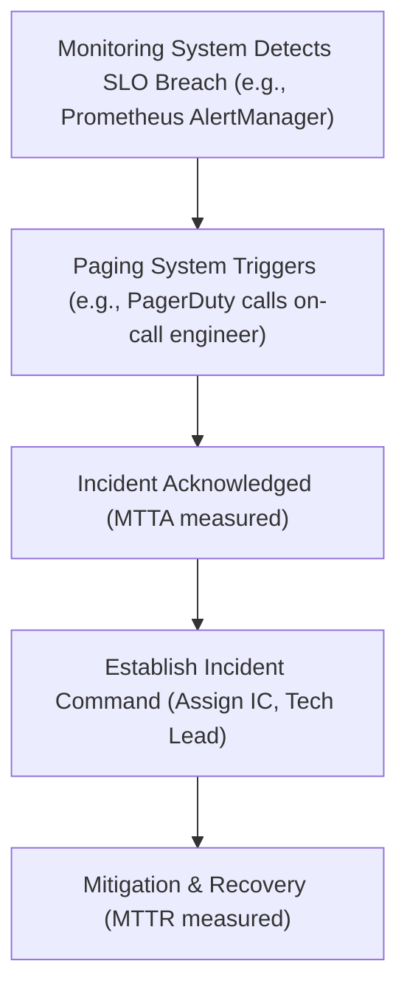

# MOD-SRE-02: Incident Command Management & On-Call Workflows

Version: 1.0.0

Purpose: Canonical lesson structure for Platform Engineering & AI Infrastructure Curriculum.

Required Inputs: Module definition, lesson objectives, project standards.

Outputs: Standards-compliant lesson markdown.


# Lesson Overview

This lesson covers the structured frameworks required to handle severe production outages. You will learn the principles of Incident Command System (ICS) adapted for software engineering, how to establish effective on-call rotations, and the protocols for minimizing Mean Time to Recovery (MTTR) during high-stress operational incidents.

---

# Learning Objectives

* Understand the roles and responsibilities within an Incident Command System (Incident Commander, Tech Lead, Communications Lead).
* Design a sustainable, humane on-call rotation to prevent engineer burnout.
* Execute a structured incident response workflow from initial page to resolution.
* Calculate and interpret MTTA (Mean Time to Acknowledge) and MTTR (Mean Time to Recovery).

---

# Prerequisites

* Completion of MOD-SRE-01 (SLIs, SLOs, SLAs).
* Basic understanding of alerting and monitoring systems.

---

# Why This Exists

When a massive production system goes down, panic and chaos are the natural human responses. Engineers often overwrite each other's work, miscommunicate with stakeholders, or freeze under pressure. The Incident Command System was originally developed by firefighters in the 1970s to coordinate massive emergency responses. SRE adopted these protocols because software outages require the same level of disciplined, hierarchical, and communicative coordination to resolve quickly without causing further damage.

---

# Core Concepts

## The Incident Command System (ICS) Roles
During a major incident, a temporary hierarchy is established to maintain order.
* **Incident Commander (IC):** The ultimate decision-maker. The IC does *not* fix the system; they coordinate the response, make hard choices, and ensure the process moves forward.
* **Tech Lead (Operations Lead):** The primary technical troubleshooter. They execute commands, dive into the code/logs, and coordinate other engineers.
* **Communications Lead:** Responsible for updating stakeholders, writing public status page updates, and keeping the IC insulated from external noise.

## On-Call Workflows & Pager Fatigue
Being "on-call" means being responsible for acknowledging and fixing production alerts outside of normal business hours. If an on-call rotation is noisy (too many false alarms), engineers suffer from "pager fatigue," leading to missed critical alerts and severe burnout. Effective SRE mandates that alerts must be actionable and tied to SLO breaches.

## Incident Metrics
* **MTTA (Mean Time to Acknowledge):** How long it takes an engineer to see the alert and begin working on it.
* **MTTR (Mean Time to Recovery/Resolve):** How long it takes to restore the system to a healthy state after the incident begins.

---

# Architecture



---

# Real-World Example

During a major AWS outage, dozens of dependent services begin failing simultaneously. If the company lacks an Incident Command structure, fifty engineers might jump into a single Slack channel, shouting over one another, while the CEO angrily demands updates. In an SRE-mature company like PagerDuty or Stripe, an IC is immediately declared. The IC creates a dedicated incident bridge (Zoom/Slack). The Communications Lead updates the public status page, and the Tech Lead directs specific engineers to reroute traffic. The IC ensures no one makes unapproved changes, maintaining absolute order until the system stabilizes.

---

# Hands-on Demonstration

Let's simulate the declaration of an incident using a standard chat-ops workflow.

**Inputs:**
* A severe alert fires: "Payment Gateway 500 Errors > 10%".

**Code / Expected Chat-Ops Flow:**
```text
[PagerDuty Bot]: CRITICAL ALERT: Payment Gateway 500 Errors > 10%. Paging @alice.
@alice: Acknowledged. Investigating.
@alice: I am declaring a Sev-1 incident. I am the Incident Commander (IC).
@alice: @bob, I need you as Tech Lead. Please begin checking the API gateway logs.
@alice: @charlie, I need you as Comms Lead. Please draft an internal update for customer support.
@bob: I am Tech Lead. Looking at the logs now.
@charlie: I am Comms Lead. Drafting update.
```

**Explanation:**
Alice explicitly takes control, assigns roles, and establishes the command structure. From this point forward, all technical decisions must be routed through the IC to prevent duplicated or conflicting efforts.

---

# Hands-on Lab

* **Objective:** Define a humane on-call schedule and calculate incident metrics.
* **Estimated Time:** 20 minutes
* **Difficulty:** Beginner
* **Environment:** Python environment (local or web-based).

## Step-by-step Instructions

1. **Calculate Incident Metrics:**
   You are given data for three recent incidents. Write a Python script to calculate the MTTA and MTTR.
   Create a file `calculate_metrics.py`:
   ```python
   incidents = [
       {"id": 1, "alert_time": 0, "ack_time": 5, "resolve_time": 45},
       {"id": 2, "alert_time": 0, "ack_time": 2, "resolve_time": 20},
       {"id": 3, "alert_time": 0, "ack_time": 11, "resolve_time": 85},
   ]
   
   total_mtta = 0
   total_mttr = 0
   
   for inc in incidents:
       total_mtta += (inc["ack_time"] - inc["alert_time"])
       total_mttr += (inc["resolve_time"] - inc["alert_time"])
       
   mtta = total_mtta / len(incidents)
   mttr = total_mttr / len(incidents)
   
   print(f"MTTA: {mtta} minutes")
   print(f"MTTR: {mttr} minutes")
   ```
2. **Execute the script:**
   Run `python3 calculate_metrics.py`.

## Verification

The output should be:
```
MTTA: 6.0 minutes
MTTR: 50.0 minutes
```

## Troubleshooting

* **Syntax Errors:** Ensure proper indentation in the Python script.

## Cleanup

```bash
rm calculate_metrics.py
```

---

# Production Notes

* **The IC is not a Dictator, but a Director:** The IC doesn't tell the Tech Lead *how* to fix the problem; they ask *if* a path is viable, evaluate risks, and give the green light.
* **Handoffs:** Incidents can outlast human stamina. If an incident lasts more than 4-6 hours, the IC must perform a structured handoff to a fresh engineer. Never let an exhausted engineer make critical database decisions.
* **Compensation:** Being on-call is work. Industry best practice dictates that engineers should be compensated for carrying the pager, either through direct pay, time-in-lieu, or baked into base salary expectations.

---

# Common Mistakes

* **Bystander Effect:** Everyone assumes someone else is fixing the problem. Always explicitly declare roles.
* **Executive Swoop-and-Poop:** A CEO or VP jumps into the incident channel and starts asking technical questions, distracting the responders. The IC (or Comms Lead) must politely but firmly redirect executives to a separate status channel.
* **Noisy Pagers:** Paging engineers for CPU spikes that resolve themselves in 2 minutes. Alerts should only page humans if a user-facing SLO is at risk.

---

# Failure-Driven Learning

**Scenario:** A critical alert fires at 2:00 AM. The on-call engineer acknowledges it but falls back asleep. By 3:00 AM, the database is completely corrupted.
**Impact:** MTTA was low, but MTTR was catastrophic. The lack of an automated escalation policy caused a massive outage.
**Action:** Implement Escalation Policies. If an acknowledged alert is not updated or resolved within 15 minutes, the paging system must automatically page the secondary on-call engineer, and eventually the engineering manager. 

---

# Engineering Decisions

* **Follow-the-Sun vs. 24/7 Rotations:** If your team is distributed globally, a "follow-the-sun" model (where engineers only take on-call during their daylight hours) is infinitely superior to waking people up at 3 AM. If the team is localized, a 24/7 rotation is unavoidable, requiring strict rotation limits (e.g., maximum 1 week on-call per month).
* **Mitigation vs. Resolution:** During an incident, the goal is *mitigation* (stopping the bleeding), not *resolution* (finding the perfect code fix). If restarting a server stops the 500 errors, do it. Figure out *why* it crashed later during the postmortem.

---

# Best Practices

* Establish a dedicated, separate communications channel for incidents (e.g., Slack `#incident-1234`).
* Never have a single point of failure in your escalation chain. Always have a primary, secondary, and tertiary on-call.
* Train non-engineers (e.g., support, management) on how the incident command system works so they know how to behave during an outage.

---

# Troubleshooting Guide

## Issue 1: Alerts are being ignored by the team.

* **Cause:** Alert fatigue. The team is overwhelmed by non-actionable, noisy alerts.
* **Diagnosis:** Review the paging history for the last 30 days. Calculate the percentage of pages that required human intervention vs. those that auto-resolved.
* **Solution:** Delete all alerts that do not correlate to SLO breaches. Only page when the Error Budget burn rate is dangerously high.

## Issue 2: Executives are disrupting incident response.

* **Cause:** Lack of communication transparency. Executives panic when they are left in the dark.
* **Diagnosis:** The IC is failing to delegate the Comms Lead role, leaving a vacuum of information.
* **Solution:** Assign a Comms Lead immediately upon declaring an incident. Establish a strict cadence (e.g., updates every 30 minutes) in a designated stakeholder channel.

---

# Summary

Incident Command and On-Call workflows are about managing human psychology during crises as much as managing technology. By establishing clear roles, protecting engineers from burnout, and prioritizing mitigation over deep debugging during an outage, platform teams can dramatically reduce their MTTR and maintain trust with their users.

---

# Cheat Sheet

* **Incident Commander (IC):** Coordinates, communicates, decides. Does NOT type commands.
* **Tech Lead:** Investigates, executes commands, fixes the issue.
* **Comms Lead:** Handles all external and stakeholder communication.
* **MTTA:** Mean Time to Acknowledge.
* **MTTR:** Mean Time to Recovery.
* **Primary Goal during Incident:** Mitigate the impact quickly (stop the bleeding).

---

# Knowledge Check

## Multiple Choice Questions

1. During a major incident, what is the primary role of the Incident Commander?
   * A) To quickly dive into the codebase and fix the bug.
   * B) To write the postmortem document.
   * C) To coordinate the response, make decisions, and assign roles.
   * D) To call customers and apologize for the downtime.

2. Why is "alert fatigue" dangerous in SRE?
   * A) It costs the company too much money in SMS fees.
   * B) Engineers become desensitized to pages and may ignore a critical, real alert.
   * C) It causes the monitoring servers to crash.
   * D) It prevents the calculation of MTTR.

## Scenario Questions

A database index corruption causes the main application to go down. The Tech Lead says, "I can run a full rebuild, but it will take 4 hours. Or, I can restore from a backup taken 10 minutes ago, which will take 15 minutes, but we lose 10 minutes of user data." Who makes the decision on which path to take?

## Short Answer Questions

Explain the difference between mitigation and resolution in the context of an incident.

<details>
<summary><b>View Answers</b></summary>

### Multiple Choice
1. **[C]** - *The IC manages the incident process; they do not perform technical fixes.*
2. **[B]** - *When pagers go off constantly for non-issues, human psychology leads engineers to start ignoring them, leading to delayed responses for actual emergencies.*

### Scenario
*The Incident Commander (IC) makes this decision, often in consultation with business stakeholders. The Tech Lead provides the options and the technical trade-offs, but the IC must weigh the business impact (4 hours of total downtime vs. 10 minutes of data loss) and make the final call.*

### Short Answer
*Mitigation stops the immediate pain (e.g., rolling back a bad deployment to restore service). Resolution is the long-term fix to ensure the problem never happens again (e.g., rewriting the deployment script to catch the error before it ships).*

</details>

---

# Interview Preparation

## Beginner Questions

* What are the three primary roles in an Incident Command System?
* What do MTTA and MTTR stand for?

## Intermediate Questions

* How do you balance the need for 24/7 coverage with preventing engineer burnout?
* What makes a "good" alert versus a "bad" alert?

## Advanced Questions

* Explain how you would manage an executive who is aggressively demanding answers in the middle of a Sev-1 incident.
* How do you handle an incident where the Incident Commander is clearly exhausted and making poor decisions?

## Scenario-Based Discussions

* You are the on-call engineer. At 4:00 AM, you get paged for high CPU usage on a background worker node. The service is not user-facing, and the CPU drops back to normal after 5 minutes. Walk me through your actions.

<details>
<summary><b>View Answers</b></summary>

### Beginner
* **Three roles:** Incident Commander (IC), Tech Lead, Communications Lead.
* **MTTA / MTTR:** Mean Time to Acknowledge / Mean Time to Recovery.

### Intermediate
* **Balance 24/7 coverage:** Implement follow-the-sun rotations if globally distributed. If local, enforce strict limits on on-call frequency (e.g., no more than 1 week a month), ensure compensatory time off, and aggressively tune out noisy alerts.
* **Good vs. Bad alert:** A good alert is actionable, urgent, and tied directly to a user-facing SLO breach. A bad alert requires no human intervention, self-resolves, or tracks irrelevant internal metrics (like CPU usage without impact).

### Advanced
* **Managing executives:** As IC or Comms Lead, acknowledge their presence, firmly inform them that all resources are currently dedicated to mitigation, and direct them to a specific stakeholder channel where they will receive guaranteed updates every 15/30 minutes. Do not engage in technical debates during the incident.
* **Exhausted IC:** Anyone on the call can suggest an IC handoff. A fresh engineer should explicitly state, "I am taking over as IC," followed by a brief status sync. The exhausted IC must then drop off the bridge to sleep.

### Scenario-Based Discussions
* **4:00 AM High CPU page:** I would acknowledge the alert. Because it auto-resolved and had no user impact, no immediate action is needed. During business hours the next day, I would open a ticket to investigate the spike, and more importantly, modify the alerting rules to prevent paging humans at 4 AM for non-user-facing, self-resolving infrastructure metrics.

</details>

---

# Further Reading

1. [PagerDuty Incident Response Documentation](https://response.pagerduty.com/)
2. [Google SRE Book - Managing Incidents](https://sre.google/sre-book/managing-incidents/)
3. [FEMA Incident Command System (ICS) Origins](https://training.fema.gov/emiweb/is/icsresource/assets/reviewmaterials.pdf)
