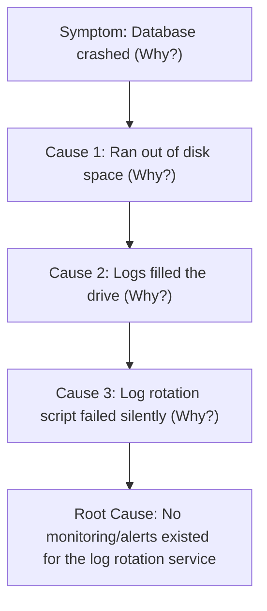

# MOD-SRE-03: Structured Blameless Postmortems & Root Cause Analysis (RCA)

Version: 1.0.0

Purpose: Canonical lesson structure for Platform Engineering & AI Infrastructure Curriculum.

Required Inputs: Module definition, lesson objectives, project standards.

Outputs: Standards-compliant lesson markdown.


# Lesson Overview

This lesson explores how engineering organizations learn from failure. You will learn how to write structured, blameless postmortems, conduct rigorous Root Cause Analysis (RCA) using techniques like the "5 Whys," and foster a culture where mistakes are treated as systemic flaws rather than human errors.

---

# Learning Objectives

* Define the core philosophy and psychological safety requirements of a blameless postmortem.
* Structure a postmortem document including timeline, impact, root cause, and action items.
* Apply the "5 Whys" methodology to traverse from a superficial symptom to a systemic root cause.
* Differentiate between human error and systemic failure in complex systems.

---

# Prerequisites

* Completion of MOD-SRE-02 (Incident Command).
* Understanding of basic system architecture and deployment pipelines.

---

# Why This Exists

In traditional IT, when a system crashed, management sought to find out *who* caused it in order to punish or fire them. This "blame culture" resulted in engineers hiding their mistakes, sweeping near-misses under the rug, and refusing to innovate out of fear. SRE recognizes that complex systems are inherently flawed and that humans will always make mistakes. The Blameless Postmortem framework exists to extract maximum learning from expensive outages by focusing on *how* the system allowed the failure to happen, rather than *who* triggered it.

---

# Core Concepts

## Blamelessness and Psychological Safety
A postmortem is "blameless" when it assumes that everyone involved in an incident had good intentions and made the best decisions they could with the information available to them at the time. You cannot fire your way to reliability. If a junior engineer can bring down production with a single mistyped command, the problem is not the engineer; the problem is the lack of guardrails in the system.

## The Postmortem Document Structure
A canonical postmortem contains:
1. **Summary:** 2-3 sentences explaining what happened.
2. **Impact:** The quantifiable business impact (e.g., "10,000 customers could not log in for 45 minutes").
3. **Timeline:** A minute-by-minute breakdown of the incident (Detection, Mitigation, Resolution).
4. **Root Cause Analysis:** The deep technical reason the failure occurred.
5. **Action Items:** Concrete, prioritized engineering tasks to prevent recurrence.

## Root Cause Analysis (RCA) & The "5 Whys"
RCA is the process of peeling back the layers of a failure. The "5 Whys" is an iterative interrogative technique used to explore the cause-and-effect relationships underlying a particular problem. The goal is to keep asking "Why?" until you hit a systemic process, tooling, or architectural flaw.

---

# Architecture



---

# Real-World Example

In 2017, an engineer at GitLab accidentally deleted the primary production database directory instead of a staging directory. The site went down for hours, and data was lost. GitLab did not fire the engineer. Instead, they published a highly transparent, blameless postmortem. They identified that their terminal prompts for staging and production looked identical (systemic flaw), and that 5 different backup mechanisms all silently failed (architectural flaw). By focusing on the system, GitLab fixed their backup architecture and earned massive trust from the developer community.

---

# Hands-on Demonstration

Let's walk through drafting an Action Item based on a Root Cause Analysis.

**Inputs:**
* **Root Cause:** The system allowed an engineer to deploy un-tested code directly to the `main` branch, bypassing CI/CD, which brought down production.

**Code / Bad Action Item:**
```markdown
- Tell engineers to stop pushing directly to main.
- Write a wiki page about deployment rules.
```

**Code / Good Action Item:**
```markdown
- Implement Branch Protection rules in GitHub requiring at least 1 approving review and passing CI status checks before merging to `main`. (Owner: @alice, Priority: High)
- Remove raw push access to `main` for all developers except the break-glass admin account. (Owner: @bob, Priority: High)
```

**Explanation:**
The "Bad" action items rely on human memory and compliance, which will inevitably fail again. The "Good" action items rely on systemic constraints and automation to make the failure mode impossible.

---

# Hands-on Lab

* **Objective:** Conduct a "5 Whys" analysis and generate systemic action items.
* **Estimated Time:** 15 minutes
* **Difficulty:** Beginner
* **Environment:** Markdown editor or whiteboard.

## Step-by-step Instructions

1. **Review the Incident:** 
   * Symptom: At 9:00 AM on Black Friday, the checkout service crashed due to an Out of Memory (OOM) error, costing $50k in lost sales.
2. **Perform the 5 Whys Analysis:**
   Create a markdown file `postmortem.md` and document the chain:
   ```markdown
   1. Why did the checkout service crash? 
      * Because it ran out of memory (OOMKilled by Kubernetes).
   2. Why did it run out of memory?
      * Because a new caching library introduced a memory leak.
   3. Why was a memory leak deployed to production?
      * Because the load testing suite didn't catch it.
   4. Why didn't the load testing suite catch it?
      * Because the load test only runs for 5 minutes, and the leak takes 2 hours to manifest under load.
   5. Why does the load test only run for 5 minutes?
      * Because it blocks the CI pipeline, and developers wanted faster feedback.
   ```
3. **Generate Action Items:**
   ```markdown
   * Action Item 1: Separate the long-running endurance load tests from the main CI pipeline and run them asynchronously on a nightly basis.
   * Action Item 2: Implement a Kubernetes Vertical Pod Autoscaler (VPA) in dry-run mode to detect memory anomalies before OOM kills occur.
   ```

## Verification

Review the action items. Do they rely on human behavior ("tell developers to test better"), or do they change the system? If they change the system, the lab is successful.

## Troubleshooting

* If you get stuck at a "Why", ask yourself: "What was the mechanism that allowed this state to exist?"

## Cleanup

```bash
rm postmortem.md
```

---

# Production Notes

* **Publish Promptly:** A postmortem should be completed and reviewed within 48-72 hours of the incident. Waiting weeks guarantees that crucial details will be forgotten.
* **The "Human Error" Fallacy:** Human error is a symptom, never a root cause. If human error is listed as the root cause, the investigation stopped too early.
* **Prioritization:** Action items from a Sev-1 postmortem should take precedence over planned product feature work. If you don't fix the hole in the boat, you shouldn't be focused on painting the deck.

---

# Common Mistakes

* **Naming and Shaming:** Using phrases like "Bob forgot to check the logs" or "Alice deployed bad code." Use role-based or passive language: "The deployment script was executed without log verification."
* **Action Item Overload:** Creating 50 action items that will never be completed. Stick to 3-5 high-impact, systemic fixes.
* **Confusing Mitigation with Root Cause:** Restarting the server is a mitigation. Finding out *why* the server needed restarting is the root cause.

---

# Failure-Driven Learning

**Scenario:** An engineer accidentally deletes the production database. The postmortem concludes: "Root Cause: Engineer carelessness. Action Item: Engineer must be more careful in the future."
**Impact:** A month later, a different engineer makes the exact same mistake. The system is still fragile, and now engineers are terrified to touch the database.
**Action:** Rewrite the postmortem blamelessly. "Root Cause: Production database credentials were available in the staging environment, and no deletion-protection was enabled on the RDS instance. Action Item: Enable deletion-protection via Terraform and rotate all staging credentials."

---

# Engineering Decisions

* **Public vs. Internal Postmortems:** Many companies (Cloudflare, GitHub) publish postmortems publicly. This builds immense customer trust. If you hide outages, customers assume you are incompetent. If you transparently explain how you will fix the system, customers trust your engineering rigor.
* **Tooling for Postmortems:** Do not use Word documents scattered across drives. Use a centralized knowledge base (Confluence, Notion, or dedicated tools like Jeli) so that historical incidents are searchable.

---

# Best Practices

* Start the postmortem document *during* the incident. Have the Comms Lead drop timeline links and metrics into a draft while they are happening.
* Always include graphs and charts from your observability tools in the document.
* Hold a synchronous Postmortem Review Meeting to discuss the findings, ensuring management signs off on the engineering time required for the action items.

---

# Troubleshooting Guide

## Issue 1: Action items are not being completed.

* **Cause:** Action items are not tracked in the main engineering backlog (Jira/Linear) and lack executive sponsorship.
* **Diagnosis:** Check the status of action items from incidents 3 months ago. If they are ignored, the process is failing.
* **Solution:** Tie error budgets to action items. If critical action items are pending for more than 14 days, the error budget is considered artificially depleted, and feature freezes take effect.

## Issue 2: Engineers are defensive during postmortem meetings.

* **Cause:** The culture is not actually blameless; subtle punishment or judgment is occurring.
* **Diagnosis:** Listen to the language used in the meeting. Are managers asking "Who did this?" instead of "How did this happen?"
* **Solution:** The meeting facilitator must ruthlessly police language. Reframe questions immediately to focus on the system, the tooling, and the automation.

---

# Summary

Blameless postmortems are the mechanism by which organizations convert downtime into reliability. By rigorously applying Root Cause Analysis and focusing purely on systemic, architectural, and procedural flaws, SRE teams ensure that the same outage never happens twice.

---

# Cheat Sheet

* **Blamelessness:** Assuming good intent; focusing on the system, not the human.
* **Root Cause:** The fundamental systemic flaw that allowed the failure.
* **5 Whys:** Iterative questioning technique to find the root cause.
* **Action Items:** Must be actionable, assigned to an owner, prioritized, and focus on systemic changes (not behavioral requests).

---

# Knowledge Check

## Multiple Choice Questions

1. What is the fundamental premise of a blameless postmortem?
   * A) No one is allowed to be fired, regardless of malicious intent.
   * B) Humans will make mistakes, so systems must be designed to absorb or prevent them.
   * C) The postmortem document should not contain any names or timestamps.
   * D) Outages are acceptable as long as a document is written afterward.

2. Which of the following is a high-quality Action Item?
   * A) "Remind the QA team to test database migrations more thoroughly."
   * B) "Create a wiki page explaining how the deploy script works."
   * C) "Implement a CI check that dry-runs database migrations and fails the build if destructive changes are detected."
   * D) "Ensure engineers are more careful when typing commands in production."

## Scenario Questions

During an RCA, the team identifies that a junior engineer bypassed the CI pipeline to push a hotfix, which subsequently broke the application. Management wants to write an action item to formally reprimand the engineer. As an SRE, how do you redirect this outcome?

## Short Answer Questions

Explain why "Human Error" is not an acceptable Root Cause.

<details>
<summary><b>View Answers</b></summary>

### Multiple Choice
1. **[B]** - *Blamelessness recognizes human fallibility and focuses on building resilient systems rather than demanding perfect human behavior.*
2. **[C]** - *This is a systemic, automated constraint that removes the reliance on human memory and compliance.*

### Scenario
*I would explain that reprimanding the engineer does not fix the system. The correct Action Item is to remove the technical capability for anyone to bypass the CI pipeline (e.g., locking branch protections, revoking direct production access). If the system allowed the bypass, the system is at fault.*

### Short Answer
*Human error is a symptom of a poorly designed system. If a system allows a human to easily make a catastrophic mistake without warning, guardrails, or testing, the root cause is the lack of those systemic protections, not the human's mistake.*

</details>

---

# Interview Preparation

## Beginner Questions

* What is a blameless postmortem?
* Explain the "5 Whys" technique.

## Intermediate Questions

* How do you differentiate between a mitigation and a systemic action item?
* Why is it important to complete a postmortem within 48 hours of an incident?

## Advanced Questions

* If an organization claims to be blameless but engineers still hide mistakes, how would you diagnose and fix the cultural disconnect?
* Walk me through how you would facilitate a postmortem meeting where two senior engineers strongly disagree on the root cause.

## Scenario-Based Discussions

* A deployment script requires an engineer to manually type `PROD` to confirm execution. An engineer typed it, but ran the script on the wrong cluster. Your manager says the root cause is human error. Refute this using SRE principles and propose a better architecture.

<details>
<summary><b>View Answers</b></summary>

### Beginner
* **Blameless postmortem:** A review process that assumes good intent and focuses on systemic failures rather than blaming individuals.
* **5 Whys:** A technique used to drill down from a surface-level symptom to a fundamental root cause by asking "Why?" repeatedly.

### Intermediate
* **Mitigation vs Action Item:** Mitigation restores service immediately (rebooting the server). A systemic action item permanently removes the vulnerability (fixing the memory leak so the server never needs rebooting).
* **48 hours:** Human memory degrades rapidly. Details, context, and the "why did I make that decision" rationale are lost if you wait too long.

### Advanced
* **Diagnosing cultural disconnect:** The disconnect usually stems from hidden punishments (e.g., mistakes are brought up during performance reviews, or engineers who make mistakes are subtly removed from high-profile projects). To fix it, leadership must visibly model vulnerability—senior leaders should share their own massive mistakes openly to prove it is safe.
* **Facilitating disagreement:** I would steer the conversation away from opinions and back to observable data. I would ask both engineers to map their theories to the metrics/logs. If the data doesn't exist to prove either side, the root cause becomes "Lack of observability into X component," and the action item is to add that instrumentation.

### Scenario-Based Discussions
* **Typing PROD incorrectly:** Human error is never the root cause. The systemic flaw is relying on a manual, error-prone human input (typing `PROD`) to manage cluster targeting. A better architecture would remove human execution entirely: deployments should be executed by a CI/CD pipeline (like GitHub Actions or ArgoCD) that programmatically targets the correct cluster based on git branches or tags, completely removing the human from the critical path.

</details>

---

# Further Reading

1. [Etsy's Debriefing Facilitation Guide](https://github.com/etsy/facilitator-guide)
2. [Google SRE Book - Postmortem Culture: Learning from Failure](https://sre.google/sre-book/postmortem-culture/)
3. [The Infinite Hows (John Allspaw)](https://www.adaptivecapacitylabs.com/blog/2018/02/23/the-infinite-hows/)
