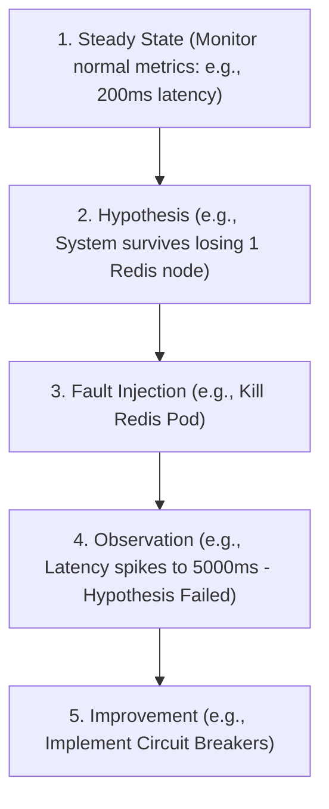

# MOD-SRE-04: Chaos Engineering & Proactive System Testing

Version: 1.0.0

Purpose: Canonical lesson structure for Platform Engineering & AI Infrastructure Curriculum.

Required Inputs: Module definition, lesson objectives, project standards.

Outputs: Standards-compliant lesson markdown.


# Lesson Overview

This lesson introduces Chaos Engineering—the discipline of experimenting on a system in order to build confidence in the system's capability to withstand turbulent conditions in production. You will learn how to design chaos experiments, define steady states, inject controlled failures, and proactively uncover architectural weaknesses before they cause catastrophic outages.

---

# Learning Objectives

* Define Chaos Engineering and its role in proactive site reliability.
* Design a structured chaos experiment using the scientific method (Steady State, Hypothesis, Experiment, Blast Radius).
* Understand how to safely inject failures into distributed systems (network latency, pod termination, CPU exhaustion).
* Analyze experiment results to identify single points of failure and improve system resilience.

---

# Prerequisites

* Completion of MOD-SRE-03 (Postmortems & RCA).
* Familiarity with Kubernetes architecture (Pods, Deployments).
* Understanding of observability (Prometheus/Grafana) to measure system state.

---

# Why This Exists

Distributed systems are inherently unpredictable. A microservice architecture might have hundreds of network dependencies. What happens if the payment API latency increases by 500ms? What if a cloud availability zone goes offline? Traditional testing (unit, integration) checks if the code works under ideal conditions. Chaos Engineering tests if the *architecture* survives under hostile conditions. Netflix pioneered this with "Chaos Monkey" when moving to AWS, realizing that the only way to survive cloud instances disappearing randomly was to constantly delete them on purpose.

---

# Core Concepts

## The Scientific Method of Chaos
Chaos engineering is not randomly breaking things; it is a highly disciplined scientific experiment.
1. **Define the Steady State:** What does "normal" look like? (e.g., 99% of requests complete in < 200ms, and 500 orders are processed per minute).
2. **Form a Hypothesis:** What do we think will happen? (e.g., "If the caching layer dies, the database will handle the load, and latency will only increase by 50ms. Users will not notice.")
3. **Run the Experiment (Inject Failure):** Introduce the fault (e.g., kill the Redis pods).
4. **Analyze the Results:** Did the system maintain the steady state? If yes, the hypothesis is proven. If no, you found a vulnerability.

## Minimizing Blast Radius
Never start Chaos Engineering in production with massive failures. You must minimize the "blast radius." Start by injecting failure into a single pod in a staging environment. Only when you have built confidence do you expand the blast radius to multiple pods, then to production, and eventually to entire regions.

## Types of Chaos
* **Infrastructure Chaos:** Terminating VMs, crashing Kubernetes nodes.
* **Network Chaos:** Injecting latency, dropping packets, blackholing DNS.
* **Application Chaos:** Exhausting CPU/Memory, returning HTTP 500s from internal APIs.

---

# Architecture



---

# Real-World Example

Netflix's Simian Army is the most famous example. "Chaos Monkey" randomly terminates EC2 instances in production during business hours. Because engineers know Chaos Monkey is always running, they are forced to build stateless applications with auto-scaling groups. Later, Netflix introduced "Chaos Kong," which simulates the failure of an entire AWS Region. By proactively practicing regional failovers every month, Netflix ensures that when a real AWS region goes down, their customers experience zero downtime.

---

# Hands-on Demonstration

Let's simulate a network chaos experiment using a conceptual shell workflow to demonstrate hypothesis testing.

**Inputs:**
* Target: A frontend service calling a backend API.
* Hypothesis: If the backend API takes 2 seconds to respond, the frontend will timeout gracefully in 1 second and show a cached response.

**Code / Simulated Execution:**
```bash
# 1. Verify steady state (Frontend responds in 100ms)
curl -w "\nTime: %{time_total}s\n" http://frontend.local

# 2. Inject Network Chaos (Add 2000ms delay to backend using `tc` - Traffic Control)
# (Simulated command)
tc qdisc add dev eth0 root netem delay 2000ms

# 3. Observe Frontend Behavior
curl -w "\nTime: %{time_total}s\n" http://frontend.local

# 4. Result Observation
# The frontend hung for 2 seconds and returned an HTTP 504 Gateway Timeout!
# The hypothesis FAILED. The frontend did not timeout in 1 second, nor did it show cache.

# 5. Rollback Chaos
# (Simulated command)
tc qdisc del dev eth0 root
```

**Explanation:**
The experiment uncovered a fatal flaw in the frontend's configuration. The developers forgot to implement a strict 1-second timeout and a fallback cache. By finding this in staging, the SRE team prevented a production outage where a slow backend would cause the frontend to lock up completely.

---

# Hands-on Lab

* **Objective:** Perform a basic pod termination chaos experiment in Kubernetes.
* **Estimated Time:** 20 minutes
* **Difficulty:** Intermediate
* **Environment:** Local Kubernetes cluster (minikube, kind) or cloud cluster with `kubectl` access.

## Step-by-step Instructions

1. **Deploy a Resilient Application:**
   Deploy an Nginx deployment with 3 replicas.
   ```bash
   kubectl create deployment chaos-demo --image=nginx
   kubectl scale deployment chaos-demo --replicas=3
   ```
2. **Establish the Steady State:**
   Observe that 3 pods are running happily.
   ```bash
   kubectl get pods -l app=chaos-demo
   ```
3. **Form a Hypothesis:**
   *Hypothesis:* "If I violently delete one pod, Kubernetes will immediately schedule a new one, and the deployment will maintain availability."
4. **Inject Chaos:**
   Delete a random pod to simulate a node crash.
   ```bash
   POD_NAME=$(kubectl get pods -l app=chaos-demo -o jsonpath='{.items[0].metadata.name}')
   kubectl delete pod $POD_NAME
   ```
5. **Observe the Recovery:**
   Immediately watch the pods. You will see the old pod terminating and a new pod instantly creating to satisfy the replica count.
   ```bash
   kubectl get pods -l app=chaos-demo -w
   ```

## Verification

The system should successfully self-heal, proving the hypothesis correct. The ReplicaSet reconciliation loop in Kubernetes natively handles this level of chaos.

## Troubleshooting

* If the new pod stays in `Pending`, your local cluster might be out of resources (CPU/Memory).

## Cleanup

```bash
kubectl delete deployment chaos-demo
```

---

# Production Notes

* **Halt Buttons (The Big Red Button):** Every chaos experiment must have an immediate rollback mechanism. If the injected failure causes unexpected cascading failures, the chaos tool must be able to instantly abort and restore the system.
* **Game Days:** Chaos Engineering is often practiced via "Game Days." The entire engineering team gathers, a chaos scenario is executed on production (or high-fidelity staging), and the team practices their incident response and observability skills in real-time.
* **Don't do Chaos if you know it will break:** If you know your database lacks a replica, don't run a chaos experiment to kill the primary database. You already know it will fail. Chaos is for uncovering the *unknowns*, not proving known technical debt.

---

# Common Mistakes

* **Running Chaos before Observability:** If you can't measure the steady state, you can't run a chaos experiment. You will inject a fault and have no idea if the system survived.
* **Testing in Production Too Early:** Start in Dev. Move to Staging. Only move to Production when the experiment passes flawlessly in Staging.
* **Massive Blast Radius:** Taking down an entire database cluster on day one will just anger management and get Chaos Engineering banned at your company. Start small (kill one pod).

---

# Failure-Driven Learning

**Scenario:** The team runs a network chaos experiment adding 50ms of latency to the authorization service.
**Impact:** The entire website goes down. It turns out the checkout service, the product catalog, and the user profile service all make synchronous calls to the auth service on every page load. The 50ms latency compounded into a 5000ms delay, exhausting connection pools everywhere.
**Action:** The experiment is immediately halted. The hypothesis failed spectacularly. The architecture team realizes they must implement JWT caching at the gateway layer so backend services don't need to synchronously call the auth service.

---

# Engineering Decisions

* **Tooling:** While you can write bash scripts to kill pods, enterprise teams use specialized tools like **LitmusChaos**, **Chaos Mesh**, or **Gremlin**. These tools provide safe scheduling, automated blast radius controls, and instant abort mechanisms.
* **Synchronous vs. Asynchronous architectures:** Chaos engineering quickly reveals that synchronous HTTP calls between microservices are highly fragile. Teams often pivot to asynchronous event-driven architectures (Kafka, RabbitMQ) after seeing how poorly synchronous systems handle network chaos.

---

# Best Practices

* Always communicate with the wider organization before running Game Days or large blast-radius experiments.
* Automate the experiments. Once an experiment passes manually, add it to a continuous chaos pipeline to ensure regressions don't occur.
* Tie Chaos Engineering directly to SLOs. Measure the impact of the chaos against your Error Budget.

---

# Troubleshooting Guide

## Issue 1: Management refuses to allow Chaos Engineering.

* **Cause:** Fear of causing customer impact and losing revenue. Management sees chaos as "breaking things for fun."
* **Diagnosis:** Review how you pitched the concept. Did you pitch it as "deleting production databases"?
* **Solution:** Rebrand it as "Continuous Resilience Testing." Start in staging. Show a report of a critical vulnerability you found and fixed in staging *before* it hit production. Use that ROI to build trust.

## Issue 2: Chaos experiments always fail with cascading errors.

* **Cause:** The system lacks basic reliability patterns (retries, timeouts, circuit breakers).
* **Diagnosis:** Analyze the trace logs during the experiment. Look for connection pool exhaustion or infinite timeouts.
* **Solution:** Pause Chaos Engineering. The system is too fragile. Spend a month implementing Circuit Breakers (e.g., using Istio or application-side libraries) and strict timeouts before resuming.

---

# Summary

Chaos Engineering shifts the SRE mindset from reactive firefighting to proactive stress testing. By treating infrastructure as a laboratory and running disciplined, scientific experiments with controlled blast radii, engineering teams can discover and fix catastrophic architectural flaws long before a real incident occurs.

---

# Cheat Sheet

* **Chaos Engineering:** Proactively experimenting on a system to uncover weaknesses.
* **Steady State:** The baseline metric of normal, healthy behavior.
* **Blast Radius:** The scope of impact of the experiment (must be kept small initially).
* **Game Day:** A scheduled, collaborative session where teams execute chaos experiments to practice incident response.
* **Circuit Breaker:** A software pattern that prevents a system from repeatedly trying to execute an operation that is likely to fail, often implemented as a result of chaos discoveries.

---

# Knowledge Check

## Multiple Choice Questions

1. What is the most critical prerequisite before you can start running Chaos Engineering experiments?
   * A) You must have a multi-region cloud deployment.
   * B) You must have robust observability to measure the steady state.
   * C) You must run the experiments in the production environment.
   * D) You must get approval from the CEO.

2. What should you do if you know that killing a specific service will cause a total system outage?
   * A) Run the chaos experiment anyway to prove it to management.
   * B) Run it in production during off-peak hours.
   * C) Do not run the experiment; fix the known single point of failure first.
   * D) Run the experiment but only for 5 seconds.

## Scenario Questions

You are designing a chaos experiment to test how your microservices handle database latency. What is the correct sequence of steps based on the scientific method of Chaos Engineering?

## Short Answer Questions

Define the term "Blast Radius" in the context of Chaos Engineering.

<details>
<summary><b>View Answers</b></summary>

### Multiple Choice
1. **[B]** - *If you cannot monitor the steady state and observe the system's behavior, you are just blindly breaking things, not conducting an experiment.*
2. **[C]** - *Chaos engineering is for discovering unknown weaknesses. If you already know it's broken, spend your time fixing it, not proving what you already know.*

### Scenario
*1. Define the steady state (e.g., normal API latency is 100ms). 2. Form a hypothesis (e.g., if database latency spikes by 200ms, the API will degrade to 300ms but not crash). 3. Inject the failure (introduce 200ms DB latency in staging). 4. Observe the results. 5. Abort the experiment and implement fixes if the hypothesis fails.*

### Short Answer
*Blast Radius is the extent of the impact caused by a chaos experiment. Good chaos engineering strictly controls and minimizes the blast radius (e.g., targeting a single user, a single pod, or a staging environment) to ensure the experiment doesn't cause widespread customer harm.*

</details>

---

# Interview Preparation

## Beginner Questions

* What is Chaos Engineering?
* Why did Netflix create Chaos Monkey?

## Intermediate Questions

* Explain the four steps of a Chaos Engineering experiment.
* Why is it important to test in staging before moving to production?

## Advanced Questions

* How do you ensure that a chaos experiment running in production does not accidentally deplete your entire Error Budget?
* What architectural patterns would you implement if a chaos experiment revealed that network latency in one service causes all other services to time out?

## Scenario-Based Discussions

* Your VP of Engineering says, "We have enough real incidents in production; I will not authorize you to create fake ones." Pitch Chaos Engineering to them in a way that addresses their concerns and proves ROI.

<details>
<summary><b>View Answers</b></summary>

### Beginner
* **What is Chaos Engineering:** The discipline of experimenting on a system to build confidence in its capability to withstand turbulent conditions.
* **Why Chaos Monkey:** To force engineers to design stateless, resilient, auto-scaling architectures that could survive the inherent unreliability of cloud infrastructure.

### Intermediate
* **Four steps:** 1. Define steady state. 2. Form hypothesis. 3. Inject fault (with small blast radius). 4. Observe and learn.
* **Test in staging:** To minimize the blast radius. You want to catch the obvious, catastrophic failures in an environment where no real customers are impacted.

### Advanced
* **Protecting Error Budget:** You implement strict "Halt" conditions. The chaos tooling must constantly monitor the primary SLIs. If the SLI drops beyond a predefined tiny threshold (e.g., a 0.01% drop in availability), the tooling must automatically and instantly abort the experiment and restore the system before the overall Error Budget is threatened.
* **Architectural patterns:** I would implement Circuit Breakers (to fail fast instead of waiting for timeouts), strict Timeouts on all network calls, and Fallbacks (returning cached data or default responses instead of throwing an error).

### Scenario-Based Discussions
* **Pitch to VP:** "I agree we have too many real incidents. Those incidents happen at 3 AM, impact all our users, and cost us revenue. Chaos Engineering allows us to schedule those exact incidents at 2 PM on a Tuesday, with all engineers online, and with a controlled blast radius limited to 1% of test traffic. By finding the flaw safely on our terms, we prevent the massive 3 AM outage that costs us money. It is proactive risk mitigation, not sabotage."

</details>

---

# Further Reading

1. [Principles of Chaos Engineering](https://principlesofchaos.org/)
2. [Chaos Mesh Documentation](https://chaos-mesh.org/docs/)
3. [Netflix Technology Blog - Chaos Engineering](https://netflixtechblog.com/chaos-engineering-upgraded-878d341f15fa)
