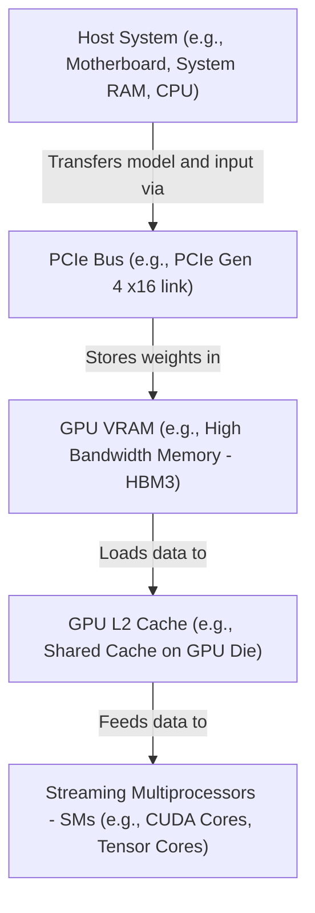

# Hardware Architecture for AI: GPUs, TPUs, CUDA & Memory Bandwidth

Version: 1.0.0

Purpose: Understand the fundamental hardware architectures enabling modern AI workloads.

Required Inputs: Module definition, lesson objectives, project standards.

Outputs: Standards-compliant lesson markdown.


# Lesson Overview

This lesson dives into the hardware foundations required for modern AI and Large Language Models (LLMs). It explores why traditional CPUs struggle with AI workloads, how GPUs and TPUs are designed to accelerate matrix math, the role of CUDA in programming these devices, and why memory bandwidth is often the primary bottleneck in LLM inference.

---

# Learning Objectives

* Differentiate between CPU, GPU, and TPU architectures and their suitability for AI tasks.
* Understand the role of CUDA and how it bridges software to GPU hardware.
* Explain the concept of memory bandwidth and the "memory wall" in LLM inference.
* Calculate theoretical token generation speeds based on hardware memory bandwidth.
* Make informed decisions on selecting hardware (e.g., NVIDIA A100/H100 vs. consumer GPUs) for specific AI workloads.

---

# Prerequisites

* Basic understanding of computer architecture (CPU, RAM, Storage).
* Familiarity with the concepts of neural networks and matrix multiplication.

---

# Why This Exists

Historically, CPUs were designed for low-latency, sequential processing with complex control logic. However, training and running deep neural networks requires massive amounts of parallel, relatively simple mathematical operations (specifically, Matrix Multiplication and Accumulation - MAC). CPUs are highly inefficient at this. GPUs, originally built for rendering millions of pixels simultaneously in video games, were repurposed because their architecture—thousands of simpler cores—is perfectly suited for neural networks. As AI models grew exponentially, specialized hardware like TPUs (Tensor Processing Units) and software frameworks like CUDA were developed strictly to push the physical limits of silicon to serve AI faster.

---

# Core Concepts

## CPU vs. GPU vs. TPU

*   **CPU (Central Processing Unit):** The generalist. Optimized for low-latency execution of complex, sequential tasks. A CPU has a few powerful cores, large caches, and sophisticated branch prediction. It is a sports car: fast for a single passenger.
*   **GPU (Graphics Processing Unit):** The parallel powerhouse. Designed for high throughput of simple, parallel tasks. A GPU has thousands of smaller, simpler cores that execute the same instruction on multiple data points simultaneously (SIMD). It is a massive bus: slower per passenger, but moves thousands at once.
*   **TPU (Tensor Processing Unit):** The specialist (ASIC - Application-Specific Integrated Circuit). Custom-designed by Google specifically for matrix operations in neural networks. It sacrifices general programmability for extreme efficiency in deep learning tasks.

## CUDA (Compute Unified Device Architecture)

CUDA is a parallel computing platform and API created by NVIDIA. It allows software developers to use a CUDA-enabled GPU for general-purpose processing (GPGPU). Before CUDA, programming GPUs required writing code as if it were rendering graphics. CUDA provides extensions to C, C++, and Python (via libraries like PyTorch/CuPy) to directly allocate memory on the GPU and dispatch parallel computations (kernels) to thousands of GPU cores.

## Memory Bandwidth and The Memory Wall

In LLM inference (specifically during the decoding phase where tokens are generated one by one), the bottleneck is almost never compute (TFLOPS); it is **Memory Bandwidth**. 
Every time an LLM generates a token, it must load the *entire model weights* from the GPU's VRAM (Video RAM) into the GPU's compute cores.
*   **Memory Bandwidth** is the speed at which data can be read from or stored into VRAM (measured in GB/s or TB/s).
*   **The Memory Wall:** The growing disparity between the speed of processors (which is extremely fast) and the speed of memory access (which lags behind). If the GPU cores are waiting for weights to load from memory, they are idle.

---

# Architecture



---

# Real-World Example

In a production environment like OpenAI or Anthropic, a single H100 GPU costs upwards of $30,000. Why not use 30 cheaper consumer GPUs (like RTX 4090s) instead? 
Enterprise AI hardware like the H100 features HBM3 (High Bandwidth Memory), providing over 3.3 TB/s of memory bandwidth, whereas an RTX 4090 uses GDDR6X with roughly 1 TB/s. Furthermore, enterprise GPUs support NVLink—a massive high-speed interconnect allowing multiple GPUs to share memory as if they were one giant GPU. When loading an 80-billion parameter model, NVLink allows the model weights to be split across 8 GPUs without the massive latency penalty of standard PCIe lanes.

---

# Hands-on Demonstration

Let's calculate the theoretical maximum token generation speed of a GPU.
Assume we have an NVIDIA A100 GPU with **2000 GB/s (2 TB/s)** of memory bandwidth.
Assume we have a **Llama 2 70B** model. In 16-bit precision (FP16), 1 parameter = 2 bytes. 
Model size = 70 billion parameters * 2 bytes = **140 GB**.

**Input:**
*   Memory Bandwidth: 2000 GB/s
*   Model Size in VRAM: 140 GB
*   Task: Generation (Decoding phase, batch size = 1)

**Calculation:**
Every token generated requires loading the full 140 GB model.
Max Tokens per second = Memory Bandwidth / Model Size

**Expected Output:**
2000 GB/s / 140 GB/token = **~14.2 tokens per second.**

**Explanation:**
This proves that for LLM decoding at batch size 1, the compute capability (TFLOPS) doesn't matter. The speed limit is purely how fast the VRAM can shove 140GB of data into the cores. To get faster than 14 tokens/second on a 70B model, you must increase memory bandwidth (e.g., use an H100 or multiple A100s via NVLink) or decrease the model size (e.g., Quantization).

---

# Hands-on Lab

* **Objective:** Inspect GPU topology, CUDA driver status, and memory bandwidth using the `nvidia-smi` CLI tool.
* **Estimated Time:** 15 minutes
* **Difficulty:** Beginner
* **Environment:** A Linux environment with an NVIDIA GPU and proprietary drivers installed.

## Step-by-step Instructions

1. **Verify GPU Availability:**
   Run the standard NVIDIA System Management Interface tool.
   ```bash
   nvidia-smi
   ```
2. **Inspect the Output:**
   Observe the Driver Version, CUDA Version, GPU Name (e.g., Tesla T4), and Memory Usage (e.g., 0MiB / 15360MiB).
3. **Query Specific GPU Hardware Details:**
   Use the query command to extract memory bandwidth and clock speeds.
   ```bash
   nvidia-smi --query-gpu=name,memory.total,clocks.max.memory,pcie.link.gen.max --format=csv
   ```
4. **Check Topology (Multi-GPU setups only):**
   If you have multiple GPUs, check how they are connected (PCIe vs NVLink).
   ```bash
   nvidia-smi topo -m
   ```

## Verification

If `nvidia-smi` outputs a table showing the GPU, drivers are correctly installed. The query command should output a CSV line like:
`Tesla T4, 15360 MiB, 5001 MHz, 3`

## Troubleshooting

*   **Command not found:** The NVIDIA drivers are not installed, or `/usr/bin/nvidia-smi` is not in your PATH. Install via your package manager (e.g., `apt install nvidia-driver-535`).
*   **Cannot communicate with NVIDIA driver:** The kernel module is not loaded or mismatching. A system reboot usually fixes driver updates.

## Cleanup

No cleanup required; these are read-only inspection commands.

---

# Production Notes

*   **Cost vs. Capability:** Consumer GPUs (RTX 3090/4090) are excellent for R&D and single-user local inference but violate EULAs for datacenter deployment and lack SR-IOV (Single Root I/O Virtualization) for secure multi-tenant slicing.
*   **MIG (Multi-Instance GPU):** On A100/H100 architectures, you can hardware-slice a single 80GB GPU into up to 7 smaller, fully isolated GPUs (e.g., seven 10GB GPUs). This is critical for maximizing utilization when running smaller models or distinct workloads.
*   **Thermal Throttling:** GPUs draw massive power (up to 700W for an H100). Poor datacenter cooling leads to thermal throttling, severely degrading AI performance unpredictably.

---

# Common Mistakes

*   **Focusing on TFLOPS instead of Bandwidth:** Beginners often buy GPUs with high compute numbers (TFLOPS) for running LLMs, only to find them slow because the VRAM bandwidth is low. For serving LLMs, prioritize Memory Capacity first, Bandwidth second, and Compute third.
*   **Ignoring PCIe Bottlenecks:** Placing two high-end GPUs on a consumer motherboard might result in PCIe lane splitting (x8/x8), halving the data transfer rate between the host CPU and the GPU, which severely slows down the initial model loading phase.

---

# Failure-Driven Learning

**Scenario:** You start an LLM server, but the application crashes immediately with a `CUDA Out of Memory (OOM)` error.

**Diagnosis:**
1. Run `nvidia-smi` and look at the memory usage of the target GPU.
2. If memory is already heavily utilized by another process (e.g., a zombie training script), kill it.
3. If memory is free, calculate your model size. A 7B parameter model in FP16 requires 14GB just for weights. Plus, it needs memory for the KV Cache (context window). If you have a 16GB GPU, it will OOM on long prompts.

**Recovery:**
Apply quantization (e.g., load the model in 8-bit or 4-bit) to reduce the memory footprint, or reduce the maximum context length of your server configuration.

---

# Engineering Decisions

**Scaling Up (Bigger GPUs) vs. Scaling Out (More GPUs)**
When a model doesn't fit on one GPU (e.g., a 70B model requiring 140GB of VRAM), you have two choices:
1.  **Scale Up:** Buy a single massive GPU or specialized node with enough VRAM (expensive, often hard to source).
2.  **Scale Out:** Use Tensor Parallelism to split the model across multiple smaller GPUs (e.g., four 40GB A6000s). 
*Trade-off:* Scaling out requires fast interconnects (NVLink). If scaling out across standard PCIe, the latency of passing intermediate calculations between GPUs will cripple generation speed.

---

# Best Practices

*   **Quantization:** Always consider INT8 or INT4 quantization (AWQ/GPTQ) for serving. It reduces memory footprint and proportionally increases token generation speed by reducing memory bandwidth pressure.
*   **Batching:** Utilize dynamic/continuous batching (covered in later lessons) to process multiple requests simultaneously. This allows the GPU to reuse the model weights loaded into cores for multiple users, drastically improving throughput.
*   **Monitor GPU metrics:** Continuously monitor `DCGM` (Data Center GPU Manager) metrics for temperature, power limit throttling, and memory bandwidth utilization.

---

# Troubleshooting Guide

## Issue 1: Server running extremely slow (1-2 tokens/s) on multi-GPU setup

*   **Cause:** The GPUs are communicating over the system PCIe bus instead of a dedicated interconnect like NVLink or NVBridge.
*   **Diagnosis:** Run `nvidia-smi topo -m`. Look for `SYS` or `PHB` between GPUs instead of `NV#`.
*   **Solution:** Install physical NVLink bridges. If in the cloud, ensure you provisioned a VM type that explicitly includes NVLink topology (like AWS `p4d` instances).

---

# Summary

Understanding AI hardware is critical for Platform Engineers because the software constraints of LLMs are directly tied to hardware physics. CPUs are too slow for parallel matrix math. GPUs provide the parallel cores, and CUDA provides the software bridge. However, the true bottleneck in modern LLM generation is how fast data can move from the GPU's memory to its compute cores (Memory Bandwidth).

---

# Cheat Sheet

*   **Estimate Model VRAM Size:** `Number of Parameters * Precision Bytes`. (e.g., 7B parameters * 2 bytes for FP16 = 14GB).
*   **Max Theoretical Decoding Speed (Batch 1):** `GPU Memory Bandwidth / Model VRAM Size`.
*   **Check GPU Status:** `nvidia-smi`
*   **Monitor GPU usage live:** `watch -n 1 nvidia-smi`
*   **Check GPU Topology:** `nvidia-smi topo -m`

---

# Knowledge Check

## Multiple Choice Questions

1. Why are GPUs preferred over CPUs for training deep neural networks?
   * A) They have a higher clock speed.
   * B) They have larger L1 and L2 caches.
   * C) They have thousands of parallel cores optimized for matrix multiplication.
   * D) They consume less power per instruction.

2. During the token decoding phase of LLM generation (batch size 1), what is the primary hardware bottleneck?
   * A) CPU single-thread performance
   * B) GPU Tensor Core processing speed (TFLOPS)
   * C) SSD Read Speed
   * D) GPU Memory Bandwidth

## Scenario Questions

You have a choice between purchasing a GPU with 100 TFLOPS of compute and 500 GB/s memory bandwidth, or a GPU with 50 TFLOPS of compute and 1000 GB/s memory bandwidth. Your sole task is serving a Llama-3 8B model to a single user with the lowest latency possible. Which GPU should you choose and why?

## Short Answer Questions

What is CUDA and why is it significant in the AI ecosystem?

<details>
<summary><b>View Answers</b></summary>

### Multiple Choice
1. **[C]** - GPUs are designed for high throughput parallel execution, which is perfectly suited for the massive matrix multiplications required in deep learning.
2. **[D]** - Generating each token requires loading the entire model from VRAM to the compute cores. The speed at which this data transfers (Memory Bandwidth) limits generation speed.

### Scenario
You should choose the GPU with 1000 GB/s memory bandwidth. In single-user LLM decoding (batch size 1), the system is entirely memory-bandwidth bound. The compute power (TFLOPS) will sit idle waiting for the model weights to load. The GPU with double the memory bandwidth will generate tokens roughly twice as fast.

### Short Answer
CUDA is a parallel computing platform and programming model developed by NVIDIA. It is significant because it provides a standardized, accessible software layer for developers to write code that executes directly on NVIDIA GPU cores, accelerating AI frameworks like PyTorch and TensorFlow.

</details>

---

# Interview Preparation

## Beginner Questions

* What is the difference between VRAM and system RAM?

## Intermediate Questions

* Explain the concept of the "Memory Wall" in the context of Large Language Models.

## Advanced Questions

* How does Multi-Instance GPU (MIG) improve hardware utilization in a Kubernetes cluster, and what are its limitations compared to time-slicing?

## Scenario-Based Discussions

* Your team wants to deploy a 70B parameter model in FP16 precision. You have nodes with a maximum of four 24GB GPUs each. Explain whether this is possible, and what the architectural implications are.

<details>
<summary><b>View Answers</b></summary>

### Beginner
* **What is the difference between VRAM and system RAM?:** VRAM (Video RAM) is memory physically located on the GPU, featuring extremely high bandwidth designed to feed data rapidly to GPU cores. System RAM is located on the motherboard and is used by the CPU; it has much higher capacity but significantly lower bandwidth than VRAM.

### Intermediate
* **Explain the concept of the "Memory Wall":** The Memory Wall refers to the growing performance gap between how fast processors can perform calculations (compute) and how fast memory can deliver data to the processor (bandwidth). In LLMs, compute is so fast that it constantly waits on VRAM to deliver model weights, making bandwidth the true bottleneck.

### Advanced
* **How does Multi-Instance GPU (MIG) improve hardware utilization:** MIG physically partitions a large GPU (like an A100) into completely isolated smaller GPUs at the hardware level, ensuring fault isolation and guaranteed QoS (Quality of Service) for separate pods in Kubernetes. It is better than time-slicing (which context-switches and lacks memory isolation), but its limitation is that partitions are fixed in size and cannot dynamically burst beyond their hard limits.

### Scenario-Based Discussions
* **Deploy a 70B parameter model on four 24GB GPUs:** Yes, it is possible. A 70B model in FP16 requires roughly 140GB of VRAM. Four 24GB GPUs provide 96GB of VRAM, which is *not enough* for FP16. The team must either apply Quantization (e.g., 4-bit AWQ, reducing the model to ~35-40GB, which fits easily) or use multiple nodes with slow network interconnects (not recommended). If quantized, the model must be split across the GPUs using Tensor Parallelism.

</details>

---

# Further Reading

1. [NVIDIA Data Center Documentation](https://docs.nvidia.com/datacenter/)
2. [Understanding GPU Memory Bandwidth (NVIDIA Blog)](https://developer.nvidia.com/blog/)
3. [CUDA Toolkit Documentation](https://docs.nvidia.com/cuda/)
4. [Kipply's LLM Inference Engine Guide](https://kipp.ly/blog/transformer-inference-arithmetic/)
5. [The Memory Wall in Deep Learning (Academic Paper summary)](https://arxiv.org/)
