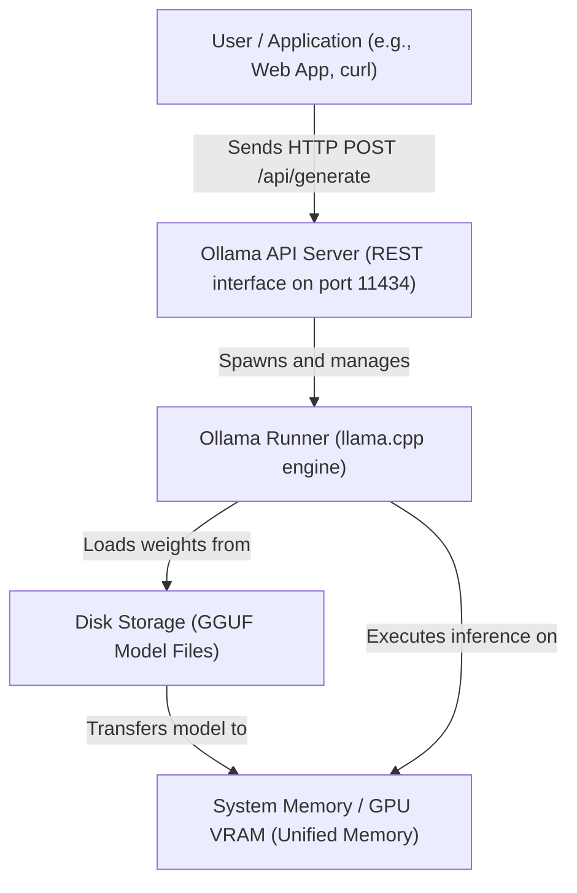

# Local LLM Execution with Ollama & Model Runtime Internals

Version: 1.0.0

Purpose: Understand how to run Large Language Models locally using Ollama and explore the internals of model runtimes like llama.cpp.

Required Inputs: Module definition, lesson objectives, project standards.

Outputs: Standards-compliant lesson markdown.


# Lesson Overview

This lesson transitions from raw hardware to the software layer that makes running Large Language Models (LLMs) accessible. We will explore how tools like Ollama and its underlying engine, `llama.cpp`, democratize AI by allowing massive models to run efficiently on consumer-grade hardware, including standard CPUs and Apple Silicon. You will learn the mechanics of GGUF formats, quantization, and how to operate local LLMs securely.

---

# Learning Objectives

* Explain the role of `llama.cpp` and how it differs from Python-based PyTorch runtimes.
* Understand the GGUF file format and why it is the standard for local LLM distribution.
* Deploy and manage local LLMs using the Ollama CLI and REST API.
* Explain the concept of quantization and how it reduces VRAM/RAM requirements.
* Configure Ollama to serve models to external applications securely.

---

# Prerequisites

* Completion of `MOD-AI-01: Hardware Architecture for AI`.
* Basic proficiency with the Linux command line and Docker concepts.
* Familiarity with REST APIs.

---

# Why This Exists

Early in the generative AI boom, running models required massive Python environments with complex PyTorch dependencies and enterprise NVIDIA GPUs. This created a massive barrier to entry. Georgi Gerganov created `llama.cpp`—a pure C/C++ implementation of the Llama architecture. By stripping away the heavy Python runtime, it enabled running LLMs efficiently on standard CPUs and Apple's unified memory architecture. However, `llama.cpp` is a low-level tool. Ollama was created to provide a Docker-like experience for LLMs, wrapping `llama.cpp` in a user-friendly CLI and API, making local AI infrastructure trivial to provision and manage.

---

# Core Concepts

## The llama.cpp Engine

At the core of local LLM execution is `llama.cpp`. It is a standalone C/C++ project with no external dependencies (no PyTorch, no Python). 
*   **Hardware Agnostic:** It can compile to run on x86 CPUs (using AVX instructions), ARM CPUs, Apple Silicon (using the Metal framework), and NVIDIA GPUs (using CUDA).
*   **Mixed Inference:** If a model is too large to fit entirely in VRAM, `llama.cpp` can offload some layers to the GPU and process the rest on the much slower system CPU/RAM. This is called **layer offloading**.

## The GGUF Format

Machine learning models are essentially massive arrays of numbers (weights). Historically, these were saved as Python `.pt` (PyTorch) or `.safetensors` files. 
`llama.cpp` introduced the **GGUF (GPT-Generated Unified Format)**. GGUF files contain not only the model weights but all the metadata required to run the model (like the tokenizer and hyper-parameters) in a single binary file. This makes distributing models as simple as downloading a single file.

## Quantization

Quantization is the process of reducing the precision of the numbers used to represent the model's weights. 
Models are typically trained in 16-bit precision (FP16). Quantization converts these 16-bit numbers into 8-bit, 4-bit, or even 2-bit integers.
*   **Benefit:** A 7-billion parameter model takes ~14GB of RAM in FP16. Using 4-bit quantization, it drops to ~4GB, allowing it to run on a standard laptop.
*   **Trade-off:** Loss of precision can slightly degrade the model's intelligence or reasoning capability, though 4-bit quantization usually retains ~95% of the original performance.

---

# Architecture



---

# Real-World Example

A modern privacy-conscious enterprise, like a healthcare provider, cannot send patient data (PHI) to OpenAI's API. Instead, their Platform Engineering team deploys Ollama as a sidecar container within their secure Kubernetes clusters. Internal applications query this local Ollama instance (e.g., running `Llama-3-8B-Instruct`) to summarize medical records. Because Ollama runs entirely offline, data never leaves the corporate network, ensuring strict HIPAA compliance without sacrificing AI capabilities.

---

# Hands-on Demonstration

Let's look at how simple it is to interact with Ollama via its REST API, simulating an application calling a local AI.

**Input (cURL command):**
```bash
curl http://localhost:11434/api/generate -d '{
  "model": "phi3",
  "prompt": "Explain Kubernetes in one sentence.",
  "stream": false
}'
```

**Expected Output (JSON response):**
```json
{
  "model": "phi3",
  "created_at": "2024-05-15T10:30:00Z",
  "response": "Kubernetes is an open-source platform designed to automate deploying, scaling, and operating application containers.",
  "done": true,
  "context": [1, 23, 445, ...],
  "total_duration": 850000000,
  "load_duration": 15000000,
  "prompt_eval_count": 8,
  "eval_count": 20
}
```

**Explanation:**
Ollama provides a standard REST API out of the box. By setting `"stream": false`, we tell Ollama to wait until the entire response is generated before replying. The response includes the generated text alongside critical metrics like `total_duration` and `eval_count` (how many tokens were generated), which are essential for platform monitoring.

---

# Hands-on Lab

* **Objective:** Install Ollama, pull a quantized model, interact with it via CLI, and customize it using a Modelfile.
* **Estimated Time:** 20 minutes
* **Difficulty:** Beginner
* **Environment:** A local Linux/macOS machine or a VM with at least 8GB of RAM.

## Step-by-step Instructions

1. **Install Ollama:**
   ```bash
   curl -fsSL https://ollama.com/install.sh | sh
   ```
2. **Start the Ollama Server (if not running as a service):**
   ```bash
   ollama serve &
   ```
3. **Pull and Run a Model:**
   We will use `phi3`, a highly capable small model from Microsoft.
   ```bash
   ollama run phi3
   ```
   *(Type a prompt, e.g., "Hello!", and press enter. Type `/bye` to exit).*
4. **Create a Custom Modelfile:**
   Create a file named `Modelfile` in your directory.
   ```dockerfile
   FROM phi3
   SYSTEM "You are a grumpy platform engineer. You answer questions accurately, but complain about developers."
   PARAMETER temperature 0.5
   ```
5. **Build the Custom Model:**
   ```bash
   ollama create grumpy-engineer -f Modelfile
   ```
6. **Test the Custom Model:**
   ```bash
   ollama run grumpy-engineer
   ```
   *Ask it: "How do I deploy a container?"*

## Verification

Run `ollama list`. You should see both `phi3` and `grumpy-engineer` listed with their respective sizes.

## Troubleshooting

*   **Error: `could not connect to ollama app`:** The background `ollama serve` process is not running. Ensure the service is started.
*   **Error: `insufficient memory`:** Your system does not have enough free RAM to load the model. Try closing other applications or pulling a smaller model (e.g., `qwen:0.5b`).

## Cleanup

Remove the models to free up disk space.
```bash
ollama rm grumpy-engineer
ollama rm phi3
```

---

# Production Notes

*   **Ollama in Docker:** While Ollama is easy to run bare-metal, in production, it is typically deployed as a Docker container. Use the official `ollama/ollama` image.
*   **Exposing the API:** By default, Ollama binds to `127.0.0.1`. To allow other containers or machines to reach it, you must set the environment variable `OLLAMA_HOST=0.0.0.0`.
*   **Statelessness:** Ollama itself is largely stateless, but the models downloaded to `~/.ollama/models` (or `/root/.ollama` in Docker) are huge. In Kubernetes, this directory must be mounted to a Persistent Volume (PV) to avoid re-downloading multi-gigabyte models every time the pod restarts.

---

# Common Mistakes

*   **Not mapping GPU drivers into Docker:** If running Ollama in Docker on a machine with an NVIDIA GPU, you *must* use the NVIDIA Container Toolkit and pass the `--gpus all` flag. Without this, Ollama will fall back to CPU rendering, which is drastically slower.
*   **Assuming Ollama handles concurrent requests well:** By default, Ollama processes one request at a time (queuing others). If you point a busy web app at a single Ollama instance, latencies will skyrocket. For true production concurrency, enterprise engines like `vLLM` (covered next lesson) are required.

---

# Failure-Driven Learning

**Scenario:** You have a machine with a 12GB NVIDIA GPU. You tell Ollama to run `llama3:70b`. The model runs, but it generates text at an agonizing 0.5 tokens per second.

**Diagnosis:**
1. Check GPU memory using `nvidia-smi`. You will see it is full.
2. Check system RAM usage using `htop`. You will see system RAM is heavily utilized and the CPU is pegged at 100%.

**Cause:**
A 70B parameter quantized model requires roughly 40GB of memory. Because it does not fit in your 12GB VRAM, Ollama (via `llama.cpp`) loads 12GB onto the GPU and the remaining 28GB into system RAM. Generating a token requires moving data across the slow system RAM and processing it on the CPU, severely bottle-necking the fast GPU.

**Solution:**
You must respect the hardware limits. Either run a smaller model (e.g., `llama3:8b`) that fits entirely within the 12GB VRAM, or acquire a machine with sufficient VRAM.

---

# Engineering Decisions

**Ollama vs. Cloud APIs (OpenAI/Anthropic)**
*   **When to use Cloud APIs:** Prototyping, applications requiring the absolute highest intelligence (GPT-4 class), or bursty workloads where maintaining 24/7 GPU infrastructure is cost-prohibitive.
*   **When to use Ollama/Local AI:** Strict data privacy requirements (PII/PHI), air-gapped environments, edge computing (running on local devices/stores), or when you have a predictable, high volume of requests where paying per-token to an API would be astronomically expensive.

---

# Best Practices

*   **Pin Model Versions:** When using Ollama in CI/CD or production, do not just pull `llama3`. Pull a specific tag, like `llama3:8b-instruct-q4_0`, to ensure behavior does not change unexpectedly if Ollama updates the default tag.
*   **Pre-warm Models:** Ollama takes a few seconds to load a model from disk into RAM when the first request hits. In production, write a startup script that sends a dummy request to pre-warm the model into memory before marking the container as "ready" in your load balancer.

---

# Troubleshooting Guide

## Issue 1: Ollama API is refusing external connections

*   **Cause:** Ollama binds to localhost by default for security reasons.
*   **Diagnosis:** Run `netstat -tlnp | grep 11434`. If it shows `127.0.0.1:11434`, it is isolated.
*   **Solution:** Restart the Ollama service with the environment variable `OLLAMA_HOST=0.0.0.0` to listen on all network interfaces.

---

# Summary

Ollama and `llama.cpp` have revolutionized AI accessibility by standardizing model distribution via GGUF and optimizing inference for non-enterprise hardware. By leveraging quantization and layer offloading, platform engineers can deploy robust, private AI services locally or within internal clusters. While not designed for massive-scale concurrent enterprise serving, Ollama is the undisputed standard for local AI development, testing, and edge deployments.

---

# Cheat Sheet

*   **Start Server:** `ollama serve`
*   **Run Interactive Session:** `ollama run <model>`
*   **List Downloaded Models:** `ollama list`
*   **Build from Modelfile:** `ollama create <name> -f <Modelfile_path>`
*   **Remove Model:** `ollama rm <model>`
*   **API Generate Endpoint:** `POST http://localhost:11434/api/generate`

---

# Knowledge Check

## Multiple Choice Questions

1. What is the primary purpose of the GGUF file format?
   * A) To compress training data for faster downloads.
   * B) To package model weights and metadata into a single distributable binary file.
   * C) To provide a standardized REST API for Large Language Models.
   * D) To encrypt models to prevent intellectual property theft.

2. If a model's weights require 30GB of memory, but your GPU only has 16GB of VRAM, what will `llama.cpp` (and Ollama) attempt to do by default?
   * A) Crash immediately with an Out of Memory error.
   * B) Compress the model further on the fly using ZIP algorithms.
   * C) Offload as many layers as possible to the GPU and process the rest on the CPU/System RAM.
   * D) Connect to a cloud API to process the remaining layers.

## Scenario Questions

You are creating an automated testing pipeline in Jenkins. You need an LLM to evaluate the output of certain tests. You decide to run Ollama inside a Docker container as part of the pipeline. What must you configure to ensure the model isn't downloaded from the internet every single time the pipeline runs?

## Short Answer Questions

Describe what quantization is and why it is critical for local LLM execution.

<details>
<summary><b>View Answers</b></summary>

### Multiple Choice
1. **[B]** - GGUF packages everything needed (weights, tokenizer, parameters) into one file, replacing the complex multi-file structures of older Python-based formats.
2. **[C]** - `llama.cpp` supports partial offloading. It fills the GPU VRAM first, then spills over to system RAM. This prevents a crash but results in much slower inference.

### Scenario
You must configure a Docker volume mount for the Ollama container. Specifically, you should mount a persistent directory from the Jenkins host machine into `/root/.ollama` inside the container. This ensures that once a model is downloaded, it is cached on the host and immediately available for subsequent pipeline runs.

### Short Answer
Quantization is the process of reducing the precision of model weights (e.g., from 16-bit floating point to 4-bit integers). It is critical for local execution because it drastically reduces the RAM/VRAM required to load the model and the memory bandwidth required to run it, allowing large models to run on standard consumer hardware.

</details>

---

# Interview Preparation

## Beginner Questions

* What is Ollama, and how does it relate to `llama.cpp`?

## Intermediate Questions

* Explain how a `Modelfile` in Ollama is similar to a `Dockerfile`.

## Advanced Questions

* Compare deploying an LLM via Ollama versus a raw PyTorch/HuggingFace script in a production Kubernetes environment. What are the operational advantages of Ollama?

## Scenario-Based Discussions

* Your development team wants to integrate an LLM into their local dev environments to help write code. They all have different laptops (some MacBooks, some Windows with NVIDIA GPUs, some Windows with no GPUs). Architect a solution to provide this capability uniformly.

<details>
<summary><b>View Answers</b></summary>

### Beginner
* **What is Ollama, and how does it relate to llama.cpp?:** Ollama is a user-friendly tool that provides a CLI and REST API to easily manage and run local AI models. `llama.cpp` is the underlying inference engine (the core code) that Ollama uses to actually perform the math and execute the models on CPU/GPU hardware.

### Intermediate
* **How is a Modelfile similar to a Dockerfile?:** Both use a declarative, layer-based syntax. A Dockerfile starts with a `FROM` base image and adds software; a Modelfile starts with a `FROM` base model (like `llama3`) and adds custom system prompts, parameters (like temperature), and templates, resulting in a new, distinct model image that can be tagged and run.

### Advanced
* **Ollama vs. PyTorch in Kubernetes:** Raw PyTorch scripts require managing complex Python environments, CUDA toolkit versions, and writing custom HTTP servers (like Flask) to serve the model. Ollama compiles to a single binary with zero dependencies, has a built-in production-ready HTTP server, handles GPU detection automatically, and manages model storage via a simple API. Operationally, Ollama is vastly easier to containerize, secure, and maintain.

### Scenario-Based Discussions
* **Architecting local dev LLMs:** Because the hardware is heterogeneous, distributing a raw PyTorch model is impossible. The solution is to mandate the installation of Ollama on all machines. Ollama abstracts the hardware (using Metal on Macs, CUDA on NVIDIA, and AVX on raw CPUs). You would create a standardized `Modelfile` tailored for coding, push it to a private registry (or distribute the build script), and have devs run it. The LLM will execute as fast as the local hardware allows without changing the application integration code.

</details>

---

# Further Reading

1. [Ollama Official Documentation](https://github.com/ollama/ollama)
2. [llama.cpp GitHub Repository](https://github.com/ggerganov/llama.cpp)
3. [Understanding GGUF Format](https://huggingface.co/docs/hub/en/gguf)
4. [Introduction to LLM Quantization](https://towardsdatascience.com/)
