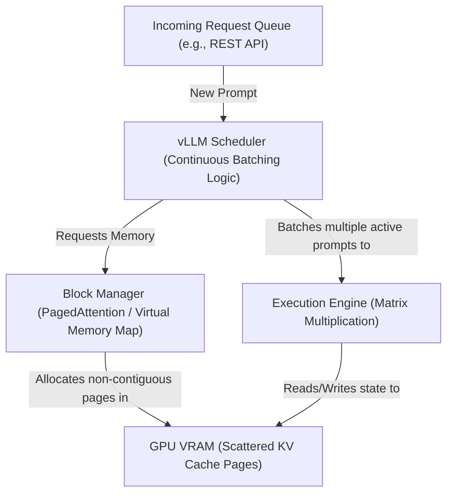

# Production LLM Serving with vLLM & Continuous Batching

Version: 1.0.0

Purpose: Understand how to serve LLMs efficiently at enterprise scale using vLLM and continuous batching techniques.

Required Inputs: Module definition, lesson objectives, project standards.

Outputs: Standards-compliant lesson markdown.


# Lesson Overview

This lesson introduces the complexities of serving Large Language Models in highly concurrent production environments. While tools like Ollama are excellent for local use, they fail under massive parallel load. We will explore vLLM, the industry standard for high-throughput LLM serving, and deeply investigate the concepts of PagedAttention and Continuous Batching, which allow AI infrastructure to serve thousands of concurrent users efficiently.

---

# Learning Objectives

* Contrast sequential processing in standard runtimes with Continuous Batching.
* Explain the concept of PagedAttention and how it solves KV Cache memory fragmentation.
* Deploy a production-ready LLM endpoint using the vLLM server.
* Configure vLLM for multi-GPU inference using Tensor Parallelism.
* Evaluate the trade-offs between latency and throughput in LLM serving.

---

# Prerequisites

* Completion of `MOD-AI-01: Hardware Architecture for AI`.
* Completion of `MOD-AI-02: Local LLM Execution with Ollama`.
* Understanding of basic Docker usage.

---

# Why This Exists

If you run an LLM server using standard PyTorch or `llama.cpp` and 100 users send requests simultaneously, the server processes them sequentially or uses static batching. Static batching requires all requests in a batch to finish before a new batch can start, leading to immense wasted GPU time (as shorter requests wait for longer ones to finish). Furthermore, the "KV Cache" (the memory storing the context of the conversation) suffers from severe fragmentation, wasting up to 60% of GPU VRAM. `vLLM` was created at UC Berkeley to solve these exact platform engineering problems, introducing PagedAttention (inspired by OS virtual memory) to virtually eliminate memory waste and continuous batching to maximize GPU utilization.

---

# Core Concepts

## The KV Cache Bottleneck

When generating tokens, LLMs do not re-read the entire prompt every single time. Instead, they store mathematical representations of past tokens in memory. This is called the **Key-Value (KV) Cache**. 
*   **The Problem:** The KV Cache grows dynamically as new tokens are generated. Because we don't know exactly how many tokens the model will generate, naive systems pre-allocate a massive chunk of contiguous VRAM for every request. If the request finishes early, that VRAM was wasted. If it runs long, it runs out of memory. This fragmentation severely limits how many concurrent users a GPU can support.

## PagedAttention

vLLM's breakthrough is **PagedAttention**. Instead of storing the KV Cache in one large contiguous block, it divides the cache into fixed-size blocks (pages), exactly like an operating system manages RAM. 
*   **How it works:** Tokens are mapped to these non-contiguous physical blocks via a block table. When more tokens are generated, a new page is dynamically allocated.
*   **The Result:** Memory waste drops to under 4%. This allows the system to fit significantly more concurrent requests into the same GPU VRAM, increasing throughput by 2x to 4x.

## Continuous Batching (In-flight Batching)

Instead of waiting for all sequences in a batch to finish, continuous batching dynamically injects new requests into the batch the exact moment an older request finishes generating its final token. The GPU never waits; it is constantly processing exactly the maximum number of tokens it can handle at any given millisecond.

---

# Architecture



---

# Real-World Example

A SaaS company provides an AI writing assistant. During peak hours, they receive 500 generation requests per second. If they used Ollama, requests would queue up, and users would wait minutes for a response. By deploying **vLLM**, the platform dynamically batches 50-100 requests simultaneously onto a single A100 GPU. As one user's paragraph finishes, a new user's prompt is instantly slotted into that exact execution cycle, ensuring high throughput and keeping latency under 2 seconds for all users.

---

# Hands-on Demonstration

Deploying a vLLM server to expose an OpenAI-compatible API.

**Input (Docker Command):**
```bash
docker run --gpus all \
    -v ~/.cache/huggingface:/root/.cache/huggingface \
    -p 8000:8000 \
    --ipc=host \
    vllm/vllm-openai:latest \
    --model meta-llama/Llama-2-7b-chat-hf \
    --max-model-len 4096
```

**Output (API Request against the server):**
```bash
curl http://localhost:8000/v1/chat/completions \
  -H "Content-Type: application/json" \
  -d '{
    "model": "meta-llama/Llama-2-7b-chat-hf",
    "messages": [{"role": "user", "content": "Hello!"}]
  }'
```

**Explanation:**
The docker command spins up vLLM serving the `Llama-2-7b-chat-hf` model. Notice the `--ipc=host` flag—vLLM requires high-performance shared memory for multi-processing. vLLM automatically exposes an endpoint on port 8000 that perfectly mimics the OpenAI API (`/v1/chat/completions`). This means any existing application written to use OpenAI can be pointed at your internal vLLM server simply by changing the base URL.

---

# Hands-on Lab

* **Objective:** Start a vLLM server and benchmark its throughput against a naive server.
* **Estimated Time:** 25 minutes
* **Difficulty:** Intermediate
* **Environment:** A Linux environment with Docker, NVIDIA Container Toolkit, and at least a 16GB GPU. *(Note: If no GPU is available, this lab is conceptual).*

## Step-by-step Instructions

1. **Start the vLLM Server:**
   Use a small model to ensure it fits in consumer VRAM.
   ```bash
   docker run --gpus all -p 8000:8000 --ipc=host \
     vllm/vllm-openai:latest \
     --model facebook/opt-125m
   ```
2. **Install a benchmarking tool:**
   We will use `ab` (Apache Bench) or `hey` to simulate concurrent load.
   ```bash
   sudo apt-get install apache2-utils
   ```
3. **Create a request payload file:**
   Create a file `request.json`:
   ```json
   {
     "model": "facebook/opt-125m",
     "prompt": "The capital of France is",
     "max_tokens": 50
   }
   ```
4. **Run the Benchmark:**
   Send 100 requests with a concurrency of 10.
   ```bash
   ab -p request.json -T application/json -c 10 -n 100 http://localhost:8000/v1/completions
   ```
5. **Analyze Output:**
   Look at the "Requests per second" metric. You will see vLLM handles this concurrent load exponentially better than sequential runners.

## Verification

The output of the `ab` command will show 0 failed requests and a high throughput rate, demonstrating successful continuous batching.

## Troubleshooting

*   **Error: `CUDA out of memory` on startup:** vLLM aggressively pre-allocates 90% of GPU memory for the KV Cache block table. If you are sharing the GPU, tell vLLM to use less memory by appending `--gpu-memory-utilization 0.5`.
*   **Error: `ValueError: Model X is not supported`:** Check the vLLM documentation; it supports most modern architectures (Llama, Mistral, Qwen) but may lag behind brand new obscure architectures.

## Cleanup

```bash
docker stop <container_id>
```

---

# Production Notes

*   **Tensor Parallelism (TP):** If a model is too big for one GPU (e.g., a 70B model requires ~140GB), you must split it. In vLLM, add `--tensor-parallel-size 4` to split the computation across 4 GPUs on the same node.
*   **Pipeline Parallelism (PP):** Used to split models across multiple *different* nodes. vLLM supports this, but it requires ultra-fast networking (InfiniBand/RoCE) to prevent severe latency.
*   **Memory Pre-allocation:** vLLM allocates almost all VRAM on startup. This is intentional. Do not panic if `nvidia-smi` shows 95% utilization while the server is idle. It is reserving space for the PagedAttention KV Cache.

---

# Common Mistakes

*   **Putting a standard load balancer in front of vLLM:** Continuous batching works best when vLLM has a massive queue of requests to pick from. If you put HAProxy in front of 5 vLLM replicas and use Round Robin, you are starving the batching engine. Use least-connections or allow requests to queue at the vLLM level.
*   **Forgetting `--ipc=host` in Docker:** Without shared memory, the Python multi-processing used by vLLM for data loading will crash or run agonizingly slowly.

---

# Failure-Driven Learning

**Scenario:** During a traffic spike, users report that the AI is generating completely gibberish text or repeating the same word endlessly. 

**Diagnosis:**
1. Check the server logs. You see warnings about "KV Cache eviction" or "Preemption".
2. Check the concurrent request metric. It is extremely high.

**Cause:**
You exceeded the physical capacity of the PagedAttention block table. vLLM accepted too many concurrent requests. To free up VRAM for new tokens, it had to "swap" the KV cache of some active requests out to system RAM, or "recompute" them. If misconfigured, this preemption can cause the model to lose context and hallucinate.

**Recovery:**
Lower the `--max-num-seqs` parameter (the maximum number of concurrent sequences vLLM will process). It is better to have requests queue at the HTTP level than to oversubscribe the GPU and cause cache evictions.

---

# Engineering Decisions

**Latency vs. Throughput**
In LLM serving, you are constantly balancing these two metrics.
*   **Optimizing for Latency:** You want the fastest time-to-first-token (TTFT) and fastest generation for a single user. You would use a small batch size, avoiding queuing delays.
*   **Optimizing for Throughput:** You want to serve the maximum number of users per second to reduce hardware costs. You configure large batch sizes. The TTFT might increase (because the GPU is waiting a few milliseconds to build a large batch), but the overall system processes vastly more tokens per second.

---

# Best Practices

*   **Use the OpenAI API Format:** Always expose your vLLM endpoints using the `--served-model-name` flag to match OpenAI's schema. This prevents vendor lock-in; developers can switch between OpenAI and your internal vLLM cluster without rewriting code.
*   **Set Max Model Length:** The longer the context window, the more KV cache memory is required. If your users only need 4k context, set `--max-model-len 4096`. Do not leave it at the model's theoretical maximum (e.g., 128k) or you will severely limit your batch size.

---

# Troubleshooting Guide

## Issue 1: vLLM fails to start with "OOM" before accepting any requests

*   **Cause:** vLLM tries to reserve a percentage of VRAM for the KV cache (default 90%). If the model weights take up 85% of the VRAM, reserving an additional 90% of total VRAM fails.
*   **Diagnosis:** Look at the initial memory profiling logs during vLLM startup.
*   **Solution:** Reduce the `--gpu-memory-utilization` flag to `0.8` or `0.7`. Alternatively, use Quantization (e.g., AWQ) to shrink the model weights, leaving more room for the KV Cache.

---

# Summary

vLLM represents the transition from "AI experimentation" to "Enterprise Platform Engineering." By applying operating system concepts like virtual memory (PagedAttention) and CPU scheduling (Continuous Batching) to GPU VRAM and matrix math, vLLM extracts maximum efficiency from incredibly expensive AI hardware. Understanding and configuring these parameters is the core competency of an AI Infrastructure Engineer.

---

# Cheat Sheet

*   **Start standard vLLM server:** `python -m vllm.entrypoints.openai.api_server --model <model>`
*   **Multi-GPU (Tensor Parallel):** Add `--tensor-parallel-size <num_gpus>`
*   **Limit Memory Reservation:** Add `--gpu-memory-utilization 0.85`
*   **Limit Context Window:** Add `--max-model-len <tokens>`
*   **Enable Quantization:** Add `--quantization awq`

---

# Knowledge Check

## Multiple Choice Questions

1. What specific problem does PagedAttention solve in LLM serving?
   * A) It speeds up the initial downloading of model weights.
   * B) It eliminates memory fragmentation in the KV Cache, increasing batch sizes.
   * C) It translates Python code into C++ for faster execution.
   * D) It allows models to be trained on multiple GPUs simultaneously.

2. In Continuous Batching, when is a new request added to the batch being processed by the GPU?
   * A) Only when all current requests in the batch have finished.
   * B) Every 10 seconds.
   * C) Immediately, at the next token generation step, when an older request finishes or space becomes available.
   * D) Only after the system restarts the vLLM service.

## Scenario Questions

You are deploying a 7B parameter model on an 80GB A100 GPU using vLLM. The model only takes 14GB of VRAM. When you start the server, `nvidia-smi` shows 72GB of VRAM in use, even though no one has sent a request yet. A junior engineer wants to kill the process because "there is a memory leak." Explain what is actually happening.

## Short Answer Questions

What is the difference between Tensor Parallelism and Pipeline Parallelism?

<details>
<summary><b>View Answers</b></summary>

### Multiple Choice
1. **[B]** - By breaking the KV cache into fixed-size pages rather than contiguous blocks, PagedAttention eliminates memory fragmentation, allowing much higher concurrent user capacity.
2. **[C]** - Continuous batching operates at the token level, injecting new requests into the batch the exact moment a slot opens up, rather than waiting for the entire sequence to finish.

### Scenario
There is no memory leak. vLLM intentionally pre-allocates a massive chunk of the GPU's VRAM (by default, 90% of available memory) upon startup to create the PagedAttention block table for the KV Cache. This ensures that memory allocation is instantaneous during high-concurrency token generation, preventing fragmentation and crashes under load.

### Short Answer
Tensor Parallelism splits a single layer (a single matrix multiplication) across multiple GPUs, requiring constant, ultra-fast communication (NVLink) and is typically restricted to a single machine. Pipeline Parallelism splits the model by layers (e.g., layers 1-10 on Node A, layers 11-20 on Node B), passing data sequentially, which can scale across different machines over slower networks.

</details>

---

# Interview Preparation

## Beginner Questions

* What is the KV Cache, and why is it necessary for LLM generation?

## Intermediate Questions

* Explain the difference between Static Batching and Continuous Batching.

## Advanced Questions

* How does vLLM handle a scenario where the KV cache of active requests exceeds the physical VRAM available (oversubscription)?

## Scenario-Based Discussions

* You need to serve a model but you want to prioritize lowest possible latency (Time to First Token) for premium users, while standard users can wait. How would you architect this using vLLM or load balancers?

<details>
<summary><b>View Answers</b></summary>

### Beginner
* **What is the KV Cache?:** The Key-Value cache is memory used by the LLM to store the mathematical representations of past tokens in a prompt. It is necessary so the model doesn't have to recompute the entire conversation history from scratch every time it generates a single new token.

### Intermediate
* **Static vs Continuous Batching:** Static batching waits for a set number of requests to arrive, processes them all at once, and waits for the longest request to finish before starting a new batch. Continuous batching operates token-by-token; as soon as one request finishes generating its final token, a new request from the queue is instantly swapped into that execution slot, keeping GPU utilization near 100%.

### Advanced
* **Handling KV Cache oversubscription:** vLLM implements preemption. When VRAM is exhausted, it suspends lower-priority or newer sequences. It handles this in two ways: "Swapping," where it moves the suspended sequence's KV cache to CPU system RAM (slow but saves state), or "Recomputation," where it deletes the cache and simply re-runs the entire prompt through the model to rebuild the cache when GPU space frees up.

### Scenario-Based Discussions
* **Architecting tiered latency:** vLLM itself does not natively support complex tiered QoS prioritization out of the box. The architectural solution is to deploy *two* separate vLLM clusters. Cluster A (Premium) is configured with a low `--max-num-seqs` (small batch size) to guarantee ultra-low latency and fast TTFT. Cluster B (Standard) is configured with a high `--max-num-seqs` to maximize throughput at the expense of latency. An API Gateway (like Kong or Envoy) routes users to the appropriate cluster based on their JWT/API token tier.

</details>

---

# Further Reading

1. [vLLM Official Documentation](https://vllm.readthedocs.io/)
2. [PagedAttention Paper (UC Berkeley)](https://arxiv.org/abs/2309.06180)
3. [Continuous Batching Explained (Anyscale Blog)](https://www.anyscale.com/blog/continuous-batching-llm-inference)
4. [Hugging Face TGI (Alternative to vLLM)](https://github.com/huggingface/text-generation-inference)
