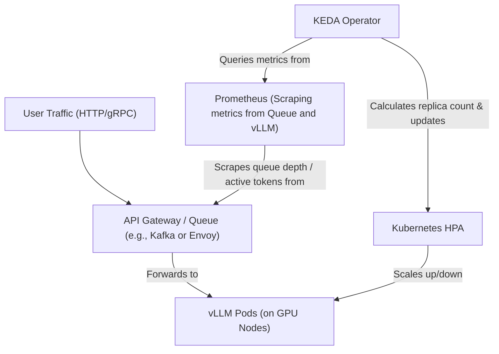

# Auto-scaling AI Workloads in Kubernetes (KEDA & GPU Nodes)

Version: 1.0.0

Purpose: Understand how to orchestrate, auto-scale, and manage GPU-enabled AI workloads within a Kubernetes cluster using KEDA.

Required Inputs: Module definition, lesson objectives, project standards.

Outputs: Standards-compliant lesson markdown.


# Lesson Overview

This lesson bridges traditional Kubernetes platform engineering with AI infrastructure. Running a single vLLM container is easy, but handling unpredictable, massive traffic spikes requires auto-scaling. Because standard Kubernetes HPA (Horizontal Pod Autoscaler) struggles with AI-specific metrics and scale-to-zero requirements, we introduce KEDA (Kubernetes Event-driven Autoscaling). You will learn how to configure GPU nodes, expose custom metrics, and scale AI pods dynamically based on queue depth.

---

# Learning Objectives

* Configure a Kubernetes cluster to schedule workloads on GPU-enabled nodes.
* Explain why traditional CPU/Memory HPA is insufficient for LLM auto-scaling.
* Deploy and configure KEDA to scale workloads based on external event queues (e.g., Prometheus metrics or Kafka).
* Implement scale-to-zero for AI workloads to drastically reduce cloud infrastructure costs.
* Troubleshoot common GPU scheduling and autoscaling failures in Kubernetes.

---

# Prerequisites

* Completion of `MOD-AI-03: Production LLM Serving with vLLM`.
* Strong understanding of Kubernetes (Pods, Deployments, Services).
* Familiarity with Prometheus for metrics scraping.

---

# Why This Exists

GPUs are incredibly expensive ($3-$30 per hour in the cloud). If an enterprise provisions a static Kubernetes cluster with 10 GPU nodes to handle peak traffic, but traffic drops to zero at night, they burn thousands of dollars an hour for idle compute. 
Historically, Kubernetes autoscaled based on CPU usage. However, LLM servers (like vLLM) constantly peg the GPU to 100% just to maintain the KV Cache block table, rendering traditional resource metrics useless. Furthermore, Kubernetes HPA cannot scale a workload to `0` pods. **KEDA** was created to solve these issues. It allows Kubernetes to intercept external metrics (like the number of pending HTTP requests in a queue or active tokens being processed) and scale pods from 0 to N based on actual AI workload demand, saving immense costs.

---

# Core Concepts

## Kubernetes GPU Scheduling

By default, Kubernetes knows nothing about GPUs. To schedule a pod on a GPU, the cluster must have the **NVIDIA Device Plugin** installed as a DaemonSet. This plugin inspects the node hardware, detects the GPUs, and advertises a custom resource to the Kubernetes API (e.g., `nvidia.com/gpu: 1`). Pods can then request this resource exactly like they request CPU or memory.

## Scale-to-Zero and Cold Starts

*   **Scale-to-Zero:** When there is no traffic, KEDA removes all pods, freeing the GPU node. The Cluster Autoscaler then terminates the underlying cloud VM, stopping the billing meter.
*   **Cold Start:** When the first request arrives, KEDA tells Kubernetes to scale from 0 to 1 pod. The cloud provider must spin up a new VM (if none exist), Kubernetes pulls the massive Docker image, and vLLM loads the multi-gigabyte model weights into VRAM. This process can take 2-5 minutes. Managing this "cold start penalty" is a massive architectural challenge in AI Platform Engineering.

## Event-Driven Autoscaling (KEDA)

KEDA acts as a metrics adapter. Instead of looking at CPU usage, KEDA can query Prometheus (e.g., "How many requests are waiting in the vLLM queue?"). If the queue length exceeds a threshold, KEDA injects the scaling command into the Kubernetes API.

---

# Architecture



---

# Real-World Example

A startup processes customer support emails using AI. During the day, they receive 10,000 emails an hour. At night, they receive 50. 
Using KEDA, their platform queries Prometheus for the metric `vllm:num_requests_waiting`. When the queue hits 20 requests, KEDA scales the deployment to 2 pods. If it hits 100, it scales to 10 pods. At night, when the queue is 0 for more than 15 minutes, KEDA scales the pods to 0. The Kubernetes Cluster Autoscaler sees 10 empty GPU nodes and terminates them. The startup saves $5,000 a month in idle GPU costs.

---

# Hands-on Demonstration

Defining a KEDA `ScaledObject` to autoscale a vLLM deployment based on Prometheus metrics.

**Input (KEDA ScaledObject YAML):**
```yaml
apiVersion: keda.sh/v1alpha1
kind: ScaledObject
metadata:
  name: vllm-scaler
  namespace: ai-serving
spec:
  scaleTargetRef:
    name: vllm-deployment
  minReplicaCount: 0  # Enable Scale to Zero
  maxReplicaCount: 5
  cooldownPeriod: 300 # Wait 5 mins before scaling down
  triggers:
  - type: prometheus
    metadata:
      serverAddress: http://prometheus-server.monitoring.svc.cluster.local:9090
      metricName: vllm_queue_depth
      threshold: '10'
      query: sum(vllm:num_requests_waiting{job="vllm"})
```

**Explanation:**
This configuration tells KEDA to monitor the `vllm-deployment`. It queries Prometheus every few seconds. The query checks how many requests are currently waiting in the vLLM queue across the cluster. If the sum is greater than 10, KEDA adds another pod. If the sum is 0, and 300 seconds have passed, KEDA scales the deployment down to 0 pods, enabling massive cost savings.

---

# Hands-on Lab

* **Objective:** Deploy a dummy GPU workload and configure a Kubernetes deployment to request GPU resources.
* **Estimated Time:** 15 minutes
* **Difficulty:** Intermediate
* **Environment:** A local Kubernetes cluster (like Minikube/Kind) or cloud cluster. *(Note: If no GPU is available, the pod will remain in Pending state, which perfectly demonstrates the scheduling mechanic).*

## Step-by-step Instructions

1. **Create a Deployment requiring a GPU:**
   Create a file `gpu-pod.yaml`:
   ```yaml
   apiVersion: apps/v1
   kind: Deployment
   metadata:
     name: ai-worker
   spec:
     replicas: 1
     selector:
       matchLabels:
         app: ai-worker
     template:
       metadata:
         labels:
           app: ai-worker
       spec:
         containers:
         - name: worker
           image: nvidia/cuda:11.8.0-base-ubuntu22.04
           command: ["nvidia-smi"]
           resources:
             limits:
               nvidia.com/gpu: 1 # This is the critical line
   ```
2. **Apply the configuration:**
   ```bash
   kubectl apply -f gpu-pod.yaml
   ```
3. **Inspect the Pod:**
   ```bash
   kubectl get pods
   kubectl describe pod -l app=ai-worker
   ```

## Verification

If you have a GPU node and the NVIDIA device plugin installed, the pod will run `nvidia-smi` and exit successfully.
If you *do not* have a GPU node, the pod will be in a `Pending` state. The `kubectl describe` output will show: `Warning  FailedScheduling  ...  0/1 nodes are available: 1 Insufficient nvidia.com/gpu.` This verifies that Kubernetes correctly recognizes the GPU as a strict scheduling requirement.

## Troubleshooting

*   **Error: `nvidia.com/gpu` not recognized by cluster:** You must install the NVIDIA Device Plugin via Helm. `helm install nvdp nvdp/nvidia-device-plugin`
*   **Pod stuck in ContainerCreating:** Usually means the node has the GPU, but the Container Runtime (containerd/docker) is not configured to use the `nvidia-container-runtime`. Check host node configurations.

## Cleanup

```bash
kubectl delete -f gpu-pod.yaml
```

---

# Production Notes

*   **Taints and Tolerations:** GPU nodes are expensive. You do not want a random logging daemon or NGINX pod scheduling on a GPU node and taking up CPU/Memory. Platform engineers apply a `Taint` to GPU nodes (e.g., `gpu=true:NoSchedule`). AI workloads must then include a `Toleration` in their YAML to be allowed on that node.
*   **Model Pull Times:** Scaling up a new pod requires downloading a 30GB+ Docker image/model. If autoscaling takes 10 minutes to pull the image, the traffic spike will be over before the pod is ready. *Solution:* Use tools like Spegel (p2p image sharing), baked AMIs with the models pre-loaded, or mount models via CSI network attached storage (like AWS FSx or GCP Filestore).

---

# Common Mistakes

*   **Autoscaling on CPU/Memory:** As mentioned, LLMs peg the GPU memory to maximum upon startup due to KV Cache allocation. If you configure HPA to scale at 80% memory usage, KEDA will scale to maximum replicas instantly and never scale down, resulting in massive cloud bills.
*   **Ignoring Pod Disruption Budgets (PDB):** If you are running a multi-GPU model using Tensor Parallelism, the pods *must* run simultaneously. If a cluster autoscaler evicts one pod to scale down a node, the entire distributed inference job crashes.

---

# Failure-Driven Learning

**Scenario:** You configured KEDA to scale to zero. A user logs in at 2:00 AM and submits a prompt. The API gateway times out after 30 seconds and returns a `504 Gateway Timeout`.

**Diagnosis:**
1. Check the user's request log.
2. Check `kubectl get pods`. You see the vLLM pod is in `ContainerCreating` or `Init` state.

**Cause:**
Because the replica count was 0, KEDA intercepted the metric (or incoming HTTP request via KEDA HTTP Addon) and triggered a scale to 1. However, provisioning the cloud VM, pulling the model, and starting vLLM takes 3 minutes. The user's HTTP request timed out after 30 seconds.

**Recovery:**
Cold starts are incompatible with synchronous HTTP timeouts.
*   *Architectural Fix A:* Do not scale to 0. Scale to 1 minimum. Accept the cost.
*   *Architectural Fix B:* Change the application architecture to be asynchronous. The API gateway immediately returns a `202 Accepted` with a Job ID. The user's frontend polls for the result, allowing the backend 5 minutes to cold-start without throwing errors.

---

# Engineering Decisions

**Where to Queue: HTTP Layer vs Message Broker**
*   **HTTP Layer (KEDA HTTP Addon / Envoy):** Easier to integrate with standard web apps. Requests block until a pod is ready. High risk of timeouts during cold starts.
*   **Message Broker (Kafka / RabbitMQ):** The API puts the prompt in Kafka. KEDA scales pods based on Kafka lag. Pods pull from Kafka when ready. *Trade-off:* Bulletproof reliability and zero dropped requests, but requires rewriting the application to use WebSockets or Polling to get the response back to the user.

---

# Best Practices

*   **Use Custom Metrics:** Expose Prometheus metrics directly from your inference server (e.g., `vllm:num_requests_waiting` or `vllm:gpu_cache_usage_perc`). Scale based on queue depth or KV cache saturation, not standard hardware metrics.
*   **Aggressive Cooldowns:** Do not scale down quickly. If traffic is spiky, scaling down immediately will trigger another 5-minute cold start a minute later. Set KEDA's `cooldownPeriod` to at least 15-30 minutes for heavy AI workloads.

---

# Troubleshooting Guide

## Issue 1: KEDA triggers a scale-up, but Pods remain Pending forever

*   **Cause:** KEDA successfully updated the HPA, and Kubernetes created the Pod specs. However, there are no GPU nodes available in the cluster, and the Cloud Autoscaler failed to provision a new one.
*   **Diagnosis:** Run `kubectl describe pod <pending-pod>`. Look for `FailedScheduling`. If the Cloud Autoscaler logs show `OutOfCapacity`, the cloud provider (AWS/GCP) has no GPUs available in that specific region.
*   **Solution:** Configure the cluster autoscaler to fallback to different node pools (e.g., fallback from A100s to L4s) or multi-region deployment. Cloud GPU scarcity is a major real-world issue.

---

# Summary

Auto-scaling AI workloads requires a paradigm shift from traditional stateless microservices. Because AI models are massive and rely on specialized GPU hardware, cold starts are painfully slow, and standard CPU metrics are irrelevant. By combining Kubernetes GPU scheduling (Taints, Tolerations, Device Plugins) with event-driven autoscaling via KEDA, platform engineers can build elastic AI infrastructure that handles massive spikes while scaling to zero to minimize costs during idle periods.

---

# Cheat Sheet

*   **Request GPU in Pod Spec:** `resources.limits."nvidia.com/gpu": "1"`
*   **Taint a GPU node:** `kubectl taint nodes <node-name> gpu=true:NoSchedule`
*   **Add Toleration to Pod:** `tolerations: [{key: "gpu", operator: "Equal", value: "true", effect: "NoSchedule"}]`
*   **Check KEDA objects:** `kubectl get scaledobjects`
*   **Check HPA created by KEDA:** `kubectl get hpa`

---

# Knowledge Check

## Multiple Choice Questions

1. Why is the standard Kubernetes HPA based on CPU/Memory utilization a poor choice for auto-scaling LLM inference servers like vLLM?
   * A) Kubernetes cannot read GPU metrics directly.
   * B) Inference servers often reserve nearly 100% of GPU VRAM on startup for the KV Cache, making memory metrics look statically maxed out.
   * C) HPA scales too fast, crashing the models.
   * D) HPA does not support scaling deployments, only StatefulSets.

2. What is the primary purpose of adding a Taint to a GPU-enabled node in Kubernetes?
   * A) To encrypt the traffic going to the GPU.
   * B) To prevent the node from being deleted by the cluster autoscaler.
   * C) To prevent standard, non-GPU workloads (like a web frontend) from being scheduled on the expensive GPU node.
   * D) To force the node to reboot if the GPU overheats.

## Scenario Questions

Your company's AI summary feature is used heavily from 9 AM to 5 PM but gets zero traffic at night. You configured KEDA to scale the vLLM deployment to 0 at night. However, your finance team reports that the AWS bill for the GPU instances hasn't dropped at all. What crucial Kubernetes component is likely missing or misconfigured?

## Short Answer Questions

What is a "Cold Start" in the context of AI infrastructure, and why is it more problematic than a cold start for a standard Node.js microservice?

<details>
<summary><b>View Answers</b></summary>

### Multiple Choice
1. **[B]** - Tools like vLLM pre-allocate massive amounts of memory for optimization (PagedAttention). If HPA looks at memory, it assumes the pod is always at maximum capacity, resulting in incorrect scaling behavior.
2. **[C]** - Taints repel pods. By tainting a GPU node, only pods that specifically explicitly declare they "tolerate" that taint will be scheduled there. This ensures expensive GPU compute isn't wasted running cheap generic containers.

### Scenario
The **Cluster Autoscaler** (or Karpenter) is missing or misconfigured. KEDA successfully scaled the *Pods* to 0. However, if the Cluster Autoscaler is not configured to recognize empty nodes and terminate the underlying AWS EC2 instances, the empty VMs will stay running, and AWS will continue billing for them.

### Short Answer
A "Cold Start" occurs when an application scales from 0 to 1, requiring the infrastructure to spin up entirely from scratch. It is vastly more problematic for AI because standard microservices are a few megabytes and start in milliseconds. AI models require provisioning a specialized GPU VM, downloading a 10GB-100GB docker image/model weights, and loading those weights into VRAM, a process that can take multiple minutes.

</details>

---

# Interview Preparation

## Beginner Questions

* How does a Kubernetes Pod request a GPU?

## Intermediate Questions

* Explain how KEDA differs from the standard Kubernetes Horizontal Pod Autoscaler (HPA).

## Advanced Questions

* You are scaling up a 40GB model using Kubernetes. During a sudden traffic spike, KEDA scales from 1 to 10 pods. The pods are scheduled on new nodes, but they take 8 minutes to pull the model image from the container registry, causing the API to time out. How would you architect the platform to solve this image pull bottleneck?

## Scenario-Based Discussions

* Your development team wants to deploy a distributed LLM training job across 8 GPUs spanning 2 different nodes. Can you use KEDA to autoscale this training job based on a queue of training data? Why or why not?

<details>
<summary><b>View Answers</b></summary>

### Beginner
* **How does a Pod request a GPU?:** Assuming the NVIDIA Device Plugin is installed on the cluster, a pod requests a GPU exactly like CPU or memory, by adding `nvidia.com/gpu: 1` under the `resources.limits` block in the container spec.

### Intermediate
* **KEDA vs HPA:** HPA primarily scales based on internal pod metrics (CPU/Memory) and cannot scale a deployment to 0. KEDA is an event-driven autoscaler that extends HPA. It can scale based on external metrics (like a Kafka queue length or a Prometheus query) and natively supports scaling deployments down to exactly 0 pods to save costs.

### Advanced
* **Solving Image Pull Bottlenecks:** There are several architectural solutions. 1) Use a P2P image distribution system like Dragonfly or Spegel within the cluster. 2) Do not put the model in the Docker image; instead, bake the model weights into the cloud provider's Machine Image (AMI) so the node boots with the data already on the disk. 3) Use a network-attached high-performance filesystem (like AWS FSx for Lustre) and mount it to the pods via CSI, bypassing the image pull entirely.

### Scenario-Based Discussions
* **Autoscaling Distributed Training:** No, you should not use KEDA for this. Distributed training jobs (using frameworks like Ray or MPI) are stateful, tightly coupled workloads that require all nodes to be present simultaneously to communicate via mechanisms like Ring All-Reduce. Autoscaling them dynamically based on a queue would break the synchronization ring and crash the training job. KEDA is meant for stateless *inference* serving, not stateful distributed *training*.

</details>

---

# Further Reading

1. [KEDA Official Documentation](https://keda.sh/)
2. [Scheduling GPUs in Kubernetes (Official Docs)](https://kubernetes.io/docs/tasks/manage-gpus/scheduling-gpus/)
3. [NVIDIA Device Plugin for Kubernetes](https://github.com/NVIDIA/k8s-device-plugin)
4. [Scaling LLMs to Zero on Kubernetes](https://learnk8s.io/)
