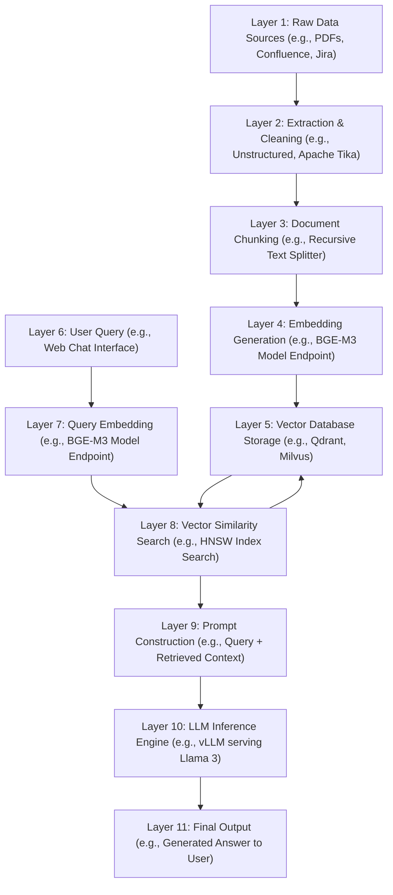

# Designing Retrieval-Augmented Generation (RAG) Infrastructure

Version: 1.0.0

Purpose: Canonical lesson structure for Platform Engineering & AI Infrastructure Curriculum.

Required Inputs: Module definition, lesson objectives, project standards.

Outputs: Standards-compliant lesson markdown.


# Lesson Overview

This lesson introduces the architecture and infrastructure required to build highly scalable Retrieval-Augmented Generation (RAG) systems. As Large Language Models (LLMs) continue to power enterprise applications, mitigating hallucinations and grounding their responses in private, domain-specific data has become paramount. RAG solves this by intercepting user queries, retrieving relevant factual data from an external knowledge base, and injecting that context into the prompt before inference. Here, we delve into how platform engineers design the data ingestion pipelines, vector embeddings, retrieval systems, and serving layers to make RAG robust, performant, and reliable in production.

---

# Learning Objectives

* Understand the architectural components and data flow of a production-grade RAG pipeline.
* Design robust ingestion strategies for chunking and embedding enterprise data at scale.
* Architect scalable retrieval systems that interface seamlessly with LLM inference endpoints.
* Implement observability and performance tuning mechanisms to optimize context retrieval latency and relevance.
* Evaluate the trade-offs between different embedding models, chunking strategies, and retrieval algorithms.

---

# Prerequisites

* Basic understanding of LLM inference concepts and API usage (Module 14: AI Infrastructure & LLM Serving).
* Familiarity with containerized deployments (Kubernetes, Docker).
* General knowledge of distributed systems and microservices architecture.
* Understanding of basic Python for MLOps scripting.

---

# Why This Exists

Large Language Models are powerful reasoning engines but they suffer from significant limitations: they hallucinate facts, their internal knowledge cutoff dates make them unaware of recent events, and they have zero visibility into an organization's proprietary, secure data. Retraining or fine-tuning an LLM continuously to memorize new data is computationally prohibitive and practically impossible for rapidly changing enterprise knowledge. 

Retrieval-Augmented Generation (RAG) was created to solve this precise problem. By decoupling the reasoning engine (the LLM) from the knowledge base (the database), RAG allows organizations to feed the LLM exactly the context it needs, right when it needs it. Platform engineers must build the infrastructure to support this paradigm: creating the pipelines that convert raw documents into mathematical vectors, storing them efficiently, and retrieving them with sub-second latency to append to the user's prompt. 

---

# Core Concepts

## The RAG Data Flow

RAG fundamentally consists of two asynchronous workflows:
1.  **Data Ingestion (Offline Pipeline):** The continuous or batch process of extracting data from various sources (Confluence, Jira, PDFs, databases), cleaning it, chunking it into smaller segments, converting those chunks into vector embeddings using an embedding model, and storing them in a Vector Database.
2.  **Retrieval & Generation (Online Pipeline):** The real-time process where a user submits a query. The query is first embedded into a vector. The system performs a similarity search in the Vector Database to find the most relevant document chunks. These chunks are prepended to the user's query as "context" and sent to the LLM for the final generation.

## Chunking Strategies

LLMs have limited context windows (e.g., 8k, 32k, 128k tokens). You cannot pass a 500-page PDF into an LLM prompt. Even if you could, "lost in the middle" phenomena reduce the model's accuracy when context is too large. 

**Chunking** is the process of breaking large documents into smaller, semantically meaningful pieces.
*   **Fixed-Size Chunking:** Splitting by a set number of characters or tokens, usually with some overlap (e.g., 500 tokens with 50 token overlap). Simple but may break sentences in half.
*   **Recursive Character Chunking:** Attempts to split on natural boundaries like double newlines `\n\n`, then single newlines `\n`, then spaces, keeping chunks under a size limit.
*   **Semantic Chunking:** Advanced techniques that use NLP to split documents by topic or logical section boundaries.

## Vector Embeddings

An embedding is a numerical representation of text—a dense array of floating-point numbers (a vector) where semantic meaning is mapped to spatial proximity. Models like OpenAI's `text-embedding-ada-002` or open-source models like `BGE-M3` translate sentences into high-dimensional space (e.g., 768 or 1536 dimensions). In this space, sentences with similar meanings ("The cat sat on the mat" and "A feline rested on the rug") are mathematically close to each other.

## Vector Search (Retrieval)

Once data is embedded and stored, the system must search it. 
*   **K-Nearest Neighbors (k-NN):** An exhaustive search measuring the distance between the query vector and every single vector in the database (using metrics like Cosine Similarity or Euclidean Distance). Highly accurate but unscalable for millions of documents.
*   **Approximate Nearest Neighbors (ANN):** Algorithms like HNSW (Hierarchical Navigable Small World) build graph indexes that allow the database to find the closest vectors in logarithmic time, trading a tiny fraction of accuracy for massive speed gains. Production RAG relies on ANN.

---

# Architecture



---

# Real-World Example

At **Spotify**, internal developers need to query thousands of pages of internal documentation, API specs, and runbooks. Spotify's Backstage developer portal incorporates a RAG system. 
During the night (Offline Pipeline), an automated cron job runs in Kubernetes. It pulls the latest Markdown files from GitHub repositories, chunks them into 500-token segments using a Python microservice, calls an internal embedding model to vectorize them, and upserts them into a managed Qdrant vector database.
During the day (Online Pipeline), a developer asks, "How do I provision a new Cassandra cluster?" The developer portal embeds this query, searches Qdrant for the top 5 most relevant runbook chunks, and constructs a prompt: *"Answer the query using ONLY the following context: [Runbook Chunk 1, 2, 3, 4, 5]. Query: How do I provision a new Cassandra cluster?"*. The internal LLM reads the runbooks and generates a highly accurate, Spotify-specific answer in seconds.

---

# Hands-on Demonstration

Let's look at the basic Python logic for a minimal RAG pipeline using `langchain` and `chromadb` (a local vector store) to understand the mechanics before we scale it up.

**Input:** A text file `company_policy.txt` containing dummy corporate policies.

**Code:**

```python
from langchain_community.document_loaders import TextLoader
from langchain_text_splitters import RecursiveCharacterTextSplitter
from langchain_community.embeddings.sentence_transformer import SentenceTransformerEmbeddings
from langchain_community.vectorstores import Chroma
from langchain_community.llms import Ollama
from langchain.chains import RetrievalQA

# 1. INGESTION & CHUNKING
loader = TextLoader("company_policy.txt")
documents = loader.load()
text_splitter = RecursiveCharacterTextSplitter(chunk_size=200, chunk_overlap=20)
chunks = text_splitter.split_documents(documents)
print(f"Split document into {len(chunks)} chunks.")

# 2. EMBEDDING & STORAGE
# Using an open-source local embedding model
embedding_function = SentenceTransformerEmbeddings(model_name="all-MiniLM-L6-v2")
vectorstore = Chroma.from_documents(chunks, embedding_function, persist_directory="./chroma_db")

# 3. RETRIEVAL & GENERATION
# Assuming Ollama is running locally serving 'llama3'
llm = Ollama(model="llama3")
qa_chain = RetrievalQA.from_chain_type(
    llm,
    retriever=vectorstore.as_retriever(search_kwargs={"k": 3}) # Retrieve top 3 chunks
)

# 4. QUERY
query = "What is the company policy on remote work?"
response = qa_chain.invoke({"query": query})
print("\nAnswer:", response["result"])
```

**Expected Output:**
```text
Split document into 14 chunks.

Answer: Based on the provided context, the company allows employees to work remotely up to two days per week, subject to manager approval. Remote work days must be logged in the HR portal.
```

**Explanation:** The script loads the text, chunks it intelligently, uses a local CPU-optimized model to create embeddings, stores them in ChromaDB. When queried, it embeds the question, fetches the 3 closest chunks, and feeds them to the local Llama 3 model via Ollama to generate the final answer.

---

# Hands-on Lab

* **Objective:** Deploy a scalable RAG ingestion microservice to Kubernetes using Python and Qdrant.
* **Estimated Time:** 45 minutes
* **Difficulty:** Intermediate
* **Environment:** Local Kubernetes cluster (minikube/kind), Python 3.10+, Docker.

## Step-by-step Instructions

1. **Start Local Vector Database (Qdrant):**
   Deploy a local instance of Qdrant using Helm.
   ```bash
   helm repo add qdrant https://qdrant.github.io/qdrant-helm
   helm install my-qdrant qdrant/qdrant --set service.type=NodePort
   ```

2. **Create the Python Ingestion Script (`ingest.py`):**
   Write a script that connects to Qdrant, initializes a collection, and pushes embeddings.
   ```python
   from qdrant_client import QdrantClient
   from qdrant_client.models import Distance, VectorParams, PointStruct
   import numpy as np

   client = QdrantClient(host="localhost", port=6333)

   # Create Collection
   client.recreate_collection(
       collection_name="docs",
       vectors_config=VectorParams(size=384, distance=Distance.COSINE),
   )

   # Dummy embedding (replace with real model in production)
   dummy_vector = np.random.rand(384).tolist()
   
   client.upsert(
       collection_name="docs",
       points=[
           PointStruct(id=1, vector=dummy_vector, payload={"text": "This is a document chunk about Kubernetes."})
       ]
   )
   print("Successfully ingested to Qdrant!")
   ```

3. **Containerize the Ingestion Service:**
   Create a `Dockerfile`.
   ```dockerfile
   FROM python:3.10-slim
   RUN pip install qdrant-client numpy
   COPY ingest.py .
   CMD ["python", "ingest.py"]
   ```
   Build the image: `docker build -t rag-ingester:1.0 .`

4. **Deploy as a Kubernetes CronJob:**
   Create a `cronjob.yaml` to run this ingestion nightly.
   ```yaml
   apiVersion: batch/v1
   kind: CronJob
   metadata:
     name: rag-ingester
   spec:
     schedule: "0 2 * * *" # Run at 2 AM
     jobTemplate:
       spec:
         template:
           spec:
             containers:
             - name: ingester
               image: rag-ingester:1.0
               imagePullPolicy: IfNotPresent
             restartPolicy: OnFailure
   ```
   Apply it: `kubectl apply -f cronjob.yaml`

## Verification

Trigger the CronJob manually to test:
```bash
kubectl create job --from=cronjob/rag-ingester manual-ingest-1
kubectl logs job/manual-ingest-1
```
You should see: `Successfully ingested to Qdrant!`

## Troubleshooting

*   **Qdrant Connection Refused:** Ensure your Python script is pointing to the correct Kubernetes Service DNS (e.g., `my-qdrant.default.svc.cluster.local`) if running inside the cluster, or via port-forwarding if running locally.
*   **Vector Size Mismatch:** Qdrant will throw an error if the array length being inserted (e.g., 384) does not perfectly match the `size` defined in `VectorParams`. Ensure your embedding model output matches the collection configuration.

## Cleanup

```bash
kubectl delete cronjob rag-ingester
kubectl delete job manual-ingest-1
helm uninstall my-qdrant
```

---

# Production Notes

*   **Asynchronous Processing:** Ingestion should never be synchronous in the request path. Use message queues (Kafka, RabbitMQ) to buffer document uploads and process them via background workers.
*   **Embedding Endpoint Scaling:** Generating embeddings requires compute (often GPUs for high throughput). The embedding service must be scaled independently of the LLM inference service and the vector database. Use KEDA to autoscale embedding workers based on the length of the ingestion queue.
*   **Hybrid Search:** Pure vector search struggles with exact keyword matching (e.g., searching for a specific UUID or error code). Production systems use "Hybrid Search" combining Dense Vector Search (semantic) with Sparse Vector Search / BM25 (keyword matching) to get the best of both worlds.
*   **Re-ranking:** Fetching the top 20 chunks and then passing them through a cross-encoder model (a Re-ranker like Cohere Re-rank or BGE-Reranker) significantly improves relevance before sending the final top 5 to the LLM.

---

# Common Mistakes

*   **Blindly Trusting Chunking Defaults:** Using default chunk sizes (e.g., 1000 tokens) without considering the document structure. A 1000-token chunk might contain the end of one topic and the beginning of an entirely unrelated topic, diluting the semantic meaning of the embedding vector.
*   **Failing to Update Vectors on Document Deletion:** When a document is updated or deleted in the source system (e.g., Confluence), the pipeline must gracefully update or soft-delete the corresponding vector chunks in the database. Failing to do so leads to the LLM hallucinating based on outdated "ghost" data.
*   **Prompt Injection Vulnerabilities:** If user queries are passed directly into the RAG prompt without sanitization, users can trick the LLM into ignoring the retrieved context or revealing system prompts.

---

# Failure-Driven Learning

**Scenario:** You deploy your RAG system. Users complain that the LLM is providing completely irrelevant answers.

**Diagnosis:** 
1. Check the LLM output. Is it hallucinating, or is it accurately summarizing irrelevant context?
2. You inspect the prompt being sent to the LLM (Layer 9 in architecture). You see that the retrieved chunks are indeed completely irrelevant to the user's query.
3. You test the Vector Search manually. A query for "database backup" returns chunks about "office holiday parties."
4. You check the Embedding Pipeline. You discover that the model used to embed the documents during offline ingestion (`text-embedding-ada-002`) is DIFFERENT from the model used to embed the user's query online (`BGE-M3`).

**Resolution:** 
Embeddings are model-specific. An array of numbers from OpenAI means absolutely nothing in the dimensional space of a BGE model. The offline ingestion and online query embedding MUST use the exact same model version. You align the models, re-index the vector database, and search relevance is restored.

---

# Engineering Decisions

*   **Local vs. API Embedding Models:** Should you use OpenAI for embeddings, or host your own BGE-M3/MiniLM? API models are easy to set up but incur recurring costs and require sending private data out of your VPC. Self-hosting requires managing GPU infrastructure and scaling embedding microservices, but guarantees data privacy and lower long-term costs for massive datasets.
*   **Chunk Size Trade-offs:** Smaller chunks (e.g., 100 tokens) provide highly specific search results but lack surrounding context, meaning the LLM might not understand the broader picture. Larger chunks (e.g., 1000 tokens) provide great context but dilute the vector's specificity, meaning the search might miss a highly specific user query. Platform engineers often index multiple chunk sizes (Parent-Child chunking) to resolve this.

---

# Best Practices

*   **Metadata Tagging:** Always attach rich metadata (author, date, source URL, department) to your vector payloads. This allows for pre-filtering (e.g., "Only search documents tagged 'Engineering' and updated in 2023") before doing the expensive vector distance calculations.
*   **Evaluating RAG:** Don't guess if your RAG is working. Implement evaluation frameworks like RAGAS (RAG Assessment) or TruLens to quantitatively measure Context Precision, Context Recall, and Answer Relevance.
*   **Embedding Versioning:** Treat your vector database collections like immutable artifacts. If you upgrade your embedding model, create a new collection (e.g., `docs_v2`), run a batch job to re-embed everything, and perform a blue/green cutover in your retrieval API.

---

# Troubleshooting Guide

## Issue 1: High Latency during Retrieval

*   **Cause:** The system is performing exact k-NN searches across millions of vectors instead of utilizing an index.
*   **Diagnosis:** Monitor the query execution time on the vector database. High CPU usage combined with query times >500ms for simple searches indicates sequential scanning.
*   **Solution:** Ensure an HNSW (Hierarchical Navigable Small World) index is configured and successfully built on the collection. Tune the `m` and `ef_construct` parameters to balance build time, memory usage, and search speed.

## Issue 2: LLM Ignores the Provided Context

*   **Cause:** The prompt structure is confusing, or the context is too large and the critical information is buried in the middle ("Lost in the Middle" syndrome).
*   **Diagnosis:** Inspect the final constructed prompt. If the context chunks are overwhelmingly long, or if the system instructions ("Use this context to answer") are placed at the very top of a massive prompt, the LLM might forget them by the time it reaches the query at the bottom.
*   **Solution:** Optimize the prompt structure. Place the system instructions and the user query at the *very end* of the prompt, immediately after the retrieved context. Reduce the number of chunks retrieved (k), or implement a Re-ranker to only send the top 2-3 most relevant chunks.

---

# Summary

Retrieval-Augmented Generation (RAG) is the foundational architecture for building reliable, enterprise-grade AI applications. By architecting decoupled pipelines for data ingestion, vector embedding, and similarity search, platform engineers can provide LLMs with dynamic, domain-specific knowledge. Success in RAG infrastructure relies heavily on choosing the right chunking strategies, ensuring embedding model consistency, scaling vector databases, and continually evaluating retrieval precision.

---

# Cheat Sheet

*   **Common Open-Source Embedding Models:** `BAAI/bge-m3`, `sentence-transformers/all-MiniLM-L6-v2`, `nomic-ai/nomic-embed-text`
*   **Vector Database Options:** Qdrant (Rust, highly performant), Milvus (Distributed, massive scale), pgvector (PostgreSQL extension, easy integration), Chroma (Local/dev focus).
*   **Distance Metrics:** 
    *   `Cosine Similarity`: Measures angle between vectors; best for text embeddings.
    *   `Euclidean Distance (L2)`: Measures straight-line distance; sensitive to vector magnitude.
    *   `Dot Product`: Fast, but requires vectors to be normalized.

---

# Knowledge Check

## Multiple Choice Questions

1. Why is Approximate Nearest Neighbors (ANN) preferred over exact k-NN search in production RAG systems?
   * A) ANN provides 100% perfect accuracy.
   * B) ANN is required to calculate Cosine Similarity.
   * C) Exact k-NN does not scale to millions of vectors due to O(N) time complexity, whereas ANN offers logarithmic search times.
   * D) ANN requires less storage space on disk.

2. What happens if you embed your documents with `Model-A` but embed the user's search query with `Model-B`?
   * A) The vector database will automatically translate the vectors.
   * B) The retrieval system will return completely irrelevant results because the dimensional spaces do not align.
   * C) The LLM will hallucinate but the retrieval will work fine.
   * D) The system will default to keyword search.

## Scenario Questions

You are designing a RAG system for a legal firm. The documents are 50-page contracts. Lawyers need to query highly specific clauses. A standard 1000-token chunking strategy is resulting in poor retrieval because the vectors are too "diluted" with surrounding boilerplate text. How do you architect a better chunking and retrieval strategy?

## Short Answer Questions

What is the purpose of a "Re-ranker" in a RAG pipeline?

<details>
<summary><b>View Answers</b></summary>

### Multiple Choice
1. **[C]** - *Exact k-NN requires measuring the distance between the query and every single vector in the database, which is too slow for large datasets. ANN algorithms like HNSW trade a tiny bit of accuracy for massive speed improvements.*
2. **[B]** - *Embeddings are model-specific mathematical representations. Comparing vectors from two different models is like comparing coordinates on two completely different maps.*

### Scenario
*Implement a Parent-Child (or Small-to-Big) chunking strategy. Break the documents into very small chunks (e.g., 100 tokens or single sentences) for highly specific vector embedding and precise retrieval. However, link these small chunks to their parent "large" chunk. When a small chunk matches the query, retrieve and send the larger parent chunk to the LLM to ensure it has enough surrounding context to understand the clause properly.*

### Short Answer
*A Re-ranker is a cross-encoder model used after the initial fast vector search. The vector search might retrieve 20 broadly relevant documents. The Re-ranker then scores each of those 20 documents specifically against the user query with high precision, reordering them so only the absolute most relevant top 3-5 documents are sent to the LLM, reducing noise and context window size.*

</details>

---

# Interview Preparation

## Beginner Questions

* What is the difference between fine-tuning an LLM and using RAG?
* Why do we need to chunk documents before creating embeddings?

## Intermediate Questions

* Explain how a Hierarchical Navigable Small World (HNSW) index improves vector database performance.
* How do you handle updating vectors when the source document changes or is deleted?

## Advanced Questions

* Contrast Dense Vector Search with Sparse Vector Search (BM25) and explain why a platform might implement Hybrid Search.
* Describe an architecture for an asynchronous data ingestion pipeline that scales to process millions of documents daily.

## Scenario-Based Discussions

* Your RAG system is retrieving the correct documents, but the LLM is occasionally ignoring them and hallucinating an answer based on its training data. How do you mitigate this?

<details>
<summary><b>View Answers</b></summary>

### Beginner
* **What is the difference between fine-tuning an LLM and using RAG?:** Fine-tuning bakes knowledge directly into the model's neural weights, which is expensive, time-consuming, and difficult to update. RAG keeps the model static and provides knowledge dynamically at runtime by retrieving it from a database, making it cheaper and easier to keep data up-to-date.
* **Why do we need to chunk documents before creating embeddings?:** LLMs have strict context window limits. Furthermore, embedding an entire 50-page document into a single vector dilutes its semantic meaning, making it impossible to retrieve specific facts accurately.

### Intermediate
* **Explain how a Hierarchical Navigable Small World (HNSW) index improves vector database performance.:** HNSW creates a multi-layered graph structure of the vectors. It starts searching in sparse upper layers to quickly navigate to the general neighborhood of the query, then drops down to denser layers for precise matching. This changes search time from O(N) (linear scan) to roughly O(log N).
* **How do you handle updating vectors when the source document changes or is deleted?:** The ingestion pipeline must track a unique identifier (e.g., Document ID + Chunk Index) for every chunk inserted into the vector database. When the source document is updated, the pipeline recalculates the chunks and embeddings, and performs an 'upsert' using those IDs to overwrite the old vectors. Deletions trigger a delete command based on the Document ID prefix.

### Advanced
* **Contrast Dense Vector Search with Sparse Vector Search (BM25) and explain why a platform might implement Hybrid Search.:** Dense search uses neural embeddings to find semantic similarity (understanding concepts and synonyms). Sparse search (BM25) uses traditional TF-IDF keyword matching (counting exact word frequencies). Hybrid Search combines them because dense search often fails at finding specific UUIDs, acronyms, or names, while sparse search fails at understanding intent. Combining their scores yields the most robust retrieval.
* **Describe an architecture for an asynchronous data ingestion pipeline that scales to process millions of documents daily.:** Raw documents trigger events stored in an S3 bucket, which push messages to a Kafka topic. A scalable pool of Kubernetes worker pods consumes from Kafka. The workers download the document, perform chunking, and call a load-balanced GPU inference service to generate embeddings. The workers then batch-upsert the vectors into a distributed Milvus cluster. Auto-scaling (KEDA) scales the workers based on Kafka lag.

### Scenario-Based Discussions
* **Your RAG system is retrieving the correct documents, but the LLM is occasionally ignoring them...:** This is an issue with Prompt Engineering or "Lost in the Middle". Ensure the retrieved context is cleanly formatted. Crucially, place the instruction ("Answer strictly using the provided context") and the user's query at the very bottom of the prompt, immediately after the context chunks, so it is the last thing the LLM processes. Additionally, you can adjust the LLM's system prompt to strongly penalize utilizing outside knowledge.

</details>

---

# Further Reading

1. [LangChain Retrieval Documentation](https://python.langchain.com/docs/modules/data_connection/)
2. [Qdrant Vector Search Principles](https://qdrant.tech/documentation/concepts/search/)
3. [Pinecone: What is a Vector Database?](https://www.pinecone.io/learn/vector-database/)
4. [OpenAI Embeddings Guide](https://platform.openai.com/docs/guides/embeddings)
5. [Evaluating RAG with RAGAS](https://docs.ragas.io/en/latest/)
