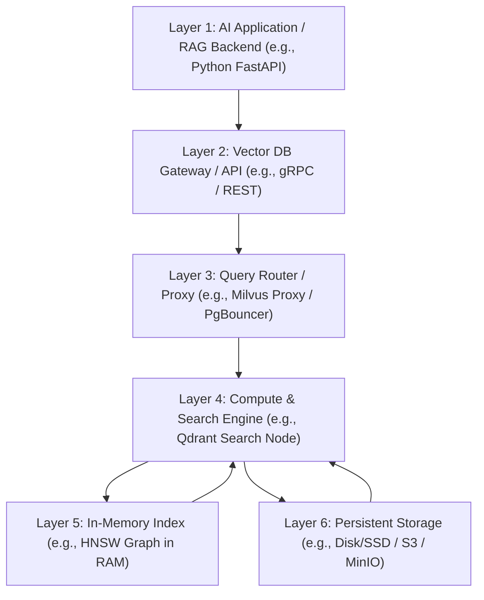

# Vector Database Architecture (Qdrant, Milvus, pgvector)

Version: 1.0.0

Purpose: Canonical lesson structure for Platform Engineering & AI Infrastructure Curriculum.

Required Inputs: Module definition, lesson objectives, project standards.

Outputs: Standards-compliant lesson markdown.


# Lesson Overview

This lesson explores the internal mechanics and architectural trade-offs of modern vector databases, the critical storage layer of the AI infrastructure stack. We will dissect how these systems store, index, and retrieve high-dimensional data at millisecond latencies. Specifically, we will compare three dominant paradigms: a purpose-built high-performance engine (Qdrant), a massive-scale distributed system (Milvus), and a relational database extension (pgvector). Understanding these architectures enables platform engineers to make informed decisions when designing highly available, production-grade AI retrieval systems.

---

# Learning Objectives

* Comprehend the mathematical and architectural foundations of Vector Search and Approximate Nearest Neighbors (ANN).
* Analyze the storage, memory, and compute requirements of vector databases.
* Evaluate the architectural differences and ideal use cases for Qdrant, Milvus, and pgvector.
* Design high-availability topologies and scaling strategies for vector workloads in Kubernetes.
* Implement indexing strategies like HNSW and IVFFlat to optimize search performance.

---

# Prerequisites

* **MOD-MLOPS-01:** Designing Retrieval-Augmented Generation (RAG) Infrastructure
* General knowledge of database indexing (B-Trees) and distributed storage concepts.
* Familiarity with Kubernetes StatefulSets and persistent volumes.

---

# Why This Exists

Traditional relational databases (PostgreSQL, MySQL) and NoSQL stores (MongoDB, Cassandra) were designed to search structured or semi-structured data using exact matches or simple range queries. They utilize B-Trees or hash indexes to find specific rows in logarithmic time. However, AI embeddings are high-dimensional arrays of floating-point numbers (e.g., 1536 dimensions). Searching them requires calculating the geometric distance (like Cosine Similarity) between a query vector and *millions* of stored vectors.

Running mathematical functions across every row in a traditional database constitutes a full table scan, which is computationally ruinous and far too slow for user-facing applications. Vector databases were invented to solve this exact problem by introducing specialized graph and clustering indexes (like HNSW) designed explicitly for high-dimensional spatial searches.

---

# Core Concepts

## Vector Similarity Search (Distance Metrics)

When a vector database compares two vectors, it must mathematically determine how "close" they are. This closeness represents semantic similarity. The most common metrics are:

1.  **Cosine Similarity:** Measures the angle between two vectors, completely ignoring their magnitude (length). Excellent for text embeddings where the frequency of words shouldn't skew the semantic meaning.
2.  **Euclidean Distance (L2):** Measures the straight-line distance between the endpoints of two vectors. Highly sensitive to the magnitude of the vectors. Often used in image or audio search.
3.  **Dot Product:** A fast calculation multiplying vectors. If vectors are normalized (magnitude of 1), Dot Product is mathematically equivalent to Cosine Similarity but significantly faster for CPUs to calculate.

## Approximate Nearest Neighbors (ANN)

Exact k-Nearest Neighbors (k-NN) calculates the exact distance to every vector in the DB. This guarantees a perfect result but is $O(N)$ and impossible at scale.
Vector databases rely on Approximate Nearest Neighbors (ANN), trading a small amount of accuracy (Recall) for massive gains in speed. 

## The HNSW Index (Hierarchical Navigable Small World)

HNSW is the gold standard algorithm used by almost all modern vector databases. It is a multi-layered graph:
*   The bottom layer (Layer 0) contains all vectors connected to their nearest neighbors.
*   Higher layers contain exponentially fewer vectors (like a skip list).
*   **Search process:** A query enters the top layer, finding the closest node among the sparse points. It then drops to the next layer down, using that node as the starting point, and searches locally. It repeats this until it reaches Layer 0, quickly converging on the true nearest neighbors. This reduces search time to roughly $O(\log N)$.

## IVFFlat (Inverted File Flat)

An alternative to HNSW, heavily used in systems like pgvector. 
*   **Process:** It uses k-means clustering to group vectors into distinct clusters (Voronoi cells). Each cluster has a "centroid" (the center point).
*   **Search:** A query first compares itself to the centroids. It identifies the closest centroid, then only searches the vectors within that specific cluster. This limits the search scope drastically but suffers heavily if the data isn't clustered well.

---

# Architecture



---

# Real-World Example

A **Global E-commerce Retailer** uses vector databases to power image-based product search ("Find me a dress that looks like this photo"). 

They initially used **pgvector** because their product metadata was already in PostgreSQL. However, as their catalog grew to 50 million items, the IVFFlat index in pgvector began returning results too slowly (500ms+), and rebuilding the index during catalog updates locked resources.

Platform engineering migrated the vector workloads to a distributed **Milvus** cluster deployed on Kubernetes. They decoupled the storage layer (placing raw vectors in AWS S3) from the compute layer (Milvus Query Nodes scaling dynamically on CPU-optimized EC2 instances). Milvus maintains HNSW indexes in memory. Now, image queries search 50 million vectors in under 20ms, and the compute nodes scale automatically during Black Friday traffic spikes without needing to duplicate the massive underlying dataset.

---

# Hands-on Demonstration

Let's look at how to interact with **pgvector** using standard SQL, illustrating why it is so appealing for teams heavily invested in PostgreSQL.

**Input:** A PostgreSQL database with the `pgvector` extension enabled.

**Code:**

```sql
-- 1. Enable the extension
CREATE EXTENSION IF NOT EXISTS vector;

-- 2. Create a table with a vector column (e.g., 3 dimensions for simplicity)
CREATE TABLE documents (
    id serial PRIMARY KEY,
    title text,
    content text,
    embedding vector(3) -- Must specify the exact dimension size
);

-- 3. Insert data
INSERT INTO documents (title, content, embedding) VALUES
('Doc 1', 'Apple is a fruit', '[1.1, 2.2, 3.3]'),
('Doc 2', 'Car is a vehicle', '[8.1, 9.2, 7.3]'),
('Doc 3', 'Banana is a fruit', '[1.0, 2.3, 3.1]');

-- 4. Create an HNSW index (Supported in newer pgvector versions)
CREATE INDEX ON documents USING hnsw (embedding vector_cosine_ops);

-- 5. Perform a Similarity Search using the '<=>' operator (Cosine Distance)
SELECT title, content, embedding <=> '[1.2, 2.1, 3.2]' AS distance
FROM documents
ORDER BY embedding <=> '[1.2, 2.1, 3.2]'
LIMIT 2;
```

**Expected Output:**
```text
 title |      content      |  distance  
-------+-------------------+------------
 Doc 1 | Apple is a fruit  | 0.001234
 Doc 3 | Banana is a fruit | 0.004567
```

**Explanation:** The beauty of `pgvector` is that it allows vector operations natively within SQL. The `<=>` operator computes the cosine distance. We order by this distance and limit to 2, effectively performing a k-NN (or ANN via the index) search right alongside our relational metadata.

---

# Hands-on Lab

* **Objective:** Deploy a highly-available Qdrant cluster in Kubernetes and test HNSW index performance.
* **Estimated Time:** 30 minutes
* **Difficulty:** Advanced
* **Environment:** Local Kubernetes cluster (minikube/kind), Helm, Python.

## Step-by-step Instructions

1. **Deploy Qdrant Distributed via Helm:**
   We will deploy Qdrant in distributed mode (multiple nodes forming a cluster via Raft consensus).
   ```bash
   helm repo add qdrant https://qdrant.github.io/qdrant-helm
   
   # Create a custom values.yaml for HA
   cat <<EOF > qdrant-ha-values.yaml
   replicaCount: 3
   config:
     cluster:
       enabled: true
   persistence:
     size: 5Gi
   EOF
   
   helm install qdrant-ha qdrant/qdrant -f qdrant-ha-values.yaml
   ```

2. **Wait for Cluster Readiness:**
   ```bash
   kubectl get pods -l app.kubernetes.io/name=qdrant
   # Wait until all 3 pods are Running and Ready
   ```

3. **Port Forward to the Headless Service:**
   ```bash
   kubectl port-forward svc/qdrant-ha 6333:6333
   ```

4. **Initialize Collection & Insert Data via Python:**
   Create `lab.py`:
   ```python
   from qdrant_client import QdrantClient
   from qdrant_client.models import VectorParams, Distance, PointStruct
   import numpy as np
   
   client = QdrantClient("localhost", port=6333)
   
   # Create a collection with 2 shards for distributed storage
   client.recreate_collection(
       collection_name="test_collection",
       vectors_config=VectorParams(size=128, distance=Distance.COSINE),
       shard_number=2,
       replication_factor=2 # Data is mirrored across nodes
   )
   
   # Insert 1000 random vectors
   points = []
   for i in range(1000):
       vector = np.random.rand(128).tolist()
       points.append(PointStruct(id=i, vector=vector))
       
   client.upsert(collection_name="test_collection", points=points)
   print("Inserted 1000 vectors into distributed Qdrant.")
   ```
   Run it: `pip install qdrant-client numpy && python lab.py`

## Verification

Check cluster status via Qdrant's REST API:
```bash
curl -s http://localhost:6333/cluster | jq
```
You should see all 3 peers listed and their Raft status.

## Troubleshooting

*   **Raft Election Failures:** If pods are crash-looping, ensure your Kubernetes cluster has enough resources. Qdrant needs sufficient CPU to perform leader elections quickly.
*   **PVC Binding Issues:** If pods are pending, ensure you have a default StorageClass in your Kubernetes cluster that supports dynamic provisioning for the 5Gi volumes.

## Cleanup

```bash
helm uninstall qdrant-ha
kubectl delete pvc -l app.kubernetes.io/instance=qdrant-ha
```

---

# Production Notes

*   **Memory Management (OOM Kills):** HNSW graphs must reside primarily in RAM for sub-millisecond lookups. If your vector database runs out of RAM, it will page to disk (destroying performance) or the kernel will OOM kill the pod. You must carefully calculate RAM requirements: `(Vector Dimension * 4 bytes) * Number of Vectors` + `HNSW overhead (often 1-2x the vector data)`.
*   **Mmap (Memory Mapped Files):** Modern vector DBs use `mmap` to map disk files directly into the OS page cache. This allows the DB to handle datasets larger than RAM, provided the "hot" data fits in RAM and the underlying disk is a very fast NVMe SSD.
*   **Vector Quantization (PQ/SQ):** To reduce RAM usage, production systems use Product Quantization (PQ) or Scalar Quantization (SQ). This compresses 32-bit floats into 8-bit integers or binary representations, drastically reducing memory footprint at a slight cost to search accuracy.

---

# Common Mistakes

*   **Treating Vector DBs like Relational DBs for ACID:** While pgvector inherits PostgreSQL's ACID guarantees, systems like Milvus and Qdrant prioritize eventual consistency, high throughput, and availability over strict transactional isolation. Do not try to use a pure vector DB as the absolute source of truth for critical financial or relational data.
*   **Ignoring the `m` and `ef_construct` parameters:** When building an HNSW index, `m` (number of bi-directional links) and `ef_construct` (size of the dynamic candidate list) dictate the build time and memory usage. Leaving them at defaults for massive datasets either wastes RAM or results in terrible search recall.

---

# Failure-Driven Learning

**Scenario:** Your Qdrant cluster is experiencing severe latency spikes. Searches that took 20ms now take 2 seconds.

**Diagnosis:**
1. You check Grafana dashboards. Qdrant Pod CPU usage is normal. Disk I/O is normal.
2. You check Kubernetes metrics and see that Qdrant pods are consuming 95% of their allocated memory limits.
3. You review the OS metrics inside the pod and notice massive spikes in Page Faults.
4. **Cause:** The vector collection has grown beyond the available RAM. Qdrant relies on memory-mapped files. Because RAM is full, the OS is constantly swapping HNSW graph pages from disk into memory and back (thrashing). Even on SSDs, this destroys latency.

**Resolution:**
The immediate fix is to increase the memory limit (RAM) on the Qdrant StatefulSet pods. The long-term architectural fix is to enable Scalar Quantization on the collection to compress the vectors in RAM, or add more nodes to the cluster and increase the `shard_number` to distribute the memory load across more machines.

---

# Engineering Decisions

### Qdrant vs. Milvus vs. pgvector

*   **pgvector:** 
    *   *Pros:* Zero new infrastructure if you already have Postgres. Keeps relational data and vectors in the exact same table. Full ACID compliance. 
    *   *Cons:* Scaling vector search separately from standard DB compute is difficult. Memory management for massive HNSW indexes in Postgres can interfere with normal DB caching.
    *   *Decision:* Choose this for datasets under 10 million vectors where you heavily rely on relational joins (e.g., filtering users by organization before doing vector search).
*   **Qdrant:**
    *   *Pros:* Written in Rust, incredibly resource-efficient. Single binary deployment. Excellent payload filtering capabilities.
    *   *Cons:* Lacks the extreme decoupled architecture of Milvus for multi-petabyte scale.
    *   *Decision:* Choose this for high-performance, general-purpose RAG applications (10M - 100M vectors) where operational simplicity and high speed are paramount.
*   **Milvus:**
    *   *Pros:* Fully decoupled architecture (Storage on S3, Compute separated into Index Nodes, Query Nodes, Data Nodes). Truly cloud-native. Designed for billions of vectors.
    *   *Cons:* Operationally complex. Requires Kafka/Pulsar, etcd, and MinIO/S3 just to run.
    *   *Decision:* Choose this only for enterprise/global scale (100M+ vectors) where you need to scale ingestion and querying independently across hundreds of nodes.

---

# Best Practices

*   **Pre-Filtering vs. Post-Filtering:** When searching vectors with metadata (e.g., "Find similar docs where author=Alice"). 
    *   *Post-filtering* finds the 10 closest vectors, then removes those not by Alice. This can return 0 results if none of the top 10 were by Alice.
    *   *Pre-filtering* uses specialized indexes within the vector DB to only search within Alice's documents. Modern DBs handle this correctly, but you must ensure your indexes are built on the payload/metadata fields.
*   **Separation of Concerns:** Keep raw text documents in an object store (S3) or document database (MongoDB), and only store the embeddings and essential metadata (document IDs) in the Vector DB. Vector DBs are optimized for float arrays, not serving massive blobs of text.

---

# Troubleshooting Guide

## Issue 1: High Latency with Payload Filtering

*   **Problem:** Vector search is fast, but vector search with a metadata filter (`company_id = '123'`) is extremely slow.
*   **Cause:** The metadata field (`company_id`) is not indexed. The database is forced to do a fast vector search but a slow sequential scan to filter the results.
*   **Diagnosis:** Check the collection schema in your vector database to see if payload indexes exist.
*   **Solution:** Explicitly create an index on the metadata fields you frequently filter on (e.g., a keyword index on `company_id`).

## Issue 2: Qdrant Pods CrashLoopBackOff

*   **Problem:** Qdrant pods repeatedly crash and restart.
*   **Cause:** Often caused by out-of-memory (OOM) kills during index building. HNSW index construction requires significantly more RAM than merely storing the vectors.
*   **Diagnosis:** Run `kubectl describe pod <qdrant-pod-name>` and look for `OOMKilled` in the Last State section.
*   **Solution:** Increase the memory requests/limits for the pod. Optimize the collection configuration by lowering `ef_construct` or enabling Quantization to reduce memory footprint.

---

# Summary

Vector databases are the specialized storage engines enabling modern AI infrastructure. By utilizing HNSW indexes and Approximate Nearest Neighbor algorithms, they search high-dimensional space at speeds impossible for traditional databases. The choice between `pgvector`, Qdrant, and Milvus hinges on the scale of the dataset, the need for ACID compliance, and the organizational tolerance for operational complexity. Successful platform engineering in this domain requires strict attention to memory management, index configuration, and distributed scaling strategies.

---

# Cheat Sheet

*   **HNSW Parameters:**
    *   `m`: Number of connections per node. Higher = better recall, higher memory, slower build.
    *   `ef_construct`: Size of the dynamic list during index build. Higher = better index quality, much slower build.
    *   `ef_search`: Size of the dynamic list during search. Higher = better recall, slower search.
*   **Vector Distance:**
    *   Cosine: Use for LLM Text Embeddings (measures angle).
    *   L2/Euclidean: Use for Images/Audio (measures absolute distance).
*   **Quantization:**
    *   `FP32`: 32-bit Float. Maximum accuracy, massive RAM usage.
    *   `SQ8`: Scalar Quantization (8-bit). Good accuracy, 4x less RAM.

---

# Knowledge Check

## Multiple Choice Questions

1. Which algorithmic structure allows vector databases to find approximate nearest neighbors in roughly O(log N) time?
   * A) B-Tree
   * B) Hash Map
   * C) HNSW (Hierarchical Navigable Small World)
   * D) Bloom Filter

2. Why might an engineering team choose `pgvector` over Qdrant or Milvus?
   * A) It natively scales to billions of vectors better than Milvus.
   * B) It allows keeping relational data and vector data in the same database and querying them with standard SQL.
   * C) It operates purely in-memory without persistence.
   * D) It does not require building indexes.

## Scenario Questions

You are designing an image recognition system. When testing `pgvector` with 50 million image vectors, searches are taking over 500ms and memory pressure on the Postgres server is impacting other critical services. What architectural shift is required?

## Short Answer Questions

What is Vector Quantization and why is it used in production?

<details>
<summary><b>View Answers</b></summary>

### Multiple Choice
1. **[C]** - *HNSW builds a multi-layered graph that allows the search algorithm to skip large swaths of the dataset, similar to a skip-list, vastly reducing search time compared to a linear scan.*
2. **[B]** - *pgvector's main advantage is operational simplicity for teams already using PostgreSQL. It allows ACID-compliant transactions spanning both relational data and vector embeddings.*

### Scenario
*The architecture must move away from a monolithic relational database handling both standard queries and massive vector workloads. You should migrate the vector data to a dedicated, purpose-built vector database like Qdrant or Milvus. This decouples the vector compute and memory requirements from the primary Postgres database, preventing resource starvation and allowing the vector DB to leverage specialized in-memory graphs (HNSW) and distributed scaling for faster searches.*

### Short Answer
*Vector Quantization is a compression technique (like Scalar or Product Quantization) that converts high-precision 32-bit floats into smaller representations (like 8-bit integers). It is used to drastically reduce the memory (RAM) footprint of the vector index, which is critical because vector searches must happen in memory to maintain sub-millisecond latencies.*

</details>

---

# Interview Preparation

## Beginner Questions

* What makes a vector database different from a traditional relational database?
* Define Approximate Nearest Neighbors (ANN) and explain why we use it instead of exact k-NN.

## Intermediate Questions

* Explain the difference between Cosine Similarity and Euclidean Distance. When would you use each?
* How does an HNSW index work at a high level?
* What are the primary constraints regarding memory (RAM) when operating a vector database?

## Advanced Questions

* Compare the architectural paradigms of Qdrant (monolithic/Raft) vs. Milvus (microservices/decoupled compute and storage).
* Explain how "Payload Filtering" works in a vector database and the architectural difference between pre-filtering and post-filtering.

## Scenario-Based Discussions

* Your startup is launching a RAG feature. You currently have a managed PostgreSQL database. Your CTO wants to deploy a distributed Milvus cluster to handle the 100,000 document vectors. How do you respond and what do you recommend?

<details>
<summary><b>View Answers</b></summary>

### Beginner
* **What makes a vector database different...:** Traditional databases index data based on exact matches or numerical ranges using B-trees. Vector databases index data based on mathematical similarity using specialized graph algorithms (like HNSW), allowing them to search high-dimensional floating-point arrays for semantic closeness.
* **Define Approximate Nearest Neighbors (ANN)...:** ANN is an algorithm category that trades a tiny fraction of accuracy for massive performance gains. Exact k-NN calculates the distance to every vector ($O(N)$), which is impossibly slow at scale. ANN uses indexes to search only a subset of the data, completing in milliseconds.

### Intermediate
* **Explain the difference between Cosine...:** Cosine similarity measures the angle between vectors, ignoring magnitude. It is ideal for text embeddings where word frequency shouldn't change meaning. Euclidean distance (L2) measures the absolute geometric distance between endpoints. It is sensitive to magnitude and often used in image processing.
* **How does an HNSW index work...:** It's a multi-layered graph. The top layers are very sparse. A search query enters the top, finds the closest node, and uses that as a starting point for the next denser layer down. It navigates down the layers until it reaches the dense bottom layer, quickly zeroing in on the nearest neighbors.
* **What are the primary constraints regarding memory...:** Vector indexes must reside in RAM for fast traversal. High-dimensional vectors consume massive amounts of memory. If the dataset exceeds RAM, the OS will page to disk (thrashing), destroying search latency.

### Advanced
* **Compare the architectural paradigms...:** Qdrant uses a simpler architecture, deploying as a single binary per node and using Raft consensus for distributed HA; it's highly performant and operationally lean. Milvus is highly decoupled, treating vector storage (S3), metadata (etcd), ingestion (Kafka), and querying (Query Nodes) as separate microservices. Milvus is vastly more complex but allows independent scaling of ingestion vs. querying for billion-scale datasets.
* **Explain how "Payload Filtering" works...:** Pre-filtering uses database indexes on metadata (e.g., author=Alice) to isolate a subset of vector IDs before traversing the HNSW graph. Post-filtering traverses the graph first to find the top K vectors, then discards those that don't match the metadata. Pre-filtering is required in production to ensure you don't return 0 results if the top nearest vectors don't match the metadata criteria.

### Scenario-Based Discussions
* **Your startup is launching a RAG feature...:** I would strongly push back against Milvus for this scale. Deploying and maintaining Milvus requires managing Kafka, etcd, and MinIO, which is massive operational overhead for only 100,000 vectors. Instead, I would recommend enabling `pgvector` on our existing PostgreSQL database. 100,000 vectors will fit easily in Postgres RAM, we avoid deploying new infrastructure, and we can join vectors directly with our existing relational data. We can migrate to Qdrant or Milvus later if we hit the 10M+ vector scale.

</details>

---

# Further Reading

1. [Qdrant Architecture Documentation](https://qdrant.tech/documentation/architecture/)
2. [Milvus Architecture Overview](https://milvus.io/docs/architecture_overview.md)
3. [pgvector GitHub Repository](https://github.com/pgvector/pgvector)
4. [Hierarchical Navigable Small World (HNSW) Paper](https://arxiv.org/abs/1603.09320)
5. [Understanding Product Quantization](https://towardsdatascience.com/product-quantization-for-similarity-search-2f1f67c5f568)
