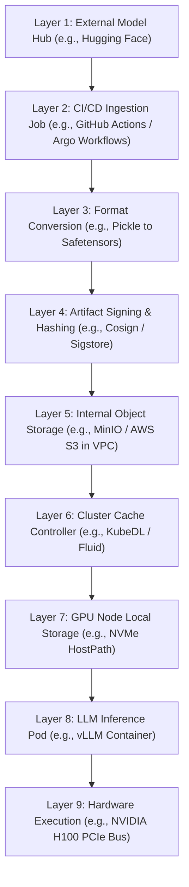

# Automated Model Weight Ingestion & Storage Pipelines

Version: 1.0.0

Purpose: Canonical lesson structure for Platform Engineering & AI Infrastructure Curriculum.

Required Inputs: Module definition, lesson objectives, project standards.

Outputs: Standards-compliant lesson markdown.


# Lesson Overview

This lesson covers the critical infrastructure required to manage, store, and version Large Language Model (LLM) weights securely and efficiently. Model weights are massive binary artifacts—often ranging from 5GB to hundreds of gigabytes. Unlike standard Docker images or application binaries, they cannot be checked into Git and require specialized storage layers to ensure fast retrieval, deduplication, and secure provenance. We will architect automated ingestion pipelines that pull weights from external hubs (like Hugging Face), convert them into optimized formats (like Safetensors), and distribute them across a Kubernetes cluster for rapid LLM pod initialization.

---

# Learning Objectives

* Architect an automated pipeline to securely download, convert, and store multi-gigabyte LLM weight files.
* Understand the differences between legacy model formats (Pickle/PyTorch) and modern, secure formats (Safetensors).
* Design high-performance distributed storage layers (S3/MinIO, CSI drivers) to minimize LLM pod startup times.
* Implement model provenance and artifact signing to secure the AI software supply chain.
* Design Kubernetes caching strategies to prevent network bottlenecking during horizontal GPU pod scaling.

---

# Prerequisites

* **MOD-AI-01:** Hardware Architecture for AI: GPUs, TPUs, CUDA & Memory Bandwidth
* **MOD-SEC-04:** Software Supply Chain Security (SLSA, SBOMs & Cosign)
* Familiarity with Object Storage (S3) and Kubernetes Persistent Volumes.

---

# Why This Exists

In traditional software engineering, an application binary is a few megabytes. When a Kubernetes deployment scales up from 1 to 10 pods, pulling a 50MB Docker image takes milliseconds. 
In AI engineering, the "binary" is a set of neural network weights. A modest 7-billion parameter model (like Llama 3 8B) is roughly 15GB. A 70B model is 140GB. 
If 10 GPU pods auto-scale simultaneously and all attempt to download 140GB from the internet (Hugging Face), it will saturate the corporate firewall, crash the NAT gateway, take 45 minutes for the pods to start, and cost hundreds of dollars in bandwidth. Furthermore, raw `.bin` or `.pt` (PyTorch) model files are fundamentally insecure and can execute arbitrary malicious code upon loading. 

Platform engineers must build automated pipelines that securely ingest these models once, convert them to safe formats, store them in a localized high-bandwidth object store, and cache them aggressively on the Kubernetes nodes.

---

# Core Concepts

## Model Weight Formats

Model weights are mathematical matrices saved to disk. The format matters immensely for security and loading speed.
*   **Pickle (`.pt`, `.bin`, `.pkl`):** The legacy PyTorch format. **WARNING:** Pickle files are executable code. Loading an untrusted PyTorch model can trigger arbitrary code execution, allowing an attacker to compromise the host GPU node. 
*   **Safetensors (`.safetensors`):** A modern format developed by Hugging Face. It is mathematically identical to the weights in a `.pt` file, but it is purely data (no executable code). Furthermore, Safetensors supports zero-copy memory mapping, allowing the CPU to map the file directly to RAM without reading it chunk-by-chunk, drastically speeding up load times.
*   **GGUF / AWQ:** Quantized formats used for running models on lower-end hardware or optimizing GPU memory.

## The Ingestion Pipeline

You should never let your production inference pods download weights directly from the public internet. 
An ingestion pipeline is an automated CI/CD-like process that:
1.  **Triggers:** When a new approved model is released.
2.  **Downloads:** Pulls the raw weights from an external registry (Hugging Face) to an isolated sandbox.
3.  **Converts:** Transforms insecure `.bin` files to `.safetensors`.
4.  **Scans & Signs:** Generates a cryptographic hash (SHA256) of the weights and signs it for provenance.
5.  **Stores:** Uploads the optimized, signed artifacts to an internal Object Store (e.g., MinIO, AWS S3) located within the same VPC as the GPU cluster.

## Pod Startup & Caching Mechanics

When a Kubernetes Pod requests a 140GB model, transferring it from internal S3 to the Pod over the network still takes minutes. Platform engineers utilize two main caching strategies:
1.  **Node-Level Caching (HostPath/Local PV):** A DaemonSet pre-pulls models onto the physical NVMe drives of every GPU node. Pods mount this drive directly. Load time drops to the speed of the PCIe bus.
2.  **Network Attached Storage (NFS/EFS/Lustre):** Models are stored on a high-bandwidth distributed file system mounted as ReadWriteMany (RWX).

---

# Architecture



---

# Real-World Example

At **Bloomberg**, their AI teams train financial LLMs (like BloombergGPT). They cannot risk external dependencies or supply chain attacks.
They use a strict air-gapped ingestion model. When a researcher wants to use an open-source model like Meta's Llama 3, they submit a PR to an infrastructure repository. An automated Argo Workflow spins up in an isolated Kubernetes sandbox. It downloads the weights from Hugging Face, strictly converts them to `.safetensors`, generates a cryptographic SBOM, and pushes the files to an internal AWS S3 bucket.
In their production EKS cluster, they use **Amazon FSx for Lustre** (a high-performance parallel file system). FSx automatically syncs with the S3 bucket. When a vLLM pod spins up on a GPU node, it mounts the FSx volume via a CSI driver. The 70GB model is streamed to the GPU RAM over the high-speed AWS network fabric in seconds, completely bypassing the public internet.

---

# Hands-on Demonstration

Let's look at the core logic of an ingestion script. We will download a tiny model (for demonstration), ensure it is in safetensors format, and push it to a local S3-compatible store (MinIO).

**Input:** Hugging Face Model ID: `TinyLlama/TinyLlama-1.1B-Chat-v1.0`

**Code:**

```python
import os
import boto3
from huggingface_hub import snapshot_download

# 1. Configuration
MODEL_ID = "TinyLlama/TinyLlama-1.1B-Chat-v1.0"
MINIO_ENDPOINT = "http://localhost:9000"
BUCKET_NAME = "llm-weights"

# 2. Download from Hugging Face (Only downloading safetensors to avoid Pickle risks)
print(f"Downloading {MODEL_ID}...")
local_path = snapshot_download(
    repo_id=MODEL_ID,
    allow_patterns=["*.safetensors", "*.json", "*.model"], # Strict allowlist
    ignore_patterns=["*.bin", "*.pt", "*.msgpack"],        # Strict blocklist
    local_dir=f"./models/{MODEL_ID}"
)
print(f"Model downloaded securely to {local_path}")

# 3. Upload to Internal Object Store (MinIO)
s3_client = boto3.client('s3',
    endpoint_url=MINIO_ENDPOINT,
    aws_access_key_id='minioadmin',
    aws_secret_access_key='minioadmin'
)

# Ensure bucket exists
try:
    s3_client.head_bucket(Bucket=BUCKET_NAME)
except:
    s3_client.create_bucket(Bucket=BUCKET_NAME)

print(f"Uploading to internal MinIO bucket: {BUCKET_NAME}")
for root, dirs, files in os.walk(local_path):
    for file in files:
        full_path = os.path.join(root, file)
        relative_path = os.path.relpath(full_path, local_path)
        s3_key = f"{MODEL_ID}/{relative_path}"
        
        print(f"  Uploading {relative_path}...")
        s3_client.upload_file(full_path, BUCKET_NAME, s3_key)

print("Ingestion Complete. Model is ready for internal secure consumption.")
```

**Expected Output:**
```text
Downloading TinyLlama/TinyLlama-1.1B-Chat-v1.0...
Fetching 14 files: 100%|██████████████████| 14/14 [00:05<00:00, 2.34it/s]
Model downloaded securely to ./models/TinyLlama/TinyLlama-1.1B-Chat-v1.0
Uploading to internal MinIO bucket: llm-weights
  Uploading config.json...
  Uploading model.safetensors...
  Uploading tokenizer.json...
Ingestion Complete. Model is ready for internal secure consumption.
```

**Explanation:** This script uses the `huggingface_hub` SDK but implements strict security controls via `allow_patterns`. It specifically rejects `.bin` files, forcing the download of `.safetensors`. It then iterates through the downloaded artifacts and pushes them to an internal S3-compatible endpoint, finalizing the air-gap process.

---

# Hands-on Lab

* **Objective:** Deploy a Kubernetes model-caching architecture using an InitContainer to pull weights from MinIO to an EmptyDir volume.
* **Estimated Time:** 30 minutes
* **Difficulty:** Intermediate
* **Environment:** Local Kubernetes cluster, MinIO deployed locally.

## Step-by-step Instructions

1. **Deploy MinIO (Internal S3):**
   ```bash
   helm repo add bitnami https://charts.bitnami.com/bitnami
   helm install minio bitnami/minio \
     --set auth.rootUser=minioadmin \
     --set auth.rootPassword=minioadmin
   ```

2. **Port Forward & Create Bucket:**
   ```bash
   kubectl port-forward svc/minio 9000:9000 &
   # Use the AWS CLI to create a bucket and upload a dummy file representing weights
   aws --endpoint-url http://localhost:9000 s3 mb s3://models
   echo "dummy_model_data" > model.safetensors
   aws --endpoint-url http://localhost:9000 s3 cp model.safetensors s3://models/my-model/model.safetensors
   ```

3. **Create the Inference Pod Manifest (`pod.yaml`):**
   We will use an `InitContainer` to download the model from MinIO into a shared `emptyDir` volume before the main inference container starts.
   ```yaml
   apiVersion: v1
   kind: Pod
   metadata:
     name: inference-pod
   spec:
     volumes:
     - name: model-volume
       emptyDir: {} # Temporary local storage on the node
     initContainers:
     - name: model-puller
       image: amazon/aws-cli
       command: ["aws", "--endpoint-url", "http://minio:9000", "s3", "sync", "s3://models/my-model/", "/models/"]
       env:
       - name: AWS_ACCESS_KEY_ID
         value: "minioadmin"
       - name: AWS_SECRET_ACCESS_KEY
         value: "minioadmin"
       - name: AWS_DEFAULT_REGION
         value: "us-east-1"
       volumeMounts:
       - name: model-volume
         mountPath: /models
     containers:
     - name: vllm-server
       image: ubuntu # Simulating the inference server
       command: ["/bin/sh", "-c", "echo 'Model loaded:' && cat /models/model.safetensors && sleep 3600"]
       volumeMounts:
       - name: model-volume
         mountPath: /models
   ```

4. **Deploy and Verify:**
   ```bash
   kubectl apply -f pod.yaml
   kubectl get pods -w
   # Wait for the Init:0/1 state to complete and the pod to become Running
   ```

## Verification

Check the logs of the main container to prove it has access to the downloaded model:
```bash
kubectl logs inference-pod -c vllm-server
```
You should see: `Model loaded: dummy_model_data`

## Troubleshooting

*   **InitContainer CrashLoop:** Check the AWS CLI logs via `kubectl logs inference-pod -c model-puller`. Ensure the MinIO service name (`http://minio:9000`) is resolving correctly via Kubernetes CoreDNS.
*   **Disk Pressure:** If using massive models in production, `emptyDir` writes to the node's root filesystem. Ensure your Kubernetes nodes have large enough ephemeral storage, or map the `emptyDir` to a specific high-capacity NVMe mount.

## Cleanup

```bash
kubectl delete pod inference-pod
helm uninstall minio
```

---

# Production Notes

*   **CSI S3 Drivers:** For extremely large deployments, using an InitContainer is inefficient because it copies the data to disk. Modern production systems use CSI S3 drivers (like Mountpoint for Amazon S3 CSI) to mount the bucket directly into the Pod's filesystem. The model server reads it as a local file, and the CSI driver streams the bytes directly over the network into memory.
*   **Fluid / Alluxio:** For massive multi-node GPU clusters, platform engineers deploy distributed caching orchestration layers like CNCF Fluid (powered by Alluxio). This creates a distributed in-memory/NVMe cache across the cluster, preventing the S3 bucket from bottlenecking when 100 pods auto-scale.
*   **OIDC & IAM Roles:** Never hardcode S3 credentials in Pods or ConfigMaps. Use IAM Roles for Service Accounts (IRSA) in AWS or Workload Identity in GCP to securely grant the inference pods read-only access to the model buckets.

---

# Common Mistakes

*   **Downloading from Hugging Face in the Dockerfile:** Baking a 70GB model into a Docker image during `docker build` is a catastrophic anti-pattern. It creates impossibly large container images, slows down CI/CD pipelines, breaks container registries, and couples the code version to the data version. Code (Docker Image) and Data (Model Weights) must be versioned and deployed separately.
*   **Ignoring Network Egress Costs:** Allowing developers to write scripts that download models from external sources directly onto cloud VMs can result in massive network egress and ingress bills. Centralize ingestion to happen exactly once per model version.

---

# Failure-Driven Learning

**Scenario:** You deploy an auto-scaling Llama 3 70B inference endpoint. Traffic spikes. KEDA scales the deployment from 2 to 10 pods. Suddenly, the entire Kubernetes cluster becomes unresponsive. API server latency skyrockets, and node health checks fail. 

**Diagnosis:**
1. You check the Kubernetes events: `Node NotReady`.
2. You check the network metrics on your VPC gateway. You see a massive, sustained spike of 20 Gbps inbound traffic.
3. You check the pod configuration. The pods are using an InitContainer to download the 140GB model from Hugging Face directly.
4. **Cause:** 8 new pods started simultaneously. Each initiated a 140GB HTTP download. `8 * 140GB = 1.1 Terabytes` of data pulled instantly. This saturated the cluster's network interfaces (NICs), preventing Kubernetes control plane traffic (health checks, kubelet communication) from getting through, causing the nodes to fall off the cluster.

**Resolution:**
Immediately scale down the deployment. Architect the centralized ingestion pipeline discussed in this lesson. Download the model once to an internal S3 bucket. Change the pods to pull from the high-bandwidth internal S3 bucket, or better, implement node-level pre-caching via a DaemonSet so the files are already on the local SSDs before the pods are scheduled.

---

# Engineering Decisions

### InitContainers vs. CSI Mounts vs. Node HostPath

*   **InitContainers (Downloading to emptyDir):**
    *   *Pros:* Simple to implement. Works on any cluster.
    *   *Cons:* Startup time is terrible (you must wait for the download to finish before the pod starts). Wastes disk space if multiple pods on the same node download the same model.
*   **CSI S3 Mounts (Streaming):**
    *   *Pros:* Pod starts instantly (no download wait). Zero disk space wasted on the node.
    *   *Cons:* Every inference request causes the GPU to read over the network. If the network hiccups, inference fails.
*   **Node HostPath (Pre-caching via DaemonSet):**
    *   *Pros:* Absolute highest performance. Models are loaded directly from local NVMe to GPU RAM via PCIe. Pods start instantly.
    *   *Cons:* High operational overhead. You must manage DaemonSets that synchronize models to the disks of every single GPU node. Wastes massive physical disk space.
*   **Decision:** For production LLM serving, use **Node HostPath** or specialized distributed caching layers (Fluid/Alluxio) to guarantee strict SLA latencies and protect against network jitter.

---

# Best Practices

*   **Convert Everything to Safetensors:** Make it a hard policy in your CI/CD pipeline to block any ingestion of `.pt` or `.bin` files. Safetensors prevents arbitrary code execution and allows for faster zero-copy memory loading.
*   **Cryptographic Hashing:** During ingestion, calculate the SHA256 hash of the model files. Store this hash in your model registry. When the inference pod loads the model, it should briefly verify the hash matches to guarantee the weights haven't been corrupted in storage.
*   **Separate Buckets by Classification:** Store foundational open-source models in a general bucket. Store internally fine-tuned models containing proprietary knowledge in a highly restricted bucket governed by strict IAM policies.

---

# Troubleshooting Guide

## Issue 1: Safetensors Zero-Copy Load Fails

*   **Problem:** The LLM framework (vLLM) attempts to load a `.safetensors` model but throws an error: `Cannot allocate memory` or `mmap failed`.
*   **Cause:** Safetensors uses `mmap` to map the file into memory. If the pod does not have enough shared memory (`/dev/shm`) allocated, or if the Kubernetes node's RAM is heavily fragmented, the map fails.
*   **Diagnosis:** Exec into the pod and check `df -h /dev/shm`.
*   **Solution:** Increase the size of `/dev/shm` in the pod spec using an `emptyDir` backed by memory.
```yaml
volumes:
  - name: dshm
    emptyDir:
      medium: Memory
      sizeLimit: "2Gi"
```

## Issue 2: Slow S3 Downloads to Pods

*   **Problem:** InitContainers downloading from internal S3 are taking 20 minutes for a 50GB file.
*   **Cause:** Single-threaded downloads or restrictive CPU limits on the InitContainer.
*   **Diagnosis:** Monitor the CPU usage of the InitContainer. If it is flatlining at the pod's CPU limit, it is bottlenecked by compute, not network.
*   **Solution:** Use multi-threaded download tools like `s5cmd` instead of the standard AWS CLI. Remove strict CPU limits from the InitContainer (since it only runs briefly during startup).

---

# Summary

Automated model ingestion is a foundational capability for AI platform engineering. By abstracting model acquisition into a secure, automated CI/CD pipeline, engineers protect the organization from supply chain vulnerabilities (like malicious PyTorch pickles) and stabilize the network. Storing these massive artifacts in optimized formats (Safetensors) on high-bandwidth internal storage (S3/MinIO), and utilizing intelligent Kubernetes caching strategies, ensures that GPU nodes can autoscale rapidly without bottlenecking on multi-gigabyte data transfers.

---

# Cheat Sheet

*   **Safetensors:** Hugging Face format. Pure data. No executable code. Fast `mmap` loading.
*   **Pickle (`.pt`):** Legacy format. EXECUTABLE CODE. High security risk.
*   **s5cmd:** Extremely fast, concurrent S3 client written in Go. Ideal for InitContainers downloading massive models.
*   **Fluid:** CNCF open-source project for elastic data abstraction and caching in Kubernetes.

---

# Knowledge Check

## Multiple Choice Questions

1. Why is the PyTorch Pickle (`.pt` or `.bin`) format considered a severe security risk in production?
   * A) It uses weak encryption.
   * B) It is mathematically incapable of storing large models.
   * C) Loading a Pickle file can execute arbitrary malicious code on the host system.
   * D) It cannot be compressed.

2. Which Kubernetes architectural pattern provides the absolute fastest model loading speed to a GPU pod?
   * A) InitContainer downloading from external Hugging Face.
   * B) CSI S3 Driver streaming over a 1Gbps network.
   * C) A DaemonSet pre-caching the model directly onto the node's local NVMe drive, mounted via HostPath.
   * D) Baking the 100GB model directly into the Docker image.

## Scenario Questions

You are tasked with deploying a 140GB model to a Kubernetes cluster. The data scientists want to `COPY model.bin /app/` in their Dockerfile. Explain architecturally why this is a terrible idea and propose the correct platform pattern.

## Short Answer Questions

What is the primary advantage of the `.safetensors` format regarding memory management (aside from security)?

<details>
<summary><b>View Answers</b></summary>

### Multiple Choice
1. **[C]** - *Pickle files serialize Python objects, meaning they can contain instructions to execute arbitrary shell commands when deserialized. This is a massive attack vector.*
2. **[C]** - *Pre-caching the model on the local NVMe drive ensures that when the pod starts, the data is pulled across the local PCIe bus directly into GPU RAM, which is exponentially faster than any network transfer.*

### Scenario
*Baking a 140GB model into a Docker image breaks the fundamental principles of containerization. It couples code versioning with data versioning. It creates container images that take hours to build and push, destroys container registry performance, and makes node pulling unbearably slow. The correct pattern is to separate code and data: build a lightweight (500MB) Docker image containing only the inference code (vLLM), and mount the 140GB model into the pod at runtime via a CSI volume or InitContainer downloading from an internal S3 bucket.*

### Short Answer
*Safetensors supports zero-copy memory mapping (`mmap`). Instead of the CPU reading the file chunk by chunk from disk and copying it into RAM, the OS maps the file directly to memory addresses. This allows the GPU to stream the data almost instantaneously without CPU bottlenecking.*

</details>

---

# Interview Preparation

## Beginner Questions

* Why shouldn't inference pods download models directly from the public internet?
* What is the difference between a model's code (inference engine) and a model's weights?

## Intermediate Questions

* Explain the difference between `.pt` (Pickle) and `.safetensors` formats.
* Describe how you would use an InitContainer to handle model weights. What are the downsides of this approach at scale?

## Advanced Questions

* Explain the concept of Zero-Copy Memory Mapping in the context of loading massive LLMs.
* How do you architect a system to handle extreme horizontal pod scaling (e.g., scaling from 0 to 50 GPU pods instantly) without bringing down the cluster's network?

## Scenario-Based Discussions

* Your security team mandates that every software artifact running in production must have a verifiable SBOM and cryptographic signature. Model weights are essentially massive binary blobs. How do you implement this requirement for open-source models downloaded from Hugging Face?

<details>
<summary><b>View Answers</b></summary>

### Beginner
* **Why shouldn't inference pods download models...:** Downloading directly from the internet during pod startup is slow, unreliable, and saturates the corporate firewall. It also introduces security risks (supply chain attacks) and couples production availability to an external service's uptime.
* **What is the difference between a model's code...:** The code is the software (like Python scripts, vLLM, or PyTorch frameworks) that executes the mathematical operations. The weights are the massive data files containing the trained parameters (the actual "brain" of the model). Code should be in the Docker image; weights should be externalized storage.

### Intermediate
* **Explain the difference between .pt and .safetensors...:** `.pt` uses Python Pickle, which is executable code and highly insecure. `.safetensors` is a modern format that is purely data, mitigating arbitrary code execution vulnerabilities, and supports faster `mmap` loading.
* **Describe how you would use an InitContainer...:** The pod starts, the InitContainer runs a script to download the model from an internal S3 bucket into an `emptyDir` volume. Once finished, the main inference container starts and mounts that same volume. The downside is that it delays pod startup by the time it takes to download the massive file, and it duplicates the file on the node's disk if multiple pods run the same model.

### Advanced
* **Explain the concept of Zero-Copy Memory Mapping...:** Traditionally, loading a file involves the CPU reading blocks from disk, copying them into kernel space, and then copying them again into user space RAM. Zero-copy (`mmap`) instructs the OS to map the file's disk sectors directly to virtual memory addresses. When the GPU requests the data, it bypasses the CPU copying overhead entirely, vastly accelerating load times.
* **How do you architect a system to handle extreme horizontal pod scaling...:** I would implement a distributed caching layer using CNCF Fluid (Alluxio). Instead of 50 pods hitting the S3 bucket simultaneously, Fluid intelligently caches the model chunks across the RAM and NVMe drives of the Kubernetes nodes. Pods pull locally or from neighboring nodes in a peer-to-peer fashion, protecting the core network and the S3 backend from saturation.

### Scenario-Based Discussions
* **Your security team mandates that every software artifact...:** I would build an automated ingestion pipeline. A CI/CD runner downloads the model from Hugging Face into an isolated sandbox. It converts it to Safetensors. It then uses a tool like `Cosign` to generate a SHA256 hash of the files and signs them using our internal PKI infrastructure. The signed artifacts are pushed to internal S3. Our Kubernetes admission controllers (like Kyverno) are configured to verify the Cosign signature before allowing any inference pod to mount that specific S3 bucket path.

</details>

---

# Further Reading

1. [Hugging Face: Safetensors Documentation](https://huggingface.co/docs/safetensors/index)
2. [Pickle Security Risks (Python Docs)](https://docs.python.org/3/library/pickle.html)
3. [CNCF Fluid (Data Elasticity for Kubernetes)](https://fluid.io/)
4. [Mountpoint for Amazon S3 CSI Driver](https://github.com/awslabs/mountpoint-s3-csi-driver)
5. [Sigstore / Cosign for Artifact Signing](https://docs.sigstore.dev/)
