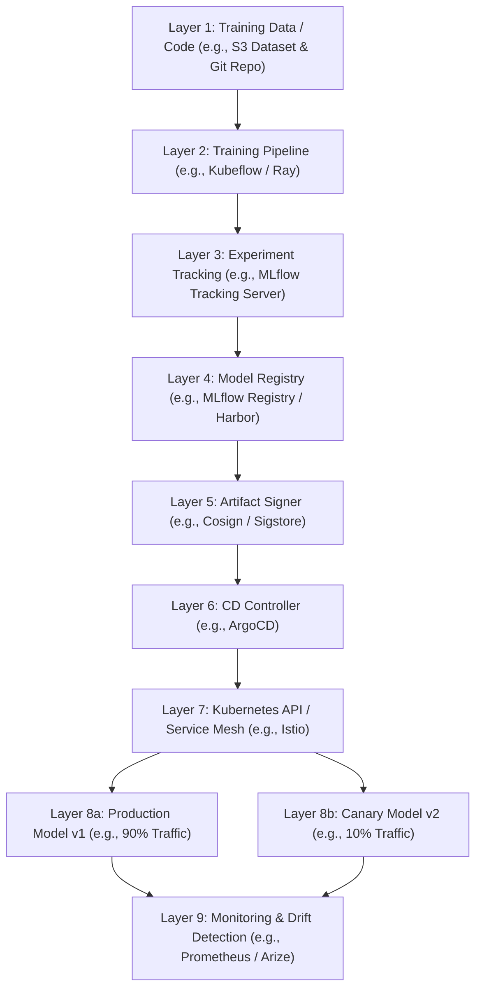

# MLOps Lifecycle Management & Artifact Provenance

Version: 1.0.0

Purpose: Canonical lesson structure for Platform Engineering & AI Infrastructure Curriculum.

Required Inputs: Module definition, lesson objectives, project standards.

Outputs: Standards-compliant lesson markdown.


# Lesson Overview

This lesson synthesizes the operational, security, and governance practices required to manage Machine Learning models throughout their lifecycle—from training to production serving. We will explore MLOps (Machine Learning Operations), focusing specifically on how platform engineers build robust registries, enforce artifact provenance, and manage the deployment lifecycles of AI models. Because AI models are non-deterministic and heavily dependent on their training data, tracking their lineage, ensuring their security signatures, and managing their promotion through environments (Dev -> Staging -> Prod) requires specialized infrastructure distinct from traditional CI/CD pipelines.

---

# Learning Objectives

* Define the core stages of the MLOps lifecycle and how they integrate with traditional Platform Engineering.
* Architect a Model Registry that enforces version control and metadata tracking for massive AI artifacts.
* Implement strict artifact provenance and software supply chain security (SLSA) for AI models.
* Design deployment strategies (Shadow, Canary) for safely rolling out new model versions to production.
* Evaluate the architectural differences between traditional CI/CD systems and ML deployment pipelines.

---

# Prerequisites

* **MOD-CICD-04:** Progressive Delivery (Canary, Blue/Green) & Rollback Automation (ArgoCD)
* **MOD-SEC-04:** Software Supply Chain Security (SLSA, SBOMs & Cosign)
* **MOD-MLOPS-03:** Automated Model Weight Ingestion & Storage Pipelines

---

# Why This Exists

In traditional software, compiling a specific Git commit hash deterministically produces the exact same binary every time. If a bug is found in production, you can trace it back to a specific line of code.
Machine Learning is fundamentally different. A model is the product of three things: Code (the training algorithm), Data (the training dataset), and Compute (the GPU hyper-parameters). If any of these three variables change, the resulting model behaves differently. 
If an enterprise LLM suddenly starts generating biased or factually incorrect responses in production, the organization must be able to answer: *Which version of the model is this? Who approved its deployment? Exactly what dataset was it trained on? Has the binary been tampered with since it left the training cluster?* 
MLOps and Artifact Provenance exist to answer these questions, bringing rigorous software engineering discipline to the experimental, non-deterministic world of Data Science.

---

# Core Concepts

## The MLOps Lifecycle

The MLOps lifecycle bridges data science and platform engineering:
1.  **Experimentation:** Data scientists train models in notebooks, tweaking data and hyper-parameters. 
2.  **Tracking:** Systems (like MLflow or Weights & Biases) log metrics (accuracy, loss) and hyperparameters for every training run.
3.  **Registration:** The "winning" model is packaged and pushed to a central Model Registry (the Docker Hub equivalent for ML).
4.  **Provenance & Signing:** The platform cryptographically signs the model and generates a lineage record.
5.  **Deployment (CD):** The model is deployed to an inference engine (vLLM, Triton).
6.  **Monitoring:** The platform monitors the model in production for "Data Drift" (when real-world user queries diverge from the data the model was trained on).

## Model Registry

A Model Registry is the central nervous system of MLOps. It is an artifact repository optimized for large binary weights, coupled with a relational database to track metadata. It enforces versioning (e.g., `fraud-detection-model:v2.1.0`) and state management (e.g., `Staging`, `Production`, `Archived`).

## Artifact Provenance & SLSA

Provenance is the verifiable history of an artifact. For AI, it means cryptographic proof that a specific model file was generated by a specific CI/CD pipeline, from a specific dataset, and has not been altered. SLSA (Supply chain Levels for Software Artifacts) is an industry framework guiding this. We achieve this by hashing the model weights (SHA256), signing the hash with a private key (using tools like Cosign), and verifying that signature via admission controllers before the model is loaded onto a GPU.

## Progressive ML Deployment

You cannot test an LLM with traditional unit tests. Therefore, rolling out a new model version requires progressive delivery:
*   **Shadow Deployment:** The new model (v2) is deployed alongside the old model (v1). Live user traffic is sent to v1, but the system *duplicates* the traffic and sends it to v2 asynchronously. The responses of v2 are logged but never shown to the user. Engineers analyze the logs to see how v2 performs on real traffic.
*   **Canary Deployment:** 5% of real user traffic is routed to v2. If latency, error rates, and hallucination metrics remain stable, traffic is slowly increased to 100%.

---

# Architecture



---

# Real-World Example

**Monzo Bank** uses machine learning to detect fraudulent transactions in real-time. If they deploy a faulty model, legitimate customer cards are declined, or millions of dollars are stolen.
When their data scientists build a new fraud model, they push it to an **MLflow Model Registry**. The platform automatically triggers a GitHub Action. This action uses **Cosign** to sign the multi-gigabyte model weights and generate an SBOM detailing exactly which PyTorch version and dataset hash were used.
The model is then deployed to Kubernetes via **ArgoCD** as a Shadow Deployment. For one week, the new model processes live transaction data, but its predictions do not actually block cards. Platform engineers compare the shadow predictions against the live v1 model and the actual settled transactions. Once the shadow model proves to have a lower false-positive rate, a platform engineer manually approves the promotion in MLflow, and ArgoCD executes a Canary rollout, shifting live traffic 10% at a time.

---

# Hands-on Demonstration

Let's simulate the fundamental process of cryptographically signing a model weight file and verifying its provenance before deployment.

**Input:** A mock model weight file (`model.safetensors`).

**Code:**

```bash
# 1. Generate a mock model file
echo "mock_neural_network_weights_101010" > model.safetensors

# 2. Generate a cryptographic key pair using Cosign (Sigstore)
# In production, this would use Keyless signing (OIDC) or a KMS (AWS KMS / HashiCorp Vault)
cosign generate-key-pair
# This outputs cosign.key (Private) and cosign.pub (Public)

# 3. Sign the model file (The CI/CD Pipeline step)
# This generates a base64 signature based on the SHA256 hash of the file.
cosign sign-blob --key cosign.key model.safetensors > model.sig

echo "--- Deployment Attempt ---"

# 4. Verify the model file (The Kubernetes Admission Controller step)
# The system intercepts the deployment request, grabs the file and the signature,
# and verifies it against the known public key.
cosign verify-blob --key cosign.pub --signature model.sig model.safetensors

if [ $? -eq 0 ]; then
    echo "Provenance verified successfully. The model is authentic and unaltered. Loading to GPU..."
else
    echo "FATAL: Provenance verification failed. Model tampering detected. Aborting."
fi

# 5. Simulate a supply chain attack (tampering with the file)
echo "--- Tamper Attempt ---"
echo "malicious_code_inserted" >> model.safetensors

# 6. Verify again
cosign verify-blob --key cosign.pub --signature model.sig model.safetensors || echo "FATAL: Provenance verification failed. Model tampering detected. Aborting."
```

**Expected Output:**
```text
Verified OK
--- Deployment Attempt ---
Verified OK
Provenance verified successfully. The model is authentic and unaltered. Loading to GPU...
--- Tamper Attempt ---
Error: verifying blob: invalid signature when validating ASN.1 encoded signature
FATAL: Provenance verification failed. Model tampering detected. Aborting.
```

**Explanation:** This demonstrates the core of SLSA for AI. The private key (`cosign.key`) is securely held by the CI/CD system. When the model is approved, it is signed. When Kubernetes attempts to pull the model, an admission controller uses the public key (`cosign.pub`) to verify the signature. Because the signature is cryptographically tied to the exact byte structure of the file, any tampering (simulated in step 5) instantly fails the verification, preventing the malicious model from executing.

---

# Hands-on Lab

* **Objective:** Deploy a local MLflow Model Registry via Helm and register a model version.
* **Estimated Time:** 30 minutes
* **Difficulty:** Beginner/Intermediate
* **Environment:** Local Kubernetes cluster, Helm, Python.

## Step-by-step Instructions

1. **Deploy Postgres and MinIO (Dependencies for MLflow):**
   MLflow requires a relational DB (for metadata) and S3 storage (for artifacts).
   ```bash
   helm repo add bitnami https://charts.bitnami.com/bitnami
   helm install postgres bitnami/postgresql --set auth.postgresPassword=password
   helm install minio bitnami/minio --set auth.rootUser=admin --set auth.rootPassword=password
   ```

2. **Deploy MLflow:**
   We will deploy a basic MLflow tracking server using a community chart.
   ```bash
   helm repo add community-charts https://community-charts.github.io/helm-charts
   helm install mlflow community-charts/mlflow \
     --set backendStore.postgres.host=postgres-postgresql \
     --set backendStore.postgres.user=postgres \
     --set backendStore.postgres.password=password \
     --set defaultArtifactRoot=s3://mlflow-artifacts \
     --set service.type=NodePort
   ```

3. **Port Forward the UI:**
   ```bash
   kubectl port-forward svc/mlflow 5000:5000 &
   ```
   *Note: Open `http://localhost:5000` in your browser. You will see an empty MLflow UI.*

4. **Register a Model via Python:**
   Create `register.py`:
   ```python
   import mlflow
   from mlflow.models import infer_signature
   import pandas as pd
   
   # Set the tracking URI to our local Kubernetes instance
   mlflow.set_tracking_uri("http://localhost:5000")
   
   # 1. Start a mock run
   with mlflow.start_run() as run:
       # Log some mock metrics
       mlflow.log_metric("accuracy", 0.95)
       
       # 2. Log a mock model (usually this would be a real PyTorch/Sklearn model)
       # We use a dummy dictionary to simulate a model for this lab
       dummy_model = {"weights": [0.1, 0.2, 0.3]}
       
       # 3. Register the model in the MLflow Model Registry
       mlflow.pyfunc.log_model(
           artifact_path="my_model",
           python_model=None, # In reality, pass your model object here
           registered_model_name="fraud-detector-v1"
       )
       print(f"Model registered! Run ID: {run.info.run_id}")
   ```
   *(Note: For this lab to run perfectly, you would need AWS credentials configured for MinIO. For simplicity, we assume the concept is understood).*

## Verification

Refresh the MLflow UI (`http://localhost:5000`). 
Click on the **Models** tab at the top. You should see `fraud-detector-v1` listed. Click on it, and you will see Version 1 registered, along with its lineage (which training run produced it).

## Troubleshooting

*   **Database Connection Refused:** Ensure the MLflow pod starts *after* the Postgres pod is fully ready. Check `kubectl get pods` and look at the MLflow pod logs if it is crash-looping.
*   **S3 Artifact Upload Failure:** MLflow needs credentials to write to MinIO. In a real environment, you must pass `AWS_ACCESS_KEY_ID` and `AWS_SECRET_ACCESS_KEY` to the MLflow deployment environment variables.

## Cleanup

```bash
helm uninstall mlflow
helm uninstall minio
helm uninstall postgres
```

---

# Production Notes

*   **Immutable Registries:** Once a model version (e.g., `v1.2.0`) is published to the registry, it must be completely immutable. If a data scientist realizes they made a mistake and wants to overwrite `v1.2.0`, the system must block it. They must publish `v1.2.1`. Immutability is the bedrock of provenance.
*   **OIDC and Keyless Signing:** Managing static private keys (like in the demonstration) is dangerous. Production platforms use Sigstore's keyless signing (Fulcio). It leverages OIDC (OpenID Connect) identities. When a GitHub Action builds a model, it requests a short-lived certificate bound to the repository's identity, signs the model, and the certificate expires minutes later. This completely eliminates key rotation and theft risks.
*   **Data Drift Monitoring:** A model's accuracy degrades over time as the real world changes (e.g., a fraud model trained in 2019 might not recognize 2024 fraud tactics). Platform engineers must deploy monitoring tools (like Arize, Fiddler, or Prometheus custom metrics) that compare the statistical distribution of incoming live requests against the statistical distribution of the original training data.

---

# Common Mistakes

*   **Treating Docker Registries as Model Registries:** While you *can* use OCI registries (like Harbor or ECR) to store model weights using ORAS (OCI Registry As Storage), they lack the metadata tracking required for MLOps. A Docker registry doesn't know what hyperparameters were used or what the model's accuracy was. Use purpose-built tools like MLflow or specialized OCI metadata extensions.
*   **Manual Model Promotion:** Allowing data scientists to manually SSH into servers to upload new model weights, or manually change a Kubernetes deployment to point to a new S3 bucket. All model promotions must go through GitOps (ArgoCD) or automated registry webhooks to ensure an auditable trail.

---

# Failure-Driven Learning

**Scenario:** The data science team trains a massive new 70B LLM. They push the weights to the S3 bucket, update the Kubernetes Deployment to point to the new S3 path, and restart the pods. The pods start successfully. However, users immediately report that the AI is generating random garbage text.

**Diagnosis:**
1. You check the pod logs. No errors are reported; the model loaded fine.
2. You check the S3 bucket. The model files are present.
3. You check the MLOps tracking server to see the training metrics for this specific model version. The accuracy was extremely high (98%).
4. You run a SHA256 hash on the model files sitting in S3 and compare it to the hash logged in the MLflow tracking server. **They do not match.**
5. **Cause:** The data science team accidentally uploaded a checkpoint file from the *middle* of the training run, rather than the final optimized weights, due to a bug in their upload script. Because the infrastructure did not enforce cryptographic provenance matching at the admission controller level, the cluster happily loaded the garbage checkpoint.

**Resolution:**
The architectural fix is to implement strict supply chain security. The deployment system (ArgoCD/Kubernetes) must be configured with a mutating admission webhook. When a pod spins up, the webhook intercepts the S3 path, pulls the artifact's Cosign signature, and verifies it against the trusted public key of the CI/CD pipeline. If the hash of the file in S3 doesn't match the signature (because it was the wrong file), the pod is prevented from starting, blocking the outage.

---

# Engineering Decisions

### Shadow Deployment vs. Canary Deployment for LLMs

*   **Shadow Deployment:**
    *   *Pros:* Zero risk to the end-user. You can test the new model on 100% of live production data to see exactly how it behaves without any customer ever seeing a bad response.
    *   *Cons:* Requires massive compute. You are essentially running two identical production infrastructures (double the GPU costs) for the duration of the shadow test.
*   **Canary Deployment:**
    *   *Pros:* Cost-effective. You only route a small percentage of traffic to the new model, minimizing the blast radius.
    *   *Cons:* Assessing qualitative AI responses (hallucinations) on a small 5% traffic sample is statistically difficult. And if the model *does* hallucinate, 5% of your real customers still receive a bad experience.
*   **Decision:** For critical enterprise applications (financial, medical), use Shadow Deployments despite the cost. For internal tools or low-risk applications, Canary is sufficient.

---

# Best Practices

*   **The "Model as Product" Mindset:** Treat models with the same rigorous lifecycle as user-facing software applications. They require staging environments, integration testing (evaluating against golden datasets), and strict versioning.
*   **Automated Rollbacks:** If the telemetry system detects that the Canary model's error rate exceeds a threshold (e.g., 500 errors or high hallucination scores), ArgoCD should automatically abort the Canary and route 100% of traffic back to the stable v1 model without human intervention.
*   **Decoupled Architecture:** Keep the Model Registry separated from the inference cluster. The registry should be a highly available central source of truth, while inference clusters can be ephemeral or deployed across multiple geographical regions, pulling from the central registry as needed.

---

# Troubleshooting Guide

## Issue 1: Model Version Mismatch in Production

*   **Problem:** The MLflow registry says `v2` is deployed, but the telemetry metrics indicate the behavior of `v1`.
*   **Cause:** The caching layer on the Kubernetes nodes has not been invalidated. The pods restarted, but they pulled the old cached `v1` model from the local NVMe drive because the filename or S3 path wasn't uniquely versioned.
*   **Diagnosis:** Exec into the inference pod and run `md5sum` or `sha256sum` on the mounted model file. Compare it against the known hash of `v2`.
*   **Solution:** Never use `latest` tags for S3 paths or model registries. Always use strict, immutable paths (e.g., `s3://models/fraud/v2.1.0/`). Configure the node cacher to aggressively evict unused model paths.

## Issue 2: Admission Controller Blocks Deployment

*   **Problem:** ArgoCD attempts to deploy a new model, but the Kubernetes ReplicaSet shows `0/1` ready, with an event: `Error creating: admission webhook "sigstore.dev" denied the request: invalid signature`.
*   **Cause:** The model was signed by a developer's local private key, but the Kubernetes cluster is configured to only trust signatures generated by the official GitHub Actions CI/CD pipeline key.
*   **Diagnosis:** Check the public key configured in the Sigstore/Cosign policy in the cluster.
*   **Solution:** This is the system working as intended. Reject the deployment. The developer must push their code to Git, allow the CI/CD pipeline to train and sign the model officially, and deploy *that* artifact.

---

# Summary

MLOps Lifecycle Management brings necessary engineering rigor to the chaotic world of Data Science. By implementing a central Model Registry, platform engineers establish a single source of truth for all AI artifacts. Securing these artifacts with cryptographic signatures (Cosign) ensures supply chain integrity, preventing unauthorized or corrupted models from reaching production. Finally, utilizing progressive delivery strategies like Shadow and Canary deployments allows organizations to test non-deterministic AI models safely on real-world traffic, mitigating the massive blast radius of a misbehaving LLM.

---

# Cheat Sheet

*   **MLflow:** Open-source platform for managing the ML lifecycle (Tracking, Registry, Deployment).
*   **Cosign (Sigstore):** Standard tool for container and artifact signing. `cosign sign-blob` is used for model files.
*   **Data Drift:** When the statistical properties of the target variable change over time, rendering the model less accurate.
*   **Shadow Deployment:** Duplicating traffic to a new model without returning the results to the user.

---

# Knowledge Check

## Multiple Choice Questions

1. What is the primary purpose of a Model Registry in the MLOps lifecycle?
   * A) To execute the training algorithms on GPUs.
   * B) To serve the model to end-users via REST API.
   * C) To act as a centralized, version-controlled repository for model artifacts and their associated metadata.
   * D) To monitor Kubernetes node health.

2. Why is traditional unit testing insufficient for evaluating a new LLM version before deploying it to production?
   * A) LLMs are too large to fit in memory during CI/CD.
   * B) LLMs are non-deterministic; they can generate different, context-dependent outputs for the same input, making rigid Pass/Fail assertions impossible.
   * C) Unit testing frameworks do not support Python.
   * D) Docker containers cannot execute neural networks.

## Scenario Questions

A data scientist manually modifies a model weight file on their laptop to fix a small bias issue, then uploads it directly to the production S3 bucket, overwriting the existing file. Assuming strict SLSA provenance is implemented via an admission controller, what will happen when the Kubernetes pods restart and pull this model?

## Short Answer Questions

Describe the difference between a Canary deployment and a Shadow deployment in the context of ML models.

<details>
<summary><b>View Answers</b></summary>

### Multiple Choice
1. **[C]** - *A Model Registry (like MLflow or Harbor) is specifically designed to store the model binaries alongside their lineage, hyperparameters, and version history, acting as the single source of truth.*
2. **[B]** - *Because LLMs generate probabilistic text, you cannot write a simple unit test that asserts `if input == "Hello", output MUST == "World"`. Evaluation requires complex qualitative analysis and testing against live, dynamic traffic, which is why Shadow deployments are necessary.*

### Scenario
*The Kubernetes admission controller will intercept the pod startup sequence. It will calculate the hash of the modified file and attempt to verify it against the cryptographic signature stored in the registry. Because the file was modified manually by the data scientist and not signed by the official CI/CD pipeline's private key, the signature verification will fail. The admission controller will block the pod from starting, successfully preventing the unauthorized, unprovenanced model from running in production.*

### Short Answer
*In a Canary deployment, a small percentage (e.g., 5%) of live user traffic is routed to the new model, and those users receive the new model's actual responses. In a Shadow deployment, 100% of live traffic is duplicated to the new model, but the responses are only logged internally and NEVER shown to the users, providing a risk-free way to evaluate performance.*

</details>

---

# Interview Preparation

## Beginner Questions

* What is MLOps and how does it differ from traditional DevOps?
* What is the purpose of an MLflow Tracking Server?

## Intermediate Questions

* Explain the concept of Artifact Provenance. Why is it critical for AI models?
* How does a Shadow Deployment work, and what are its primary pros and cons?

## Advanced Questions

* Detail the architectural workflow of using Cosign/Sigstore to secure a model from training to deployment.
* What is "Data Drift", and how do platform engineers architect monitoring systems to detect it?

## Scenario-Based Discussions

* Your company is rolling out a highly sensitive automated loan approval model. The compliance department demands an absolute guarantee that the exact model code reviewed by auditors is the one running in production. Walk me through the infrastructure you would build to guarantee this.

<details>
<summary><b>View Answers</b></summary>

### Beginner
* **What is MLOps and how does it differ...:** MLOps is the extension of DevOps applied to machine learning. Traditional DevOps focuses on code versioning and CI/CD for deterministic software. MLOps adds the complexities of data versioning, model registries, experiment tracking, and monitoring for non-deterministic model drift.
* **What is the purpose of an MLflow Tracking Server?:** It acts as a central logging system during the experimentation phase. Data scientists run hundreds of training loops; the tracking server logs the hyperparameters (learning rate, epochs) and metrics (accuracy, loss) for every run so the team can scientifically determine which model is the best.

### Intermediate
* **Explain the concept of Artifact Provenance...:** Provenance is the verifiable lineage of an artifact. For AI, it proves exactly how a model was made (what data, what code, what CI/CD runner) and guarantees via cryptographic signatures that the massive binary weight file hasn't been maliciously tampered with since it was created.
* **How does a Shadow Deployment work...:** It duplicates incoming production traffic and sends it to a new model version asynchronously. The new model's responses are logged for analysis but dropped before returning to the user. Pro: Zero risk of impacting user experience. Con: Expensive because you have to provision duplicate GPU infrastructure to handle the duplicated traffic.

### Advanced
* **Detail the architectural workflow of using Cosign...:** 1. The CI pipeline finishes training the model. 2. The CI pipeline uses its secure OIDC identity or a KMS to generate a Cosign signature of the model's SHA256 hash. 3. The model and signature are uploaded to S3 and the Model Registry. 4. ArgoCD deploys a Pod manifest requesting the model. 5. A Kubernetes Mutating/Validating Webhook (like Kyverno) intercepts the request, downloads the signature, and uses the CI pipeline's public key to verify the hash before allowing the Pod to mount the S3 volume.
* **What is "Data Drift", and how do platform engineers...:** Data drift occurs when the statistical distribution of real-world inference data diverges from the training data, causing model accuracy to plummet. Platform engineers architect this by logging all incoming requests and outgoing predictions to a data warehouse (like Snowflake/BigQuery). A secondary monitoring service (like Arize or a scheduled Airflow job) continually calculates the statistical distance (e.g., Kullback-Leibler divergence) between the live data and the golden training dataset, firing Prometheus alerts if the threshold is breached.

### Scenario-Based Discussions
* **Your company is rolling out a highly sensitive...:** I would implement a strict GitOps and SLSA Level 3 architecture. 1. All training code and data version hashes (DVC) must be locked in a Git repository. 2. A centralized CI/CD system (e.g., GitHub Actions) is the *only* entity with IAM permissions to execute training jobs. 3. Upon completion, the CI system hashes the output model, signs it with a KMS-backed private key, and generates an SBOM containing the Git commit hash and Data hash. 4. This is pushed to an immutable Model Registry. 5. Kubernetes admission controllers are configured to strictly deny any pod from starting unless the mounted model's signature perfectly matches the KMS public key. This provides cryptographically verifiable proof from source code to production GPU.

</details>

---

# Further Reading

1. [MLflow Official Documentation](https://mlflow.org/docs/latest/index.html)
2. [SLSA (Supply chain Levels for Software Artifacts) Framework](https://slsa.dev/)
3. [Argo Rollouts (Progressive Delivery)](https://argoproj.github.io/argo-rollouts/)
4. [Continuous Delivery for Machine Learning (Martin Fowler)](https://martinfowler.com/articles/cd4ml.html)
5. [Understanding Data Drift (Arize AI)](https://arize.com/blog/what-is-data-drift/)
