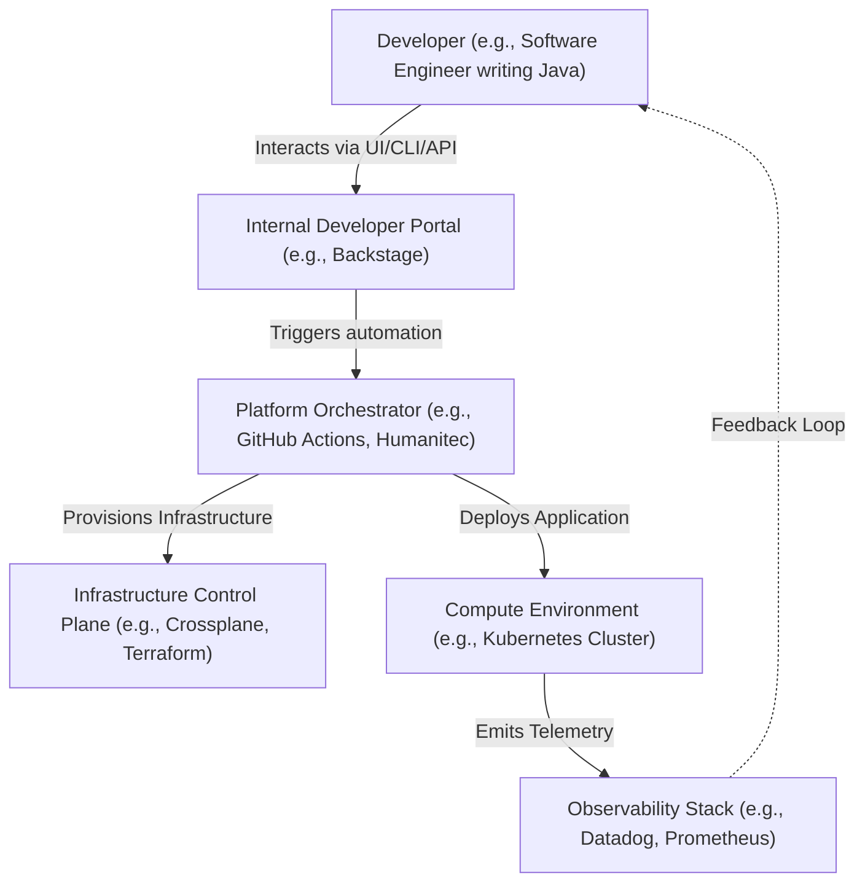

# Platform Engineering Principles & Treating Developers as Customers

Version: 1.0.0

Purpose: Canonical lesson structure for Platform Engineering & AI Infrastructure Curriculum.

Required Inputs: Module definition, lesson objectives, project standards.

Outputs: Standards-compliant lesson markdown.

# Lesson Overview

This lesson introduces the foundational mindset and core principles of modern Platform Engineering. It focuses on the paradigm shift from traditional IT operations to a product-centric approach where internal developers are treated as valued customers, and the platform is the product that empowers them.

---

# Learning Objectives

* Define the core principles of Platform Engineering and contrast them with traditional DevOps/IT Operations.
* Explain the concept of treating "Platform as a Product" and "Developers as Customers."
* Identify the key components of an Internal Developer Platform (IDP) and the value it delivers.
* Apply user research and product management techniques to identify developer pain points.

---

# Prerequisites

* Basic understanding of software development lifecycles (SDLC).
* Familiarity with common DevOps practices (CI/CD, Infrastructure as Code).
* Experience with the operational challenges of deploying microservices.

---

# Why This Exists

Historically, developers had to wait on centralized IT or Ops teams to provision infrastructure, set up pipelines, and deploy applications. This "ticket-ops" approach created massive bottlenecks. As the industry moved to DevOps ("you build it, you run it"), developers became overwhelmed by cognitive load—suddenly having to master Kubernetes, Terraform, Helm, CI/CD, and security policies just to ship a feature. Platform Engineering emerged to bridge this gap, providing self-service abstractions (Internal Developer Platforms) that reduce developer cognitive load while maintaining standardization and security.

---

# Core Concepts

## The Cognitive Load Problem

Cognitive load refers to the total amount of mental effort being used in the working memory of a developer. Modern cloud-native ecosystems are incredibly complex. If developers must understand the intricacies of AWS IAM, Kubernetes ingress, and Prometheus alerting just to deploy a basic web service, their intrinsic cognitive load (writing business logic) is overshadowed by extraneous cognitive load (wrestling with infrastructure). Platform Engineering aims to minimize this extraneous cognitive load.

## Platform as a Product

Traditional infrastructure teams operated as cost centers fulfilling Jira tickets. Platform Engineering teams operate as product teams. They have product managers, they conduct user interviews (with developers), they define roadmaps based on user needs, and they measure success through adoption and satisfaction metrics, not just uptime.

## Thinnest Viable Platform (TVP)

A key principle from the Team Topologies framework is the "Thinnest Viable Platform." A platform should be as small as possible while still providing the necessary value. It shouldn't reinvent the wheel. If a wiki page detailing how to configure AWS cleanly solves the developer's problem, that wiki page *is* the platform. You only build complex custom software (like a developer portal) when the abstraction is strictly necessary.

## Golden Paths (Paved Roads)

A "Golden Path" is the recommended, highly automated, and heavily supported way to build and deploy software in an organization. If a developer stays on the Golden Path, things like CI/CD, monitoring, and security are handled automatically. Developers are free to leave the path if they have unique requirements, but they assume the maintenance burden (the "dirt road").

---

# Architecture

---

# Real-World Example

Spotify is famous for pioneering modern Platform Engineering with their internal tool, Backstage (which was later open-sourced). Before Backstage, Spotify's rapid growth led to extreme fragmentation; new engineers took weeks to figure out how to create a microservice, find APIs, or view documentation. By building a centralized developer portal that acted as a single pane of glass, Spotify reduced onboarding time dramatically and allowed engineers to scaffold new, compliant microservices in minutes with a few clicks.

---

# Hands-on Demonstration

Let's simulate the developer experience difference between "TicketOps" and "Platform Engineering."

**Scenario:** A developer needs to create a new Node.js microservice.

**Traditional TicketOps (Anti-Pattern):**
1. Developer creates a Jira ticket for a new GitHub repo. Wait 1 day.
2. Developer creates a Jira ticket for AWS IAM roles. Wait 3 days.
3. Developer creates a Jira ticket for Jenkins pipeline setup. Wait 2 days.
4. Developer writes code.

**Platform Engineering Approach (Golden Path):**
1. Developer logs into the Developer Portal.
2. Clicks "Create New Node.js Service".
3. Fills out a form: `Service Name: user-auth`, `Team: Core`.
4. Clicks "Generate".

**Behind the scenes (Platform automation):**
* The platform calls GitHub API to create the repo from a compliant template.
* The platform generates standard CI/CD workflow files.
* The platform provisions a dev environment in Kubernetes.
* The platform registers the service in the service catalog.

**Expected Output:** Within 3 minutes, the developer has a working repository with a hello-world endpoint already deployed and monitored.

---

# Hands-on Lab

* **Objective:** Conduct a mock "Developer Interview" to practice product management for platforms.
* **Estimated Time:** 30 minutes
* **Difficulty:** Beginner
* **Environment:** A text editor or collaborative document.

## Step-by-step Instructions

1. **Roleplay Setup:** Pair up with a colleague, or use an AI chatbot to simulate a "Frustrated Backend Developer."
2. **The Interview:** Ask the developer open-ended questions about their workflow.
    * "Walk me through the last time you deployed a new service to production. What was the hardest part?"
    * "How do you currently find out if your service is failing in production?"
    * "If you had a magic wand to fix one infrastructure process, what would it be?"
3. **Synthesis:** Document the core pain points. Are they struggling with Kubernetes syntax? Waiting on security approvals? CI pipeline speed?
4. **Platform Proposal:** Draft a 1-page proposal for a new platform capability (e.g., a standardized Terraform module, or a new Backstage template) that directly solves the highest-priority pain point discovered.

## Verification

Review your proposal. Does it directly address a documented developer pain point, or is it just "cool technology"? A good platform feature must solve a real user problem.

## Troubleshooting

If you find that the developer has no complaints, you aren't digging deep enough into the deployment, monitoring, or on-call processes.

## Cleanup

No technical cleanup required.

---

# Production Notes

When building an IDP, avoid the "Build It and They Will Come" fallacy. Many platform teams spend two years building an overly complex, mandated portal that no one wants to use because it doesn't solve actual day-to-day friction. Always start small. Solve one agonizing problem first (e.g., automated database provisioning), prove value, and iterate.

---

# Common Mistakes

* **Mandating the Platform:** Forcing developers to use the platform breeds resentment. The platform should be so good, and the Golden Path so smooth, that developers *choose* to use it over rolling their own solutions.
* **Treating Platform as a Helpdesk:** If your platform team spends 80% of its time answering Slack questions and manually fixing pipelines, you are an operations team, not a platform team. The goal is self-service automation.
* **Ignoring Developer Experience (DevEx):** A technically brilliant automation script with a terrible, confusing CLI interface will not be adopted. UI/UX matters in platform engineering.

---

# Failure-Driven Learning

**Scenario:** The Platform Team rolls out a highly advanced, custom-built Kubernetes abstraction CLI tool. Six months later, adoption is at 5%.

**Diagnosis:** The platform team built what *they* thought was cool (a complex abstraction layer) without interviewing developers. It turns out developers were fine with standard `kubectl`; their actual bottleneck was waiting for security reviews on firewall rules.

**Recovery:** The team pivots. They deprecate the custom CLI. They implement automated security scanning in the CI pipeline to eliminate the firewall review bottleneck. Adoption of the new pipeline skyrockets.

---

# Engineering Decisions

**Buy vs. Build for Developer Portals**
A major architectural decision is whether to build a custom developer portal or buy an off-the-shelf solution (like Port, Cortex, or rely on open-source Backstage).
* *Build:* Offers maximum flexibility but incurs massive engineering maintenance costs. Usually a trap unless you are a hyperscaler.
* *Buy/Adopt:* Faster time to market, focuses engineering effort on *integrations* (the glue) rather than frontend UI frameworks. Backstage is standard but requires heavy TypeScript customization. SaaS IDPs (Port, Cortex) provide rapid out-of-the-box value.

---

# Best Practices

* **User Research:** Regularly survey and interview your developers (NPS or CSAT scores for the platform).
* **Self-Service:** Never require a human to approve standard infrastructure provisioning if it fits within the Golden Path.
* **Marketing:** Platform teams must market their products internally. Write release notes, hold demo days, and evangelize the platform.
* **Evangelize, Don't Enforce:** Make the paved road so attractive that the dirt road is abandoned naturally.

---

# Troubleshooting Guide

## Issue 1: Low Platform Adoption

* **Cause:** The platform does not solve the developers' actual primary bottlenecks, or the learning curve for the platform itself is too steep.
* **Diagnosis:** Review internal platform telemetry (e.g., daily active users of the portal, percentage of new services using templates). Survey developers who opted out.
* **Solution:** Conduct targeted user interviews. Identify the exact friction point of the platform. Simplify the onboarding process and pivot engineering effort to the highest-leverage pain points.

---

# Summary

Platform Engineering is fundamentally a product discipline applied to internal infrastructure. By treating developers as valued customers, minimizing their cognitive load, and providing self-service Golden Paths, platform teams enable organizations to scale rapidly while maintaining security and architectural standards.

---

# Cheat Sheet

* **IDP:** Internal Developer Platform
* **Cognitive Load:** The mental effort required to perform a task (aim to reduce extraneous load).
* **Golden Path / Paved Road:** The supported, automated, low-friction way to deploy software.
* **TVP:** Thinnest Viable Platform.

---

# Knowledge Check

## Multiple Choice Questions

1. What is the primary goal of modern Platform Engineering?
   * A) To enforce strict security constraints by locking developers out of production.
   * B) To reduce developer cognitive load by providing self-service infrastructure abstractions.
   * C) To build custom, proprietary databases from scratch.
   * D) To replace all traditional software engineers with AI.

## Scenario Questions

Your organization currently requires developers to open Jira tickets to get a new PostgreSQL database, which takes 4 days. You want to implement a Platform Engineering approach. What is your first step?

## Short Answer Questions

What is the difference between a "Golden Path" and a mandated process?

<b>View Answers</b>

### Multiple Choice
1. **B) To reduce developer cognitive load by providing self-service infrastructure abstractions.** - *Platform engineering treats developers as customers and aims to speed up their workflow by abstracting away infrastructure complexity.*

### Scenario
*Instead of just building an automated DB script, the first step is to treat this as a product problem. You should map the value stream to confirm this 4-day wait is the primary bottleneck, then build a self-service abstraction (like a Developer Portal template or a custom Terraform module) that allows developers to provision a standard, pre-approved PostgreSQL database on demand without human intervention.*

### Short Answer
*A Golden Path is an automated, highly supported route that developers are encouraged to use because it is easy and frictionless. A mandated process forces developers down a path regardless of whether it fits their specific needs. Golden paths allow opt-out (assuming the maintenance burden), mandates do not.*

---

# Interview Preparation

## Beginner Questions

* What does "Platform as a Product" mean?
* Define developer cognitive load.

## Intermediate Questions

* How do you balance the need for standardization with a developer's need for flexibility?
* Describe the concept of a "Golden Path" (or Paved Road).

## Advanced Questions

* How would you measure the success and ROI of an Internal Developer Platform?
* Explain the Thinnest Viable Platform concept in the context of Team Topologies.

## Scenario-Based Discussions

* You are hired as the first Platform Engineer at a 200-engineer startup. Developers are currently SSHing into EC2 instances to deploy code. How do you plan your first 90 days?

<b>View Answers</b>

### Beginner
* **What does "Platform as a Product" mean?:** It means treating internal infrastructure and tooling like a commercial software product: identifying user (developer) needs, conducting research, building a roadmap, and measuring success based on adoption and user satisfaction.
* **Define developer cognitive load.:** The total amount of mental effort required by a developer. Extraneous cognitive load (e.g., learning Kubernetes networking) detracts from their ability to focus on intrinsic load (writing business logic).

### Intermediate
* **Balance standardization with flexibility?:** By building "Golden Paths." Provide highly automated, secure, and supported defaults. Allow developers to deviate if they have a strong business case, but make it clear that deviating means they assume operational responsibility for that custom infrastructure (the "dirt road").
* **Describe a Golden Path:** A recommended set of tools and practices that are pre-integrated and heavily supported by the platform team, allowing a developer to go from idea to production with near-zero friction.

### Advanced
* **Measure success and ROI?:** Through qualitative metrics (eNPS - Employee Net Promoter Score, developer surveys) and quantitative metrics (DORA metrics like deployment frequency and lead time for changes, platform adoption rates, time-to-onboard new engineers).
* **Thinnest Viable Platform:** The principle that a platform should only be as thick as necessary to solve the problem. If a wiki page suffices, don't build a complex portal. It prevents platform teams from over-engineering solutions that nobody wants.

### Scenario-Based Discussions
* **First 90 days at 200-engineer startup:** I would NOT immediately start building a Kubernetes cluster or a Backstage portal. Days 1-30: Conduct developer interviews to identify the biggest friction points and map the value stream. Days 30-60: Identify a quick win (e.g., automating deployments for the most painful service using basic CI/CD). Days 60-90: Deliver the quick win, measure the improvement in deployment time, and use that trust to propose a longer-term platform roadmap.

---

# Further Reading

1. [Team Topologies: Organizing Business and Technology Teams for Fast Flow](https://teamtopologies.com/)
2. [Platform Engineering (Official Community)](https://platformengineering.org/)
3. [Martin Fowler: What is an Internal Developer Platform?](https://martinfowler.com/articles/talk-about-platforms.html)
4. [Project Sandcastle (How Spotify Built Backstage)](https://engineering.atspotify.com/)
