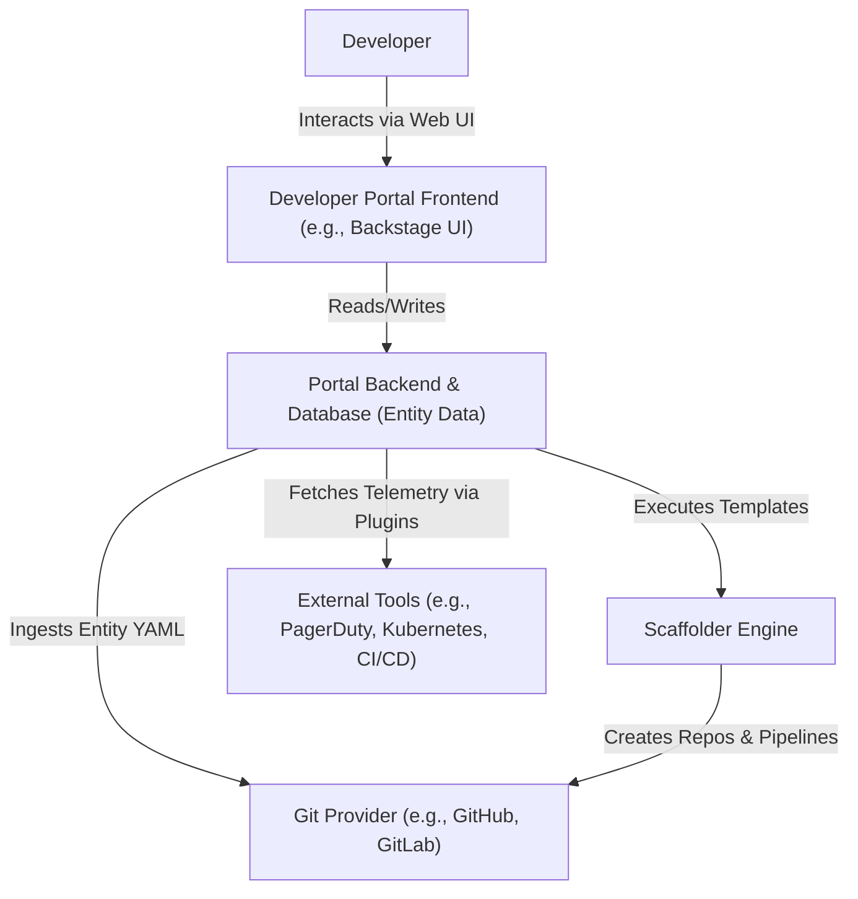

# Designing Developer Portals & Golden Paths

Version: 1.0.0

Purpose: Canonical lesson structure for Platform Engineering & AI Infrastructure Curriculum.

Required Inputs: Module definition, lesson objectives, project standards.

Outputs: Standards-compliant lesson markdown.

# Lesson Overview

This lesson dives into the practical implementation of Developer Portals, focusing on the industry standard, Backstage. We will explore how to architect a unified catalog of software assets and design automated "Golden Paths" via Software Templates, abstracting complex infrastructure scaffolding into a simple, self-serve UI.

---

# Learning Objectives

* Explain the architectural components of a modern Developer Portal (e.g., Backstage).
* Design and implement a Software Catalog to track microservices, APIs, and ownership.
* Create automated Software Templates to scaffold new projects (Golden Paths).
* Evaluate the trade-offs between open-source portals (Backstage) and managed SaaS solutions (Port, Cortex).

---

# Prerequisites

* Completion of `MOD-IDP-01: Platform Engineering Principles`.
* Basic understanding of YAML, CI/CD pipelines, and Git workflows.
* Familiarity with microservice architecture.

---

# Why This Exists

As organizations transition to microservices, the number of repositories, APIs, and cloud resources explodes. Developers lose track of who owns what, where the documentation lives, and how to create a new service that complies with company standards. Developer Portals exist to provide a "single pane of glass" for the engineering organization. They solve the fragmentation problem by centralizing the software catalog, documentation, and scaffolding tools into one cohesive interface.

---

# Core Concepts

## The Software Catalog

The heart of any Developer Portal is the Software Catalog. It is a centralized metadata repository that tracks all software entities within an organization—components (microservices), APIs, resources (databases), and systems. Critically, it maps these technical entities to human ownership (Teams/Users), solving the "who owns this broken service?" problem.

## Software Templates (The Golden Path)

Software templates are executable blueprints for creating new software assets. When a developer wants to start a new project, they don't copy-paste an old repository and try to strip out the business logic. Instead, they run a template from the portal. The template gathers parameters via a UI form, generates the boilerplate code, sets up the Git repository, configures the CI/CD pipeline, and registers the new service in the Catalog.

## TechDocs

Developer portals often include a "docs-like-code" feature. Documentation is written in Markdown alongside the code in the same Git repository. The portal ingests this Markdown and renders it centrally. This ensures documentation is always up-to-date with the code and easily searchable across the entire organization.

---

# Architecture



---

# Real-World Example

A large financial institution runs 1,500 microservices. Before implementing a Developer Portal, a critical vulnerability was found in a specific version of a logging library. It took 3 weeks of manual auditing across hundreds of Git repositories to find which teams owned the affected services. After implementing Backstage, the security team queried the Software Catalog, immediately identified the 42 affected services and their owning teams, and sent targeted remediation tickets in under 5 minutes.

---

# Hands-on Demonstration

Let's look at how a Backstage Software Template is defined. A template consists of parameters (the UI form) and steps (the automation).

**Input (template.yaml):**
```yaml
apiVersion: scaffolder.backstage.io/v1beta3
kind: Template
metadata:
  name: spring-boot-microservice
  title: Spring Boot Microservice
  description: Create a standard Spring Boot service with CI/CD
spec:
  owner: platform-team
  type: service
  parameters:
    - title: Service Details
      properties:
        componentName:
          title: Name
          type: string
        owner:
          title: Owner
          type: string
  steps:
    - id: fetch-base
      name: Fetch Base Template
      action: fetch:template
      input:
        url: ./skeleton
        values:
          name: ${{ parameters.componentName }}
    - id: publish
      name: Publish to GitHub
      action: publish:github
      input:
        repoUrl: github.com?owner=my-org&repo=${{ parameters.componentName }}
    - id: register
      name: Register in Catalog
      action: catalog:register
      input:
        repoContentsUrl: ${{ steps.publish.output.repoContentsUrl }}
```

**Explanation:**
1. The portal generates a UI form asking the user for `componentName` and `owner`.
2. The `fetch-base` step grabs a standard Spring Boot boilerplate (the `skeleton` directory) and injects the variables.
3. The `publish` step creates a new GitHub repository with the generated code.
4. The `register` step adds the newly created repository into the Backstage Catalog automatically.

---

# Hands-on Lab

* **Objective:** Define a software entity and register it in a local mock catalog.
* **Estimated Time:** 15 minutes
* **Difficulty:** Beginner
* **Environment:** Text editor.

## Step-by-step Instructions

1. Create a file named `catalog-info.yaml`. This file lives in the root of your application repository.
2. Define the basic metadata for a hypothetical Payment Service.

```yaml
apiVersion: backstage.io/v1alpha1
kind: Component
metadata:
  name: payment-service
  description: Handles all stripe transactions
  tags:
    - java
    - spring-boot
  links:
    - url: https://datadoghq.com/dashboard/payments
      title: Datadog Dashboard
spec:
  type: service
  lifecycle: production
  owner: team-billing
  system: core-banking
```
3. Define the owning team in a separate file (or append to the same, separated by `---`):

```yaml
---
apiVersion: backstage.io/v1alpha1
kind: Group
metadata:
  name: team-billing
  description: The billing and payments squad
spec:
  type: team
  children: []
```

## Verification

In a real Backstage environment, you would paste the URL of this raw file into the "Register" page. Backstage reads the YAML, parses the relationships, and renders a rich UI showing that `team-billing` owns the `payment-service` in the `production` lifecycle.

## Troubleshooting

Ensure YAML indentation is correct. Ensure the `owner` field in the Component matches the `name` field of the Group exactly.

## Cleanup

Delete the YAML files.

---

# Production Notes

Backstage is incredibly powerful but notoriously difficult to maintain. It is built as a monolithic Node.js application heavily reliant on React and TypeScript. Adopting Backstage means your Platform Team must also become proficient TypeScript developers to manage plugins and updates. For smaller organizations, managed SaaS alternatives (like Port or Cortex) are often a more viable strategic choice, as they provide similar functionality without the operational overhead of hosting Node.js apps.

---

# Common Mistakes

* **Garbage In, Garbage Out:** Populating the catalog with outdated, manual data entry. The catalog must be automatically synced from a source of truth (like Git repos or cloud provider APIs). If developers have to manually update the portal, they won't, and the portal will lose trust.
* **Over-engineering Templates:** Creating massive, monolithic templates with hundreds of parameters. Keep templates simple and focused. Use composable actions.
* **Ignoring the "Glue":** A portal is useless if it doesn't talk to your CI/CD, your monitoring, and your cloud provider. The real value of a portal is in its plugins.

---

# Failure-Driven Learning

**Scenario:** The platform team mandates that all services must be in the Backstage catalog. Six months later, the catalog is full of "orphan" services where the owning team is listed as "TBD" or a team that has since been disbanded.

**Diagnosis:** The catalog definition (`catalog-info.yaml`) was decoupled from actual ownership structures in the identity provider (e.g., Okta/Active Directory). When teams reorganized, the catalog drifted.

**Recovery:** Implement a linting check in the CI/CD pipeline: a pull request cannot be merged unless `catalog-info.yaml` contains a valid, currently existing team from the corporate directory. Automate the synchronization between the Identity Provider and the Developer Portal.

---

# Engineering Decisions

**Where does the source of truth live?**
In Developer Portals, a major decision is whether the Portal *is* the source of truth, or if it merely *reads* the source of truth.
Best practice: The Portal should be read-only for metadata. The true source of truth should be the `catalog-info.yaml` files living inside the individual Git repositories. This aligns with GitOps principles; changes to ownership or descriptions are made via Pull Requests on the code, and the portal simply reflects those changes.

---

# Best Practices

* **Start with the Catalog:** Don't build templates or complex plugins until you have a populated, accurate software catalog. Visibility is step one.
* **Federated Ownership:** The platform team manages the portal infrastructure, but the individual development teams manage their own `catalog-info.yaml` files.
* **Docs-Like-Code:** Co-locate documentation with code and render it in the portal to ensure it stays relevant.

---

# Troubleshooting Guide

## Issue 1: Catalog Entities are Missing or Stale

* **Cause:** The ingestion loop is failing, or developers have committed malformed YAML.
* **Diagnosis:** Check the Portal backend logs for parsing errors. Look for YAML validation failures in the target repository.
* **Solution:** Implement a JSON Schema validation step in the CI pipeline of the target repositories to fail the build if the `catalog-info.yaml` is malformed *before* it gets merged.

---

# Summary

Developer Portals like Backstage abstract away organizational complexity. By combining a centralized Software Catalog (who owns what) with automated Software Templates (how to build things right), Platform Engineers can drastically reduce cognitive load, enforce organizational standards invisibly, and improve the overall developer experience.

---

# Cheat Sheet

* **Software Catalog:** Central repository of microservices and their metadata.
* **Software Template:** Executable blueprint to scaffold new projects.
* **Entity:** A generic term for anything tracked in the catalog (Service, API, System, Group).
* **TechDocs:** Backstage plugin for rendering markdown docs stored alongside code.

---

# Knowledge Check

## Multiple Choice Questions

1. In the context of a Developer Portal, what is the primary purpose of a Software Template?
   * A) To monitor production metrics.
   * B) To scaffold new software projects consistently according to organization standards.
   * C) To provision AWS EC2 instances manually.
   * D) To write business logic for the developer.

## Scenario Questions

You are implementing Backstage, and you want to ensure the Software Catalog stays up to date. Should you require developers to log into the Backstage UI to update their service's description, or should you have them edit a YAML file in their Git repository?

## Short Answer Questions

What is the risk of adopting open-source Backstage for a small, 3-person platform team?

<details>
<summary><b>View Answers</b></summary>

### Multiple Choice
1. **B) To scaffold new software projects consistently according to organization standards.** - *Templates provide the Golden Path for creating new services with boilerplate code and pipelines already configured.*

### Scenario
*They should edit the YAML file in their Git repository (GitOps approach). The portal should read from the repository. This ensures the code and its metadata are versioned together, and changes go through standard PR review processes.*

### Short Answer
*Backstage is a complex Node.js/React application. A small team might spend all their time maintaining, upgrading, and writing custom plugins for the portal itself, rather than actually building platform capabilities for their developers. A managed SaaS IDP might be a better choice for a small team.*

</details>

---

# Interview Preparation

## Beginner Questions

* What is a Developer Portal?
* What is the purpose of a Software Catalog?

## Intermediate Questions

* How do Developer Portals solve the "who owns this service" problem?
* Explain the difference between an Internal Developer Portal (IDP) and an Internal Developer Platform.

## Advanced Questions

* Explain the architectural workflow of executing a Software Template in Backstage.
* Contrast building a portal with Backstage versus buying a SaaS portal like Port or Cortex.

## Scenario-Based Discussions

* Your engineering org has 500 microservices, and nobody knows where the API documentation is. How would you architect a solution using a Developer Portal?

<details>
<summary><b>View Answers</b></summary>

### Beginner
* **What is a Developer Portal?:** A centralized web interface that provides developers with a single pane of glass for their software catalog, documentation, and automated scaffolding tools.
* **Purpose of a Software Catalog?:** To maintain a centralized registry of all software components, APIs, and resources, linking them to their respective owning teams.

### Intermediate
* **Solving the ownership problem?:** By requiring a `catalog-info.yaml` (or equivalent) file in every repository that explicitly maps the software entity to an organizational Group (Team). The portal ingests this and makes it searchable.
* **Portal vs. Platform:** The Platform is the underlying engine (Kubernetes, CI/CD, Terraform, Vault). The Portal is just the User Interface (the frontend) that developers interact with to interface with the platform.

### Advanced
* **Software Template Workflow:** The developer fills out a UI form in the portal. The backend engine takes these parameters, fetches a boilerplate skeleton from a source location, injects the parameters into the skeleton, pushes the new code to a newly created Git repository, configures initial CI pipelines via API, and registers the new repository back into the portal's catalog.
* **Backstage vs SaaS:** Backstage provides infinite customizability but requires heavy engineering effort (React/Node) to maintain and write plugins. SaaS solutions offer rapid out-of-the-box integrations and zero infrastructure maintenance, but offer less flexibility for highly bespoke legacy workflows.

### Scenario-Based Discussions
* **API Documentation Scenario:** I would implement a Developer Portal with a TechDocs-like feature. I would mandate that all API documentation (e.g., OpenAPI specs and Markdown) lives inside the same Git repository as the microservice code. The portal would be configured to ingest these repositories, parse the docs, and render them centrally. I would enforce this by adding a CI check that fails the build if the API documentation is missing or malformed.

</details>

---

# Further Reading

1. [Backstage Core Concepts](https://backstage.io/docs/getting-started/core-concepts)
2. [Port: What is an Internal Developer Portal?](https://www.getport.io/library/internal-developer-portal)
3. [Spotify's Journey to Backstage](https://engineering.atspotify.com/2020/08/what-is-backstage/)
