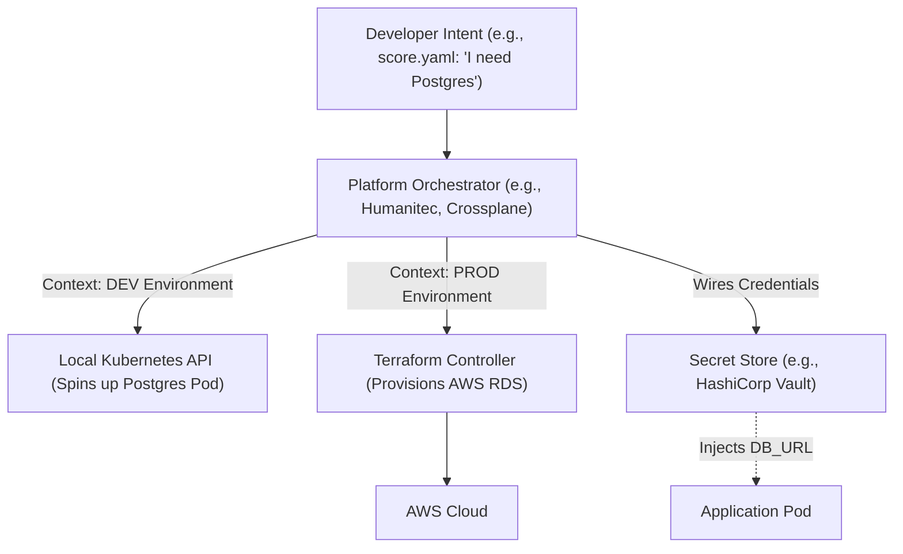

# Self-Service Dynamic Infrastructure Scaffolding & Templates

Version: 1.0.0

Purpose: Canonical lesson structure for Platform Engineering & AI Infrastructure Curriculum.

Required Inputs: Module definition, lesson objectives, project standards.

Outputs: Standards-compliant lesson markdown.

# Lesson Overview

This lesson transitions from Developer Portals (the frontend) to the underlying automation engines (the backend). We will explore how to architect dynamic infrastructure scaffolding, enabling developers to self-serve complex cloud resources—like databases, message queues, and Kubernetes namespaces—without writing manual Terraform or waiting on operations tickets.

---

# Learning Objectives

* Differentiate between static Infrastructure as Code (IaC) and dynamic infrastructure scaffolding.
* Explain the role of a Platform Orchestrator (e.g., Humanitec, Crossplane) in self-service workflows.
* Design workload specifications that separate developer intent from infrastructure implementation.
* Construct parameterized templates for on-demand cloud resource provisioning.

---

# Prerequisites

* Understanding of Terraform and Kubernetes fundamentals.
* Completion of `MOD-IDP-02: Designing Developer Portals`.
* Basic understanding of CI/CD pipelines.

---

# Why This Exists

Infrastructure as Code (Terraform, Pulumi) was a massive leap forward, but it shifted the operational burden onto developers. Forcing a frontend developer to write and maintain Terraform state files just to get an S3 bucket increases cognitive load and introduces security risks. Dynamic infrastructure scaffolding exists to abstract IaC. It allows developers to declare *what* they need (e.g., "a PostgreSQL database") while the platform automatically determines *how* to provision it (e.g., RDS in AWS for prod, a Helm chart in dev) based on the context.

---

# Core Concepts

## Developer Intent vs. Infrastructure Implementation

The core principle of dynamic scaffolding is separating the "ask" from the "execution."
* **Developer Intent:** "My application needs a PostgreSQL database."
* **Infrastructure Implementation:** "In the 'dev' environment, spin up a Postgres container in the local cluster. In the 'prod' environment, provision a Multi-AZ AWS RDS instance, configure IAM roles, inject secrets into Vault, and attach a security group."
The developer should only ever write the intent. The platform handles the implementation.

## Platform Orchestrators

A Platform Orchestrator is the engine that sits between the developer's intent and the actual infrastructure tools (like Terraform or Kubernetes). When a developer deploys an app, the Orchestrator reads the requirements, looks at the environment context (dev/staging/prod), selects the correct infrastructure template, provisions it, and wires the credentials back to the application.

## Score / Workload Specifications

To standardize "developer intent," the industry uses workload specifications like [Score](https://score.dev/). Score is an open-source, platform-agnostic specification. A developer writes a `score.yaml` defining their app and its dependencies (like a DB). The Orchestrator translates that `score.yaml` into Helm charts, Terraform runs, or API calls specific to the underlying cloud.

---

# Architecture



---

# Real-World Example

At a mid-sized e-commerce company, developers needed a Redis cache for every new microservice. Originally, they copied Terraform modules, leading to 50 slightly different, unmaintained Redis configurations across the company. The Platform Team introduced Crossplane (a Kubernetes add-on for infrastructure scaffolding). Now, developers simply add an annotation to their Kubernetes deployment: `platform.company.com/requires: redis`. The Crossplane control plane detects this, dynamically provisions a standard Elasticache cluster via AWS APIs, and injects the connection string back into the pod. The developer never touches Terraform.

---

# Hands-on Demonstration

Let's look at the difference between static IaC and a developer-centric Workload Specification (Score).

**Traditional (Developer writes Terraform - High Cognitive Load):**
```hcl
# Developer has to know AWS specific syntax, instance sizes, and networking.
resource "aws_db_instance" "default" {
  allocated_storage    = 10
  engine               = "postgres"
  instance_class       = "db.t3.micro"
  name                 = "mydb"
  username             = "foo"
  password             = "foobarbaz"
  vpc_security_group_ids = [aws_security_group.db_sg.id]
}
```

**Dynamic Scaffolding (Developer writes Score - Low Cognitive Load):**
```yaml
# score.yaml
apiVersion: score.dev/v1b1
metadata:
  name: my-app
containers:
  backend:
    image: my-registry/my-app:latest
resources:
  db:
    type: postgres
```

**Explanation:**
In the Score example, the developer merely states: `resources: db: type: postgres`. That is their entire infrastructure configuration.
When this is deployed to a "Dev" environment, the Platform Orchestrator might execute a lightweight script to deploy a Postgres Helm chart. When deployed to "Prod", the Orchestrator maps `type: postgres` to a hardened, approved Terraform module maintained strictly by the Platform Team.

---

# Hands-on Lab

* **Objective:** Conceptualize a Resource Definition mapping for a Platform Orchestrator.
* **Estimated Time:** 20 minutes
* **Difficulty:** Intermediate
* **Environment:** Whiteboard or text editor.

## Step-by-step Instructions

1. **The Request:** Your developers need an S3-compatible object storage bucket for their applications.
2. **Define the Intent:** Write the YAML that the developer will include in their repository to request this bucket (keep it abstract).
3. **Map the Dev Implementation:** Define what actual technology the Orchestrator will provision when the environment is `dev` (e.g., Localstack or MinIO on the local K8s cluster).
4. **Map the Prod Implementation:** Define what technology the Orchestrator will provision when the environment is `prod` (e.g., AWS S3 via an approved Terraform module).
5. **Data Wiring:** Describe exactly how the credentials (Access Key, Secret Key, Bucket Name) get passed from the provisioned infrastructure back to the developer's application without human intervention.

## Verification

Review your architecture. If the developer has to know that AWS S3 is being used under the hood, your abstraction has leaked.

## Troubleshooting

Ensure you have clearly separated the *interface* (what the developer sees) from the *implementation* (what the platform executes).

## Cleanup

No technical cleanup required.

---

# Production Notes

Dynamic infrastructure scaffolding requires a robust control plane. Tools like Crossplane turn Kubernetes into a universal control plane, allowing you to manage AWS/GCP resources using Kubernetes manifests. This is powerful but requires high Kubernetes maturity within the platform team. An alternative is using dedicated Orchestrators like Humanitec, which sit outside the cluster and manage the deployment graphs.

---

# Common Mistakes

* **Leaky Abstractions:** Forcing the developer to specify AWS VPC IDs or subnets in their application request. The platform should abstract network topologies away from the developer.
* **Lack of Cost Controls:** If developers can self-serve databases with a single line of YAML, they will over-provision. You must implement policy engines (like OPA/Kyverno) or budget limits within the orchestrator to prevent runaway cloud costs.
* **Ignoring Day 2 Operations:** Provisioning a database dynamically is easy. Backing it up, rotating its credentials automatically, and destroying it cleanly when the app is deleted (Day 2 operations) is the hard part of platform engineering.

---

# Failure-Driven Learning

**Scenario:** The platform team implements dynamic scaffolding. A developer deploys a feature branch, and the platform automatically spins up a heavy AWS RDS instance for testing. The developer abandons the branch. Two months later, the AWS bill is $5,000 over budget due to hundreds of abandoned "dev" databases.

**Diagnosis:** The platform lacked TTL (Time To Live) policies and environmental context mapping. It provisioned production-tier infrastructure for ephemeral development environments.

**Recovery:** Update the platform orchestrator rules. For any environment labeled `feature-*`, map the Postgres request to an ephemeral Kubernetes container (costing $0) rather than AWS RDS. Implement a garbage collection script that destroys any `feature-*` environment older than 7 days.

---

# Engineering Decisions

**Terraform CI/CD vs. Platform Orchestrator**
Many teams try to build self-service by triggering Terraform via GitHub Actions.
* *Terraform in CI/CD:* Good for static infrastructure (VPCs, clusters) managed by Ops. Terrible for dynamic app dependencies, as it requires developers to manage Terraform state files and PR approvals.
* *Platform Orchestrator (e.g., Crossplane):* Better for app dependencies. The app deployment itself triggers the infrastructure creation asynchronously. The state is managed by the control plane, completely hidden from the developer.

---

# Best Practices

* **Environment-Agnostic Code:** Developers should write their application and infrastructure requests exactly the same way for local, dev, and prod. The platform handles the environmental differences.
* **Automated Wiring:** The platform MUST automatically inject infrastructure credentials (connection strings, API keys) into the application as environment variables or secrets. Developers should never copy-paste credentials.
* **Standardized Modules:** The Platform Team writes and maintains the complex Terraform modules (the implementations); developers only consume them.

---

# Troubleshooting Guide

## Issue 1: Developer App Fails to Connect to Dynamically Provisioned DB

* **Cause:** The orchestration engine provisioned the DB, but the credential wiring failed, or network policies are blocking traffic.
* **Diagnosis:** Check the Pod environment variables (e.g., `kubectl exec -it <pod> -- env`). Is the `DB_URL` populated? If yes, check Kubernetes NetworkPolicies or AWS Security Groups to ensure the cluster can talk to the DB subnet.
* **Solution:** Ensure the Orchestrator's secret injection mechanism is functioning and that the standard Terraform module includes the correct Security Group ingress rules allowing traffic from the EKS cluster.

---

# Summary

Dynamic infrastructure scaffolding represents the pinnacle of self-service in platform engineering. By separating developer intent from infrastructure implementation using Platform Orchestrators and standardized specifications, organizations can drastically accelerate feature delivery, eliminate ticket queues, and maintain strict security and cost controls under the hood.

---

# Cheat Sheet

* **Dynamic Scaffolding:** Automated provisioning of infrastructure based on app requirements at deployment time.
* **Developer Intent:** What the developer needs (e.g., "a cache").
* **Platform Orchestrator:** The engine that translates intent into actual cloud resources based on environment context.
* **Crossplane:** An open-source Kubernetes add-on that enables infrastructure provisioning via K8s manifests.

---

# Knowledge Check

## Multiple Choice Questions

1. What is the primary benefit of separating developer intent from infrastructure implementation?
   * A) It forces developers to learn AWS networking.
   * B) It allows developers to deploy applications without knowing or managing the underlying cloud-specific IaC.
   * C) It removes the need for a Platform Engineering team.
   * D) It prevents developers from deploying to production.

## Scenario Questions

A developer needs an object storage bucket. In the `dev` environment, the platform provisions a local MinIO container. In `prod`, it provisions an AWS S3 bucket. The developer's application code does not change between environments. What architectural pattern does this describe?

## Short Answer Questions

Why is using GitHub Actions to run manual Terraform scripts often insufficient for true dynamic developer self-service?

<details>
<summary><b>View Answers</b></summary>

### Multiple Choice
1. **B) It allows developers to deploy applications without knowing or managing the underlying cloud-specific IaC.** - *This is the core of reducing extraneous cognitive load.*

### Scenario
*This describes Context-Aware Infrastructure Provisioning via a Platform Orchestrator. The platform interprets the generic request and maps it to the appropriate resource based on the environment context.*

### Short Answer
*Because it usually requires the developer to understand Terraform, manage state files, understand variable files, and handle merge conflicts. It's essentially just moving the "Ops Ticket" into a Pull Request, rather than abstracting the infrastructure complexity away entirely.*

</details>

---

# Interview Preparation

## Beginner Questions

* What is dynamic infrastructure scaffolding?
* Why shouldn't frontend developers write Terraform for their app dependencies?

## Intermediate Questions

* Explain the difference between Developer Intent and Infrastructure Implementation.
* How does a tool like Crossplane differ from traditional Terraform?

## Advanced Questions

* Explain how you would handle automated credential injection (wiring) from a dynamically provisioned AWS RDS instance into a Kubernetes Pod.
* How do you prevent cost overruns when developers have self-service infrastructure capabilities?

## Scenario-Based Discussions

* Your developers are currently copying and pasting Terraform modules to spin up databases, causing massive drift and security vulnerabilities. Walk me through how you would architect a self-service solution to solve this.

<details>
<summary><b>View Answers</b></summary>

### Beginner
* **Dynamic Scaffolding?:** It's a system where infrastructure (like databases) is automatically provisioned when an application is deployed, without manual intervention or manual IaC execution by the developer.
* **Why not Terraform for devs?:** Because it forces them to understand cloud provider specifics, state management, and security groups, vastly increasing their cognitive load and slowing down feature development.

### Intermediate
* **Intent vs Implementation:** Intent is what the app needs conceptually ("a relational database"). Implementation is how it's actually built ("AWS RDS postgres 14 on a t3.medium"). The platform handles translating intent to implementation.
* **Crossplane vs Terraform:** Terraform is a CLI tool that runs statically (often in pipelines). Crossplane is a continuous control plane (running inside K8s) that constantly monitors the state of cloud resources and reconciles them automatically, acting as a bridge between K8s manifests and Cloud APIs.

### Advanced
* **Automated Credential Wiring:** I would use an Orchestrator (or Crossplane) configured so that when the RDS instance is created, the resulting credentials (endpoint, user, password) are immediately written to a Kubernetes Secret. The deployment manifest for the application would be dynamically templated to mount that specific Secret as environment variables (e.g., `DB_HOST`).
* **Preventing cost overruns:** By mapping "intent" to cheap resources in lower environments (e.g., local containers instead of cloud DBs). I would also implement OPA/Kyverno policies to restrict instance sizes, and use automated garbage collection to tear down ephemeral environments after a set TTL.

### Scenario-Based Discussions
* **Solving Terraform Drift Scenario:** I would build an abstraction layer. First, the Platform Team would consolidate those 50 Terraform modules into one highly secure, approved standard module. Second, I would deploy a Platform Orchestrator (like Humanitec or Crossplane). Third, I would require developers to declare their need for a database using a simple YAML specification (like Score) attached to their app deployment. The Orchestrator intercepts this, runs the standard module automatically, and wires the credentials. The developers lose access to write custom Terraform, eliminating drift.

</details>

---

# Further Reading

1. [Score Specification](https://score.dev/)
2. [Crossplane Architecture](https://crossplane.io/docs/latest/concepts/architecture.html)
3. [Humanitec: What is a Platform Orchestrator?](https://humanitec.com/blog/what-is-a-platform-orchestrator)
