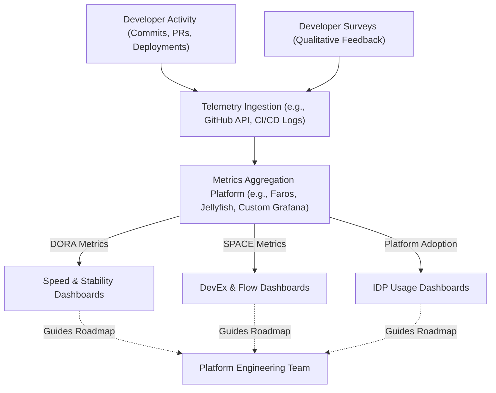

# Measuring Developer Experience (DevEx) & Platform Adoption

Version: 1.0.0

Purpose: Canonical lesson structure for Platform Engineering & AI Infrastructure Curriculum.

Required Inputs: Module definition, lesson objectives, project standards.

Outputs: Standards-compliant lesson markdown.

# Lesson Overview

This lesson covers how to quantify the success of an Internal Developer Platform (IDP) and the Platform Engineering team. It focuses on measuring Developer Experience (DevEx) using both qualitative developer feedback and quantitative industry standards like DORA and SPACE metrics to ensure the platform is actually solving business problems.

---

# Learning Objectives

* Define Developer Experience (DevEx) and its impact on engineering productivity.
* Apply DORA metrics to measure software delivery performance.
* Utilize the SPACE framework to capture a holistic view of developer productivity.
* Design telemetry systems to track platform adoption and feature usage.

---

# Prerequisites

* Completion of `MOD-IDP-01`, `MOD-IDP-02`, and `MOD-IDP-03`.
* Basic understanding of agile software development lifecycles.

---

# Why This Exists

Platform Engineering requires significant capital investment. If a platform team spends a year building an IDP, leadership will eventually ask: "Did this make us faster?" Without metrics, the platform team cannot justify its existence or prove ROI. Furthermore, measuring DevEx ensures the platform team is building the *right* things. If a new automated deployment tool is launched but metrics show deployment frequency has dropped, the platform team knows their tool is causing friction rather than removing it.

---

# Core Concepts

## Developer Experience (DevEx)

DevEx is the lived experience of developers as they create, maintain, and test software. It encompasses their tools, processes, and environment. Good DevEx means developers are in a state of "flow" (high intrinsic cognitive load, low extraneous cognitive load). Bad DevEx is characterized by waiting on tickets, wrestling with broken pipelines, and deciphering undocumented APIs.

## DORA Metrics

Created by DevOps Research and Assessment, DORA metrics are the industry standard for measuring software delivery performance (Speed and Stability).
1. **Deployment Frequency (Speed):** How often code is deployed to production.
2. **Lead Time for Changes (Speed):** Time from commit to production.
3. **Change Failure Rate (Stability):** Percentage of deployments causing a failure in production.
4. **Time to Restore Service (Stability):** How long it takes to recover from a failure in production.

## The SPACE Framework

While DORA measures delivery, it doesn't measure the human element. The SPACE framework provides a more holistic view of productivity:
* **S**atisfaction & Well-being (e.g., eNPS, burnout rates).
* **P**erformance (e.g., system reliability, customer satisfaction).
* **A**ctivity (e.g., number of commits, deployments).
* **C**ommunication & Collaboration (e.g., PR review time, documentation quality).
* **E**fficiency & Flow (e.g., uninterrupted work time, time waiting on operations tickets).

## Platform Telemetry

Just like a commercial SaaS product, your Internal Developer Platform needs telemetry. You must track Daily Active Users (DAU) on your developer portal, the percentage of new services using standard templates, and the time it takes for a new engineer to make their first production commit (Time to First Commit).

---

# Architecture



---

# Real-World Example

A major retail company realized their deployment frequency was terrible (once a month). They formed a Platform Team to build a new CI/CD Golden Path. To prove success, they measured the DORA metrics before and after the rollout. Before the platform: Lead Time was 14 days. After adopting the platform's Golden Path, Lead Time dropped to 4 hours. By correlating this quantitative data with qualitative surveys (developers reporting higher satisfaction because they weren't working weekends to deploy), the Platform Team secured funding to expand their IDP to handle database provisioning.

---

# Hands-on Demonstration

Let's look at how to calculate Lead Time for Changes using a simple script.

**Input (Mock CI/CD Data):**
```json
[
  {"commit_id": "a1b2", "commit_time": "2023-10-01T10:00:00Z", "deploy_time": "2023-10-01T11:30:00Z"},
  {"commit_id": "c3d4", "commit_time": "2023-10-02T09:00:00Z", "deploy_time": "2023-10-02T13:00:00Z"}
]
```

**Code (Python conceptually):**
```python
import json
from datetime import datetime

data = json.loads(mock_data)
total_lead_time_seconds = 0

for run in data:
    commit_time = datetime.fromisoformat(run['commit_time'].replace('Z', '+00:00'))
    deploy_time = datetime.fromisoformat(run['deploy_time'].replace('Z', '+00:00'))
    total_lead_time_seconds += (deploy_time - commit_time).total_seconds()

avg_lead_time = total_lead_time_seconds / len(data)
print(f"Average Lead Time: {avg_lead_time / 3600} hours")
```

**Expected Output:**
`Average Lead Time: 2.75 hours`

**Explanation:**
By continuously scraping the Git provider (GitHub/GitLab) for commit timestamps and the CI/CD system for deployment timestamps, the platform team can generate real-time dashboards showing exactly how fast value is reaching customers.

---

# Hands-on Lab

* **Objective:** Design a DevEx survey to gather qualitative feedback from developers.
* **Estimated Time:** 15 minutes
* **Difficulty:** Beginner
* **Environment:** Text editor.

## Step-by-step Instructions

1. Imagine you have just launched a new Developer Portal (like Backstage). You want to measure if it is actually helping developers.
2. Draft 5 questions for a quarterly DevEx survey.
3. **Requirement:** Include at least one question focusing on "Efficiency & Flow" (from SPACE).
4. **Requirement:** Include at least one question focusing on "Satisfaction" (from SPACE).
5. **Requirement:** Ensure questions are actionable (e.g., avoid "Do you like the portal?", ask "How often do you find the documentation you need in the portal within 5 minutes?").

## Verification

Review your questions. Could you look at the answers and immediately know *what feature* you need to build or fix next on the platform? If not, the questions are too vague.

## Troubleshooting

If your questions are yielding binary (Yes/No) answers, switch to a Likert scale (1-5, Strongly Disagree to Strongly Agree) to measure nuanced sentiment over time.

## Cleanup

No technical cleanup required.

---

# Production Notes

Do not weaponize metrics. If you use DORA or SPACE metrics to punish individual developers or rank teams against each other (e.g., "Team A has fewer commits than Team B"), developers will game the system (e.g., making hundreds of meaningless 1-line commits). Metrics must be used exclusively by the Platform Team to measure the *system*, not by management to evaluate *individuals*.

---

# Common Mistakes

* **Only Measuring Speed:** Focusing purely on Deployment Frequency while ignoring Change Failure Rate. This leads to teams shipping broken code faster.
* **Ignoring Qualitative Data:** Looking only at dashboard numbers and assuming a tool is successful, without realizing developers hate the tool and are finding workarounds. Surveys are crucial.
* **Vanity Metrics:** Measuring "Lines of Code written" or "Number of Jenkins Jobs run." These do not correlate to business value or developer productivity.

---

# Failure-Driven Learning

**Scenario:** The Platform Team's DORA dashboard shows an incredible Deployment Frequency—code is deploying 50 times a day. The team celebrates. However, the Developer Satisfaction survey returns terrible results, citing massive burnout.

**Diagnosis:** The dashboard didn't measure the "Time to Restore Service." The high deployment frequency was actually developers pushing hotfixes repeatedly because the local testing environment was broken, causing extreme stress and forcing developers to test in production.

**Recovery:** The Platform Team stops celebrating the vanity speed metric. They pause feature work on the portal and immediately prioritize fixing the local testing environment. They update their metrics dashboard to prominently display Change Failure Rate next to Deployment Frequency.

---

# Engineering Decisions

**Build vs. Buy for Metrics**
To track DORA metrics, you can build a custom solution (scraping GitHub APIs and piping to Grafana) or buy an Engineering Management Platform (EMP) like LinearB, Jellyfish, or Faros.
* *Build:* Cheaper initially, highly customizable. Becomes very expensive to maintain as API rate limits and data correlation complexities grow.
* *Buy:* Rapid time to value, pre-built SPACE/DORA dashboards. Requires budget and careful configuration to map your specific CI/CD workflows to their data models.

---

# Best Practices

* **Correlate Quantitative with Qualitative:** Always pair hard data (pipeline speed) with soft data (developer surveys).
* **Track Onboarding:** Measure "Time to First Production Commit" for new hires. It is the ultimate test of your platform's documentation, golden paths, and access management.
* **Measure Platform Adoption:** Track what percentage of new microservices are built using the IDP templates vs. manual creation. High adoption means you built a good product.

---

# Troubleshooting Guide

## Issue 1: DORA Dashboard Shows Inaccurate Lead Times

* **Cause:** The telemetry ingestion is failing to correctly link Git commits to the final deployment stage, often due to squashed commits or detached deployment pipelines (e.g., ArgoCD syncing asynchronously).
* **Diagnosis:** Trace a single commit ID from GitHub through the CI system and into the Kubernetes cluster. Find where the metadata linkage breaks.
* **Solution:** Standardize the deployment tagging process. Ensure the Git commit SHA is passed as an artifact label all the way to the final Kubernetes Pod, allowing the metrics engine to reliably calculate the time diff between commit and pod creation.

---

# Summary

Measuring Developer Experience and Platform Adoption is the only way to prove the ROI of Platform Engineering. By combining quantitative DORA metrics, holistic SPACE frameworks, and qualitative user surveys, platform teams can treat their IDP like a true product, continuously iterating to remove friction and accelerate the engineering organization.

---

# Cheat Sheet

* **DORA:** Deployment Frequency, Lead Time for Changes, Change Failure Rate, Time to Restore Service.
* **SPACE:** Satisfaction, Performance, Activity, Communication, Efficiency.
* **Time to First Commit:** A key metric measuring how fast a new hire can push code to production, reflecting platform onboarding efficiency.

---

# Knowledge Check

## Multiple Choice Questions

1. Which of the following is considered a DORA metric for measuring software delivery stability?
   * A) Deployment Frequency
   * B) Lead Time for Changes
   * C) Change Failure Rate
   * D) Number of Commits per Day

## Scenario Questions

Your Platform Team rolls out a new Golden Path for deploying Node.js apps. You want to prove to leadership that this path is better than the old manual way. Which metric would be the most compelling to present?

## Short Answer Questions

Why is it dangerous to use metrics like "number of commits" or "deployment frequency" to evaluate individual developer performance?

<details>
<summary><b>View Answers</b></summary>

### Multiple Choice
1. **C) Change Failure Rate** - *DORA splits into Speed (Deployment frequency, Lead time) and Stability (Change failure rate, Time to restore).*

### Scenario
*Lead Time for Changes (comparing the old path vs the new Golden Path), combined with Platform Adoption Rate (showing that developers are actually choosing to use it).*

### Short Answer
*It leads to gamification and weaponization of metrics. If developers are evaluated on commits, they will make smaller, meaningless commits. Metrics should be used to evaluate the efficiency of the platform and the system as a whole, not to punish individuals.*

</details>

---

# Interview Preparation

## Beginner Questions

* What are the four DORA metrics?
* What does DevEx stand for, and why is it important?

## Intermediate Questions

* Explain the difference between DORA metrics and the SPACE framework.
* How do you calculate "Lead Time for Changes"?

## Advanced Questions

* If your Lead Time is low, but your Change Failure Rate is high, what does this tell you about your platform's CI/CD pipeline, and how would you fix it?
* How would you instrument a custom Internal Developer Portal to track platform adoption metrics?

## Scenario-Based Discussions

* Leadership asks you to justify the budget for your 5-person Platform Engineering team. They want to know if the IDP you built was worth the cost. How do you construct your argument using data?

<details>
<summary><b>View Answers</b></summary>

### Beginner
* **Four DORA metrics:** Deployment Frequency, Lead Time for Changes, Change Failure Rate, Time to Restore Service.
* **What is DevEx:** Developer Experience. It's important because a poor DevEx leads to high cognitive load, burnout, slow feature delivery, and high employee turnover.

### Intermediate
* **DORA vs SPACE:** DORA strictly measures the speed and stability of the software delivery pipeline (machine data). SPACE is a broader framework that includes the human element, measuring satisfaction, communication, and overall efficiency (survey data + machine data).
* **Calculate Lead Time:** It is the time delta between when a developer commits code to the main branch and when that specific code successfully runs in the production environment.

### Advanced
* **Low Lead Time, High Failure Rate:** It means we are shipping code very fast, but the code is broken. Our CI/CD pipeline is likely lacking automated testing, security scanning, or canary deployment safety nets. I would introduce automated integration tests in the CI pipeline and implement progressive delivery (like Argo Rollouts) to catch failures before they impact 100% of users.
* **Instrumenting an IDP:** I would add standard product analytics (like Mixpanel or custom Prometheus metrics) to track Daily Active Users on the portal. I would track the "Template Execution Rate" (how many new repos are created via the IDP vs manually). I would also track the abandonment rate of Golden Paths (how often teams eject from the standard pipeline).

### Scenario-Based Discussions
* **Justifying Budget:** I would present a combination of quantitative and qualitative data. First, I would show the DORA Lead Time metric before the platform existed (e.g., 10 days) versus after adoption (e.g., 1 day), directly tying that to the business's ability to ship features faster. Second, I would show the Platform Adoption curve to prove developers are actually using it. Third, I would present DevEx survey data showing a reduction in developer frustration and time spent waiting on Ops tickets. Finally, I would translate the saved developer hours (Time to First Commit, reduced ticket wait times) into a dollar value based on average engineering salaries, proving a positive ROI.

</details>

---

# Further Reading

1. [Accelerate: The Science of Lean Software and DevOps (Book)](https://itrevolution.com/accelerate-book/)
2. [Google Cloud: DORA Metrics](https://cloud.google.com/blog/products/devops-sre/using-the-four-keys-to-measure-your-devops-performance)
3. [The SPACE of Developer Productivity](https://queue.acm.org/detail.cfm?id=3454124)
