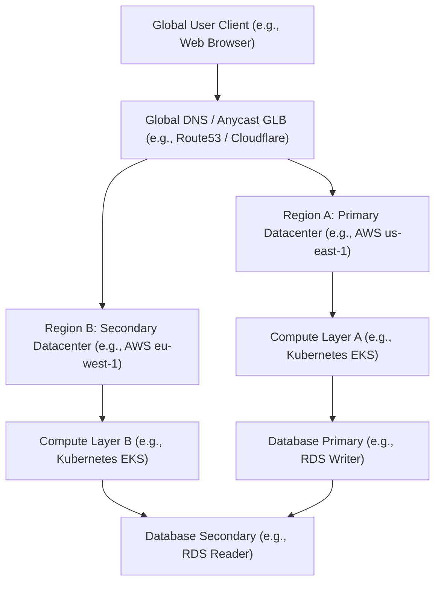

# Highly Available Multi-Region Platform Topologies

Version: 1.0.0

Purpose: Canonical lesson structure for Platform Engineering & AI Infrastructure Curriculum.

Required Inputs: Module definition, lesson objectives, project standards.

Outputs: Standards-compliant lesson markdown.

# Lesson Overview

In the modern enterprise landscape, applications must withstand significant disruptions—including the failure of entire cloud regions—without impacting user experience. This lesson explores the architecture, strategies, and engineering principles required to build Highly Available (HA) Multi-Region Platform Topologies. We will cover the spectrum of multi-region architectures, from Active-Passive disaster recovery to complex Active-Active globally distributed systems, understanding the trade-offs, data replication complexities, and global traffic routing mechanisms that make global availability possible.

---

# Learning Objectives

* Architect and differentiate between Active-Passive, Active-Standby, and Active-Active multi-region topologies.
* Understand and apply the concepts of Recovery Time Objective (RTO) and Recovery Point Objective (RPO) in system design.
* Implement global traffic routing using DNS, Anycast, and Global Load Balancers.
* Evaluate the trade-offs between synchronous and asynchronous data replication across geographic boundaries.
* Design split-brain mitigation and automated failover mechanisms for distributed platforms.

---

# Prerequisites

* **MOD-CLOUD-01 & MOD-CLOUD-03:** Understanding of Cloud VPCs, Subnetting, and Highly Available Architectures within a single region.
* **MOD-K8S-03:** Proficiency in Kubernetes Networking, Services, and Ingress.
* **MOD-NET-03 & MOD-NET-04:** Solid grasp of DNS Architecture and Load Balancing.

---

# Why This Exists

Historically, disaster recovery meant shipping backup tapes to a secondary physical data center and hoping the manual restore process worked if a hurricane hit the primary site. As business operations digitized, downtime transformed from a minor inconvenience into massive financial loss and reputational damage. While cloud providers abstract away hardware failures by distributing resources across Availability Zones (AZs) within a single region, entire regions *do* fail. Routing misconfigurations, fiber cuts, massive power grid failures, and localized natural disasters can take down us-east-1 or eu-west-1 for hours.

To survive catastrophic, region-wide outages, engineers evolved single-region highly available systems into multi-region globally distributed topologies. These architectures ensure that even if a massive localized failure occurs, global user traffic seamlessly routes to healthy regions, providing uninterrupted service. However, this resilience introduces immense complexity in state synchronization, latency, and operational overhead.

---

# Core Concepts

## High Availability (HA) vs. Disaster Recovery (DR)
While often used interchangeably, HA and DR serve different purposes. 
* **High Availability (HA)** focuses on minimizing downtime during normal operations. It relies on redundancy within a region (e.g., across Availability Zones) to ensure that component failures (like a server or switch crashing) do not disrupt service. It is transparent to the end-user.
* **Disaster Recovery (DR)** is a strategy for surviving catastrophic events that wipe out primary infrastructure (e.g., a regional cloud outage or data center fire). It often involves activating secondary infrastructure and may require some downtime or data loss, depending on the strategy. Multi-region architectures bridge the gap, pushing HA to a global scale to serve as an automated DR solution.

## Recovery Time Objective (RTO) and Recovery Point Objective (RPO)
Every multi-region architecture is guided by two critical business metrics:
* **Recovery Time Objective (RTO):** The maximum acceptable duration of downtime. "How long can we afford to be offline?" If RTO is 5 minutes, your failover must be highly automated. If it's 24 hours, manual infrastructure provisioning might be acceptable.
* **Recovery Point Objective (RPO):** The maximum acceptable amount of data loss, measured in time. "How much data can we lose if a disaster strikes right now?" If RPO is zero, every transaction must be synchronously replicated to a backup region before being acknowledged, which drastically impacts latency. If RPO is 15 minutes, asynchronous replication is sufficient.

## Multi-Region Topologies
There are three primary architectural patterns for multi-region deployments:

### 1. Active-Passive (Cold/Warm Standby)
In this model, the primary region handles 100% of the traffic. The secondary region is a backup.
* **Cold Standby:** Infrastructure in the secondary region is defined as code (e.g., Terraform) but not provisioned. Data is backed up periodically. RTO is high (hours to days), but cost is very low.
* **Warm Standby:** Infrastructure is provisioned but scaled down to a minimal footprint. The database continuously replicates asynchronously. Upon failure, the secondary region is scaled up to handle full traffic. Medium RTO (minutes to hours), moderate cost.
* **Hot Standby (Active-Passive):** The secondary region runs a fully scaled replica of the primary region, constantly receiving asynchronous data updates. It handles zero traffic until failover. Very low RTO, but you are paying double for infrastructure that sits idle.

### 2. Active-Active
Both regions are fully provisioned and simultaneously serve live user traffic. If one region fails, traffic is seamlessly routed to the surviving region.
* **Pros:** Zero RTO. Maximizes infrastructure utilization (no idle resources). Can route users to the geographically closest region, reducing latency.
* **Cons:** Extremely complex. Requires conflict resolution in databases, strict state management, and handling split-brain scenarios.

## Global Traffic Management
To distribute users across regions, global routing mechanisms are required.
* **DNS-based Routing:** Using intelligent DNS (like AWS Route53 or Cloudflare) to return IP addresses based on user geography, latency, or the health of the regional endpoints. Note that DNS has a Time-To-Live (TTL), meaning failovers can take minutes as DNS caches expire.
* **Anycast IP:** A single IP address is advertised from multiple geographic locations using BGP (Border Gateway Protocol). The internet's routing infrastructure automatically sends the user's packet to the closest physical location.
* **Global Load Balancing (GLB):** A managed service (e.g., Google Cloud Global HTTP(S) Load Balancer, AWS Global Accelerator) that acts as a unified frontend. It provides a single Anycast IP and internally proxies traffic to the nearest healthy region over the cloud provider's private backbone, bypassing public internet congestion.

## Data Replication: Synchronous vs. Asynchronous
Data gravity is the hardest part of multi-region architectures.
* **Synchronous Replication:** The primary database writes data locally, sends it to the secondary region, waits for the secondary region to acknowledge the write, and *then* acknowledges the client. Ensures RPO = 0. However, the speed of light dictates that cross-region latency (e.g., NY to London takes ~70ms) is added to *every* transaction. This is rarely viable across long distances.
* **Asynchronous Replication:** The primary database writes data locally, acknowledges the client immediately, and streams the update to the secondary region in the background. Low latency for users, but if the primary region dies before the replication completes, data is lost (RPO > 0).

---

# Architecture



---

# Real-World Example

**Netflix Global Architecture:** Netflix runs across multiple AWS regions (us-east-1, us-west-2, eu-west-1). They employ an Active-Active model. When a user logs in from New York, intelligent DNS routes them to us-east-1. If us-east-1 experiences a catastrophic failure, Netflix can execute a "regional evacuation." Using automated scripts, they update DNS routing policies to stop sending traffic to us-east-1 and redirect those users to us-west-2. Because user preferences and watch history are replicated globally via Cassandra (a distributed NoSQL database), the user simply experiences a minor buffering event, oblivious to the fact that an entire data center just went offline.

---

# Hands-on Demonstration

Let's look at how we can implement a multi-region failover strategy using Terraform to configure AWS Route 53 with Health Checks.

**Scenario:** We have a primary application in `us-east-1` and a hot standby in `us-west-2`. We want DNS to automatically failover if the primary goes down.

**Input Code (Terraform):**

```hcl
# Create a Health Check for the Primary Region
resource "aws_route53_health_check" "primary" {
  fqdn              = "primary.us-east.myapp.internal"
  port              = 443
  type              = "HTTPS"
  resource_path     = "/healthz"
  failure_threshold = 3
  request_interval  = 10
}

# Primary Record - Active
resource "aws_route53_record" "www-primary" {
  zone_id = aws_route53_zone.main.zone_id
  name    = "www.myapp.com"
  type    = "CNAME"
  ttl     = "60"

  failover_routing_policy {
    type = "PRIMARY"
  }

  set_identifier  = "primary-us-east-1"
  health_check_id = aws_route53_health_check.primary.id
  records         = ["alb-us-east.myapp.internal"]
}

# Secondary Record - Passive
resource "aws_route53_record" "www-secondary" {
  zone_id = aws_route53_zone.main.zone_id
  name    = "www.myapp.com"
  type    = "CNAME"
  ttl     = "60"

  failover_routing_policy {
    type = "SECONDARY"
  }

  set_identifier = "secondary-us-west-2"
  records        = ["alb-us-west.myapp.internal"]
}
```

**Expected Behavior:**
1. Under normal conditions, Route 53 resolves `www.myapp.com` to the primary ALB.
2. Route 53 constantly probes the `/healthz` endpoint of the primary region.
3. If the health check fails 3 consecutive times, Route 53 stops serving the primary record.
4. Subsequent DNS queries will return the secondary region's ALB, transparently shifting traffic to the standby region.

---

# Hands-on Lab

* **Objective:** Configure a simulated Multi-Region Active-Active traffic split using Nginx and local DNS manipulation.
* **Estimated Time:** 30 minutes
* **Difficulty:** Intermediate
* **Environment:** A Linux terminal with Docker and `curl` installed.

## Step-by-step Instructions

1. **Simulate Regional Applications:**
   We will launch two Nginx containers, simulating two different regions, returning different responses to prove routing.
   ```bash
   echo "<h1>Welcome from US-EAST Region!</h1>" > us-index.html
   echo "<h1>Welcome from EU-WEST Region!</h1>" > eu-index.html

   docker run -d -p 8081:80 --name app-us-east -v $(pwd)/us-index.html:/usr/share/nginx/html/index.html nginx
   docker run -d -p 8082:80 --name app-eu-west -v $(pwd)/eu-index.html:/usr/share/nginx/html/index.html nginx
   ```

2. **Simulate a Global Load Balancer:**
   We will configure an Nginx reverse proxy to act as our "Global Load Balancer" that load balances across the two regions.
   ```bash
   cat << 'EOF' > glb.conf
   events {}
   http {
       upstream global_backend {
           server host.docker.internal:8081; # US-EAST
           server host.docker.internal:8082; # EU-WEST
       }

       server {
           listen 80;
           location / {
               proxy_pass http://global_backend;
               proxy_set_header Host $host;
               proxy_next_upstream error timeout http_500 http_502 http_503 http_504;
           }
       }
   }
   EOF

   docker run -d -p 8080:80 --name glb --add-host host.docker.internal:host-gateway -v $(pwd)/glb.conf:/etc/nginx/nginx.conf nginx
   ```

## Verification

Test the setup by curling the Global Load Balancer multiple times:

```bash
curl http://localhost:8080
curl http://localhost:8080
```
You should see the output alternating between `US-EAST` and `EU-WEST`, simulating an Active-Active global distribution.

## Troubleshooting

* If Nginx fails to start, ensure ports 8080, 8081, and 8082 are not in use.
* If you receive a `502 Bad Gateway`, verify that `host.docker.internal` is resolving correctly on your OS (Linux users might need `--add-host host.docker.internal:host-gateway` which is included in the command).

## Cleanup

```bash
docker rm -f app-us-east app-eu-west glb
rm us-index.html eu-index.html glb.conf
```

---

# Production Notes

* **Data Gravity is the Anchor:** Compute is stateless and easy to distribute. State is heavy and bound by the speed of light. Designing multi-region systems should always start with the database architecture. Choose databases built for multi-region natively (e.g., CockroachDB, Cassandra, Spanner).
* **DNS TTLs are Dangerous:** Depending on DNS for failover is risky because ISPs and client browsers aggressively cache DNS records, ignoring your short TTLs. A 60-second TTL failover on your side might take 15 minutes to propagate to a mobile user. Using Anycast GLBs circumvents this.
* **The "Thundering Herd" Problem:** When failing over from Region A to Region B, Region B instantly takes 200% of its normal traffic. If Region B's autoscaling is not proactive, the surge will crash Region B as well, leading to a cascading global outage. Ensure standby regions have sufficient baseline capacity to absorb initial spikes.

---

# Common Mistakes

* **Overestimating Synchronous Replication:** Engineers often mandate synchronous replication for Active-Active systems without calculating latency. A 100ms cross-region latency multiplied by 10 database queries per web request results in an unusable 1-second delay for the user.
* **Failing to Test Failovers:** An untested disaster recovery plan is merely a prayer. If you do not actively practice regional failovers (Game Days), the scripts and procedures will rot, and they will fail when a real disaster occurs.
* **Shared Dependencies:** Designing a multi-region architecture but relying on a single, global Identity Provider (IdP) or global DNS control plane. If the global dependency goes down, both of your isolated regions go down with it. Total regional autonomy is critical.

---

# Failure-Driven Learning

**Scenario: The Split-Brain Dilemma**
Imagine a network partition severs the connection between Region A and Region B, but both regions remain connected to the internet. 

1. **The Failure:** In an Active-Active setup with a multi-region database, Region A and Region B can no longer communicate to synchronize state. 
2. **The Symptom:** Users routed to Region A update their profile. Users in Region B see old data. Both databases accept writes independently, creating conflicting state (e.g., a user's bank balance is deducted in Region A, but remains full in Region B).
3. **Diagnosis:** Monitoring tools show high cross-region packet loss and database replication lag spiking to infinity.
4. **Resolution:** Distributed systems use a concept called "Quorum" (e.g., Raft or Paxos consensus protocols). A system needs a majority of nodes (typically an odd number, like 3 regions) to elect a leader and accept writes. If a network partition occurs, the side of the partition with the minority of nodes will freeze and reject writes, preventing split-brain corruption. If you only have two regions, you must configure a "tie-breaker" node in a third region, or manually designate one region to go into read-only mode.

---

# Engineering Decisions

**The Dilemma: Active-Active vs. Active-Passive**

When tasked with designing a highly available platform, the instinct is to immediately demand an Active-Active multi-region architecture for "zero downtime."

**Active-Passive (The Pragmatic Choice):**
For 95% of businesses, Active-Passive is the correct choice. It is significantly cheaper, vastly less complex, and far easier to reason about. An RTO of 15 minutes and an RPO of 5 minutes is entirely acceptable for most B2B SaaS platforms. The engineering effort saved can be spent on shipping features.

**Active-Active (The Extreme Choice):**
Active-Active is reserved for systems where millions of dollars are lost per minute of downtime (e.g., global payment gateways, massive consumer platforms like Netflix/Uber). The engineering overhead required to manage multi-master database conflicts, complex global routing, and asynchronous state reconciliation requires dedicated, specialized teams. Never choose Active-Active unless the business explicitly justifies the immense cost and complexity.

---

# Best Practices

* **Cell-Based Architecture:** Divide regions into isolated "cells." A failure in one cell should have zero blast radius on other cells.
* **Stateless Compute:** Keep your application tier 100% stateless. State should live exclusively in managed data stores designed for replication.
* **Automated Game Days:** Schedule regular, automated tests that intentionally black-hole traffic to a region in production to verify failover mechanics work flawlessly.
* **Asynchronous by Default:** Rely on asynchronous replication for multi-region data transfer. Use event-driven architectures (like Kafka) to handle eventual consistency rather than forcing synchronous locking.

---

# Troubleshooting Guide

## Issue 1: High Latency in Multi-Region Database Writes

* **Cause:** The database is configured for synchronous cross-region replication, and the speed of light over fiber optic cables is adding 50-100ms per transaction.
* **Diagnosis:** Analyze distributed traces (e.g., Jaeger/Datadog) and database slow query logs. The time spent waiting for `COMMIT` will dominate the trace. Network latency between regions will show high ping times.
* **Solution:** Convert the database replication to asynchronous mode. If RPO=0 is strictly required, move the application compute closer to the primary database writer, or migrate to a globally distributed database like Google Cloud Spanner that optimizes these consensus protocols.

## Issue 2: Failover Initiated, but Secondary Region Crashed

* **Cause:** Cascading failure due to the "Thundering Herd." The secondary region did not have enough capacity to handle the sudden 2x influx of traffic.
* **Diagnosis:** Metrics show CPU/Memory on the secondary cluster spiking to 100% immediately following the DNS routing switch, followed by HTTP 503 errors and container OOMKills.
* **Solution:** Maintain a higher baseline capacity in standby regions. Implement aggressive rate limiting and load shedding at the API gateway during failover events to drop low-priority traffic while the secondary autoscaling groups catch up.

---

# Summary

Building multi-region architectures is the pinnacle of high availability engineering. It involves shifting from managing localized hardware failures to orchestrating globally distributed traffic and state. While tools like Global Load Balancers and DNS routing make directing traffic easier, the true engineering challenge lies in managing data gravity, replication latency, and split-brain scenarios. Platform engineers must carefully balance business requirements (RTO/RPO) against the immense complexity and cost of Active-Active systems, often finding that a well-architected Active-Passive setup is the most pragmatic solution.

---

# Cheat Sheet

**Route 53 DNS Failover Types:**
* **Simple Routing:** Standard DNS resolution. No health checks.
* **Failover Routing:** Active-Passive. Routes to primary unless health check fails.
* **Geolocation Routing:** Routes traffic based on user location (e.g., EU users to EU region).
* **Latency Routing:** Routes to the region with the lowest network latency for the user.
* **Weighted Routing:** Distributes traffic across regions based on assigned weights. Ideal for canary testing a new region.

**Data Replication Types:**
* **Synchronous:** Wait for remote ack. RPO=0. High Latency.
* **Asynchronous:** Fire and forget. RPO>0. Low Latency.

---

# Knowledge Check

## Multiple Choice Questions

1. Which architecture is best suited for a system that requires absolutely zero data loss (RPO = 0) during a regional failure?
   * A) Active-Active with Asynchronous Replication
   * B) Active-Passive with Synchronous Replication
   * C) Active-Passive with Cold Standby Backups
   * D) Active-Active with DNS Geolocation Routing

2. What is the primary disadvantage of relying solely on DNS for regional failover?
   * A) DNS does not support health checks.
   * B) DNS cannot route based on geolocation.
   * C) DNS caching by ISPs and clients can delay failover for minutes or hours.
   * D) DNS is incompatible with Active-Active setups.

## Scenario Questions

You are designing a global e-commerce platform. Users in Europe complain that the website is slow, taking 2 seconds to load. You discover your application and database are hosted solely in `us-east-1`. You have budget to expand to `eu-central-1`. How do you design the multi-region topology to solve the latency issue without introducing massive database conflict complexity?

## Short Answer Questions

What is the "Thundering Herd" problem in the context of regional failovers, and how can it be mitigated?

<details>
<summary><b>View Answers</b></summary>

### Multiple Choice
1. **[B] Active-Passive with Synchronous Replication** - *Synchronous replication is the only way to guarantee zero data loss (RPO=0) because a transaction is not acknowledged to the client until it is safely written in the secondary region.*
2. **[C] DNS caching by ISPs and clients can delay failover for minutes or hours.** - *Despite setting low TTLs, downstream networks often cache DNS records to save bandwidth, meaning your failover command might be ignored by client devices for a significant period.*

### Scenario
*The most pragmatic approach is to deploy an Active-Active compute layer but an Active-Passive data layer. Deploy application clusters in both `us-east-1` and `eu-central-1`. Use a Global Load Balancer or Latency-based DNS to route EU users to the `eu-central-1` compute cluster. For the database, maintain the primary writer in `us-east-1` and deploy a Read Replica in `eu-central-1`. European users will have ultra-low latency for reads (viewing products). Writes (checkout) will still incur cross-region latency back to `us-east-1`, but writes are far less frequent than reads, optimizing the overall user experience without requiring a complex multi-master database setup.*

### Short Answer
*The "Thundering Herd" problem occurs when a primary region fails, and 100% of its traffic is instantly redirected to a secondary region. If the secondary region's autoscaling is not fast enough to handle the sudden 2x spike, the secondary region will also crash, causing a global outage. Mitigation involves maintaining excess baseline capacity (headroom) in all regions, implementing rate limiting, or intentionally degrading non-critical features during a failover to save compute resources.*

</details>

---

# Interview Preparation

## Beginner Questions

* What is the difference between RTO and RPO?
* Why can't we just put a Load Balancer in front of two different cloud regions?

## Intermediate Questions

* Explain the difference between Synchronous and Asynchronous database replication. What are the trade-offs?
* How does Anycast routing differ from DNS-based routing for multi-region traffic?

## Advanced Questions

* In a multi-region Active-Active setup, how do you handle split-brain scenarios during a network partition?
* How would you architect a zero-downtime, zero-data-loss database migration across geographical regions?

## Scenario-Based Discussions

* Your company wants to move from a single region to an Active-Active multi-region architecture because they had a 30-minute outage last year. They want 100% uptime. How do you approach this conversation as a Lead Platform Engineer?

<details>
<summary><b>View Answers</b></summary>

### Beginner
* **What is the difference between RTO and RPO?:** RTO (Recovery Time Objective) is the maximum acceptable downtime (how long to recover). RPO (Recovery Point Objective) is the maximum acceptable data loss (how far back in time data is lost).
* **Why can't we just put a Load Balancer in front of two different cloud regions?:** Standard load balancers (like AWS ALBs) are region-specific entities. To balance across regions, you need global constructs like DNS routing policies (Route 53) or specialized Global Load Balancers (AWS Global Accelerator, GCP HTTP(S) Load Balancer) operating at the edge network.

### Intermediate
* **Explain the difference between Synchronous and Asynchronous database replication. What are the trade-offs?:** Synchronous replication guarantees zero data loss (RPO=0) by writing to both regions before acknowledging the client, but it introduces severe cross-region latency. Asynchronous replication is fast and low-latency, but if the primary dies before replication completes, data is permanently lost (RPO > 0).
* **How does Anycast routing differ from DNS-based routing for multi-region traffic?:** DNS routing resolves a domain to different IP addresses based on logic (latency, health), but suffers from caching issues. Anycast routing exposes a single, static IP address globally via BGP; the network routers automatically direct packets to the physically closest region, providing instantaneous failover without caching dependencies.

### Advanced
* **In a multi-region Active-Active setup, how do you handle split-brain scenarios during a network partition?:** You implement a quorum-based consensus system (e.g., Raft/Paxos). This requires at least three independent nodes or regions. If a network partition occurs, the isolated region (minority) loses quorum and automatically enters a read-only or offline state, while the connected regions (majority) continue processing writes, preventing conflicting data state.
* **How would you architect a zero-downtime, zero-data-loss database migration across geographical regions?:** 1. Setup an asynchronous read replica in the new region. 2. Allow replication to catch up fully. 3. Stop all writes at the application layer (brief pause). 4. Ensure the final transactions replicate (sync). 5. Promote the read replica to the new primary. 6. Reconfigure applications to write to the new primary. 7. Resume application writes. This is technically a brief write-pause, not strictly "zero downtime," but achieves zero data loss safely.

### Scenario-Based Discussions
* **Your company wants to move from a single region to an Active-Active...:** I would challenge the business requirement. I would explain that moving to Active-Active will likely double infrastructure costs and quadruple engineering complexity (distributed tracing, data conflict resolution, split-brain mitigation). I would present the cost of a 30-minute outage versus the millions required to build and maintain an Active-Active platform. I would strongly advocate for a much simpler Active-Passive (Warm Standby) architecture as a pragmatic compromise, achieving a fast recovery (e.g., 15 min RTO) without the crippling complexity of Active-Active.

</details>

---

# Further Reading

1. [AWS Architecture Center: Multi-Region Topologies](https://aws.amazon.com/architecture/)
2. [Google Cloud: Disaster Recovery Planning](https://cloud.google.com/architecture/disaster-recovery)
3. [Netflix TechBlog: Active-Active for Multi-Regional Resiliency](https://netflixtechblog.com/)
4. [Designing Data-Intensive Applications by Martin Kleppmann](https://dataintensive.net/)
5. [Cloudflare: What is Anycast?](https://www.cloudflare.com/learning/network-layer/what-is-anycast/)
