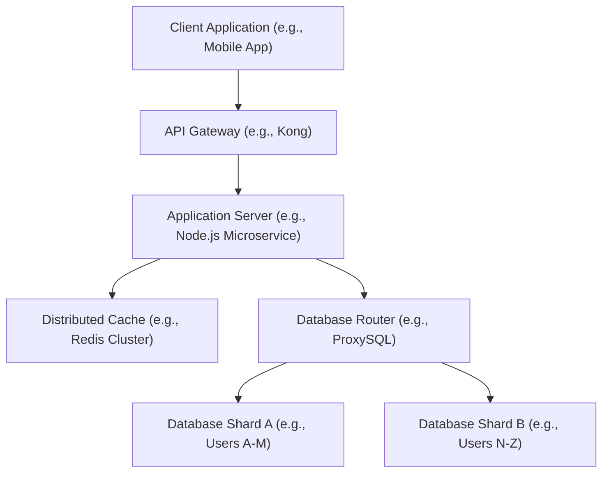

# Distributed Caching, Sharding & High-Throughput Architectures

Version: 1.0.0

Purpose: Canonical lesson structure for Platform Engineering & AI Infrastructure Curriculum.

Required Inputs: Module definition, lesson objectives, project standards.

Outputs: Standards-compliant lesson markdown.

# Lesson Overview

As platforms scale to serve millions of users, traditional relational databases quickly become the primary bottleneck. This lesson delves into the critical patterns required to build high-throughput distributed architectures. We will explore how to dramatically reduce database load through advanced distributed caching strategies and how to horizontally scale stateful data using database sharding and partitioning techniques.

---

# Learning Objectives

* Architect and differentiate between multi-tier caching strategies (Read-Through, Write-Through, Write-Behind).
* Implement consistent hashing and database sharding strategies to horizontally scale stateful data.
* Design high-throughput systems capable of mitigating "Cache Stampedes" and "Thundering Herd" scenarios.
* Evaluate the trade-offs of different cache eviction policies (LRU, LFU, TTL).
* Understand the architectural complexities of fan-out operations in social-graph style applications.

---

# Prerequisites

* **MOD-K8S-04:** Understanding of StatefulSets and Persistent Volumes.
* **MOD-ADV-01:** Familiarity with high availability and multi-region replication.
* Basic understanding of relational database indexes and query performance.

---

# Why This Exists

In the early days of the web, scaling an application meant buying a larger database server—a strategy known as "vertical scaling" or "scaling up." Eventually, you hit a physical limit; you simply cannot buy a server with enough RAM or CPU to handle the transactional load of platforms like Amazon, Twitter, or global AI inference queues.

To overcome this, engineers had to figure out how to "scale out" (horizontally scale) the database layer. This led to the birth of two fundamental concepts: **Caching** (storing frequently accessed data in memory to prevent hitting the disk-backed database at all) and **Sharding** (splitting the database itself across multiple physical machines). These patterns form the backbone of modern high-throughput internet architecture.

---

# Core Concepts

## 1. Distributed Caching Strategies

A cache is a high-speed data storage layer (usually RAM, like Redis or Memcached) that stores a subset of data so that future requests for that data are served faster than accessing the primary storage location.

* **Cache-Aside (Lazy Loading):** The application first checks the cache. If data is found (Cache Hit), it returns it. If not (Cache Miss), the application queries the database, writes the result to the cache, and then returns it. *Best for read-heavy, unpredictable workloads.*
* **Write-Through:** The application writes data directly to the cache. The cache immediately, synchronously writes the data to the database before acknowledging the application. *Ensures data consistency but adds latency to write operations.*
* **Write-Behind (Write-Back):** The application writes data to the cache and immediately receives an acknowledgment. The cache asynchronously writes to the database in the background. *Extremely fast writes, but high risk of data loss if the cache node crashes before syncing to the database.*

## 2. Cache Eviction and TTLs

Memory is expensive. You cannot cache everything. Caches must be managed using:
* **TTL (Time to Live):** A set expiration time for a key (e.g., expire in 60 seconds). Once expired, the next request will be a cache miss.
* **LRU (Least Recently Used):** When the cache is full, the system evicts the data that hasn't been accessed for the longest time.
* **LFU (Least Frequently Used):** Evicts data that is requested the least often.

## 3. Database Sharding (Partitioning)

When a single database is too large to fit on one disk or too busy to handle all writes, you must split it.
* **Vertical Partitioning:** Splitting a database by columns or tables. E.g., placing the `Users` table on Database A and the `Orders` table on Database B.
* **Horizontal Partitioning (Sharding):** Splitting a single table across multiple databases. E.g., Users A-M live on Database 1, Users N-Z live on Database 2.

## 4. Consistent Hashing

A naive sharding approach uses modulo arithmetic (e.g., `user_id % number_of_servers`). If you have 3 servers and add a 4th, the modulo changes for almost every user, requiring massive data migration.
* **Consistent Hashing** maps both servers and data to a conceptual "ring" (0 to 360 degrees). When a server is added or removed, only the data mapped immediately adjacent to that server is remapped. This drastically minimizes data movement during scaling events.

---

# Architecture



---

# Real-World Example

**Twitter's Timeline Generation:**
When a celebrity with 50 million followers tweets, if Twitter queried the database for everyone's timeline simultaneously, the database would melt. 
* **Fan-out on Write:** For average users, when they tweet, the backend immediately computes the new timeline for all of their followers and pushes the tweet into their followers' Redis caches (pre-computing the timeline).
* **Fan-out on Read:** For "celebrities," fanning out 50 million writes in real-time is too expensive. Instead, celebrities' tweets are not pre-computed into timelines. When a user loads their timeline, the system checks if they follow any celebrities, fetches the celebrities' latest tweets directly from a specialized cache, and merges them into the user's timeline on the fly.

---

# Hands-on Demonstration

Let's look at how to implement consistent hashing conceptually in Python to determine which Shard a specific user belongs to.

**Input Code (Python Pseudocode):**

```python
import hashlib

class ConsistentHashingRing:
    def __init__(self):
        self.ring = {}
        self.sorted_keys = []

    def add_node(self, node_name):
        # Hash the server name to find its position on the ring
        hash_val = int(hashlib.md5(node_name.encode()).hexdigest(), 16)
        self.ring[hash_val] = node_name
        self.sorted_keys.append(hash_val)
        self.sorted_keys.sort()
        print(f"Added Server: {node_name} at hash {hash_val}")

    def get_node(self, key):
        if not self.ring:
            return None
        # Hash the user's key to find its position on the ring
        hash_val = int(hashlib.md5(key.encode()).hexdigest(), 16)
        
        # Find the first server clockwise on the ring
        for server_hash in self.sorted_keys:
            if hash_val <= server_hash:
                return self.ring[server_hash]
        
        # Wrap around to the first server
        return self.ring[self.sorted_keys[0]]

# Simulation
ring = ConsistentHashingRing()
ring.add_node("DB_Shard_A")
ring.add_node("DB_Shard_B")
ring.add_node("DB_Shard_C")

user = "user_42_profile"
assigned_shard = ring.get_node(user)
print(f"User '{user}' is assigned to {assigned_shard}")
```

**Expected Output:**
```
Added Server: DB_Shard_A at hash 13019183427191...
Added Server: DB_Shard_B at hash 39182390128312...
Added Server: DB_Shard_C at hash 81293812931238...
User 'user_42_profile' is assigned to DB_Shard_B
```

**Explanation:** Even if we add `DB_Shard_D`, `user_42_profile` will likely stay on `DB_Shard_B` unless `DB_Shard_D`'s hash falls exactly between the user's hash and `DB_Shard_B`, demonstrating the stability of consistent hashing.

---

# Hands-on Lab

* **Objective:** Implement and verify a Redis Cache-Aside pattern using Docker.
* **Estimated Time:** 20 minutes
* **Difficulty:** Beginner
* **Environment:** Linux terminal with Docker and `python3` installed.

## Step-by-step Instructions

1. **Start a Redis Container:**
   ```bash
   docker run -d --name my-redis -p 6379:6379 redis
   ```

2. **Create a Python App (`app.py`):**
   Install the redis library: `pip install redis`. Create the following script:
   ```python
   import redis
   import time

   r = redis.Redis(host='localhost', port=6379, decode_responses=True)

   def get_user_profile(user_id):
       # 1. Check Cache
       cached_data = r.get(f"user:{user_id}")
       if cached_data:
           print("✅ CACHE HIT: Returning fast data")
           return cached_data
       
       # 2. Cache Miss: Simulate slow DB query
       print("❌ CACHE MISS: Querying slow database...")
       time.sleep(2) # Fake database latency
       db_data = f"Profile Data for {user_id}"
       
       # 3. Write to Cache with a 10 second TTL
       r.setex(f"user:{user_id}", 10, db_data)
       return db_data

   if __name__ == "__main__":
       print("First Call:")
       get_user_profile("123")
       
       print("\nSecond Call (Immediate):")
       get_user_profile("123")
       
       print("\nWaiting 11 seconds for TTL to expire...")
       time.sleep(11)
       
       print("\nThird Call:")
       get_user_profile("123")
   ```

3. **Run the Application:**
   ```bash
   python3 app.py
   ```

## Verification
You should observe a simulated 2-second delay on the first call (Cache Miss), an instant response on the second call (Cache Hit), and another 2-second delay on the third call because the TTL expired, evicting the data from Redis.

## Cleanup
```bash
docker rm -f my-redis
rm app.py
```

---

# Production Notes

* **Hot Keys:** If a specific cached item (like a viral tweet) receives massive traffic, it will overwhelm the single Redis node holding that key. This is a "hot key" problem. Mitigation involves randomizing the key slightly to distribute it across multiple cache nodes or caching it in local memory on the application servers.
* **Sharding is a One-Way Street:** Once you shard a relational database, you lose the ability to perform cross-shard JOINs efficiently. You must denormalize data or perform JOINs at the application layer. Never shard until you absolutely have to.
* **Redis is Single-Threaded:** A single Redis instance processes commands on a single thread. Complex operations (like `KEYS *`) will block the entire server, causing massive latency spikes for all other queries.

---

# Common Mistakes

* **Caching Everything:** Caching data that is rarely read wastes expensive RAM and adds unnecessary code complexity. Only cache data that is read frequently and is expensive to compute or fetch.
* **No TTLs:** Storing data in a cache without an expiration time guarantees that your cache will eventually fill up with stale, useless data, triggering massive eviction sweeps that degrade performance.
* **Ignoring Cache Stampedes:** Assuming a cache miss is a harmless event. If a highly trafficked key expires, thousands of concurrent requests will experience a cache miss simultaneously and all query the database at the exact same millisecond, instantly crashing the database.

---

# Failure-Driven Learning

**Scenario: The Cache Stampede (Thundering Herd)**

1. **The Failure:** The cache for the homepage's "Top 10 Products" (which gets 50,000 requests per second) has a TTL of 5 minutes. At exactly 12:05 PM, the TTL expires.
2. **The Symptom:** Between 12:05:00 and 12:05:01, 50,000 concurrent requests hit the API. They all check the cache. It's empty. All 50,000 requests instantly query the primary PostgreSQL database to compute the Top 10 Products. 
3. **Diagnosis:** The database CPU spikes to 100%, max connections are exhausted, and the database crashes. The site goes down entirely.
4. **Resolution:** Implement a **Mutex Lock (Distributed Lock)** or **Probabilistic Early Expiration**. When a cache miss occurs, the first thread acquires a lock in Redis. All other threads waiting for that key are forced to sleep for 50ms and try again, rather than hitting the DB. The first thread queries the DB, populates the cache, releases the lock, and the sleeping threads wake up to a Cache Hit.

---

# Engineering Decisions

**The Dilemma: Scaling Up vs. Sharding**

**Scaling Up (Vertical Scaling):**
* **Pros:** Zero code changes. Maintains ACID compliance. Full JOIN capabilities.
* **Cons:** Expensive. Hard physical limits. 

**Sharding (Horizontal Scaling):**
* **Pros:** Virtually infinite scalability. Cheaper commodity hardware.
* **Cons:** Massive application complexity. Loss of global secondary indexes and complex JOINs. Data migration nightmares.

**Decision Matrix:** Always push vertical scaling to its absolute financial limit before adopting sharding. Implement aggressive caching, read replicas, and materialized views first. Sharding should be the absolute last resort for data scaling. If you must shard, use modern NewSQL databases like CockroachDB or TiDB that abstract the sharding complexity away from the application.

---

# Best Practices

* **Always set a TTL:** Even if it's 30 days. It prevents memory leaks in your caching layer.
* **Jitter your TTLs:** Do not set thousands of keys to expire at exactly the same time (e.g., exactly midnight). Add a random "jitter" (+/- 10%) to TTLs to smear the cache misses over a wider time window.
* **Monitor Cache Hit Ratios:** A cache with a hit ratio below 70% is likely misconfigured or caching the wrong data, serving only as a latency bump on the way to the database.

---

# Troubleshooting Guide

## Issue 1: Database CPU Spikes Every 10 Minutes

* **Cause:** A highly trafficked cache key has a 10-minute TTL. Every 10 minutes, a cache stampede occurs.
* **Diagnosis:** Align the database CPU spikes with the Redis cache miss metrics and `EXPIRE` event logs.
* **Solution:** Implement a mutex lock on cache misses, or use a background cron job to proactively refresh the cache key *before* the TTL expires (Cache Warming).

## Issue 2: Cross-Shard Queries are Timing Out

* **Cause:** The application is attempting to perform a JOIN operation across data that lives on two different physical shards. The database router is pulling all data from both shards into memory to perform the join manually.
* **Diagnosis:** Slow query logs will show massive data transfers.
* **Solution:** Redesign the data model. Duplicate (denormalize) the necessary data into both shards so the JOIN can be executed locally on a single shard, or perform the aggregation in the application code asynchronously.

---

# Summary

High-throughput distributed architectures rely heavily on shielding the persistence layer from direct traffic. Caching acts as a high-speed buffer, drastically reducing latency and database load. When the database itself must grow beyond a single machine, sharding distributes the state horizontally. However, these patterns introduce immense complexity—cache stampedes, stale data, and cross-shard querying challenges. Platform engineers must master consistent hashing, eviction policies, and TTL jitter to build systems capable of surviving viral traffic events.

---

# Cheat Sheet

**Cache Eviction Policies:**
* **LRU:** Least Recently Used. Best for general use.
* **LFU:** Least Frequently Used.
* **FIFO:** First In, First Out.

**Caching Patterns:**
* **Cache-Aside:** App manages cache and DB separately.
* **Write-Through:** Cache writes to DB synchronously.
* **Write-Behind:** Cache writes to DB asynchronously.

---

# Knowledge Check

## Multiple Choice Questions

1. What is the primary purpose of Consistent Hashing in a sharded database architecture?
   * A) To encrypt data across multiple servers.
   * B) To ensure every query is served from the cache.
   * C) To minimize data migration when adding or removing database nodes.
   * D) To force synchronous replication across regions.

2. Which cache eviction policy removes the data that has not been accessed for the longest period of time?
   * A) LFU
   * B) LRU
   * C) TTL
   * D) Write-Behind

## Scenario Questions

Your analytics dashboard executes an extremely complex SQL query that takes 15 seconds to run. The data only needs to be updated once an hour. Traffic to the dashboard is increasing, and it is locking up the database. How would you architect a caching solution for this?

## Short Answer Questions

What is "TTL Jitter" and why is it important in a distributed cache?

<details>
<summary><b>View Answers</b></summary>

### Multiple Choice
1. **[C] To minimize data migration when adding or removing database nodes.** - *Unlike simple modulo hashing, consistent hashing maps data and servers to a ring, meaning only a fraction of keys need to be moved when the server topology changes.*
2. **[B] LRU** - *Least Recently Used tracks the time of last access and evicts the oldest accessed items first.*

### Scenario
*Use a background process (cron job or worker) to execute the 15-second query once an hour. The worker writes the result directly to a Redis cache (Cache Warming). The API serving the dashboard should *only* read from the cache and never query the database directly. This guarantees sub-millisecond response times for users and completely removes the load from the database, regardless of how many users view the dashboard.*

### Short Answer
*TTL Jitter is the practice of adding a small amount of random time (e.g., +/- 5%) to a cache key's Time To Live. This prevents a scenario where thousands of keys, created simultaneously with the exact same TTL, expire at the exact same millisecond, which would cause a massive, synchronized wave of database queries (a thundering herd).*

</details>

---

# Interview Preparation

## Beginner Questions

* What is a cache miss?
* Why is RAM used for caching instead of Hard Drives?

## Intermediate Questions

* Explain the difference between Cache-Aside and Write-Through caching.
* What is Database Sharding and when should you use it?

## Advanced Questions

* Explain the concept of Consistent Hashing and how it solves the scaling problems of modulo-based sharding.
* How do you resolve a "Hot Key" issue in a Redis cluster where a single cached item is receiving millions of requests per second?

## Scenario-Based Discussions

* You are designing the architecture for a new social media platform where users can post messages and view a feed of messages from people they follow. How do you design the feed generation architecture to handle a user with 10 followers versus a celebrity with 10 million followers?

<details>
<summary><b>View Answers</b></summary>

### Beginner
* **What is a cache miss?:** A cache miss occurs when an application queries the cache for specific data, but the data is not there (either because it was never cached, or the TTL expired).
* **Why is RAM used for caching instead of Hard Drives?:** RAM offers sub-millisecond read/write speeds, which is orders of magnitude faster than SSDs or traditional hard drives, allowing it to handle massive concurrent throughput.

### Intermediate
* **Explain the difference between Cache-Aside and Write-Through caching.:** In Cache-Aside, the application is responsible for querying the DB on a miss and updating the cache. In Write-Through, the application writes only to the cache layer, which synchronously handles writing to the DB under the hood.
* **What is Database Sharding and when should you use it?:** Sharding is horizontal partitioning of a single database table across multiple independent servers. It should only be used as a last resort when vertical scaling (buying a bigger server) is no longer financially or physically possible.

### Advanced
* **Explain the concept of Consistent Hashing...:** Modulo sharding (`id % N servers`) requires remapping almost all data if `N` changes. Consistent hashing places both data keys and servers on a circular hash ring. When a server is added or removed, only the keys immediately adjacent to it on the ring are remapped, minimizing data migration overhead during scaling.
* **How do you resolve a "Hot Key" issue...:** A hot key overwhelms a single Redis node. Mitigation strategies include: 1) Client-side caching (storing the value in the application server's local RAM). 2) Key duplication (storing the same data in Redis under multiple keys like `key:1`, `key:2` and randomly routing requests to them to spread the load across the cluster).

### Scenario-Based Discussions
* **You are designing the architecture for a new social media platform...:** I would use a hybrid Fan-Out approach. For normal users (10 followers), I use "Fan-Out on Write": when they post, a background worker pushes the post directly into the pre-computed timeline cache of their 10 followers. For celebrities (10 million followers), fanning out 10 million writes is too expensive. I use "Fan-Out on Read": their posts are not pushed to follower timelines. When a user loads their timeline, the system dynamically merges their pre-computed feed with the latest posts from any celebrities they follow on the fly.

</details>

---

# Further Reading

1. [Redis Official Documentation on Caching](https://redis.io/docs/)
2. [Discord's Architecture: How We Store Billions of Messages](https://discord.com/blog/how-discord-stores-billions-of-messages)
3. [AWS: Database Sharding Strategies](https://aws.amazon.com/blogs/database/sharding-with-amazon-relational-database-service/)
4. [High Scalability Blog](http://highscalability.com/)
5. [Consistent Hashing Explained](https://en.wikipedia.org/wiki/Consistent_hashing)
