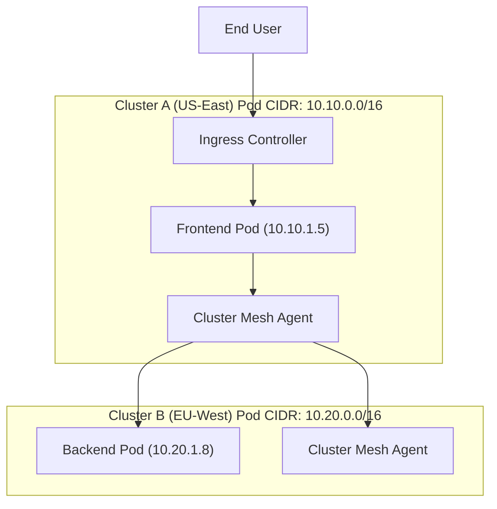

# Kubernetes Cluster Mesh & Cross-Cluster Networking

Version: 1.0.0

Purpose: Canonical lesson structure for Platform Engineering & AI Infrastructure Curriculum.

Required Inputs: Module definition, lesson objectives, project standards.

Outputs: Standards-compliant lesson markdown.

# Lesson Overview

As organizations scale, confining workloads to a single Kubernetes cluster becomes a liability due to hard scaling limits, lack of geographic distribution, and single points of failure. This lesson explores the advanced networking required to bridge multiple Kubernetes clusters together. We will examine how a "Cluster Mesh" enables seamless service discovery, load balancing, and zero-trust security across distributed clusters, making multi-region deployments appear as one unified platform.

---

# Learning Objectives

* Architect cross-cluster networking topologies using CNI-based approaches (Cilium) and Service Mesh approaches (Istio).
* Understand and configure multi-cluster service discovery and global load balancing.
* Identify the networking prerequisites for cluster meshing, specifically non-overlapping CIDR blocks.
* Implement zero-trust security and mutual TLS (mTLS) across geographically distributed clusters.
* Evaluate the architectural trade-offs between Flat Networks, Overlay Networks, and Multi-Network topologies.

---

# Prerequisites

* **MOD-K8S-03:** Deep understanding of Kubernetes Networking (CNI, Services, Ingress).
* **MOD-ADV-01:** High Availability Multi-Region concepts.
* Familiarity with BGP (Border Gateway Protocol) and IP routing fundamentals.

---

# Why This Exists

Early Kubernetes adopters crammed thousands of nodes into a single cluster. This led to catastrophic "blast radiuses"—if the etcd control plane crashed, the entire company went offline. To mitigate this, engineers began deploying many smaller clusters (multi-cluster architecture). 

However, multi-cluster created a new problem: siloed networking. A microservice in Cluster A (US) could not easily talk to a database in Cluster B (EU) using standard Kubernetes DNS (`db.default.svc.cluster.local`). Engineers had to expose internal services to the public internet or use brittle API gateways just to allow internal communication. **Cluster Mesh** technologies were invented to flatten the network across clusters, allowing a Pod in US-East to securely and directly address a Pod in EU-West as if they were in the same datacenter.

---

# Core Concepts

## 1. The Multi-Cluster Networking Problem
By default, every Kubernetes cluster is an isolated island. Pod IP addresses are dynamically assigned from a local pool (the Pod CIDR). If two clusters use the same Pod CIDR (e.g., `10.244.0.0/16`), a Pod in Cluster A might have the exact same IP address as a Pod in Cluster B. This makes direct IP routing between them impossible. 

## 2. IP Address Management (IPAM) and Non-Overlapping CIDRs
The foundational requirement for a true Cluster Mesh is ensuring that **no two clusters share the same Pod CIDR or Service CIDR**. 
* Cluster A Pods: `10.10.0.0/16`
* Cluster B Pods: `10.20.0.0/16`
This allows network routers (or overlay networks) to understand that traffic destined for `10.20.x.x` must be routed to Cluster B.

## 3. Global Service Discovery
In a single cluster, CoreDNS resolves service names. In a multi-cluster setup, we need Global Service Discovery. When a Pod requests `payment-service`, the cluster mesh intercepts the DNS request and can route it to:
* The local `payment-service` (for low latency).
* The remote `payment-service` in Cluster B (if the local one is down or overloaded).

## 4. Control Plane Architectures
How do clusters share information about their services and endpoints?
* **Replicated Control Plane (e.g., Cilium Cluster Mesh):** Each cluster runs its own distinct control plane. An agent syncs endpoint data (IPs of healthy Pods) between clusters via a dedicated tunnel. If the connection drops, both clusters continue operating independently using cached data.
* **Shared Control Plane (e.g., Istio Primary-Remote):** One cluster acts as the "Primary" and holds the configuration. The "Remote" clusters rely on the Primary. If the Primary goes down, the Remote clusters cannot receive updates.

## 5. Security & Zero-Trust (mTLS)
When Pod A talks to Pod B across the public internet or a cloud provider's backbone, the traffic must be encrypted. Cluster meshes automatically inject Mutual TLS (mTLS). Both clusters must share a common Root Certificate Authority (CA) so they trust each other's cryptographic identities.

---

# Architecture



---

# Real-World Example

**Financial Trading Platform:** A global trading firm runs operations on-premises in New York and in AWS us-east-1. For compliance, the primary database must live on-premises. They use **Cilium Cluster Mesh** to link the on-prem Kubernetes cluster to the AWS EKS cluster. When traffic spikes during a market event, the AWS cluster scales up hundreds of compute pods. These AWS pods seamlessly communicate with the on-prem database pods using native Kubernetes service names. The traffic is automatically encrypted via WireGuard or IPSec by Cilium, and the application developers don't even know their code is running across a hybrid-cloud boundary.

---

# Hands-on Demonstration

Let's look at how to establish a Cluster Mesh between two clusters using the Cilium CLI.

**Scenario:** We have two Kubernetes contexts: `cluster1` and `cluster2`. Both have Cilium installed.

**Input Code (Terminal Commands):**

```bash
# Step 1: Enable Cluster Mesh on Cluster 1
cilium clustermesh enable --context cluster1

# Step 2: Enable Cluster Mesh on Cluster 2
cilium clustermesh enable --context cluster2

# Step 3: Wait for the mesh components to deploy and become ready
cilium clustermesh status --context cluster1 --wait

# Step 4: Connect the two clusters
cilium clustermesh connect --context cluster1 --destination-context cluster2

# Step 5: Verify the connection
cilium clustermesh status --context cluster1
```

**Expected Output:**
```
🔌 Cluster Connectivity:
   - cluster2: 2/2 nodes connected (Ready)
✅ Global services: 15/15 synced
```

**Explanation:** The `connect` command exchanges the TLS certificates and IP routing information between the two clusters. Once connected, a service defined in `cluster1` with the annotation `service.cilium.io/global: "true"` will automatically have its endpoints propagated to `cluster2`.

---

# Hands-on Lab

* **Objective:** Simulate a multi-cluster failover scenario using simulated routing.
* **Estimated Time:** 30 minutes
* **Difficulty:** Advanced
* **Environment:** A Linux terminal.

*(Note: Setting up a full Cilium Cluster Mesh locally requires significant RAM and nested virtualization. For this lab, we will simulate the global service discovery logic using local DNS.)*

## Step-by-step Instructions

1. **Simulate Two Clusters with Docker:**
   We will run two Nginx containers acting as our "Backend Service" in two different clusters.
   ```bash
   docker run -d --name backend-us -p 8081:80 -e CLUSTER="US" nginx
   docker exec backend-us sh -c 'echo "Response from US Cluster" > /usr/share/nginx/html/index.html'

   docker run -d --name backend-eu -p 8082:80 -e CLUSTER="EU" nginx
   docker exec backend-eu sh -c 'echo "Response from EU Cluster" > /usr/share/nginx/html/index.html'
   ```

2. **Simulate the Global DNS Resolver:**
   We will use `dnsmasq` or a simple Nginx proxy to simulate the Cluster Mesh routing logic (prefer local, fail to remote).
   ```bash
   cat << 'EOF' > mesh-proxy.conf
   events {}
   http {
       upstream backend_global {
           server host.docker.internal:8081; # Local Cluster (Primary)
           server host.docker.internal:8082 backup; # Remote Cluster (Failover)
       }

       server {
           listen 80;
           location / {
               proxy_pass http://backend_global;
               proxy_connect_timeout 1s;
           }
       }
   }
   EOF

   docker run -d -p 8080:80 --name mesh-agent --add-host host.docker.internal:host-gateway -v $(pwd)/mesh-proxy.conf:/etc/nginx/nginx.conf nginx
   ```

## Verification

1. **Test Normal Operation (Local routing):**
   ```bash
   curl http://localhost:8080
   ```
   *Expected:* `Response from US Cluster`

2. **Simulate Local Cluster Failure:**
   ```bash
   docker stop backend-us
   curl http://localhost:8080
   ```
   *Expected:* The mesh agent detects the failure and routes to the remote cluster: `Response from EU Cluster`.

## Cleanup
```bash
docker rm -f backend-us backend-eu mesh-agent
rm mesh-proxy.conf
```

---

# Production Notes

* **Latency is the Enemy:** Cluster mesh makes cross-region calls as easy as local calls. Developers will abuse this. If a microservice makes 50 database calls per request, and the mesh routes those calls to a cluster 100ms away, your application will take 5 seconds to load. You must implement strict topology-aware routing (prefer local endpoints always).
* **The Shared Root CA:** For mTLS to work across clusters, both clusters must share a cryptographic root of trust. If this Root CA expires or is compromised, your entire global network breaks. Use highly secure vault systems (like HashiCorp Vault) to manage the Root CA and automate intermediate certificate rotation.
* **Overlapping CIDRs:** If you inherit two clusters with overlapping CIDRs (e.g., both use `10.0.0.0/16`), standard CNI cluster mesh will not work. You must use an overlay network with NAT (Network Address Translation) or an L7 proxy (like Istio Gateways) to bridge them, which adds significant complexity and latency.

---

# Common Mistakes

* **Flat Network Assumption:** Assuming the underlying cloud network (VPC peering/Transit Gateways) is perfectly stable. Cluster meshes rely on underlying network health. If the VPC peer drops, the mesh partitions.
* **Ignoring Egress Costs:** Cloud providers charge heavily for cross-region data transfer. If your cluster mesh aggressively load-balances traffic across regions randomly, you will receive a massive bandwidth bill at the end of the month.
* **Single Point of Failure in Control Plane:** Using a primary-remote Istio setup and placing the primary control plane in a region that experiences an outage. The remote regions will lose their ability to update configurations or scale securely.

---

# Failure-Driven Learning

**Scenario: The Split-Brain Mesh**

1. **The Failure:** A transatlantic fiber cut severs the network connection between Cluster US and Cluster EU. 
2. **The Symptom:** Both clusters are healthy, but they cannot communicate. A globally distributed database relying on the mesh for replication stops syncing.
3. **Diagnosis:** Cilium/Istio logs show "connection refused" to remote mesh agents. `cilium clustermesh status` shows `0/2 nodes connected`.
4. **Resolution:** Because the data plane is disconnected, topology-aware routing becomes critical. The mesh must gracefully degrade, forcing all local traffic to stay local. If a service *only* exists in the EU cluster, US users will experience errors. The architectural fix is to ensure every cluster is entirely self-sufficient (running replicas of all critical services) so it can survive a network partition independently.

---

# Engineering Decisions

**The Dilemma: CNI-based Mesh (Cilium) vs. L7 Service Mesh (Istio)**

**CNI-based Mesh (Cilium/eBPF):**
* **Pros:** Operates at the kernel level (Layer 3/4). Extremely fast, low latency, low resource overhead. No sidecar proxies required.
* **Cons:** Lacks advanced Layer 7 features (like complex HTTP header-based routing or GraphQL parsing). Requires non-overlapping CIDRs.

**L7 Service Mesh (Istio):**
* **Pros:** Deep Layer 7 visibility. Can bridge clusters with overlapping CIDRs using SNI routing via Ingress Gateways. Granular HTTP routing capabilities.
* **Cons:** High resource overhead (requires an Envoy sidecar proxy in every single pod). High latency overhead. Extremely complex to operate.

**Decision Matrix:** Start with a CNI-based mesh like Cilium using eBPF. It provides 90% of the value (cross-cluster routing, network policies, encryption) with 10% of the operational burden. Only adopt Istio multi-cluster if you have strict requirements for L7 routing across boundaries or are forced to integrate clusters with overlapping IP spaces.

---

# Best Practices

* **Topology-Aware Hints:** Always enable Kubernetes topology-aware routing. Traffic should stay in the same Availability Zone if possible, same Region if necessary, and only cross regions as a last resort.
* **Automate IPAM:** When provisioning clusters via Terraform/GitOps, use a central IPAM (IP Address Management) tool to dynamically assign non-overlapping CIDR blocks to new clusters to prevent collisions.
* **Monitor Cross-Cluster Traffic:** Build Grafana dashboards specifically tracking the volume of cross-cluster traffic. Alert if it spikes, as this indicates a localized failure or a misconfigured load balancer driving up cloud costs.

---

# Troubleshooting Guide

## Issue 1: Pods in Cluster A cannot reach Services in Cluster B

* **Cause:** The underlying cloud network (VPC Peering, VPN, or Transit Gateway) is not routing traffic for the remote Pod CIDR, or Security Groups are blocking UDP port 8472 (VxLAN) or 51820 (WireGuard).
* **Diagnosis:** SSH into a node in Cluster A. Run `ping <Pod-IP-in-Cluster-B>`. If it times out, the issue is at the cloud infrastructure layer, not the Kubernetes layer.
* **Solution:** Update AWS Route Tables / GCP Cloud Routers to ensure the CIDR blocks are properly routed between VPCs and open the necessary firewall ports for mesh tunnel traffic.

## Issue 2: Cross-Cluster Latency is extremely high (>200ms)

* **Cause:** Traffic is tromboning. A request enters Cluster A, is routed by the mesh to a service in Cluster B, which queries a database back in Cluster A.
* **Diagnosis:** Use distributed tracing (Jaeger) to map the request path. Look for multiple cross-region spans in a single request lifecycle.
* **Solution:** Implement Topology-Aware Routing to ensure services prefer local endpoints. Denormalize data or deploy database read replicas in both clusters to prevent cross-cluster database queries.

---

# Summary

Kubernetes Cluster Mesh technologies solve the multi-cluster networking isolation problem, allowing geographically distributed clusters to function as a single, unified, highly available platform. By flattening the network and automating global service discovery, engineers can build resilient architectures that survive entire datacenter failures. However, this power requires strict IP address management, a deep understanding of cloud routing, and rigorous control over latency and egress costs.

---

# Cheat Sheet

**Cluster Mesh Prerequisites:**
1. Non-overlapping Pod CIDRs.
2. Non-overlapping Service CIDRs.
3. Reliable L3/L4 network connectivity between cluster nodes (VPC Peer / VPN).
4. Shared Root CA for mTLS.

**Common Ports Needed for Mesh:**
* **Cilium Control Plane:** TCP 2379 (etcd)
* **Cilium Data Plane:** UDP 8472 (VxLAN) or UDP 51820 (WireGuard)
* **Istio Cross-Cluster:** TCP 15443 (SNI routing)

---

# Knowledge Check

## Multiple Choice Questions

1. What is the most critical prerequisite for connecting two Kubernetes clusters using a standard CNI-based Cluster Mesh?
   * A) Both clusters must run on the same cloud provider.
   * B) Both clusters must have non-overlapping Pod and Service CIDR blocks.
   * C) Both clusters must use the exact same version of Kubernetes.
   * D) Both clusters must share the same Ingress Controller.

2. Why is topology-aware routing essential in a multi-cluster architecture?
   * A) It encrypts traffic using mTLS.
   * B) It prevents overlapping IP addresses.
   * C) It minimizes latency and egress costs by keeping traffic local whenever possible.
   * D) It allows the control plane to sync faster.

## Scenario Questions

You acquired a company and need to link their Kubernetes cluster to yours using a Cluster Mesh. Upon review, you discover both clusters use `10.0.0.0/16` for their Pod networks. You cannot recreate the clusters. How do you establish cross-cluster communication?

## Short Answer Questions

What is the difference between a Replicated Control Plane and a Shared Control Plane in multi-cluster architectures?

<details>
<summary><b>View Answers</b></summary>

### Multiple Choice
1. **[B] Both clusters must have non-overlapping Pod and Service CIDR blocks.** - *If CIDRs overlap, the network routers cannot determine which cluster a specific IP address belongs to, making direct routing impossible.*
2. **[C] It minimizes latency and egress costs by keeping traffic local whenever possible.** - *Without it, traffic might be randomly load-balanced across the globe, adding hundreds of milliseconds of latency to every internal microservice call.*

### Scenario
*Because the CIDRs overlap, a standard CNI-based flat network (like Cilium without NAT) will not work. You must use a gateway-based Service Mesh approach (like Istio Multi-Cluster with Gateways). In this model, Pods do not route directly to remote Pod IPs. Instead, they route to the local Istio Egress Gateway, which sends the traffic over the public internet (via mTLS) to the remote cluster's Ingress Gateway, which then proxies it to the local Pod. This avoids IP routing conflicts by relying on DNS and SNI (Server Name Indication).*

### Short Answer
*In a Replicated Control Plane, each cluster runs its own control plane and merely synchronizes state. If the connection breaks, clusters operate independently. In a Shared Control Plane, one primary cluster manages the configuration for all remote clusters. If the primary cluster fails, remote clusters cannot receive updates or adapt to scaling events.*

</details>

---

# Interview Preparation

## Beginner Questions

* Why do we use multiple Kubernetes clusters instead of one giant cluster?
* What does CIDR stand for, and why does overlapping them cause problems?

## Intermediate Questions

* Explain how a Cluster Mesh discovers services in a remote cluster.
* What is the purpose of Mutual TLS (mTLS) in cross-cluster communication?

## Advanced Questions

* Compare the architectural trade-offs between Cilium (eBPF-based) Cluster Mesh and Istio (Envoy-based) Multi-Cluster.
* How do you handle database state replication across a Kubernetes Cluster Mesh during a network partition?

## Scenario-Based Discussions

* Your team wants to deploy a Cluster Mesh across AWS us-east-1 and GCP europe-west1 to improve performance. As a Platform Engineer, identify the flaws in this plan and propose a better architecture.

<details>
<summary><b>View Answers</b></summary>

### Beginner
* **Why do we use multiple Kubernetes clusters...:** To reduce the "blast radius" of a failure (e.g., control plane crash), to bypass hard scaling limits of a single cluster, and to geographically distribute workloads closer to users for lower latency.
* **What does CIDR stand for...:** Classless Inter-Domain Routing. Overlapping them means two different machines could be assigned the exact same IP address (e.g., `10.0.1.5`), making it impossible for network routers to know where to send packets destined for that IP.

### Intermediate
* **Explain how a Cluster Mesh discovers services...:** Mesh agents in each cluster watch the local Kubernetes API for Service and Endpoint creation. When a service is flagged as global, the agent synchronizes that endpoint data (IP addresses) to the agents in remote clusters via a secure tunnel.
* **What is the purpose of Mutual TLS...:** It ensures that traffic crossing the public internet or untrusted cloud backbones is encrypted, and it cryptographically verifies the identity of both the client and the server, enforcing zero-trust security.

### Advanced
* **Compare the architectural trade-offs...:** Cilium operates at the kernel level (eBPF), offering high performance, low latency, and low resource overhead, but requires non-overlapping CIDRs and L3 connectivity. Istio uses sidecar proxies (Envoy), which adds latency and resource cost, but provides deep L7 routing capabilities and can bridge overlapping CIDR clusters via gateways.
* **How do you handle database state replication...:** The Kubernetes Cluster Mesh handles the L3/L4 connectivity, but state replication is an application-layer problem. You must use databases designed for distributed quorum (e.g., CockroachDB, Cassandra). During a partition, the side lacking a quorum must gracefully degrade to read-only or offline to prevent split-brain data corruption.

### Scenario-Based Discussions
* **Your team wants to deploy a Cluster Mesh across AWS and GCP to improve performance...:** I would point out that cross-cloud, transatlantic routing will severely *degrade* performance due to latency (speed of light) and incur massive egress data costs. Cluster Mesh does not magically make the network faster. A better architecture is to make each cluster (AWS US and GCP EU) fully autonomous, serving their local users independently, and only using asynchronous background queues or specialized databases to sync long-term state across the clouds, avoiding synchronous cross-cluster API calls entirely.

</details>

---

# Further Reading

1. [Cilium Cluster Mesh Documentation](https://docs.cilium.io/en/stable/network/clustermesh/)
2. [Istio Multi-Cluster Deployment Models](https://istio.io/latest/docs/setup/install/multicluster/)
3. [Kubernetes Multi-Cluster Services API (KEP-1645)](https://github.com/kubernetes/enhancements/tree/master/keps/sig-multicluster/1645-multi-cluster-services-api)
4. [eBPF Documentary](https://ebpf.io/)
