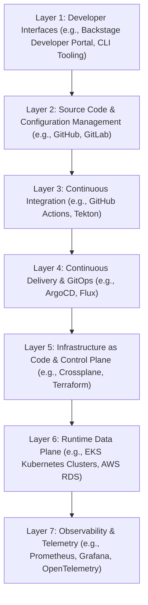

# Lesson Overview

This capstone lesson synthesizes the entire spectrum of platform engineering principles into a cohesive, end-to-end architectural blueprint for a Production Internal Developer Platform (IDP). You will learn how to transition from managing isolated tools (Kubernetes, CI/CD, Observability) to architecting a unified product that treats developers as customers. By the end of this lesson, you will have a comprehensive blueprint that serves as a tangible, verifiable artifact of your platform engineering expertise, demonstrating how to build a scalable, resilient, and developer-friendly enterprise ecosystem from the ground up.

---

# Learning Objectives

* **Architect an End-to-End IDP:** Design a comprehensive architecture integrating developer portals, CI/CD, GitOps, Kubernetes, and Observability.
* **Design Enterprise Golden Paths:** Construct standardized, self-service software templates that abstract infrastructure complexity and enforce security by default.
* **Justify Architectural Trade-offs:** Articulate and defend the engineering decisions behind tool selection (e.g., Backstage vs. Port, Crossplane vs. Terraform) and system design.
* **Implement Production-Grade Delivery:** Formulate a highly available deployment strategy utilizing GitOps principles and progressive delivery mechanisms.
* **Develop a Verifiable Portfolio Asset:** Create a production-ready architectural blueprint that can be presented in engineering interviews and technical evaluations.

---

# Prerequisites

To fully comprehend the concepts in this capstone, you must have completed and understood:
* **MOD-K8S:** Advanced Kubernetes architecture, RBAC, and workload management.
* **MOD-CICD:** CI/CD paradigms, declarative workflows, and automated pipelines.
* **MOD-OBS & MOD-SRE:** Observability pillars (metrics, logs, traces) and Site Reliability Engineering practices.
* **MOD-IDP:** Foundational concepts of Internal Developer Platforms and treating developers as customers.

---

# Why This Exists

In the early days of DevOps, the prevailing philosophy was "you build it, you run it." While empowering, this approach inadvertently burdened software developers with massive cognitive overload. A developer writing a simple Java backend suddenly had to master Helm, Terraform, Kubernetes YAML, AWS IAM roles, and Prometheus PromQL. This led to shadow operations, security vulnerabilities, and plummeting feature velocity.

The Internal Developer Platform (IDP) exists to solve this exact problem. It provides an abstraction layer—a centralized, self-service ecosystem that hides the underlying infrastructure complexity. By providing "Golden Paths" (standardized, paved roads to production), an IDP allows developers to focus on writing business logic while the platform automatically handles scaffolding, security, compliance, and deployment. The IDP transforms a disjointed set of DevOps tools into a streamlined, cohesive product.

---

# Core Concepts

## 1. The Platform as a Product

The most critical concept in platform engineering is treating the platform as a product and the internal developers as its primary customers. An IDP is not just a collection of scripts; it requires user research, product management, and a focus on Developer Experience (DevEx). The platform must solve real pain points (e.g., "It takes 3 weeks to get a new database provisioned") rather than forcing developers to use a tool simply because it is new or trendy. Adoption should be driven by how much easier the platform makes the developer's life, not by mandates.

## 2. Golden Paths (Paved Roads)

A Golden Path is an opinionated, highly automated, and fully supported route to building and deploying a specific type of application (e.g., a Go microservice, a React frontend). When a developer chooses the Golden Path, the IDP automatically provisions the repository, sets up CI/CD pipelines, configures monitoring, and provisions underlying infrastructure (like databases or message queues). Developers are not strictly forced to use the Golden Path, but doing so significantly reduces their workload. If they stray from the path, they assume the operational burden ("you build it, you run it").

## 3. The Developer Portal (The Interface)

The Developer Portal (e.g., Spotify's Backstage, Cortex, Port) is the Graphical User Interface (GUI) of the IDP. It serves two primary functions:
1. **Software Catalog:** A centralized registry of all microservices, ownership, dependencies, and API documentation.
2. **Scaffolding Engine:** A self-service portal where developers can click a button to provision new services, databases, or infrastructure based on the organization's Golden Paths.

## 4. The Platform Control Plane vs. Data Plane

* **Control Plane:** The components that manage, configure, and orchestrate the platform. This includes the Developer Portal, CI/CD runners, GitOps controllers (ArgoCD), and infrastructure orchestrators (Crossplane, Terraform Cloud).
* **Data Plane:** The runtime environment where the actual developer workloads execute. This includes the Kubernetes clusters, managed databases (RDS, Cloud SQL), and serverless environments.

## 5. GitOps as the Source of Truth

In a production IDP, no human interacts directly with the runtime environment. All infrastructure and application state is defined declaratively in Git repositories. GitOps agents (like ArgoCD or Flux) continuously monitor these repositories and reconcile the desired state defined in Git with the actual state in the Kubernetes clusters. This ensures audibility, disaster recovery, and consistent deployments.

---

# Architecture

The following diagram illustrates a production-grade Internal Developer Platform architecture, structured as a top-to-bottom layered hierarchy.



---

# Real-World Example

**Spotify and the Genesis of Backstage**
Spotify operates a massive microservice architecture with thousands of individual components. As they grew, engineering onboarding took months, and discovering who owned a specific service or how to provision a new one became an organizational bottleneck. To solve this, Spotify built **Backstage**, an internal developer portal. Backstage provided a unified software catalog (tracking ownership and APIs) and a software templates feature. 

When a Spotify developer wants to create a new Spring Boot backend, they don't open an IT ticket. They log into Backstage, fill out a form, and click "Create." Backstage automatically generates a GitHub repository with boilerplate code, creates the necessary CI/CD pipelines, registers the service in the catalog, and provisions a Kubernetes namespace. What used to take weeks now takes minutes. Spotify later open-sourced Backstage to the Cloud Native Computing Foundation (CNCF), and it has become the industry standard for IDP interfaces.

---

# Hands-on Demonstration

## Constructing the Blueprint: Scaffolding a Microservice

Let's walk through the exact sequence of events when a developer uses our IDP Blueprint to scaffold a new service.

**1. The Request (Developer Intent):**
The developer logs into Backstage and selects the "Go Microservice with PostgreSQL" template. They input the service name (`billing-service`) and the owning team (`team-finance`).

**2. The Scaffolding (Backstage Action):**
Backstage executes a Software Template pipeline:
* It calls the GitHub API to create a new repository: `org/billing-service`.
* It populates the repository using a Cookiecutter-style template containing:
  * `main.go` (Boilerplate web server).
  * `Dockerfile` (Standardized base image).
  * `.github/workflows/ci.yaml` (Standardized test and build pipeline).
  * `k8s/deployment.yaml` (Kubernetes manifests).

**3. The Infrastructure Definition (Crossplane Integration):**
Within the generated `k8s` directory, Backstage also injects a Custom Resource (CR) for a database, such as an `XPostgreSQLInstance`. Because the platform uses Crossplane, this YAML file tells the Kubernetes control plane to provision a real RDS instance in AWS.

**4. The GitOps Reconciliation (ArgoCD):**
Backstage registers the new repository with ArgoCD. ArgoCD detects the new Kubernetes manifests (including the Crossplane database claim and the application deployment) and applies them to the runtime cluster.

**5. The Result:**
Within 5 minutes, the developer has a fully functioning, monitored, and deployed "Hello World" application with a connected database, entirely through self-service.

---

# Hands-on Lab

* **Objective:** Design and implement a mock Software Template for an IDP to understand automated scaffolding.
* **Estimated Time:** 45 minutes
* **Difficulty:** Advanced
* **Environment:** A local machine with Docker, Node.js (for running a mock Backstage instance or a CLI alternative like Cookiecutter), and Git.

## Step-by-step Instructions

1. **Install Cookiecutter (Simulating the Scaffolding Engine):**
   We will use `cookiecutter` as a lightweight simulation of Backstage's templating engine.
   ```bash
   pip install cookiecutter
   ```

2. **Create the Template Directory Structure:**
   Create a directory for your Golden Path template.
   ```bash
   mkdir -p golden-path-go/{{cookiecutter.app_name}}/.github/workflows
   mkdir -p golden-path-go/{{cookiecutter.app_name}}/k8s
   ```

3. **Define the Template Variables:**
   Create a `cookiecutter.json` file inside `golden-path-go/`:
   ```json
   {
     "app_name": "my-service",
     "owner": "platform-team",
     "port": "8080"
   }
   ```

4. **Create the Boilerplate Application:**
   Create `golden-path-go/{{cookiecutter.app_name}}/main.go`:
   ```go
   package main
   import (
       "fmt"
       "net/http"
   )
   func main() {
       http.HandleFunc("/", func(w http.ResponseWriter, r *http.Request) {
           fmt.Fprintf(w, "Hello from {{cookiecutter.app_name}}! Owned by {{cookiecutter.owner}}")
       })
       http.ListenAndServe(":{{cookiecutter.port}}", nil)
   }
   ```

5. **Create the Kubernetes Manifests:**
   Create `golden-path-go/{{cookiecutter.app_name}}/k8s/deployment.yaml`:
   ```yaml
   apiVersion: apps/v1
   kind: Deployment
   metadata:
     name: {{cookiecutter.app_name}}
     labels:
       owner: {{cookiecutter.owner}}
   spec:
     replicas: 2
     selector:
       matchLabels:
         app: {{cookiecutter.app_name}}
     template:
       metadata:
         labels:
           app: {{cookiecutter.app_name}}
       spec:
         containers:
         - name: app
           image: registry.internal/{{cookiecutter.app_name}}:latest
           ports:
           - containerPort: {{cookiecutter.port}}
   ```

6. **Execute the Template (Simulate the Developer Experience):**
   Run the template generator.
   ```bash
   cookiecutter ./golden-path-go
   ```
   *When prompted, enter:*
   * `app_name`: `payment-gateway`
   * `owner`: `team-payments`
   * `port`: `3000`

## Verification

Navigate into the newly generated directory:
```bash
cd payment-gateway
cat main.go
cat k8s/deployment.yaml
```
Verify that all variables (`{{cookiecutter.var}}`) have been replaced with the concrete values you provided. This demonstrates the core mechanism of IDP scaffolding engines.

## Troubleshooting

* **Issue:** Cookiecutter fails with syntax errors.
  * **Fix:** Ensure the `cookiecutter.json` file is valid JSON and that the variable names in the files exactly match those in the JSON file.

## Cleanup

```bash
cd ..
rm -rf payment-gateway
rm -rf golden-path-go
```

---

# Production Notes

* **Platform Modularity:** Do not build a monolithic platform. Design the IDP with pluggable interfaces. If you decide to swap GitHub Actions for GitLab CI in two years, it shouldn't require rewriting the Developer Portal.
* **Security by Default:** Golden Paths must include security tooling seamlessly. The CI templates should automatically include SAST (Static Application Security Testing) and container scanning (e.g., Trivy). The developer gets security without having to configure it.
* **Multi-Tenancy & Isolation:** Ensure that scaffolding templates apply correct Kubernetes namespaces, NetworkPolicies, and IAM roles to prevent one team's service from compromising another's.
* **Disaster Recovery:** The entire state of the IDP (including Backstage configurations and ArgoCD application definitions) must be stored in Git. If the control plane cluster goes down, you should be able to restore the entire platform by pointing a new cluster at the Git repository.

---

# Common Mistakes

* **Building the "Portal to Nowhere":** Engineering teams spend 6 months building a beautiful Backstage portal with hundreds of plugins, but provide no actual Golden Paths or automation. Developers log in, see a catalog, but still have to write Terraform manually. The portal must offer immediate, tangible value.
* **Forcing Adoption:** Mandating that all teams migrate to the IDP immediately. Instead, treat it like an internal startup. Find early adopters, solve their problems, and let word-of-mouth drive adoption.
* **Abstracting Too Much:** Hiding Kubernetes entirely behind a custom abstraction layer. When things break (and they will), developers won't know how to debug. Provide abstractions, but leave "escape hatches" for developers to view the underlying manifests and logs.

---

# Failure-Driven Learning

**Scenario: The "Drifted" Infrastructure**
A developer bypasses the IDP and manually edits a Kubernetes Deployment via `kubectl edit deployment` to increase the replica count during a traffic spike.

**The Failure:** Ten minutes later, ArgoCD's reconciliation loop runs. It notices that the cluster state (replicas=5) does not match the Git state (replicas=2). ArgoCD immediately overrides the manual change, scaling the application back down and causing an outage.

**The Lesson:** In a strict GitOps-driven IDP, out-of-band manual changes are treated as drift and are actively corrected. Developers must be trained that Git is the absolute source of truth. If they need to scale, they must commit the change to Git, or the platform must expose a specific interface (like an autoscaler configuration in the portal) that safely updates the desired state.

---

# Engineering Decisions

**Decision 1: Backstage vs. SaaS IDPs (Port, Cortex)**
* *Backstage:* Open-source, highly customizable, massive ecosystem. Trade-off: Requires a dedicated platform team just to maintain, write plugins, and upgrade the Backstage application itself (written in TypeScript/React).
* *SaaS Portals (Port, Cortex):* Managed solutions, faster time-to-value. Trade-off: Vendor lock-in, recurring costs, potentially less flexible if you have highly custom internal, legacy tooling that requires bespoke plugins.
* *Blueprint Choice:* For large enterprises, Backstage is often the blueprint standard due to its extensibility.

**Decision 2: Infrastructure Provisioning: Terraform vs. Crossplane**
* *Terraform:* The industry standard, massive provider ecosystem. Runs as a pipeline (e.g., in GitHub Actions or Jenkins).
* *Crossplane:* Cloud-native, runs directly inside Kubernetes as an operator. Uses the Kubernetes API to provision AWS/GCP resources. Reconciles continuously, preventing infrastructure drift.
* *Blueprint Choice:* A modern IDP blueprint heavily favors Crossplane because it unifies application deployment (ArgoCD) and infrastructure provisioning (Crossplane) into the exact same Kubernetes-native GitOps workflow.

---

# Best Practices

* **Treat Developers as Customers:** Conduct user interviews. Ask developers what takes the most time in their day. Build the platform to solve those specific problems.
* **Keep Cognitive Load Low:** The goal is not to hide everything, but to hide the things that don't matter to the business logic.
* **Measure Developer Experience (DevEx):** Track metrics such as Lead Time for Changes (how long from commit to production), Onboarding Time (how long for a new hire to push code), and Platform Adoption Rate.
* **Start Small:** Don't build 20 Golden Paths at once. Build one excellent path for your organization's most common use case (e.g., "A Node.js backend with a Postgres DB").

---

# Troubleshooting Guide

## Issue 1: Scaffolding Pipeline Fails Mid-Execution

* **Cause:** A step in the Backstage Software Template (e.g., publishing to a GitHub org) fails due to expired Personal Access Tokens (PATs) or insufficient API permissions.
* **Diagnosis:** Check the Backstage task logs within the UI. The specific API call (e.g., `POST /orgs/repos`) will return a `401 Unauthorized` or `403 Forbidden`.
* **Solution:** Rotate the GitHub App credentials or PATs configured in the Backstage `app-config.yaml`. Ensure the identity used by the IDP has the correct organizational permissions to create repositories and manage branch protections.

## Issue 2: ArgoCD Cannot Sync the Generated Repository

* **Cause:** The newly scaffolded repository is private, and ArgoCD does not have the SSH keys or tokens required to clone it.
* **Diagnosis:** ArgoCD UI shows the application as `Unknown` or `Failed to Sync` with a `git clone error: authentication required`.
* **Solution:** Configure a default repository credential in ArgoCD (using an SSH deploy key or GitHub App) that has read access to the entire organization where the IDP creates new repositories.

---

# Summary

A Production Internal Developer Platform (IDP) is the culmination of modern platform engineering. It acts as an abstraction layer over complex infrastructure, providing developers with self-service Golden Paths. By integrating a Developer Portal (like Backstage), continuous delivery (ArgoCD), and infrastructure automation (Crossplane), an IDP drastically reduces cognitive load, accelerates time-to-market, and enforces security and architectural standards by default. Designing this blueprint requires treating the platform as a product and internal developers as valued customers.

---

# Cheat Sheet

**Key Tools in the IDP Blueprint:**
* **Developer Portal:** Backstage, Port, Cortex (UI, Catalog, Scaffolding).
* **Source Control:** GitHub, GitLab (The GitOps Source of Truth).
* **CI/CD:** GitHub Actions, Tekton (Build, Test, Scan, Push Images).
* **GitOps Delivery:** ArgoCD, Flux (Reconcile Git state with Cluster state).
* **Infrastructure Management:** Crossplane, Terraform (Provision DBs, Caches, Cloud resources).
* **Observability:** Prometheus, Grafana, OpenTelemetry (Metrics, Logs, Traces).

**Golden Path Components:**
* Standardized Base Container Images.
* Standardized CI Pipeline Definitions.
* Opinionated Kubernetes Manifest Templates.
* Default Monitoring Dashboards and Alerts.

---

# Knowledge Check

## Multiple Choice Questions

1. What is the primary purpose of an Internal Developer Platform (IDP)?
   * A) To replace software developers with automated systems.
   * B) To force all developers to write infrastructure-as-code manually.
   * C) To reduce developer cognitive load by providing self-service abstractions.
   * D) To eliminate the need for cloud providers like AWS or GCP.

2. Which component is responsible for continuously synchronizing the state defined in Git with the actual state in the Kubernetes cluster?
   * A) Backstage
   * B) ArgoCD
   * C) Prometheus
   * D) GitHub Actions

## Scenario Questions

Your engineering organization is moving to an IDP model. The security team is worried that developers will provision cloud resources without proper encryption or auditing. How do you design the IDP to satisfy the security team while maintaining self-service for developers?

## Short Answer Questions

Define the concept of a "Golden Path" (or Paved Road) in the context of platform engineering.

<details>
<summary><b>View Answers</b></summary>

### Multiple Choice
1. **C** - *An IDP abstracts underlying infrastructure complexity, allowing developers to focus on application logic while the platform handles scaffolding, deployment, and security.*
2. **B** - *ArgoCD is a GitOps controller that continuously monitors Git repositories and reconciles the desired state with the runtime Kubernetes cluster.*

### Scenario
*The IDP should use "Golden Paths" via Software Templates. When a developer requests a new service or database through the portal (e.g., Backstage), the platform automatically generates the infrastructure definitions (e.g., using Crossplane or Terraform) that include all security defaults pre-configured by the security team. Developers cannot bypass these defaults via the portal, ensuring security by design while maintaining self-service speed.*

### Short Answer
*A Golden Path is a highly opinionated, automated, and supported route for developers to build and deploy applications. It provides pre-configured templates (CI/CD, infrastructure, monitoring) that abstract complexity and reduce setup time from weeks to minutes.*

</details>

---

# Interview Preparation

## Beginner Questions

* What is an Internal Developer Platform (IDP) and why is it important?
* What is the difference between a Developer Portal and an IDP?

## Intermediate Questions

* Explain how Backstage interacts with a GitOps tool like ArgoCD in a modern IDP architecture.
* Why might a platform team choose Crossplane over Terraform for infrastructure provisioning within an IDP?

## Advanced Questions

* How do you handle configuration drift in a production IDP environment where manual interventions occasionally happen?
* Design the architecture for a multi-tenant IDP supporting hundreds of engineering teams. How do you isolate resources and ensure security?

## Scenario-Based Discussions

* Your company has built a comprehensive Backstage-based IDP, but after 6 months, only 10% of developers are using it. Most prefer their old manual bash scripts. How do you diagnose and solve this adoption problem?

<details>
<summary><b>View Answers</b></summary>

### Beginner
* **What is an IDP?**: An IDP is a self-service platform that abstracts infrastructure complexity, providing developers with automated "Golden Paths" to deploy software quickly and securely, reducing their cognitive load.
* **Developer Portal vs. IDP**: The Developer Portal (like Backstage) is just the graphical user interface (the frontend). The IDP is the entire ecosystem, including the backend automation, CI/CD pipelines, GitOps controllers, and Kubernetes clusters.

### Intermediate
* **Backstage & ArgoCD Integration**: Backstage acts as the scaffolding engine. When a developer requests a service, Backstage generates the boilerplate code and Kubernetes manifests, committing them to a Git repository. ArgoCD, watching that repository, detects the new manifests and automatically deploys the service to the cluster.
* **Crossplane over Terraform**: Crossplane runs natively inside Kubernetes as an operator and continuously reconciles infrastructure state, preventing drift. It allows platforms to manage application deployments (via ArgoCD) and infrastructure (databases, caches) using the exact same Kubernetes-native API and GitOps workflow.

### Advanced
* **Handling Configuration Drift**: Drift is handled by enforcing strict GitOps principles. Tools like ArgoCD are configured with automated self-healing. If a manual change occurs in the cluster, ArgoCD immediately overrides it with the state defined in Git. All required changes must go through a pull request.
* **Multi-Tenant Architecture**: Isolate resources by leveraging Kubernetes Namespaces, strict NetworkPolicies, and RBAC. Use software templates to automatically generate these boundaries. Integrate OIDC/SSO to map developer identities to specific Kubernetes ServiceAccounts and Cloud IAM roles, ensuring a team can only deploy to and view their assigned environments.

### Scenario-Based Discussions
* **Solving Poor IDP Adoption**: The platform was likely built without treating developers as customers. I would halt new feature development and conduct extensive user research to understand *why* they prefer their scripts (e.g., the IDP might be too rigid, lacks a necessary feature, or is harder to debug). I would then iterate on the platform to solve their specific pain points and focus on measuring DevEx metrics rather than dictating usage.

</details>

---

# Further Reading

1. [Backstage Official Documentation](https://backstage.io/docs/overview/what-is-backstage/)
2. [CNCF Platform Engineering Maturity Model](https://tag-app-delivery.cncf.io/whitepapers/platform-eng-maturity-model/)
3. [ArgoCD Documentation - GitOps Principles](https://argo-cd.readthedocs.io/)
4. [Crossplane Architecture Documentation](https://docs.crossplane.io/latest/concepts/architecture/)
5. [Team Topologies: Organizing Business and Technology Teams for Fast Flow](https://teamtopologies.com/)
