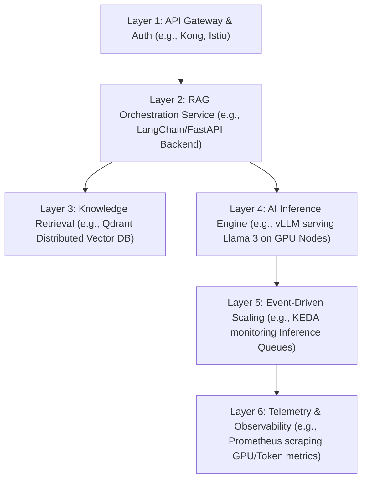

# Lesson Overview

This capstone lesson consolidates your knowledge of AI infrastructure, Kubernetes, and Observability to architect a production-grade Enterprise AI Inference Engine. Traditional web architecture cannot simply be copy-pasted into the AI domain; LLMs require specialized hardware, continuous batching, and completely different auto-scaling paradigms. By the end of this lesson, you will possess a complete blueprint for deploying, scaling, and monitoring Large Language Models (LLMs) alongside Vector Databases for Retrieval-Augmented Generation (RAG) in a high-traffic enterprise environment.

---

# Learning Objectives

* **Architect AI Infrastructure:** Design a highly available, distributed AI inference platform running on GPU-enabled Kubernetes clusters.
* **Integrate RAG Pipelines:** Connect LLM serving engines with distributed Vector Databases to provide contextual, hallucination-free AI responses.
* **Implement Advanced Auto-scaling:** Configure KEDA (Kubernetes Event-driven Autoscaling) to scale GPU nodes based on custom AI metrics like queue length and token throughput.
* **Design AI Observability:** Instrument the platform to monitor critical AI-specific telemetry, including GPU utilization, memory fragmentation, and Time to First Token (TTFT).
* **Justify AI Engineering Trade-offs:** Make informed decisions regarding inference engines (e.g., vLLM vs. TGI) and model weight storage strategies.

---

# Prerequisites

To fully comprehend the concepts in this capstone, you must have completed:
* **MOD-K8S:** Advanced Kubernetes architecture and scheduling.
* **MOD-AI:** GPU hardware architecture and LLM serving technologies (vLLM).
* **MOD-MLOPS:** Retrieval-Augmented Generation (RAG) concepts and Vector Databases.
* **MOD-OBS:** Prometheus time-series monitoring and Grafana dashboards.

---

# Why This Exists

As enterprises rush to integrate Artificial Intelligence into their products, they quickly discover that running a 70-Billion parameter LLM is fundamentally different from running a Node.js web server. An LLM requires massive amounts of GPU memory (VRAM) just to load the model weights, before it even processes a single request. 

Traditional scaling strategies fail spectacularly here. If you scale based on CPU utilization, you ignore the GPU entirely. If you allow requests to hit the model simultaneously without batching, the GPU runs out of memory and crashes (CUDA OOM). Platform engineers must design specialized infrastructure capable of continuous request batching, rapid knowledge retrieval via Vector Databases, and intelligent scaling to maximize the utilization of incredibly expensive GPU hardware. This blueprint provides the canonical architecture to solve these challenges.

---

# Core Concepts

## 1. The Inference Engine (vLLM)

At the heart of the AI platform is the inference engine. We do not run LLMs directly using simple Python scripts in production. Instead, we use highly optimized servers like **vLLM** or **Text Generation Inference (TGI)**. These engines implement "PagedAttention," dynamically managing the Key-Value (KV) cache in GPU memory to allow for continuous batching of concurrent user requests. This increases inference throughput by up to 20x compared to naive implementations.

## 2. Retrieval-Augmented Generation (RAG) Architecture

LLMs have a static knowledge cutoff and tend to hallucinate when asked about proprietary enterprise data. The RAG architecture solves this by integrating a Knowledge Retrieval layer:
* **Embedding Model:** Converts enterprise documents into dense numerical vectors.
* **Vector Database (e.g., Qdrant, Milvus):** Stores and indexes these vectors for lightning-fast similarity search.
* **Orchestrator:** Intercepts the user's query, searches the Vector Database for relevant context, and injects that context into the prompt before sending it to the LLM.

## 3. Event-Driven AI Autoscaling (KEDA)

Scaling AI workloads is complex because loading model weights into VRAM can take minutes (a severe "cold start" penalty). Furthermore, scaling based on CPU is irrelevant. Instead, we use KEDA to scale based on **queue length** (how many requests are waiting to be processed) or **KV cache utilization** (how much GPU memory is currently locked up by active generations). KEDA scales the Kubernetes Pods, which in turn triggers the Cluster Autoscaler to provision new GPU-equipped worker nodes.

## 4. Model Weight Storage & Caching

A 70B parameter model can be over 140GB in size. Downloading this from the internet every time a Pod scales up is catastrophic for performance. Production architectures utilize distributed file systems, Persistent Volume Claims (PVCs), or Node-local HostPaths to cache model weights directly on the GPU nodes, reducing startup times from minutes to seconds.

---

# Architecture

The following diagram illustrates a highly scalable, production-grade AI Inference Engine with RAG capabilities.



---

# Real-World Example

**Enterprise Customer Support AI**
A major e-commerce company wants to build an AI support agent. 
1. When a user asks, "What is your return policy for laptops?", the request hits the API Gateway and is routed to the RAG Orchestrator.
2. The Orchestrator converts the query into a vector using an embedding model and queries the Qdrant Vector Database.
3. Qdrant returns the top 3 most relevant company policies regarding laptop returns.
4. The Orchestrator injects these policies into the prompt: *"Answer the user based on these policies: [Policies]. User Query: [Query]"*.
5. The prompt is sent to the vLLM Inference Engine. vLLM batches this request alongside 50 other concurrent customer queries and processes them simultaneously on Nvidia H100 GPUs.
6. As traffic spikes during a holiday sale, KEDA detects that the inference queue is growing and automatically provisions additional GPU nodes to handle the load.

---

# Hands-on Demonstration

## The Lifecycle of a RAG Inference Request

Let's break down the technical execution of a single request flowing through our blueprint architecture.

**1. The Request:**
The user submits a POST request to `/api/v1/chat`.

**2. Context Retrieval (The Vector Search):**
The RAG backend receives the query. It calls a lightweight Embedding Model (e.g., `BGE-M3`) running on a CPU node to convert the text into a vector of 1024 floats.
It sends a search request to the Qdrant cluster:
```json
{
  "vector": [0.12, -0.45, 0.89, ...],
  "limit": 5,
  "with_payload": true
}
```
Qdrant responds in <15ms with the actual text chunks of the internal documentation.

**3. The Inference Execution (vLLM):**
The backend constructs the final prompt and sends it to the vLLM OpenAI-compatible API endpoint:
```bash
curl http://vllm-service.ai-namespace.svc.cluster.local:8000/v1/completions \
  -H "Content-Type: application/json" \
  -d '{
    "model": "meta-llama/Llama-3-8B-Instruct",
    "prompt": "<System> You are a helpful assistant. Use this context: [DOCUMENTATION]. <User> How do I reset my password?",
    "max_tokens": 512
  }'
```

**4. Continuous Batching in Action:**
Inside the vLLM Pod, the request enters the scheduler. vLLM doesn't wait for this single request to finish. It allocates blocks of GPU memory (PagedAttention) and processes this request concurrently with others, streaming tokens back to the user via Server-Sent Events (SSE) as they are generated.

---

# Hands-on Lab

* **Objective:** Design the Kubernetes deployment architecture for a scalable vLLM inference endpoint.
* **Estimated Time:** 30 minutes
* **Difficulty:** Advanced
* **Environment:** Local text editor or IDE (We will be writing the architectural manifests; deploying this requires a real GPU cluster).

## Step-by-step Instructions

1. **Define the Model Storage PVC:**
   We need a Persistent Volume Claim to cache the massive model weights so Pods start quickly.
   Create `model-pvc.yaml`:
   ```yaml
   apiVersion: v1
   kind: PersistentVolumeClaim
   metadata:
     name: model-weights-pvc
   spec:
     accessModes:
       - ReadWriteMany
     resources:
       requests:
         storage: 200Gi
   ```

2. **Define the vLLM Inference Deployment:**
   Create `vllm-deployment.yaml`. Notice the GPU resource requests and the volume mounts.
   ```yaml
   apiVersion: apps/v1
   kind: Deployment
   metadata:
     name: vllm-llama3
   spec:
     replicas: 1
     selector:
       matchLabels:
         app: vllm
     template:
       metadata:
         labels:
           app: vllm
       spec:
         containers:
         - name: vllm
           image: vllm/vllm-openai:latest
           command: ["python3", "-m", "vllm.entrypoints.openai.api_server"]
           args:
             - "--model=meta-llama/Llama-3-8B-Instruct"
             - "--download-dir=/models"
             - "--tensor-parallel-size=1"
           resources:
             limits:
               nvidia.com/gpu: "1"
           ports:
           - containerPort: 8000
           volumeMounts:
           - name: model-cache
             mountPath: /models
         volumes:
         - name: model-cache
           persistentVolumeClaim:
             claimName: model-weights-pvc
   ```

3. **Define the KEDA ScaledObject:**
   Create `keda-scaler.yaml` to scale based on HTTP traffic/queue depth using a Prometheus metric.
   ```yaml
   apiVersion: keda.sh/v1alpha1
   kind: ScaledObject
   metadata:
     name: vllm-scaler
   spec:
     scaleTargetRef:
       name: vllm-llama3
     minReplicaCount: 1
     maxReplicaCount: 10
     triggers:
     - type: prometheus
       metadata:
         serverAddress: http://prometheus-server.monitoring.svc.cluster.local:9090
         metricName: vllm_request_queue_length
         threshold: "20"
         query: sum(vllm:num_requests_waiting{model="meta-llama/Llama-3-8B-Instruct"})
   ```

## Verification

Review the architecture:
1. The PVC ensures weights are cached.
2. The Deployment requests `nvidia.com/gpu` ensuring it schedules on a GPU node.
3. KEDA monitors the `vllm:num_requests_waiting` metric and will scale the deployment from 1 to 10 if the queue exceeds 20 requests.

## Troubleshooting

* **Issue:** Pods remain in `Pending` state.
  * **Fix:** The cluster lacks nodes with the requested `nvidia.com/gpu` resource, or the Cluster Autoscaler is not configured to provision GPU node pools.

---

# Production Notes

* **Tensor Parallelism:** For massive models (e.g., 70B parameters) that do not fit on a single GPU, vLLM supports Tensor Parallelism. You can spread the model across 4 or 8 GPUs on the same node by setting `--tensor-parallel-size=4` and requesting 4 GPUs in the Kubernetes Deployment.
* **Separation of Concerns:** Never run your RAG Embedding Models (which are usually small, CPU/memory-intensive) on the same nodes as your expensive LLM Inference engines (GPU-intensive). Use Kubernetes Taints and Tolerations to strictly separate these workloads.
* **Observability is Critical:** You must monitor **Time to First Token (TTFT)** and **Inter-Token Latency**. If TTFT spikes, your server is overloaded, and continuous batching is breaking down.

---

# Common Mistakes

* **Scaling based on CPU/RAM:** Using standard Kubernetes HPA based on CPU for LLMs will result in erratic scaling or no scaling at all, as the GPU handles the actual load.
* **Ignoring the KV Cache:** Assuming that available VRAM equals capacity. The model weights take up static VRAM. The remaining VRAM is used for the KV cache (the context window for active requests). If you allow too many concurrent requests, the KV cache overflows, causing an Out Of Memory (OOM) crash.
* **Deploying Vector DBs without High Availability:** Running Qdrant or Milvus in standalone mode. In production, Vector DBs must be clustered; losing the Vector DB means the LLM loses all enterprise context and begins hallucinating.

---

# Failure-Driven Learning

**Scenario: The CUDA Out of Memory (OOM) Death Spiral**
Traffic suddenly spikes. The API Gateway forwards 500 concurrent requests to a single vLLM Pod.

**The Failure:** The Pod accepts the requests. As it tries to generate tokens, the KV cache grows rapidly. It exceeds the GPU's 80GB VRAM limit. The Nvidia driver terminates the process with `CUDA out of memory`. The Pod crashes, restarts, and immediately receives the backlog of requests, crashing again in an infinite loop.

**The Lesson:** You must strictly control concurrency at the Inference Engine layer. vLLM uses a parameter like `--max-num-seqs` to limit concurrent sequences. If the limit is reached, vLLM queues the requests safely rather than crashing. Additionally, KEDA should be configured to proactively scale *before* the queue becomes unmanageable.

---

# Engineering Decisions

**Decision 1: Inference Engine Selection (vLLM vs. TGI vs. Ollama)**
* *Ollama:* Excellent for local development, easy to use, but lacks advanced continuous batching for high-throughput production.
* *TGI (Hugging Face):* Production-ready, great integration with the Hugging Face ecosystem.
* *vLLM:* Currently the industry standard for maximum throughput due to its pioneering PagedAttention architecture.
* *Blueprint Choice:* vLLM for high-traffic enterprise endpoints.

**Decision 2: Vector Database Selection (Qdrant vs. pgvector)**
* *pgvector:* An extension for PostgreSQL. Excellent if you already have a massive Postgres infrastructure and want to keep relational data and vector data in one place. Trade-off: Not as fast at massive scale (billions of vectors) as a dedicated system.
* *Qdrant/Milvus:* Purpose-built, highly distributed vector search engines written in Rust/Go.
* *Blueprint Choice:* Qdrant for dedicated, high-performance RAG architectures where vector search latency is the primary bottleneck.

---

# Best Practices

* **Cache Everything:** Cache common queries using a semantic cache (e.g., Redis). If a user asks a question identical (or semantically identical) to one asked 5 minutes ago, serve the cached answer. Do not waste GPU cycles regenerating it.
* **Stream Responses:** Always use Server-Sent Events (SSE) to stream tokens back to the user. A response might take 10 seconds to fully generate, but streaming the first token in 500ms provides a drastically better user experience.
* **Quantization:** If you are VRAM constrained, use quantized models (e.g., AWQ, GPTQ, INT8, FP8). Quantization compresses the model weights, allowing larger models to fit on smaller, cheaper GPUs with minimal loss in accuracy.

---

# Troubleshooting Guide

## Issue 1: High Time to First Token (TTFT)

* **Cause:** The inference server is overwhelmed, or the queue is too deep. The server is spending too much time processing the "prefill" phase (reading the prompt) before it can generate the first token.
* **Diagnosis:** Check the KEDA scaler metrics and the `vllm:num_requests_waiting` gauge in Grafana.
* **Solution:** Increase the KEDA max replica count to provision more GPU nodes. Alternatively, reduce the maximum prompt length allowed by the RAG orchestrator.

## Issue 2: GPU Nodes Failing to Provision

* **Cause:** The Cluster Autoscaler requests a GPU node, but the cloud provider (AWS/GCP) has no GPU capacity in that specific availability zone (an `InsufficientCapacityException`).
* **Diagnosis:** Check the Kubernetes Cluster Autoscaler logs.
* **Solution:** Design your cluster to be multi-zonal or fallback to different instance types. If `p4d.24xlarge` (A100) is unavailable, the autoscaler should gracefully attempt to provision `g5.48xlarge` (A10G) instances, provided your deployments are configured with node affinities for both.

---

# Summary

Architecting a Highly Scalable Enterprise AI Inference Engine is the pinnacle of modern platform engineering. It requires bridging the gap between hardware (GPUs, VRAM), AI theory (Continuous Batching, RAG, Quantization), and distributed systems (Kubernetes, KEDA, Vector DBs). By separating embedding models from inference engines, caching model weights locally, and autoscaling based on AI-specific metrics rather than CPU, you can build a resilient platform capable of serving massive LLMs to enterprise users with low latency and high reliability.

---

# Cheat Sheet

**Key Technologies:**
* **vLLM / TGI:** High-throughput production LLM serving engines.
* **Qdrant / Milvus:** Distributed Vector Databases for RAG.
* **KEDA:** Event-driven autoscaler for Kubernetes.
* **Prometheus DCGM Exporter:** Exposes Nvidia GPU metrics (VRAM, Power, Temp).

**Critical Metrics to Monitor:**
* `vllm:request_success_total`
* `vllm:num_requests_waiting` (Queue length)
* `vllm:time_to_first_token_seconds` (TTFT)
* `vllm:time_per_output_token_seconds` (Inter-token latency)
* `DCGM_FI_DEV_FB_USED` (GPU VRAM Utilization)

---

# Knowledge Check

## Multiple Choice Questions

1. Why is standard Kubernetes CPU-based autoscaling (HPA) ineffective for LLM inference workloads?
   * A) Because LLMs do not use the CPU at all.
   * B) Because CPU utilization does not reflect GPU VRAM bottlenecks or the internal request queue of the inference engine.
   * C) Because Kubernetes cannot scale Pods that use GPUs.
   * D) Because LLMs require manual scaling by a platform engineer.

2. What is the primary role of a Vector Database in a RAG architecture?
   * A) To store the 140GB model weights of the LLM.
   * B) To perform fast similarity searches on embedded data to provide context to the LLM.
   * C) To cache previous user prompts and answers.
   * D) To continuously batch requests to the GPU.

## Scenario Questions

Your AI platform is experiencing severe latency. The Time to First Token (TTFT) has jumped from 0.5 seconds to 5 seconds. However, GPU utilization is only at 60%, and VRAM is only 70% full. You are using a single vLLM Pod. What is the most likely architectural bottleneck and how do you resolve it?

## Short Answer Questions

Explain the concept of "Continuous Batching" and why it is critical for production AI serving.

<details>
<summary><b>View Answers</b></summary>

### Multiple Choice
1. **B** - *LLM workloads are constrained by GPU VRAM and compute, not the host CPU. The true measure of load is how many requests are waiting in the inference engine's queue.*
2. **B** - *Vector DBs store dense numerical vectors (embeddings) of enterprise documents, allowing the system to quickly retrieve relevant context to inject into the LLM's prompt.*

### Scenario
*The bottleneck is the internal queue length of the single vLLM Pod. While the GPU itself has capacity, the server can only process a finite number of concurrent sequences based on its configuration. The solution is to implement an event-driven autoscaler (like KEDA) configured to scale the number of vLLM Pods horizontally based on the `vllm:num_requests_waiting` metric, thereby distributing the queue across multiple GPUs.*

### Short Answer
*Continuous Batching (often facilitated by PagedAttention) is a technique where the inference server dynamically injects new requests into the processing batch as soon as previous requests finish generating tokens, rather than waiting for an entire static batch to complete. This maximizes GPU utilization and drastically increases throughput.*

</details>

---

# Interview Preparation

## Beginner Questions

* What is RAG (Retrieval-Augmented Generation) and why do enterprises use it?
* What is the difference between an Embedding Model and an LLM?

## Intermediate Questions

* Explain how you would optimize the cold start time for a 70-Billion parameter LLM scaling up on a new Kubernetes node.
* Why is managing the Key-Value (KV) cache important in LLM inference?

## Advanced Questions

* Detail the architecture for scaling a GPU-bound service in Kubernetes. How do KEDA and the Cluster Autoscaler interact in this scenario?
* You encounter a `CUDA Out of Memory` error in production during peak traffic. Walk me through your architectural remediation strategy to prevent this from happening again.

## Scenario-Based Discussions

* Your company wants to run Llama-3-70B, but a single A100 GPU only has 80GB of VRAM, and the model weights alone take up over 130GB. How do you architect the deployment to run this model in production?

<details>
<summary><b>View Answers</b></summary>

### Beginner
* **What is RAG?**: RAG connects an LLM to external, proprietary data via a vector search. Enterprises use it to prevent the AI from hallucinating and to allow the AI to answer questions based on secure, internal company documents.
* **Embedding vs. LLM**: An Embedding Model is a small model that converts text into an array of numbers (vectors) representing semantic meaning. An LLM is a massive model that generates new text based on prompts.

### Intermediate
* **Optimizing Cold Starts**: I would use a shared high-performance distributed file system (like FSx for Lustre) or aggressively cache the model weights directly on the GPU node's local disk (HostPath) using a Kubernetes DaemonSet, so new Pods don't have to download 140GB over the network.
* **KV Cache Importance**: The KV cache stores the context of the ongoing conversation in VRAM so the model doesn't have to recompute the entire prompt for every new token it generates. Managing it efficiently (e.g., using vLLM's PagedAttention) prevents memory fragmentation and allows for higher concurrency.

### Advanced
* **Scaling Architecture**: KEDA monitors a custom Prometheus metric (like inference queue length). When the queue spikes, KEDA updates the Horizontal Pod Autoscaler (HPA) to request more Pods. Since these Pods require `nvidia.com/gpu`, they will remain `Pending` if no GPUs are available. The Kubernetes Cluster Autoscaler detects these Pending Pods and provisions new GPU-equipped VMs from the cloud provider to satisfy the requirement.
* **Remediating CUDA OOM**: A CUDA OOM means the KV cache grew beyond available VRAM. I would first configure the inference engine (e.g., vLLM) to strictly cap concurrent sequences (`max-num-seqs`). Then, I would ensure KEDA scales out horizontally before the queue reaches that cap. Finally, I would implement robust monitoring on `DCGM_FI_DEV_FB_USED` (GPU Memory) to alert before capacity is breached.

### Scenario-Based Discussions
* **Running a 70B Model**: A single GPU cannot hold the model. I must use **Tensor Parallelism**. I would configure the Kubernetes Deployment to request multiple GPUs (e.g., `nvidia.com/gpu: 2` or `4`) and configure the inference engine (e.g., `--tensor-parallel-size=2` in vLLM). This splits the model weights and computation across multiple GPUs on the same physical node, allowing the model to run efficiently.

</details>

---

# Further Reading

1. [vLLM Documentation](https://docs.vllm.ai/en/latest/)
2. [Qdrant Vector Database Architecture](https://qdrant.tech/documentation/overview/)
3. [KEDA - Kubernetes Event-driven Autoscaling](https://keda.sh/)
4. [Nvidia DCGM Exporter for Kubernetes](https://github.com/NVIDIA/dcgm-exporter)
5. [Understanding PagedAttention](https://vllm.ai/)
