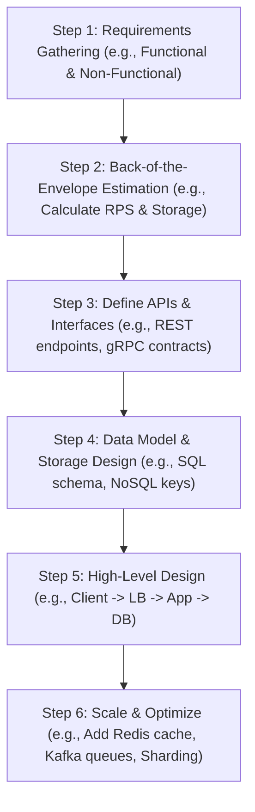

# Structured System Design Frameworks for Platform Engineers

Version: 1.0.0

Purpose: Canonical lesson structure for Platform Engineering & AI Infrastructure Curriculum.

# Lesson Overview

This lesson introduces structured methodologies and frameworks to approach, break down, and articulate complex system design problems during technical interviews and real-world platform engineering scenarios. It is essential because translating vague requirements into scalable, fault-tolerant infrastructure requires a repeatable, logical framework rather than ad-hoc guessing.

---

# Learning Objectives

* Define the core goals and structure of a system design interview or architectural planning session.
* Apply a structured framework (such as the PEDALS or RADIO framework) to systematically solve system design problems.
* Extract and classify functional and non-functional requirements from ambiguous prompts.
* Calculate rough back-of-the-envelope capacity estimations for compute, storage, and network bandwidth.
* Construct high-level architectures and drill down into specific component details while articulating trade-offs.

---

# Prerequisites

* **MOD-CLOUD-01 to MOD-CLOUD-04:** Solid understanding of cloud foundations (VPCs, IAM, Object Storage, FinOps).
* **MOD-K8S-01 to MOD-K8S-07:** Kubernetes engineering principles, including workloads, networking, storage, and autoscaling.
* **MOD-ADV-01 & MOD-ADV-02:** Knowledge of highly available multi-region topologies, distributed caching, and sharding.

---

# Why This Exists

Historically, software and infrastructure engineering interviews heavily emphasized algorithmic puzzle-solving (e.g., LeetCode) and trivia. However, as distributed systems became the norm, companies realized that knowing how to invert a binary tree rarely correlated with the ability to design a resilient microservices platform capable of handling millions of requests per second. The System Design Interview (SDI) emerged as a mechanism to evaluate an engineer's ability to handle ambiguity, design scalable systems, and articulate trade-offs. Frameworks for system design exist to prevent the "blank whiteboard paralysis," providing a step-by-step roadmap to navigate from a vague prompt (e.g., "Design YouTube") to a concrete architectural blueprint.

---

# Core Concepts

## System Design Interview Context
A system design interview or architectural review is an open-ended conversation. Unlike coding assessments, there is rarely a single "correct" answer. The goal is to evaluate your ability to:
- Handle ambiguity and ask clarifying questions.
- Understand the business constraints and scale.
- Propose an architecture and identify potential bottlenecks.
- Justify your engineering decisions based on trade-offs (e.g., consistency vs. availability, latency vs. throughput).

## The RADIO Framework
To navigate these open-ended problems, platform engineers use structured frameworks. One highly effective framework is **RADIO**:
- **R - Requirements:** Clarifying functional (what the system should do) and non-functional (scale, latency, availability) requirements.
- **A - Architecture (High-Level):** Drawing the 10,000-foot view (client -> load balancer -> API gateway -> services -> database).
- **D - Data Model & Storage:** Defining the database schema, storage systems, and caching layers.
- **I - Interface & APIs:** Defining the APIs (REST, gRPC, GraphQL) that components use to communicate.
- **O - Optimization & Scale:** Identifying bottlenecks, adding replication, sharding, caching, and multi-region failover.

## Gathering Requirements
Never jump straight into drawing boxes. Spend the first 10-15 minutes clarifying requirements.
- **Functional Requirements:** What features are in scope? (e.g., "Users can upload videos," "Users can view videos"). What is out of scope? (e.g., "We will not handle video recommendations for now.")
- **Non-Functional Requirements:** What are the constraints? (e.g., "The system must be highly available (99.99%)," "Video playback must have <200ms latency," "The platform should support 10 million daily active users.")

## Back-of-the-Envelope Estimations
Calculate the scale to justify your architectural choices.
- **Traffic Estimates:** Requests per second (RPS). (e.g., 10M DAU * 10 requests/day = 100M requests/day ≈ 1,200 RPS).
- **Storage Estimates:** How much data is generated daily/yearly? (e.g., 100K videos uploaded/day * 50MB/video = 5TB/day).
- **Bandwidth Estimates:** Ingress vs. Egress bandwidth.

## High-Level Architecture
Start simple. Draw the critical path from the user to the database. Use standard building blocks: DNS, CDNs, Load Balancers, API Gateways, Stateless Compute (Kubernetes), and Databases.

## Component Deep-Dive & Optimization
Once the high-level architecture is agreed upon, deep-dive into specific components. Discuss caching strategies (Redis/Memcached), database scaling (read replicas, sharding), asynchronous processing (Kafka/RabbitMQ), and resilience patterns (circuit breakers, rate limiting).

---

# Architecture

---

# Real-World Example

Consider a platform engineering team at Netflix designing a new microservice to track user watch history. If they started coding immediately, they might choose a standard relational database. However, by using a structured design framework, they first establish the **scale requirement** (millions of writes per second globally). This realization immediately rules out a single relational database. The framework guides them to estimate the storage (petabytes of time-series data) and choose a distributed NoSQL database (like Cassandra) optimized for high write throughput, coupled with Kafka for asynchronous event ingestion. The framework ensures the architecture matches the reality of the scale before any code is written.

---

# Hands-on Demonstration

**Scenario:** Design a URL Shortener (like bit.ly).

**Step 1: Requirements**
*   *Interviewer:* Design a URL shortener.
*   *Candidate:* (Clarifying) Functional: Create a short URL for a long URL. Redirect short URL to long URL. Non-functional: High availability, low latency redirection, read-heavy traffic.

**Step 2: Estimation**
*   *Candidate:* Let's assume 100M new URLs generated per month. Read/Write ratio of 100:1. This means 10B reads per month.
    *   Writes: 100M / (30 days * 24h * 3600s) ≈ 40 writes/sec.
    *   Reads: 10B / (30 days * 24h * 3600s) ≈ 4000 reads/sec.
    *   Storage (for 10 years): 100M * 12 months * 10 years * 500 bytes/URL = 6 Terabytes.

**Step 3: Data Model**
*   *Candidate:* We need a simple schema: `Hash (PK)`, `Original_URL`, `Creation_Date`, `User_ID`. Since the data size is 6TB and we need fast reads/writes without complex joins, a NoSQL store like DynamoDB or Cassandra is appropriate.

**Step 4: High-Level Architecture**
*   *Candidate:* 
    *   User -> DNS -> Load Balancer -> Web Servers (Stateless, auto-scaled in K8s).
    *   Web Servers -> Database.
    *   To handle the 4000 read RPS and reduce latency, we introduce a Distributed Cache (Redis) between the Web Servers and the Database.

**Step 5: Deep Dive & Scaling**
*   *Interviewer:* How do you generate the short URL hash without collisions?
*   *Candidate:* We can use a centralized Ticket Server or Snowflake ID generator to create a unique base-10 integer, then convert it to base-62 (A-Z, a-z, 0-9) for the short URL. To scale the cache, we can use an LRU eviction policy, since 20% of URLs likely generate 80% of the traffic (Pareto principle).

---

# Hands-on Lab

* **Objective:** Practice applying the RADIO framework to a hypothetical system design prompt.
* **Estimated Time:** 45 minutes
* **Difficulty:** Intermediate
* **Environment:** A whiteboard, digital drawing tool (Excalidraw, Miro), or a blank markdown document.

## Step-by-step Instructions

1. **Select a Prompt:** Choose one of the following prompts: "Design a Rate Limiter API," "Design a Distributed Key-Value Store," or "Design an Image Upload Service (like Instagram)."
2. **Apply the 'R' (Requirements):** Write down 3 clarifying questions you would ask the interviewer. Make up reasonable answers for them (both functional and non-functional).
3. **Apply the 'E' (Estimation):** Assuming 50 million daily active users (DAU), calculate the Requests Per Second (RPS) and the storage required for 1 year. Write down your math clearly.
4. **Apply the 'A' & 'D' (Architecture & Data):** Sketch a high-level architecture diagram. Define your primary database choice (SQL vs. NoSQL) and explain *why*.
5. **Apply the 'I' & 'O' (Interfaces & Optimization):** Identify the biggest bottleneck in your high-level design. Describe one specific technology or pattern (e.g., Caching, Sharding, Message Queue) you would introduce to mitigate it.

## Verification

Review your output against the core principles of the RADIO framework. Did you explicitly state your assumptions? Does your architecture realistically support the RPS you calculated?

## Troubleshooting

*   **Getting stuck on math:** Round numbers aggressively. Use 1 day ≈ 100,000 seconds (actually 86,400) to simplify mental math. 1 million requests / day = 10 requests / second.
*   **Drawing too early:** If you find yourself erasing your architecture repeatedly, you likely skipped the requirements gathering phase. Stop, go back, and write down the constraints.

## Cleanup

Save your diagram and notes to your portfolio or study repository for future review.

---

# Production Notes

*   **Frameworks are guides, not laws:** In a real interview or production design meeting, the conversation may flow non-linearly. Be prepared to jump from High-Level Design to a Deep Dive on a specific component if the interviewer requests it.
*   **Acknowledge trade-offs explicitly:** Never say "Cassandra is the best database for this." Say, "Cassandra provides excellent write throughput and high availability, which meets our requirements, but we trade off immediate consistency for eventual consistency."
*   **The "So What?" factor:** Estimations are useless if they don't influence the architecture. If you calculate 100 writes/sec, a single Postgres instance is fine. If you calculate 100,000 writes/sec, you must introduce sharding or queues. Always connect the math to a design decision.

---

# Common Mistakes

*   **Diving into code or architecture immediately:** This is the most common reason for failure in system design interviews. It signals a lack of seniority and an inability to deal with ambiguity.
*   **Trying to design the "perfect" system:** There is no perfect system. Every architectural choice introduces a new bottleneck. The goal is to design a system that meets the specific requirements of the prompt, not a system that can handle infinite scale.
*   **Using buzzwords without deep knowledge:** Don't propose Kafka or Kubernetes unless you can explain *how* they work and *why* they are necessary for the specific problem. Interviewers will drill into the technologies you mention.

---

# Failure-Driven Learning

**Scenario:** You are given the prompt "Design Twitter." You immediately jump to the whiteboard and draw a Client connecting to an API Gateway, which talks to a Post Service, a User Service, and a Postgres database. You proudly state you have designed Twitter.

**The Failure:** The interviewer asks, "What happens when Taylor Swift (with 100M followers) tweets? How does your system ensure all 100M followers see the tweet in their timeline quickly?"

**Diagnosis:** You designed a functional system, but failed to gather non-functional scale requirements. You assumed a standard "pull" model (users querying the database for tweets) would work for all users. At Twitter scale, this causes the database to instantly crash under the load of millions of concurrent reads.

**Recovery (Applying the Framework):**
1.  **Stop and Re-evaluate:** Acknowledge the oversight. "Ah, the fanout problem. You're right, querying the database on every timeline load won't scale for celebrity accounts."
2.  **Optimize (The 'O' in RADIO):** "To fix this, we need a hybrid approach. For normal users, we can use a 'push' model (Fanout-on-write), pushing their new tweets into the pre-computed Redis timeline caches of their followers. For celebrities (heavy users), we use a 'pull' model (Fanout-on-load), where followers pull the celebrity's tweets at read-time and merge them with their cached timeline." By using the framework, you've identified a massive bottleneck and proposed an industry-standard architectural solution.

---

# Engineering Decisions

The core of system design is navigating trade-offs. The CAP theorem (Consistency, Availability, Partition Tolerance) dictates that in a distributed system (which inherently has Partitions), you must choose between Consistency and Availability during a network failure.
*   **Banking System:** Consistency over Availability (CP). It is better to reject a transaction than to allow an inconsistent account balance.
*   **Social Media Feed:** Availability over Consistency (AP). It is better to show a slightly outdated feed than to show an error page.
Your ability to articulate *why* you are making these decisions is what separates junior engineers from senior platform architects.

---

# Best Practices

*   **Drive the conversation:** The interviewer is not there to interrogate you; they are there to collaborate. Treat it like a design session with a coworker. Propose ideas, ask for feedback, and articulate your thought process out loud.
*   **Start simple, then scale:** Design a system that works for 1,000 users first. Then ask, "What breaks if this goes to 1 million users?" and add components (caches, queues, read replicas) to solve the new bottlenecks.
*   **Know your fundamental building blocks:** You must deeply understand Load Balancers (L4 vs L7), Relational vs. NoSQL databases, Caching strategies (Write-through vs. Cache-aside), and Message Queues.

---

# Troubleshooting Guide

## Issue 1: Running out of time before completing the design.

*   **Cause:** Getting bogged down in irrelevant details or spending too much time calculating exact estimations.
*   **Diagnosis:** You are 30 minutes into a 45-minute interview and haven't drawn the high-level architecture yet.
*   **Solution:** Time-box your phases. Spend maximum 5-10 minutes on requirements and estimations. Announce your time management: "I'll do a quick estimation here and then move on to the high-level design to ensure we cover the whole system."

## Issue 2: The interviewer seems confused or is asking repetitive questions.

*   **Cause:** You are solving a different problem than the interviewer intended, likely due to skipping the requirements gathering phase.
*   **Diagnosis:** The interviewer keeps asking, "But what if the user wants to do X?" or "Are you sure that database can handle Y?"
*   **Solution:** Stop. Erase the board if necessary. Say, "It seems I may have misunderstood a core constraint. Let's revisit the requirements. Can we clarify the exact access patterns we are optimizing for?"

---

# Summary

System design frameworks like RADIO or PEDALS are essential tools for platform engineers to systematically decompose complex, ambiguous architectural problems. By rigidly adhering to a process that starts with clarifying requirements and calculating estimations before drawing a single box, engineers can design robust, scalable systems and confidently defend their architectural decisions based on objective data and trade-offs.

---

# Cheat Sheet

*   **RADIO Framework:** Requirements, Architecture (High-level), Data, Interfaces, Optimization/Scale.
*   **Capacity Estimations (Rules of Thumb):**
    *   1 byte = 8 bits
    *   1 million requests/day ≈ 12 requests/sec
    *   1 billion requests/month ≈ 400 requests/sec
    *   Read-heavy system: Use Caching + Read Replicas.
    *   Write-heavy system: Use Message Queues (Kafka) + Sharded NoSQL.
*   **Latency Numbers Every Engineer Should Know (Approximate):**
    *   L1 Cache reference: 0.5 ns
    *   Main memory read: 100 ns
    *   Read 1 MB sequentially from memory: 250 us
    *   Disk seek: 10 ms
    *   Read 1 MB sequentially from network: 10 ms
    *   Send packet CA to Netherlands to CA: 150 ms

---

# Knowledge Check

## Multiple Choice Questions

1. What is the primary purpose of using a framework like RADIO during a system design interview?
   * A) To ensure you write perfectly optimized code.
   * B) To provide a structured method to navigate ambiguous requirements and design scalable architectures.
   * C) To guarantee you select Kubernetes for every problem.
   * D) To memorize the architectures of large tech companies.

2. During back-of-the-envelope estimations, if a system processes 100 million requests per day, what is the approximate Requests Per Second (RPS)?
   * A) 100 RPS
   * B) 1,200 RPS
   * C) 10,000 RPS
   * D) 100,000 RPS

## Scenario Questions

You are asked to design a globally distributed leaderboard for a popular mobile game with 50 million DAU. You immediately suggest using a globally replicated SQL database to ensure every player sees their exact rank instantly. What phase of the system design framework did you skip, and what is the likely consequence?

## Short Answer Questions

Explain the difference between functional and non-functional requirements in the context of system design.

<b>View Answers</b>

### Multiple Choice
1. **[B]** - *Frameworks prevent you from jumping to conclusions and provide a logical path from vague prompt to concrete architecture.*
2. **[B]** - *100,000,000 / (24 hours * 60 minutes * 60 seconds) ≈ 1,157 RPS, which rounds to 1,200 RPS.*

### Scenario
*You skipped the Requirements and Estimation phases. By not defining the non-functional requirements (massive write throughput and read scale), you proposed an architecture (synchronous, globally replicated SQL) that will suffer from severe write latency, lock contention, and likely collapse under the load of 50M daily active users. A distributed NoSQL or in-memory Redis cluster (using Sorted Sets) would be more appropriate after calculating the actual scale.*

### Short Answer
*Functional requirements define what the system must explicitly do (e.g., "Users can upload photos", "Users can like a post"). Non-functional requirements define the constraints and scale under which the system must operate (e.g., "The system must have 99.99% availability", "Upload latency must be under 500ms", "Supports 10M concurrent users").*

---

# Interview Preparation

## Beginner Questions

* What are the five standard steps of a system design interview framework?
* Why is it important to perform back-of-the-envelope estimations before designing the architecture?

## Intermediate Questions

* How do you handle a situation where the interviewer gives you a very vague prompt like "Design an ATM"?
* Explain the CAP theorem and how it influences your choice of database during the 'Data Model' phase of a design.

## Advanced Questions

* In a high-throughput system, how do you decide between a message queue (like Kafka) and a distributed cache (like Redis) for handling spikes in traffic?
* Walk through the trade-offs of using API Gateways vs. direct client-to-microservice communication in your high-level design.

## Scenario-Based Discussions

* Scenario: Design a system that handles 10,000 file uploads per second. Detail your requirement gathering process and the initial high-level architecture.

<b>View Answers</b>

### Beginner
* **What are the five standard steps...**: Requirements (Functional/Non-Functional), Estimation (Scale, Throughput, Storage), High-Level Architecture, Data Model/Storage Design, and Scaling/Deep-Dive (Optimization).
* **Why is it important to perform back-of-the-envelope...**: Estimations dictate the architectural constraints. An architecture designed for 100 RPS (e.g., a single SQL server) will fail catastrophically if the actual requirement is 100,000 RPS (requiring queues, caching, and sharding).

### Intermediate
* **How do you handle a situation where...**: Use the Requirements gathering phase to ask clarifying questions. Define the user personas, the core features in scope, and the expected scale. Do not start designing until the ambiguity is resolved into concrete constraints.
* **Explain the CAP theorem and how it...**: CAP states a distributed system can only provide two of Consistency, Availability, and Partition Tolerance. Since network partitions (P) are inevitable, you must choose between Consistency (C) (rejecting requests to ensure data is accurate) and Availability (A) (serving requests even if data might be stale).

### Advanced
* **In a high-throughput system, how do you decide...**: Use a message queue (Kafka) for asynchronous, durable processing where decoupling producers and consumers is required (e.g., event sourcing, processing uploads). Use a distributed cache (Redis) for low-latency, synchronous reads of frequently accessed data to offload database pressure.
* **Walk through the trade-offs of using API Gateways...**: API Gateways provide a single entry point, handling cross-cutting concerns (auth, rate limiting, SSL termination) but introduce a single point of failure and potential latency. Direct communication reduces latency and infrastructure overhead but forces clients to handle service discovery, auth, and complex routing logic directly.

### Scenario-Based Discussions
* **Scenario: Design a system that handles 10,000 file uploads...**:
  * *Requirements:* What is the average file size? Who is uploading? Do files need immediate processing?
  * *Architecture:* Client -> Load Balancer -> API Gateway -> Ingestion Service (Stateless K8s) -> Object Storage (S3).
  * *Optimization:* To handle 10k/sec, the Ingestion Service should immediately return a 202 Accepted and drop a message in Kafka. Background workers will process the file upload asynchronously to prevent blocking synchronous HTTP threads.

---

# Further Reading

1. [Grokking the System Design Interview](https://www.educative.io/courses/grokking-the-system-design-interview)
2. [Designing Data-Intensive Applications by Martin Kleppmann](https://dataintensive.net/)
3. [The System Design Primer (GitHub)](https://github.com/donnemartin/system-design-primer)
4. [AWS Architecture Center](https://aws.amazon.com/architecture/)
5. [ByteByteGo System Design Framework](https://bytebytego.com/)
