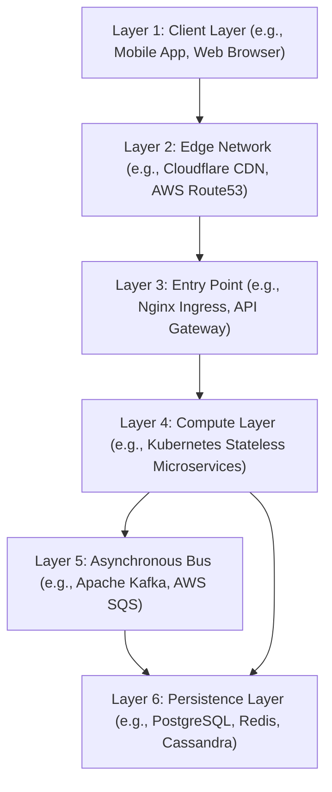

# Whiteboard Architecture Scenarios & Trade-off Decisions

Version: 1.0.0

Purpose: Canonical lesson structure for Platform Engineering & AI Infrastructure Curriculum.

# Lesson Overview

This lesson provides practical exposure to common whiteboard architecture scenarios encountered in senior platform engineering interviews. We will explore how to design large-scale systems, dynamically justify architectural choices, and confidently pivot your design when business constraints change. This is essential because platform engineers must navigate a landscape where every decision—whether database selection, caching strategy, or multi-region deployment—has profound implications on cost, latency, and reliability.

---

# Learning Objectives

* Diagram a scalable architecture for a highly available, read-heavy system (e.g., a Content Delivery platform or Social Feed).
* Diagram a scalable architecture for a write-heavy, transactional system (e.g., Payment Gateway or IoT telemetry).
* Evaluate and articulate the trade-offs between SQL (Relational), NoSQL (Document/Wide-Column), and caching databases in different scenarios.
* Identify single points of failure in an architecture and apply redundancy patterns (e.g., Active-Active multi-region deployments, circuit breakers).

---

# Prerequisites

* **MOD-CAR-01:** Structured System Design Frameworks for Platform Engineers.
* **MOD-CLOUD-03:** Cloud Object Storage & Highly Available Architectures.
* **MOD-ADV-02:** Distributed Caching, Sharding & High-Throughput Architectures.

---

# Why This Exists

Whiteboarding is not just an interview tactic; it is the daily language of engineering leadership. Before a team spends six months writing Terraform and Kubernetes manifests, the architecture must be debated, scrutinized, and validated on a whiteboard. These scenarios exist to test an engineer's ability to foresee systemic failures before they occur in production. The ability to articulate trade-offs—why you chose Cassandra over PostgreSQL, or why you introduced Kafka instead of synchronous API calls—demonstrates true architectural maturity and prevents costly infrastructure migrations later.

---

# Core Concepts

## The Nature of Trade-offs
There are no perfect architectures, only optimized trade-offs. When evaluating a system, engineers must constantly balance:
- **Latency vs. Accuracy:** Do you serve stale data quickly from a cache, or wait for the database to guarantee accuracy?
- **Consistency vs. Availability (CAP Theorem):** During a network partition, do you reject writes to maintain consistency, or accept writes and risk conflicting data?
- **Simplicity vs. Scalability:** A monolithic Postgres database is simple to manage but hard to scale globally. A sharded Cassandra cluster scales infinitely but introduces massive operational complexity.

## Scenario 1: The Read-Heavy System (e.g., Twitter Timeline, Netflix Catalog)
**Characteristics:** Read/Write ratio is highly skewed (e.g., 1000:1). The data must be served with extremely low latency.
**Architectural Solutions:**
- Aggressive caching at every layer (CDN for static assets, Redis/Memcached for dynamic queries).
- Read replicas for relational databases.
- "Fanout-on-write" patterns, where writes are pre-computed and pushed into the caches of users who will read them later.

## Scenario 2: The Write-Heavy System (e.g., IoT Telemetry, Financial Transactions)
**Characteristics:** Massive influx of data that must be ingested without dropping requests.
**Architectural Solutions:**
- Decoupling ingestion from processing using Message Queues (Kafka, RabbitMQ, SQS).
- Append-only datastores (Time-Series Databases, Cassandra) that optimize for write throughput.
- Batch processing: grouping thousands of small writes into a single large write to reduce database I/O overhead.

## Scenario 3: The Highly Consistent System (e.g., Payment Gateways, Inventory Management)
**Characteristics:** Data accuracy is paramount. Over-selling an item or losing a transaction is unacceptable.
**Architectural Solutions:**
- ACID-compliant Relational Databases (PostgreSQL, MySQL).
- Distributed transactions (Two-Phase Commit, Saga Pattern) when crossing microservice boundaries.
- Idempotency keys to prevent duplicate transactions during network retries.

## Navigating the Whiteboard Session
- **Think Out Loud:** Silence is deadly. Even if you are unsure, talk through your thought process. "I'm considering Redis here to reduce latency, but I need to think about how we handle cache invalidation..."
- **Draw Cleanly:** Use standard symbols. Cylinders for databases, rectangles for services, clouds for CDNs. Label your lines with the protocol (e.g., REST, gRPC, Kafka).
- **Embrace the Pivot:** Interviewers will intentionally throw a wrench in your design. ("What if the data grows by 100x tomorrow?"). Do not get defensive. Acknowledge the bottleneck and adapt the architecture.

---

# Architecture

---

# Real-World Example

**The Slack Migration:** In its early days, Slack's backend was heavily reliant on a monolithic MySQL database. As their enterprise user base exploded, the read load on MySQL for chat history became unsustainable, causing frequent outages. Instead of trying to scale the unscalable, they made a massive architectural trade-off: they migrated the core messaging data to Vitess (a database clustering system for horizontal scaling of MySQL). This introduced significant operational complexity but was a necessary trade-off to achieve the scale and read/write throughput required by millions of concurrent enterprise users.

---

# Hands-on Demonstration

**Scenario: Design a Ride-Sharing App (Uber/Lyft).**

**Interviewer Prompt:** "Design the backend for a ride-sharing app. Focus on the core mechanism of matching a rider with nearby drivers."

**Step 1: Clarifying Requirements**
*   *Candidate:* Are we focusing on global scale?
*   *Interviewer:* Yes, 1 million active drivers globally.
*   *Candidate:* Are we designing billing and user profiles?
*   *Interviewer:* No, just the location tracking and matching system.

**Step 2: Identifying the Bottleneck**
*   *Candidate:* The hardest part is tracking 1 million drivers updating their GPS location every 3-5 seconds. That's up to 330,000 writes per second. A standard relational DB will melt.

**Step 3: Proposing the Trade-off (The Whiteboard Pivot)**
*   *Candidate:* We cannot write every GPS ping to PostgreSQL synchronously.
    *   *Trade-off Decision:* I propose we use an in-memory spatial index (like Redis with Geo-hashing) for the real-time driver locations to handle the massive read/write throughput for matching.
    *   *Interviewer:* What happens when Redis crashes? We lose driver locations.
    *   *Candidate:* Good point. We trade durability for speed here. To mitigate this, we simultaneously drop the raw GPS pings into a Kafka queue. A background worker reads from Kafka and persists the data to a durable, append-only store like Cassandra for analytics and ride history. If Redis crashes, drivers just send their next ping 3 seconds later, repopulating the spatial index almost immediately.

**Step 4: The Matching Service**
*   *Candidate:* When a rider requests a ride, the Rider Service hits the Spatial Index (Redis) to find the nearest drivers, then sends a push notification via WebSockets to those drivers.

---

# Hands-on Lab

* **Objective:** Practice whiteboarding a trade-off decision for a given scenario.
* **Estimated Time:** 30 minutes
* **Difficulty:** Advanced
* **Environment:** A whiteboard or digital drawing tool.

## Step-by-step Instructions

1. **The Scenario:** You are designing a flash-sale e-commerce site (e.g., Ticketmaster). At exactly 12:00 PM, 10 million users will attempt to buy 50,000 available tickets.
2. **Design Option A (The Naive Approach):** Draw an architecture where users hit a Load Balancer -> Web Server -> PostgreSQL database.
3. **Analyze the Failure:** Write down exactly what will happen to Option A at 12:00:01 PM. (Hint: Database connection exhaustion, lock contention, immediate crash).
4. **Design Option B (The Queued Approach):** Redraw the architecture. This time, insert an API Gateway and a Message Queue (e.g., Kafka or SQS) between the Web Server and the Database.
5. **Articulate the Trade-off:** Write a short paragraph explaining the trade-off. What did you sacrifice (e.g., synchronous response times, user experience) to gain (e.g., system stability, zero dropped requests)?

## Verification

Compare your Option B to industry standards. Did you decouple the synchronous user request from the asynchronous database write? If you used a queue, does the user receive an immediate "Order Pending" status rather than a final "Order Confirmed"?

## Troubleshooting

*   **If you struggle with the queue concept:** Remember that a queue acts as a shock absorber. It absorbs the massive spike in traffic and slowly feeds it to the database at a rate the database can safely handle.

## Cleanup

Document your Option B architecture and your trade-off paragraph in your study notes.

---

# Production Notes

*   **Database Selection is Everything:** 80% of system design bottlenecks are at the data layer. Deeply understand the difference between scaling a stateless application (easy: add more pods) and scaling a stateful database (hard: sharding, replication lag, split-brain).
*   **The Cost of Microservices:** Don't default to microservices on the whiteboard without acknowledging the tax. Microservices introduce network latency, complex debugging (requiring distributed tracing), and the need for robust CI/CD. Sometimes a well-structured modular monolith is the correct architectural choice for a startup.
*   **Beware of "Resume Driven Development":** In an interview, don't use cutting-edge technology just to sound smart. Proposing a complex Service Mesh (Istio) for a simple three-tier architecture will signal to a senior interviewer that you over-engineer solutions.

---

# Common Mistakes

*   **Failing to define primary keys and indexing strategies:** When discussing databases, interviewers expect you to know *how* data is queried. If you choose DynamoDB, you must be able to explain your Partition Key and Sort Key strategy.
*   **Assuming networks are reliable:** A common rookie mistake is drawing a synchronous HTTP call between two internal microservices and assuming it will always succeed. A senior engineer will immediately point out: "What if Service B is down or timing out?" You must incorporate retries, timeouts, and circuit breakers (e.g., Envoy/Istio).
*   **Ignoring data growth:** Designing a system that works for 1 TB of data is useless if the system generates 1 TB of data every day. You must discuss data lifecycle policies (e.g., moving cold data from SSDs to S3 Glacier).

---

# Failure-Driven Learning

**Scenario:** You are whiteboarding a stock trading platform. To ensure high availability across the globe, you propose an Active-Active multi-region PostgreSQL cluster spanning US-East and EU-West, using synchronous replication.

**The Failure:** The interviewer smiles and says, "Okay, a user in New York buys a stock. How long does the transaction take to commit?"

**Diagnosis:** You failed to account for the speed of light. Synchronous replication requires the transaction to be written in New York, sent across the Atlantic Ocean to Europe, written in Europe, and an acknowledgment sent back across the ocean before the transaction is finalized. This introduces ~100-150ms of network latency to *every single write*, effectively destroying the throughput of a high-frequency trading platform.

**Recovery:**
1.  **Acknowledge the physics:** "You're right. Synchronous replication across oceans will cripple our write throughput due to latency."
2.  **Pivot the design:** "We must trade off global immediate consistency for regional performance. I would redesign this to use Active-Passive replication across regions, or shard the database by geography. US users write to the US primary, EU users write to the EU primary, and we use asynchronous replication between the regions for disaster recovery."

---

# Engineering Decisions

When to use caching (and when NOT to):
*   **Pro-Cache:** Caching (Redis/Memcached) drastically reduces read latency and protects databases from read-heavy traffic spikes.
*   **Anti-Cache:** Caching introduces a massive problem: Cache Invalidation. If your data changes rapidly and users must always see the absolute latest state (e.g., financial balances), a cache can serve dangerously stale data. In these cases, it is often a better engineering decision to scale the primary database (via read replicas) rather than introduce a complex caching layer.

---

# Best Practices

*   **Establish a baseline:** Before proposing complex solutions, define the simplest possible architecture that works.
*   **Use the "But..." transition:** Whenever you introduce a technology, follow it with a "But...". Example: "We will use Kafka to decouple the services. *But* this means we have to handle at-least-once delivery semantics, so our consumer services must be idempotent."
*   **Quantify your decisions:** Don't say "It will be faster." Say "By introducing a CDN, we can reduce latency for static assets from 200ms to 20ms for global users."

---

# Troubleshooting Guide

## Issue 1: The interviewer says "I don't like that database choice."

*   **Cause:** You may have chosen a technology that is poorly suited for the data access pattern, or the interviewer is testing your ability to defend your choice.
*   **Diagnosis:** Ask directly: "Are you concerned about the write throughput, the operational complexity, or the consistency model of this database?"
*   **Solution:** Once they clarify their concern (e.g., "Postgres can't handle 100k writes/sec"), pivot smoothly. "I agree, if write throughput exceeds 100k/sec, we should transition to a partitioned NoSQL solution like Cassandra."

## Issue 2: You draw a blank when asked to scale a specific component.

*   **Cause:** You are trying to memorize architectures rather than applying fundamental scaling principles.
*   **Diagnosis:** You are staring at a bottleneck (e.g., a single API gateway) and don't know what to draw next.
*   **Solution:** Fall back to the fundamental axes of scaling:
    1.  **Vertical Scaling:** "We can increase the CPU/RAM on this node."
    2.  **Horizontal Scaling:** "We can add more nodes behind a load balancer."
    3.  **Caching:** "We can serve the data from memory before it hits the node."
    4.  **Asynchronous processing:** "We can move this work to a background queue."

---

# Summary

Mastering whiteboard architecture scenarios requires moving beyond rote memorization of system designs. It requires a deep understanding of engineering trade-offs. By recognizing the patterns of read-heavy vs. write-heavy systems, acknowledging the constraints of the CAP theorem, and confidently pivoting designs when bottlenecks are exposed, platform engineers demonstrate the senior-level judgment necessary to design resilient, production-grade cloud infrastructure.

---

# Cheat Sheet

*   **Read-Heavy Design:** CDN -> Load Balancer -> Caching Layer (Redis) -> Read Replicas (SQL).
*   **Write-Heavy Design:** Load Balancer -> API Gateway -> Message Queue (Kafka) -> Append-Only Store (Cassandra) or Batch Processing.
*   **High Consistency Design:** ACID Relational DB (PostgreSQL), strict synchronous replication (within a single region), distributed locking.
*   **The 3 Axes of Scaling (Scale Cube):**
    *   X-Axis: Horizontal duplication (Cloning instances behind a LB).
    *   Y-Axis: Functional decomposition (Splitting a monolith into microservices).
    *   Z-Axis: Data partitioning (Sharding the database by user ID or region).

---

# Knowledge Check

## Multiple Choice Questions

1. When designing a system that must ingest massive amounts of telemetry data from IoT devices, which architectural pattern is most appropriate to protect the backend database?
   * A) Using a single, massive PostgreSQL instance with synchronous replication.
   * B) Implementing an API Gateway that drops messages directly into a Message Queue (like Kafka) for asynchronous processing.
   * C) Forcing all IoT devices to write directly to a Redis cache.
   * D) Using a distributed file system to store every ping as a separate file.

2. According to the CAP theorem, if a network partition occurs between your database nodes, what trade-off must you make?
   * A) You must choose between Consistency and Availability.
   * B) You must choose between Latency and Throughput.
   * C) You must choose between Relational and NoSQL models.
   * D) You must shut down the system immediately.

## Scenario Questions

You are designing a globally distributed social media feed. A user in Tokyo posts a photo, and their follower in London wants to view it. To minimize latency for the London user, you decide to use Active-Active multi-region database replication. What is the primary trade-off and potential risk of this decision?

## Short Answer Questions

What is the concept of "Idempotency," and why is it critical when using message queues like Kafka or SQS?

<b>View Answers</b>

### Multiple Choice
1. **[B]** - *A message queue acts as a shock absorber, decoupling the massive influx of write requests from the database and preventing connection exhaustion.*
2. **[A]** - *The CAP theorem dictates that in the presence of a network partition (P), a system must choose between being Consistent (C) or Available (A).*

### Scenario
*The primary trade-off is eventual consistency and conflict resolution complexity. Because writes happen in multiple regions concurrently, if the Tokyo user edits the photo at the exact millisecond the London user likes the photo, you create a split-brain scenario. Active-Active setups require complex conflict resolution mechanisms (like CRDTs or Last-Write-Wins timestamps) and you accept that users in different regions may temporarily see different states of the data.*

### Short Answer
*Idempotency means that an operation produces the same result whether it is executed once or multiple times. It is critical with message queues because distributed systems guarantee "at-least-once" delivery, meaning a consumer might process the same message twice due to network retries. An idempotent system ensures a duplicate "charge credit card" message does not result in a double charge.*

---

# Interview Preparation

## Beginner Questions

* Describe the difference between horizontal scaling (scaling out) and vertical scaling (scaling up).
* What is a Content Delivery Network (CDN) and when would you use it?

## Intermediate Questions

* Walk through the architecture of a flash-sale ticketing system. How do you prevent over-selling tickets without locking the entire database?
* Explain the trade-offs between using a Relational Database (SQL) versus a Document Database (MongoDB) for an e-commerce product catalog.

## Advanced Questions

* How would you design a distributed rate limiter for a public API gateway spanning multiple global regions?
* Discuss the challenges of database sharding. How do you handle cross-shard joins and "hot spots" (where one shard receives disproportionate traffic)?

## Scenario-Based Discussions

* Scenario: You are tasked with migrating a monolithic application to microservices. The application currently relies on complex, cross-table SQL joins. Detail your strategy for decoupling the database and handling data consistency across the new microservices.

<b>View Answers</b>

### Beginner
* **Describe the difference between...**: Vertical scaling means adding more power (CPU, RAM) to a single machine; it has a hard hardware limit. Horizontal scaling means adding more machines to a pool (via a load balancer); it allows for near-infinite scale but requires distributed system architecture.
* **What is a Content Delivery Network...**: A CDN is a globally distributed network of proxy servers. It is used to cache static assets (images, CSS, video) closer to the user, drastically reducing latency and offloading traffic from the origin servers.

### Intermediate
* **Walk through the architecture of a flash-sale...**: Use a queue to handle the massive influx of requests. To prevent overselling without a global lock, pre-allocate ticket inventory into a fast, single-threaded in-memory store like Redis (using Lua scripts for atomic decrements). Once Redis says a ticket is reserved, drop a message in a queue for the slower PostgreSQL database to finalize the transaction.
* **Explain the trade-offs between using a Relational...**: SQL offers strict schema enforcement and ACID transactions, perfect for order processing but harder to scale horizontally. MongoDB offers flexible schemas, allowing product attributes to vary widely without complex migrations, but lacks built-in complex transactional support across multiple documents.

### Advanced
* **How would you design a distributed rate limiter...**: Use a centralized, low-latency datastore like Redis (using a Token Bucket or Sliding Window Log algorithm). For multi-region, use a hybrid approach: local in-memory rate limiting on the API Gateways (Envoy) synchronized asynchronously with a global Redis cluster to balance low latency with global enforcement.
* **Discuss the challenges of database sharding...**: Cross-shard joins are generally impossible; you must denormalize data or perform joins in application code. Hot spots occur when the shard key results in uneven distribution (e.g., sharding by user ID, and Justin Bieber signs up). You mitigate hot spots by using consistent hashing or compound shard keys.

### Scenario-Based Discussions
* **Scenario: You are tasked with migrating a monolithic...**:
  * *Strategy:* You cannot migrate the code before migrating the data. First, logically separate the data within the monolith (creating boundaries). Next, apply the "Database-per-Service" pattern. For cross-table joins, we must move to API composition (the API gateway queries both services and merges the data) or use CQRS (Command Query Responsibility Segregation) and an event bus (Kafka) to build materialized read-views that contain the joined data asynchronously.

---

# Further Reading

1. [CAP Theorem Explained (IBM)](https://www.ibm.com/topics/cap-theorem)
2. [Building Microservices by Sam Newman](https://samnewman.io/books/building_microservices/)
3. [AWS: Architecture Patterns for Highly Available Systems](https://aws.amazon.com/architecture/)
4. [Discord's Migration from MongoDB to Cassandra to ScyllaDB](https://discord.com/category/engineering)
5. [The Scale Cube (Abbott & Fisher)](https://microservices.io/articles/scalecube.html)
