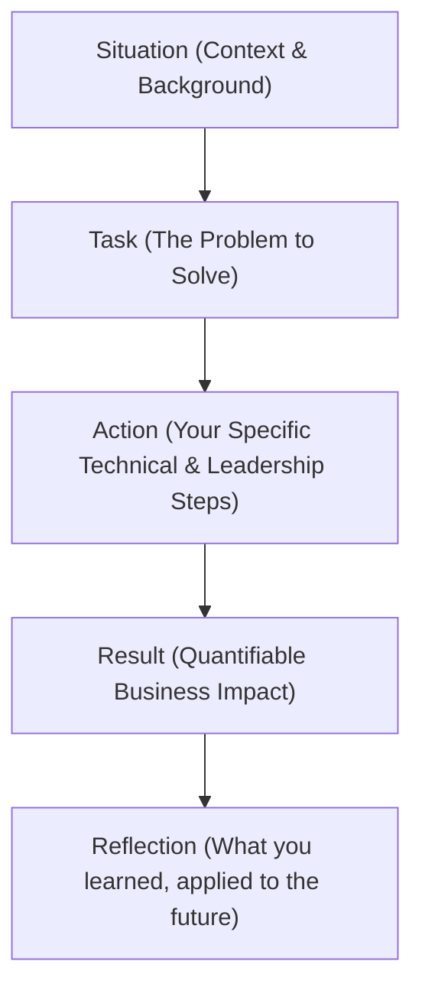

# Behavioral Engineering Interviews & Engineering Communication

Version: 1.0.0

Purpose: Canonical lesson structure for Platform Engineering & AI Infrastructure Curriculum.

# Lesson Overview

This lesson prepares platform engineers for the behavioral and leadership rounds of technical interviews, and equally importantly, for the daily communication required of senior engineers. It focuses on articulating complex engineering decisions, demonstrating ownership, handling conflict, and using structured frameworks to communicate past experiences effectively. It is essential because brilliant architecture is useless if you cannot convince your team to build it, or if you fail the "culture fit" interview due to poor communication.

---

# Learning Objectives

* Apply the STAR (Situation, Task, Action, Result) method to structure answers about past engineering experiences logically and concisely.
* Translate complex technical challenges and infrastructure metrics into business impact for non-technical stakeholders.
* Demonstrate engineering leadership, empathy, and ownership when responding to scenario-based behavioral questions.
* Navigate and resolve questions regarding technical disagreements, blameless culture, and conflict resolution within engineering teams.

---

# Prerequisites

* **MOD-SRE-03:** Structured Blameless Postmortems & Root Cause Analysis (RCA).
* **MOD-CAR-01:** Structured System Design Frameworks for Platform Engineers.
* General experience working within a software development or platform engineering team.

---

# Why This Exists

The higher you climb in engineering, the less your code matters, and the more your communication matters. Staff and Principal Platform Engineers spend the majority of their time writing Request for Comments (RFCs), mentoring juniors, and aligning engineering initiatives with business goals. Historically, engineers viewed behavioral interviews as "soft" or unimportant compared to the system design round. However, companies like Amazon (Leadership Principles) and Google (Googlyness) heavily index on behavioral signals. They know that a brilliant jerk destroys team velocity faster than a mediocre coder. This lesson exists to formalize engineering communication as a hard skill.

---

# Core Concepts

## The Behavioral Interview
Behavioral interviews operate on the premise that past behavior is the best predictor of future behavior. Interviewers will prompt you with, "Tell me about a time when..." They are looking for specific signals:
- **Ownership:** Did you wait for permission, or did you identify a problem and solve it?
- **Bias for Action:** Did you get stuck in analysis paralysis, or did you ship an MVP?
- **Disagree and Commit:** How do you handle it when the team chooses an architecture you disagree with?
- **Empathy & Mentorship:** How do you treat junior engineers who make mistakes?

## The STAR Method
The standard framework for answering behavioral questions is STAR. It prevents rambling and ensures you highlight your specific contributions.
- **Situation:** Set the scene and provide context (Keep it brief - 10%). *Example: "At my last company, our Kubernetes cluster was experiencing random OOM kills during peak traffic."*
- **Task:** Describe your specific responsibility or the challenge (Keep it brief - 10%). *Example: "I was tasked with stabilizing the cluster before the Black Friday sale."*
- **Action:** Describe exactly what *you* did (The meat of the answer - 60%). Use "I", not "We". *Example: "I implemented Datadog for granular memory profiling, identified a memory leak in the Go service, and rewrote the pod resource requests/limits."*
- **Result:** Describe the outcome, quantifying the impact if possible (Crucial - 20%). *Example: "As a result, we reduced OOM kills by 99% and handled 3x the Black Friday traffic with zero downtime."*

## Communicating Business Impact
Engineers often focus solely on the technical achievement. To pass a senior behavioral interview, you must link the technical fix to the business. 
- *Weak:* "I migrated our CI/CD from Jenkins to GitHub Actions." (So what?)
- *Strong:* "I migrated our CI/CD to GitHub Actions, which reduced build times by 40%, saving the engineering team an estimated 200 hours per month and accelerating our feature delivery to customers."

## Navigating Technical Conflict
Conflict is inevitable in platform engineering (e.g., choosing Terraform vs. Pulumi, pushing for a microservices migration). Interviewers want to see that you argue based on data and trade-offs, not ego. You must demonstrate the ability to disagree professionally, rely on POCs (Proof of Concepts) or data to break ties, and commit fully to the team's decision even if you lost the argument.

---

# Architecture

---

# Real-World Example

**The Outage Response:** A senior platform engineer is interviewing at a major tech company. The interviewer asks, "Tell me about a time you caused a critical failure."
A junior engineer might try to shift the blame: "A junior dev pushed bad code and I had to fix it."
The senior engineer uses STAR and ownership: "I accidentally deleted a production routing table, causing a 10-minute outage for a major client. (Situation/Task). I immediately engaged incident response, rolled back the Terraform state, and restored service. Afterward, instead of hiding it, I wrote a blameless postmortem and implemented a new CI/CD check requiring two approvals for routing changes (Action). We never had that specific outage again, and the team adopted my postmortem template (Result)." This shows extreme ownership and system-level thinking.

---

# Hands-on Demonstration

**Scenario:** Preparing a STAR response for a common interview question.

**Question:** "Tell me about a time you had a technical disagreement with a colleague. How did you resolve it?"

**Drafting the Response (Internal Monologue):**
*   *Situation:* My lead wanted to use MongoDB for our new transactional billing system. I strongly believed we needed PostgreSQL because it required ACID compliance.
*   *Task:* I needed to convince the lead to change the architecture without causing a personal conflict, ensuring the billing system wouldn't lose money.
*   *Action:* Instead of arguing in meetings, I built a quick Proof of Concept (POC) in both databases. I ran a load test simulating concurrent transactions. I documented the results in an RFC (Request for Comments), highlighting that MongoDB (at the time) struggled with our specific multi-document transaction requirements, while Postgres handled them natively. I presented the data objectively to the team.
*   *Result:* The data spoke for itself. The lead agreed with the findings, we pivoted to Postgres, and the billing system launched successfully, processing $5M in its first month with zero data anomalies.

**Delivery:** The candidate now speaks this aloud, maintaining a professional tone, emphasizing the data-driven approach rather than "I was right, he was wrong."

---

# Hands-on Lab

* **Objective:** Draft and refine two high-impact STAR stories.
* **Estimated Time:** 45 minutes
* **Difficulty:** Beginner
* **Environment:** A blank document or text editor.

## Step-by-step Instructions

1. **Identify the Core Stories:** Think of two defining moments in your career:
    *   Story 1: A time you solved a complex technical problem.
    *   Story 2: A time you failed, made a mistake, or caused an outage.
2. **Draft Story 1 (The Success):** Using the STAR framework, write out your response. Specifically, force yourself to quantify the "Result" (e.g., reduced latency by X, saved $Y in cloud costs, decreased deployment time by Z%).
3. **Draft Story 2 (The Failure):** Write out your response. The "Action" must focus on *how you recovered* and the "Result" must focus on *the systemic safeguard you put in place* to ensure it never happens again. Do not blame others.
4. **The "So What?" Test:** Read both stories aloud. After the Result, ask yourself, "So what? Why does the business care?" If the business impact isn't obvious, rewrite the Result.

## Verification

Review your stories against these criteria:
* Are they under 3 minutes when spoken aloud?
* Do you use "I" instead of "We" when describing the Actions?
* Is there a clear, quantifiable business result?

## Troubleshooting

*   **"I don't have quantifiable metrics":** If you don't know the exact dollar amount, use percentages (e.g., "Reduced manual toil by roughly 50%"). Or focus on time saved (e.g., "Saved the team 5 hours a week").
*   **Rambling Context:** If your "Situation" takes more than 30 seconds to explain, you are providing too much technical backstory. Cut it down to the bare essentials.

## Cleanup

Save these stories in a master "Brag Document" that you review before every interview.

---

# Production Notes

*   **The "We" vs. "I" Trap:** Platform engineering is a team sport, so engineers naturally say "We migrated to Kubernetes." Interviewers hate this because they don't know what *you* did. You must say, "The team migrated to K8s. *My specific role* was to write the Helm charts and configure the ingress controllers."
*   **The Blameless Culture Signal:** When discussing past companies or coworkers, never speak negatively. If you say, "My last boss was an idiot who didn't understand cloud," the interviewer assumes *you* are difficult to work with. Frame it objectively: "The organization had a more traditional, risk-averse culture regarding cloud adoption."
*   **Curiosity over Ego:** The strongest signal of a senior engineer is the phrase, "I don't know the answer to that, but here is how I would find out." Faking technical knowledge in a behavioral or system design interview is an instant rejection.

---

# Common Mistakes

*   **Memorizing scripts:** Do not memorize your STAR stories word-for-word. You will sound robotic, and if the interviewer interrupts you, you will lose your place. Memorize the bullet points (the S, T, A, R) and let the delivery be conversational.
*   **Focusing entirely on the tech:** Answering a behavioral question with a 5-minute deep dive into B-Tree indexing completely misses the point of the question, which was likely about communication or project management.
*   **The "Fake Weakness":** When asked "What is your biggest weakness?", saying "I work too hard" or "I'm a perfectionist" is a cliché that interviewers despise. Give a real weakness and the system you use to mitigate it. (e.g., "I sometimes get tunnel vision on optimizing code. To mitigate this, I heavily rely on time-boxing my research and checking in with my PM to ensure I'm still aligned with business priorities.")

---

# Failure-Driven Learning

**Scenario:** During an interview for a Staff Platform Engineer role, you are asked, "Tell me about a time a project you led failed." You answer: "I was tasked with rolling out ArgoCD. The developers were too set in their ways and refused to learn the new GitOps workflow, so adoption stalled and management killed the project. You can't force people to change."

**The Failure:** You just signaled a complete lack of leadership, empathy, and ownership. You blamed the developers (the platform's customers) and threw up your hands.

**Diagnosis:** You failed to recognize that Platform Engineering is a product, and developers are the customers. If they didn't adopt it, the product (or the rollout strategy) failed.

**Recovery (The Reframed Answer):**
"I led the rollout of ArgoCD. Technically, the implementation was perfect, but adoption stalled at 10%. (Situation/Task). I realized I had failed to consider the Developer Experience. I assumed they would read the docs. I took ownership of the poor rollout. I scheduled 1-on-1s with the lead devs, realized the mental overhead was too high, and built an internal CLI tool that abstracted the ArgoCD YAML away from them (Action). Within a month, we hit 80% adoption because I lowered the barrier to entry (Result). I learned that in platform engineering, empathy for the developer is just as important as the infrastructure code."

---

# Engineering Decisions

Behavioral interviews are heavily indexed on how you make engineering decisions.
*   **Data-Driven vs. Intuition:** You must show that your decisions are backed by data (POCs, metrics, load tests), not just "gut feeling" or "I read a blog post that said Kubernetes is good."
*   **One-Way vs. Two-Way Doors:** (An Amazon concept). A two-way door is a reversible decision (e.g., trying a new linting tool). You should make these fast. A one-way door is irreversible (e.g., migrating from AWS to GCP). You must show deliberate, careful analysis for one-way door decisions.

---

# Best Practices

*   **Listen to the prompt:** Ensure you are actually answering the question asked. If they ask about conflict, don't tell a story about a technical bug unless it caused a conflict.
*   **Keep it conversational:** A behavioral interview should feel like a discussion with a peer at a coffee shop.
*   **Prepare questions for them:** The interview is a two-way street. Asking "What is the biggest infrastructure bottleneck this team is facing right now?" shows high-level strategic thinking.

---

# Troubleshooting Guide

## Issue 1: You realize halfway through a story that it doesn't answer the question.

*   **Cause:** You panicked and grabbed the first story that came to mind.
*   **Diagnosis:** You are rambling and the interviewer looks disengaged.
*   **Solution:** Stop gracefully. "Actually, as I'm explaining this, I realize it's not the best example of conflict resolution. Let me pivot to a better example regarding our database migration..." Interviewers appreciate self-awareness and course correction.

## Issue 2: The interviewer keeps interrupting you with "But what did YOU do?"

*   **Cause:** You are using "We" too much.
*   **Diagnosis:** The interviewer is struggling to extract your personal signal from the team's achievement.
*   **Solution:** Explicitly separate yourself. "The team's goal was X. My specific domain was Y. I personally wrote the code for Z."

---

# Summary

Behavioral engineering interviews evaluate the crucial "soft skills" required to operate at a senior level: ownership, communication, empathy, and conflict resolution. By utilizing the STAR framework, quantifying business impact, and demonstrating a blameless, data-driven approach to technical disagreements, platform engineers can prove they are not just capable coders, but effective engineering leaders.

---

# Cheat Sheet

*   **STAR Framework:** Situation (10%), Task (10%), Action (60% - use "I"), Result (20% - quantify).
*   **The 3 Core Signals:**
    1.  **Ownership:** You fix things that are broken, even if they aren't your job.
    2.  **Data-Driven:** You use metrics and POCs to resolve disputes.
    3.  **Empathy:** You treat developers as customers and prioritize DevEx.
*   **Handling the "Failure" Question:** Own the mistake -> Explain the technical fix -> Explain the *systemic* safeguard implemented to prevent recurrence.

---

# Knowledge Check

## Multiple Choice Questions

1. When answering a behavioral question using the STAR method, which section should take up the majority of your time?
   * A) Situation
   * B) Task
   * C) Action
   * D) Result

2. During an interview, you are explaining a project where your team built a new internal developer portal. You repeatedly state, "We designed the architecture," and "We deployed it to production." Why might an interviewer penalize this answer?
   * A) Because building an internal portal is not a complex task.
   * B) Because you used "We", making it impossible for the interviewer to determine your specific technical contributions.
   * C) Because you did not explain the specific tech stack used.
   * D) Because the interviewer prefers external customer-facing projects.

## Scenario Questions

You are asked: "Tell me about a time you strongly disagreed with your manager's technical direction." You want to highlight a time your manager wanted to use a monolith, but you wanted microservices. How do you structure the "Action" phase of your answer to demonstrate senior engineering maturity?

## Short Answer Questions

Why is it important to quantify the "Result" phase of a STAR story in a technical interview?

<b>View Answers</b>

### Multiple Choice
1. **[C]** - *The Action phase is where you detail your specific contributions, technical decisions, and leadership. It should be the core (approx. 60%) of your answer.*
2. **[B]** - *Interviewers are hiring you, not your team. Overusing "we" masks your individual capabilities and signals a lack of distinct ownership.*

### Scenario
*The "Action" must focus on a data-driven approach rather than an emotional argument. You should explain how you documented the trade-offs, built a localized Proof of Concept (POC) demonstrating the microservice benefits (e.g., independent scaling), and presented the findings objectively. Crucially, you must also demonstrate the ability to "disagree and commit" if the manager ultimately chose the monolith despite your data.*

### Short Answer
*Quantifying the result translates technical achievements into business value. Saying "I reduced latency" is vague. Saying "I reduced latency by 200ms, which increased checkout conversion by 2%, generating an estimated $50k in additional monthly revenue" proves you understand the intersection of engineering and business goals.*

---

# Interview Preparation

## Beginner Questions

* Walk me through your resume. (Practice the 2-minute elevator pitch).
* Tell me about a time you had to learn a new technology quickly to solve a problem.

## Intermediate Questions

* Tell me about a time you identified a problem in your infrastructure that no one else saw. How did you handle it?
* Describe a situation where you had to explain a complex technical issue to a non-technical stakeholder (like a Product Manager or Client).

## Advanced Questions

* Tell me about a time you led a project that failed. What went wrong, and what systemic changes did you implement as a result?
* Describe a time you had to make an architectural decision with incomplete data. How did you mitigate the risk?

## Scenario-Based Discussions

* Scenario: You are the lead platform engineer. A senior developer from the product team bypasses your CI/CD pipelines to manually edit a database schema in production, causing a minor outage. Walk me through exactly how you handle the immediate aftermath and the conversation with that developer.

<b>View Answers</b>

### Beginner
* **Walk me through your resume...**: (Keep it high-level, chronologically moving forward. Focus on the *impact* of your roles, not just listing the tools you used. "I started as a SysAdmin, transitioned to DevOps where I built X, and currently I am a Platform Engineer focusing on Y.")
* **Tell me about a time you had to learn...**: Use STAR. Focus on the *method* of learning. (e.g., "I needed to implement Prometheus. I read the docs, spun up a local Minikube cluster to break it safely, and then deployed a small POC to staging.")

### Intermediate
* **Tell me about a time you identified a problem...**: Highlight proactive ownership. (e.g., "I noticed our AWS bill creeping up. I wasn't tasked with FinOps, but I ran an analysis, found unattached EBS volumes, and wrote a script to clean them up, saving $2k a month.")
* **Describe a situation where you had to explain...**: Focus on analogies and business impact. Avoid jargon. (e.g., "Instead of explaining Kubernetes scheduling to the PM, I explained it like a restaurant manager seating tables optimally to ensure the kitchen (our servers) didn't get overwhelmed.")

### Advanced
* **Tell me about a time you led a project that failed...**: Emphasize ownership and the blameless postmortem. Acknowledge the failure, explain the root cause (often a communication or process failure, not just code), and detail the permanent fix implemented.
* **Describe a time you had to make an architectural decision...**: Focus on "Two-Way Doors." (e.g., "We needed a message queue but didn't know our peak load. I chose a managed service (SQS) rather than self-hosting Kafka. It was slightly more expensive, but it mitigated the risk of operational failure while we gathered real traffic data. We could easily swap it later.")

### Scenario-Based Discussions
* **Scenario: You are the lead platform engineer...**:
  * *Immediate Aftermath:* Prioritize restoring the system. Do not yell or point fingers during the incident.
  * *The Conversation:* Hold a blameless postmortem. Assume good intent (the developer likely thought they were fixing a critical bug fast). Address the *system*, not the person. "Why was the developer able to access production databases manually?" The fix is to revoke manual write access and provide a fast, automated, and safe "break-glass" procedure through the pipeline.

---

# Further Reading

1. [The STAR Method (The Muse)](https://www.themuse.com/advice/star-interview-method)
2. [Amazon Leadership Principles](https://www.amazon.jobs/en/principles)
3. [The Manager's Path by Camille Fournier](https://www.oreilly.com/library/view/the-managers-path/9781491973882/)
4. [Staff Engineer: Leadership beyond the management track by Will Larson](https://staffeng.com/book)
5. [Google's Guide to Blameless Postmortems](https://sre.google/sre-book/postmortem-culture/)
