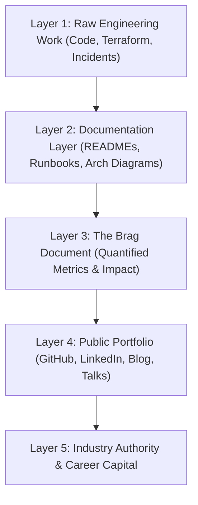

# High-Impact Portfolio Refinement & Industry Presentation

Version: 1.0.0

Purpose: Canonical lesson structure for Platform Engineering & AI Infrastructure Curriculum.

# Lesson Overview

This lesson guides platform engineers on how to package their technical skills, capstone projects, and open-source contributions into a high-impact, professional portfolio. It covers the strategic presentation of architectural blueprints, the critical importance of technical writing, and how to build an authoritative industry presence. It is essential because in a highly competitive market, raw technical skill is often invisible until it is translated into a compelling narrative that recruiters, hiring managers, and industry peers can easily consume.

---

# Learning Objectives

* Structure a technical portfolio (GitHub, personal site) that highlights architectural decision-making and business impact rather than just dumping raw code.
* Write compelling, production-grade `README` files and architectural blueprints for capstone projects.
* Leverage technical blogging, conference proposals (CFPs), and open-source contributions to build industry authority.
* Create and maintain a comprehensive "Brag Document" to negotiate promotions and effectively market engineering capabilities internally and externally.

---

# Prerequisites

* **MOD-CAP-01 & MOD-CAP-02:** Completion of the architectural Capstone Projects.
* **MOD-CAR-03:** Behavioral Engineering Interviews & Engineering Communication.

---

# Why This Exists

Many brilliant engineers struggle to advance their careers because their work is hidden behind corporate firewalls or buried in unreadable GitHub repositories. A hiring manager spending 60 seconds reviewing a resume will not clone your repository and read your Terraform state files. They will, however, read a well-structured `README` featuring a clear Mermaid diagram and a summary of the trade-offs you navigated. This lesson exists to teach you how to market your engineering capabilities. You are transitioning from writing code for machines to writing technical narratives for humans.

---

# Core Concepts

## The "Proof of Work" Paradigm
In modern platform engineering, your degree or certifications matter less than your "Proof of Work." A portfolio is not a list of tutorials you completed; it is verifiable evidence that you can build, deploy, and explain complex systems. Your Capstone projects (Internal Developer Platform, AI Inference Engine) serve as this primary proof.

## The Production-Grade README
Your GitHub profile is your new resume. The `README.md` of your core projects is the most important document you will write. A production-grade README includes:
1.  **High-Level Overview:** What does this do? (2 sentences).
2.  **Architecture Diagram:** A clean, easy-to-read Mermaid or Excalidraw diagram.
3.  **Core Technologies Used:** Don't just list them; explain *why* (e.g., "Kafka for asynchronous event decoupling").
4.  **How to Run It:** Concrete, copy-pasteable commands to spin up the infrastructure (e.g., `make deploy`).
5.  **Engineering Decisions & Trade-offs:** The most critical section for senior roles. Detail what you sacrificed to achieve your design goals.

## The "Brag Document"
A Brag Document is an internal, continuously updated record of your achievements, metrics, and incident responses. When performance review season arrives, or when you are updating your resume, you do not rely on memory. You pull from your Brag Document. It tracks:
- **Projects delivered:** (e.g., "Migrated 50 microservices to Kubernetes").
- **Metrics moved:** (e.g., "Reduced AWS bill by 15%").
- **Mentorship:** (e.g., "Onboarded 3 junior engineers").

## Technical Writing & Industry Presence
Building authority requires public output. This can take several forms:
- **Technical Blogging:** Writing about *how* you solved a specific problem (e.g., "How I reduced our CI/CD pipeline from 20 minutes to 3 minutes"). Medium, Dev.to, or a personal Substack.
- **Open Source Contributions:** Submitting PRs to upstream projects (e.g., fixing a documentation bug in Terraform, or contributing a module).
- **Public Speaking (CFPs):** Submitting talks to local meetups, KubeCon, or DevOpsDays.

---

# Architecture

---

# Real-World Example

Consider a mid-level engineer looking to transition to a Senior Platform role. They spent six months building an automated database backup system at their current job. 
*   **The Invisible Approach:** They update their resume with a bullet point: "Built automated database backups." They apply to 50 jobs and hear nothing back.
*   **The High-Impact Approach:** They write a sanitized, generalized technical blog post titled "Architecting Zero-Downtime Database Backups at Scale using Kubernetes CronJobs and S3." They include a Mermaid diagram. They link this post on LinkedIn and pin it to their GitHub. During an interview, when asked about databases, they point the hiring manager to the article. The article serves as undeniable, authoritative proof of their seniority.

---

# Hands-on Demonstration

**Scenario:** Transforming a weak GitHub repository into a high-impact portfolio piece.

**Step 1: The Weak State**
*   Repository Name: `k8s-project`
*   README: "This is my k8s project. Run `kubectl apply -f .`"
*   *Recruiter Reaction:* Closes the tab immediately.

**Step 2: The Refinement (Applying the Framework)**
*   Repository Name: `enterprise-rag-inference-platform`
*   README Transformation:
    *   **Title:** Enterprise RAG Platform Blueprint
    *   **Description:** A highly available, multi-node Kubernetes blueprint for serving LLM inference with vector database RAG capabilities, deployed via GitOps (ArgoCD).
    *   **Diagram:** (Inserts Mermaid diagram showing the user flow through the Ingress to the LLM pod and the Vector DB).
    *   **Trade-offs Section:** "I chose Qdrant over Milvus for the Vector DB due to lower memory overhead in single-node configurations, accepting the trade-off of slightly lower throughput at massive scale."
    *   **Quickstart:** Provides a `Makefile` that uses Minikube or Kind to spin up the entire cluster locally in one command.

**Step 3: The Result**
*   *Hiring Manager Reaction:* Reads the trade-offs section, recognizes senior-level architectural thinking, and immediately schedules an interview.

---

# Hands-on Lab

* **Objective:** Audit and refine your primary Capstone Project's GitHub repository.
* **Estimated Time:** 60 minutes
* **Difficulty:** Intermediate
* **Environment:** GitHub, Markdown Editor.

## Step-by-step Instructions

1. **Select your Capstone:** Open the repository for your primary Capstone Project (e.g., The AI Inference Engine or the Internal Developer Platform).
2. **Draft the "Trade-offs" Section:** In the README, create a header titled `## Architectural Decisions & Trade-offs`. Write three bullet points detailing a specific technical choice you made, what you gained, and what you sacrificed.
3. **Embed Architecture:** Create a Mermaid diagram visualizing the system. Embed it directly into the README.
4. **The 30-Second Test:** Send the link to a peer (or an AI assistant). Ask them: "Based on the first 30 seconds of looking at this README, what problem does this solve, and how senior is the engineer who built it?"
5. **Update LinkedIn/Resume:** Translate the core achievement of this project into a STAR-formatted bullet point for your resume, ensuring it includes a quantifiable metric.

## Verification

Your README should be at least 500 words long, contain a visual diagram, explicit setup instructions, and a discussion of engineering trade-offs.

## Troubleshooting

*   **"My project isn't finished yet":** That's fine. Add a `## Roadmap` or `## Known Issues` section. Documenting what is broken and how you plan to fix it actually signals maturity.
*   **Diagrams look messy:** Keep Mermaid diagrams strictly linear (top-to-bottom). If the system is too complex, break it into two diagrams: one for the "Happy Path" user flow, and one for the Deployment/Infrastructure architecture.

## Cleanup

Commit your README changes and pin the repository to the top of your GitHub profile.

---

# Production Notes

*   **Quality over Quantity:** Having 50 repositories of half-finished tutorials is a negative signal. Having 2 polished, production-grade, well-documented projects pinned to your profile is a massive positive signal. Delete or private the noise.
*   **Sanitize Company Data:** When building your Brag Document or writing blog posts based on work experience, meticulously sanitize all proprietary data, IP, and specific numbers. Talk about "a Fortune 500 client" or "a 30% reduction," not exact revenue figures or client names.
*   **The "Makefile" Rule:** If an interviewer or peer tries to run your project and it takes more than three commands or fails due to missing dependencies, they will give up. Wrap your complexity in a `Makefile` or setup script (e.g., `make deploy-local`).

---

# Common Mistakes

*   **Treating documentation as an afterthought:** Code is read 10x more than it is written. If you write brilliant Terraform modules but zero documentation on how to consume them, your impact is zero.
*   **The "Tutorial Trap":** Putting a standard "To-Do App" on your portfolio. Platform engineers need to demonstrate infrastructure, scaling, and automation, not basic frontend framework knowledge.
*   **Hiding failures:** Your portfolio should include the hard lessons. Writing a blog post titled "How I accidentally deleted production and what I learned about Terraform State" will get more traction and respect than a generic tutorial.

---

# Failure-Driven Learning

**Scenario:** You submit your resume and GitHub profile to 100 companies and get zero interviews. You assume your technical skills are lacking, so you spend a month learning another tool (e.g., Pulumi) and build another silent repository. Still zero responses.

**The Failure:** You are experiencing a marketing failure, not a technical failure. Your proof of work is invisible or illegible.

**Diagnosis:** A recruiter looked at your GitHub. They saw a wall of un-documented repositories with default names like `test-app`. They couldn't determine your skill level, so they moved to the next candidate.

**Recovery:** Stop coding. Spend a week writing. Condense your 15 repositories into the 2 best ones. Write exhaustive, professional READMEs for them. Create a 3-minute Loom video demonstrating the architecture and link it. Update your LinkedIn to highlight the *impact* of these architectures. You must reduce the cognitive load required for someone to realize you are competent.

---

# Engineering Decisions

Choosing where to establish your industry presence is a strategic decision.
*   **Blogging (Medium/Substack):** Best for deep-dive technical explanations and architectural thoughts. Good for long-term SEO and authority.
*   **Open Source (GitHub PRs):** Best for proving you can navigate massive, complex, legacy codebases and collaborate with strict maintainers. Excellent signal for Senior/Staff roles.
*   **Public Speaking:** Best for rapid networking and establishing executive presence, but requires significant preparation and soft-skill mastery.

---

# Best Practices

*   **Keep the Brag Document Updated Weekly:** If you wait until the end of the year to write your performance review, you will forget 80% of your impact. Spend 10 minutes every Friday updating it.
*   **Read the Source Code:** To become a better technical writer and engineer, read the READMEs and source code of major open-source projects (e.g., Kubernetes, Prometheus). Emulate their documentation standards.
*   **Always Be Teaching:** The best way to demonstrate mastery is to teach it. Frame your portfolio pieces and blog posts as educational resources for the community.

---

# Troubleshooting Guide

## Issue 1: You suffer from severe Imposter Syndrome and feel your work isn't "good enough" to share publicly.

*   **Cause:** Comparing your raw, first-draft work to the highly polished, edited work of industry veterans.
*   **Diagnosis:** You are paralyzed by perfectionism and haven't published anything in a year.
*   **Solution:** Lower the barrier to entry. Write a "Today I Learned" (TIL) blog post. It doesn't have to be a groundbreaking architectural manifesto. Explaining a simple bug fix in a clear way is highly valuable to someone else facing that exact bug.

## Issue 2: During an interview, you can't remember the specifics of a project on your resume.

*   **Cause:** The project was completed 2 years ago, and you didn't maintain a Brag Document.
*   **Diagnosis:** You stumble over the details, making the interviewer question if you actually did the work.
*   **Solution:** Before the interview, review the README and source code of the projects you listed. Never put a technology or project on your resume that you cannot confidently discuss in depth for 15 minutes.

---

# Summary

A platform engineer's career trajectory is heavily influenced by their ability to communicate their value. By treating your portfolio as a production product, maintaining a rigorous Brag Document, and publicly sharing your architectural insights and lessons learned, you transition from being an invisible contributor to an authoritative engineering leader. Your code solves the technical problem; your presentation solves the career problem.

---

# Cheat Sheet

*   **The Golden README Structure:** Overview -> Architecture Diagram -> Trade-offs -> Quickstart Guide -> Roadmap.
*   **The Brag Document Format:** Date | Project | My Specific Contribution | Quantifiable Metric (Impact).
*   **Resume Bullet Point Formula:** Accomplished [X] as measured by [Y], by doing [Z]. (e.g., "Reduced deployment time by 40% (X), saving 50 eng-hours/month (Y), by migrating CI/CD to GitHub Actions (Z)").

---

# Knowledge Check

## Multiple Choice Questions

1. What is the primary purpose of a "Brag Document"?
   * A) To complain about coworkers to HR.
   * B) To maintain a continuous, quantified record of your engineering impact for performance reviews and resume updates.
   * C) To publicly shame other developers for bad code.
   * D) To track your daily caloric intake.

2. When a hiring manager reviews a project repository in your portfolio, what is the most critical section they are looking for to evaluate your seniority?
   * A) The license file.
   * B) A list of every single NPM package used.
   * C) The "Engineering Decisions & Trade-offs" section.
   * D) The commit history from 3 years ago.

## Scenario Questions

You have built a highly complex, multi-region Kubernetes cluster for your capstone project using Terraform. It is a masterpiece of engineering. However, the README only says: "Run terraform apply." A recruiter looks at it and rejects you. What is the core architectural failure of your portfolio presentation?

## Short Answer Questions

Explain why having 2 polished, well-documented projects on GitHub is better than having 50 undocumented, half-finished tutorial repositories.

<b>View Answers</b>

### Multiple Choice
1. **[B]** - *A Brag Document prevents you from forgetting your accomplishments and provides the concrete metrics needed to negotiate promotions.*
2. **[C]** - *Seniority is defined by the ability to navigate trade-offs. Explaining why you chose a technology (and what it cost you) provides a much stronger signal than simply listing the technology.*

### Scenario
*The core failure is poor technical communication and high cognitive load. The recruiter (and often the hiring manager) does not have the time to read raw Terraform code to understand the architecture. By failing to include an architecture diagram, a high-level summary, and a discussion of trade-offs, you made the project incomprehensible to anyone who didn't write it. You failed to translate raw code into an understandable product.*

### Short Answer
*50 undocumented repositories signal a lack of follow-through and poor communication skills; it looks like "noise." 2 highly polished projects demonstrate deep technical capability, the discipline to finish a product, and the communication skills required to document it for others. Quality and presentation always trump volume in engineering portfolios.*

---

# Interview Preparation

## Beginner Questions

* What are the essential components of a production-grade README?
* Describe the difference between a resume and a Brag Document.

## Intermediate Questions

* How do you balance the need to showcase your technical skills publicly with the need to protect your current employer's proprietary information?
* If you were reviewing a junior engineer's portfolio, what are the red flags you would look for?

## Advanced Questions

* Explain the strategy behind using technical blogging to build industry authority. What types of topics yield the highest return on investment?
* How do you leverage open-source contributions to signal seniority, rather than just submitting typo fixes to documentation?

## Scenario-Based Discussions

* Scenario: You are preparing for your annual performance review. You want a promotion to Senior Platform Engineer, but your manager says, "You do good work, but I don't see the systemic impact." Walk me through how you use your Brag Document to change their mind.

<b>View Answers</b>

### Beginner
* **What are the essential components...**: A high-level overview, an architecture diagram (Mermaid/Excalidraw), a discussion of engineering trade-offs, and a copy-pasteable "Quickstart" or "How to Run" section.
* **Describe the difference between...**: A resume is a highly condensed, public-facing summary tailored for a specific job application. A Brag Document is an exhaustive, private, continuously updated log of every metric, incident, and project you touch, used as the raw material to build the resume.

### Intermediate
* **How do you balance the need to showcase...**: Meticulous sanitization. Focus the narrative on the *architectural pattern* or the *tooling integration*, not the business logic. Change specific metrics ("saved $1M") to percentages ("reduced costs by 20%"). Never use internal system names or client data.
* **If you were reviewing a junior engineer's...**: Red flags include: repositories with default names (`my-app`), lack of READMEs, committing secrets to public repos, tutorials passed off as original work, and a lack of any stated "why" behind the technology choices.

### Advanced
* **Explain the strategy behind using technical blogging...**: The highest ROI comes from writing "Failure & Recovery" posts or "Architectural Deep Dives." Writing "How to install Nginx" is low ROI (it's been done). Writing "How we migrated from Nginx to Envoy and reduced P99 latency by 40%" signals extreme seniority and attracts engineering leadership.
* **How do you leverage open-source contributions...**: Move beyond typo fixes. Look for established projects (e.g., a Terraform provider) and look at their open "Good First Issues" regarding bugs or missing minor features. Submitting a well-tested PR that fixes a bug demonstrates you can read complex legacy code, follow strict CI/CD guidelines, and communicate professionally with maintainers.

### Scenario-Based Discussions
* **Scenario: You are preparing for your annual...**:
  * *The Approach:* Do not argue emotionally. Bring the data. Open the Brag Document. Say, "I understand the need for systemic impact. Over the last 6 months, I automated the database backup process (Project), which reduced manual SRE toil by 15 hours a week (Metric/Impact). I also led the blameless postmortem for the March outage, resulting in three new CI/CD checks that prevented two subsequent regressions (Impact). Based on this data, I am operating at the Senior level."

---

# Further Reading

1. [Get your work recognized: write a brag document (Julia Evans)](https://jvns.ca/blog/brag-documents/)
2. [How to Write a Good README (Make a README)](https://www.makeareadme.com/)
3. [Writing for Software Developers (Philip Kiely)](https://philipkiely.com/wfsd/)
4. [The Tech Resume Inside Out (Gergely Orosz)](https://thetechresume.com/)
5. [Standard Resume Bullet Formula (Laszlo Bock, Google)](https://www.inc.com/bill-murphy-jr/google-recruiters-say-these-5-resume-tips-including-x-y-z-formula-will-improve-your-odds-of-getting-hired-at-google.html)
